# `fluidsynth.py`

## `mingus.midi.fluidsynth.FluidSynthSequencer` · *class*

## Summary:
A MIDI sequencer implementation that uses FluidSynth as the audio synthesis backend for playing musical notes and sequences.

## Description:
The FluidSynthSequencer class provides a concrete implementation of the Sequencer base class that leverages FluidSynth for MIDI audio synthesis. It enables playing musical notes, controlling instruments, and managing sequencer events through FluidSynth's audio engine. This class serves as a bridge between the abstract MIDI sequencing interface defined by Sequencer and the concrete FluidSynth audio synthesis capabilities.

The class is designed to be instantiated by users who want to play MIDI sequences through FluidSynth audio output, either directly or with recording capabilities. It handles the low-level FluidSynth operations such as starting audio output, loading sound fonts, and processing MIDI events.

## State:
- fs (fs.Synth): Instance of FluidSynth synthesizer object used for audio synthesis
- sfid (int): Sound font ID loaded from a sound font file, used for instrument selection
- wav (wave.Wave_write): Wave file writer object used when recording audio output
- output (None): Class-level attribute inherited from Sequencer, currently unused

## Lifecycle:
- Creation: Instantiate with `FluidSynthSequencer()` constructor, which initializes the FluidSynth synthesizer instance for MIDI audio processing
- Usage: Call methods in sequence - first `load_sound_font()` to load a sound font, then `start_audio_output()` to initialize audio, followed by playback methods like `play_Note()`, `play_Bar()`, etc. Recording can be started with `start_recording()` before playback
- Destruction: Automatically cleaned up by Python's garbage collector, which calls `__del__()` to delete the FluidSynth instance

## Method Map:
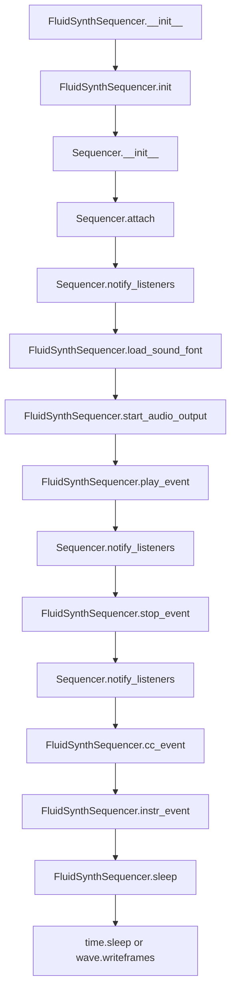

## Raises:
- None explicitly raised by __init__ method
- Exceptions may be raised by underlying FluidSynth operations when invalid parameters are passed to methods like `load_sound_font()`, `start_audio_output()`, or `play_event()`

## Example:
```python
# Create a FluidSynth sequencer
sequencer = FluidSynthSequencer()

# Load a sound font
success = sequencer.load_sound_font("/path/to/soundfont.sf2")
if not success:
    raise Exception("Failed to load sound font")

# Start audio output
sequencer.start_audio_output()

# Play a note
sequencer.play_Note("C4", channel=1, velocity=100)

# Stop the note
sequencer.stop_Note("C4", channel=1)

# Record audio output to file
sequencer.start_recording("output.wav")

# Sleep for 2 seconds
sequencer.sleep(2.0)

# Clean up automatically when done
del sequencer
```

### `mingus.midi.fluidsynth.FluidSynthSequencer.init` · *method*

## Summary:
Initializes the FluidSynth synthesizer instance for MIDI audio processing.

## Description:
This method creates and assigns a new FluidSynth Synth object to the instance's fs attribute. It is called during the initialization phase of the FluidSynthSequencer to set up the underlying audio synthesis engine that will process MIDI events.

## Args:
    None

## Returns:
    None

## Raises:
    None explicitly raised

## State Changes:
    Attributes READ: None
    Attributes WRITTEN: self.fs - assigned a new fs.Synth() instance

## Constraints:
    Preconditions: The FluidSynthSequencer instance must be properly instantiated
    Postconditions: The self.fs attribute will reference a valid FluidSynth Synth object

## Side Effects:
    None

### `mingus.midi.fluidsynth.FluidSynthSequencer.__del__` · *method*

## Summary:
Cleans up FluidSynth resources when the sequencer object is garbage collected.

## Description:
This destructor method ensures proper cleanup of FluidSynth synthesizer resources by calling the delete method on the underlying FluidSynth instance. It is automatically invoked during object destruction/garbage collection.

## Args:
    None

## Returns:
    None

## Raises:
    AttributeError: If self.fs is not initialized (though this would be unusual as init() should set it)

## State Changes:
    Attributes READ: self.fs
    Attributes WRITTEN: None

## Constraints:
    Preconditions: The object must have been properly initialized with self.fs set to a valid FluidSynth instance
    Postconditions: FluidSynth resources associated with this sequencer are released

## Side Effects:
    Calls the FluidSynth delete() method which releases system resources and potentially audio device handles

### `mingus.midi.fluidsynth.FluidSynthSequencer.start_audio_output` · *method*

## Summary:
Starts the audio output system for MIDI playback using the FluidSynth synthesizer.

## Description:
Initializes and starts the audio driver for the FluidSynth synthesizer instance. This method prepares the system to output audio from MIDI events by configuring the appropriate audio driver. It is typically called during the setup phase of MIDI playback to enable sound generation.

## Args:
    driver (str, optional): Audio driver to use for output. Valid options include 'alsa', 'oss', 'jack', 'portaudio', 'sndmgr', 'coreaudio', 'Direct Sound', 'dsound', and 'pulseaudio'. If None, uses the default audio driver.

## Returns:
    None: This method does not return any value.

## Raises:
    AssertionError: When an invalid driver name is provided (driver must be one of the supported audio drivers).

## State Changes:
    Attributes READ: self.fs
    Attributes WRITTEN: None

## Constraints:
    Preconditions: 
    - The FluidSynthSequencer must be properly initialized (self.fs must be a valid Synth instance)
    - The audio driver, if specified, must be one of the supported driver names
    
    Postconditions:
    - The audio driver is configured and started for the FluidSynth instance
    - Audio output is enabled for subsequent MIDI events

## Side Effects:
    - Initializes audio hardware through the underlying FluidSynth library
    - May cause system audio configuration changes
    - Creates system resources for audio processing

### `mingus.midi.fluidsynth.FluidSynthSequencer.start_recording` · *method*

## Summary:
Initializes a WAV file for audio recording with standard stereo 16-bit PCM format at 44.1kHz sample rate.

## Description:
Sets up a WAV file for recording audio output from the synthesizer. This method prepares the audio file with standard parameters (stereo, 16-bit samples, 44.1kHz) and stores the file handle for subsequent audio frame writes during playback operations.

## Args:
    file (str): Path to the WAV file to create for recording. Defaults to "mingus_dump.wav".

## Returns:
    None: This method does not return a value.

## Raises:
    IOError: If the specified file cannot be opened for writing.

## State Changes:
    Attributes READ: None
    Attributes WRITTEN: self.wav - stores the wave file handle for later audio frame writes

## Constraints:
    Preconditions: The method assumes the file path is writable and the system has sufficient disk space.
    Postconditions: The self.wav attribute is set to a valid wave file handle ready for writing audio frames.

## Side Effects:
    I/O: Creates or overwrites a WAV file on the filesystem with the specified path.
    External service calls: Uses Python's built-in wave module to create and configure the WAV file.

### `mingus.midi.fluidsynth.FluidSynthSequencer.load_sound_font` · *method*

## Summary:
Loads a sound font file into the FluidSynth synthesizer and returns whether the operation was successful.

## Description:
This method initializes a sound font by loading a .sf2 file into the FluidSynth synthesizer instance. It serves as the primary interface for adding sound libraries to the sequencer, enabling playback of musical notes with specific instrument sounds. The method is typically called during sequencer initialization or when switching sound fonts during runtime.

The FluidSynth library returns -1 when sound font loading fails, and a positive integer (sound font ID) when successful. This method translates that result into a boolean return value for easier consumption.

## Args:
    sf2 (str): Path to the sound font file (.sf2) to be loaded into the synthesizer.

## Returns:
    bool: True if the sound font was successfully loaded (sfid != -1), False otherwise.

## Raises:
    None: This method does not explicitly raise exceptions, though underlying FluidSynth operations may raise exceptions.

## State Changes:
    Attributes READ: None
    Attributes WRITTEN: self.sfid (stores the sound font ID returned by FluidSynth)

## Constraints:
    Preconditions:
    - The sf2 parameter must be a valid path to a sound font file
    - The FluidSynth synthesizer instance (self.fs) must be properly initialized
    - The sound font file must be in a compatible format (.sf2)
    
    Postconditions:
    - If successful, self.sfid will contain a valid sound font ID (positive integer)
    - If failed, self.sfid will be set to -1

## Side Effects:
    I/O: Reads from the file system to load the sound font file
    External service call: Invokes FluidSynth's sfload function

### `mingus.midi.fluidsynth.FluidSynthSequencer.play_event` · *method*

## Summary:
Plays a musical note using the FluidSynth synthesizer by sending a note-on message.

## Description:
This method sends a note-on event to the FluidSynth synthesizer instance, triggering the playback of a musical note. It is part of the sequencer's event handling system and is called internally by higher-level methods like `play_Note` to generate audio output.

## Args:
    note (int): MIDI note number to play (0-127)
    channel (int): MIDI channel number (0-15)
    velocity (int): Note velocity (0-127), representing note attack strength

## Returns:
    None: This method does not return any value

## Raises:
    AttributeError: If self.fs is not properly initialized (though this would typically occur during initialization)

## State Changes:
    Attributes READ: self.fs
    Attributes WRITTEN: None

## Constraints:
    Preconditions: 
    - self.fs must be initialized (typically done in init() method)
    - note must be within valid MIDI range (0-127)
    - channel must be within valid MIDI channel range (0-15)
    - velocity must be within valid MIDI velocity range (0-127)
    
    Postconditions: 
    - The specified note will begin playing through the FluidSynth synthesizer
    - No changes are made to the FluidSynthSequencer object's state beyond the synthesizer call

## Side Effects:
    - Calls the underlying FluidSynth library's noteon method
    - May produce audible sound through audio output drivers
    - May cause I/O operations if recording is enabled

### `mingus.midi.fluidsynth.FluidSynthSequencer.stop_event` · *method*

## Summary:
Stops a musical note by sending a note-off message to the FluidSynth synthesizer.

## Description:
This method sends a note-off command to the FluidSynth synthesizer instance, effectively stopping the playback of a specific note on a given MIDI channel. It is part of the sequencer interface and is called when notes need to be terminated during music playback. This method is implemented as part of the FluidSynthSequencer class which inherits from Sequencer.

## Args:
    note (int): The MIDI note number to stop (typically 0-127)
    channel (int): The MIDI channel number (typically 0-15)

## Returns:
    None: This method does not return any value

## Raises:
    AttributeError: If self.fs is not properly initialized or does not have a noteoff method

## State Changes:
    Attributes READ: self.fs
    Attributes WRITTEN: None

## Constraints:
    Preconditions: 
    - self.fs must be a valid FluidSynth instance with a noteoff method
    - note must be a valid MIDI note number (typically 0-127)
    - channel must be a valid MIDI channel number (typically 0-15)
    
    Postconditions:
    - The specified note will be stopped on the given channel
    - No changes to the FluidSynthSequencer object's state

## Side Effects:
    - Calls the underlying FluidSynth library's noteoff function
    - May cause audio output to stop for the specified note/channel combination

### `mingus.midi.fluidsynth.FluidSynthSequencer.cc_event` · *method*

## Summary:
Sends a MIDI control change message to the fluidsynth synthesizer instance.

## Description:
This method serves as a bridge between the MIDI sequencer interface and the fluidsynth synthesizer backend. It is invoked by the parent class's `control_change` method when processing MIDI control change events. The method directly delegates to the fluidsynth synthesizer's `cc` method to modify controller values on a specific MIDI channel.

## Args:
    channel (int): The MIDI channel number (typically 0-15) to send the control change message to.
    control (int): The control number (typically 0-127) specifying which controller to modify.
    value (int): The control value (typically 0-127) to set the controller to.

## Returns:
    None: This method does not return any value.

## Raises:
    None: This method does not explicitly raise exceptions, though underlying fluidsynth operations may raise exceptions.

## State Changes:
    Attributes READ: self.fs
    Attributes WRITTEN: None

## Constraints:
    Preconditions: 
    - The FluidSynthSequencer must be properly initialized with a fluidsynth synthesizer instance
    - Channel must be a valid MIDI channel number (typically 0-15)
    - Control must be a valid MIDI control number (typically 0-127)
    - Value must be a valid MIDI control value (typically 0-127)
    
    Postconditions: 
    - The fluidsynth synthesizer receives and processes the control change message
    - No changes are made to the FluidSynthSequencer object's state

## Side Effects:
    - Calls the fluidsynth synthesizer's `cc` method which may result in audio synthesis changes
    - May cause audible changes in the sound output if the control change affects volume, pitch bend, or other audio parameters

### `mingus.midi.fluidsynth.FluidSynthSequencer.instr_event` · *method*

## Summary:
Sets the instrument for a MIDI channel using FluidSynth's program select functionality.

## Description:
This method configures a MIDI channel to use a specific instrument from a soundfont. It is called internally by the `set_instrument` method when changing instruments in a sequenced performance. The method delegates to FluidSynth's `program_select` function to apply the instrument change.

## Args:
    channel (int): The MIDI channel number (typically 0-15) to configure.
    instr (int): The instrument number to select within the specified bank.
    bank (int): The bank number containing the instrument.

## Returns:
    None: This method does not return a value.

## Raises:
    AttributeError: If `self.fs` or `self.sfid` attributes are not properly initialized.

## State Changes:
    Attributes READ: self.fs, self.sfid
    Attributes WRITTEN: None

## Constraints:
    Preconditions: 
    - `self.fs` must be a valid FluidSynth instance with program_select method
    - `self.sfid` must be a valid soundfont ID loaded in the FluidSynth instance
    - Channel must be in the valid range (typically 0-15)
    - Instrument and bank numbers must be valid for the loaded soundfont
    
    Postconditions: 
    - The specified MIDI channel will use the requested instrument for subsequent note events

## Side Effects:
    - Calls FluidSynth's program_select function which may involve system calls to the underlying audio synthesis engine
    - May affect audio output by changing the instrument assigned to the specified channel

### `mingus.midi.fluidsynth.FluidSynthSequencer.sleep` · *method*

## Summary:
Pauses execution for a specified duration while optionally capturing audio samples during the sleep period.

## Description:
This method provides a flexible sleep mechanism that behaves differently based on whether audio recording is active. When audio recording is enabled via `start_recording()`, it captures audio samples during the sleep period and writes them to the WAV file. Otherwise, it performs a standard time-based sleep.

## Args:
    seconds (float): Number of seconds to pause execution. Must be non-negative.

## Returns:
    None: This method does not return a value.

## Raises:
    AttributeError: If `self.wav` exists but audio capture fails due to invalid state.
    IOError: If writing audio frames to the WAV file fails.

## State Changes:
    Attributes READ: 
        - self.wav: Checked for existence to determine recording mode
        - self.fs: Used to retrieve audio samples during recording
    Attributes WRITTEN: 
        - self.wav: Modified by writing audio frames during recording

## Constraints:
    Preconditions:
        - If `self.wav` attribute exists, it must be a valid wave file object opened in write mode
        - `self.fs` must be initialized (via `init()` method) when recording
        - `seconds` must be a non-negative number
    Postconditions:
        - Execution pauses for approximately `seconds` duration
        - If recording, audio frames are written to the WAV file
        - If not recording, standard sleep behavior occurs

## Side Effects:
    - I/O operations: Writes audio frames to WAV file when recording is active
    - External service calls: Calls FluidSynth audio rendering functions
    - Time delay: Execution is suspended for the specified duration

## `mingus.midi.fluidsynth.init` · *function*

## Summary:
Initializes the FluidSynth MIDI synthesizer with a sound font and configures audio output or recording.

## Description:
This function serves as the entry point for setting up the FluidSynth MIDI system. It ensures that the MIDI synthesizer is properly initialized with a sound font and appropriate audio configuration. The function is designed to be idempotent - it will only perform initialization once, even if called multiple times.

The function supports two operational modes: audio output through a specified driver or recording to a WAV file. It loads the specified sound font file (.sf2) and resets the program state to ensure clean operation.

## Args:
    sf2 (str): Path to the SoundFont file (.sf2) to load for MIDI synthesis
    driver (str, optional): Audio driver name to use for output (e.g., 'alsa', 'pulseaudio'). Defaults to None.
    file (str, optional): Path to WAV file for recording MIDI output. If provided, recording mode is used instead of audio output. Defaults to None.

## Returns:
    bool: True if initialization was successful or already completed, False if sound font loading failed.

## Raises:
    None explicitly raised in the function body, but underlying operations may raise exceptions from pyfluidsynth.

## Constraints:
    Preconditions:
    - The sf2 parameter must point to a valid SoundFont file
    - If file is provided, it must be a valid path for writing audio data
    - If driver is provided, it must be a supported audio driver name
    
    Postconditions:
    - Global variable 'initialized' is set to True upon successful initialization
    - Global variable 'midi' is properly configured with audio output or recording setup
    - Sound font is loaded and available for MIDI synthesis
    - Program state is reset for clean operation

## Side Effects:
    - Creates or opens audio output device via the specified driver
    - May create or overwrite a WAV file when recording mode is used
    - Modifies global state variables 'midi' and 'initialized'
    - Loads sound font data into memory

## Control Flow:
```mermaid
flowchart TD
    A[init called] --> B{initialized?}
    B -- No --> C{file provided?}
    C -- Yes --> D[start_recording(file)]
    C -- No --> E[start_audio_output(driver)]
    D --> F[load_sound_font(sf2)]
    E --> F
    F --> G{load successful?}
    G -- No --> H[return False]
    G -- Yes --> I[program_reset()]
    I --> J[initialized = True]
    J --> K[return True]
    B -- Yes --> K
```

## Examples:
```python
# Initialize with audio output using default driver
init("soundfont.sf2")

# Initialize with specific audio driver
init("soundfont.sf2", driver="pulseaudio")

# Initialize with recording to file
init("soundfont.sf2", file="output.wav")
```

## `mingus.midi.fluidsynth.play_Note` · *function*

## Summary:
Plays a single MIDI note by delegating to the underlying MIDI system.

## Description:
This function acts as a simple wrapper that forwards note playback requests to the underlying MIDI system's play_Note function. It provides a standardized interface for playing individual MIDI notes with configurable channel and velocity parameters.

Known callers include:
- Direct user code calling the function to play individual notes
- Other functions in the fluidsynth module that require note playback capability

This function exists to provide a clean abstraction layer for MIDI note playback while maintaining compatibility with the underlying MIDI implementation.

## Args:
    note (int or str): The MIDI note to play, represented as either a numeric value or note name string
    channel (int): MIDI channel number (0-15), defaults to 1
    velocity (int): Note velocity (0-127) representing note attack strength, defaults to 100

## Returns:
    Returns the result directly from the underlying `midi.play_Note` function call.

## Raises:
    Exception: May raise exceptions from the underlying `midi.play_Note` implementation, though specific exceptions are not defined in this wrapper.

## Constraints:
    Preconditions:
    - The underlying MIDI system must be properly initialized
    - Note values should be valid for the underlying MIDI implementation
    - Channel must be within valid MIDI channel range (0-15)
    - Velocity must be within valid MIDI velocity range (0-127)
    
    Postconditions:
    - The specified note will be played through the underlying MIDI system
    - The note will be played on the specified channel with the specified velocity

## Side Effects:
    - Delegates to the underlying MIDI system's play_Note function
    - May produce audible sound through configured audio output devices
    - May cause I/O operations if audio recording is enabled

## Control Flow:
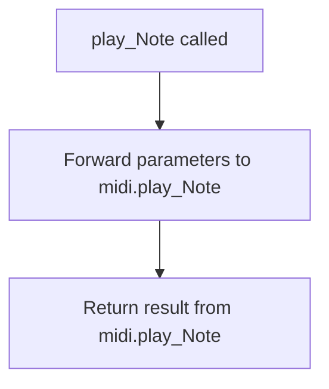

## Examples:
```python
# Play middle C on channel 1 with default velocity
play_Note(60)

# Play a note with custom channel and velocity
play_Note('A#5', channel=2, velocity=120)
```

## `mingus.midi.fluidsynth.stop_Note` · *function*

## Summary:
Delegates note stopping functionality to the underlying MIDI implementation.

## Description:
This function acts as a wrapper that forwards note stopping requests to the underlying MIDI system. It provides a consistent interface for stopping musical notes within the fluidsynth MIDI backend of the mingus library.

## Args:
    note (any): The musical note to stop. The expected format depends on the underlying MIDI implementation.
    channel (int, optional): The MIDI channel number on which to stop the note. Defaults to 1.

## Returns:
    Returns the result of calling the underlying midi.stop_Note function with the provided arguments.

## Raises:
    Exceptions raised depend entirely on the implementation of the underlying midi.stop_Note function.

## Constraints:
    Preconditions:
    - Valid note and channel parameters must be provided for the underlying implementation to process
    - The underlying MIDI system must be properly initialized
    
    Postconditions:
    - The function call will delegate to the appropriate MIDI stopping mechanism

## Side Effects:
    - Interacts with the fluidsynth MIDI synthesizer backend
    - May affect audio output by stopping sound generation

## Control Flow:
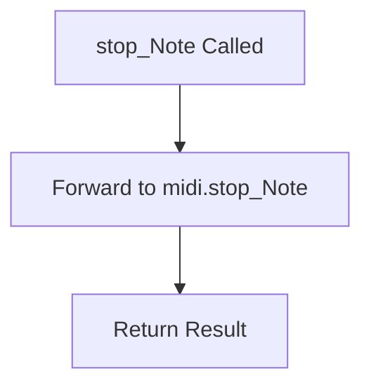

## Examples:
```python
# Basic usage - stop note on default channel
stop_Note(60)

# Specify channel explicitly  
stop_Note("C4", channel=2)
```

## `mingus.midi.fluidsynth.play_NoteContainer` · *function*

## Summary:
Delegates note playback of a NoteContainer to the underlying MIDI system.

## Description:
This function acts as a simple wrapper that forwards note container playback requests to the underlying MIDI implementation. It provides a standardized interface for playing collections of notes through the MIDI system.

Known callers include:
- Direct user code that wants to play multiple notes at once
- Higher-level functions that manage musical structures containing NoteContainers

This logic is extracted into its own function to provide a clean abstraction layer between application-level note containers and the low-level MIDI playback mechanism, ensuring consistent playback behavior across different musical contexts.

## Args:
    nc (NoteContainer or None): Container holding multiple notes to play, or None to indicate no notes. Must be iterable or None.
    channel (int): MIDI channel number (0-15) to play notes on, defaults to 1. Must be within valid MIDI channel range.
    velocity (int): Note velocity (0-127) representing note attack strength, defaults to 100. Must be within valid MIDI velocity range.

## Returns:
    The return value is determined by the underlying `midi.play_NoteContainer` implementation. Typically returns a boolean indicating success/failure of playback operation.

## Raises:
    None: This function does not explicitly raise exceptions, though the underlying implementation may raise exceptions.

## Constraints:
    Preconditions:
    - The underlying MIDI system must be properly initialized
    - NoteContainer must be iterable or None
    - Channel should be within valid MIDI channel range (0-15)
    - Velocity should be within valid MIDI velocity range (0-127)
    
    Postconditions:
    - All notes in the container will be played through the MIDI output
    - Method returns after delegating to the underlying implementation

## Side Effects:
    - Delegates to underlying MIDI system for actual note playback
    - May produce audible sound through audio output drivers
    - May cause I/O operations if recording is enabled
    - May update internal state of the MIDI synthesizer

## Control Flow:
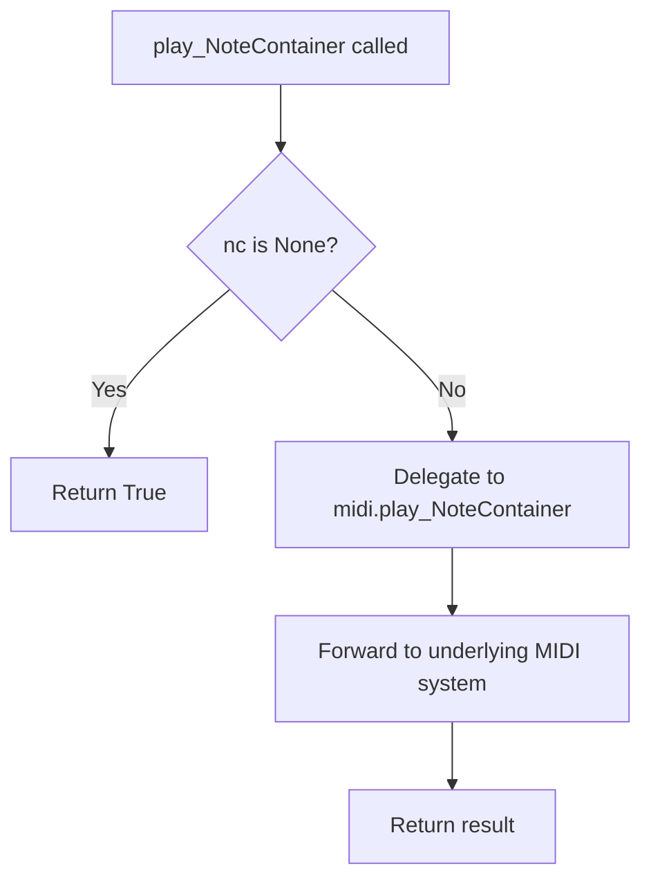

## Examples:
```python
# Play a simple chord
from mingus.containers import NoteContainer
from mingus.midi import fluidsynth

notes = NoteContainer(['C-4', 'E-4', 'G-4'])
result = fluidsynth.play_NoteContainer(notes, channel=1, velocity=100)
print(f"Playback result: {result}")

# Play with custom channel and velocity
notes = NoteContainer(['A-3', 'C-4', 'E-4'])
result = fluidsynth.play_NoteContainer(notes, channel=2, velocity=80)
```

## `mingus.midi.fluidsynth.stop_NoteContainer` · *function*

## Summary:
Wrapper function that delegates stopping of notes in a NoteContainer to the underlying MIDI implementation.

## Description:
This function serves as a thin wrapper that forwards the stop request for a NoteContainer to the appropriate MIDI implementation's stop_NoteContainer function. It provides a consistent interface for stopping musical notes contained within a NoteContainer across different MIDI backends.

The function is typically called during MIDI playback termination to ensure all notes in a container are properly stopped on the specified MIDI channel.

## Args:
    nc (NoteContainer): The NoteContainer object containing the notes to be stopped
    channel (int, optional): The MIDI channel number to stop the notes on. Defaults to 1.

## Returns:
    The return value is determined by the underlying MIDI implementation's stop_NoteContainer function.

## Raises:
    Exception: May raise exceptions from the underlying MIDI implementation when attempting to stop notes.

## Constraints:
    Preconditions:
    - The NoteContainer must be properly initialized with notes
    - The MIDI system must be properly initialized and configured
    - The specified channel must be valid for the MIDI device
    
    Postconditions:
    - The underlying MIDI implementation handles stopping of notes in the container

## Side Effects:
    - May send MIDI note-off messages to the connected MIDI device
    - May modify internal state of the MIDI sequencer
    - May update the NoteContainer's internal tracking of active notes

## Control Flow:
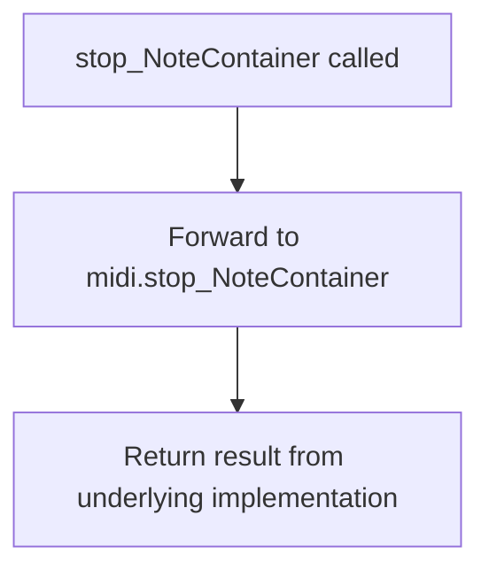

## Examples:
```python
# Stop all notes in a NoteContainer on channel 1
note_container = NoteContainer()
# ... add notes to container ...
stop_NoteContainer(note_container)

# Stop all notes in a NoteContainer on a specific channel
stop_NoteContainer(note_container, channel=2)
```

## `mingus.midi.fluidsynth.play_Bar` · *function*

## Summary:
Delegates the playback of a musical bar to the underlying MIDI system for fluidsynth-based audio synthesis.

## Description:
This function serves as a thin wrapper that forwards musical bar playback requests to the underlying MIDI system's play_Bar implementation. It provides a standardized interface for playing musical bars with configurable channel and tempo settings within the fluidsynth MIDI playback framework.

The function exists to provide a clean abstraction layer that allows higher-level code to play musical bars without needing to know the specifics of the underlying MIDI implementation. This promotes code modularity and makes it easier to switch between different MIDI backends.

## Args:
    bar (object): A musical bar or measure containing musical notes and timing information to be played
    channel (int): MIDI channel number to use for playback, defaults to 1 (valid range: 1-16)
    bpm (int): Beats per minute tempo setting for playback, defaults to 120 (positive integer)

## Returns:
    The return value is determined by the underlying `midi.play_Bar` implementation, which typically indicates the success or failure of the playback operation or a status indicator.

## Raises:
    Exception: May raise exceptions from the underlying MIDI system when playback fails, invalid parameters are provided, or audio synthesis encounters errors.

## Constraints:
    Preconditions:
    - The bar parameter must be compatible with the underlying MIDI system's expectations for musical bar data
    - The channel parameter must be a valid MIDI channel number (typically 1-16)
    - The bpm parameter must be a positive integer representing tempo

    Postconditions:
    - The musical bar will be processed by the underlying MIDI system for playback
    - The playback will occur at the specified tempo and channel through fluidsynth audio synthesis

## Side Effects:
    - Audio output through fluidsynth audio synthesis
    - Potential blocking behavior during playback duration
    - Interaction with the underlying MIDI system and fluidsynth engine
    - Possible system resource consumption for audio processing

## Control Flow:
```mermaid
flowchart TD
    A[play_Bar called] --> B{Validate parameters}
    B -->|Invalid| C[Raise exception]
    B -->|Valid| D[Call midi.play_Bar(bar, channel, bpm)]
    D --> E[Return result from midi.play_Bar]
```

## Examples:
```python
# Play a bar at default channel 1 and tempo 120 BPM
result = play_Bar(my_bar)

# Play a bar on channel 2 at 100 BPM
result = play_Bar(my_bar, channel=2, bpm=100)

# Play a bar with custom channel and tempo
result = play_Bar(my_bar, channel=10, bpm=140)
```

## `mingus.midi.fluidsynth.play_Bars` · *function*

## Summary:
Delegates musical bar playback to an underlying MIDI system using FluidSynth.

## Description:
This function serves as a wrapper that forwards musical bar playback requests to the underlying MIDI system. It accepts musical bars, channel configuration, and tempo settings, then delegates execution to the internal midi.play_Bars function for actual audio synthesis and playback.

## Args:
    bars: Musical bars or measure structures to be played
    channels: Audio channel configuration for playback  
    bpm (int, optional): Tempo setting in beats per minute. Defaults to 120.

## Returns:
    The return value is determined by the underlying midi.play_Bars implementation.

## Raises:
    Exception: May raise exceptions from the underlying MIDI playback system.

## Constraints:
    Preconditions:
    - Valid musical bars structure must be provided
    - Channels must be properly configured for audio output
    - BPM value should be within reasonable musical tempo ranges
    
    Postconditions:
    - Playback initiation occurs with specified parameters
    - Function returns control to caller

## Side Effects:
    - Initiates audio playback through FluidSynth audio synthesis
    - Interacts with system audio devices
    - May affect global audio state

## Control Flow:
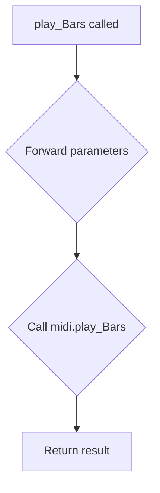

## Examples:
    # Play musical bars at default tempo
    play_Bars(music_bars, channels_config)
    
    # Play musical bars at custom tempo
    play_Bars(music_bars, channels_config, bpm=140)
``

## `mingus.midi.fluidsynth.play_Track` · *function*

## Summary:
Delegates track playback to the underlying MIDI system using fluidsynth backend.

## Description:
This function acts as a thin wrapper that forwards track playback requests to the core MIDI system. It accepts a musical track and playback parameters, then delegates the actual execution to `midi.play_Track`. This function serves as an interface layer between the fluidsynth-specific playback functionality and the general MIDI playback system.

## Args:
    track (object): A musical track object containing notes and timing information to be played
    channel (int): MIDI channel number to use for playback, defaults to 1
    bpm (int): Beats per minute tempo setting for playback, defaults to 120

## Returns:
    Returns the result of calling `midi.play_Track(track, channel, bpm)` without modification.

## Raises:
    Exception: May raise exceptions that are propagated from the underlying `midi.play_Track` implementation.

## Constraints:
    Preconditions:
    - The track object must be compatible with the underlying MIDI system
    - The channel parameter must be a valid MIDI channel identifier (typically 1-16)
    - The bpm parameter must represent a valid tempo value (typically positive integer)
    
    Postconditions:
    - The track playback is initiated through the MIDI system
    - The playback uses the specified channel and tempo settings

## Side Effects:
    - May initiate MIDI playback through the fluidsynth synthesizer
    - Could cause audio output through system audio devices
    - May affect global MIDI state or device configuration

## Control Flow:
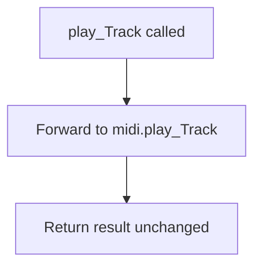

## `mingus.midi.fluidsynth.play_Tracks` · *function*

## Summary:
Delegates MIDI track playback to the underlying MIDI system for FluidSynth audio synthesis.

## Description:
This function serves as a simple wrapper that forwards MIDI track playback requests to the core MIDI system. It accepts multiple tracks, their corresponding channels, and an optional BPM value, then delegates the actual playback operation to the underlying `midi.play_Tracks` implementation. The function maintains the same interface and behavior as the underlying implementation.

## Args:
    tracks (list): A list of track objects to be played simultaneously
    channels (list): A list of MIDI channel numbers corresponding to each track
    bpm (int, optional): Initial beats per minute for playback. Defaults to 120

## Returns:
    dict: A dictionary containing the final BPM value with key "bpm", as returned by the underlying `midi.play_Tracks` implementation

## Raises:
    Exception: May raise exceptions propagated from the underlying `midi.play_Tracks` implementation

## Constraints:
    Preconditions:
        - tracks list must not be empty
        - tracks list must contain tracks of equal length
        - channels list must have the same length as tracks list
        - All tracks must have an instrument attribute
    Postconditions:
        - Arguments are forwarded to the underlying implementation unchanged

## Side Effects:
    - Delegates to underlying MIDI playback system
    - May trigger MIDI events through the FluidSynth backend
    - Propagates side effects from the underlying implementation

## Control Flow:
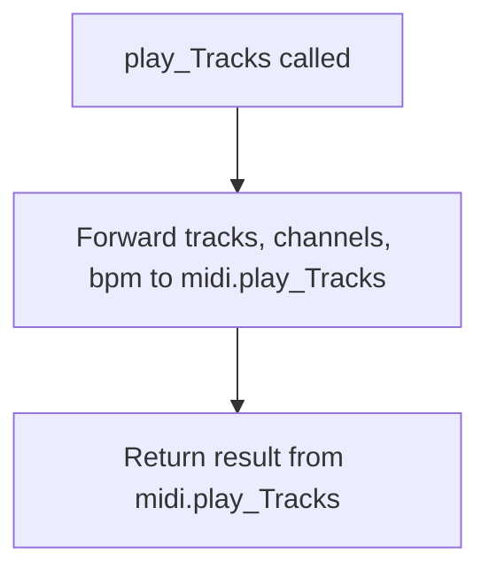

## Examples:
```python
# Basic usage
tracks = [track1, track2, track3]
channels = [1, 2, 3]
result = play_Tracks(tracks, channels, bpm=120)
print(f"Playback completed at {result['bpm']} BPM")

# With default BPM
result = play_Tracks(tracks, channels)
```

## `mingus.midi.fluidsynth.play_Composition` · *function*

## Summary:
Delegates composition playback to the core MIDI system for FluidSynth-based audio synthesis.

## Description:
This function serves as a thin wrapper that forwards composition playback requests to the core MIDI playback system. It accepts a musical composition along with optional playback parameters and passes them through to the underlying MIDI implementation. This provides a consistent interface for composition playback within the FluidSynth context.

Known callers:
- Direct API calls from user code to initiate composition playback using FluidSynth
- Potentially from higher-level music processing pipelines that manage composition objects

This logic is extracted into its own function rather than being inlined because it provides a clear abstraction layer for FluidSynth-specific composition playback operations and maintains consistency with the broader MIDI playback architecture.

## Args:
    composition: The musical composition object to be played, containing tracks and metadata
    channels (list[int], optional): List of MIDI channel numbers to assign to each track. If None, automatically assigns sequential channels starting from 1. Defaults to None.
    bpm (int, optional): Beats per minute for playback tempo. Defaults to 120.

## Returns:
    The return value is determined by the underlying midi.play_Composition function, typically a dictionary containing the final BPM setting after playback completion.

## Raises:
    Exception: May raise exceptions from the underlying midi.play_Composition implementation

## Constraints:
    Preconditions:
    - composition must be a valid composition object with a tracks attribute
    - composition.tracks must be iterable and contain valid track objects
    - channels, if provided, must be a list of integers representing valid MIDI channels
    - bpm must be a positive integer representing beats per minute
    
    Postconditions:
    - The composition will be played using FluidSynth audio synthesis
    - The return value reflects the result of the underlying MIDI playback operation

## Side Effects:
    - Initiates FluidSynth audio playback
    - May cause I/O operations through the underlying MIDI system
    - May trigger external MIDI device interactions through the FluidSynth engine

## Control Flow:
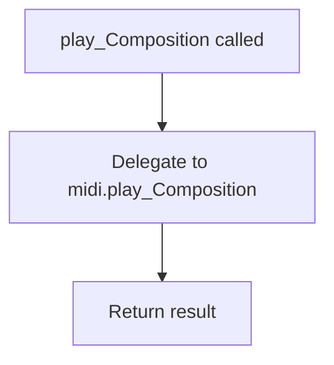

## Examples:
```python
# Basic composition playback
composition = Composition()
composition.add_track(track)
result = play_Composition(composition)
# Result depends on underlying implementation

# Playback with custom tempo and channels
result = play_Composition(composition, channels=[1, 2, 3], bpm=140)
# Result depends on underlying implementation
```

## `mingus.midi.fluidsynth.control_change` · *function*

## Summary:
Delegates to the underlying MIDI control_change function to send a MIDI control change message.

## Description:
This function acts as a wrapper that forwards control change parameters to the underlying MIDI implementation. It provides a consistent interface for sending MIDI control change messages regardless of the specific MIDI backend being used.

## Args:
    channel (int): The MIDI channel number to send the control change to.
    control (int): The control number specifying which controller to modify.
    value (int): The control value to set the controller to.

## Returns:
    The return value is determined by the underlying `midi.control_change` implementation.

## Raises:
    Exceptions are propagated from the underlying `midi.control_change` implementation.

## Constraints:
    Preconditions:
    - The MIDI system must be properly initialized and available
    - Parameters should conform to standard MIDI control change specifications

    Postconditions:
    - The control change message is sent to the MIDI device via the underlying implementation

## Side Effects:
    - May cause I/O operations to communicate with MIDI hardware or software synthesizer
    - May update internal MIDI state in the underlying implementation

## Control Flow:
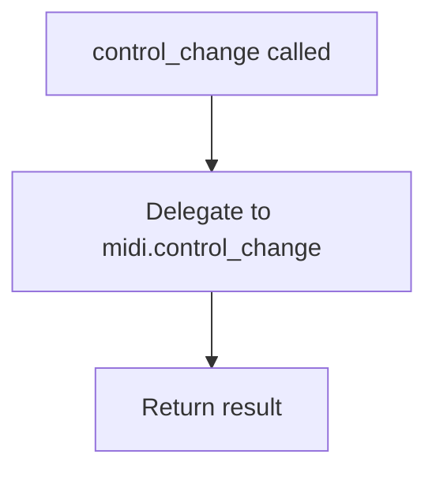

## Examples:
```python
# Change volume on channel 0 to maximum
control_change(0, 7, 127)

# Change pan position on channel 1 to center
control_change(1, 10, 64)

# Change modulation wheel on channel 2 to minimum
control_change(2, 1, 0)
```

## `mingus.midi.fluidsynth.set_instrument` · *function*

## Summary:
Sets a MIDI instrument for a specific channel in the FluidSynth synthesizer.

## Description:
Configures a MIDI instrument on the specified channel by delegating to the underlying MIDI implementation. This function provides a standardized interface for instrument assignment within the FluidSynth MIDI system.

Known callers and contexts:
- Direct external calls - Used by applications that need to configure instruments for specific MIDI channels
- Internal MIDI setup processes - Likely called during initialization of MIDI playback systems

This logic is implemented as a separate function rather than being inlined because it provides a clean abstraction layer between the application code and the underlying MIDI implementation. This separation allows for easier testing, maintenance, and potential switching between different MIDI backends while maintaining a consistent interface.

## Args:
    channel (int): MIDI channel number (typically 0-15) where the instrument should be set
    midi_instr (int): MIDI instrument number (0-127) to assign to the channel
    bank (int, optional): MIDI bank number (0-127) to select the instrument bank. Defaults to 0

## Returns:
    The return value depends on the underlying `midi.set_instrument` implementation, typically representing the success status or configuration result of the instrument assignment operation.

## Raises:
    Exception: May raise exceptions from the underlying `midi.set_instrument` implementation if invalid parameters are provided or if MIDI operations fail.

## Constraints:
    Preconditions:
    - Channel must be a valid MIDI channel (typically 0-15)
    - Instrument number must be within MIDI instrument range (0-127)
    - Bank number must be within MIDI bank range (0-127)
    
    Postconditions:
    - The specified channel will be configured with the requested instrument
    - The instrument change will be applied to the FluidSynth synthesizer

## Side Effects:
    MIDI output: Sends MIDI program change messages to the FluidSynth synthesizer
    State changes: Modifies the instrument configuration state of the specified MIDI channel

## Control Flow:
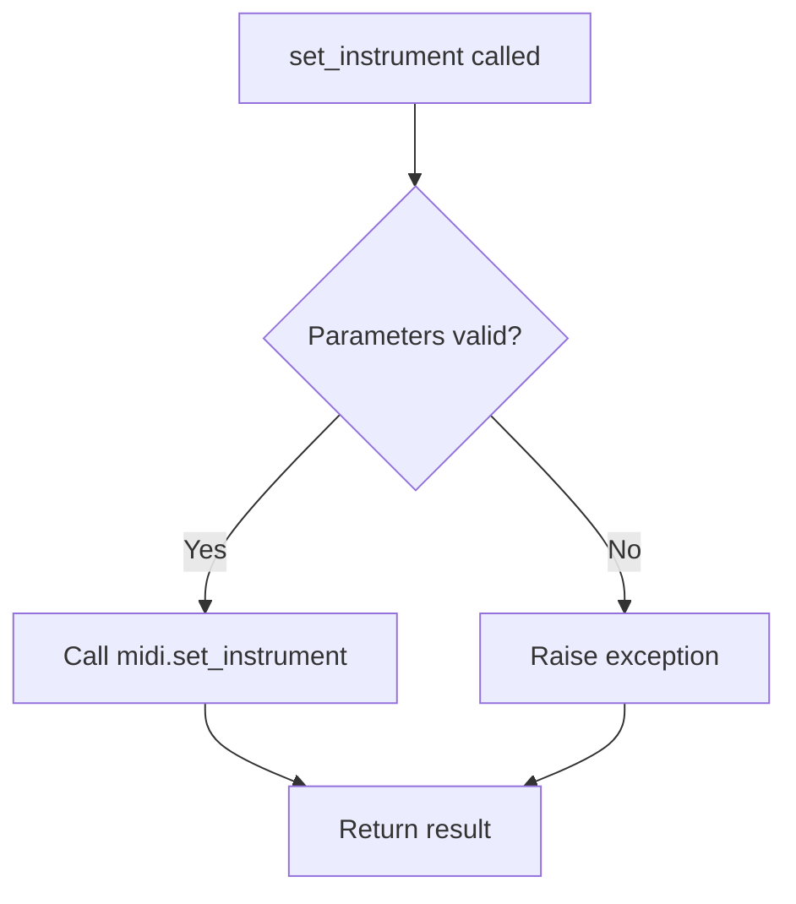

## Examples:
```python
# Set piano on channel 0
set_instrument(0, 0)

# Set drum kit on channel 9 (default bank)
set_instrument(9, 128)

# Set instrument 42 in bank 1 on channel 3
set_instrument(3, 42, 1)
```

## `mingus.midi.fluidsynth.stop_everything` · *function*

## Summary:
Halts all active MIDI playback and fluidsynth operations.

## Description:
This function provides a unified interface for terminating all ongoing MIDI activities within the fluidsynth system. It serves as a convenience wrapper that delegates to the underlying MIDI system's stop_everything method to properly shut down playback and release associated resources.

The function is typically invoked during application shutdown, resource cleanup, or when transitioning between different MIDI playback states to ensure all audio operations cease cleanly.

## Args:
    None

## Returns:
    Returns the result of the underlying `midi.stop_everything()` call, which typically indicates successful completion or an error status.

## Raises:
    Any exceptions that may propagate from the underlying MIDI system's stop_everything implementation, including but not limited to:
    - RuntimeError: If MIDI system cleanup fails
    - OSError: If audio device operations encounter errors
    - AttributeError: If the MIDI subsystem is not properly initialized

## Constraints:
    Preconditions:
    - The fluidsynth system must be initialized and operational
    - Audio resources must be accessible
    - Active MIDI operations must exist to be stopped
    
    Postconditions:
    - All active MIDI playback sequences are terminated
    - Fluidsynth synthesizer resources are released
    - Sequencer state is reset to stopped condition

## Side Effects:
    - Stops all active MIDI sequences
    - Releases fluidsynth synthesizer resources
    - Terminates audio output processing
    - Flushes pending MIDI events

## Control Flow:
```mermaid
flowchart TD
    A[stop_everything called] --> B[Call midi.stop_everything()]
    B --> C[Return result from underlying implementation]
```

## Examples:
```python
# Basic usage for cleanup
stop_everything()

# Usage before restarting MIDI system
stop_everything()  # Ensure clean state before reinitialization
```

## `mingus.midi.fluidsynth.modulation` · *function*

## Summary:
Sends a MIDI modulation controller message to a specified channel with a given value.

## Description:
This function serves as a wrapper that forwards modulation parameters to an underlying MIDI implementation. It takes a MIDI channel number and modulation value, then delegates to `midi.modulation(channel, value)` to send the appropriate MIDI controller message.

In MIDI systems, modulation typically corresponds to controller 1 (Modulation Wheel) and is used for pitch bend, vibrato, or other dynamic sound effects. This function provides a convenient interface for setting modulation parameters in fluidsynth-based MIDI applications.

## Args:
    channel: The MIDI channel number to send the modulation message to.
    value: The modulation value to set for the specified channel.

## Returns:
    The return value is the result of the underlying `midi.modulation` call, which typically indicates successful transmission or any error conditions from the MIDI system.

## Raises:
    Exceptions may be raised by the underlying MIDI implementation when invalid parameters are provided or when MIDI communication fails.

## Constraints:
    Preconditions:
    - Parameters must be compatible with the underlying MIDI system's expectations
    - Channel and value should generally be within ranges supported by the MIDI implementation
    
    Postconditions:
    - The modulation controller message is sent to the specified MIDI channel
    - The modulation value is applied to the channel as specified

## Side Effects:
    - Initiates MIDI communication with the audio synthesizer
    - May affect the sound characteristics of subsequent notes played on the specified channel
    - Could introduce brief delays during MIDI message transmission

## Control Flow:
```mermaid
flowchart TD
    A[modulation(channel, value)] --> B[Call midi.modulation(channel, value)]
    B --> C[Return result from midi.modulation]
```

## Examples:
```python
# Set moderate modulation on channel 0
modulation(0, 64)

# Apply maximum modulation on channel 1
modulation(1, 127)

# Apply minimum modulation on channel 5
modulation(5, 0)
```

## `mingus.midi.fluidsynth.pan` · *function*

## Summary:
Sets the panning value for a specified MIDI channel by delegating to the underlying MIDI panning implementation.

## Description:
This function acts as a thin wrapper that forwards panning requests for MIDI channels to the underlying `midi.pan` implementation. It provides a convenient interface for setting pan values in fluidsynth-based MIDI systems without requiring direct access to the lower-level MIDI functions.

## Args:
    channel (int): The MIDI channel number to apply panning to.
    value (float): The pan value to set, typically ranging from -1.0 (left) to 1.0 (right).

## Returns:
    The return value is the result of calling `midi.pan(channel, value)`, which varies based on the underlying implementation.

## Raises:
    Exceptions raised by the underlying `midi.pan` function may propagate through this wrapper, including but not limited to:
    - ValueError: For invalid channel numbers or pan values
    - RuntimeError: When the MIDI system is not properly initialized

## Constraints:
    Preconditions:
    - The fluidsynth system must be properly initialized
    - The channel parameter must be valid for the MIDI implementation
    - The value parameter must be within acceptable range
    
    Postconditions:
    - The function returns whatever result is produced by `midi.pan(channel, value)`

## Side Effects:
    - May modify audio output configuration for the specified MIDI channel
    - Interacts with the fluidsynth audio engine's internal state
    - Could affect real-time audio processing if called during playback

## Control Flow:
```mermaid
flowchart TD
    A[pan(channel, value)] --> B[Call midi.pan(channel, value)]
    B --> C[Return result]
```

## Examples:
    # Set channel 0 to full left pan
    result = pan(0, -1.0)
    
    # Center pan channel 1
    result = pan(1, 0.0)
    
    # Set channel 2 to full right pan
    result = pan(2, 1.0)

## `mingus.midi.fluidsynth.main_volume` · *function*

## Summary:
Delegates volume control to the underlying MIDI system for a specified channel.

## Description:
This function serves as a wrapper that forwards volume adjustment requests to the underlying MIDI implementation. It provides a simplified interface for setting volume levels on specific MIDI channels within the fluidsynth system. The function acts as a bridge between higher-level MIDI operations and the low-level fluidsynth volume control mechanisms.

## Args:
    channel (int): The MIDI channel number to modify (typically 0-15).
    value (int): The volume level to set (typically 0-127, where 0 is silent and 127 is maximum).

## Returns:
    The return value from the underlying `midi.main_volume` implementation, which typically indicates success or failure of the volume adjustment operation.

## Raises:
    Exceptions may be raised by the underlying `midi.main_volume` implementation, though specific conditions are not visible in the provided code.

## Constraints:
    Preconditions:
    - The `midi` module must be properly initialized and available
    - Arguments must be compatible with the underlying `midi.main_volume` function
    - The specified channel must be a valid MIDI channel identifier
    
    Postconditions:
    - The operation is delegated to the underlying MIDI system
    - The return value reflects the result from the underlying implementation

## Side Effects:
    - May affect audio output levels for the specified MIDI channel
    - Communicates with the underlying MIDI synthesizer system
    - Could impact real-time audio processing if called during playback

## Control Flow:
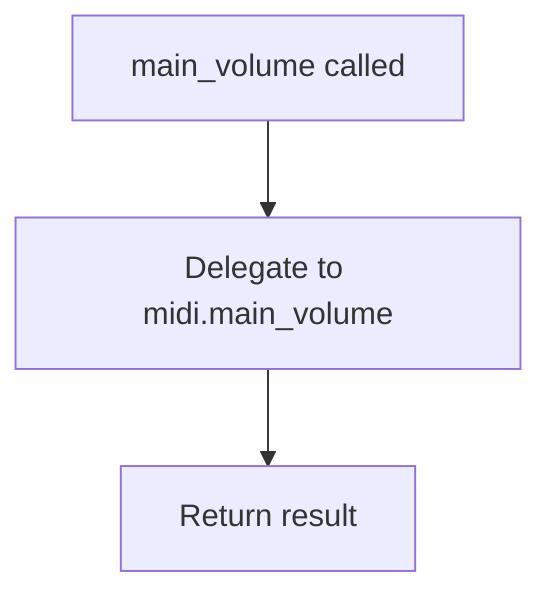

## Examples:
    # Set channel 0 volume to maximum
    result = main_volume(0, 127)
    
    # Set channel 1 volume to half
    result = main_volume(1, 64)
    
    # Silence channel 2
    result = main_volume(2, 0)
```

