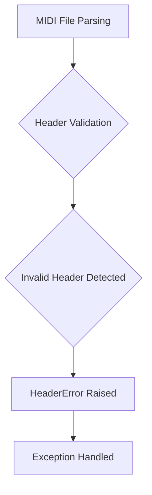
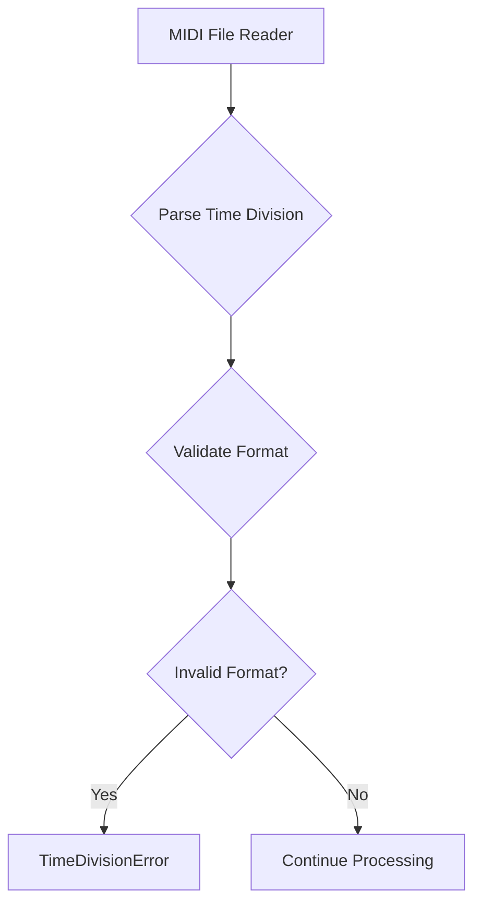
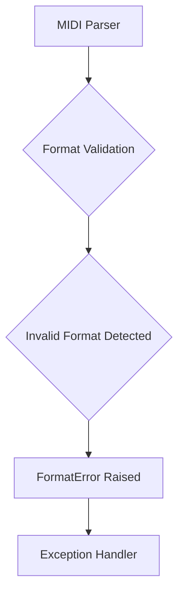
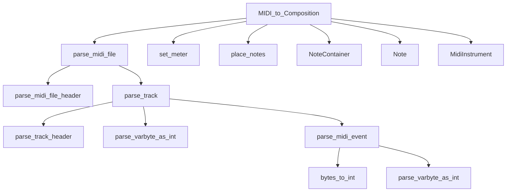

# `midi_file_in.py`

## `mingus.midi.midi_file_in.MIDI_to_Composition` · *function*

## Summary:
Converts a MIDI file into a mingus Composition object with associated musical structure.

## Description:
This function serves as a convenient interface for parsing MIDI files and converting their contents into mingus container objects (Composition, Track, Bar, Note, etc.). It creates a MidiFile instance and delegates the parsing work to its MIDI_to_Composition method, returning the resulting Composition object along with the tempo information.

The function is typically used when importing MIDI files into the mingus music composition framework, transforming raw MIDI data into a structured format that can be manipulated and analyzed within the framework.

## Args:
    file (str or file-like object): Path to the MIDI file or file handle to be parsed

## Returns:
    tuple: A tuple containing (Composition, bpm) where Composition contains the musical structure with tracks, bars, and notes, and bpm represents the tempo in beats per minute (may be undefined if no tempo meta event is present)

## Raises:
    None explicitly raised in the function body, though underlying MidiFile methods may raise exceptions such as HeaderError, FormatError, TimeDivisionError, or IOError

## Constraints:
    Preconditions: The file parameter must be a valid MIDI file path or file handle
    Postconditions: Returns a Composition object with musical data populated from the MIDI file

## Side Effects:
    I/O operations: Reads from the MIDI file specified by the file parameter

## Control Flow:
```mermaid
flowchart TD
    A[Call MIDI_to_Composition] --> B[Create MidiFile instance]
    B --> C[Call m.MIDI_to_Composition(file)]
    C --> D[Parse MIDI file data]
    D --> E[Convert to Composition object]
    E --> F[Return (Composition, bpm) tuple]
```

## Examples:
```python
# Basic usage
composition, tempo = MIDI_to_Composition("example.mid")

# Access parsed musical data
for track in composition.tracks:
    print(f"Track: {track.name}")
    for bar in track.bars:
        print(f"Bar: {bar}")

# Using with file handle
with open("example.mid", "rb") as f:
    composition, tempo = MIDI_to_Composition(f)
```

## `mingus.midi.midi_file_in.HeaderError` · *class*

## Summary:
Represents an error that occurs when parsing or validating the header of a MIDI file.

## Description:
The HeaderError exception is raised during MIDI file processing when an invalid or malformed header is encountered. This exception is specifically designed to handle header-related issues in MIDI file parsing operations, allowing callers to distinguish header parsing failures from other types of MIDI processing errors.

## State:
This class has no instance attributes beyond those inherited from Exception. It serves purely as a semantic marker for header-related parsing failures.

## Lifecycle:
- Creation: Instantiated when a MIDI file header validation fails
- Usage: Raised during MIDI file parsing operations when header inconsistencies are detected
- Destruction: Automatically cleaned up by Python's exception handling mechanism

## Method Map:


## Raises:
This exception is raised by MIDI file parsing functions when header validation fails, such as when:
- The MIDI file signature is invalid
- Header length fields contain unexpected values
- Required header fields are missing or malformed

## Example:
```python
try:
    midi_data = read_midi_file("example.mid")
except HeaderError as e:
    print(f"MIDI header error: {e}")
    # Handle header-specific error appropriately
```

## `mingus.midi.midi_file_in.TimeDivisionError` · *class*

## Summary:
Custom exception raised when encountering invalid or unsupported time division formats in MIDI files.

## Description:
The TimeDivisionError exception is specifically designed to handle errors related to time division parsing and validation in MIDI file processing. This exception is raised when the time division information in a MIDI file header cannot be properly interpreted or is outside the supported range of values.

This distinct exception class provides specialized error handling for MIDI time division issues, allowing callers to differentiate these specific errors from other potential exceptions that might occur during MIDI file processing operations.

## State:
This class has no instance attributes or state. It inherits all behavior from the base Exception class.

## Lifecycle:
- Creation: Instantiated when invalid time division data is detected during MIDI file parsing
- Usage: Raised by MIDI file readers when time division format is invalid or unsupported
- Destruction: Automatically cleaned up by Python's garbage collector after being handled

## Method Map:


## Raises:
- TimeDivisionError: Raised when MIDI file contains invalid time division format or unsupported time division values

## Example:
```python
try:
    midi_reader = MidiFileReader("example.mid")
    midi_reader.read_header()
except TimeDivisionError as e:
    print(f"Invalid time division in MIDI file: {e}")
    # Handle the specific time division error appropriately
```

## `mingus.midi.midi_file_in.FormatError` · *class*

## Summary:
Represents an error that occurs when processing MIDI files with invalid or unsupported formats.

## Description:
The FormatError exception is raised when the MIDI file parser encounters a file that does not conform to the expected MIDI format specifications. This exception serves as a specialized error type to distinguish format-related issues from other potential errors during MIDI file processing.

## State:
This class has no instance attributes as it inherits directly from Exception with no additional implementation.

## Lifecycle:
- Creation: Instantiated automatically by the MIDI file parser when a format violation is detected
- Usage: Typically caught and handled by higher-level MIDI processing code
- Destruction: Managed automatically by Python's exception handling mechanism

## Method Map:


## Raises:
This exception is raised by the MIDI file parsing functions when encountering files that don't meet the expected MIDI format requirements.

## Example:
```python
try:
    midi_data = midi_file_in.read_midi_file("invalid_file.mid")
except FormatError as e:
    print(f"MIDI format error: {e}")
    # Handle the invalid format appropriately
```

## `mingus.midi.midi_file_in.MidiFile` · *class*

## Summary:
Parses MIDI files and converts them into mingus Composition objects with associated Tracks, Bars, and Notes.

## Description:
The MidiFile class provides functionality to read MIDI files and translate their contents into mingus container objects (Composition, Track, Bar, Note, etc.). It handles the complex MIDI file format specification including headers, multiple tracks, various MIDI events, and meta-events. This class serves as the primary interface for importing MIDI data into the mingus music composition framework.

## State:
- bpm (int): Current tempo in beats per minute, initialized to 120 and updated during parsing based on MIDI tempo meta-events
- meter (tuple): Time signature as (numerator, denominator), initialized to (4, 4) and updated during parsing based on MIDI time signature meta-events  
- bytes_read (int): Counter tracking total bytes read during parsing operations, reset to 0 at the beginning of each parse operation

## Lifecycle:
- Creation: Instantiate without arguments; class variables are initialized automatically
- Usage: Call MIDI_to_Composition(file_path) to parse a MIDI file and convert it to a Composition object and current tempo
- Destruction: No explicit cleanup required; relies on Python's garbage collection

## Method Map:


## Raises:
- HeaderError: Raised when encountering invalid MIDI file headers
- FormatError: Raised when encountering unsupported MIDI formats (not 0, 1, or 2)
- TimeDivisionError: Raised when encountering invalid SMPTE frame rates in time division
- IOError: Raised when file operations fail or when reading from file fails

## Example:
```python
# Parse a MIDI file into a Composition
midi_file = MidiFile()
composition, tempo = midi_file.MIDI_to_Composition("example.mid")

# Access the parsed data
for track in composition.tracks:
    print(f"Track: {track.name}")
    for bar in track.bars:
        print(f"Bar: {bar}")
```

### `mingus.midi.midi_file_in.MidiFile.MIDI_to_Composition` · *method*

## Summary:
Parses MIDI file data and populates a Composition object with musical structure.

## Description:
This method reads and parses a MIDI file, converting its contents into a Composition object that contains tracks, bars, and musical events. It handles various MIDI events including note-on events, instrument changes, and meta-events for tempo, meter, and key information. The method is typically invoked during MIDI file loading to transform raw MIDI data into the internal mingus composition format.

## Args:
    file (str or file-like object): Path to the MIDI file or file handle to be parsed

## Returns:
    tuple: A tuple containing (Composition, bpm) where Composition contains the musical structure with tracks, bars, and notes, and bpm represents the tempo in beats per minute (may be undefined if no tempo meta event is present)

## Raises:
    None explicitly raised in the method body

## State Changes:
    Attributes READ: self.parse_midi_file, self.bytes_to_int
    Attributes WRITTEN: None directly modified on self

## Constraints:
    Preconditions: The file parameter must be a valid MIDI file path or file handle
    Postconditions: Returns a Composition object with musical data populated from the MIDI file

## Side Effects:
    I/O operations: Reads from the MIDI file specified by the file parameter
    Prints diagnostic messages to stdout for unsupported MIDI events and meta events

### `mingus.midi.midi_file_in.MidiFile.parse_midi_file_header` · *method*

## Summary:
Parses the header section of a MIDI file to extract format type, number of tracks, and time division information.

## Description:
This method reads and validates the standard MIDI file header structure, extracting essential metadata about the MIDI file's organization. It verifies the file header signature ("MThd"), reads the chunk size, format type, number of tracks, and time division information. The method serves as a critical first step in the MIDI file parsing pipeline, ensuring the file conforms to standard MIDI specifications before proceeding with track parsing.

The method is called internally by `parse_midi_file()` during the MIDI file parsing process, and is typically invoked as part of loading MIDI files for composition conversion in the `MIDI_to_Composition` method.

## Args:
    fp (file-like object): A file pointer positioned at the beginning of the MIDI file header section

## Returns:
    tuple or bool: Returns a tuple (format_type, number_of_tracks, time_division) when successful, or False if the chunk size is less than 6 bytes indicating an invalid header structure.

## Raises:
    IOError: Raised when file reading operations fail or when header signature is invalid
    FormatError: Raised when the MIDI format type is not one of the supported values (0, 1, or 2)

## State Changes:
    Attributes READ: self.bytes_read
    Attributes WRITTEN: self.bytes_read (incremented as bytes are read from the file)

## Constraints:
    Preconditions: The file pointer must be positioned at the start of a valid MIDI file header
    Postconditions: The file pointer is advanced past the header data, and self.bytes_read reflects the total bytes processed

## Side Effects:
    I/O operations: Reads from the provided file pointer, advancing its position
    File reading: Consumes bytes from the file stream to extract header information

### `mingus.midi.midi_file_in.MidiFile.bytes_to_int` · *method*

## Summary:
Converts binary bytes or integer values to their integer representation for MIDI file parsing operations.

## Description:
This utility method converts binary byte sequences (common when reading from MIDI files) into integer values that can be used for parsing MIDI data. It handles both binary data (bytes) and direct integer inputs, providing a consistent interface for MIDI parsing operations. The method is essential for converting raw binary data from MIDI files into meaningful numeric values used throughout the MIDI parsing pipeline.

Known callers and usage context:
- Called in `parse_midi_file_header()` when reading chunk sizes and format types
- Used in `parse_time_division()` for interpreting time division data  
- Invoked in `parse_track_header()` when processing track chunk sizes
- Called in `parse_midi_event()` for reading event parameters
- Used in `parse_varbyte_as_int()` for decoding variable-length quantities

This method exists as a convenience utility to handle the Python 2/3 compatibility issue where binary data needs to be converted to integers for processing, while maintaining support for direct integer inputs.

## Args:
    _bytes (bytes or int): Binary data (bytes) or integer to convert to integer representation

## Returns:
    int: Integer representation of the input bytes or the input itself if already an integer

## Raises:
    TypeError: When _bytes is neither binary_type nor int

## State Changes:
    Attributes READ: None
    Attributes WRITTEN: None

## Constraints:
    Preconditions: _bytes must be either binary_type (bytes) or int
    Postconditions: Returns an integer value representing the input data

## Side Effects:
    None

### `mingus.midi.midi_file_in.MidiFile.parse_time_division` · *method*

## Summary:
Parses MIDI time division data from bytes to extract timing information for playback and composition processing.

## Description:
Processes the time division field from a MIDI file header to determine the timing resolution. MIDI files can specify timing in two ways: as ticks per beat (standard format) or as SMPTE timecode (SMPTE format). This method interprets the 2-byte time division value according to MIDI specification and returns appropriate timing parameters.

Called internally by `parse_midi_file_header()` during MIDI file parsing operations. This method exists as a separate utility to encapsulate the complex bit manipulation and validation logic required for proper MIDI time division interpretation, making the header parsing code cleaner and more maintainable.

## Args:
    bytes (bytes): A 2-byte sequence containing the time division data from a MIDI file header

## Returns:
    dict: Dictionary containing timing information with one of two structures:
        - Standard format: {"fps": False, "ticks_per_beat": int}
        - SMPTE format: {"fps": True, "SMPTE_frames": int, "clock_ticks": int}

## Raises:
    TimeDivisionError: When SMPTE frames value is not one of the valid values [24, 25, 29, 30]

## State Changes:
    Attributes READ: None
    Attributes WRITTEN: None

## Constraints:
    Preconditions: Input bytes must be exactly 2 bytes long
    Postconditions: Returns a properly formatted dictionary with timing information

## Side Effects:
    None

### `mingus.midi.midi_file_in.MidiFile.parse_track` · *method*

## Summary:
Parses MIDI track data from a file pointer and returns a list of timestamped events.

## Description:
This method reads and decodes MIDI track data from a file pointer, extracting individual MIDI events along with their delta times. It processes the track header to determine the track size, then iteratively reads events until the entire track is consumed. The method is part of the MIDI file parsing pipeline and is called by `parse_midi_file()` during the conversion of MIDI files to internal mingus objects.

Known callers and usage context:
- Called by `parse_midi_file()` during MIDI file parsing
- Invoked as part of the MIDI file loading pipeline in `MIDI_to_Composition()`
- Used in the conversion from binary MIDI data to structured event representations

This logic is separated into its own method because MIDI track parsing involves complex state management, variable-length data decoding, and proper byte accounting that would make the calling code significantly more complex if inlined.

## Args:
    fp (file-like object): File pointer positioned at the start of a MIDI track

## Returns:
    list[list]: A list of events where each event is represented as [delta_time, event_dict], with:
        - delta_time (int): Time interval in ticks since previous event
        - event_dict (dict): Decoded MIDI event data with keys based on event type:
            - Meta events (event type 0x0F): {"event": 15, "meta_event": int, "data": bytes}
            - Controller events (event types 12, 13): {"event": int, "channel": int, "param1": int}
            - Standard events (event types 0x08-0x0E): {"event": int, "channel": int, "param1": int, "param2": int}

## Raises:
    IOError: When unable to read required bytes from the file pointer
    FormatError: When encountering invalid MIDI event types or malformed track data

## State Changes:
    Attributes READ: self.bytes_read (accessed for debugging output)
    Attributes WRITTEN: None

## Constraints:
    Preconditions: File pointer must be positioned at a valid MIDI track start
    Postconditions: File pointer is advanced by the total number of bytes consumed by the track

## Side Effects:
    I/O: Reads from the provided file pointer
    Debugging output: Prints error message when chunk_size becomes negative

### `mingus.midi.midi_file_in.MidiFile.parse_midi_event` · *method*

## Summary:
Parses a single MIDI event from a file pointer and returns its decoded structure along with the byte count consumed.

## Description:
This method reads and decodes a MIDI event from the provided file pointer, extracting event type, channel, and parameters according to MIDI specification. It handles three main categories of MIDI events: meta events (type 0x0F), controller events (types 12 and 13), and standard MIDI events (types 0x08-0x0E). The method updates the internal `bytes_read` counter and returns both the parsed event data structure and the number of bytes consumed during parsing.

Known callers and usage context:
- Called by `parse_track()` during the MIDI file parsing process
- Part of the MIDI file parsing pipeline that converts binary MIDI data into structured event representations
- Used in the conversion from MIDI files to composition objects in `MIDI_to_Composition()`

This logic is separated into its own method because MIDI event parsing involves complex bit manipulation, multiple event type handling, and variable-length data reading that would make the calling code significantly more complex if inlined.

## Args:
    fp (file-like object): File pointer positioned at the start of a MIDI event

## Returns:
    tuple: A tuple containing:
        dict: Event data structure with the following possible key structures:
            - Meta events (event type 0x0F): {"event": 15, "meta_event": int, "data": bytes}
            - Controller events (event types 12, 13): {"event": int, "channel": int, "param1": int}
            - Standard events (event types 0x08-0x0E): {"event": int, "channel": int, "param1": int, "param2": int}
        int: Number of bytes consumed during parsing (chunk_size)

## Raises:
    IOError: When unable to read required bytes from the file pointer
    FormatError: When encountering unknown or invalid MIDI event types (event_type < 8)

## State Changes:
    Attributes READ: None
    Attributes WRITTEN: self.bytes_read (incremented by the number of bytes read)

## Constraints:
    Preconditions: File pointer must be positioned at a valid MIDI event start
    Postconditions: File pointer is advanced by the number of bytes consumed by the event

## Side Effects:
    I/O: Reads from the provided file pointer
    Mutates: Updates the internal `bytes_read` attribute

### `mingus.midi.midi_file_in.MidiFile.parse_track_header` · *method*

## Summary:
Parses and validates a MIDI track header from a file pointer, returning the track chunk size.

## Description:
Reads and verifies the standard MIDI track header identifier "MTrk" and extracts the track chunk size from a file pointer. This method is part of the MIDI file parsing pipeline and is called by `parse_track()` to prepare for reading track data. The method ensures that the file pointer is positioned at a valid track header and properly advances the internal byte counter.

Known callers and usage context:
- Called by `parse_track()` during MIDI file parsing
- Part of the MIDI file loading pipeline in `parse_midi_file()`
- Used in the conversion from binary MIDI data to structured event representations

This logic is separated into its own method because MIDI track header parsing requires specific validation of the track identifier and proper handling of binary data conversion, making it a distinct and reusable component in the MIDI parsing process.

## Args:
    fp (file-like object): File pointer positioned at the start of a MIDI track header

## Returns:
    int: The size of the track chunk in bytes

## Raises:
    IOError: When unable to read required bytes from the file pointer
    HeaderError: When the track header identifier is not "MTrk"

## State Changes:
    Attributes READ: self.bytes_read (accessed for error reporting)
    Attributes WRITTEN: self.bytes_read (incremented by 8 bytes total - 4 for header + 4 for size)

## Constraints:
    Preconditions: File pointer must be positioned at a valid MIDI track header start
    Postconditions: File pointer is advanced by 8 bytes total (4 for header identifier + 4 for size)

## Side Effects:
    I/O: Reads 8 bytes from the provided file pointer
    Mutates: Increments self.bytes_read by 8

### `mingus.midi.midi_file_in.MidiFile.parse_midi_file` · *method*

## Summary:
Parses a MIDI file and extracts header information along with all track events into a structured format.

## Description:
This method reads a MIDI file in binary mode and performs the initial parsing of the file structure. It extracts the MIDI file header information and processes each track in the file, collecting all MIDI events for subsequent processing. The method is designed to be a foundational parsing step that prepares MIDI data for higher-level composition conversion.

The method is typically invoked as part of the MIDI file loading pipeline, specifically by the `MIDI_to_Composition` method which uses the parsed data to construct internal mingus Composition objects.

## Args:
    file (str): Path to the MIDI file to be parsed

## Returns:
    tuple: A tuple containing (header, result) where:
        - header: A tuple with (format_type, number_of_tracks, time_division) information
        - result: A list of track data, where each track is a list of events, each event being [delta_time, event_dict]

## Raises:
    IOError: Raised when the specified file cannot be opened or read

## State Changes:
    Attributes READ: None
    Attributes WRITTEN: self.bytes_read (reset to 0 at start of method execution)

## Constraints:
    Preconditions: The file parameter must reference a valid MIDI file
    Postconditions: The file is properly closed after parsing, and self.bytes_read is set to 0 at the beginning of parsing

## Side Effects:
    I/O operations: Opens and reads from the specified MIDI file in binary mode
    File handling: Opens and closes the file handle during execution

### `mingus.midi.midi_file_in.MidiFile.parse_varbyte_as_int` · *method*

## Summary:
Parses a variable-length integer from a file pointer using MIDI's standard variable-length encoding format.

## Description:
Reads bytes from a file pointer until a complete variable-length integer is decoded according to MIDI specification. In MIDI files, variable-length quantities are encoded such that each byte has a continuation bit (MSB) indicating whether more bytes follow. This method handles the parsing of these quantities, commonly used for delta times and metadata lengths in MIDI events.

The method is called during MIDI file parsing operations, particularly when processing track events where delta times and metadata lengths need to be interpreted. It updates the internal `bytes_read` counter to track file position during parsing.

## Args:
    fp (file-like object): File pointer from which to read bytes
    return_bytes_read (bool): If True, returns tuple of (parsed_integer, bytes_read); if False, returns only the parsed integer

## Returns:
    int or tuple[int, int]: If return_bytes_read=True, returns (parsed_integer, bytes_read); if return_bytes_read=False, returns only parsed_integer

## Raises:
    IOError: When unable to read from the file pointer during parsing

## State Changes:
    Attributes READ: None
    Attributes WRITTEN: self.bytes_read (incremented by 1 for each byte read)

## Constraints:
    Preconditions: File pointer must be seekable and readable
    Postconditions: File pointer position advances by the number of bytes read

## Side Effects:
    Reads from the provided file pointer and updates the internal bytes_read counter

