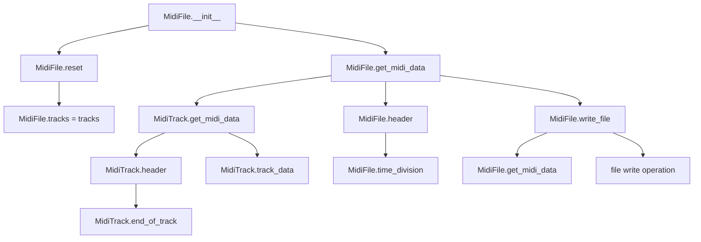
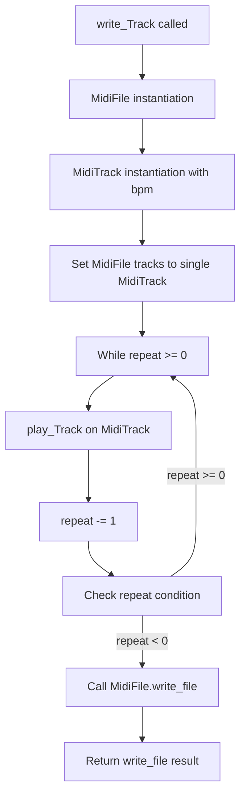
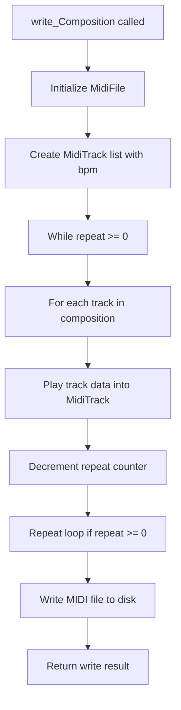

# `midi_file_out.py`

## `mingus.midi.midi_file_out.MidiFile` · *class*

## Summary:
Represents a MIDI file container that manages multiple MIDI tracks and provides functionality for generating MIDI data and writing to files.

## Description:
The MidiFile class serves as a container for MIDI tracks and handles the creation of complete MIDI file data. It is responsible for assembling individual track data into a proper MIDI file format with appropriate headers and managing the file output process. This class is typically instantiated by MIDI file generation processes or higher-level music composition tools that need to create MIDI files from musical data.

## State:
- tracks: list of MidiTrack objects, initially empty (instance attribute)
- time_division: bytes representing the time division (default b'\x00H' which equals 72 ticks per beat) (instance attribute)

## Lifecycle:
- Creation: Instantiate with optional list of MidiTrack objects; internally calls reset() and assigns tracks
- Usage: Call get_midi_data() to generate complete MIDI file data (header + all track data), or write_file() to write directly to disk
- Destruction: No explicit cleanup required; uses standard Python garbage collection

## Method Map:


## Raises:
- IOError: When write_file() cannot open or write to the specified file
- Exception: Generic exceptions during file operations in write_file()

## Example:
```python
# Create a MIDI file with tracks
track1 = MidiTrack()
track2 = MidiTrack()
midi_file = MidiFile([track1, track2])

# Generate MIDI data
midi_data = midi_file.get_midi_data()

# Write to file
success = midi_file.write_file("output.mid", verbose=True)
```

### `mingus.midi.midi_file_out.MidiFile.__init__` · *method*

## Summary:
Initializes a MidiFile object with optional tracks and resets existing track states.

## Description:
The MidiFile constructor creates a new MIDI file container with an optional list of tracks. It ensures proper initialization by resetting any existing track states before assigning the provided tracks. This method serves as the primary entry point for creating MidiFile instances that can be used to generate MIDI data for output.

## Args:
    tracks (list[MidiTrack], optional): A list of MidiTrack objects to initialize the file with. Defaults to None, which creates an empty track list.

## Returns:
    None: This method initializes the object's state but does not return a value.

## Raises:
    None explicitly raised: The method does not raise any exceptions directly, though underlying operations may raise exceptions if invalid track objects are provided.

## State Changes:
    Attributes READ: None
    Attributes WRITTEN: 
    - self.tracks: Set to the provided tracks parameter or an empty list if tracks is None
    - self.time_division: Initialized to b"\x00\x48" (default time division) by class definition

## Constraints:
    Preconditions:
    - The tracks parameter, if provided, should contain valid MidiTrack objects or be a list
    - The MidiFile class must be properly imported and available
    
    Postconditions:
    - self.tracks will be initialized to either the provided tracks list or an empty list
    - All existing tracks will have their reset() method called to clear their data
    - The MidiFile object will be in a clean state ready for MIDI data generation

## Side Effects:
    - Calls reset() method on all existing tracks in self.tracks (if any)
    - Modifies the internal state of tracks by clearing their track_data
    - No external I/O operations or service calls occur during initialization

### `mingus.midi.midi_file_out.MidiFile.get_midi_data` · *method*

## Summary:
Generates complete MIDI file data by combining the file header with processed track data from all non-empty tracks.

## Description:
Collects MIDI data from all non-empty tracks in the MIDI file and combines it with a properly formatted header to create complete MIDI file data. This method is responsible for assembling the final binary representation of a MIDI file that can be written to disk or transmitted.

The method filters out empty tracks (where `track_data` is empty bytes) and processes remaining tracks by calling their respective `get_midi_data()` methods. It then combines the result with a header generated by the `header()` method to form a complete MIDI file structure.

## Args:
    None

## Returns:
    bytes: Complete MIDI file data containing header and all track data

## Raises:
    None explicitly raised

## State Changes:
    Attributes READ: 
    - self.tracks: List of MidiTrack objects used to collect track data
    - self.time_division: Time division setting used in header generation
    
    Attributes WRITTEN: 
    - None

## Constraints:
    Preconditions:
    - self.tracks should be a list of MidiTrack objects with valid track_data attributes
    - Each track in self.tracks should have a valid get_midi_data() method
    - self.header() method should be callable and return proper header bytes
    
    Postconditions:
    - Returns bytes representing a complete MIDI file structure
    - Empty tracks (with empty track_data) are excluded from the result
    - The returned data includes proper MIDI file header and all track data

## Side Effects:
    None

### `mingus.midi.midi_file_out.MidiFile.header` · *method*

## Summary:
Constructs a standard MIDI file header containing file format information, track count, and time division settings.

## Description:
Generates the binary header portion of a MIDI file that specifies the file format, number of tracks, and time division settings. This method is called by `get_midi_data()` to create the complete MIDI file structure. The header follows the standard MIDI file format specification with the "MThd" identifier, fixed header size, and proper formatting of track count and time division values.

The method counts non-empty tracks (where track_data != "") and encodes this count as a 16-bit big-endian value in the header. It then combines this with the standard MIDI header structure and the file's time division settings.

## Args:
    None

## Returns:
    bytes: Binary header data for a MIDI file with format type 1, track count, and time division settings

## Raises:
    None

## State Changes:
    Attributes READ: 
    - self.tracks: Used to count non-empty tracks in the MIDI file
    - self.time_division: Used to append time division settings to the header
    
    Attributes WRITTEN: 
    - None

## Constraints:
    Preconditions:
    - self.tracks should be a list of MidiTrack objects with track_data attribute
    - Each track should have a track_data attribute that can be compared to empty string ""
    - self.time_division should be bytes representing time division settings
    - The method assumes standard MIDI file format type 1
    
    Postconditions:
    - Returns properly formatted MIDI header bytes with correct structure
    - Track count is encoded as a 16-bit big-endian value in the header
    - Header begins with "MThd" identifier followed by fixed header fields
    - Header contains standard MIDI file format specification (format type 1, 6-byte header size)

## Side Effects:
    None

### `mingus.midi.midi_file_out.MidiFile.reset` · *method*

## Summary:
Resets all tracks in the MIDI file by clearing their MIDI data buffers and resetting delta time.

## Description:
Clears the internal MIDI data buffer of all tracks in the MIDI file, effectively resetting each track to an empty state. This method is called during initialization to ensure clean state before adding new MIDI data. Each track's track_data is set to empty bytes and delta_time is reset to null byte.

## Args:
    None

## Returns:
    None

## Raises:
    None

## State Changes:
    Attributes READ: self.tracks (iterable containing MidiTrack objects)
    Attributes WRITTEN: Each track's track_data attribute is set to b"" and delta_time attribute is set to b"\x00"

## Constraints:
    Preconditions: self.tracks must be iterable and contain objects with a reset() method
    Postconditions: All tracks in self.tracks will have their track_data cleared and delta_time reset to b"\x00"

## Side Effects:
    None

### `mingus.midi.midi_file_out.MidiFile.write_file` · *method*

## Summary:
Writes the MIDI data stored in this object to a file on disk.

## Description:
This method serializes the MIDI data contained within the object and saves it to the specified file path. It handles file opening, writing, and closing operations with appropriate error handling. The method is designed to be called during the MIDI file creation or export process, typically after all tracks and notes have been added to the MIDI structure.

## Args:
    file (str): The file path where the MIDI data will be written. Must be a valid writable path.
    verbose (bool): If True, prints diagnostic information about the write operation including the number of bytes written. Defaults to False.

## Returns:
    bool: True if the file was successfully written, False if either file opening or writing failed.

## Raises:
    None explicitly raised, but IOError may occur internally during file operations.

## State Changes:
    Attributes READ: None (relies on self.get_midi_data() which accesses internal MIDI data)
    Attributes WRITTEN: None (does not modify any instance attributes)

## Constraints:
    Preconditions: 
    - The object must have valid MIDI data accessible via get_midi_data()
    - The file path must be writable and the parent directory must exist
    - The file parameter must be a string representing a valid file path
    
    Postconditions:
    - If successful, the specified file contains valid MIDI data
    - If unsuccessful, no changes are made to the object's state

## Side Effects:
    - Creates or overwrites a file at the specified path
    - May produce console output if verbose=True
    - Performs file I/O operations

## `mingus.midi.midi_file_out.write_Note` · *function*

## Summary:
Creates a MIDI file containing a single note played for a specified duration with configurable repetition.

## Description:
The `write_Note` function generates a complete MIDI file containing a single musical note played according to specified parameters. It constructs a minimal MIDI structure with one track, plays the note with appropriate timing events (note-on and note-off), and writes the result to a file. This function is useful for creating simple MIDI files for individual notes or testing MIDI playback functionality.

Known callers within the codebase:
- This function appears to be a standalone utility function used for creating basic MIDI files from individual notes
- It's likely called by higher-level composition or testing functions that need to generate simple MIDI outputs

This logic is extracted into its own function rather than being inlined because it encapsulates the complete workflow of creating a MIDI file from a single note: initializing the MIDI structure, setting up timing, playing the note with proper start/stop events, and writing to file. This makes it reusable and keeps higher-level code clean.

## Args:
- file (str): Path to the output MIDI file. Must be a valid writable file path.
- note (Note): A musical note object containing note information including pitch, channel, and velocity.
- bpm (int): Tempo in beats per minute. Defaults to 120.
- repeat (int): Number of times to repeat the note playback. Defaults to 0 (single playback).
- verbose (bool): If True, prints diagnostic information about the write operation. Defaults to False.

## Returns:
- bool: True if the MIDI file was successfully written, False otherwise.

## Raises:
- IOError: When the file cannot be opened or written to during the write_file operation.

## Constraints:
- Preconditions:
  - The `file` parameter must be a valid string path that can be written to
  - The `note` parameter must be a valid Note object with proper channel and velocity attributes
  - The `repeat` parameter must be a non-negative integer
  - The `bpm` parameter must be a positive integer representing tempo

- Postconditions:
  - A valid MIDI file is created at the specified path if successful
  - The file contains the note playback with appropriate timing events
  - The note is played for the specified duration (based on BPM and repeat count)

## Side Effects:
- Creates or overwrites a file at the specified path
- May produce console output if verbose=True
- Performs file I/O operations

## Control Flow:
```mermaid
flowchart TD
    A[write_Note called] --> B[MidiFile instantiation]
    B --> C[MidiTrack instantiation with bpm]
    C --> D[Set tracks list to single track]
    D --> E[While repeat >= 0]
    E --> F[Set deltatime to 0]
    F --> G[Play note (note-on)]
    G --> H[Set deltatime to 72 (0x48)]
    H --> I[Stop note (note-off)]
    I --> J[Decrement repeat counter]
    J --> K[Evaluate repeat condition]
    K -->|repeat >= 0| L[Loop back to F]
    K -->|repeat < 0| M[Return m.write_file()]
    M --> N[Write file to disk]
    N --> O[Return write_file result]
```

## Examples:
```python
# Basic usage - create a MIDI file with a single note
from mingus.containers import Note
note = Note("C-4", 0, 64)  # Note, channel, velocity
success = write_Note("test.mid", note)

# Create a MIDI file with repeated note playback
success = write_Note("repeated_note.mid", note, bpm=140, repeat=3)

# Create a MIDI file with verbose output
success = write_Note("verbose_test.mid", note, verbose=True)
```

## `mingus.midi.midi_file_out.write_NoteContainer` · *function*

*No documentation generated.*

## `mingus.midi.midi_file_out.write_Bar` · *function*

## Summary:
Writes a musical bar to a MIDI file by converting the bar's contents into MIDI events and saving them to disk.

## Description:
This function takes a musical bar and converts it into a complete MIDI file, handling the creation of MIDI track data and file output. It creates a new MIDI file with a single track, plays the provided bar onto that track, and writes the result to disk. The function supports tempo control, repetition of the bar, and verbose output for debugging purposes.

Known callers within the codebase include:
- Direct usage in MIDI file generation workflows where individual bars need to be exported as separate MIDI files
- Integration with higher-level composition tools that build MIDI files from musical structures

This logic is extracted into its own function to provide a clean abstraction layer between musical bar representations and MIDI file generation, allowing for reusable MIDI output functionality without requiring full composition objects.

## Args:
    file (str): Absolute or relative path to the target MIDI file to be created or overwritten
    bar (Bar): A musical bar object containing notes, rests, and timing information to be converted to MIDI events
    bpm (int): Tempo in beats per minute for the MIDI output. Defaults to 120
    repeat (int): Number of times to repeat the bar in the output. Defaults to 0 (single play)
    verbose (bool): If True, prints diagnostic information about the file writing process. Defaults to False

## Returns:
    bool: True if the MIDI file was successfully written to disk, False if file operations failed

## Raises:
    IOError: When the file cannot be opened or written to during the write_file operation

## Constraints:
    Preconditions:
        - The file parameter must be a valid string path that can be written to
        - The bar parameter must be a valid Bar object with proper musical content
        - The bpm parameter must be a positive integer representing tempo
        - The repeat parameter must be a non-negative integer

    Postconditions:
        - A MIDI file will be created or overwritten at the specified file path
        - The MIDI file will contain the musical content of the bar at the specified tempo
        - If repeat is greater than 0, the bar will be repeated that many times in the output

## Side Effects:
    - Creates or overwrites a file at the specified path
    - May produce console output if verbose=True
    - Generates MIDI event data in memory during processing

## Control Flow:
```mermaid
flowchart TD
    A[write_Bar called] --> B[MidiFile() instantiation]
    B --> C[MidiTrack(bpm) instantiation]
    C --> D[m.tracks = [t]]
    D --> E[repeat >= 0?]
    E -->|True| F[t.play_Bar(bar)]
    F --> G[repeat -= 1]
    G --> H[E]
    H -->|False| I[m.write_file(file, verbose)]
    I --> J[Return boolean result]
```

## Examples:
```python
# Basic usage - write a single bar to MIDI file
from mingus.containers import Bar
from mingus.midi import write_Bar

my_bar = Bar()
# ... add notes to bar ...
success = write_Bar("output.mid", my_bar)

# Write with custom tempo and repeat
success = write_Bar("output.mid", my_bar, bpm=140, repeat=2, verbose=True)
```

## `mingus.midi.midi_file_out.write_Track` · *function*

## Summary:
Writes a musical track to a MIDI file by converting the track data into MIDI format and saving it to disk.

## Description:
Creates a MIDI file from a musical track by instantiating a MidiFile and MidiTrack, playing the track data through the MidiTrack, and writing the resulting MIDI data to a specified file. This function serves as a high-level interface for exporting musical tracks to MIDI file format.

Known callers within the codebase:
- This function appears to be a utility function used for MIDI file generation from Track objects
- It's likely called by higher-level composition or export functions that need to save musical content as MIDI files

This logic is extracted into its own function rather than inlined to provide a clean abstraction for the complete MIDI file generation workflow, separating concerns between track processing and file I/O operations.

## Args:
    file (str): Absolute or relative path to the target MIDI file to be created
    track (Track): A musical track object containing bars and notes to be converted to MIDI format
    bpm (int): Initial tempo in beats per minute for MIDI playback. Defaults to 120
    repeat (int): Number of times to repeat the track playback. Defaults to 0 (no repetition)
    verbose (bool): If True, prints diagnostic information about the write operation. Defaults to False

## Returns:
    bool: True if the MIDI file was successfully written, False if file writing failed

## Raises:
    IOError: When the file cannot be opened or written to during the write_file operation

## Constraints:
    Preconditions:
        - The file path must be writable and the parent directory must exist
        - The track parameter must be a valid Track object with iterable bars
        - The bpm parameter must be a positive integer
        - The repeat parameter must be a non-negative integer

    Postconditions:
        - A valid MIDI file is created at the specified file path
        - The MIDI file contains the musical data from the track
        - If repeat > 0, the track data is repeated that many times in the MIDI file

## Side Effects:
    - Creates or overwrites a file at the specified path
    - May produce console output if verbose=True
    - Performs file I/O operations

## Control Flow:


## Examples:
```python
# Basic usage - write a track to a MIDI file
from mingus.containers import Track
from mingus.midi.midi_file_out import write_Track

track = Track()
# ... add bars and notes to track ...
success = write_Track("output.mid", track, bpm=120, verbose=True)

# Write with repetition
success = write_Track("repeated.mid", track, bpm=120, repeat=2, verbose=False)
```

## `mingus.midi.midi_file_out.write_Composition` · *function*

## Summary:
Writes a musical composition to a MIDI file by converting each track into MIDI events and generating a complete MIDI file structure.

## Description:
Converts a musical composition object into a MIDI file by creating individual MIDI tracks, populating them with musical data through the play_Track method, and writing the complete MIDI structure to disk. This function serves as the primary interface for exporting mingus Composition objects to standard MIDI file format.

Known callers within the codebase:
- This function appears to be a standalone utility function used for MIDI file generation from compositions
- It's likely called by higher-level composition export functions or user-facing APIs

This logic is extracted into its own function rather than being inlined because it encapsulates the complete workflow of MIDI file creation: track initialization, data population across multiple repetitions, and file output. This separation allows for reuse in different contexts and makes the MIDI export process more modular and testable.

## Args:
    file (str): Absolute or relative path to the target MIDI file to be created
    composition (object): A musical composition object containing tracks to be exported
    bpm (int): Initial tempo in beats per minute for all tracks. Defaults to 120
    repeat (int): Number of times to repeat the composition playback. Defaults to 0 (single playback)
    verbose (bool): If True, prints diagnostic information about the file writing process. Defaults to False

## Returns:
    bool: True if the MIDI file was successfully written, False if file operations failed

## Raises:
    IOError: When the file cannot be opened or written to during the write_file operation

## Constraints:
    Preconditions:
        - The composition parameter must have a tracks attribute that is iterable
        - Each track in composition.tracks must be compatible with MidiTrack.play_Track method
        - The file path must be writable and the parent directory must exist
        - bpm must be a positive integer representing valid tempo
        - repeat must be a non-negative integer

    Postconditions:
        - A complete MIDI file is created at the specified file path
        - All tracks from the composition are converted to MIDI events
        - The MIDI file contains valid MIDI data with proper headers and track structure

## Side Effects:
    - Creates or overwrites a file at the specified path
    - May produce console output if verbose=True
    - Performs file I/O operations

## Control Flow:


## Examples:
```python
# Basic usage - write a composition to a MIDI file
success = write_Composition("output.mid", my_composition)

# Write with custom tempo and repetition
success = write_Composition("output.mid", my_composition, bpm=140, repeat=2, verbose=True)

# Error handling example
try:
    success = write_Composition("output.mid", my_composition)
    if not success:
        print("Failed to write MIDI file")
except IOError as e:
    print(f"File write error: {e}")
```

