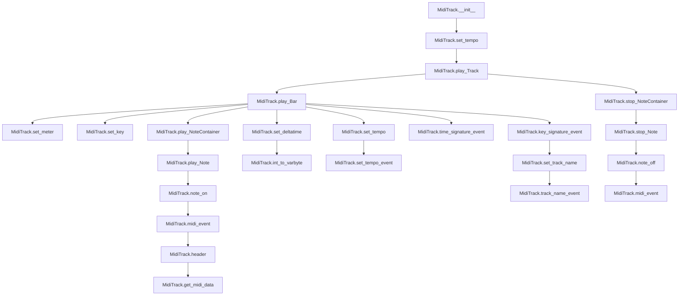

# `midi_track.py`

## `mingus.midi.midi_track.MidiTrack` · *class*

## Summary:
Represents a MIDI track that builds and manages MIDI data for musical sequences.

## Description:
The MidiTrack class serves as a container for MIDI track data, handling the construction of MIDI events for notes, tempo changes, time signatures, key signatures, and instrument settings. It provides methods to play musical elements like notes, note containers, bars, and entire tracks while managing timing and event sequencing.

This class acts as a distinct abstraction for MIDI track construction, separating the concerns of musical data representation from the actual MIDI file format generation. It maintains internal state for tempo, timing, and track metadata while building MIDI event data incrementally.

## State:
- track_data: bytes - Accumulated MIDI events for the track
- delta_time: bytes - Current delta time value for timing events (default: b"\x00")
- delay: int - Accumulated delay time in ticks (default: 0)
- bpm: int - Current tempo in beats per minute (default: 120)
- change_instrument: bool - Flag indicating if instrument change is pending (default: False)
- instrument: int - Current instrument number (default: 1)

__init__ parameters:
- start_bpm: int - Initial tempo in beats per minute (default: 120)

Class invariants:
- All MIDI event parameters must be within valid ranges (channels 0-15, note/velocity 0-127)
- track_data always contains valid MIDI event sequences
- delta_time is properly formatted as variable-length byte sequence

## Lifecycle:
Creation: Instantiate with optional start_bpm parameter
Usage: Call methods in sequence to build track data (play_Bar, play_Track, etc.)
Destruction: No explicit cleanup required; use reset() to clear track data

## Method Map:


## Raises:
- AssertionError: In midi_event method when parameter validation fails (event_type, channel, param1, param2 out of bounds)
- ValueError: From string operations when invalid keys are provided

## Example:
```python
# Create a MIDI track with 120 BPM
track = MidiTrack(120)

# Play a simple note
note = Note("C-4", 1, 64)  # Note, channel, velocity
track.play_Note(note)

# Build a complete track
track.play_Track(music_track_object)

# Get the final MIDI data
midi_data = track.get_midi_data()
```

### `mingus.midi.midi_track.MidiTrack.__init__` · *method*

## Summary:
Initializes a MIDI track with empty data and sets the starting tempo.

## Description:
Constructs a new MidiTrack instance with empty track data and initializes the tempo to the specified beats-per-minute value. This method establishes the foundational state for a MIDI track, preparing it for subsequent musical data addition through various playback methods.

The initialization process involves setting the internal track_data to an empty byte string and configuring the initial tempo using the set_tempo method. This approach separates the tempo-setting logic into its own method, promoting code reuse and maintainability.

Known callers include:
- Direct instantiation of MidiTrack objects by user code
- Internal class construction when creating new track instances

This logic is implemented as a separate method rather than being inlined because it establishes the fundamental state required for all subsequent MIDI track operations, and the tempo-setting functionality is complex enough to warrant its own dedicated method.

## Args:
    start_bpm (int): The initial tempo in beats per minute. Defaults to 120. Must be a positive integer representing tempo.

## Returns:
    None: This method initializes the object's state and does not return a value.

## Raises:
    None explicitly raised by this method, but may propagate exceptions from the set_tempo method if invalid tempo values are provided.

## State Changes:
    Attributes READ: 
        - self.bpm: Read during initialization to preserve current tempo value
        - self.track_data: Read to ensure proper initialization
    
    Attributes WRITTEN:
        - self.track_data: Set to empty byte string (b"")
        - self.bpm: Set to the provided start_bpm value

## Constraints:
    Preconditions:
        - The MidiTrack instance must be properly allocated in memory
        - The start_bpm parameter must be a positive integer (typically 1-300)
        
    Postconditions:
        - The MidiTrack's track_data attribute will be initialized to an empty byte string
        - The MidiTrack's bpm attribute will be set to the provided start_bpm value
        - The MidiTrack is ready for subsequent musical data addition

## Side Effects:
    - Modifies the internal track_data of the MidiTrack instance by setting it to an empty byte string
    - Updates the internal bpm attribute of the MidiTrack instance
    - May indirectly invoke side effects through the set_tempo method call

### `mingus.midi.midi_track.MidiTrack.end_of_track` · *method*

## Summary:
Returns the standard MIDI end-of-track meta event byte sequence.

## Description:
This method returns the fixed byte sequence that represents a MIDI end-of-track meta event. This event signals the end of a MIDI track and is required at the end of every valid MIDI track. The method is used internally by the MidiTrack class to properly construct complete MIDI track data.

## Args:
    None

## Returns:
    bytes: The byte sequence b"\x00\xff\x2f\x00" representing a MIDI end-of-track meta event.

## Raises:
    None

## State Changes:
    Attributes READ: None
    Attributes WRITTEN: None

## Constraints:
    Preconditions: None
    Postconditions: Always returns the same fixed byte sequence

## Side Effects:
    None

### `mingus.midi.midi_track.MidiTrack.play_Note` · *method*

## Summary:
Plays a musical note by adding a MIDI Note On event to the track's data buffer, with optional instrument setup.

## Description:
This method processes a musical note by extracting its channel and velocity information, optionally setting the instrument if needed, validating the velocity range, and then appending a MIDI Note On event to the track's data buffer. The method adds 12 to the note's integer representation before sending it to the MIDI system, effectively shifting the pitch up one octave.

Known callers and contexts:
- `play_NoteContainer()` - Called when playing a container of notes, typically during bar playback
- Direct external calls - Used by applications that need to add individual notes to a track

This logic is implemented as a separate method rather than being inlined because it encapsulates the complete process of preparing and storing a note event in the MIDI track data. This includes instrument management, validation, and data accumulation, making it reusable and keeping the higher-level methods cleaner.

## Args:
    note (Note): A musical note object containing note information including channel, velocity, and pitch data

## Returns:
    None: This method does not return any value

## Raises:
    AssertionError: When the note's velocity is outside the valid MIDI range (0-127)

## State Changes:
    Attributes READ: self.change_instrument, self.instrument, self.delta_time
    Attributes WRITTEN: self.track_data, self.change_instrument

## Constraints:
    Preconditions:
    - The note parameter must be a valid Note object with channel and velocity attributes
    - The note's velocity must be between 0 and 127 inclusive
    - The note's channel must be between 0 and 15 inclusive (validated by underlying note_on method)
    
    Postconditions:
    - The track's data buffer will contain the new Note On event
    - If instrument change was pending, the instrument will be set and the flag cleared
    - The note's pitch will be shifted up by one octave (integer value increased by 12) before being sent to MIDI

## Side Effects:
    Data mutation: Appends MIDI event data to self.track_data
    Conditional instrument change: Calls self.set_instrument() if self.change_instrument is True

### `mingus.midi.midi_track.MidiTrack.play_NoteContainer` · *method*

## Summary:
Plays a container of musical notes sequentially, handling single-note containers differently from multi-note containers.

## Description:
This method processes a collection of musical notes and plays them sequentially. For containers with one or zero notes, it plays all notes in the container. For containers with multiple notes, it plays the first note, resets the delta time to zero, then plays the remaining notes. This approach ensures proper timing between consecutive notes in a musical phrase.

Known callers and contexts:
- `play_Bar()` - Called during bar playback when processing note containers from musical bars
- Direct external calls - Used by applications that need to play collections of notes

This logic is separated into its own method to provide a clean abstraction for handling note containers, allowing the `play_Bar` method to manage timing and sequencing without duplicating the note-playing logic.

## Args:
    notecontainer (list-like): A collection of musical note objects to be played sequentially

## Returns:
    None: This method does not return any value

## Raises:
    None: This method does not explicitly raise exceptions

## State Changes:
    Attributes READ: None
    Attributes WRITTEN: self.track_data (through calls to play_Note), self.delta_time (through calls to set_deltatime)

## Constraints:
    Preconditions:
    - The notecontainer parameter must be iterable and contain valid note objects
    - Each note in the container must be compatible with the play_Note method
    - The MidiTrack instance must be properly initialized
    
    Postconditions:
    - All notes in the container will be added to the track's data buffer
    - Timing between notes will be properly managed with delta time reset for multi-note containers

## Side Effects:
    Data mutation: Appends MIDI event data to self.track_data through calls to play_Note
    Timing control: Modifies self.delta_time through calls to set_deltatime

### `mingus.midi.midi_track.MidiTrack.play_Bar` · *method*

## Summary:
Processes a musical bar by generating MIDI events for its contents, handling meter, key, tempo changes, and note playback.

## Description:
This method converts a Bar object into a sequence of MIDI events, managing musical timing, key signatures, meter changes, and note playback. It iterates through the bar's contents, calculating appropriate tick durations for notes based on their duration values, and generates the necessary MIDI events for playing and stopping notes.

Known callers include:
- `play_Track()` - when processing individual bars within a musical track
- Direct calls from user code when playing individual bars

This logic is separated into its own method to encapsulate the complex process of converting musical bar structures into MIDI event sequences, providing a clean abstraction between high-level musical concepts and low-level MIDI operations.

## Args:
    bar (Bar): A Bar object containing musical content with meter, key, and note information. Each element in the bar is a tuple of format [start_beat, duration, note_container] where:
        - start_beat (float): The position in beats where the musical element starts
        - duration (float): The duration of the musical element in beats (e.g., 1.0 for a whole note, 0.5 for a half note)
        - note_container (NoteContainer or None): Collection of notes to play, or None to represent a rest

## Returns:
    None: This method modifies the MidiTrack's internal state directly and does not return a value.

## Raises:
    None explicitly raised, but may propagate exceptions from underlying methods like play_NoteContainer, stop_NoteContainer, or set_tempo.

## State Changes:
    Attributes READ: 
        - self.delay
        - self.bpm
        - self.track_data
        - self.delta_time
    
    Attributes WRITTEN:
        - self.delay: Accumulated delay time for subsequent events
        - self.bpm: Updated when tempo changes are encountered
        - self.track_data: Appended with MIDI events for meter, key, tempo, and note playback

## Constraints:
    Preconditions:
        - The bar parameter must be a valid Bar object with proper meter and key attributes
        - The bar must be iterable with elements having the structure [start_beat, duration, note_container]
        - The MidiTrack instance must be properly initialized
        - Each note_container should be either None, empty, or a valid NoteContainer object
        
    Postconditions:
        - The MidiTrack's track_data will contain MIDI events representing the bar's musical content
        - The MidiTrack's delay attribute will be reset to 0 after processing
        - The MidiTrack's bpm attribute may be updated if tempo changes occur within the bar
        - All musical elements in the bar will be properly converted to MIDI events

## Side Effects:
    - Generates MIDI events for meter signatures, key signatures, tempo changes, and note playback
    - May produce audible sound through audio output drivers when notes are played
    - May cause I/O operations if recording is enabled
    - Modifies the internal track_data of the MidiTrack instance

### `mingus.midi.midi_track.MidiTrack.play_Track` · *method*

## Summary:
Processes a musical track by setting track metadata, handling instrument changes, and sequentially playing each bar in the track.

## Description:
This method takes a track object and processes it by extracting track metadata (name), handling instrument changes, and sequentially playing each bar in the track using the existing play_Bar method. It serves as the main entry point for converting a musical track structure into MIDI events.

Known callers include:
- Direct user code that wants to play a complete track
- Potentially other methods in the MIDI system that orchestrate track playback

This logic is separated into its own method to provide a clean interface for track-level playback while delegating the detailed bar processing to the play_Bar method, maintaining separation of concerns between track metadata handling and bar-specific MIDI event generation.

## Args:
    track (object): A track object that should have the following attributes:
        - Optional name attribute: If present, will be set using set_track_name
        - Optional instrument attribute: If present and has instrument_nr attribute, will trigger instrument change
        - Iterable of bars: Must be iterable where each item represents a musical bar to be played

## Returns:
    None: This method operates by modifying the MidiTrack's internal state directly and does not return a value.

## Raises:
    None explicitly raised, but may propagate exceptions from underlying methods like set_track_name, play_Bar, or attribute access.

## State Changes:
    Attributes READ: 
        - self.delay: Read to reset to 0
        - self.change_instrument: Read to check if instrument change is needed
        - self.instrument: Read to check if instrument change is needed
        - self.track_data: Read indirectly through set_track_name and play_Bar calls
    
    Attributes WRITTEN:
        - self.delay: Set to 0 at start of processing
        - self.change_instrument: Set to True when instrument change is detected
        - self.instrument: Set to instrument_nr when instrument change is detected

## Constraints:
    Preconditions:
        - The track parameter must be an object that can be iterated over to yield bars
        - The track object may optionally have a name attribute
        - The track object may optionally have an instrument attribute with instrument_nr attribute
        - Each bar yielded by the track must be compatible with the play_Bar method
        
    Postconditions:
        - The MidiTrack's delay attribute will be reset to 0
        - If instrument information is present, the change_instrument flag will be set and instrument will be updated
        - All bars in the track will be processed via play_Bar method
        - The MidiTrack's track_data will be populated with MIDI events from the entire track

## Side Effects:
    - Modifies the internal track_data of the MidiTrack instance through calls to set_track_name and play_Bar
    - May trigger instrument change MIDI events if instrument information is present
    - May generate MIDI events for track names, meter signatures, key signatures, and note playback

### `mingus.midi.midi_track.MidiTrack.stop_Note` · *method*

## Summary:
Stops a musical note by adding a MIDI Note Off event to the track's data buffer.

## Description:
This method generates and appends a MIDI Note Off event to the track's data buffer for the specified musical note. It extracts the channel and velocity information from the note object and uses these along with the note's pitch (shifted up one octave) to create a proper MIDI note-off event. This method is part of the complete note playback cycle, working in conjunction with `play_Note` to provide full note duration control.

Known callers and contexts:
- `stop_NoteContainer()` - Called when stopping a container of notes, typically during bar playback
- Direct external calls - Used by applications that need to explicitly stop individual notes

This logic is implemented as a separate method rather than being inlined because it encapsulates the complete process of generating a MIDI note-off event and appending it to the track data. This provides a clean separation between note creation and note termination, making the MIDI track management more modular and easier to maintain.

## Args:
    note (Note): A musical note object containing note information including channel, velocity, and pitch data

## Returns:
    None: This method does not return any value

## Raises:
    None explicitly raised, but may propagate exceptions from underlying methods like `note_off` if parameter validation fails.

## State Changes:
    Attributes READ: self.track_data, self.delta_time
    Attributes WRITTEN: self.track_data (appended with MIDI note-off event)

## Constraints:
    Preconditions:
    - The note parameter must be a valid Note object with channel and velocity attributes
    - The note's channel must be between 0 and 15 inclusive (validated by underlying note_off method)
    - The note's velocity must be between 0 and 127 inclusive (validated by underlying note_off method)
    
    Postconditions:
    - The track's data buffer will contain the new Note Off event
    - The note's pitch will be shifted up by one octave (integer value increased by 12) before being sent to MIDI

## Side Effects:
    Data mutation: Appends MIDI event data to self.track_data

### `mingus.midi.midi_track.MidiTrack.stop_NoteContainer` · *method*

## Summary:
Stops multiple musical notes by processing a note container and generating MIDI Note Off events for each note.

## Description:
This method processes a container of musical notes and stops them by generating MIDI Note Off events. It handles containers with one or more notes differently to ensure proper timing. For containers with one or fewer notes, it stops all notes in sequence. For containers with multiple notes, it stops the first note, resets the delta time to zero, then stops the remaining notes.

Known callers and contexts:
- `play_Bar()` - Called during bar playback when stopping notes at the end of musical phrases
- Direct external calls - Used by applications that need to explicitly stop containers of notes

This logic is separated into its own method rather than being inlined because it provides a standardized way to handle batch note stopping operations while maintaining proper MIDI timing semantics. It mirrors the pattern established by `play_NoteContainer` for consistency in the API design.

## Args:
    notecontainer (list-like): A collection of musical note objects to be stopped. Each note should have channel and velocity attributes.

## Returns:
    None: This method does not return any value.

## Raises:
    None explicitly raised, but may propagate exceptions from underlying methods like `stop_Note` or `set_deltatime` if parameter validation fails.

## State Changes:
    Attributes READ: self.delta_time
    Attributes WRITTEN: self.track_data (appended with MIDI note-off events), self.delta_time (potentially modified by set_deltatime)

## Constraints:
    Preconditions:
    - The notecontainer parameter must be a collection-like object with a valid __len__ method
    - Each note in the container must be a valid note object with channel and velocity attributes
    - The container should not be empty for the multi-note branch to execute properly
    
    Postconditions:
    - All notes in the container will have their corresponding MIDI Note Off events added to the track data
    - The delta time will be reset to zero after processing the first note in multi-note containers
    - The track's data buffer will contain the new Note Off events for all processed notes

## Side Effects:
    Data mutation: Appends MIDI event data to self.track_data
    Timing modification: Calls set_deltatime to reset timing between note stopping operations

### `mingus.midi.midi_track.MidiTrack.set_instrument` · *method*

## Summary:
Sets the instrument for a specified MIDI channel by configuring the bank and program change events.

## Description:
Configures a MIDI channel to use a specific instrument by first selecting the appropriate bank and then sending a program change event. This method is used to assign instruments to MIDI channels in a track, allowing for proper instrument playback in MIDI files.

The method is typically called during track initialization or when changing instruments within a MIDI sequence. It combines two separate MIDI operations: bank selection followed by program change, both of which are essential for proper instrument assignment in MIDI systems.

## Args:
    channel (int): The MIDI channel number (0-15) to configure for the instrument.
    instr (int): The instrument number (0-127) to assign to the channel.
    bank (int): Optional bank number (0-127) to select for the channel. Defaults to 1.

## Returns:
    None: This method does not return a value.

## Raises:
    AssertionError: If channel is not between 0-15, or if instr/bank is not between 0-127.

## State Changes:
    Attributes READ: self.track_data, self.delta_time
    Attributes WRITTEN: self.track_data

## Constraints:
    Preconditions:
        - channel must be an integer between 0 and 15 inclusive
        - instr must be an integer between 0 and 127 inclusive
        - bank must be an integer between 0 and 127 inclusive (when specified)
    Postconditions:
        - The track_data attribute contains the bank selection and program change events
        - The specified channel will use the requested instrument for subsequent MIDI events

## Side Effects:
    None

### `mingus.midi.midi_track.MidiTrack.header` · *method*

## Summary:
Calculates and returns the MIDI track header chunk for the current track.

## Description:
Generates the header portion of a MIDI track chunk by combining the track header identifier "MTrk" with the calculated chunk size. This method is responsible for creating the proper MIDI file structure header that precedes the track data. The header includes the "MTrk" identifier followed by the size of the track data plus the end-of-track event.

## Args:
    None

## Returns:
    bytes: A byte sequence containing the MIDI track header with proper chunk size encoding.

## Raises:
    None

## State Changes:
    Attributes READ: self.track_data, self.end_of_track()
    Attributes WRITTEN: None

## Constraints:
    Preconditions: 
    - self.track_data must be a bytes object containing the track events
    - self.end_of_track() must return a bytes object representing the end-of-track event
    Postconditions:
    - Returns properly formatted MIDI track header bytes
    - The returned header correctly encodes the total track data size

## Side Effects:
    None

### `mingus.midi.midi_track.MidiTrack.get_midi_data` · *method*

## Summary:
Returns the complete MIDI track data by combining the track header, track content, and end-of-track marker.

## Description:
Constructs and returns the complete MIDI track data by concatenating three components: the track header (which includes the chunk size calculated from track data), the actual track content stored in `track_data`, and the end-of-track meta event. This method is typically called during MIDI file construction to generate the final track data that can be written to a MIDI file.

This method serves as a central coordination point for assembling all the components of a MIDI track into a single binary sequence. It's designed as a separate method rather than being inlined because it provides a clean abstraction for the track data construction process and allows for easy testing and reuse.

## Args:
    None

## Returns:
    bytes: A complete MIDI track data sequence consisting of header, track content, and end-of-track marker

## Raises:
    None

## State Changes:
    Attributes READ: 
    - self.track_data: Contains the actual MIDI events for this track
    - self.header(): Calculates the track header with proper chunk size
    - self.end_of_track(): Provides the end-of-track marker
    
    Attributes WRITTEN: 
    - None

## Constraints:
    Preconditions:
    - The `track_data` attribute should contain valid MIDI event data
    - The `header()` method should properly calculate the chunk size
    - The `end_of_track()` method should return the standard end-of-track sequence
    
    Postconditions:
    - Returns a properly formatted MIDI track with correct header, content, and termination
    - The returned bytes represent a complete, valid MIDI track structure

## Side Effects:
    None

### `mingus.midi.midi_track.MidiTrack.midi_event` · *method*

## Summary:
Constructs and returns a MIDI event byte sequence for a given event type, channel, and parameters.

## Description:
Creates a properly formatted MIDI event by combining a status byte with event parameters. This method serves as the foundation for all MIDI event construction within the MidiTrack class, providing a standardized interface for creating various MIDI messages such as note on/off events, controller changes, and program changes. It is used internally by higher-level methods like note_on(), note_off(), controller_event(), and program_change_event().

## Args:
    event_type (int): MIDI event type (0-15). Standard MIDI event types include NOTE_OFF=0x8, NOTE_ON=0x9, CONTROLLER=0xB, PROGRAM_CHANGE=0xC, etc.
    channel (int): MIDI channel number (0-15). Specifies which channel the event should be sent to.
    param1 (int): First parameter for the MIDI event (0-127). Typically note number (0-127) or controller number (0-127).
    param2 (int, optional): Second parameter for the MIDI event (0-127). Typically velocity (0-127) or controller value (0-127). Defaults to None.

## Returns:
    bytes: A byte sequence representing the complete MIDI event, including delta time prefix from self.delta_time.

## Raises:
    AssertionError: When any of the parameter validation conditions fail:
        - event_type must be between 0 and 15 inclusive
        - channel must be between 0 and 15 inclusive  
        - param1 must be between 0 and 127 inclusive
        - param2 must be None or between 0 and 127 inclusive

## State Changes:
    Attributes READ: self.delta_time
    Attributes WRITTEN: None

## Constraints:
    Preconditions:
        - event_type must be in range [0, 15]
        - channel must be in range [0, 15]
        - param1 must be in range [0, 127]
        - param2 must be None or in range [0, 127]
    Postconditions:
        - Returns a properly formatted MIDI event byte sequence
        - The returned bytes include the delta time prefix from self.delta_time

## Side Effects:
    None

### `mingus.midi.midi_track.MidiTrack.note_off` · *method*

## Summary:
Sets a MIDI note off event for the specified channel, note, and velocity.

## Description:
Creates and appends a MIDI note off event to the track's data. This method is used to signal the end of a note playback by sending a note off message to the specified MIDI channel with the given note number and velocity. It is part of the standard MIDI protocol for controlling note duration and is typically called after a corresponding note on event.

## Args:
    channel (int): MIDI channel number (0-15) specifying which channel to send the note off event to.
    note (int): Note number (0-127) representing the musical note to turn off.
    velocity (int): Velocity value (0-127) indicating how hard the note was released.

## Returns:
    bytes: A byte sequence representing the complete MIDI note off event, including the delta time prefix from self.delta_time.

## Raises:
    AssertionError: When parameter validation fails:
        - channel must be between 0 and 15 inclusive
        - note must be between 0 and 127 inclusive
        - velocity must be between 0 and 127 inclusive

## State Changes:
    Attributes READ: self.delta_time
    Attributes WRITTEN: None

## Constraints:
    Preconditions:
        - channel must be in range [0, 15]
        - note must be in range [0, 127]
        - velocity must be in range [0, 127]
    Postconditions:
        - Returns a properly formatted MIDI note off event byte sequence
        - The returned bytes include the delta time prefix from self.delta_time

## Side Effects:
    None

### `mingus.midi.midi_track.MidiTrack.note_on` · *method*

## Summary:
Sets up and returns a MIDI Note On event for the specified channel, note, and velocity.

## Description:
This method creates a MIDI Note On event by delegating to the internal `midi_event` method with the appropriate event type constant. It's used to signal the beginning of a note playback in a MIDI track.

## Args:
    channel (int): The MIDI channel number (0-15) to send the event on.
    note (int): The MIDI note number (0-127) to play.
    velocity (int): The velocity (0-127) of the note onset.

## Returns:
    bytes: A byte string representing the complete MIDI Note On event.

## Raises:
    AssertionError: If any of the parameters are out of their valid ranges (channel: 0-15, note: 0-127, velocity: 0-127).

## State Changes:
    Attributes READ: None
    Attributes WRITTEN: None

## Constraints:
    Preconditions: 
    - Channel must be between 0 and 15 inclusive
    - Note must be between 0 and 127 inclusive  
    - Velocity must be between 0 and 127 inclusive
    
    Postconditions:
    - Returns a properly formatted MIDI event byte sequence
    - The returned bytes include the correct status byte and parameters

## Side Effects:
    None

### `mingus.midi.midi_track.MidiTrack.controller_event` · *method*

## Summary:
Creates a MIDI controller event message for the specified channel, controller number, and value.

## Description:
This method generates a MIDI controller event message by delegating to the midi_event method with the appropriate controller event type. Controller events are used to modify various aspects of MIDI playback such as volume, pan, modulation, and other controller parameters. This is a convenience method that provides a clean interface for creating controller events without needing to know the underlying MIDI event type constants.

## Args:
    channel (int): The MIDI channel number (0-15) to send the controller event on.
    contr_nr (int): The controller number (0-127) specifying which controller to modify.
    contr_val (int): The controller value (0-127) to set the controller to.

## Returns:
    bytes: A byte string containing the complete MIDI controller event message including delta time prefix, status byte, and controller parameters.

## Raises:
    AssertionError: If channel is not between 0-15, or if contr_nr or contr_val are not between 0-127.

## State Changes:
    Attributes READ: self.delta_time
    Attributes WRITTEN: None

## Constraints:
    Preconditions: 
    - channel must be an integer between 0 and 15 inclusive
    - contr_nr must be an integer between 0 and 127 inclusive  
    - contr_val must be an integer between 0 and 127 inclusive
    Postconditions:
    - Returns a properly formatted MIDI controller event message
    - The returned bytes include the delta time prefix

## Side Effects:
    None

### `mingus.midi.midi_track.MidiTrack.reset` · *method*

## Summary:
Resets the MIDI track's data buffer and delta time to their initial empty states.

## Description:
Clears the track's accumulated MIDI data and resets the delta time counter to zero. This method prepares the MidiTrack object for reuse when creating a new MIDI track, effectively clearing any previously accumulated MIDI events and resetting timing state.

This method exists as a dedicated utility to provide a clean way to reset track state without having to recreate the entire MidiTrack object. It's particularly useful when building multiple tracks or when reusing a MidiTrack instance for different musical compositions.

## Args:
    None

## Returns:
    None

## Raises:
    None

## State Changes:
    Attributes READ: 
        None
    
    Attributes WRITTEN:
        - self.track_data: Set to empty bytes (b"")
        - self.delta_time: Set to null byte (b"\x00")

## Constraints:
    Preconditions:
        - The MidiTrack object must be properly initialized
        - No specific preconditions beyond normal object state
        
    Postconditions:
        - The track_data attribute will be an empty bytes object
        - The delta_time attribute will be a null byte (b"\x00")

## Side Effects:
    None

### `mingus.midi.midi_track.MidiTrack.set_deltatime` · *method*

## Summary:
Sets the delta_time attribute of a MidiTrack object, converting integer values to MIDI variable-length byte format.

## Description:
This method assigns a delta time value to the MidiTrack's delta_time attribute. When an integer is provided, it automatically converts it to MIDI's variable-length byte format using the class's `int_to_varbyte` method. This ensures proper MIDI file format compliance for timing information.

The method is called during various playback operations such as when playing notes, bars, or tracks to manage timing between musical events. It's designed as a separate method to encapsulate the conversion logic and maintain clean separation of concerns.

## Args:
    delta_time (int or bytes): Either an integer representing ticks or pre-encoded MIDI variable-length bytes. If an integer is provided, it will be converted to MIDI variable-length format using `int_to_varbyte`.

## Returns:
    None: This method does not return a value.

## Raises:
    None explicitly raised by this method.

## State Changes:
    Attributes READ: None
    Attributes WRITTEN: self.delta_time

## Constraints:
    Preconditions: The input delta_time should be either an integer (non-negative) or bytes object
    Postconditions: The self.delta_time attribute is updated with either the provided bytes or the MIDI variable-length encoded version of the integer

## Side Effects:
    None

### `mingus.midi.midi_track.MidiTrack.select_bank` · *method*

## Summary:
Selects a MIDI bank for the specified channel by sending a bank select controller event.

## Description:
This method sends a MIDI bank select controller event to the specified channel with the given bank number. It is used to change the instrument bank that will be used when a program change occurs. This method is typically called as part of the instrument setup process before changing programs.

## Args:
    channel (int): The MIDI channel number (0-15) to send the bank select event on.
    bank (int): The bank number (0-127) to select for the channel.

## Returns:
    bytes: A byte string containing the complete MIDI bank select controller event message including delta time prefix, status byte, and controller parameters.

## Raises:
    AssertionError: If channel is not between 0-15, or if bank is not between 0-127.

## State Changes:
    Attributes READ: self.delta_time
    Attributes WRITTEN: None

## Constraints:
    Preconditions: 
    - channel must be an integer between 0 and 15 inclusive
    - bank must be an integer between 0 and 127 inclusive
    Postconditions:
    - Returns a properly formatted MIDI controller event message for bank selection
    - The returned bytes include the delta time prefix

## Side Effects:
    None

### `mingus.midi.midi_track.MidiTrack.program_change_event` · *method*

## Summary:
Sets the program (instrument) for a specified MIDI channel by creating a program change MIDI event.

## Description:
This method creates and returns a MIDI program change event for the specified channel and instrument number. Program change events are used to switch instruments on MIDI channels. This method serves as a specialized interface for creating program change events, delegating the actual event construction to the underlying `midi_event` method.

The method is typically called when setting up instrument assignments for MIDI tracks, particularly in the context of `set_instrument` method which uses this to configure instruments for playback.

## Args:
    channel (int): MIDI channel number (0-15) specifying which channel to change the instrument on.
    instr (int): Instrument number (0-127) specifying which instrument to select.

## Returns:
    bytes: A byte sequence representing the complete MIDI program change event, including the delta time prefix from self.delta_time.

## Raises:
    AssertionError: When parameter validation fails:
        - channel must be between 0 and 15 inclusive
        - instr must be between 0 and 127 inclusive

## State Changes:
    Attributes READ: self.delta_time
    Attributes WRITTEN: None

## Constraints:
    Preconditions:
        - channel must be in range [0, 15]
        - instr must be in range [0, 127]
    Postconditions:
        - Returns a properly formatted MIDI program change event byte sequence
        - The returned bytes include the delta time prefix from self.delta_time

## Side Effects:
    None

### `mingus.midi.midi_track.MidiTrack.set_tempo` · *method*

## Summary:
Sets the tempo of the MIDI track by updating the BPM value and appending a tempo change event to the track data.

## Description:
Configures the MIDI track's tempo by storing the new BPM value and generating the corresponding MIDI meta event for tempo changes. This method is typically called when processing musical bars that contain tempo changes or when initializing a track with a specific tempo.

Known callers include:
- `play_Bar()` - when processing musical bars that contain tempo change information
- Direct user code when explicitly changing the track's tempo

This logic is separated into its own method to encapsulate the dual responsibility of updating the tempo state and generating the appropriate MIDI event, providing a clean abstraction for tempo management within MIDI tracks.

## Args:
    bpm (int): The tempo in beats per minute. Must be a positive integer typically ranging from 1 to 300, though technically any positive integer is acceptable.

## Returns:
    None: This method modifies the MidiTrack's internal state directly and does not return a value.

## Raises:
    None explicitly raised, but may propagate exceptions from underlying methods like set_tempo_event.

## State Changes:
    Attributes READ: 
        - self.bpm: Read to preserve current tempo value during initialization
        - self.track_data: Read to append new tempo event data
    
    Attributes WRITTEN:
        - self.bpm: Updated with the new tempo value
        - self.track_data: Appended with the MIDI tempo event data

## Constraints:
    Preconditions:
        - The bpm parameter must be a positive integer
        - The MidiTrack instance must be properly initialized
        - The set_tempo_event method must be available and functional
        
    Postconditions:
        - The MidiTrack's bpm attribute will be set to the provided value
        - The MidiTrack's track_data will contain the MIDI tempo event for the new tempo
        - The tempo change will be reflected in the generated MIDI file

## Side Effects:
    - Modifies the internal track_data of the MidiTrack instance by appending tempo event bytes
    - Updates the internal bpm attribute of the MidiTrack instance

### `mingus.midi.midi_track.MidiTrack.set_tempo_event` · *method*

## Summary:
Creates a MIDI meta event for setting the tempo of a track.

## Description:
Generates a MIDI tempo event that specifies the tempo in beats per minute (BPM). This method is responsible for converting the BPM value into the proper MIDI format (microseconds per quarter note) and constructing the complete MIDI meta event packet. It is called internally by the set_tempo method whenever a tempo change needs to be recorded in the MIDI track data.

Known callers include:
- `set_tempo()` - when updating the track's tempo and recording the change in track data

This logic is separated into its own method to encapsulate the conversion and construction of MIDI tempo events, allowing the set_tempo method to focus on managing the track's tempo state while delegating the low-level MIDI formatting to this dedicated helper.

## Args:
    bpm (int): The tempo in beats per minute. Must be a positive integer representing the desired tempo.

## Returns:
    bytes: A byte string containing the complete MIDI meta event for tempo setting, including delta time prefix, meta event marker, tempo command, length indicator, and tempo data.

## Raises:
    None explicitly raised, but may raise exceptions from underlying operations such as integer division or byte conversion if invalid parameters are provided.

## State Changes:
    Attributes READ: 
        - self.delta_time: Read to prefix the tempo event with appropriate timing information
        
    Attributes WRITTEN:
        - None: This method is read-only and does not modify any instance attributes

## Constraints:
    Preconditions:
        - The bpm parameter must be a positive integer greater than zero
        - The MidiTrack instance must be properly initialized
        - The META_EVENT and SET_TEMPO constants must be properly defined
        
    Postconditions:
        - Returns a properly formatted MIDI meta event for tempo changes
        - The returned bytes represent a valid MIDI tempo specification in MPQN format

## Side Effects:
    - None: This method is pure and does not cause any external I/O or state modifications beyond returning a byte string

### `mingus.midi.midi_track.MidiTrack.set_meter` · *method*

## Summary:
Sets the time signature (meter) of a MIDI track by appending a time signature event to the track's data.

## Description:
Configures the musical meter for the MIDI track, specifying the number of beats per measure and the note value that represents one beat. This method is typically called during the construction of a MIDI track when setting up the rhythmic structure of musical bars.

## Args:
    meter (tuple[int, int]): A tuple representing the time signature in the form (numerator, denominator). Default is (4, 4).

## Returns:
    None: This method does not return a value.

## Raises:
    None explicitly raised.

## State Changes:
    Attributes READ: self.track_data, self.delta_time
    Attributes WRITTEN: self.track_data

## Constraints:
    Preconditions: The meter tuple must contain valid integers where the denominator is a power of 2.
    Postconditions: The track's data will contain a time signature MIDI event reflecting the specified meter.

## Side Effects:
    None: This method only modifies the internal track_data attribute and does not perform any I/O or external service calls.

### `mingus.midi.midi_track.MidiTrack.time_signature_event` · *method*

## Summary:
Creates a MIDI time signature meta event for the track with the specified meter.

## Description:
Constructs a complete MIDI meta event containing time signature information. This method generates a standard MIDI time signature event that specifies the meter (numerator, denominator) for the track. Time signature events are used to define the rhythmic structure of a musical piece, allowing for changes in meter throughout the composition.

## Args:
    meter (tuple[int, int]): Time signature meter as (numerator, denominator). Defaults to (4, 4).

## Returns:
    bytes: A complete MIDI meta event in standard MIDI format containing time signature information. The structure consists of:
        - Delta time (timing information)
        - Meta event identifier (0xFF)
        - Time signature event type (0x58)
        - Event length (0x04)
        - Numerator (1 byte)
        - Denominator (1 byte, represented as log2(denominator))
        - Two fixed bytes (0x18, 0x08)

## Raises:
    None explicitly raised, but may raise exceptions from underlying operations like log() or a2b_hex() when processing invalid inputs.

## State Changes:
    Attributes READ: self.delta_time
    Attributes WRITTEN: None

## Constraints:
    Preconditions: 
    - Meter must be a tuple with two integers
    - Denominator must be a power of 2 (2, 4, 8, 16, 32, etc.) for valid MIDI time signatures
    - Numerator must be a positive integer
    
    Postconditions:
    - Returns properly formatted MIDI meta event bytes
    - Event contains valid time signature data in standard MIDI format

## Side Effects:
    None

### `mingus.midi.midi_track.MidiTrack.set_key` · *method*

## Summary:
Sets the key signature for the MIDI track by appending a key signature meta event to the track data.

## Description:
Configures the musical key signature for the MIDI track. This method accepts either a string representation of a key (like "C" for C major or "a" for A minor) or a Key object from mingus.core.keys. When a Key object is provided, it extracts the first character of the key's name property to determine the key. The method is typically called during the construction of a MIDI track when processing musical bars.

## Args:
    key (str or Key): The musical key to set. Can be a string representation like "C" (major) or "a" (minor), or a Key object from mingus.core.keys. Defaults to "C".

## Returns:
    None: This method does not return a value but modifies the internal track_data.

## Raises:
    ValueError: If the key string is not found in either major_keys or minor_keys lists from mingus.core.keys.

## State Changes:
    Attributes READ: self.track_data, self.delta_time
    Attributes WRITTEN: self.track_data

## Constraints:
    Preconditions: The key parameter must be a valid key name present in either major_keys or minor_keys from mingus.core.keys
    Postconditions: The track_data attribute contains the key signature meta event for the specified key

## Side Effects:
    None

### `mingus.midi.midi_track.MidiTrack.key_signature_event` · *method*

## Summary:
Creates a MIDI meta event for specifying the key signature of a musical piece.

## Description:
This method generates a MIDI key signature meta event that indicates the key of the music. It handles both major and minor keys by calculating the appropriate number of sharps or flats and encoding them according to the MIDI standard. The method is typically called internally by the `set_key` method when building MIDI tracks.

## Args:
    key (str): The musical key as a string, e.g., "C", "a" (for C minor). Defaults to "C".

## Returns:
    bytes: A complete MIDI meta event containing the key signature information with structure: 
           delta_time + META_EVENT + KEY_SIGNATURE + b"\x02" + key_data + mode
           Where key_data is a single byte representing the number of sharps/flats,
           and mode is a single byte indicating major (0x00) or minor (0x01).

## Raises:
    ValueError: If the key is not found in either major_keys or minor_keys lists from mingus.core.keys.

## State Changes:
    Attributes READ: self.delta_time
    Attributes WRITTEN: None

## Constraints:
    Preconditions: The key parameter must be a valid key name present in either major_keys or minor_keys from mingus.core.keys
    Postconditions: Returns a properly formatted MIDI meta event for key signature with correct byte structure

## Side Effects:
    None

### `mingus.midi.midi_track.MidiTrack.set_track_name` · *method*

## Summary:
Sets the name of the MIDI track by appending a track name meta event to the track data.

## Description:
This method configures the track name for a MIDI track by creating a proper MIDI meta event containing the specified name and appending it to the track's data buffer. This allows MIDI players to identify the track by name.

## Args:
    name (str): The name to assign to the MIDI track. Must be a valid ASCII string.

## Returns:
    None: This method does not return a value.

## Raises:
    UnicodeEncodeError: If the name contains non-ASCII characters that cannot be encoded.

## State Changes:
    Attributes READ: self.track_data
    Attributes WRITTEN: self.track_data

## Constraints:
    Preconditions: The name parameter must be a string that can be encoded as ASCII.
    Postconditions: The track_data attribute will contain the track name meta event appended to its existing content.

## Side Effects:
    None: This method only modifies the internal track_data attribute and has no external side effects.

### `mingus.midi.midi_track.MidiTrack.track_name_event` · *method*

## Summary:
Creates a MIDI meta event for setting a track's name in a MIDI file.

## Description:
Generates a properly formatted MIDI track name event that can be embedded in a MIDI track. This method constructs the binary representation of a MIDI meta event with the track name type, including the variable-length encoded length field and the ASCII-encoded name string. The resulting bytes follow the MIDI specification for meta events.

This method is typically called internally by the `set_track_name` method when adding a track name to a MIDI track. It's part of the MIDI file format specification where meta events are used to store information about the track such as its name, tempo changes, time signatures, etc.

## Args:
    name (str): The track name to encode into the MIDI event. Must be ASCII-compatible.

## Returns:
    bytes: A complete MIDI meta event containing the track name, formatted according to MIDI specification with proper variable-length encoding for the length field. The structure follows: delta_time (0) + META_EVENT (0xFF) + TRACK_NAME (0x03) + length_variable_bytes + name_bytes.

## Raises:
    UnicodeEncodeError: When the name parameter contains non-ASCII characters that cannot be encoded to ASCII.

## State Changes:
    Attributes READ: None
    Attributes WRITTEN: None

## Constraints:
    Preconditions: The name parameter must be a string that can be encoded to ASCII
    Postconditions: The returned bytes represent a valid MIDI meta event with track name type

## Side Effects:
    None

### `mingus.midi.midi_track.MidiTrack.int_to_varbyte` · *method*

## Summary:
Converts a non-negative integer into MIDI variable-length byte representation for encoding delta times and other variable-sized values.

## Description:
This method implements MIDI's variable-length encoding format, where integers are represented as a sequence of bytes. Each byte contains 7 bits of the original value plus a continuation bit. The most significant bit of each byte (except the last) is set to 1 to indicate that more bytes follow. This encoding is used throughout MIDI files for delta times, note durations, and other values that may require variable storage sizes.

The method is called internally by the MidiTrack class when setting delta times via `set_deltatime` and when encoding track names via `track_name_event`. This encapsulation ensures proper MIDI format compliance throughout the class.

## Args:
    value (int): The non-negative integer value to encode. Must be >= 0.

## Returns:
    bytes: Variable-length byte sequence representing the input value in MIDI format. For value=0, returns b'\x00'; for other values, returns bytes in MIDI variable-length format.

## Raises:
    None explicitly raised, but may raise underlying exceptions from math.log or struct.pack for extremely large inputs.

## State Changes:
    Attributes READ: None
    Attributes WRITTEN: None

## Constraints:
    Preconditions: Input value must be a non-negative integer (>= 0)
    Postconditions: Output is a bytes object containing properly encoded variable-length bytes in MIDI format

## Side Effects:
    None

