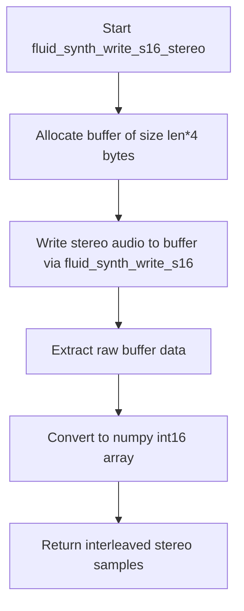
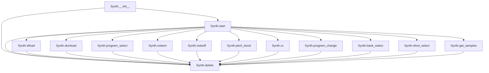
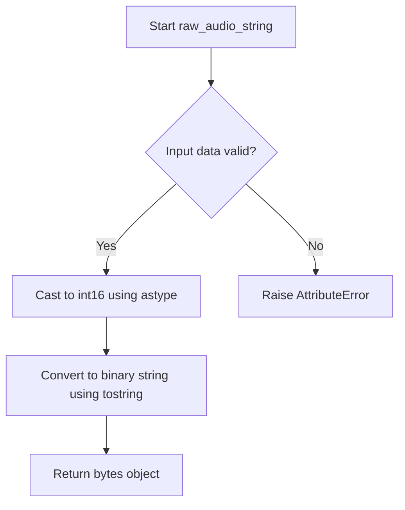

# `pyfluidsynth.py`

## `mingus.midi.pyfluidsynth.cfunc` · *function*

## Summary:
Creates a ctypes function prototype for interfacing with C library functions using specified parameter types and calling conventions.

## Description:
This helper function constructs a ctypes CFUNCTYPE that enables Python to call C functions from dynamically linked libraries. It processes argument specifications to define parameter types and calling convention flags, returning a callable function type that can be used to create function pointers to C functions. This abstraction simplifies the process of creating ctypes function wrappers for C library interfaces.

## Args:
    name (str): Name of the C function to be wrapped
    result (type): Return type of the C function (e.g., c_int, c_float)
    *args: Variable-length argument specification tuples, each containing:
        - Parameter name (str): Name of the parameter
        - Parameter type (type): ctypes type for the parameter (e.g., c_int, c_char_p)
        - Calling convention flag (int): Flag indicating calling convention
        - Additional flags or metadata (tuple): Optional additional parameters

## Returns:
    ctypes.CFUNCTYPE: A callable function type that can be used to create function pointers to C functions with the specified signature and calling convention

## Raises:
    None explicitly raised by this function

## Constraints:
    Preconditions:
    - The `name` parameter must be a valid string identifying a C function
    - The `result` parameter must be a valid ctypes type
    - Each item in `args` must be a tuple with at least 3 elements: (name, type, flag)
    - The `_fl` variable must be defined in the module scope (likely a library handle or function pointer)

    Postconditions:
    - Returns a properly constructed CFUNCTYPE object matching the specified signature
    - The returned type can be used to create callable function objects for C functions

## Side Effects:
    None

## Control Flow:
```mermaid
flowchart TD
    A[Start cfunc] --> B{Process args}
    B --> C[Extract parameter types (atypes) from arg[1]]
    C --> D[Extract flags (aflags) from arg[2], arg[0], arg[3:]]
    D --> E[Create CFUNCTYPE with result and atypes]
    E --> F[Return CFUNCTYPE((name, _fl), tuple(aflags)))
```

## Examples:
    # Typical usage pattern:
    # func_type = cfunc("my_c_function", c_int, ("param1", c_int, 1, 0))
    # my_func = func_type((name, _fl), tuple(aflags))
```

## `mingus.midi.pyfluidsynth.fluid_synth_write_s16_stereo` · *function*

## Summary:
Generates stereo audio samples from a FluidSynth synthesizer and returns them as a NumPy array of signed 16-bit integers.

## Description:
This function acts as a convenience wrapper that extracts stereo audio data from a FluidSynth synthesizer instance. It internally manages buffer allocation and conversion from raw binary data to a structured NumPy array format suitable for audio processing applications.

The function is specifically designed for stereo audio output where each audio frame consists of two samples (left and right channels) represented as 16-bit signed integers. This makes it ideal for applications requiring direct access to synthesized audio samples for further processing, playback, or analysis.

## Args:
    synth: FluidSynth synthesizer instance (ctypes pointer to fluid_synth_t)
    len: Number of stereo audio frames to generate (positive integer)

## Returns:
    numpy.ndarray: Array of signed 16-bit integers with interleaved stereo samples. 
                   The array has shape (len*2,) where elements alternate between left and right channel samples.
                   Sample format: [left_frame_1, right_frame_1, left_frame_2, right_frame_2, ...]

## Raises:
    None explicitly documented in the source code

## Constraints:
    Preconditions:
    - The synth parameter must be a valid FluidSynth synthesizer instance
    - The len parameter must be a positive integer representing the number of stereo audio frames to generate
    
    Postconditions:
    - Returns a numpy array of dtype int16 with shape (len*2,) for stereo samples
    - The returned array contains interleaved left/right channel samples in order

## Side Effects:
    None explicitly documented in the source code

## Control Flow:


## Examples:
```python
# Generate 1024 stereo audio frames
samples = fluid_synth_write_s16_stereo(synth_instance, 1024)
print(f"Shape: {samples.shape}")  # Output: Shape: (2048,)
print(f"Dtype: {samples.dtype}")  # Output: Dtype: int16

# Process stereo samples in pairs
for i in range(0, len(samples), 2):
    left_sample = samples[i]
    right_sample = samples[i+1]
    print(f"Frame {i//2}: Left={left_sample}, Right={right_sample}")

# Typical usage in audio processing pipeline
audio_frames = fluid_synth_write_s16_stereo(synth, 2048)
# Apply audio effects, save to file, etc.
```

## `mingus.midi.pyfluidsynth.str_binary` · *function*

## Summary:
Converts text strings to bytes for cross-platform compatibility in MIDI operations.

## Description:
This utility function ensures proper string-to-byte conversion for Python 2/3 compatibility. It handles the common scenario where text strings need to be encoded to bytes for system operations while preserving existing byte objects unchanged. This function is typically used in MIDI processing contexts where the underlying audio library expects byte data, particularly in the pyfluidsynth module for MIDI file operations.

## Args:
    s (str or bytes): Input that may be either a Unicode text string (six.text_type) or bytes object. In Python 2, this would be unicode; in Python 3, this would be str.

## Returns:
    bytes: If input is text type (six.text_type), returns the encoded bytes representation using default encoding. If input is already bytes, returns unchanged.

## Raises:
    UnicodeEncodeError: When the text string contains characters that cannot be encoded to bytes using the default encoding.

## Constraints:
    Preconditions: Input must be either a text string or bytes object.
    Postconditions: Output is always bytes if input was text, otherwise output matches input type.

## Side Effects:
    None

## Control Flow:
```mermaid
flowchart TD
    A[Input s] --> B{isinstance(s, six.text_type)?}
    B -- Yes --> C[s.encode()]
    B -- No --> D[s]
    C --> E[Return bytes]
    D --> E
```

## Examples:
```python
# Converting text to bytes (typical usage)
result = str_binary("hello")  # Returns b"hello" in Python 3

# Preserving bytes (typical usage)
result = str_binary(b"hello")  # Returns b"hello" unchanged

# Error case (when encoding fails)
try:
    str_binary("café")  # May raise UnicodeEncodeError depending on system encoding
except UnicodeEncodeError:
    pass
```

## `mingus.midi.pyfluidsynth.Synth` · *class*

## Summary:
A wrapper class for the FluidSynth synthesizer library that provides MIDI synthesis and audio output capabilities.

## Description:
The Synth class serves as a Python interface to the FluidSynth C library, enabling MIDI-based audio synthesis. It manages the lifecycle of FluidSynth settings, synthesizer instance, and audio drivers while providing methods for controlling MIDI channels, loading sound fonts, and generating audio samples. This class acts as a bridge between Python applications and the low-level FluidSynth audio synthesis engine.

## State:
- settings: ctypes.c_void_p - Pointer to FluidSynth settings object used to configure the synthesizer
- synth: ctypes.c_void_p - Pointer to FluidSynth synthesizer instance that processes MIDI events
- audio_driver: ctypes.c_void_p or None - Pointer to audio driver instance or None when not started

## Lifecycle:
- Creation: Instantiate with optional gain (0.2) and samplerate (44100) parameters
- Usage: Call start() to initialize audio output, then use various MIDI control methods
- Destruction: Call delete() method to properly clean up all allocated resources

## Method Map:


## Raises:
- AssertionError: In start() method when an invalid audio driver is specified
- Various exceptions from underlying C library functions when invalid parameters are passed

## Example:
```python
# Create synthesizer with custom settings
synth = Synth(gain=0.5, samplerate=48000)

# Start audio output with ALSA driver
synth.start(driver="alsa")

# Load a sound font
sfid = synth.sfload("/path/to/soundfont.sf2")

# Select program on channel 0
synth.program_select(0, sfid, 0, 0)

# Play a note
synth.noteon(0, 60, 100)  # Note C4, velocity 100

# Get audio samples
samples = synth.get_samples(2048)

# Clean up
synth.delete()
```

### `mingus.midi.pyfluidsynth.Synth.__init__` · *method*

## Summary:
Initializes a FluidSynth synthesizer with configurable audio parameters and default MIDI channel setup.

## Description:
Creates and configures a FluidSynth synthesizer instance by setting up audio parameters including gain, sample rate, and MIDI channel count. This method serves as the primary initialization routine for the Synth class, preparing the underlying FluidSynth engine for audio synthesis operations.

## Args:
    gain (float): Audio gain level for the synthesizer. Defaults to 0.2.
    samplerate (int): Audio sample rate in Hz. Defaults to 44100.

## Returns:
    None: This method initializes instance attributes and does not return a value.

## Raises:
    None explicitly raised: The method does not contain explicit exception handling.

## State Changes:
    Attributes READ: None
    Attributes WRITTEN: 
        - self.settings: Stores the FluidSynth settings object created by new_fluid_settings()
        - self.synth: Stores the FluidSynth synthesizer object created by new_fluid_synth()
        - self.audio_driver: Initialized to None

## Constraints:
    Preconditions: 
        - The fluidsynth C library must be properly installed and accessible via ctypes
        - The ctypes library must be able to locate fluidsynth shared libraries
    Postconditions:
        - Instance has initialized self.settings with fluidsynth settings object
        - Instance has initialized self.synth with a fluidsynth synthesizer object
        - Instance has self.audio_driver set to None

## Side Effects:
    - Loads and links to fluidsynth C library via ctypes
    - Creates internal FluidSynth settings and synthesizer objects
    - Allocates system resources for audio processing

### `mingus.midi.pyfluidsynth.Synth.start` · *method*

## Summary:
Initializes the audio driver for the synthesizer, optionally configuring the audio output driver.

## Description:
Configures the audio driver settings and creates a new audio driver instance for the synthesizer. This method prepares the synthesizer for audio output by initializing the appropriate audio driver based on the system configuration or user specification.

## Args:
    driver (str or bytes, optional): Audio driver name to use for audio output. Must be one of: b"alsa", b"oss", b"jack", b"portaudio", b"sndmgr", b"coreaudio", b"Direct Sound", b"dsound", b"pulseaudio". If None, uses the default audio driver.

## Returns:
    None: This method does not return a value.

## Raises:
    AssertionError: When the specified driver parameter is not one of the supported audio driver names.

## State Changes:
    Attributes READ: self.settings, self.synth
    Attributes WRITTEN: self.audio_driver

## Constraints:
    Preconditions: 
    - self.settings must be a valid FluidSynth settings object
    - self.synth must be a valid FluidSynth synth object
    - driver (if provided) must be one of the supported audio driver names
    
    Postconditions:
    - self.audio_driver is set to a new audio driver instance
    - Audio driver settings are configured in self.settings

## Side Effects:
    - Creates a new audio driver instance via CFFI binding to FluidSynth library
    - May perform system-level audio initialization
    - Modifies internal state by setting self.audio_driver

### `mingus.midi.pyfluidsynth.Synth.delete` · *method*

## Summary:
Releases all C-level resources allocated for the fluidsynth synthesizer instance.

## Description:
This method performs cleanup operations by deleting the fluidsynth synthesizer instance, its settings, and audio driver if one was created. It is designed to be called when the synthesizer is no longer needed to prevent memory leaks and resource exhaustion.

## Args:
    None

## Returns:
    None

## Raises:
    None explicitly raised

## State Changes:
    Attributes READ: self.audio_driver, self.synth, self.settings
    Attributes WRITTEN: None

## Constraints:
    Preconditions: The method can be called at any time, but is typically called before object destruction
    Postconditions: All C-level resources managed by this instance are freed and the instance becomes invalid for further use

## Side Effects:
    I/O: Calls C library functions that may perform system-level cleanup operations
    External service calls: Invokes fluidsynth C library functions to release system resources

### `mingus.midi.pyfluidsynth.Synth.sfload` · *method*

## Summary:
Loads a sound font file into the synthesizer instance, making its instruments available for playback.

## Description:
This method provides access to the FluidSynth library's sound font loading functionality. It wraps the underlying C library function `fluid_synth_sfload` to load a sound font file (.sf2) into the synthesizer instance. The loaded sound font becomes available for instrument selection and playback through MIDI messages.

## Args:
    filename (str): Path to the sound font file to load. Must be a valid file path pointing to a .sf2 file.
    update_midi_preset (int): Flag indicating whether to update MIDI presets after loading. Defaults to 0 (false).

## Returns:
    int: Return value from the underlying FluidSynth library function. Typically indicates success (0) or failure (-1).

## Raises:
    None explicitly documented. Behavior depends on underlying C library implementation.

## State Changes:
    Attributes READ: self.synth
    Attributes WRITTEN: None directly modified (but indirectly affects synthesizer state)

## Constraints:
    Preconditions: 
    - The filename must point to a valid sound font file (.sf2)
    - The synthesizer instance must be properly initialized
    - The file must be readable by the application
    
    Postconditions:
    - The sound font is loaded into the synthesizer's memory
    - Instruments from the sound font become available for program selection

## Side Effects:
    - I/O operation to read the sound font file from disk
    - Memory allocation for sound font data in the synthesizer
    - Potential modification of the synthesizer's instrument database

### `mingus.midi.pyfluidsynth.Synth.sfunload` · *method*

## Summary:
Unloads a sound font from the synthesizer instance, freeing associated resources and removing its instruments from availability.

## Description:
This method provides access to the FluidSynth library's sound font unloading functionality. It wraps the underlying C library function `fluid_synth_sfunload` to remove a previously loaded sound font from the synthesizer instance. This frees memory resources associated with the sound font and makes its instruments unavailable for playback.

The method is typically called after a sound font has been loaded using the `sfload` method, and the sound font is no longer needed for playback operations.

## Args:
    sfid (int): The sound font ID returned by a previous call to `sfload`. This identifies which sound font to unload.
    update_midi_preset (int): Flag indicating whether to update MIDI presets after unloading. Defaults to 0 (false).

## Returns:
    int: Return value from the underlying FluidSynth library function. Typically indicates success (0) or failure (-1).

## Raises:
    None explicitly documented. Behavior depends on underlying C library implementation.

## State Changes:
    Attributes READ: self.synth
    Attributes WRITTEN: None directly modified (but indirectly affects synthesizer state)

## Constraints:
    Preconditions:
    - The sound font ID (`sfid`) must correspond to a previously loaded sound font
    - The synthesizer instance must be properly initialized
    - The sound font must not be currently in use by active MIDI channels
    
    Postconditions:
    - The sound font is removed from the synthesizer's memory
    - Instruments from the sound font are no longer available for program selection
    - Resources associated with the sound font are freed

## Side Effects:
    - Memory deallocation for sound font data in the synthesizer
    - Potential modification of the synthesizer's instrument database

### `mingus.midi.pyfluidsynth.Synth.program_select` · *method*

## Summary:
Selects a sound font program (instrument) for a specific MIDI channel using SoundFont ID, bank number, and preset number.

## Description:
Configures a MIDI channel to use a specific instrument from a loaded SoundFont by setting the program (preset) number, bank number, and SoundFont ID. This method allows dynamic switching of instruments during MIDI playback and is essential for proper sound synthesis.

This method serves as a thin wrapper around the FluidSynth C library function `fluid_synth_program_select`, providing a Python interface to control which instrument is assigned to each MIDI channel.

## Args:
    chan (int): MIDI channel number (typically 0-15, though some implementations support up to 255)
    sfid (int): SoundFont ID number identifying which loaded SoundFont to use
    bank (int): MIDI bank number (typically 0-127, though some implementations support wider ranges)
    preset (int): MIDI program/preset number (typically 0-127, though some implementations support wider ranges)

## Returns:
    int: Return value from the underlying FluidSynth C library function, typically indicating success (0) or failure (-1)

## Raises:
    None explicitly documented in the source code

## State Changes:
    Attributes READ: self.synth
    Attributes WRITTEN: None

## Constraints:
    Preconditions:
    - The synth must be properly initialized (self.synth must be a valid FluidSynth instance)
    - The SoundFont identified by sfid must be loaded into the synthesizer
    - Channel number must be within valid range for the MIDI implementation
    - Bank and preset numbers should be within valid MIDI ranges (0-127 typically)

    Postconditions:
    - The specified MIDI channel will use the selected program from the specified SoundFont and bank
    - The change takes effect immediately for subsequent MIDI events on that channel

## Side Effects:
    None explicitly documented in the source code

### `mingus.midi.pyfluidsynth.Synth.noteon` · *method*

## Summary:
Turns on a MIDI note on the specified channel with the given velocity.

## Description:
This method sends a MIDI note-on message to the synthesizer for the given channel, note key, and velocity. It validates input parameters to ensure they fall within acceptable ranges before delegating to the underlying FluidSynth C library function. This validation prevents invalid MIDI messages from being sent to the synthesizer.

## Args:
    chan (int): MIDI channel number, must be non-negative (typically 0-15)
    key (int): MIDI note number, must be between 0 and 128 inclusive
    vel (int): MIDI velocity value, must be between 0 and 128 inclusive

## Returns:
    bool: True if the note-on command was successfully sent to the synthesizer, False if invalid parameters were provided

## Raises:
    None explicitly raised, but may raise exceptions from the underlying C library call

## State Changes:
    Attributes READ: self.synth
    Attributes WRITTEN: None

## Constraints:
    Preconditions: 
    - Channel number must be non-negative
    - Key must be between 0 and 128 inclusive
    - Velocity must be between 0 and 128 inclusive
    Postconditions:
    - If parameters are valid, the note-on command is sent to the synthesizer
    - If parameters are invalid, False is returned immediately

## Side Effects:
    Calls the FluidSynth C library function fluid_synth_noteon
    May produce audio output if the note is played with a sound font loaded

### `mingus.midi.pyfluidsynth.Synth.noteoff` · *method*

## Summary:
Turns off a MIDI note on the specified channel.

## Description:
This method sends a MIDI note-off message to the synthesizer for the given channel and note key. It validates input parameters and delegates to the underlying FluidSynth C library function.

## Args:
    chan (int): MIDI channel number, must be non-negative (typically 0-15)
    key (int): MIDI note number, must be between 0 and 128 inclusive

## Returns:
    bool: True if the note-off command was successfully sent to the synthesizer, False if invalid parameters were provided

## Raises:
    None explicitly raised, but may raise exceptions from the underlying C library call

## State Changes:
    Attributes READ: self.synth
    Attributes WRITTEN: None

## Constraints:
    Preconditions: 
    - Channel number must be non-negative
    - Key must be between 0 and 128 inclusive
    Postconditions:
    - If parameters are valid, the note-off command is sent to the synthesizer
    - If parameters are invalid, False is returned immediately

## Side Effects:
    Calls the FluidSynth C library function fluid_synth_noteoff
    May produce audio output if the note was previously turned on

### `mingus.midi.pyfluidsynth.Synth.pitch_bend` · *method*

## Summary:
Adjusts the pitch bend value for a MIDI channel by applying an 8192 offset before sending to the FluidSynth engine.

## Description:
This method applies a fixed offset of 8192 to the input pitch bend value before passing it to the underlying FluidSynth C library function. In standard MIDI, pitch bend values are 14-bit values ranging from 0 to 16383, where 8192 represents no pitch bend (center position). This method likely converts from a signed offset representation (where -8192 to +8191 represents pitch bend range) to the unsigned 14-bit MIDI format expected by FluidSynth.

## Args:
    chan (int): MIDI channel number (typically 0-15)
    val (int): Pitch bend value to apply, usually expected to be in range [-8192, 8191] representing pitch bend semitones

## Returns:
    int: Return value from the underlying fluid_synth_pitch_bend C function call, typically indicating success (0) or failure (-1)

## Raises:
    None explicitly documented - depends on underlying C library behavior

## State Changes:
    Attributes READ: self.synth
    Attributes WRITTEN: None

## Constraints:
    Preconditions: 
    - Channel number should be valid for the MIDI synthesizer (typically 0-15)
    - Input value should be within reasonable bounds for pitch bend adjustments (typically -8192 to +8191)
    - Synth instance must be properly initialized
    
    Postconditions:
    - The pitch bend setting is applied to the specified MIDI channel
    - Return value reflects success/failure of the underlying C function call

## Side Effects:
    - Calls to the FluidSynth C library
    - May affect audio output pitch of notes on the specified channel

### `mingus.midi.pyfluidsynth.Synth.cc` · *method*

## Summary:
Sends a MIDI Control Change message to the synthesizer.

## Description:
This method sends a MIDI Control Change message to the specified channel with the given controller number and value. It serves as a wrapper around the FluidSynth C library's `fluid_synth_cc` function, allowing programmatic control of synthesizer parameters such as volume, pan, modulation, and other controller settings.

## Args:
    chan (int): The MIDI channel number (typically 0-15) to send the control change message to.
    ctrl (int): The controller number (typically 0-127) specifying which parameter to modify.
    val (int): The controller value (typically 0-127) representing the new setting for the controller.

## Returns:
    int: The return value from the underlying FluidSynth C library function, typically indicating success or failure status.

## Raises:
    None explicitly documented - behavior depends on the underlying C library implementation.

## State Changes:
    Attributes READ: self.synth
    Attributes WRITTEN: None

## Constraints:
    Preconditions: 
    - The Synth instance must be properly initialized
    - Parameters should be within typical MIDI ranges (channel: 0-15, controller: 0-127, value: 0-127)
    
    Postconditions: 
    - The control change message is sent to the synthesizer
    - The return value reflects the success/failure of the operation

## Side Effects:
    - Calls the FluidSynth C library function
    - May affect the audio output of the synthesizer based on the controller changes

### `mingus.midi.pyfluidsynth.Synth.program_change` · *method*

## Summary:
Changes the instrument program (sound set) for a specified MIDI channel.

## Description:
Sets the program number for a given MIDI channel, effectively changing the instrument sound. This method wraps the underlying fluidsynth C library function `fluid_synth_program_change`. It is typically used to switch between different instruments or sound sets on a specific MIDI channel.

## Args:
    chan (int): MIDI channel number, typically ranging from 0-15 according to standard MIDI specification
    prg (int): Program number (instrument number), typically ranging from 0-127 according to standard MIDI specification

## Returns:
    int: Return value from the fluidsynth C library function, typically 0 for success or non-zero for error conditions

## Raises:
    None explicitly documented - the underlying C library may raise errors depending on invalid parameters

## State Changes:
    Attributes READ: self.synth
    Attributes WRITTEN: None

## Constraints:
    Preconditions: 
    - chan should be a valid MIDI channel (typically 0-15)
    - prg should be a valid program number (typically 0-127)
    - self.synth must be initialized and valid
    
    Postconditions:
    - The program change is applied to the specified MIDI channel
    - The return value indicates success or failure of the operation

## Side Effects:
    - Calls into the fluidsynth C library
    - May affect audio output if the channel is currently playing notes

### `mingus.midi.pyfluidsynth.Synth.bank_select` · *method*

## Summary:
Sets the bank select parameter for a MIDI channel to choose which instrument bank to use.

## Description:
This method configures the bank select value for a specified MIDI channel, allowing selection of different instrument banks within loaded sound fonts. It serves as a wrapper around the FluidSynth C library's fluid_synth_bank_select function.

## Args:
    chan (int): The MIDI channel number (typically 0-15) to configure.
    bank (int): The bank number to select (typically 0-127).

## Returns:
    int: Return value from the underlying FluidSynth C function, typically indicating success or failure status.

## Raises:
    None explicitly documented - behavior depends on underlying C library implementation.

## State Changes:
    Attributes READ: self.synth
    Attributes WRITTEN: None

## Constraints:
    Preconditions: 
    - Channel number should be valid for the synthesizer (typically 0-15 or 0-255 depending on configuration)
    - Bank number should be within valid range for MIDI bank selection (typically 0-127)
    - The synthesizer must be initialized and active
    
    Postconditions:
    - The specified MIDI channel's bank select parameter is updated
    - The change takes effect immediately for subsequent MIDI messages on that channel

## Side Effects:
    - Calls into the FluidSynth C library
    - May affect audio output when subsequent MIDI messages are processed on the affected channel

### `mingus.midi.pyfluidsynth.Synth.sfont_select` · *method*

## Summary:
Selects a sound font for a specific MIDI channel in the synthesizer.

## Description:
Assigns a previously loaded sound font to a MIDI channel for note playback. This method allows for channel-specific sound font assignment, enabling different instruments or sounds to be played on different channels. It is typically used after loading a sound font with the sfload() method to associate that sound font with a specific MIDI channel.

## Args:
    chan (int): MIDI channel number (typically 0-15) to assign the sound font to.
    sfid (int): Sound font ID returned by the sfload() method that identifies the loaded sound font.

## Returns:
    int: Return value from the underlying FluidSynth library function, typically 0 for success or -1 for error.

## Raises:
    None explicitly documented - behavior depends on underlying FluidSynth library implementation.

## State Changes:
    Attributes READ: self.synth
    Attributes WRITTEN: None - modifies internal FluidSynth state indirectly

## Constraints:
    Preconditions: 
    - The sound font identified by `sfid` must have been previously loaded using sfload()
    - The channel number `chan` must be valid for the synthesizer (typically 0-15)
    - The synth instance must be properly initialized

    Postconditions:
    - The specified channel will use the selected sound font for subsequent note playback
    - The operation affects only the specified channel

## Side Effects:
    - Calls into the FluidSynth C library
    - Modifies internal state of the FluidSynth synthesizer instance

### `mingus.midi.pyfluidsynth.Synth.program_reset` · *method*

## Summary:
Resets the program state (instrument/preset) for all MIDI channels to their default values.

## Description:
This method resets the program state for all MIDI channels, effectively returning all channels to their default instrument settings. It serves as a cleanup operation that restores the synthesizer's program state to its initial configuration. This method is typically called when resetting the MIDI channel configurations or when switching between different sound fonts to ensure a clean state.

## Args:
    None

## Returns:
    The return value depends on the underlying FluidSynth C library function `fluid_synth_program_reset`.

## Raises:
    None explicitly raised, though the underlying C library call may raise errors depending on the state of the synthesizer.

## State Changes:
    Attributes READ: self.synth
    Attributes WRITTEN: None

## Constraints:
    Preconditions: The synthesizer instance (`self.synth`) must be properly initialized and not deleted.
    Postconditions: All MIDI channels are reset to their default program settings.

## Side Effects:
    Calls the FluidSynth C library function `fluid_synth_program_reset`, which may involve system-level operations for audio processing.

### `mingus.midi.pyfluidsynth.Synth.system_reset` · *method*

## Summary:
Resets the FluidSynth synthesizer system to its initial state, clearing all active notes and resetting all channels.

## Description:
This method performs a system-wide reset of the FluidSynth synthesizer instance, returning it to its initial state as if it had just been created. It clears all currently playing notes, resets all MIDI channels to their default settings, and restores the synthesizer to a clean state. This is useful for stopping all audio playback and preparing the synthesizer for a fresh session.

The method is similar in purpose to `program_reset` but operates at a higher level, affecting the entire system rather than just program state. It's commonly used when transitioning between different musical pieces or when cleaning up after audio playback.

## Args:
    None

## Returns:
    int: Status code from the underlying FluidSynth C library function `fluid_synth_system_reset`. 
         Returns 0 on success, non-zero on error. The exact error codes depend on the FluidSynth implementation.

## Raises:
    None explicitly raised, though the underlying C library call may raise exceptions depending on the system state or invalid synthesizer handle.

## State Changes:
    Attributes READ: self.synth
    Attributes WRITTEN: None

## Constraints:
    Preconditions: The Synth instance must be properly initialized and the underlying FluidSynth synthesizer must be valid.
    Postconditions: All active notes are stopped, all MIDI channels are reset to default state, and the synthesizer is in a clean initial state.

## Side Effects:
    I/O: Calls into the FluidSynth C library which may involve system resources and audio device interactions.
    Mutations: Modifies the internal state of the FluidSynth synthesizer instance to reset all channels and stop all active notes.

### `mingus.midi.pyfluidsynth.Synth.get_samples` · *method*

## Summary:
Generates stereo audio samples from the synthesizer and returns them as a NumPy array of signed 16-bit integers.

## Description:
This method provides access to synthesized audio data by generating stereo samples from the FluidSynth synthesizer instance. It serves as a convenient interface for retrieving raw audio data that can be used for audio processing, playback, or analysis applications. The method internally calls the FluidSynth C library function `fluid_synth_write_s16_stereo` to generate the audio samples.

## Args:
    len (int): Number of stereo audio frames to generate. Defaults to 1024. Must be a positive integer representing the number of stereo frames (each frame contains two samples: left and right channels).

## Returns:
    numpy.ndarray: Array of signed 16-bit integers containing interleaved stereo audio samples. The array has shape (len*2,) where elements alternate between left and right channel samples in the format [left_frame_1, right_frame_1, left_frame_2, right_frame_2, ...].

## Raises:
    None explicitly documented in the source code. However, underlying C library functions may raise exceptions if invalid parameters are passed or if the synthesizer state is invalid.

## State Changes:
    Attributes READ: self.synth
    Attributes WRITTEN: None

## Constraints:
    Preconditions:
    - The Synth instance must be properly initialized with a valid FluidSynth synthesizer
    - The len parameter must be a positive integer
    - The synthesizer must be in a valid state to generate audio samples
    
    Postconditions:
    - Returns a numpy array of dtype int16 with shape (len*2,) for stereo samples
    - The returned array contains interleaved left/right channel samples in order

## Side Effects:
    None directly observable. The method may cause internal audio processing within the FluidSynth library, but no external I/O operations or state changes are performed beyond the audio generation itself.

## `mingus.midi.pyfluidsynth.raw_audio_string` · *function*

## Summary:
Converts audio data to a raw 16-bit signed integer byte string format suitable for MIDI audio output.

## Description:
This function takes audio data and converts it to a raw binary byte string representation using 16-bit signed integers. It's designed for audio processing in MIDI applications where raw audio samples need to be formatted for output or transmission. The function internally casts the input data to 16-bit signed integers and then converts it to a byte string in C order.

## Args:
    data (array-like): Audio data to be converted. Must support numpy array operations and contain numeric values that can be cast to int16. Typically contains audio sample values in the range [-1.0, 1.0].

## Returns:
    bytes: Raw binary byte string representation of the audio data in 16-bit signed integer format, ordered in C (row-major) byte order.

## Raises:
    AttributeError: If the input data doesn't support the required numpy methods (astype, tostring).

## Constraints:
    Preconditions:
        - Input data must be compatible with numpy array operations
        - Data should contain numeric values that can be cast to int16
    Postconditions:
        - Output is a bytes object of 16-bit signed integers
        - Original data is not modified

## Side Effects:
    None

## Control Flow:


## Examples:
    # Basic usage with numpy array
    import numpy as np
    audio_data = np.array([0.5, -0.3, 0.8, -0.1], dtype=np.float32)
    raw_string = raw_audio_string(audio_data)
    # Returns bytes object of 16-bit integers
    
    # Usage with list
    audio_list = [0.1, -0.5, 0.9]
    raw_string = raw_audio_string(np.array(audio_list))
    # Returns bytes object of 16-bit integers

