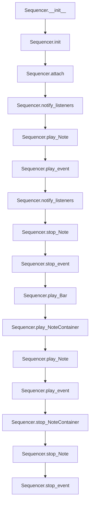

# `sequencer.py`

## `mingus.midi.sequencer.Sequencer` · *class*

## Summary:
A base class for MIDI sequencing operations that defines interfaces for playing musical elements and managing sequencer events.

## Description:
The Sequencer class serves as an abstract base class for MIDI sequencing functionality within the mingus library. It provides a standardized interface for playing musical notes, controlling instruments, and managing sequencer events through a listener pattern. The class defines various message types for different sequencer operations and provides methods for playing musical structures like bars, tracks, and compositions.

This class is designed to be subclassed by concrete sequencer implementations that provide actual MIDI output capabilities. The abstract methods (play_event, stop_event, etc.) must be implemented by subclasses to handle the actual MIDI communication.

## State:
- listeners (list): A collection of listener objects that receive notifications about sequencer events
- output (object): A class-level attribute that can be used to store MIDI output device references (currently None by default)
- MSG_* constants: Integer constants representing different sequencer message types for event notifications, including:
  - MSG_PLAY_INT, MSG_STOP_INT: For integer note events
  - MSG_CC, MSG_INSTR: For control change and instrument events  
  - MSG_SLEEP: For timing events
  - MSG_PLAY_NOTE, MSG_STOP_NOTE, MSG_PLAY_NC, MSG_STOP_NC: For note and container events
  - MSG_PLAY_BAR, MSG_PLAY_BARS, MSG_PLAY_TRACK, MSG_PLAY_TRACKS, MSG_PLAY_COMPOSITION: For structural playback events

## Lifecycle:
- Creation: Instantiate with `Sequencer()` constructor, which initializes empty listeners list and calls `init()`
- Usage: Subclasses implement abstract methods and provide actual MIDI functionality; clients call playback methods like `play_Note`, `play_Bar`, etc.
- Destruction: Handled by Python's garbage collection

## Method Map:


## Raises:
- None explicitly raised by __init__ method
- Individual methods may raise exceptions based on their implementations in subclasses

## Example:
```python
# Basic usage pattern for a subclass implementation
class MyMidiSequencer(Sequencer):
    def __init__(self):
        super(MyMidiSequencer, self).__init__()
        # Initialize MIDI output
        
    def play_event(self, note, channel, velocity):
        # Implement actual MIDI note-on command
        pass
        
    def stop_event(self, note, channel):
        # Implement actual MIDI note-off command
        pass
        
    def cc_event(self, channel, control, value):
        # Implement MIDI control change
        pass
        
    def instr_event(self, channel, instr, bank):
        # Implement MIDI program change
        pass
        
    def sleep(self, seconds):
        # Implement timing delay
        pass

# Usage
sequencer = MyMidiSequencer()
sequencer.attach(my_listener)
sequencer.play_Note("C4", channel=1, velocity=100)
sequencer.stop_Note("C4", channel=1)
```

### `mingus.midi.sequencer.Sequencer.__init__` · *method*

## Summary:
Initializes a sequencer instance by setting up an empty listeners list and performing additional initialization.

## Description:
The `__init__` method serves as the constructor for the Sequencer class, initializing the object's state by creating an empty listeners list and calling the `init()` method. This method establishes the foundation for the sequencer's event handling mechanism by preparing the listeners collection that will later be populated with observer objects.

The method delegates to `init()` to allow subclasses to implement custom initialization logic while ensuring the basic listeners infrastructure is always set up. This design enables the sequencer to support the observer pattern for event notifications.

## Args:
    self: The Sequencer instance being initialized.

## Returns:
    None: This method does not return any value.

## Raises:
    None: This method does not explicitly raise any exceptions.

## State Changes:
    Attributes READ: 
    - None: This method does not read any instance attributes.
    
    Attributes WRITTEN:
    - self.listeners: Initialized as an empty list to store listener objects.
    - self.init(): Called to perform additional initialization.

## Constraints:
    Preconditions: 
    - The Sequencer instance must be properly constructed.
    
    Postconditions: 
    - The sequencer's listeners list is initialized as an empty list.
    - The sequencer is ready for additional initialization via the `init()` method.

## Side Effects:
    None: This method does not perform any I/O operations, external service calls, or mutations to objects outside the instance.

### `mingus.midi.sequencer.Sequencer.init` · *method*

## Summary:
Initializes the sequencer's internal state and prepares it for MIDI event processing.

## Description:
The init method is called during object instantiation to perform additional initialization that cannot be done in the constructor. This method is currently empty in the base Sequencer class but is intended to set up internal state variables and prepare the sequencer for MIDI event processing. It serves as a hook for subclasses to implement custom initialization logic.

## Args:
    self: The Sequencer instance being initialized.

## Returns:
    None: This method does not return any value.

## Raises:
    None: This method does not explicitly raise any exceptions.

## State Changes:
    Attributes READ: 
    - None: This method does not read any instance attributes.
    
    Attributes WRITTEN:
    - None: This method does not modify any instance attributes.

## Constraints:
    Preconditions: 
    - The Sequencer instance must be properly constructed (i.e., __init__ must have been called).
    
    Postconditions: 
    - The sequencer is ready for MIDI event processing.
    - All internal state variables are initialized.

## Side Effects:
    None: This method does not perform any I/O operations, external service calls, or mutations to objects outside the instance.

### `mingus.midi.sequencer.Sequencer.play_event` · *method*

## Summary:
Plays a MIDI note event on the specified channel with the given velocity.

## Description:
This method sends a MIDI note-on event to the sequencer's output device. It is called internally by the `play_Note` method to trigger individual note playback. The method serves as a low-level interface for sending MIDI note events and is part of the sequencer's message-based event handling system.

Known callers:
- `play_Note()` method in the same class, which converts note objects to MIDI note numbers and calls this method

This method exists as a separate component to abstract the low-level MIDI event sending logic from the higher-level note-playing logic in `play_Note`.

## Args:
    note (int): The MIDI note number to play (typically 0-127).
    channel (int): The MIDI channel number (typically 0-15, though 1-based indexing is common).
    velocity (int): The velocity (volume) of the note playback (typically 0-127).

## Returns:
    None: This method does not return any value.

## Raises:
    None: This method does not explicitly raise exceptions.

## State Changes:
    Attributes READ: None
    Attributes WRITTEN: None

## Constraints:
    Preconditions: 
    - The sequencer must be properly initialized
    - The note number should be within valid MIDI range (0-127)
    - The channel should be within valid MIDI channel range (typically 0-15 or 1-16)
    - The velocity should be within valid MIDI velocity range (0-127)

    Postconditions:
    - The MIDI note event is sent to the output device
    - No changes to the sequencer's internal state are made

## Side Effects:
    I/O: Sends MIDI data to the sequencer's output device
    External service calls: None (assumes output is properly configured)
    Mutations to objects outside self: None (the method itself doesn't mutate external objects)

### `mingus.midi.sequencer.Sequencer.stop_event` · *method*

## Summary:
Stops a MIDI note event on the specified channel by sending a note-off message to the sequencer's output device.

## Description:
This method sends a MIDI note-off event to terminate the playback of a specific note on the given channel. It is called internally by the `stop_Note` method to handle the low-level MIDI communication required to stop note playback. The method serves as a fundamental building block in the sequencer's event-driven architecture for controlling MIDI note states.

Known callers:
- `stop_Note()` method in the same class, which converts note objects to MIDI note numbers and calls this method

This method exists as a separate component to abstract the low-level MIDI note-off sending logic from the higher-level note-stopping logic in `stop_Note`, providing a clean interface for the sequencer's event system.

## Args:
    note (int): The MIDI note number to stop (typically 0-127). This value is usually offset by 12 compared to standard note representations.
    channel (int): The MIDI channel number (typically 0-15) on which to stop the note.

## Returns:
    None: This method does not return any value.

## Raises:
    None: This method does not explicitly raise exceptions.

## State Changes:
    Attributes READ: None
    Attributes WRITTEN: None

## Constraints:
    Preconditions:
    - The sequencer must be properly initialized
    - The note number should be within valid MIDI range (0-127)
    - The channel should be within valid MIDI channel range (0-15)
    
    Postconditions:
    - The MIDI note-off event is sent to the output device
    - No changes to the sequencer's internal state are made

## Side Effects:
    I/O: Sends MIDI data to the sequencer's output device
    External service calls: None (assumes output is properly configured)
    Mutations to objects outside self: None (the method itself doesn't mutate external objects)

### `mingus.midi.sequencer.Sequencer.cc_event` · *method*

## Summary:
Placeholder method for handling MIDI Control Change events in the sequencer system.

## Description:
This method is designed to process MIDI Control Change (CC) events within the sequencer framework. It accepts channel, control, and value parameters which are standard MIDI CC event components. The method is intended to be overridden or implemented in subclasses to handle specific MIDI CC event processing, but currently contains no implementation (just a pass statement).

## Args:
    channel (int): MIDI channel number (typically 0-15)
    control (int): Control change number (0-127)
    value (int): Control change value (0-127)

## Returns:
    None: This method does not return any value

## Raises:
    None: This method does not explicitly raise exceptions

## State Changes:
    Attributes READ: None
    Attributes WRITTEN: None

## Constraints:
    Preconditions: 
    - Channel must be a valid MIDI channel (typically 0-15)
    - Control must be within MIDI control change range (0-127)
    - Value must be within MIDI value range (0-127)
    
    Postconditions: 
    - No state changes occur within the Sequencer object itself

## Side Effects:
    None: This method does not have direct side effects, though it's intended to be part of the MIDI message processing pipeline

### `mingus.midi.sequencer.Sequencer.instr_event` · *method*

## Summary:
Handles MIDI instrument change events by sending program change messages to set an instrument on a specific channel with a specified bank.

## Description:
This method implements the low-level MIDI protocol for changing instruments on a given channel. It's called by the `set_instrument` method to send the actual MIDI program change message to the configured MIDI output device. This method follows the established pattern of other event handlers in the Sequencer class such as `play_event`, `stop_event`, and `cc_event`. The method serves as a bridge between the high-level instrument setting interface and the underlying MIDI message transmission.

## Args:
    channel (int): MIDI channel number (typically 0-15) where the instrument should be set
    instr (int): MIDI instrument number (0-127) to assign to the channel
    bank (int): MIDI bank number (0-127) to select the instrument bank, defaults to 0

## Returns:
    None: This method does not return any value

## Raises:
    None: This method does not explicitly raise exceptions

## State Changes:
    Attributes READ: None
    Attributes WRITTEN: None

## Constraints:
    Preconditions: 
    - Channel must be a valid MIDI channel (typically 0-15)
    - Instrument number must be within MIDI instrument range (0-127)
    - Bank number must be within MIDI bank range (0-127)
    
    Postconditions: 
    - No state changes occur within the Sequencer object itself

## Side Effects:
    MIDI output: Sends MIDI program change messages to the configured MIDI output device

### `mingus.midi.sequencer.Sequencer.sleep` · *method*

## Summary:
Pauses execution for a specified number of seconds to control timing in MIDI sequencing.

## Description:
The sleep method introduces a time delay in the MIDI playback sequence, enabling proper timing between musical events. It is used internally by sequencing methods such as play_Bar and play_Bars to create pauses between notes and musical phrases according to tempo specifications. This method serves as a timing mechanism that allows for realistic musical performance simulation.

## Args:
    seconds (float): Number of seconds to pause execution. Must be non-negative.

## Returns:
    None: This method does not return any value.

## Raises:
    None: This method does not explicitly raise exceptions.

## State Changes:
    Attributes READ: None
    Attributes WRITTEN: None

## Constraints:
    Preconditions: The seconds parameter must be a non-negative number.
    Postconditions: Execution is paused for the specified duration.

## Side Effects:
    I/O: Causes the program execution to pause for the specified time period.
    External service calls: Relies on the underlying system's time.sleep functionality.

### `mingus.midi.sequencer.Sequencer.attach` · *method*

## Summary:
Registers a listener to receive notifications from the sequencer when events occur.

## Description:
Adds a listener object to the sequencer's list of observers if it is not already registered. This method implements the observer pattern, allowing external objects to subscribe to sequencer events and receive notifications when those events happen.

## Args:
    listener: An object that implements a `notify` method. The listener will receive event notifications from the sequencer.

## Returns:
    None

## Raises:
    None

## State Changes:
    Attributes READ: self.listeners
    Attributes WRITTEN: self.listeners

## Constraints:
    Preconditions: The listener parameter must be a valid object that can be compared for equality.
    Postconditions: The listener will be added to self.listeners if it was not already present.

## Side Effects:
    None

### `mingus.midi.sequencer.Sequencer.detach` · *method*

## Summary:
Removes a listener from the sequencer's notification list.

## Description:
Unregisters a previously attached listener so that it will no longer receive notifications from the sequencer when events occur. This method implements the observer pattern by removing the listener from the sequencer's internal list of observers.

## Args:
    listener: An object that implements a `notify` method. This listener will be removed from the sequencer's list of observers.

## Returns:
    None

## Raises:
    None

## State Changes:
    Attributes READ: self.listeners
    Attributes WRITTEN: self.listeners

## Constraints:
    Preconditions: The listener parameter must be a valid object that can be compared for equality.
    Postconditions: The listener will be removed from self.listeners if it was present.

## Side Effects:
    None

### `mingus.midi.sequencer.Sequencer.notify_listeners` · *method*

## Summary:
Notifies all registered listeners of a MIDI event with associated message type and parameters.

## Description:
This method implements the observer pattern by iterating through all registered listeners and invoking their `notify` method with the provided message type and parameters. It serves as the central mechanism for broadcasting MIDI events throughout the system to interested parties.

Known callers include:
- `set_instrument()` - notifies listeners of instrument change events
- `control_change()` - notifies listeners of control change events  
- `play_Note()` - notifies listeners of note play events
- `stop_Note()` - notifies listeners of note stop events
- `play_NoteContainer()` - notifies listeners of note container play events
- `stop_NoteContainer()` - notifies listeners of note container stop events
- `play_Bar()` - notifies listeners of bar playback events
- `play_Bars()` - notifies listeners of bars playback events
- `play_Track()` - notifies listeners of track playback events
- `play_Tracks()` - notifies listeners of tracks playback events
- `play_Composition()` - notifies listeners of composition playback events

This logic is separated into its own method to avoid code duplication and maintain clean separation of concerns, allowing the sequencer to focus on event handling while delegating notification responsibilities to this centralized method.

## Args:
    msg_type (int): The type of message/event being notified (e.g., MSG_PLAY_INT, MSG_STOP_INT)
    params (dict): A dictionary containing event-specific parameters and data

## Returns:
    None: This method does not return any value

## Raises:
    AttributeError: If any listener in self.listeners does not have a notify method
    TypeError: If self.listeners contains non-callable objects or if msg_type or params are incompatible with the listeners' expectations

## State Changes:
    Attributes READ: self.listeners
    Attributes WRITTEN: None

## Constraints:
    Preconditions:
    - self.listeners must be iterable (list-like structure)
    - Each item in self.listeners must have a callable notify method
    - msg_type and params should be compatible with the expected interface of listeners
    
    Postconditions:
    - All registered listeners will have their notify method called once per invocation
    - No modifications are made to the Sequencer's internal state

## Side Effects:
    None: This method does not perform I/O operations or mutate external state. However, the notify calls on listeners may have side effects depending on the listener implementations.

### `mingus.midi.sequencer.Sequencer.set_instrument` · *method*

## Summary:
Sets a MIDI instrument for a specific channel and notifies all registered listeners of the change.

## Description:
Configures a MIDI instrument on the specified channel by sending a program change message and broadcasting the event to all registered listeners. This method serves as the primary interface for instrument configuration within the MIDI sequencer system.

Known callers and contexts:
- `play_Tracks()` - Called during track initialization to set up instruments for each channel before playback begins
- Direct external calls - Used by applications that need to dynamically change instruments during playback

This logic is implemented as a separate method rather than being inlined because it encapsulates two distinct responsibilities: (1) sending the actual MIDI command to the hardware/output device via `instr_event`, and (2) notifying the system's observers about the change through the centralized `notify_listeners` mechanism. This separation promotes code reuse, testability, and maintains clean architectural boundaries.

## Args:
    channel (int): MIDI channel number (typically 0-15) where the instrument should be set
    instr (int): MIDI instrument number (0-127) to assign to the channel
    bank (int, optional): MIDI bank number (0-127) to select the instrument bank. Defaults to 0

## Returns:
    None: This method does not return any value

## Raises:
    None: This method does not explicitly raise exceptions, though underlying methods may raise exceptions if invalid parameters are provided

## State Changes:
    Attributes READ: None
    Attributes WRITTEN: None

## Constraints:
    Preconditions:
    - Channel must be a valid MIDI channel (typically 0-15)
    - Instrument number must be within MIDI instrument range (0-127)
    - Bank number must be within MIDI bank range (0-127)
    
    Postconditions:
    - The specified channel will be configured with the requested instrument
    - All registered listeners will be notified of the instrument change event

## Side Effects:
    MIDI output: Sends MIDI program change messages to the configured MIDI output device
    Notification: Invokes notify_listeners to broadcast the instrument change to all registered observers

### `mingus.midi.sequencer.Sequencer.control_change` · *method*

## Summary:
Sets a MIDI control change value for a specified channel and notifies all registered listeners of the change.

## Description:
Handles MIDI Control Change (CC) events by validating parameters, dispatching the event to the MIDI subsystem, and notifying all attached listeners. This method serves as the central handler for MIDI control change messages and is used by convenience methods such as modulation, main volume, and pan controls.

## Args:
    channel (int): MIDI channel number (typically 0-15)
    control (int): Control change number (0-127)
    value (int): Control change value (0-127)

## Returns:
    bool: True if the control change was successfully processed, False if validation failed due to out-of-range parameters

## Raises:
    None: This method does not explicitly raise exceptions, but may propagate exceptions from underlying methods

## State Changes:
    Attributes READ: None
    Attributes WRITTEN: None

## Constraints:
    Preconditions: 
    - Control parameter must be between 0 and 127 inclusive
    - Value parameter must be between 0 and 127 inclusive
    - Channel parameter should be a valid MIDI channel (typically 0-15)

    Postconditions: 
    - The control change event is dispatched to the MIDI subsystem via cc_event()
    - All registered listeners are notified of the control change event
    - Method returns True for valid parameters, False for invalid parameters

## Side Effects:
    - Calls self.cc_event() to process the MIDI control change at a lower level
    - Calls self.notify_listeners() to broadcast the event to all attached listeners
    - May cause I/O operations through the MIDI subsystem

### `mingus.midi.sequencer.Sequencer.play_Note` · *method*

## Summary:
Plays a MIDI note by converting the note value, triggering the underlying MIDI event, and notifying registered listeners of the playback event.

## Description:
This method handles the playback of a single MIDI note. It accepts either a numeric note value or a note object with velocity and/or channel attributes, processes the note according to MIDI conventions, and triggers the actual note playback through the sequencer's event system. The method also broadcasts notifications to registered listeners about the note playback in two formats for different consumer needs.

Known callers include:
- `play_NoteContainer()` - when playing individual notes from a container
- Direct calls from user code when playing single notes

This logic is separated into its own method to provide a standardized interface for note playback while maintaining consistency with other sequencer operations like stopping notes and managing note containers.

## Args:
    note (int or object): The note to play, either as a numeric MIDI note value or as an object with note properties
    channel (int): MIDI channel number (0-15), defaults to 1
    velocity (int): Note velocity (0-127) representing note attack strength, defaults to 100

## Returns:
    bool: Always returns True to indicate successful processing

## Raises:
    None: This method does not explicitly raise exceptions

## State Changes:
    Attributes READ: None
    Attributes WRITTEN: None

## Constraints:
    Preconditions:
    - The sequencer must be properly initialized
    - Note values should be within reasonable ranges for MIDI processing
    - Channel should be within valid MIDI channel range (0-15)
    - Velocity should be within valid MIDI velocity range (0-127)
    
    Postconditions:
    - The specified note will be played through the MIDI output
    - Two notification events will be sent to registered listeners
    - The note value will be converted by adding 12 before being processed

## Side Effects:
    - Calls the underlying sequencer's play_event method to generate MIDI output
    - Triggers notifications to all registered listeners via notify_listeners
    - May produce audible sound through audio output drivers
    - May cause I/O operations if recording is enabled

### `mingus.midi.sequencer.Sequencer.stop_Note` · *method*

## Summary:
Stops a MIDI note by triggering the underlying MIDI stop event and notifying registered listeners of the note stop event.

## Description:
This method terminates the playback of a specified MIDI note by sending a note-off message through the sequencer's event system. It handles both numeric note values and note objects with channel attributes, converts note values to standard MIDI note numbers by adding 12, and broadcasts notifications to registered listeners about the note stop event in two formats for different consumer needs.

Known callers include:
- `stop_NoteContainer()` - when stopping individual notes from a container
- Direct calls from user code when stopping single notes

This logic is separated into its own method to provide a standardized interface for note stopping while maintaining consistency with other sequencer operations like playing notes and managing note containers.

## Args:
    note (int or object): The note to stop, either as a numeric MIDI note value or as an object with note properties
    channel (int): MIDI channel number (0-15), defaults to 1

## Returns:
    bool: Always returns True to indicate successful processing

## Raises:
    None: This method does not explicitly raise exceptions

## State Changes:
    Attributes READ: None
    Attributes WRITTEN: None

## Constraints:
    Preconditions:
    - The sequencer must be properly initialized
    - Note values should be within reasonable ranges for MIDI processing
    - Channel should be within valid MIDI channel range (0-15)
    
    Postconditions:
    - The specified note will be stopped through the MIDI output
    - Two notification events will be sent to registered listeners
    - The note value will be converted by adding 12 before being processed

## Side Effects:
    - Calls the underlying sequencer's stop_event method to generate MIDI note-off output
    - Triggers notifications to all registered listeners via notify_listeners
    - May produce audible sound cessation through audio output drivers
    - May cause I/O operations if recording is enabled

### `mingus.midi.sequencer.Sequencer.stop_everything` · *method*

## Summary:
Stops all active MIDI notes across all available channels by sending individual stop commands for each possible note-channel combination.

## Description:
This method provides a comprehensive way to halt all currently playing MIDI notes by systematically stopping each possible note value on each available MIDI channel. It iterates through all 118 possible MIDI note numbers (0-117) and 16 MIDI channels (0-15), calling the stop_Note method for each combination to ensure complete silence across the entire MIDI spectrum.

The method is designed as a centralized cleanup mechanism that ensures no notes remain active when needed, such as during sequencer shutdown, reset operations, or when transitioning between different musical states. This approach prevents stuck notes that could occur if individual notes were not properly stopped.

## Args:
    None: This method takes no arguments beyond the implicit self parameter.

## Returns:
    None: This method does not return any value.

## Raises:
    None: This method does not explicitly raise exceptions.

## State Changes:
    Attributes READ: None
    Attributes WRITTEN: None

## Constraints:
    Preconditions:
    - The sequencer must be properly initialized and connected to a MIDI output device
    - The underlying stop_Note method must be functional
    - All MIDI channels and note values must be within valid ranges
    
    Postconditions:
    - All possible MIDI notes (0-117) on all channels (0-15) will have stop commands sent
    - No notes should remain active after this method completes
    - The sequencer's internal state remains unchanged except for MIDI output

## Side Effects:
    - Generates 1888 MIDI stop events (118 notes × 16 channels) through the sequencer's event system
    - Triggers notifications to all registered listeners for each stop command
    - May cause audible silence in audio output devices
    - Performs multiple I/O operations to MIDI hardware or software synthesizer
    - Could potentially block execution briefly while sending all stop commands

### `mingus.midi.sequencer.Sequencer.play_NoteContainer` · *method*

## Summary:
Plays all notes contained within a NoteContainer through MIDI, notifying listeners of the playback operation.

## Description:
This method orchestrates the playback of multiple MIDI notes stored in a NoteContainer by sequentially playing each individual note. It serves as a bridge between container-based note management and individual note playback, enabling the execution of chords or polyphonic musical elements.

Known callers include:
- `play_Bar()` - when playing NoteContainers within musical bars
- `play_Bars()` - when playing multiple NoteContainers in sequence
- `play_Track()` - when playing NoteContainers within musical tracks
- Direct calls from user code when playing collections of notes

This logic is separated into its own method to provide a clean abstraction for playing multiple notes simultaneously while maintaining consistency with the sequencer's event notification system and individual note playback mechanisms.

## Args:
    nc (NoteContainer or None): Container holding multiple notes to play, or None to indicate no notes
    channel (int): MIDI channel number (0-15) to play notes on, defaults to 1
    velocity (int): Note velocity (0-127) representing note attack strength, defaults to 100

## Returns:
    bool: True if all notes in the container were successfully played, False if any note failed to play

## Raises:
    None: This method does not explicitly raise exceptions

## State Changes:
    Attributes READ: self.listeners, self.MSG_PLAY_NC
    Attributes WRITTEN: None

## Constraints:
    Preconditions:
    - The sequencer must be properly initialized
    - NoteContainer must be iterable or None
    - Channel should be within valid MIDI channel range (0-15)
    - Velocity should be within valid MIDI velocity range (0-127)
    
    Postconditions:
    - All notes in the container will be played through the MIDI output
    - Notification events will be sent to all registered listeners
    - Method returns immediately after attempting to play all notes

## Side Effects:
    - Triggers individual note playback through the underlying sequencer's play_Note method
    - Sends notification events to all registered listeners via notify_listeners
    - May produce audible sound through audio output drivers
    - May cause I/O operations if recording is enabled

### `mingus.midi.sequencer.Sequencer.stop_NoteContainer` · *method*

## Summary:
Stops all notes contained within a NoteContainer through MIDI, notifying listeners of the stop operation.

## Description:
This method orchestrates the stopping of multiple MIDI notes stored in a NoteContainer by sequentially stopping each individual note. It serves as the counterpart to play_NoteContainer for stopping collections of notes, enabling proper cleanup of polyphonic musical elements.

Known callers include:
- `play_Bar()` - when stopping NoteContainers after musical bar playback
- `play_Bars()` - when stopping NoteContainers during multi-bar sequence playback
- Direct calls from user code when stopping collections of notes

This logic is separated into its own method to provide a clean abstraction for stopping multiple notes simultaneously while maintaining consistency with the sequencer's event notification system and individual note stopping mechanisms.

## Args:
    nc (NoteContainer or None): Container holding multiple notes to stop, or None to indicate no notes to stop. NoteContainer should be iterable containing note objects.
    channel (int): MIDI channel number (0-15) to stop notes on, defaults to 1

## Returns:
    bool: True if all notes in the container were successfully stopped, False if any note failed to stop. Returns True immediately if nc is None.

## Raises:
    None: This method does not explicitly raise exceptions

## State Changes:
    Attributes READ: self.listeners, self.MSG_STOP_NC
    Attributes WRITTEN: None

## Constraints:
    Preconditions:
    - The sequencer must be properly initialized
    - NoteContainer must be iterable or None
    - Channel should be within valid MIDI channel range (0-15)
    
    Postconditions:
    - All notes in the container will be stopped through the MIDI output
    - Notification events will be sent to all registered listeners
    - Method returns immediately after attempting to stop all notes

## Side Effects:
    - Triggers individual note stopping through the underlying sequencer's stop_Note method
    - Sends notification events to all registered listeners via notify_listeners
    - May produce audible sound cessation through audio output drivers
    - May cause I/O operations if recording is enabled

### `mingus.midi.sequencer.Sequencer.play_Bar` · *method*

## Summary:
Plays a musical bar by sequentially processing its NoteContainers with proper timing and BPM adjustments.

## Description:
This method executes a musical bar by playing each NoteContainer in sequence, calculating appropriate timing delays based on note durations and BPM, and managing playback state through notifications. It handles dynamic BPM changes within the bar and ensures proper cleanup by stopping each NoteContainer after playback.

Known callers include:
- `play_Track()` - calls play_Bar for each bar in a track during sequential playback
- `play_Bars()` - indirectly involved in parallel bar playback scenarios

This logic is separated into its own method to encapsulate the complex timing and playback management required for sequential bar execution, providing a clean interface for higher-level composition and track playback methods.

## Args:
    bar (iterable): An iterable of NoteContainers representing musical notes in a bar, where each element is a tuple of (start_tick, note_length, NoteContainer)
    channel (int): MIDI channel number to play the notes on. Defaults to 1.
    bpm (int): Beats per minute for the playback tempo. Defaults to 120.

## Returns:
    dict: A dictionary containing the final BPM value after processing the bar, or an empty dict if playback is interrupted.

## Raises:
    None explicitly raised, but may propagate exceptions from underlying methods like play_NoteContainer or stop_NoteContainer.

## State Changes:
    Attributes READ: 
        - self.listeners: Accessed during notification calls
        - self.MSG_PLAY_BAR: Used for notification message type
        - self.MSG_SLEEP: Used for notification message type
    Attributes WRITTEN: 
        - None directly modified by this method

## Constraints:
    Preconditions:
        - The bar parameter must be iterable with elements that have the structure (start_tick, note_length, NoteContainer)
        - Each NoteContainer in the bar must be playable by play_NoteContainer
        - Channel must be a valid MIDI channel number
        - BPM must be a positive number
        
    Postconditions:
        - All NoteContainers in the bar are played sequentially
        - Proper timing delays are maintained between note plays
        - Each NoteContainer is stopped after playback
        - Final BPM value is returned (or empty dict if interrupted)

## Side Effects:
    - I/O operations: Calls to sleep() which may involve system timer operations
    - External service calls: Invokes play_NoteContainer, stop_NoteContainer, and notify_listeners methods
    - State changes: Notifies listeners of various MIDI events including bar playback and sleep intervals

### `mingus.midi.sequencer.Sequencer.play_Bars` · *method*

## Summary:
Plays multiple musical bars in parallel at specified channels with coordinated timing and tempo management.

## Description:
This method coordinates the playback of multiple musical bars (sequences of notes) simultaneously across different MIDI channels. It implements a tick-based timing system to ensure proper synchronization between bars, handles tempo changes within individual notes, and manages the lifecycle of playing notes by starting and stopping them appropriately. The method is designed to play multiple tracks concurrently rather than sequentially.

## Args:
    bars (list): A list of bar objects, where each bar contains NoteContainer objects with timing information
    channels (list): A list of MIDI channel numbers corresponding to each bar
    bpm (int, optional): Base beats per minute for playback. Defaults to 120

## Returns:
    dict: A dictionary containing the final BPM value after processing all notes

## Raises:
    None explicitly raised in the method body

## State Changes:
    Attributes READ: 
        - self.MSG_PLAY_BARS (message type constant)
        - self.MSG_SLEEP (message type constant)
        - self.listeners (for notification purposes)
    Attributes WRITTEN:
        - None directly modified (but indirectly affects playback state through method calls)

## Constraints:
    Preconditions:
        - All bars must have the same length property
        - Bars must contain NoteContainer objects with proper timing data
        - Channels list must match the number of bars
        - Each bar's NoteContainer objects must have valid timing information
    Postconditions:
        - All notes in the bars will be played and stopped appropriately
        - The final BPM value reflects any tempo changes that occurred during playback

## Side Effects:
    - Calls self.notify_listeners() to broadcast playback events
    - Calls self.play_NoteContainer() to start playing notes
    - Calls self.stop_NoteContainer() to stop playing notes
    - Calls self.sleep() to pause execution for timing coordination

### `mingus.midi.sequencer.Sequencer.play_Track` · *method*

## Summary:
Plays a musical track by sequentially executing each bar with dynamic BPM handling.

## Description:
Executes a musical track by processing each bar in sequence, notifying listeners of playback events, and dynamically adjusting tempo based on changes within individual bars. This method serves as the core interface for sequential track playback in the MIDI sequencer.

Known callers:
- `play_Tracks()` - calls play_Track for each track during multi-track playback
- `play_Composition()` - calls play_Track via play_Tracks for full composition playback

This method is separated from inline logic to provide a clean abstraction for track-level playback while delegating individual bar execution to play_Bar, enabling consistent tempo management and event notification across different playback contexts.

## Args:
    track (iterable): Collection of musical bars to play sequentially
    channel (int): MIDI channel number for playback. Defaults to 1.
    bpm (int): Initial beats per minute for playback tempo. Defaults to 120.

## Returns:
    dict: Dictionary containing the final BPM value after processing all bars, or empty dict if playback is interrupted early.

## Raises:
    None explicitly raised, but may propagate exceptions from underlying methods like play_Bar.

## State Changes:
    Attributes READ: 
        - self.listeners: Accessed during notification calls
        - self.MSG_PLAY_TRACK: Used for notification message type
    Attributes WRITTEN: 
        - None directly modified by this method

## Constraints:
    Preconditions:
        - Track parameter must be iterable with valid bar structures
        - Each bar in track must be compatible with play_Bar method
        - Channel must be a valid MIDI channel number
        - BPM must be a positive number
        
    Postconditions:
        - All bars in the track are processed sequentially
        - Listener notifications are sent for track playback events
        - Tempo adjustments from individual bars are properly propagated
        - Final BPM value reflects any tempo changes during playback

## Side Effects:
    - I/O operations: Calls to sleep() through play_Bar which may involve system timer operations
    - External service calls: Invokes play_Bar, notify_listeners methods
    - State changes: Notifies listeners of track playback events

### `mingus.midi.sequencer.Sequencer.play_Tracks` · *method*

## Summary:
Plays multiple MIDI tracks simultaneously on specified channels, setting up instruments and coordinating bar playback.

## Description:
This method coordinates the simultaneous playback of multiple MIDI tracks on their respective channels. It first configures the appropriate instruments for each track, then plays the tracks in lockstep by executing corresponding bars from each track together. The method handles dynamic BPM changes that may occur during playback and returns the final BPM value once all bars have been processed.

## Args:
    tracks (list): A list of track objects to be played simultaneously
    channels (list): A list of MIDI channel numbers corresponding to each track
    bpm (int, optional): Initial beats per minute for playback. Defaults to 120

## Returns:
    dict: A dictionary containing the final BPM value with key "bpm"

## Raises:
    None explicitly raised, but may propagate exceptions from internal method calls

## State Changes:
    Attributes READ: None
    Attributes WRITTEN: None

## Constraints:
    Preconditions:
        - tracks list must not be empty
        - tracks list must contain tracks of equal length
        - channels list must have the same length as tracks list
        - All tracks must have an instrument attribute
    Postconditions:
        - Instruments are properly set on corresponding channels
        - All tracks are played in synchronization
        - Final BPM reflects any changes that occurred during playback

## Side Effects:
    - Notifies attached listeners of playback events
    - Calls set_instrument to configure MIDI instruments
    - Calls play_Bars to execute bar-level playback
    - May modify global BPM state during execution

### `mingus.midi.sequencer.Sequencer.play_Composition` · *method*

## Summary:
Plays a musical composition by notifying listeners and delegating to track playback functionality.

## Description:
This method orchestrates the playback of a musical composition by first notifying all registered listeners about the upcoming composition playback, then assigning default channels if none were specified, and finally delegating the actual playback to the play_Tracks method. It serves as the entry point for composition-level playback in the sequencer system.

Known callers:
- Direct API calls from user code to initiate composition playback
- Potentially from higher-level music processing pipelines that manage composition objects

This logic is separated into its own method rather than being inlined in play_Tracks because it provides a clear abstraction layer for composition-level operations, handles default channel assignment logic, and ensures proper listener notification for composition playback events.

## Args:
    composition: The musical composition object to be played, containing tracks and metadata
    channels (list[int], optional): List of MIDI channel numbers to assign to each track. If None, automatically assigns sequential channels starting from 1. Defaults to None.
    bpm (int, optional): Beats per minute for playback tempo. Defaults to 120.

## Returns:
    dict: Dictionary containing the final BPM setting after playback completion, with key "bpm"

## Raises:
    None explicitly raised by this method, though underlying methods may raise exceptions

## State Changes:
    Attributes READ: self.listeners, self.MSG_PLAY_COMPOSITION
    Attributes WRITTEN: None

## Constraints:
    Preconditions:
    - composition must be a valid composition object with a tracks attribute
    - composition.tracks must be iterable and contain valid track objects
    - channels, if provided, must be a list of integers representing valid MIDI channels
    
    Postconditions:
    - All registered listeners will be notified of the composition playback event
    - The composition will be played using the specified or default channel assignments
    - The method returns the final BPM setting after playback completes

## Side Effects:
    - Notifies all registered listeners via the notify_listeners mechanism
    - May cause I/O operations through the delegated play_Tracks method
    - May trigger external MIDI device interactions through the underlying playback system

### `mingus.midi.sequencer.Sequencer.modulation` · *method*

*No documentation generated.*

### `mingus.midi.sequencer.Sequencer.main_volume` · *method*

## Summary:
Sets the main volume for a specified MIDI channel using MIDI control change message number 7.

## Description:
This method provides a convenient interface for adjusting the main volume of a MIDI channel by sending a standard MIDI control change message with controller number 7 (the main volume controller). It serves as a specialized wrapper around the generic control_change method, making it easier to set volume levels without needing to remember the specific controller number.

## Args:
    channel (int): The MIDI channel number (typically 0-15) to set the volume for.
    value (int): The volume level to set (typically 0-127, where 0 is silent and 127 is maximum volume).

## Returns:
    The return value of the underlying control_change method call, which typically indicates success or failure of the MIDI message transmission.

## Raises:
    This method may raise any exceptions that the underlying control_change method raises, such as MIDI communication errors or invalid parameter exceptions.

## State Changes:
    Attributes READ: None
    Attributes WRITTEN: None

## Constraints:
    Preconditions: 
    - The channel parameter should be a valid MIDI channel number (typically 0-15)
    - The value parameter should be within the valid MIDI control value range (0-127)
    - The sequencer must be properly initialized and connected to a MIDI device
    
    Postconditions:
    - The main volume for the specified channel is set to the provided value
    - The method returns the result of the underlying control_change operation

## Side Effects:
    This method performs MIDI I/O operations to send control change messages to connected MIDI devices, potentially affecting audio output.

### `mingus.midi.sequencer.Sequencer.pan` · *method*

## Summary:
Sets the pan position for a specified MIDI channel, moving audio left or right in the stereo field.

## Description:
This method configures the panning of audio output for a given MIDI channel. It is a convenience wrapper around the general control_change method, specifically designed for MIDI pan control. The pan value ranges from 0 (full left) to 127 (full right), with 64 representing the center position.

## Args:
    channel (int): MIDI channel number (typically 0-15)
    value (int): Pan position value (0-127), where 0 = full left, 64 = center, 127 = full right

## Returns:
    bool: True if the pan setting was successfully applied, False if the channel or value parameters were out of valid range

## Raises:
    None: This method does not explicitly raise exceptions, but may return False for invalid parameters

## State Changes:
    Attributes READ: None
    Attributes WRITTEN: None

## Constraints:
    Preconditions: 
    - Channel parameter must be a valid MIDI channel number
    - Value parameter must be between 0 and 127 inclusive

    Postconditions: 
    - The pan control change is dispatched to the MIDI subsystem
    - All registered listeners are notified of the pan change event
    - Returns True for valid parameters, False for invalid parameters

## Side Effects:
    - Calls self.control_change() which in turn calls self.cc_event() to process the MIDI control change at a lower level
    - Calls self.notify_listeners() to broadcast the pan change to all attached listeners
    - May cause I/O operations through the MIDI subsystem

