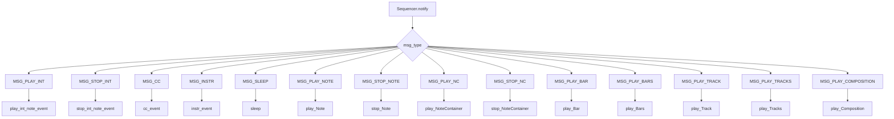

# `sequencer_observer.py`

## `mingus.midi.sequencer_observer.SequencerObserver` · *class*

## Summary:
An observer class that receives and handles MIDI sequencer events from a Sequencer instance.

## Description:
The SequencerObserver class implements the observer pattern for MIDI sequencing operations. It provides a set of callback methods that are invoked when a Sequencer instance sends notifications about various MIDI events such as note playback, instrument changes, and timing events. This class is designed to be subclassed by concrete implementations that provide actual MIDI handling behavior.

The observer receives notifications through the `notify` method, which dispatches to specific handler methods based on the message type received from the sequencer. These handler methods are intended to be overridden by subclasses to implement actual MIDI event processing. The notify method itself is called internally by a Sequencer instance when events occur, rather than being called directly by users.

## State:
- No persistent state attributes. The class is stateless and relies on the handler methods being overridden in subclasses.

## Lifecycle:
- Creation: Instantiated with `SequencerObserver()` constructor, which takes no arguments
- Usage: Typically attached to a Sequencer instance via `attach()` method, then receives notifications through the `notify()` method when sequencer events occur. The notify method processes incoming messages and routes them to appropriate handler methods.
- Destruction: Handled by Python's garbage collection

## Method Map:


## Raises:
- No explicit exceptions raised by the constructor or notify method
- Individual handler methods may raise exceptions if not properly overridden in subclasses

## Example:
```python
class MyMidiHandler(SequencerObserver):
    def play_int_note_event(self, int_note, channel, velocity):
        print(f"Playing note {int_note} on channel {channel} with velocity {velocity}")
        
    def stop_int_note_event(self, int_note, channel):
        print(f"Stopping note {int_note} on channel {channel}")

# Usage
observer = MyMidiHandler()
sequencer = Sequencer()
sequencer.attach(observer)
# When sequencer plays notes, observer methods will be called automatically
```

### `mingus.midi.sequencer_observer.SequencerObserver.play_int_note_event` · *method*

## Summary:
Handles the playback of a MIDI note event using integer note representation.

## Description:
This method serves as an interface for playing MIDI note events using integer note numbers, channel information, and velocity values. It is designed to be implemented by subclasses of SequencerObserver to handle note playback operations within the observer pattern framework.

Known callers:
- This method is intended to be called by the sequencer's notification system when note play events are broadcast to observers
- It would typically be invoked through the notify method of SequencerObserver when receiving MSG_PLAY_INT notifications

This method exists as a separate component to provide a standardized interface for observer implementations that need to respond to integer note events, ensuring consistency in how note playback is handled across different observer implementations.

## Args:
    int_note (int): The MIDI note number to play (typically 0-127).
    channel (int): The MIDI channel number (typically 0-15) on which to play the note.
    velocity (int): The velocity (volume) of the note playback (typically 0-127).

## Returns:
    None: This method does not return any value.

## Raises:
    None: This method does not explicitly raise exceptions.

## State Changes:
    Attributes READ: None
    Attributes WRITTEN: None

## Constraints:
    Preconditions:
    - The int_note should be within valid MIDI range (0-127)
    - The channel should be within valid MIDI channel range (0-15)
    - The velocity should be within valid MIDI velocity range (0-127)

    Postconditions:
    - The method is ready to handle note playback operations
    - No changes to the observer's internal state are made

## Side Effects:
    None: This method does not perform any direct I/O or external operations. Implementation details depend on the specific subclass.

### `mingus.midi.sequencer_observer.SequencerObserver.stop_int_note_event` · *method*

## Summary:
Stops a MIDI note event using integer note representation on the specified channel.

## Description:
This method handles the termination of a MIDI note event that was previously initiated via play_int_note_event. It is designed to be implemented by subclasses of SequencerObserver to provide actual MIDI note-off functionality when integer note events are stopped. The method is called by the sequencer's notification system when MSG_STOP_INT notifications are received.

Known callers:
- Called by SequencerObserver.notify() method when receiving MSG_STOP_INT notifications
- Invoked during the sequencer's event processing lifecycle when integer note stop events are broadcast to observers

This method exists as a separate component to provide a standardized interface for observer implementations that need to respond to integer note stop events, ensuring consistency in how note termination is handled across different observer implementations.

## Args:
    int_note (int): The MIDI note number to stop (typically 0-127).
    channel (int): The MIDI channel number (typically 0-15) on which to stop the note.

## Returns:
    None: This method does not return any value.

## Raises:
    None: This method does not explicitly raise exceptions, though underlying implementations may raise exceptions.

## State Changes:
    Attributes READ: None
    Attributes WRITTEN: None

## Constraints:
    Preconditions:
    - The int_note should be within valid MIDI range (0-127)
    - The channel should be within valid MIDI channel range (0-15)
    - The int_note must have been previously started via play_int_note_event on the same channel

    Postconditions:
    - The specified note is terminated on the given channel
    - No further sound should be produced from this note on the specified channel

## Side Effects:
    None: This method is intended to be a pure observer method that doesn't cause side effects. Actual MIDI output would occur in the implementing subclass's stop_event method.

### `mingus.midi.sequencer_observer.SequencerObserver.cc_event` · *method*

## Summary:
Handles MIDI Control Change events by processing channel, control number, and value parameters.

## Description:
Processes incoming MIDI Control Change (CC) events that occur during sequencer playback. This method is invoked by the sequencer's notification system when a CC event is received, allowing observers to respond to real-time MIDI controller messages such as volume changes, modulation, or other continuous controller inputs.

The method follows the standard MIDI CC event format with channel number, control number, and value parameters. This abstract method should be overridden by concrete implementations to provide specific handling of CC events.

## Args:
    channel (int): The MIDI channel number (0-15) on which the control change occurred
    control (int): The control number (0-127) identifying which controller was changed
    value (int): The control value (0-127) representing the new controller setting

## Returns:
    None: This method does not return any value

## Raises:
    None: This method does not explicitly raise exceptions

## State Changes:
    Attributes READ: None
    Attributes WRITTEN: None

## Constraints:
    Preconditions: 
    - Channel must be an integer between 0 and 15 (inclusive)
    - Control must be an integer between 0 and 127 (inclusive)  
    - Value must be an integer between 0 and 127 (inclusive)
    
    Postconditions: 
    - The method processes the CC event without modifying the observer's internal state
    - No return value is expected

## Side Effects:
    None: This method does not perform I/O operations or modify external state

### `mingus.midi.sequencer_observer.SequencerObserver.instr_event` · *method*

## Summary:
Handles MIDI instrument change events by processing channel, instrument, and bank parameters to update the sequencer's instrument configuration.

## Description:
Processes incoming MIDI instrument change events that occur during sequencer playback. This method is invoked by the sequencer's notification system when an instrument change event is received, allowing observers to respond to real-time MIDI program change messages. The method follows the standard MIDI instrument change format with channel number, instrument number, and bank number parameters.

This abstract method should be overridden by concrete implementations to provide specific handling of instrument change events, such as updating internal instrument mappings or sending MIDI program change commands to output devices.

## Args:
    channel (int): The MIDI channel number (0-15) on which the instrument change occurred
    instr (int): The instrument/program number (0-127) to change to
    bank (int): The bank number (0-127) for the instrument selection

## Returns:
    None: This method does not return any value

## Raises:
    None: This method does not explicitly raise exceptions

## State Changes:
    Attributes READ: None
    Attributes WRITTEN: None

## Constraints:
    Preconditions: 
    - Channel must be an integer between 0 and 15 (inclusive)
    - Instrument must be an integer between 0 and 127 (inclusive)
    - Bank must be an integer between 0 and 127 (inclusive)
    
    Postconditions: 
    - The method processes the instrument change event without modifying the observer's internal state
    - No return value is expected

## Side Effects:
    None: This method does not perform I/O operations or modify external state

### `mingus.midi.sequencer_observer.SequencerObserver.sleep` · *method*

## Summary:
Pauses execution for the specified duration to synchronize MIDI playback timing.

## Description:
The sleep method implements timing delays in MIDI sequencing by pausing execution for the specified number of seconds. This method is invoked by the sequencer's notification system when a sleep event is encountered in a MIDI sequence, allowing for proper timing between musical events. It is part of the observer pattern where sequencer events trigger corresponding actions in attached listeners.

## Args:
    seconds (float): The duration in seconds to pause execution. Should be non-negative.

## Returns:
    None: This method does not return a value.

## Raises:
    None: This method does not explicitly raise exceptions based on the current implementation.

## State Changes:
    Attributes READ: None
    Attributes WRITTEN: None

## Constraints:
    Preconditions: The seconds parameter should be a non-negative numeric value to ensure proper timing behavior in the MIDI sequence.
    Postconditions: Execution is suspended for approximately the specified duration.

## Side Effects:
    I/O: Expected to use Python's time.sleep() function to introduce timing delays.
    External service calls: Expected to depend on the standard library's time.sleep() function for timing control.

### `mingus.midi.sequencer_observer.SequencerObserver.play_Note` · *method*

## Summary:
Processes MIDI note playback events by forwarding note parameters to the integer note event handler.

## Description:
This method serves as an event handler in the SequencerObserver pattern for processing MIDI note playback requests. When a sequencer sends a MSG_PLAY_NOTE notification, this method is invoked to handle the note event by forwarding the note parameters to the internal integer note event handler.

Known callers include:
- `notify()` method in the same class when processing MSG_PLAY_NOTE messages
- Part of the observer pattern implementation where SequencerObserver listens to sequencer events

This method exists to provide a standardized interface for note playback events within the observer pattern framework, ensuring consistent handling of note events regardless of their source.

## Args:
    note (str or int): The note to play, typically represented as a string identifier (e.g., "C4") or integer MIDI note value
    channel (int): MIDI channel number (0-15) specifying which channel to play the note on
    velocity (int): Note velocity (0-127) representing note attack strength and volume

## Returns:
    None: This method does not return any value

## Raises:
    None: This method does not explicitly raise exceptions

## State Changes:
    Attributes READ: None
    Attributes WRITTEN: None

## Constraints:
    Preconditions:
    - The sequencer must be properly initialized
    - Note values should be convertible to valid MIDI note representations
    - Channel should be within valid MIDI channel range (0-15)
    - Velocity should be within valid MIDI velocity range (0-127)
    
    Postconditions:
    - The note event is processed through the observer pattern
    - No changes to the observer's internal state occur

## Side Effects:
    - Calls the underlying `play_int_note_event` method to handle the actual MIDI note event
    - May produce audible sound through audio output drivers
    - May cause I/O operations if recording is enabled

### `mingus.midi.sequencer_observer.SequencerObserver.stop_Note` · *method*

## Summary:
Stops a musical note on the specified MIDI channel, effectively sending a note-off message to terminate the note playback.

## Description:
The stop_Note method handles the termination of a musical note that was previously initiated via play_Note. This method is part of the SequencerObserver pattern and is invoked when the sequencer receives a MSG_STOP_NOTE notification. It is designed to be overridden by concrete implementations to provide actual MIDI note-off functionality.

## Args:
    note (str): The musical note to stop (e.g., "C4", "D#5"). Must be a valid note identifier.
    channel (int): The MIDI channel number (typically 0-15) on which to stop the note.

## Returns:
    None: This method does not return any value.

## Raises:
    None: This method does not explicitly raise exceptions, though underlying implementations may raise exceptions.

## State Changes:
    Attributes READ: None
    Attributes WRITTEN: None

## Constraints:
    Preconditions: 
    - The note parameter must be a valid musical note string
    - The channel parameter must be a valid MIDI channel number (typically 0-15)
    - The note must have been previously started via play_Note on the same channel
    
    Postconditions:
    - The specified note is terminated on the given channel
    - No further sound should be produced from this note on the specified channel

## Side Effects:
    None: This method is intended to be a pure observer method that doesn't cause side effects. Actual MIDI output would occur in the implementing subclass's stop_event method.

### `mingus.midi.sequencer_observer.SequencerObserver.play_NoteContainer` · *method*

## Summary:
Processes the playback of multiple MIDI notes contained in a NoteContainer through the sequencer's observer pattern notification system.

## Description:
This method is a callback handler that responds to sequencer events indicating that a container of notes should be played. As part of the observer pattern implementation in the mingus MIDI system, this method receives notifications from the sequencer when NoteContainer playback is initiated, enabling custom handling of simultaneous note playback.

Known callers include:
- `Sequencer.notify()` when processing `MSG_PLAY_NC` events
- Called indirectly during sequencer playback operations involving NoteContainers

This method exists as a dedicated callback to maintain clean separation of concerns in the observer pattern, allowing different observers to customize how note containers are handled without modifying core sequencer logic.

## Args:
    notes (object): Container or collection of notes to be played, typically a NoteContainer instance
    channel (int): MIDI channel number (0-15) to play notes on

## Returns:
    None: This method does not return a value

## Raises:
    None: This method does not explicitly raise exceptions

## State Changes:
    Attributes READ: None
    Attributes WRITTEN: None

## Constraints:
    Preconditions:
    - The sequencer must be properly initialized
    - Channel should be within valid MIDI channel range (0-15)
    
    Postconditions:
    - Method completes execution after handling the note container playback
    - No state changes occur on the SequencerObserver instance itself

## Side Effects:
    - May trigger subsequent calls to other observer methods for individual note handling
    - May produce audible sound through audio output drivers
    - May cause I/O operations if recording is enabled

### `mingus.midi.sequencer_observer.SequencerObserver.stop_NoteContainer` · *method*

## Summary:
Stops playback of all notes contained within a NoteContainer on the specified MIDI channel by invoking individual note stopping operations.

## Description:
This method implements the observer pattern callback for stopping playback of a container of musical notes. When the sequencer sends a MSG_STOP_NC notification, this method is invoked to terminate the playback of all notes in the container on the specified MIDI channel. It follows the same pattern as play_NoteContainer but performs the opposite operation - stopping notes instead of playing them.

Known callers include:
- `Sequencer.notify()` when processing `MSG_STOP_NC` events
- Called indirectly during sequencer playback operations involving NoteContainer stopping

This logic is separated into its own method to provide a clean abstraction for stopping multiple notes simultaneously while maintaining consistency with the sequencer's event notification system and individual note stopping mechanisms.

## Args:
    notes (object): Container or collection of notes to be stopped, typically a NoteContainer instance
    channel (int): MIDI channel number (0-15) to stop notes on

## Returns:
    None: This method does not return a value

## Raises:
    None: This method does not explicitly raise exceptions

## State Changes:
    Attributes READ: None
    Attributes WRITTEN: None

## Constraints:
    Preconditions:
    - The sequencer must be properly initialized
    - Channel should be within valid MIDI channel range (0-15)
    
    Postconditions:
    - All notes in the container will be stopped through the MIDI output
    - Method completes execution after handling the note container stopping

## Side Effects:
    - Triggers individual note stopping through the underlying sequencer's stop_Note method
    - May produce audible sound cessation through audio output drivers
    - May cause I/O operations if recording is enabled

### `mingus.midi.sequencer_observer.SequencerObserver.play_Bar` · *method*

## Summary:
Plays a musical bar (measure) on a specified MIDI channel at a given tempo.

## Description:
The play_Bar method is part of the SequencerObserver class implementation for MIDI sequencing. It is designed to play a complete musical bar structure using the observer pattern approach where the sequencer notifies attached listeners about playback events.

This method follows the standard pattern of MIDI sequencer methods that take musical content, channel information, and tempo parameters to generate appropriate MIDI events for playback.

## Args:
    bar (object): A musical bar structure containing notes and timing information to be played
    channel (int): The MIDI channel number (typically 1-16) on which to play the bar
    bpm (int): Beats per minute tempo setting for the playback

## Returns:
    None: This method performs MIDI operations but does not return a value

## Raises:
    None: No explicit exceptions are raised by this method in its current implementation

## State Changes:
    Attributes READ: 
    - self.listeners (used to notify about playback events)
    
    Attributes WRITTEN: 
    - None: This method is expected to delegate to other methods that may modify state

## Constraints:
    Preconditions:
    - The bar parameter must be a valid musical bar structure
    - The channel parameter must be a valid MIDI channel identifier
    - The bpm parameter must be a valid tempo value
    
    Postconditions:
    - The bar should be scheduled for playback according to the specified channel and tempo
    - Playback events should be communicated to registered listeners

## Side Effects:
    - Generates MIDI-related events that are propagated to attached listeners
    - May involve I/O operations when interacting with MIDI hardware or software
    - Triggers observer notifications for playback events

### `mingus.midi.sequencer_observer.SequencerObserver.play_Bars` · *method*

## Summary:
Plays multiple musical bars in parallel across specified MIDI channels with coordinated timing.

## Description:
The play_Bars method coordinates the simultaneous playback of multiple musical bars (sequences of notes) across different MIDI channels. It is designed to play multiple tracks concurrently rather than sequentially, making it suitable for complex musical arrangements where different musical lines need to be played simultaneously.

This method follows the established pattern of other playback methods in the SequencerObserver class, taking a list of bars, corresponding channels, and tempo information to orchestrate their concurrent playback.

## Args:
    bars (list): A list of bar objects, where each bar contains NoteContainer objects with timing information
    channels (list): A list of MIDI channel numbers corresponding to each bar (must match the number of bars)
    bpm (int, optional): Base beats per minute for playback. Defaults to 120

## Returns:
    None: This method is expected to perform MIDI operations but does not return a meaningful value in its current implementation

## Raises:
    None explicitly raised in the method body

## State Changes:
    Attributes READ: 
        - self.MSG_PLAY_BARS (message type constant)
        - self.MSG_SLEEP (message type constant)
        - self.listeners (for notification purposes)
    Attributes WRITTEN:
        - None directly modified (but indirectly affects playback state through method calls)

## Constraints:
    Preconditions:
        - All bars must contain valid musical content with proper timing data
        - Channels list must match the number of bars
        - Each bar's content must be compatible with the specified channel assignments
    Postconditions:
        - Playback events should be communicated to registered listeners
        - The method should coordinate timing between multiple bars

## Side Effects:
    - Generates MIDI-related events that are propagated to attached listeners
    - May involve I/O operations when interacting with MIDI hardware or software
    - Triggers observer notifications for playback events

### `mingus.midi.sequencer_observer.SequencerObserver.play_Track` · *method*

## Summary:
Plays a musical track (sequence of bars) on a specified MIDI channel at a given tempo by sequentially processing each bar in the track.

## Description:
The play_Track method is part of the SequencerObserver class implementation for MIDI sequencing. It is designed to play a complete musical track structure by sequentially executing each bar contained within the track, using the observer pattern approach where the sequencer notifies attached listeners about playback events.

This method follows the established pattern of other playback methods in the SequencerObserver class, taking a musical track (collection of bars), MIDI channel information, and tempo parameters to orchestrate their sequential playback. It is called when the sequencer sends a MSG_PLAY_TRACK message to notify observers of track playback initiation.

Known callers:
- Sequencer.play_Track() - called by the sequencer when a track needs to be played
- Sequencer.play_Tracks() - calls play_Track for each individual track during multi-track playback

This logic is separated from inline code to provide a clean abstraction for track-level playback while maintaining consistency with the existing observer pattern and delegation architecture.

## Args:
    track (iterable): A collection of musical bar objects to be played sequentially
    channel (int): The MIDI channel number (typically 1-16) on which to play the track
    bpm (int): Beats per minute tempo setting for the playback

## Returns:
    None: This method performs MIDI operations but does not return a value

## Raises:
    None: No explicit exceptions are raised by this method in its current implementation

## State Changes:
    Attributes READ: 
    - self.listeners (used to notify about playback events)
    
    Attributes WRITTEN: 
    - None: This method is expected to delegate to other methods that may modify state

## Constraints:
    Preconditions:
    - The track parameter must be an iterable containing valid musical bar structures
    - Each bar in the track must be compatible with the play_Bar method
    - The channel parameter must be a valid MIDI channel identifier
    - The bpm parameter must be a valid tempo value
    
    Postconditions:
    - All bars in the track should be scheduled for sequential playback
    - Playback events should be communicated to registered listeners
    - The track should be played at the specified tempo on the specified channel

## Side Effects:
    - Generates MIDI-related events that are propagated to attached listeners
    - May involve I/O operations when interacting with MIDI hardware or software
    - Triggers observer notifications for playback events

### `mingus.midi.sequencer_observer.SequencerObserver.play_Tracks` · *method*

## Summary:
Plays multiple musical tracks in parallel across specified MIDI channels with coordinated timing.

## Description:
The play_Tracks method coordinates the simultaneous playback of multiple musical tracks (sequences of bars) across different MIDI channels. It is designed to play multiple tracks concurrently rather than sequentially, making it suitable for complex musical arrangements where different musical lines need to be played simultaneously.

This method follows the established pattern of other playback methods in the SequencerObserver class, taking a list of tracks, corresponding channels, and tempo information to orchestrate their concurrent playback. It is called when the sequencer sends a MSG_PLAY_TRACKS message to notify observers of multi-track playback initiation.

Known callers:
- Sequencer.play_Tracks() - called by the sequencer when multiple tracks need to be played simultaneously
- Sequencer.notify() - indirectly called when MSG_PLAY_TRACKS message is received

This logic is separated from inline code to provide a clean abstraction for multi-track playback while maintaining consistency with the existing observer pattern and delegation architecture.

## Args:
    tracks (list): A list of track objects, where each track contains a sequence of bars with musical content
    channels (list): A list of MIDI channel numbers corresponding to each track (must match the number of tracks)
    bpm (int): Base beats per minute for playback. Typically ranges from 20-300 BPM

## Returns:
    None: This method performs MIDI operations but does not return a value

## Raises:
    None: No explicit exceptions are raised by this method in its current implementation

## State Changes:
    Attributes READ: 
        - self.listeners (used to notify about playback events)
    
    Attributes WRITTEN: 
        - None: This method is expected to delegate to other methods that may modify state

## Constraints:
    Preconditions:
        - All tracks must contain valid musical content with proper timing data
        - Channels list must match the number of tracks (len(channels) == len(tracks))
        - Each track's content must be compatible with the specified channel assignments
        - The bpm parameter must be a valid tempo value (typically 20-300 BPM)
    
    Postconditions:
        - Playback events should be communicated to registered listeners
        - The method should coordinate timing between multiple tracks

## Side Effects:
    - Generates MIDI-related events that are propagated to attached listeners
    - May involve I/O operations when interacting with MIDI hardware or software
    - Triggers observer notifications for playback events

### `mingus.midi.sequencer_observer.SequencerObserver.play_Composition` · *method*

## Summary:
Plays a musical composition across specified MIDI channels at the given tempo.

## Description:
The play_Composition method is responsible for executing the playback of a complete musical composition using the MIDI sequencer infrastructure. This method follows the established pattern of other playback methods in the SequencerObserver class, taking a composition object, a list of MIDI channels, and a tempo specification to coordinate the playback of all musical elements within the composition.

This method is invoked internally by the sequencer's notification system when a MSG_PLAY_COMPOSITION message is received, allowing the observer to handle composition-level playback events in a structured manner. It serves as the entry point for playing multi-track musical compositions through the observer pattern.

## Args:
    composition (object): A musical composition structure containing multiple tracks or bars to be played. Typically represents a higher-level musical structure that can be broken down into individual playback components.
    channels (list): A list of MIDI channel numbers specifying where each part of the composition should be played. The length should match the number of tracks or sections in the composition.
    bpm (int): Beats per minute tempo setting for the entire composition playback. Controls the timing and speed of the musical performance.

## Returns:
    None: This method performs MIDI operations but does not return a meaningful value

## Raises:
    None explicitly raised in the method body

## State Changes:
    Attributes READ: 
        - self.listeners (used to notify about playback events)
        - self.MSG_PLAY_COMPOSITION (message type constant)
    
    Attributes WRITTEN: 
        - None directly modified (but indirectly affects playback state through method calls)

## Constraints:
    Preconditions:
        - The composition parameter must be a valid musical composition structure that can be processed for playback
        - The channels list must contain valid MIDI channel identifiers matching the composition structure
        - The bpm parameter must be a valid tempo value (typically positive integer)
        - The composition must contain playable musical content that can be converted to MIDI events
    
    Postconditions:
        - The composition should be scheduled for playback according to the specified channels and tempo
        - Playback events should be communicated to registered listeners through the notification system
        - The method should coordinate timing and channel assignment for the entire composition

## Side Effects:
    - Generates MIDI-related events that are propagated to attached listeners
    - May involve I/O operations when interacting with MIDI hardware or software
    - Triggers observer notifications for composition playback events

### `mingus.midi.sequencer_observer.SequencerObserver.notify` · *method*

## Summary:
Routes incoming MIDI sequencer messages to appropriate event handlers based on message type.

## Description:
This method serves as a message dispatcher that interprets the message type and forwards the corresponding parameters to specialized event handler methods. It implements the observer pattern by processing notifications from the sequencer and translating them into specific MIDI event operations.

As part of the observer pattern implementation, this method receives notifications from the sequencer and delegates them to appropriate handler methods based on the message type.

This logic is separated into its own method to maintain clean separation of concerns and avoid code duplication, allowing the sequencer to focus on event generation while delegating specific event handling to this centralized dispatcher.

## Args:
    msg_type (int): The type of MIDI message being processed, one of the Sequencer.MSG_* constants
    params (dict): A dictionary containing event-specific parameters including:
        - For MSG_PLAY_INT, MSG_STOP_INT: "note", "channel" 
        - For MSG_CC: "channel", "control", "value"
        - For MSG_INSTR: "channel", "instr", "bank"
        - For MSG_SLEEP: "s"
        - For MSG_PLAY_NOTE, MSG_STOP_NOTE: "note", "channel", "velocity"
        - For MSG_PLAY_NC, MSG_STOP_NC: "notes", "channel"
        - For MSG_PLAY_BAR, MSG_PLAY_BARS, MSG_PLAY_TRACK, MSG_PLAY_TRACKS, MSG_PLAY_COMPOSITION: "bar"/"bars"/"track"/"tracks"/"composition", "channel"/"channels", "bpm"

## Returns:
    None: This method does not return any value

## Raises:
    KeyError: If required parameters are missing from the params dictionary for a given message type
    AttributeError: If any of the handler methods (play_int_note_event, stop_int_note_event, etc.) are not implemented on the observer instance

## State Changes:
    Attributes READ: None
    Attributes WRITTEN: None

## Constraints:
    Preconditions:
    - msg_type must be a valid Sequencer.MSG_* constant
    - params must contain all required keys for the specified message type
    - All handler methods must be implemented on the SequencerObserver instance
    
    Postconditions:
    - Appropriate handler method is called with correct parameters
    - No modifications are made to the SequencerObserver's internal state

## Side Effects:
    None: This method does not perform I/O operations or mutate external state. However, the handler method calls may have side effects depending on the observer implementation.

