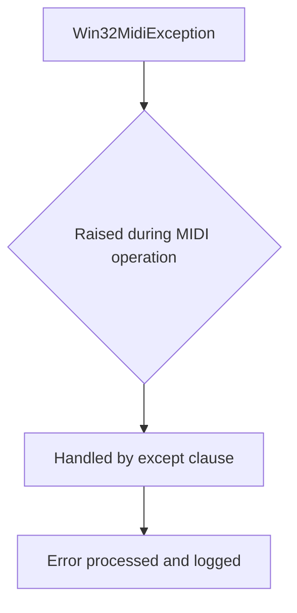
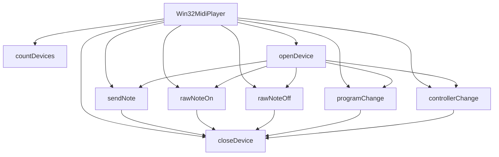

# `win32midi.py`

## `mingus.midi.win32midi.Win32MidiException` · *class*

## Summary:
A custom exception class for Win32 MIDI-related errors in the mingus library.

## Description:
Win32MidiException is a specialized exception type designed to handle errors that occur during Win32 MIDI operations within the mingus music library. It serves as a distinct error type that allows callers to differentiate MIDI-specific failures from other types of exceptions in the system. This exception inherits from Python's standard Exception class, making it compatible with standard exception handling patterns while providing semantic clarity for MIDI-related issues.

## State:
This class has no instance attributes or state variables. It inherits all behavior from the base Exception class.

## Lifecycle:
Creation: Instances are created by raising the exception directly or through exception propagation from underlying Win32 MIDI functions. No special instantiation requirements exist beyond standard exception creation patterns.

Usage: Typically used in try/except blocks to catch MIDI-specific errors when interacting with Windows MIDI APIs through the mingus library.

Destruction: Automatically handled by Python's garbage collection when the exception goes out of scope.

## Method Map:


## Raises:
This class itself does not raise any exceptions. It is raised by other components in the win32midi module when Win32 MIDI operations fail.

## Example:
```python
try:
    # Some Win32 MIDI operation
    midi_device.open()
except Win32MidiException as e:
    print(f"MIDI operation failed: {e}")
    # Handle the specific MIDI error
```

## `mingus.midi.win32midi.Win32MidiPlayer` · *class*

## Summary:
A Windows MIDI player that provides interface to send MIDI messages through the Windows multimedia API.

## Description:
This class serves as a wrapper around Windows' multimedia MIDI functions to enable sending MIDI messages from Python applications on Windows systems. It provides methods for managing MIDI device connections and sending various types of MIDI events such as notes, program changes, and controller messages. The class is designed specifically for Windows environments and uses ctypes to interface with the winmm.dll library.

## State:
- `midiOutOpenErrorCodes` (dict): Maps MIDI error codes to descriptive error messages for device opening operations
- `midiOutShortErrorCodes` (dict): Maps MIDI error codes to descriptive error messages for short message operations  
- `winmm` (ctypes.windll): Reference to the Windows multimedia DLL for MIDI function calls
- `hmidi` (c_void_p): Handle to the opened MIDI device (set during openDevice call)

## Lifecycle:
- Creation: Instantiate with `Win32MidiPlayer()` - no arguments required
- Usage: Call `openDevice()` to connect to a MIDI device, then use various send methods like `sendNote()`, `rawNoteOn()`, `programChange()`, etc. Finally call `closeDevice()` to release the device
- Destruction: Call `closeDevice()` to properly release the MIDI device handle

## Method Map:


## Raises:
- `Win32MidiException`: Raised during device operations and MIDI message sending when Windows MIDI functions return non-zero error codes
- Specifically raised in `openDevice()` when device opening fails
- Specifically raised in all send methods when MIDI message transmission fails

## Example:
```python
player = Win32MidiPlayer()
player.openDevice()  # Opens default MIDI device
player.sendNote(60, duration=1.0, channel=1, volume=60)  # Play middle C for 1 second
player.closeDevice()  # Close the device
```

### `mingus.midi.win32midi.Win32MidiPlayer.__init__` · *method*

## Summary:
Initializes the Win32MIDI player by setting up error code mappings and Windows Multimedia API reference.

## Description:
This constructor method initializes the Win32MIDI player object by setting up error code dictionaries for MIDI operations and establishing a reference to the Windows Multimedia API. It prepares the object for MIDI playback operations on Windows systems by configuring error handling mappings and API access.

## Args:
    None

## Returns:
    None

## Raises:
    None explicitly raised

## State Changes:
    Attributes READ: None
    Attributes WRITTEN: 
    - self.midiOutOpenErrorCodes: Dictionary mapping MIDI output open error codes to descriptive messages
    - self.midiOutShortErrorCodes: Dictionary mapping MIDI short message error codes to descriptive messages  
    - self.winmm: Reference to the Windows Multimedia DLL (windll.winmm)

## Constraints:
    Preconditions: None
    Postconditions: The object is initialized with error code mappings and Windows Multimedia API access ready for MIDI operations

## Side Effects:
    None

### `mingus.midi.win32midi.Win32MidiPlayer.countDevices` · *method*

## Summary:
Returns the total number of MIDI output devices available on the Windows system.

## Description:
This method provides access to the Windows Multimedia API function `midiOutGetNumDevs()` to determine how many MIDI output devices are installed and available for use. It's typically called during system initialization or device enumeration to discover what MIDI hardware is accessible.

The method is part of the Win32MidiPlayer class which provides Windows-specific MIDI functionality using the winmm.dll library. This method serves as a wrapper around the native Windows API call to abstract away the low-level implementation details.

## Args:
    None

## Returns:
    int: The number of MIDI output devices available on the system. Returns 0 if no MIDI devices are found, and typically returns a positive integer for systems with MIDI hardware installed.

## Raises:
    None explicitly raised - the underlying Windows API call may fail but this method doesn't catch or re-raise those exceptions.

## State Changes:
    Attributes READ: self.winmm
    Attributes WRITTEN: None

## Constraints:
    Preconditions: The Win32MidiPlayer instance must have been properly initialized with winmm loaded via windll.winmm
    Postconditions: The method returns a non-negative integer representing device count

## Side Effects:
    None - This is a read-only operation that doesn't modify any state or perform I/O beyond the Windows API call

### `mingus.midi.win32midi.Win32MidiPlayer.openDevice` · *method*

## Summary:
Opens a MIDI output device for sending MIDI messages, initializing the device handle for subsequent MIDI operations.

## Description:
This method establishes a connection to a MIDI output device using the Windows Multimedia API. It initializes the internal device handle (`self.hmidi`) that subsequent MIDI operations will use. The method allows specifying a particular MIDI device number or using the default device (-1) which typically maps to the system's default MIDI output.

## Args:
    deviceNumber (int): The MIDI device identifier to open. Defaults to -1, which represents the default device set in the MIDI mapper. Valid device numbers are typically between 0 and the result of countDevices() - 1.

## Returns:
    None: This method does not return a value.

## Raises:
    Win32MidiException: When the MIDI device cannot be opened due to various reasons such as invalid device ID, device already allocated, or other Windows Multimedia API errors.

## State Changes:
    Attributes READ: 
        - self.winmm: Access to Windows Multimedia API functions
        - self.midiOutOpenErrorCodes: Error code mapping dictionary for device opening errors
    Attributes WRITTEN:
        - self.hmidi: Set to a c_void_p representing the opened MIDI device handle

## Constraints:
    Preconditions:
        - The Win32MidiPlayer instance must be initialized
        - The deviceNumber must be a valid device identifier or -1 for default device
        - The Windows Multimedia API must be available on the system
    Postconditions:
        - On success, self.hmidi will contain a valid handle to the opened MIDI device
        - On failure, no state changes occur (the method is atomic in terms of state modification)

## Side Effects:
    - Makes a system call to the Windows Multimedia API (midiOutOpen)
    - May cause I/O operations to initialize the MIDI device
    - May raise Win32MidiException if device opening fails

### `mingus.midi.win32midi.Win32MidiPlayer.closeDevice` · *method*

## Summary:
Closes the currently opened MIDI output device and releases its system resources.

## Description:
This method terminates the connection to a previously opened MIDI output device by calling the Windows multimedia API function `midiOutClose`. It should be called to properly release system resources associated with the MIDI device when MIDI playback is complete or when the device needs to be closed explicitly. This method is typically called as part of the normal cleanup process when a Win32MidiPlayer instance is no longer needed or when switching between different MIDI devices.

## Args:
    None

## Returns:
    None

## Raises:
    Win32MidiException: When the Windows MIDI API returns a non-zero error code indicating failure to close the device.

## State Changes:
    Attributes READ: self.hmidi, self.winmm
    Attributes WRITTEN: None

## Constraints:
    Preconditions: The MIDI device must have been successfully opened via a previous call to `openDevice()` method, setting `self.hmidi` to a valid device handle.
    Postconditions: The MIDI device handle (`self.hmidi`) becomes invalid and should not be used for further MIDI operations until the device is reopened.

## Side Effects:
    I/O: Makes a system call to the Windows multimedia API to close the MIDI device handle.
    Resource Management: Releases system resources associated with the MIDI output device.

### `mingus.midi.win32midi.Win32MidiPlayer.sendNote` · *method*

## Summary:
Sends a complete MIDI note message with specified pitch, duration, channel, and volume by generating note-on and note-off events.

## Description:
The sendNote method generates and sends a complete MIDI note message to the currently opened MIDI device. It first sends a note-on message with the specified pitch and volume, waits for the specified duration, then sends a note-off message to terminate the note. This method encapsulates the complete process of playing a note with a defined duration, making it convenient for basic musical note playback.

## Args:
    pitch (int): MIDI pitch value (0-127) for the note to play.
    duration (float): Duration in seconds to hold the note. Defaults to 1.0.
    channel (int): MIDI channel number (1-16). Defaults to 1.
    volume (int): Note velocity/volume (0-127). Defaults to 60.

## Returns:
    None: This method does not return any value.

## Raises:
    Win32MidiException: When MIDI operations fail during note-on or note-off message transmission.

## State Changes:
    Attributes READ: self.winmm, self.hmidi, self.midiOutShortErrorCodes
    Attributes WRITTEN: None

## Constraints:
    Preconditions: 
    - A MIDI device must be opened using the openDevice() method before calling this method
    - Pitch must be between 0 and 127 (inclusive)
    - Channel must be between 1 and 16 (inclusive)
    - Volume must be between 0 and 127 (inclusive)
    - Duration must be a non-negative number
    
    Postconditions:
    - The MIDI device remains open after execution
    - The note is played for exactly the specified duration
    - No other MIDI state is modified

## Side Effects:
    - Makes blocking I/O calls to Windows MIDI API via ctypes
    - Sleeps for the specified duration, blocking execution
    - May raise Win32MidiException if MIDI operations fail

### `mingus.midi.win32midi.Win32MidiPlayer.rawNoteOn` · *method*

## Summary:
Sends a MIDI note-on message for the specified pitch and channel to start a sounding note.

## Description:
This method constructs and sends a MIDI note-on message using the Windows multimedia API. It is designed to initiate a note without automatically stopping it, allowing for manual control over note duration. This method is typically used in conjunction with `rawNoteOff` to create sustained notes or as part of more complex MIDI sequencing operations.

## Args:
    pitch (int): The MIDI pitch value (0-127) of the note to play.
    channel (int): The MIDI channel number (1-16) to send the message on. Defaults to 1.
    v (int): The velocity (0-127) of the note. Defaults to 60.

## Returns:
    None: This method does not return a value.

## Raises:
    Win32MidiException: Raised when the Windows MIDI API call fails. The exception includes a descriptive error message based on the Windows MIDI error code.

## State Changes:
    Attributes READ: 
        - self.winmm: Reference to the Windows multimedia DLL
        - self.hmidi: Handle to the open MIDI device
        - self.midiOutShortErrorCodes: Error code mapping for MIDI output errors
    
    Attributes WRITTEN: None

## Constraints:
    Preconditions:
        - The MIDI device must be opened via `openDevice()` before calling this method
        - The pitch value must be within the valid MIDI range (0-127)
        - The channel value must be within the valid MIDI channel range (1-16)
        - The velocity value must be within the valid MIDI velocity range (0-127)
    
    Postconditions:
        - A MIDI note-on message is sent to the currently opened device
        - The note begins sounding on the specified channel with the specified pitch and velocity

## Side Effects:
    - Makes a Windows API call to `midiOutShortMsg`
    - May raise a Win32MidiException if the MIDI operation fails
    - Does not modify any internal state beyond making the API call

### `mingus.midi.win32midi.Win32MidiPlayer.rawNoteOff` · *method*

## Summary:
Sends a MIDI note off message for the specified pitch and channel to stop a sounding note.

## Description:
This method constructs and sends a MIDI note off message using the Windows multimedia API. It is typically used to stop a note that was previously started with a note on message. The method is designed to be called independently or as part of higher-level note playing functions like `sendNote`.

## Args:
    pitch (int): The MIDI pitch value (0-127) of the note to turn off.
    channel (int): The MIDI channel number (1-16) to send the message on. Defaults to 1.

## Returns:
    None: This method does not return a value.

## Raises:
    Win32MidiException: Raised when the Windows MIDI API call fails. This exception is used consistently throughout the Win32MidiPlayer class for MIDI operation failures.

## State Changes:
    Attributes READ: 
        - self.winmm: Reference to the Windows multimedia DLL
        - self.hmidi: Handle to the open MIDI device
        - self.midiOutShortErrorCodes: Error code mapping for MIDI output errors
    
    Attributes WRITTEN: None

## Constraints:
    Preconditions:
        - The MIDI device must be opened via `openDevice()` before calling this method
        - The pitch value must be within the valid MIDI range (0-127)
        - The channel value must be within the valid MIDI channel range (1-16)
    
    Postconditions:
        - A MIDI note off message is sent to the currently opened device
        - If successful, the note stops producing sound on the specified channel

## Side Effects:
    - Makes a Windows API call to `midiOutShortMsg`
    - May raise a Win32MidiException if the MIDI operation fails
    - Does not modify any internal state beyond making the API call

### `mingus.midi.win32midi.Win32MidiPlayer.programChange` · *method*

## Summary:
Changes the MIDI program (instrument sound) for a specified channel.

## Description:
Sends a MIDI program change message to the currently opened MIDI device, allowing the selection of different instrument sounds or patches on a specific channel. This method is used to switch between different musical instruments or sound sets in MIDI playback.

## Args:
    program (int): The program number (0-127) to select for the instrument patch.
    channel (int): The MIDI channel number (1-16) to send the program change to. Defaults to 1.

## Returns:
    None: This method does not return any value.

## Raises:
    Win32MidiException: Raised when the Windows MIDI API fails to send the program change message. The exception includes a descriptive error message based on the Windows MIDI error code returned.

## State Changes:
    Attributes READ: 
        - self.winmm: Reference to the Windows multimedia MIDI library
        - self.hmidi: Handle to the currently opened MIDI device
        - self.midiOutShortErrorCodes: Dictionary mapping MIDI error codes to human-readable messages
    
    Attributes WRITTEN: 
        - None: This method does not modify any instance attributes.

## Constraints:
    Preconditions:
        - A MIDI device must be opened using `openDevice()` before calling this method
        - The program parameter must be within the valid range of 0-127
        - The channel parameter must be within the valid range of 1-16
    
    Postconditions:
        - The MIDI program change message is sent to the specified channel
        - If successful, the instrument on the specified channel is changed to the requested program

## Side Effects:
    - Makes a Windows API call to the multimedia MIDI subsystem
    - May cause audible changes in MIDI playback if the device is actively playing
    - No external service calls beyond the Windows MIDI API

### `mingus.midi.win32midi.Win32MidiPlayer.controllerChange` · *method*

## Summary:
Sends a MIDI controller change message to modify controller settings on a specified MIDI channel.

## Description:
This method constructs and sends a MIDI controller change message using the Windows multimedia MIDI API. It allows modification of various controller parameters such as volume, pan, modulation, and other MIDI controller settings. The method follows the standard MIDI protocol where controller change messages use status byte 0xB0.

## Args:
    controller (int): The controller number (0-127) to modify.
    val (int): The controller value (0-127) to set.
    channel (int): The MIDI channel number (1-16) to send the message on. Defaults to 1.

## Returns:
    None: This method does not return a value.

## Raises:
    Win32MidiException: Raised when the Windows MIDI API fails to send the controller change message. The exception includes a descriptive error message based on the Windows error code returned by midiOutShortMsg.

## State Changes:
    Attributes READ: 
        - self.winmm: Windows multimedia library reference
        - self.hmidi: MIDI output device handle
        - self.midiOutShortErrorCodes: Error code mapping dictionary
    
    Attributes WRITTEN: 
        - None: This method does not modify any instance attributes.

## Constraints:
    Preconditions:
        - The MIDI device must be opened via openDevice() before calling this method
        - Controller number must be in range [0, 127]
        - Controller value must be in range [0, 127]
        - Channel number must be in range [1, 16]
    
    Postconditions:
        - The controller change message is sent to the MIDI device
        - If successful, the controller setting is modified on the specified channel

## Side Effects:
    - Makes a Windows API call to midiOutShortMsg
    - May cause I/O operations on the MIDI device
    - Raises Win32MidiException on failure to communicate with MIDI hardware

