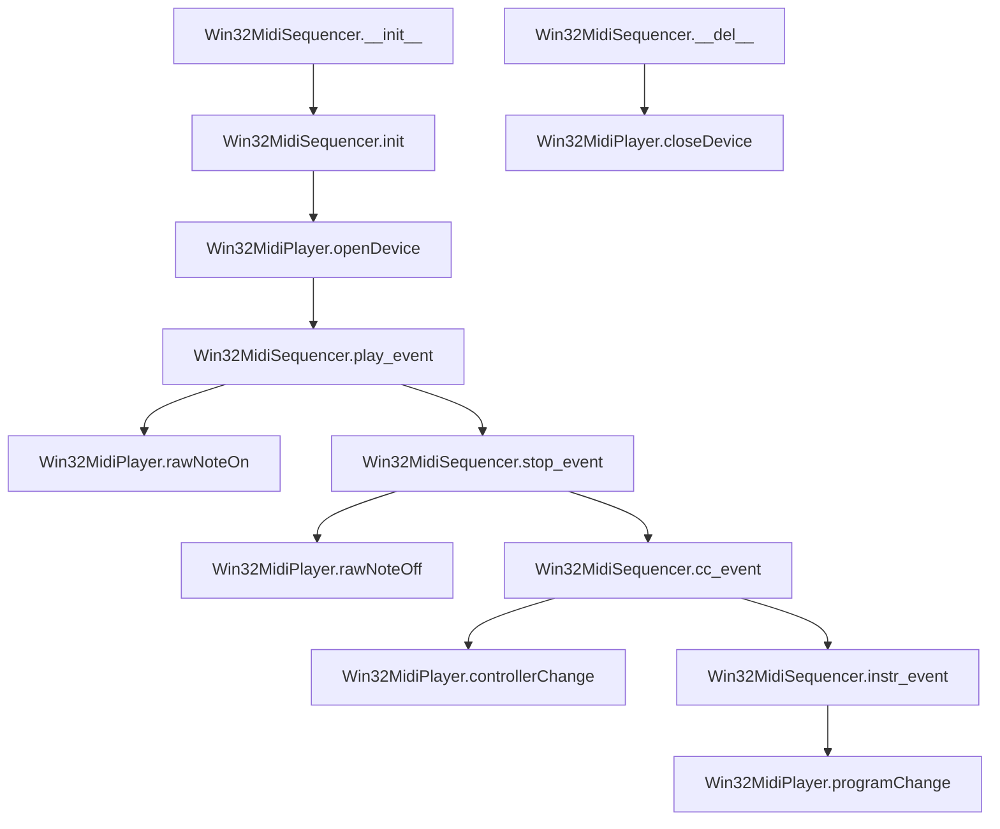

# `win32midisequencer.py`

## `mingus.midi.win32midisequencer.Win32MidiSequencer` · *class*

## Summary:
Windows-specific MIDI sequencer implementation that provides MIDI event playback functionality using the Windows multimedia API.

## Description:
The Win32MidiSequencer class is a concrete implementation of the Sequencer base class designed specifically for Windows platforms. It enables MIDI playback by interfacing with Windows' multimedia MIDI functions through the Win32MidiPlayer backend. This class is intended for use only on Windows systems (win32 platform) and provides implementations for playing musical notes, controlling instruments, and managing MIDI events.

The class follows the standard sequencer pattern by implementing abstract methods from the Sequencer base class while providing Windows-specific MIDI functionality through the win32midi module.

## State:
- midplayer (Win32MidiPlayer): Instance of the Windows MIDI player backend that handles actual MIDI communication. Initialized during `init()` call.
- output (None): Class-level attribute inherited from Sequencer but not actively used in this implementation.

## Lifecycle:
- Creation: Instantiate with `Win32MidiSequencer()` constructor, which creates an instance but does not initialize MIDI hardware
- Initialization: Call `init()` method to open the MIDI device and prepare for playback. Must be called before any MIDI events can be played.
- Usage: After initialization, call methods like `play_event()`, `stop_event()`, `cc_event()`, and `instr_event()` to send MIDI commands
- Destruction: The `__del__` method automatically closes the MIDI device when the object is garbage collected, though explicit cleanup via `close()` is recommended

## Method Map:


## Raises:
- RuntimeError: Raised during `init()` if the platform is not Windows (sys.platform != "win32")
- Win32MidiException: Raised by underlying Win32MidiPlayer methods when MIDI operations fail

## Example:
```python
# Create and initialize the sequencer
sequencer = Win32MidiSequencer()
sequencer.init()  # Opens MIDI device

# Play a note
sequencer.play_event(60, channel=1, velocity=64)  # Play middle C

# Stop the note
sequencer.stop_event(60, channel=1)

# Change instrument
sequencer.instr_event(channel=1, instr=40, bank=0)  # Play piano

# Clean up
del sequencer  # Automatically closes MIDI device
```

### `mingus.midi.win32midisequencer.Win32MidiSequencer.init` · *method*

## Summary:
Initializes the Windows MIDI sequencer by validating the platform and setting up the Win32 MIDI player device.

## Description:
This method performs platform validation and initializes the Windows-specific MIDI player for the sequencer. It ensures that the code is running on a Windows platform before attempting to create and open a Win32 MIDI device. This method is called during the sequencer's initialization phase to prepare the MIDI output subsystem.

The method is separated from the constructor to allow for proper platform checking before attempting platform-specific operations, preventing errors on non-Windows systems.

## Args:
    None: This method takes no arguments beyond the implicit self parameter.

## Returns:
    None: This method does not return any value.

## Raises:
    RuntimeError: Raised when the method is called on a non-Win32 platform (sys.platform != "win32").

## State Changes:
    Attributes READ: 
        - self (no specific attributes read, but platform check via sys.platform)
    Attributes WRITTEN:
        - self.midplayer: Assigned a new Win32MidiPlayer instance

## Constraints:
    Preconditions:
        - Must be running on a Windows system (sys.platform == "win32")
        - The Win32MidiPlayer class must be available and functional
    Postconditions:
        - On successful execution, self.midplayer will reference a Win32MidiPlayer instance
        - The Win32MidiPlayer instance will have its device opened (via openDevice call)

## Side Effects:
    - Platform validation through sys.platform check
    - Instantiation of Win32MidiPlayer object
    - Calls to Win32MidiPlayer.openDevice() which makes Windows API calls
    - Potential I/O operations to initialize the MIDI device

### `mingus.midi.win32midisequencer.Win32MidiSequencer.__del__` · *method*

## Summary:
Closes the MIDI output device when the Win32MidiSequencer object is garbage collected.

## Description:
This special destructor method is automatically invoked by Python's garbage collector when a Win32MidiSequencer instance is about to be destroyed. It ensures proper cleanup of system resources by closing the underlying MIDI device through the Win32MidiPlayer instance. This method is crucial for preventing resource leaks when working with Windows MIDI devices.

## Args:
    None

## Returns:
    None

## Raises:
    Win32MidiException: When the Windows MIDI API fails to close the device handle, typically if the device was not properly opened or has already been closed.

## State Changes:
    Attributes READ: self.midplayer (accessed to call closeDevice method)
    Attributes WRITTEN: None

## Constraints:
    Preconditions: The Win32MidiSequencer object must have been initialized (calling `init()` method) so that `self.midplayer` is properly set to a Win32MidiPlayer instance.
    Postconditions: The MIDI device handle (`self.hmidi`) in the Win32MidiPlayer is released and should not be used for further MIDI operations.

## Side Effects:
    I/O: Makes a system call to the Windows multimedia API (midiOutClose) to close the MIDI device handle.
    Resource Management: Releases system resources associated with the MIDI output device.

### `mingus.midi.win32midisequencer.Win32MidiSequencer.play_event` · *method*

## Summary:
Plays a MIDI note event by sending a note-on message to the Windows MIDI device.

## Description:
This method implements the abstract `play_event` interface from the base `Sequencer` class. It sends a MIDI note-on message to the Windows MIDI device using the underlying `Win32MidiPlayer` instance. This method is called internally by the sequencer's note-playing logic to trigger individual note events.

Known callers:
- `Sequencer.play_Note()` method in the base class, which converts note objects to MIDI note numbers and calls this method

This method exists as a separate implementation to abstract the Windows-specific MIDI communication from the higher-level sequencer logic, providing a clean interface between the sequencer's event system and the actual MIDI output.

## Args:
    note (int): The MIDI note number (0-127) to play.
    channel (int): The MIDI channel number (1-16) to send the message on.
    velocity (int): The velocity (0-127) of the note playback.

## Returns:
    None: This method does not return any value.

## Raises:
    Win32MidiException: Raised when the Windows MIDI API fails to send the note-on message. This occurs when the MIDI device is not properly opened or when the Windows multimedia API returns an error code.

## State Changes:
    Attributes READ: 
        - self.midplayer: The Win32MidiPlayer instance used for MIDI communication
    
    Attributes WRITTEN: None

## Constraints:
    Preconditions:
        - The `Win32MidiSequencer` must be properly initialized via `init()` method
        - The MIDI device must be successfully opened via `self.midplayer.openDevice()`
        - The note number must be within the valid MIDI range (0-127)
        - The channel must be within the valid MIDI channel range (1-16)
        - The velocity must be within the valid MIDI velocity range (0-127)
    
    Postconditions:
        - A MIDI note-on message is sent to the Windows MIDI device
        - The note begins sounding on the specified channel with the specified pitch and velocity

## Side Effects:
    I/O: Makes a Windows API call to `midiOutShortMsg` through the Windows multimedia subsystem
    External service calls: Calls Windows multimedia MIDI API functions
    Mutations to objects outside self: None (does not modify external objects)

### `mingus.midi.win32midisequencer.Win32MidiSequencer.stop_event` · *method*

## Summary:
Stops a MIDI note by sending a note-off message to the associated MIDI player.

## Description:
This method implements the abstract `stop_event` interface defined by the base `Sequencer` class. It sends a MIDI note-off message for the specified note and channel to stop a sounding note. This method is typically called as part of the sequencer's note stopping workflow when a note's duration ends or needs to be cancelled prematurely.

The method is part of the standard MIDI sequencer interface and is invoked by higher-level sequencer methods like `stop_Note` which are responsible for managing the note stopping lifecycle.

## Args:
    note (int): The MIDI note number (0-127) to stop.
    channel (int): The MIDI channel number (1-16) to send the note-off message on.

## Returns:
    None: This method does not return a value.

## Raises:
    Win32MidiException: Raised when the underlying Windows MIDI API call fails during note-off message transmission.

## State Changes:
    Attributes READ: 
        - self.midplayer: The Win32MidiPlayer instance used for MIDI operations
    
    Attributes WRITTEN: None

## Constraints:
    Preconditions:
        - The MIDI device must be opened via `init()` before calling this method
        - The note value must be within the valid MIDI range (0-127)
        - The channel value must be within the valid MIDI channel range (1-16)
    
    Postconditions:
        - A MIDI note-off message is sent to the currently opened device
        - The specified note stops producing sound on the specified channel

## Side Effects:
    - Makes a Windows API call to `midiOutShortMsg` through the Win32MidiPlayer
    - May raise a Win32MidiException if the MIDI operation fails

### `mingus.midi.win32midisequencer.Win32MidiSequencer.cc_event` · *method*

## Summary:
Sends a MIDI controller change message to modify controller settings on a specified MIDI channel.

## Description:
This method implements the MIDI control change event handler for the Windows-specific MIDI sequencer implementation. It forwards control change commands to the underlying Windows MIDI player, enabling modification of various MIDI controller parameters such as volume, pan, modulation, and other controller settings. The method is part of the sequencer's event processing pipeline and is invoked when control change events need to be sent to MIDI devices.

Known callers:
- `control_change()` method in the Sequencer base class, which broadcasts control change events to all registered listeners
- These listeners typically include MIDI event processors that translate high-level musical commands into low-level MIDI messages

This method exists as a separate component to abstract the platform-specific MIDI implementation details from the higher-level sequencer interface, maintaining consistency with other event handlers like `play_event`, `stop_event`, and `instr_event` in the same class.

## Args:
    channel (int): The MIDI channel number (1-16) to send the controller change message on.
    control (int): The controller number (0-127) to modify.
    value (int): The controller value (0-127) to set.

## Returns:
    None: This method does not return any value.

## Raises:
    Win32MidiException: Raised when the Windows MIDI API fails to send the controller change message. The exception includes a descriptive error message based on the Windows error code returned by midiOutShortMsg.

## State Changes:
    Attributes READ: 
        - self.midplayer: The Windows MIDI player instance responsible for sending MIDI messages
    
    Attributes WRITTEN: 
        - None: This method does not modify any instance attributes of the sequencer itself.

## Constraints:
    Preconditions:
        - The MIDI device must be opened via `init()` before calling this method
        - Channel number must be in range [1, 16]
        - Control number must be in range [0, 127]
        - Value must be in range [0, 127]
    
    Postconditions:
        - The controller change message is sent to the MIDI device
        - The specified controller setting is modified on the given channel

## Side Effects:
    I/O: Makes a Windows API call to midiOutShortMsg through the Win32MidiPlayer
    MIDI output: Sends MIDI controller change messages to the configured MIDI output device
    External service calls: None (assumes MIDI device is properly configured)
    Mutations to objects outside self: None (the method itself doesn't mutate external objects)

### `mingus.midi.win32midisequencer.Win32MidiSequencer.instr_event` · *method*

## Summary:
Changes the MIDI program (instrument sound) for a specified channel in the sequencer.

## Description:
This method sends a MIDI program change message to modify the instrument sound on a specific channel. It is part of the Windows-specific MIDI sequencer implementation and serves as an event handler for instrument change requests within the MIDI sequencing pipeline. The method acts as a bridge between the abstract sequencer interface and the Windows MIDI API.

Known callers:
- `instrument()` method in the Sequencer base class, which broadcasts instrument change events to all registered listeners
- These listeners typically include MIDI event processors that translate high-level musical commands into low-level MIDI messages

This logic is separated into its own method to maintain consistency with other event handlers (play_event, stop_event, cc_event) in the same class and to abstract platform-specific MIDI implementation details from the higher-level sequencer interface.

## Args:
    channel (int): The MIDI channel number (1-16) to send the program change to.
    instr (int): The instrument program number (0-127) to select for the instrument patch.
    bank (int): The MIDI bank number (0-127) to select for the instrument bank. Note: This parameter is not used in the current implementation.

## Returns:
    None: This method does not return any value.

## Raises:
    Win32MidiException: Raised when the Windows MIDI API fails to send the program change message. The exception includes a descriptive error message based on the Windows MIDI error code returned.

## State Changes:
    Attributes READ: 
        - self.midplayer: The Windows MIDI player instance responsible for sending MIDI messages
    
    Attributes WRITTEN: 
        - None: This method does not modify any instance attributes of the sequencer itself.

## Constraints:
    Preconditions:
        - The MIDI device must be opened via `init()` before calling this method
        - Channel number must be in range [1, 16]
        - Instrument number must be in range [0, 127]
    
    Postconditions:
        - The MIDI program change message is sent to the specified channel
        - The instrument on the specified channel is changed to the requested program

## Side Effects:
    I/O: Makes a Windows API call to midiOutShortMsg through the Win32MidiPlayer
    MIDI output: Sends MIDI program change messages to the configured MIDI output device
    External service calls: None (assumes MIDI device is properly configured)
    Mutations to objects outside self: None (the method itself doesn't mutate external objects)

