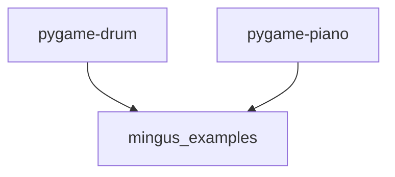

# `mingus_examples`

## Tree:
```
mingus_examples/
├── pygame-drum/
└── pygame-piano/
```

## Role:
Provides example implementations of pygame-based musical interfaces using mingus and fluidsynth

## Description:
The mingus_examples module serves as a collection of demonstration applications that showcase how to build interactive musical interfaces using pygame, mingus for musical processing, and fluidsynth for audio synthesis. This module contains two primary examples: a pygame-based drum sequencer and a pygame-based piano interface.

The module acts as a container for educational and demonstration purposes, providing working examples of how to integrate musical theory concepts with graphical user interfaces and audio playback systems. These examples are particularly useful for developers learning how to build interactive music applications.

## Components:
*   **pygame-drum/**: Directory containing a pygame-based drum sequencer implementation
*   **pygame-piano/**: Directory containing a pygame-based piano interface implementation



## Public API:
*   **pygame-drum/**: Directory containing implementation files for drum sequencer
*   **pygame-piano/**: Directory containing implementation files for piano interface

## Dependencies:
*   **Internal**: None
*   **External**: 
    *   pygame - For graphical rendering, event handling, and image management
    *   mingus - For musical note and chord processing
    *   fluidsynth - For MIDI audio synthesis

## Constraints:
*   Both submodules require proper initialization of fluidsynth audio system before audio playback
*   Image assets must be available in the respective subdirectories for proper rendering
*   All examples assume standard mingus Note objects and fluidsynth configuration
*   Thread safety is not guaranteed for the interactive examples

