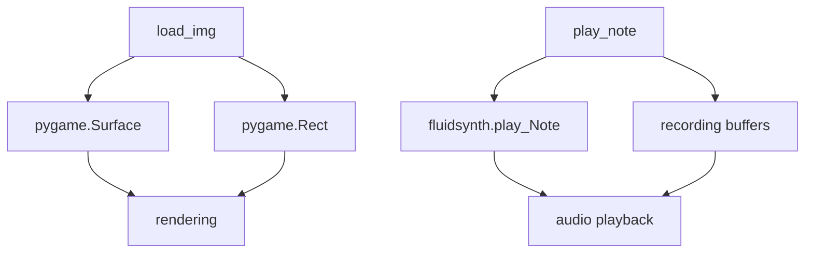

# `mingus_examples.pygame-drum`

## Tree:
```
pygame-drum/
└── pygame-drum.py
```

## Role:
Handles audio playback and image loading for a pygame-based drum sequencer application

## Description:
This module provides core functionality for a pygame-based drum sequencing application, combining audio synthesis capabilities with graphical asset management. It serves as the interface between the musical sequencing logic and the pygame rendering/audio systems. The module is responsible for playing musical notes through fluidsynth and managing image assets for visual representation.

## Components:
- **load_img(name)**: Loads and prepares Pygame images with appropriate color conversion
- **play_note(note)**: Plays musical notes using fluidsynth and optionally records them for sequencing



## Public API:
- **load_img(name: str) -> tuple[pygame.Surface, pygame.Rect]**: Loads an image file and returns the surface with its rectangle bounds
- **play_note(note: mingus.containers.Note) -> None**: Plays a musical note and optionally records it for sequencing

## Dependencies:
- **Internal**: Uses mingus library for musical note handling
- **External**: 
  - pygame for image handling and rendering
  - fluidsynth for MIDI audio synthesis
  - sys for system exit handling

## Constraints:
- Requires proper initialization of fluidsynth audio system before calling play_note
- Image files must exist and be readable for load_img to succeed
- play_note expects specific Note objects from mingus library
- Global variables (status, playing, recorded, recorded_buffer, tick) must be properly initialized for recording functionality

---

## Files

- [`pygame-drum.py`](pygame-drum/pygame-drum.md)

