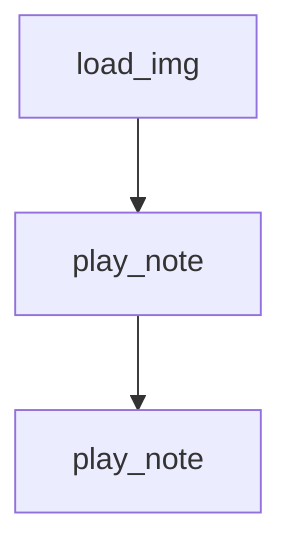

# `mingus_examples.pygame-piano`

## Tree:
```
pygame-piano/
└── pygame-piano.py
```

## Role:
Provides core piano interface functionality for a pygame-based musical application including image handling, note playback, and chord recognition.

## Description:
The pygame-piano module implements the core interactive piano functionality for a pygame-based musical application. It offers utilities for loading and preparing graphical assets, along with the primary piano interface logic that handles note input, visual key positioning, and real-time chord detection. This module serves as a foundational component that bridges the graphical user interface with musical processing capabilities.

The module is typically imported and used by the main application controller that manages pygame events and the application lifecycle. It's designed to integrate seamlessly with the mingus music library for note manipulation and fluidsynth for audio synthesis.

## Components:
*   `load_img(name: str) -> tuple[pygame.Surface, pygame.Rect]`: Loads and prepares images for pygame rendering with appropriate color conversion based on alpha channel presence
*   `play_note(note: Note) -> None`: Handles musical note playback, visual key positioning, and chord detection for the piano interface



## Public API:
*   `load_img(name: str) -> tuple[pygame.Surface, pygame.Rect]`: Loads an image file from disk and prepares it for pygame rendering. Applies appropriate color conversion based on whether the image contains transparency information. Returns a tuple containing the loaded pygame Surface and its bounding rectangle.
*   `play_note(note: Note) -> None`: Plays a musical note on the virtual piano interface and displays chord information. Positions notes on white and black keys, maintains playing state, determines chords being played, and displays chord names on screen. Integrates with mingus for note playback and chord detection.

## Dependencies:
*   **Internal**: None
*   **External**: 
    *   `pygame` - Used for image loading, surface management, rendering operations, and text rendering
    *   `mingus` - Provides musical note objects and chord determination functionality through `mingus.chords.determine()`
    *   `fluidsynth` - Handles MIDI audio synthesis for note playback via `fluidsynth.play_Note()`

## Constraints:
*   The `play_note` function requires several global variables to be initialized before use:
    *   `LOWEST`: Minimum octave value for the piano keyboard layout
    *   `width`: Width dimension for keyboard layout calculations  
    *   `WHITE_KEYS`: List of white key note names
    *   `BLACK_KEYS`: List of black key note names
    *   `playing_w`: List tracking currently playing white keys (each item is [position, tick, note])
    *   `playing_b`: List tracking currently playing black keys (each item is [position, tick, note])
    *   `tick`: Current time/tick counter for note tracking
    *   `font`: Pygame font object for text rendering
    *   `text`: Pygame surface for displaying chord information
    *   `channel`: MIDI channel number for sound output
*   Image loading requires files to exist and be valid image formats supported by Pygame
*   Note playback depends on proper MIDI system initialization for fluidsynth to function
*   Thread safety: Not guaranteed; assumes single-threaded execution for global variable modifications
*   The note parameter for `play_note` must be a valid mingus Note object with proper name and octave attributes

---

## Files

- [`pygame-piano.py`](pygame-piano/pygame-piano.md)

