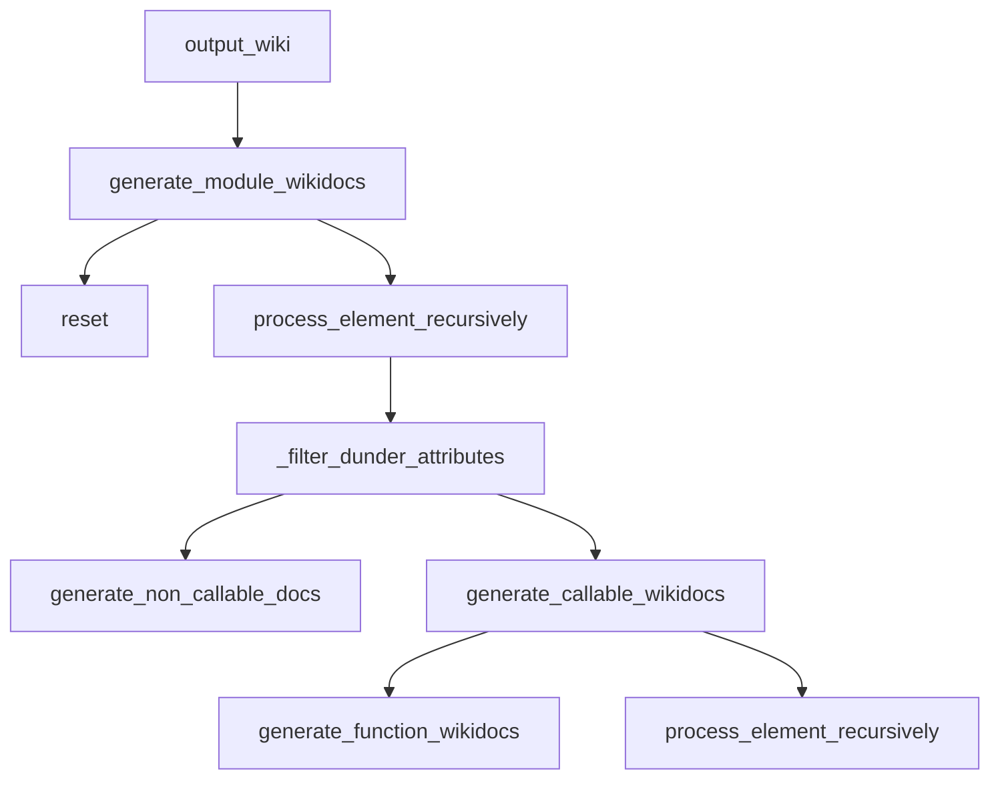

# `api_doc_generator.py`

## `scripts.api_doc_generator._is_class` · *function*

## Summary:
Filters classes for API documentation inclusion by checking if they are regular classes and not excluded superclasses.

## Description:
This utility function determines whether a given class should be included in API documentation generation. It evaluates if a class is a standard Python class (subclass of object) while excluding certain base classes that should not appear in documentation.

The function serves as a predicate in documentation generation pipelines to filter out built-in types, abstract base classes, or other special superclasses that would not be meaningful to document.

## Args:
    cls (type): A Python class object to evaluate for documentation inclusion.

## Returns:
    bool: True if the class is a regular Python class and not excluded by the skip list; False otherwise.

## Raises:
    None: This function does not explicitly raise exceptions under normal circumstances.

## Constraints:
    Preconditions:
        - Input must be a class or type object
        - The class must be compatible with Python's issubclass mechanism
    
    Postconditions:
        - Returns a boolean value indicating documentation eligibility
        - Function is pure - no side effects or state changes

## Side Effects:
    None: This function performs only type checking operations with no external effects.

## Control Flow:
```mermaid
flowchart TD
    A[Input: cls] --> B{issubclass(cls, object)?}
    B -- No --> C[Return False]
    B -- Yes --> D{issubclass(cls, _SKIPPED_CLASS_SUPERTYPES)?}
    D -- Yes --> E[Return False]
    D -- No --> F[Return True]
```

## Examples:
```python
# Typical usage in documentation generator
filtered_classes = [cls for cls in all_classes if _is_class(cls)]

# This would return False for built-in types
_is_class(str)  # Likely False (str is in skipped types)
_is_class(list) # Likely False (list is in skipped types)

# This would return True for user-defined classes  
class MyClass:
    pass
_is_class(MyClass)  # True (assuming MyClass is not skipped)
```

## `scripts.api_doc_generator._is_method` · *function*

## Summary:
Checks if an object is of a method type by comparing its type against a predefined set of method types.

## Description:
This utility function serves as a type checker for method objects. It determines whether a given object belongs to one of the recognized method types by performing a membership test against an internal collection of method type identifiers. This extraction allows for clean, reusable method type detection throughout the codebase.

## Args:
    obj (Any): The object to be tested for method type membership.

## Returns:
    bool: True if the object's type is contained in the internal _METHOD_TYPES collection, False otherwise.

## Raises:
    None explicitly raised.

## Constraints:
    Preconditions: The input object must be a valid Python object.
    Postconditions: The function always returns a boolean value representing method type membership.

## Side Effects:
    None.

## Control Flow:
```mermaid
flowchart TD
    A[Input obj] --> B{type(obj) in _METHOD_TYPES?}
    B -->|Yes| C[Return True]
    B -->|No| D[Return False]
```

## Examples:
    # Check if a function is a method
    def sample_func():
        pass
    
    # This would return True if sample_func is bound to a class instance
    # is_method = _is_method(sample_func)
    
    # This would return False for a regular string
    # is_method = _is_method("hello")

## `scripts.api_doc_generator.Documize` · *class*

## Summary:
A documentation generator that creates reStructuredText wiki-style documentation for Python modules by recursively analyzing their contents.

## Description:
The Documize class provides functionality to automatically generate API documentation for Python modules in reStructuredText format. It recursively examines modules, classes, functions, and attributes, producing structured documentation suitable for Sphinx or similar documentation systems. The class is designed to be instantiated with a module string and can generate comprehensive documentation including function signatures, docstrings, and class hierarchies.

## State:
- functions: list[str] - Collection of generated function documentation strings
- classes: list[str] - Collection of generated class documentation strings  
- attributes: list[str] - Collection of generated attribute documentation strings
- module_string: str - The name of the module being documented
- module: object - The actual module object being processed
- _ALLOWED_DUNDER_METHODS: set[str] - Set of special methods that should be included in documentation

## Lifecycle:
- Creation: Instantiate with optional module_string parameter to specify which module to document
- Usage: Call output_wiki() method to generate complete documentation
- Destruction: No explicit cleanup required; state is reset between generations

## Method Map:


## Raises:
- None explicitly raised by __init__ method
- May raise AttributeError or NameError during eval() operations if module_string is invalid
- May raise SyntaxError during eval() operations if module_string contains malformed expressions

## Example:
```python
# Create documentation generator for a module
doc_gen = Documize('mingus.core.meters')

# Generate documentation
documentation = doc_gen.output_wiki()

# The result contains reStructuredText formatted documentation
print(documentation)
```

### `scripts.api_doc_generator.Documize.__init__` · *method*

## Summary:
Initializes the Documize instance by setting up the module string to be documented.

## Description:
The `__init__` method serves as the constructor for the Documize class. It accepts an optional module string parameter and delegates the module setup to the `set_module` method. This initialization prepares the instance for generating documentation for the specified module. When called without arguments, the instance remains uninitialized and ready to be configured later.

## Args:
    module_string (str): The string representation of the Python module to document. Defaults to an empty string.

## Returns:
    None: This method does not return any value.

## Raises:
    NameError: Raised by `eval()` in `set_module` when the module_string does not correspond to a valid module name.
    AttributeError: Raised by `eval()` in `set_module` when the module_string refers to a non-existent module or attribute.

## State Changes:
    Attributes READ: None
    Attributes WRITTEN: 
    - self.module_string: Set to the provided module_string value
    - self.module: Set to the evaluated module object when module_string is not empty (via `set_module`)

## Constraints:
    Preconditions: None
    Postconditions: 
    - If module_string is not empty, self.module_string and self.module are initialized and the instance is ready for documentation generation
    - If module_string is empty, the instance remains in an uninitialized state and requires manual configuration before use

## Side Effects:
    None: This method does not have any side effects beyond modifying instance attributes.

### `scripts.api_doc_generator.Documize._filter_dunder_attributes` · *method*

## Summary:
Filters out unwanted dunder attributes while preserving specific allowed dunder methods for documentation generation.

## Description:
This method processes a collection of attribute names and removes those that start with double underscores ('__') unless they are explicitly listed in the class's `_ALLOWED_DUNDER_METHODS` set. This filtering is used during API documentation generation to exclude most private/protected attributes while retaining essential special methods that should be documented.

The method is called during the recursive processing of module elements in the `process_element_recursively` method, where it helps determine which attributes and methods should be included in the generated documentation.

## Args:
    attrs (iterable[str]): An iterable of attribute names to filter.

## Returns:
    generator[str]: A generator yielding attribute names that either don't start with '__' or are in the `_ALLOWED_DUNDER_METHODS` set.

## Raises:
    None explicitly raised.

## State Changes:
    Attributes READ: self._ALLOWED_DUNDER_METHODS
    Attributes WRITTEN: None

## Constraints:
    Preconditions: The `attrs` argument must be iterable containing string attribute names.
    Postconditions: The returned generator will yield only attribute names that pass the filtering criteria.

## Side Effects:
    None.

### `scripts.api_doc_generator.Documize.process_element_recursively` · *method*

## Summary:
Recursively processes all non-private attributes of a module or class, generating appropriate documentation for callable and non-callable elements.

## Description:
This method serves as the core recursive processor for API documentation generation. It examines all attributes of a given module or class (excluding private attributes starting with underscore) and categorizes them as either callable (functions, methods, classes) or non-callable (data attributes). For each attribute, it delegates to specialized documentation generators based on the attribute type. This method is part of a recursive documentation pipeline that traverses the entire module/class hierarchy to build comprehensive API documentation.

The method is called during the module documentation generation phase in `generate_module_wikidocs()` and recursively processes nested modules and classes. It filters out private attributes using `_filter_dunder_attributes()` and handles both callable and non-callable elements appropriately.

## Args:
    element_string (str): The full dotted path string representing the module or class being processed
    element_evaled (Any): The actual Python object being examined (module, class, or other callable)
    is_class (bool, optional): Flag indicating whether the current processing context is within a class definition. Defaults to False

## Returns:
    None: This method does not return a value directly, but modifies instance state through side effects

## Raises:
    None explicitly raised: The method itself doesn't raise exceptions, though underlying operations like `eval()` or `dir()` may raise exceptions

## State Changes:
    Attributes READ: 
        - self._filter_dunder_attributes: Used to filter attribute names
        - self.generate_non_callable_docs: Called for non-callable elements
        - self.generate_callable_wikidocs: Called for callable elements
    
    Attributes WRITTEN: 
        - Through calls to generate_non_callable_docs and generate_callable_wikidocs, which modify:
        - self.attributes: When is_class=False, for non-callable data attributes
        - self.classes: When is_class=True, for class attributes; also for class definitions
        - self.functions: For callable function/method documentation

## Constraints:
    Preconditions:
        - The element_string must be a valid dotted module path that can be evaluated
        - The element_evaled must be a valid Python object that supports dir() operation
        - The element_evaled must support attribute access via the element_string path
    
    Postconditions:
        - All non-private attributes of element_evaled are processed
        - Documentation entries are generated and stored in appropriate collections (self.functions, self.classes, or self.attributes)
        - Recursive processing occurs for nested classes and modules

## Side Effects:
    - Uses eval() internally to access nested module/class attributes
    - Modifies instance state by appending documentation strings to self.functions, self.classes, or self.attributes collections
    - May trigger exceptions from underlying evaluation or directory operations

### `scripts.api_doc_generator.Documize.generate_module_wikidocs` · *method*

## Summary:
Generates complete wiki-style documentation for a Python module by recursively processing its elements and organizing them into classes, attributes, and functions.

## Description:
This method produces comprehensive documentation for a Python module in reStructuredText format suitable for wiki documentation. It begins by resetting the internal tracking lists, then builds a formatted header for the module, adds the module's docstring if present, and recursively processes all elements within the module. The method sorts and organizes the collected documentation elements before assembling them into a complete documentation string.

The method is typically called as part of the documentation generation pipeline when a complete module documentation page is needed. It serves as the main entry point for generating module-level documentation that includes all nested classes, functions, and attributes.

## Args:
    None: This method operates on the instance's internal state and does not accept any parameters.

## Returns:
    str: A complete reStructuredText formatted documentation string for the module, including:
         - Module declaration directive
         - Formatted module header
         - Module docstring (if present)
         - Sorted list of classes
         - Sorted list of attributes
         - Sorted list of functions
         - Separator and back-to-index link

## Raises:
    None: This method does not explicitly raise exceptions, though underlying operations may raise exceptions if the module or its elements are malformed.

## State Changes:
    Attributes READ: 
        - self.module_string: Module name used for documentation header and processing
        - self.module: The module object being documented
        - self.functions: List of function documentation strings
        - self.classes: List of class documentation strings  
        - self.attributes: List of attribute documentation strings
    
    Attributes WRITTEN:
        - self.functions: Reset to empty list, then populated with function documentation
        - self.classes: Reset to empty list, then populated with class documentation
        - self.attributes: Reset to empty list, then populated with attribute documentation

## Constraints:
    Preconditions:
        - The Documize instance must have a valid module_string set via __init__ or set_module()
        - The module referenced by module_string must be importable and accessible
        - The module must be properly loaded into self.module
        
    Postconditions:
        - All internal documentation lists (functions, classes, attributes) are reset and repopulated
        - The returned documentation string contains all elements of the module in proper order
        - The documentation follows reStructuredText conventions for wiki generation

## Side Effects:
    - Resets internal state by clearing all documentation tracking lists
    - Processes all elements in the module recursively using eval() and dir()
    - Generates and sorts multiple documentation strings for classes, functions, and attributes
    - Produces a complete documentation string with module header and navigation elements

### `scripts.api_doc_generator.Documize.generate_non_callable_docs` · *method*

## Summary:
Generates reStructuredText documentation for non-callable data attributes and appends them to the appropriate collection.

## Description:
Processes non-callable elements (data attributes) from Python modules or classes and formats them as reStructuredText documentation. This method filters out private attributes (those starting with underscore) and module types, then creates documentation entries that are appended to either the instance's attributes or classes collection based on the is_class flag. It's part of the API documentation generation pipeline that separates callable functions from data attributes.

## Args:
    module_string (str): The full module path string used for evaluation context
    element_string (str): The name of the element being documented
    evaled (Any): The evaluated object representing the element's value
    is_class (bool, optional): Flag indicating whether the element belongs to a class. Defaults to False

## Returns:
    None: This method doesn't return anything but modifies instance state

## Raises:
    None explicitly raised

## State Changes:
    Attributes READ: 
        - self.attributes (when is_class is False)
        - self.classes (when is_class is True)
    Attributes WRITTEN: 
        - self.attributes (when is_class is False)
        - self.classes (when is_class is True)

## Constraints:
    Preconditions:
        - The element_string must be a valid identifier string
        - The evaled object must be a valid Python object
        - The module_string must be a valid module path for evaluation
    Postconditions:
        - If the element passes filtering conditions, a formatted documentation string is appended to either self.attributes or self.classes
        - The appended documentation follows reStructuredText format for data attributes or class attributes

## Side Effects:
    - Modifies instance state by appending formatted documentation strings to self.attributes or self.classes collections
    - Uses eval() internally for element evaluation (though this is handled by the calling method)
    - Performs string formatting operations to create reStructuredText documentation

### `scripts.api_doc_generator.Documize.generate_callable_wikidocs` · *method*

## Summary:
Processes callable elements (methods, classes, or modules) to generate appropriate Sphinx-style documentation markup for API documentation generation.

## Description:
This method serves as the primary dispatcher for handling callable objects during API documentation generation. It analyzes the type of callable object being processed and routes it to the appropriate documentation generation handler. The method is part of a recursive documentation generation pipeline that traverses modules, classes, and their members to build comprehensive API documentation.

The method is called during the recursive traversal of Python objects in the `process_element_recursively` method, which iterates over all attributes of a module or class using `dir()` and processes them based on whether they are callable or not.

## Args:
    module_string (str): The dotted module path string used to construct full qualified names for documentation
    element_string (str): The name of the current element being processed
    evaled (Any): The actual Python object being documented
    is_class (bool): Flag indicating whether the current context is within a class definition, defaults to False

## Returns:
    None: This method does not return a value directly, but modifies instance state through side effects

## Raises:
    None explicitly raised: The method itself doesn't raise exceptions, though underlying operations like `eval()` or `inspect.getargspec()` may raise exceptions

## State Changes:
    Attributes READ: 
        - self.functions: Used to append generated documentation for functions/methods
        - self.classes: Used to append generated documentation for classes
        - self.attributes: Used to append generated documentation for non-callable attributes
    
    Attributes WRITTEN:
        - self.functions: Appended with function/method documentation strings when evaled is a method
        - self.classes: Appended with class documentation strings or class definitions when evaled is a class

## Constraints:
    Preconditions:
        - The `evaled` parameter must be a valid Python object that can be analyzed
        - The `module_string` parameter must be a valid dotted module path
        - The `element_string` parameter must be a valid identifier name
        
    Postconditions:
        - If `evaled` is a method, documentation is added to either `self.functions` or `self.classes` depending on `is_class` flag
        - If `evaled` is a class, documentation is added to `self.classes` and recursive processing is initiated
        - If `evaled` is a module or other callable, documentation is added to `self.classes` and recursive processing is initiated

## Side Effects:
    - Modifies instance state by appending documentation strings to self.functions, self.classes, or self.attributes
    - Calls eval() internally to access nested module/class attributes
    - Invokes other methods: generate_function_wikidocs(), process_element_recursively()
    - May trigger exceptions from underlying inspection or evaluation operations

### `scripts.api_doc_generator.Documize.generate_function_wikidocs` · *method*

## Summary:
Generates Sphinx-style reStructuredText documentation for Python functions or methods, including parameter signatures and formatted docstrings.

## Description:
This method creates reStructuredText documentation directives for Python functions or methods, suitable for inclusion in Sphinx documentation. It processes function signatures with default arguments and properly formats docstrings while handling code examples appropriately. The method is designed to be part of a documentation generation system that converts Python code into documentation format.

## Args:
    func_string (str): The fully qualified name of the function or method (e.g., 'module.Class.method' or 'module.function')
    func (callable): The actual Python function or method object being documented
    is_class (bool): Flag indicating whether the item being documented is a class method (defaults to False)

## Returns:
    str: A formatted reStructuredText string containing the documentation directive for the function or method

## Raises:
    None explicitly raised - though internal exceptions during argument processing may occur

## State Changes:
    Attributes READ: None - this method only reads parameters and doesn't modify instance state
    Attributes WRITTEN: None - this method doesn't modify instance state

## Constraints:
    Preconditions:
    - func_string must be a valid string representing the function's qualified name
    - func must be a callable Python object (function, method, etc.)
    - is_class must be a boolean value
    
    Postconditions:
    - Returns a properly formatted reStructuredText string
    - The returned string follows Sphinx documentation conventions
    - Function signature includes all parameters with appropriate default values
    - Docstring is cleaned and formatted with proper indentation

## Side Effects:
    None - this method is pure and doesn't perform I/O operations or mutate external state

### `scripts.api_doc_generator.Documize.reset` · *method*

## Summary:
Resets internal tracking lists for functions, classes, and attributes to empty lists.

## Description:
Clears the internal collections that store documentation elements for functions, classes, and attributes. This method is typically called at the beginning of documentation generation processes to ensure clean state before collecting new documentation data.

The reset method is invoked automatically by the `generate_module_wikidocs` method when creating fresh documentation for a module, and by the `set_module` method when switching between different modules. This ensures that documentation from previous modules doesn't contaminate the current documentation build.

## Args:
    None: This method does not accept any parameters.

## Returns:
    None: This method does not return any value.

## Raises:
    None: This method does not explicitly raise exceptions.

## State Changes:
    Attributes READ: 
        - self.functions: Function documentation collection (cleared)
        - self.classes: Class documentation collection (cleared)
        - self.attributes: Attribute documentation collection (cleared)
    
    Attributes WRITTEN:
        - self.functions: Set to empty list
        - self.classes: Set to empty list
        - self.attributes: Set to empty list

## Constraints:
    Preconditions:
        - The Documize instance must be properly initialized
        - The instance must have the attributes functions, classes, and attributes defined
        
    Postconditions:
        - All three documentation tracking lists are emptied
        - The instance is ready to collect new documentation elements

## Side Effects:
    - Modifies instance state by clearing three internal lists
    - No external I/O or service calls are performed

### `scripts.api_doc_generator.Documize.set_module` · *method*

## Summary:
Sets the module to be documented by evaluating the module string and resetting internal tracking lists.

## Description:
Configures the Documize instance to document a specific Python module by evaluating the provided module string. This method is typically called during initialization or when switching between different modules for documentation generation. It updates the internal module reference and clears existing documentation tracking lists to prepare for new documentation collection.

The method is called internally by the `__init__` method when a module string is provided, and can also be called externally to switch documentation targets. It serves as a key interface for configuring which module's documentation will be generated.

## Args:
    module_string (str): The string representation of a Python module to document. Must be a valid module name that can be evaluated using `eval()`.

## Returns:
    None: This method does not return any value.

## Raises:
    NameError: Raised by `eval()` when the module_string does not correspond to a valid module name.
    AttributeError: Raised by `eval()` when the module_string refers to a non-existent module or attribute.

## State Changes:
    Attributes READ: None
    Attributes WRITTEN:
        - self.module_string: Set to the provided module_string value
        - self.module: Set to the evaluated module object when module_string is not empty

## Constraints:
    Preconditions:
        - The module_string must be a valid Python module identifier that can be imported
        - The module must be accessible in the current Python environment
        
    Postconditions:
        - If module_string is not empty, self.module_string and self.module are updated
        - Internal documentation tracking lists (functions, classes, attributes) are reset
        - The instance is ready to collect documentation for the newly specified module

## Side Effects:
    - Evaluates the module_string using `eval()` to obtain the actual module object
    - Invokes the `reset()` method to clear internal documentation tracking lists
    - May raise exceptions from `eval()` if the module_string is invalid

### `scripts.api_doc_generator.Documize.output_wiki` · *method*

## Summary:
Generates and returns complete wiki-style documentation for the currently configured module.

## Description:
This method serves as a public interface for retrieving the complete documentation of a Python module in reStructuredText format. It delegates the actual documentation generation to the internal `generate_module_wikidocs()` method, which recursively processes all elements within the module and organizes them into classes, attributes, and functions.

The method is typically called during the documentation generation pipeline when a complete module documentation page is required. It provides a clean abstraction layer that allows external code to easily retrieve module documentation without needing to understand the internal implementation details.

## Args:
    None: This method does not accept any parameters.

## Returns:
    str: A complete reStructuredText formatted documentation string for the module, including:
         - Module declaration directive
         - Formatted module header
         - Module docstring (if present)
         - Sorted list of classes
         - Sorted list of attributes
         - Sorted list of functions
         - Separator and back-to-index link

## Raises:
    None: This method does not explicitly raise exceptions, though underlying operations in `generate_module_wikidocs()` may raise exceptions if the module or its elements are malformed.

## State Changes:
    Attributes READ: 
        - self.module_string: Module name used for documentation header and processing
        - self.module: The module object being documented
        - self.functions: List of function documentation strings
        - self.classes: List of class documentation strings  
        - self.attributes: List of attribute documentation strings
    
    Attributes WRITTEN:
        - None: This method does not modify any instance attributes directly, though it indirectly causes state changes through the call to `generate_module_wikidocs()`.

## Constraints:
    Preconditions:
        - The Documize instance must have a valid module_string set via __init__ or set_module()
        - The module referenced by module_string must be importable and accessible
        - The module must be properly loaded into self.module
        
    Postconditions:
        - The returned documentation string contains all elements of the module in proper order
        - The documentation follows reStructuredText conventions for wiki generation

## Side Effects:
    - Calls `generate_module_wikidocs()` which resets internal state by clearing all documentation tracking lists
    - Processes all elements in the module recursively using eval() and dir()
    - Generates and sorts multiple documentation strings for classes, functions, and attributes
    - Produces a complete documentation string with module header and navigation elements

## `scripts.api_doc_generator.generate_package_wikidocs` · *function*

## Summary:
Generates reStructuredText wiki-style documentation files for all non-callable attributes of a specified Python package.

## Description:
This function creates individual wiki documentation files for each non-callable attribute found in a given Python package. It uses the Documize class to generate reStructuredText wiki-style documentation content and writes each file to a specified directory. The function is designed to create separate documentation files for each attribute, making it easier to browse and reference individual components.

The function is extracted into its own component to encapsulate the complex logic of iterating through package attributes, generating documentation, and managing file I/O operations separately from the core documentation generation logic.

## Args:
- package_string (str): A string representation of the Python package to document (e.g., 'mingus.core.meters')
- file_prefix (str): Prefix to add to generated filename, defaults to 'ref'
- file_suffix (str): Suffix to add to generated filename, defaults to '.wiki'

## Returns:
- None: This function performs file I/O operations but does not return any value

## Raises:
- AttributeError: When the package_string refers to a non-existent module or attribute
- NameError: When the package_string contains invalid Python syntax
- SyntaxError: When the package_string contains malformed expressions
- IOError: When unable to open or write to the target directory

## Constraints:
- Preconditions: 
  - package_string must be a valid Python expression that evaluates to a module object
  - sys.argv[1] must contain a valid directory path for writing output files
  - The package must be importable and accessible via eval()
- Postconditions:
  - Wiki documentation files are created in the directory specified by sys.argv[1]
  - Each file contains reStructuredText wiki-style documentation for a single non-callable attribute of the package

## Side Effects:
- Creates new files in the directory specified by sys.argv[1]
- Writes to standard output with progress messages
- Modifies the Documize instance's internal state during processing

## Control Flow:
```mermaid
flowchart TD
    A[Start generate_package_wikidocs] --> B[Create Documize instance]
    B --> C[Evaluate package_string to get package object]
    C --> D[Print documentation generation message]
    D --> E[Iterate through package attributes using dir()]
    E --> F{Attribute is callable?}
    F -->|Yes| G[Skip attribute]
    F -->|No| H[Check if attribute starts with '__']
    H -->|Yes| I[Skip attribute]
    H -->|No| J[Build full attribute name]
    J --> K[Get attribute object and type]
    K --> L[Set module in Documize instance]
    L --> M[Generate wiki filename]
    M --> N[Output wiki documentation]
    N --> O[Open output file]
    O --> P{File opened successfully?}
    P -->|No| Q[Print error message]
    P -->|Yes| R[Write documentation to file]
    R --> S{Write successful?}
    S -->|No| T[Print error message]
    S -->|Yes| U[Print success message]
    U --> V[Close file]
    V --> W[Continue to next attribute]
    W --> X{More attributes?}
    X -->|Yes| E
    X -->|No| Y[End]
```

## Examples:
```python
# Generate documentation for the mingus.core.meters module
generate_package_wikidocs('mingus.core.meters', 'ref', '.wiki')

# Generate documentation with custom prefix and suffix
generate_package_wikidocs('mingus.containers', 'api_', '_docs.wiki')
```

## `scripts.api_doc_generator.main` · *function*

## Summary:
Entry point for generating reStructuredText API documentation for the mingus music library across its core subpackages.

## Description:
Serves as the command-line interface for generating comprehensive API documentation for the mingus library. This function validates command-line arguments, displays version information, and orchestrates the generation of documentation files for the core mingus subpackages (core, midi, containers, extra) using the generate_package_wikidocs function.

The function is extracted into its own component to encapsulate the command-line argument handling and orchestration logic, separating it from the actual documentation generation process handled by generate_package_wikidocs. This separation allows for cleaner code organization and makes the documentation generation process reusable in different contexts.

## Args:
None: This function reads command-line arguments via sys.argv

## Returns:
None: This function performs I/O operations but does not return any value

## Raises:
SystemExit: Raised when command-line arguments are invalid (no arguments or invalid directory)

## Constraints:
Preconditions:
- Must be called from command line with exactly one argument specifying a valid output directory
- The specified output directory must exist and be writable
- All mingus subpackages (core, midi, containers, extra) must be importable

Postconditions:
- Documentation files are generated for all non-callable attributes in the specified mingus subpackages
- Files are written to the directory specified in sys.argv[1]

## Side Effects:
- Prints version information and usage instructions to standard output
- Exits the program with status code 1 if validation fails
- Creates multiple documentation files in the directory specified by sys.argv[1]

## Control Flow:
```mermaid
flowchart TD
    A[Start main function] --> B[Print version info]
    B --> C{Number of command-line args = 1?}
    C -->|No| D[Print usage instructions]
    D --> E[Exit with code 1]
    C -->|Yes| F{sys.argv[1] is valid directory?}
    F -->|No| G[Print error message]
    G --> H[Exit with code 1]
    F -->|Yes| I[Call generate_package_wikidocs for mingus.core]
    I --> J[Call generate_package_wikidocs for mingus.midi]
    J --> K[Call generate_package_wikidocs for mingus.containers]
    K --> L[Call generate_package_wikidocs for mingus.extra]
    L --> M[End]
```

## Examples:
```bash
# Generate documentation in the docs/ directory
python api_doc_generator.py docs/

# This would generate documentation files for:
# - mingus.core
# - mingus.midi  
# - mingus.containers
# - mingus.extra
```

