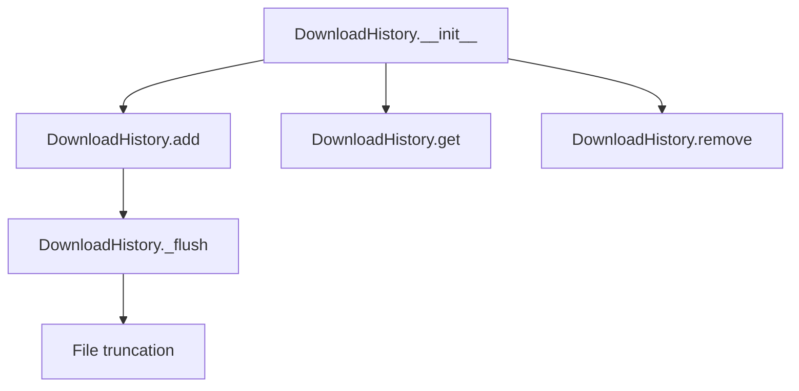

# `download_history.py`

## `onlinejudge_command.download_history.DownloadHistory` · *class*

## Summary:
Manages download history for competitive programming problems by storing metadata in a JSONL file.

## Description:
The DownloadHistory class maintains a persistent record of downloaded problems, storing information about when and where each problem was downloaded. It's designed to track problem URLs associated with specific directories to enable features like avoiding redundant downloads or tracking download progress.

This class serves as a distinct abstraction for managing download metadata separately from the core download logic, providing persistence across sessions and enabling intelligent download management.

## State:
- path: pathlib.Path - The file path where download history is stored. Defaults to 'download-history.jsonl' in the user cache directory.
- The class maintains no other internal state beyond the file path.

## Lifecycle:
- Creation: Instantiate with optional custom file path. Default uses user cache directory.
- Usage: The class provides methods to manage download history records in a JSONL file.
- Destruction: No explicit cleanup required; file is managed automatically.

## Method Map:


## Raises:
- None explicitly raised by __init__
- File I/O errors may occur during add/remove/get operations (propagated from underlying file operations)

## Example:
```python
# Create history tracker
history = DownloadHistory()

# Add a download entry
problem = Problem("https://example.com/problem")
history.add(problem, directory=pathlib.Path("/path/to/problems"))

# Retrieve history for a directory
urls = history.get(directory=pathlib.Path("/path/to/problems"))

# Remove history for a directory
history.remove(directory=pathlib.Path("/path/to/problems"))
```

### `onlinejudge_command.download_history.DownloadHistory.__init__` · *method*

## Summary:
Initializes a download history manager that tracks problem downloads in a JSONL file.

## Description:
Creates a DownloadHistory instance that manages download records in a JSONL file. This constructor sets up the file path where download history will be stored, defaulting to a cache directory for persistent storage across sessions.

## Args:
    path (pathlib.Path): File path for storing download history. Defaults to 'download-history.jsonl' in the user cache directory.

## Returns:
    None

## Raises:
    None explicitly raised by this method

## State Changes:
    Attributes READ: None
    Attributes WRITTEN: 
        - self.path: Stores the file path for download history storage

## Constraints:
    Preconditions:
        - The path parameter must be a valid pathlib.Path object
        - If a custom path is provided, the parent directories must be writable
    Postconditions:
        - The instance is initialized with a valid file path for history storage

## Side Effects:
    None

### `onlinejudge_command.download_history.DownloadHistory.add` · *method*

## Summary:
Appends a download history entry containing timestamp, directory, and problem URL to the history file.

## Description:
Adds a new entry to the download history file, recording when and where a problem was downloaded. This method creates the parent directories if they don't exist and writes a JSON-formatted line containing the current timestamp, the download directory path, and the problem's URL. The method ensures the history file remains manageable by calling the internal `_flush` method after writing.

## Args:
    problem (Problem): The problem object containing metadata about the downloaded problem.
    directory (pathlib.Path): The filesystem path where the problem was downloaded.

## Returns:
    None

## Raises:
    None explicitly raised, but may raise exceptions from:
    - File I/O operations when opening/writing to the history file
    - Permission errors when creating directories or writing files
    - JSON serialization errors (though unlikely with standard Problem objects)

## State Changes:
    Attributes READ:
        - self.path: Path to the history file
    Attributes WRITTEN:
        - None (modifies file content externally)

## Constraints:
    Preconditions:
        - The history file path (`self.path`) must be writable
        - The problem object must have a valid `get_url()` method that returns a string
        - The directory path must be valid and accessible

    Postconditions:
        - A new JSON line is appended to the history file
        - Parent directories of the history file are created if they don't exist
        - The history file size is managed via the internal `_flush` mechanism

## Side Effects:
    - Creates parent directories for the history file if they don't exist
    - Writes to a file at `self.path`
    - Performs file I/O operations
    - May truncate the history file if it exceeds 1MB via the `_flush` call
    - Logs information about the operation using the logger

### `onlinejudge_command.download_history.DownloadHistory.remove` · *method*

## Summary:
Removes all download history entries associated with a specific directory from the history file.

## Description:
This method clears entries from the download history file that were recorded for the specified directory. It's typically called when cleaning up downloaded files or when a user wants to remove history for a particular problem directory. The method operates atomically by reading the entire history file, filtering out matching entries, and writing back the remaining entries.

## Args:
    directory (pathlib.Path): The directory path whose history entries should be removed from the history file.

## Returns:
    None: This method does not return any value.

## Raises:
    None: This method does not explicitly raise any exceptions, though underlying file operations may raise IOError or similar exceptions.

## State Changes:
    Attributes READ: self.path
    Attributes WRITTEN: None

## Constraints:
    Preconditions: The history file path (self.path) must be accessible for reading and writing if the file exists.
    Postconditions: All entries in the history file with matching directory paths are removed, and the file is updated with the filtered content.

## Side Effects:
    I/O: Reads from and writes to the file system at self.path
    External service calls: None
    Mutations to objects outside self: None

### `onlinejudge_command.download_history.DownloadHistory._flush` · *method*

## Summary:
Truncates the history file by removing half of its oldest entries when the file exceeds 1MB in size.

## Description:
This method is called internally by the `add` method to manage the size of the download history file. When the history file grows larger than 1MB (1024 * 1024 bytes), it removes approximately half of the oldest entries to prevent excessive file growth. This helps maintain performance and disk space usage while preserving recent history entries.

The method is designed as a separate private method to encapsulate the file size management logic and avoid cluttering the `add` method with file manipulation code.

## Args:
    None

## Returns:
    None

## Raises:
    FileNotFoundError: If the history file does not exist when trying to check its size or read from it.
    PermissionError: If there are insufficient permissions to read from or write to the history file.
    OSError: If there are general OS-level errors during file operations.

## State Changes:
    Attributes READ: 
        - self.path: Path to the history file whose size is checked and modified
    
    Attributes WRITTEN:
        - None (the method modifies the file content but doesn't change instance attributes)

## Constraints:
    Preconditions:
        - The history file path (`self.path`) must be accessible
        - The file must be readable and writable when the flush operation occurs
        
    Postconditions:
        - If the file size is less than 1MB, no changes are made to the file
        - If the file size is 1MB or greater, the file is truncated to approximately half its previous size
        - The most recent entries are preserved, while older entries are removed

## Side Effects:
    - File I/O operations: Reads the entire history file and writes back a truncated version
    - External service calls: None
    - Mutations to objects outside self: Modifies the content of the history file at self.path

### `onlinejudge_command.download_history.DownloadHistory.get` · *method*

## Summary:
Retrieves a list of problem URLs from the download history that match the specified directory.

## Description:
Reads the download history file and returns all problem URLs associated with the given directory. This method is used to find previously downloaded problems in a specific directory to avoid redundant downloads.

## Args:
    directory (pathlib.Path): The directory path to filter history entries by.

## Returns:
    list[str]: A list of unique problem URLs found in the history for the specified directory. Returns an empty list if the history file doesn't exist or no matching entries are found.

## Raises:
    None explicitly raised, but may raise exceptions from file I/O operations or JSON parsing.

## State Changes:
    Attributes READ: self.path
    Attributes WRITTEN: None

## Constraints:
    Preconditions: The directory parameter must be a valid pathlib.Path object.
    Postconditions: The returned list contains unique URLs and is sorted in no particular order.

## Side Effects:
    I/O: Reads from the file at self.path
    External service calls: None
    Mutations to objects outside self: None
    Logging: Writes INFO and WARNING messages to the logger

