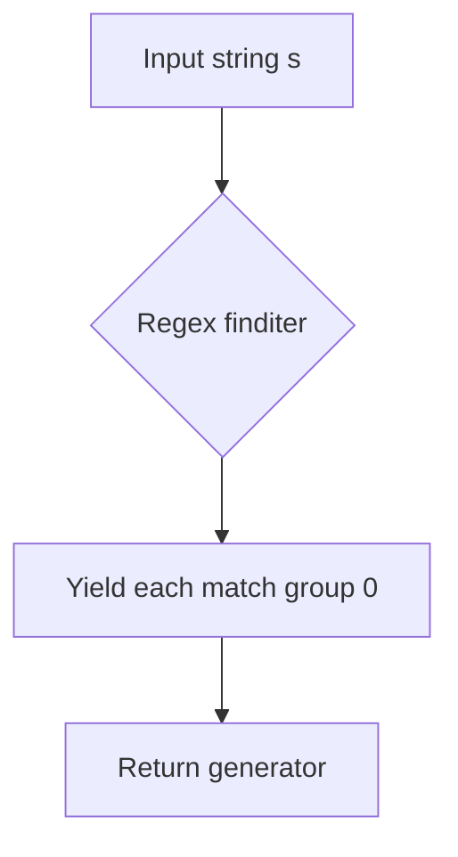
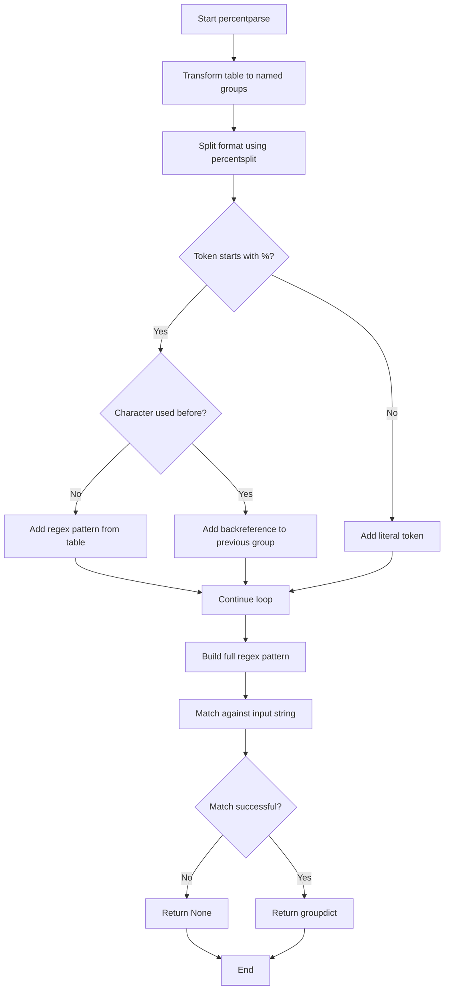
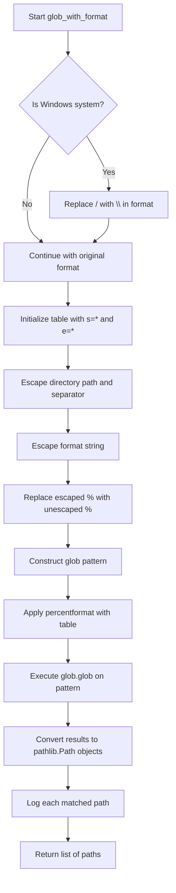
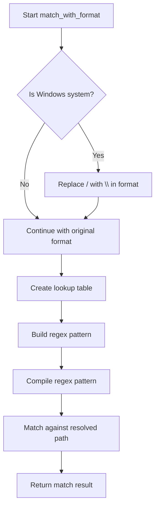

# `format_utils.py`

## `onlinejudge_command.format_utils.percentsplit` · *function*

## Summary:
Splits a string on percent signs while preserving percent signs and their following characters as separate elements.

## Description:
This function processes a string and yields individual components that either consist of single non-percent characters or complete percent-escaped sequences (percent followed by any character). It's designed to handle percent-encoded strings where percent signs act as delimiters but should be preserved in the output.

## Args:
    s (str): Input string to be processed, potentially containing percent signs as escape characters

## Returns:
    Generator[str, None, None]: A generator yielding strings where each yielded string is either:
        - A single character that is not a percent sign
        - A two-character sequence starting with a percent sign followed by any character

## Raises:
    None explicitly raised

## Constraints:
    Preconditions:
        - Input must be a string
    Postconditions:
        - All characters from the input string will be represented in the yielded output
        - The concatenation of all yielded strings will equal the original input string

## Side Effects:
    None

## Control Flow:


## Examples:
    >>> list(percentsplit("hello%world"))
    ['h', 'e', 'l', 'l', 'o', '%w', 'o', 'r', 'l', 'd']
    
    >>> list(percentsplit("test%%end"))
    ['t', 'e', 's', 't', '%%', 'e', 'n', 'd']
    
    >>> list(percentsplit("no_percents"))
    ['n', 'o', '_', 'p', 'e', 'r', 'c', 'e', 'n', 't', 's']
```

## `onlinejudge_command.format_utils.percentformat` · *function*

## Summary:
Formats a string by replacing percent-encoded placeholders with values from a lookup table.

## Description:
Processes a string containing percent-encoded placeholders (like %x) and substitutes them with corresponding values from a provided lookup table. This function is designed for simple string templating where placeholders are prefixed with percent signs.

## Args:
    s (str): Input string containing percent-encoded placeholders to be replaced
    table (Dict[str, str]): Lookup dictionary mapping placeholder characters to their replacement values

## Returns:
    str: A formatted string with all percent-encoded placeholders replaced by their corresponding values from the table

## Raises:
    AssertionError: When the table contains a '%' key that doesn't equal '%'

## Constraints:
    Preconditions:
        - Input string `s` must be a valid string
        - Table dictionary must contain keys for all placeholders used in the string
        - Table dictionary must have '%' key set to '%' if '%' is present as a key
    Postconditions:
        - The returned string will have all percent-encoded placeholders replaced
        - Literal percent signs in the input are preserved as single percent characters

## Side Effects:
    None

## Control Flow:
```mermaid
flowchart TD
    A[Start percentformat] --> B{Validate table['%'] constraint}
    B --> C{Set table['%'] = '%'}
    C --> D[Initialize result = '']
    D --> E[Iterate through percentsplit(s)]
    E --> F{Chunk starts with '%'}
    F -- Yes --> G[Lookup table[chunk[1]]]
    G --> H[Append lookup result to result]
    F -- No --> I[Append chunk to result]
    I --> J{More chunks?}
    J -- Yes --> E
    J -- No --> K[Return result]
```

## Examples:
    >>> percentformat("Hello %n, welcome to %c!", {'n': 'Alice', 'c': 'Online Judge'})
    'Hello Alice, welcome to Online Judge!'
    
    >>> percentformat("Value: %% of total", {'%': '%'})
    'Value: % of total'

## `onlinejudge_command.format_utils.percentparse` · *function*

## Summary:
Parses a string according to a format pattern with percent placeholders, extracting named groups using regex patterns from a lookup table.

## Description:
This function parses an input string against a format specification that contains percent placeholders (like %s, %d) by substituting them with regex patterns from a provided table. It supports both forward references and backreferences to previously defined capture groups, making it suitable for parsing structured text with repeated patterns.

## Args:
    s (str): The input string to parse
    format (str): Format string containing percent placeholders (e.g., "%s %d") that will be replaced with regex patterns from the table
    table (Dict[str, str]): Dictionary mapping placeholder characters to their corresponding regex patterns

## Returns:
    Optional[Dict[str, str]]: A dictionary mapping placeholder names to their matched values, or None if the input string doesn't match the format pattern

## Raises:
    None explicitly raised

## Constraints:
    Preconditions:
        - All placeholder characters in the format string must exist as keys in the table dictionary
        - The input string must match the constructed regex pattern for a successful parse
    Postconditions:
        - If successful, the returned dictionary will contain all unique placeholder characters from the format string as keys
        - If unsuccessful, None is returned

## Side Effects:
    None

## Control Flow:


## Examples:
    >>> table = {'s': '[a-zA-Z]+', 'd': '\\d+'}
    >>> percentparse('hello 123', '%s %d', table)
    {'s': 'hello', 'd': '123'}
    
    >>> table = {'s': '[a-zA-Z]+'}
    >>> percentparse('hello world', '%s %s', table)
    {'s': 'hello'}
    
    >>> table = {'s': '[a-zA-Z]+'}
    >>> percentparse('hello hello', '%s %s', table)
    {'s': 'hello'}
```

## `onlinejudge_command.format_utils.glob_with_format` · *function*

## Summary:
Finds files in a directory that match a format pattern with special wildcard placeholders.

## Description:
Scans a specified directory for files matching a format string that contains special placeholders ('s' and 'e') which are converted to glob wildcards. This function is used to locate test cases or files with specific naming patterns in problem directories.

## Args:
    directory (pathlib.Path): The directory path to search for matching files
    format (str): Format string containing placeholders that will be converted to glob patterns

## Returns:
    List[pathlib.Path]: A list of file paths that match the constructed glob pattern

## Raises:
    None explicitly raised in this function

## Constraints:
    Preconditions:
        - Directory must exist and be readable
        - Format string should not contain invalid glob patterns
    Postconditions:
        - Returns a list of pathlib.Path objects representing matching files
        - All returned paths are absolute paths

## Side Effects:
    - Writes debug log messages to the module's logger
    - Performs filesystem operations to find matching files

## Control Flow:


## Examples:
    >>> glob_with_format(pathlib.Path('/problems/p1'), 'input_%s.txt')
    [Path('/problems/p1/input_1.txt'), Path('/problems/p1/input_2.txt')]
    
    >>> glob_with_format(pathlib.Path('/problems/p2'), 'output_%e')
    [Path('/problems/p2/output_1'), Path('/problems/p2/output_2')]
```

## `onlinejudge_command.format_utils.match_with_format` · *function*

## Summary:
Matches a file path against a format pattern to validate naming conventions for competitive programming problems.

## Description:
Validates whether a given file path conforms to a specified naming pattern, commonly used in competitive programming platforms to organize input/output test cases. The function supports platform-specific path separators and recognizes special placeholders in the format string for problem names and file extensions.

## Args:
    directory (pathlib.Path): The base directory path to match against
    format (str): Format string containing placeholders for filename patterns, where 's' represents the problem name and 'e' represents the file extension ('in' or 'out')
    path (pathlib.Path): The file path to validate against the format pattern

## Returns:
    Optional[Match[str]]: A regex match object if the path matches the format pattern, or None if it doesn't match

## Raises:
    None explicitly raised

## Constraints:
    Preconditions:
        - All arguments must be properly initialized pathlib.Path objects or strings
        - The format string should contain valid placeholders ('s' for name, 'e' for extension)
        - Directory and path should represent valid filesystem locations
    Postconditions:
        - Returns a regex match object with named groups 'name' and 'ext' when successful
        - The match object will contain captured groups for problem name and extension

## Side Effects:
    None

## Control Flow:


## Examples:
    >>> import pathlib
    >>> directory = pathlib.Path('/problems/sample')
    >>> format_str = '%s.%e'
    >>> path = pathlib.Path('/problems/sample/problem1.in')
    >>> result = match_with_format(directory, format_str, path)
    >>> print(result.group('name'))  # Output: 'problem1'
    >>> print(result.group('ext'))   # Output: 'in'

## `onlinejudge_command.format_utils.path_from_format` · *function*

## Summary:
Constructs a file path by formatting a template string with name and extension placeholders and joining it with a directory path.

## Description:
Generates a file path by applying string formatting to a template using name and extension values, then combines the result with a base directory path. This function enables flexible path construction using format templates that support '%s' (name) and '%e' (extension) placeholders.

## Args:
    directory (pathlib.Path): Base directory path where the resulting file path will be located
    format (str): Format template string containing '%s' for name and '%e' for extension placeholders
    name (str): Value to substitute for '%s' placeholder in the format string
    ext (str): Value to substitute for '%e' placeholder in the format string

## Returns:
    pathlib.Path: A new path object representing the joined directory and formatted filename

## Raises:
    AssertionError: When the percentformat function encounters invalid table configuration (though this is internal to percentformat)

## Constraints:
    Preconditions:
        - directory must be a valid pathlib.Path object
        - format must be a valid string containing only '%s' and '%e' placeholders
        - name and ext must be strings
    Postconditions:
        - The returned path will be a valid pathlib.Path combining directory and formatted filename

## Side Effects:
    None

## Control Flow:
```mermaid
flowchart TD
    A[Start path_from_format] --> B[Create table with 's'→name, 'e'→ext]
    B --> C[Call percentformat(format, table)]
    C --> D[Join directory with formatted result]
    D --> E[Return pathlib.Path result]
```

## Examples:
    >>> from pathlib import Path
    >>> directory = Path('/home/user/problems')
    >>> path = path_from_format(directory, 'problem_%s.%e', 'A', 'cpp')
    >>> print(path)
    /home/user/problems/problem_A.cpp
    
    >>> directory = Path('/tmp')
    >>> path = path_from_format(directory, 'output_%s_%e', 'test', 'txt')
    >>> print(path)
    /tmp/output_test_txt
```

## `onlinejudge_command.format_utils.is_backup_or_hidden_file` · *function*

## Summary:
Determines whether a file path corresponds to a backup, hidden, or temporary file that should be excluded from processing.

## Description:
This function identifies common file patterns that represent backup files, vim swap files, or hidden files that are typically not meant to be processed in automated workflows. It's used to filter out system-generated or temporary files during file operations.

The function is extracted into its own utility to provide a centralized location for file filtering logic, making it easier to maintain and modify file exclusion criteria in one place rather than scattering similar checks throughout the codebase.

## Args:
    path (pathlib.Path): The file path to check for backup or hidden file status

## Returns:
    bool: True if the file is a backup file (ends with '~'), vim swap file (starts and ends with '#'), or hidden file (starts with '.'), False otherwise

## Raises:
    None

## Constraints:
    Preconditions:
        - The input path must be a valid pathlib.Path object
        - The path should represent an actual file or directory in the filesystem
    
    Postconditions:
        - Always returns a boolean value
        - The function performs no side effects beyond accessing the path's name attribute

## Side Effects:
    None

## Control Flow:
```mermaid
flowchart TD
    A[Input path] --> B{basename.endswith('~')?}
    B -- Yes --> C[Return True]
    B -- No --> D{basename.startswith('#') AND basename.endswith('#')?}
    D -- Yes --> C
    D -- No --> E{basename.startswith('.')?}
    E -- Yes --> C
    E -- No --> F[Return False]
```

## Examples:
    >>> import pathlib
    >>> is_backup_or_hidden_file(pathlib.Path("test.txt"))
    False
    >>> is_backup_or_hidden_file(pathlib.Path("test.txt~"))
    True
    >>> is_backup_or_hidden_file(pathlib.Path("#test.txt#"))
    True
    >>> is_backup_or_hidden_file(pathlib.Path(".hidden"))
    True
```

## `onlinejudge_command.format_utils.drop_backup_or_hidden_files` · *function*

## Summary:
Filters out backup files, hidden files, and temporary files from a list of file paths.

## Description:
Removes files that are typically considered backup files (ending with '~'), vim swap files (starting and ending with '#'), or hidden files (starting with '.') from the input list. When such files are encountered, a warning message is logged to indicate they are being ignored.

This function is extracted into its own utility to centralize file filtering logic, making it easier to maintain and modify exclusion criteria in one place rather than scattering similar checks throughout the codebase. It's commonly used in file processing pipelines where system-generated or temporary files should be excluded from automated operations.

## Args:
    paths (List[pathlib.Path]): A list of file paths to filter

## Returns:
    List[pathlib.Path]: A new list containing only the paths that are not backup files, hidden files, or temporary files

## Raises:
    None

## Constraints:
    Preconditions:
        - Input paths must be valid pathlib.Path objects
        - All paths should be absolute or relative paths pointing to existing files/directories
        
    Postconditions:
        - The returned list contains only non-backup, non-hidden, non-temporary files
        - Original input list is not modified (immutable operation)
        - Warning messages are logged via the module's logger when backup/hidden files are encountered

## Side Effects:
    - Writes warning messages to the module's logger when backup or hidden files are encountered
    - No modifications to file system or external state

## Control Flow:
```mermaid
flowchart TD
    A[Input paths list] --> B{is_backup_or_hidden_file(path)?}
    B -- Yes --> C[Log warning: ignore a backup file: path]
    C --> D[Skip path]
    B -- No --> E[Include path in result]
    D --> F[Result list]
    E --> F
    F --> G[Return filtered result]
```

## Examples:
    >>> import pathlib
    >>> paths = [pathlib.Path("main.py"), pathlib.Path("backup.py~"), pathlib.Path(".hidden")]
    >>> drop_backup_or_hidden_files(paths)
    [PosixPath('main.py')]
    >>> # Warning is logged for backup.py~ and .hidden files

## `onlinejudge_command.format_utils.construct_relationship_of_files` · *function*

## Summary:
Constructs a hierarchical relationship of test case files organized by problem name and file extension.

## Description:
Processes a list of file paths to group input/output test cases by their problem names according to a specified naming convention. This function validates that each test case has both input (.in) and output (.out) files, ensuring complete test suites for competitive programming problems.

## Args:
    paths (List[pathlib.Path]): List of file paths to process and organize
    directory (pathlib.Path): Base directory path used for matching file formats
    format (str): Format string pattern defining the naming convention (e.g., '%s.%e' for problem.in/problem.out)

## Returns:
    Dict[str, Dict[str, pathlib.Path]]: Nested dictionary mapping problem names to file extensions and their respective file paths. Structure is {problem_name: {extension: file_path}}.

## Raises:
    SystemExit: Exits with code 1 when encountering unrecognizable files, dangling output files, or empty test cases.

## Constraints:
    Preconditions:
        - All paths in the input list must be valid file paths
        - Directory must be a valid existing directory path
        - Format string must contain valid placeholders ('s' for name, 'e' for extension)
        - Files must follow the specified naming convention
    Postconditions:
        - All returned files are validated against the format pattern
        - Each problem name has both 'in' and 'out' extensions present
        - The returned dictionary contains at least one test case

## Side Effects:
    - Writes error messages to stderr via logger.error() when validation fails
    - Writes informational messages to stdout via logger.info() when processing completes successfully
    - Terminates program execution with sys.exit(1) on validation failures

## Control Flow:
```mermaid
flowchart TD
    A[Start construct_relationship_of_files] --> B[Initialize empty tests dict]
    B --> C[Process each path in paths]
    C --> D{match_with_format succeeds?}
    D -- No --> E[Log error and exit]
    D -- Yes --> F[Extract name and extension from match]
    F --> G[Assert extension not already present]
    G --> H[Store path in tests[name][ext]]
    H --> I[Loop to next path]
    I --> J[Check for dangling output files]
    J --> K{Has 'in' extension?}
    K -- No --> L[Log error and exit]
    K -- Yes --> M[Continue checking]
    M --> N{Any test cases found?}
    N -- No --> O[Log error and exit]
    N -- Yes --> P[Log success message]
    P --> Q[Return tests dictionary]
```

## Examples:
    >>> import pathlib
    >>> paths = [pathlib.Path('problem1.in'), pathlib.Path('problem1.out')]
    >>> directory = pathlib.Path('.')
    >>> format_str = '%s.%e'
    >>> result = construct_relationship_of_files(paths, directory, format_str)
    >>> print(result)
    {'problem1': {'in': PosixPath('problem1.in'), 'out': PosixPath('problem1.out')}}

