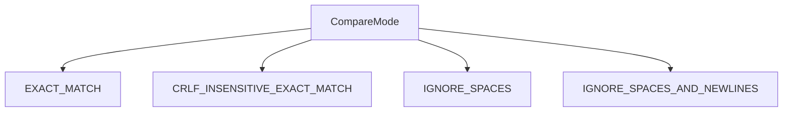

# `output_comparators.py`

## `onlinejudge_command.output_comparators.OutputComparator` · *class*

## Summary:
Abstract base class defining the interface for comparing actual and expected output in competitive programming problem testing.

## Description:
The OutputComparator class serves as a standardized interface for implementing various output comparison strategies used in competitive programming platforms. It defines a contract that concrete implementations must follow to determine whether the actual output from a solution matches the expected output. This abstraction allows different comparison methods (exact match, floating-point tolerance, token-based comparison, etc.) to be used interchangeably.

This class is typically instantiated by factory methods or configuration-driven instantiation patterns that select appropriate concrete implementations based on problem requirements or user preferences.

## State:
- No instance attributes are defined in this abstract base class
- The class relies entirely on concrete implementations to provide functionality
- All state management is delegated to subclasses

## Lifecycle:
- Creation: Instances are created through concrete subclass implementations, not directly from this abstract class
- Usage: The __call__ method is invoked with actual and expected output bytes to perform comparison
- Destruction: No special cleanup required; standard Python garbage collection applies

## Method Map:
```mermaid
graph TD
    A[OutputComparator] --> B[__call__(actual, expected)]
    B --> C{Concrete Implementation}
    C --> D[ExactMatchComparator]
    C --> E[FloatComparator]
    C --> F[TokenComparator]
```

## Raises:
- NotImplementedError: When the abstract __call__ method is invoked directly on the base class (not recommended)

## Example:
```python
# Concrete implementation example
class ExactMatchComparator(OutputComparator):
    def __call__(self, actual: bytes, expected: bytes) -> bool:
        return actual == expected

# Usage
comparator = ExactMatchComparator()
result = comparator(b"hello", b"hello")  # Returns True
```

### `onlinejudge_command.output_comparators.OutputComparator.__call__` · *method*

## Summary:
Compares actual output bytes with expected output bytes and returns whether they match.

## Description:
This abstract method defines the interface for comparing output in online judge systems. Concrete implementations provide specific comparison logic such as exact matching, floating-point tolerance, or whitespace normalization. The method is invoked during test case validation to determine if a submission's output matches the expected result.

## Args:
    actual (bytes): The actual output produced by a program execution
    expected (bytes): The expected output that the program should produce

## Returns:
    bool: True if the actual output matches the expected output according to the implementation's logic, False otherwise

## Raises:
    NotImplementedError: This abstract method must be implemented by subclasses

## State Changes:
    Attributes READ: None
    Attributes WRITTEN: None

## Constraints:
    Preconditions: Both arguments must be bytes objects
    Postconditions: Return value is always a boolean indicating match status

## Side Effects:
    None

## `onlinejudge_command.output_comparators.ExactComparator` · *class*

## Summary:
ExactComparator is a concrete implementation of OutputComparator that performs exact byte-by-byte comparison between actual and expected output.

## Description:
The ExactComparator class implements a strict equality comparison between actual and expected output bytes, providing an exact match verification strategy. As a concrete implementation of the OutputComparator abstract base class, it enables competitive programming platforms to perform precise output validation where formatting and whitespace must match exactly.

This comparator is typically selected when problem specifications require exact output matching without tolerance for differences in formatting, spacing, or floating-point representations. It follows the factory pattern where selection of appropriate comparison strategies is handled by higher-level systems based on problem requirements.

The class adheres to the OutputComparator interface, allowing it to be used interchangeably with other comparison implementations such as FloatComparator or TokenComparator within the same testing framework.

## State:
- No instance attributes: The class maintains no internal state beyond what's inherited from OutputComparator
- The comparison operation is stateless and purely functional
- All comparison decisions are made based on the input parameters provided to the __call__ method

## Lifecycle:
- Creation: Instantiated through direct construction or factory methods that select this comparator type
- Usage: Called with two bytes arguments (actual and expected) to perform comparison
- Destruction: Standard Python garbage collection handles cleanup

## Method Map:
```mermaid
graph TD
    A[ExactComparator] --> B[__call__(actual, expected)]
    B --> C{Byte Comparison}
    C --> D[Return True if equal]
    C --> E[Return False if different]
```

## Raises:
- No exceptions are explicitly raised by this implementation
- The comparison operation itself will not raise exceptions, though the underlying byte comparison may fail if inputs are not bytes

## Example:
```python
# Create comparator instance
comparator = ExactComparator()

# Compare exact matches
result1 = comparator(b"hello world", b"hello world")  # Returns True

# Compare non-matches
result2 = comparator(b"hello", b"world")  # Returns False

# Compare with whitespace differences
result3 = comparator(b"hello ", b"hello")  # Returns False (different bytes)
```

### `onlinejudge_command.output_comparators.ExactComparator.__call__` · *method*

## Summary:
Performs exact byte-by-byte comparison between actual and expected output sequences.

## Description:
Compares two byte sequences for exact equality, returning True if they are identical and False otherwise. This method is the core implementation of the ExactComparator class, providing strict matching behavior for competitive programming output validation.

The method is typically invoked during automated testing of competitive programming solutions, where the output from a submitted solution is compared against the expected output to determine correctness. This exact matching approach is suitable for problems where whitespace, formatting, and character encoding must match precisely.

## Args:
    actual (bytes): The actual output produced by a solution, encoded as bytes
    expected (bytes): The expected output that constitutes a correct solution, encoded as bytes

## Returns:
    bool: True if the actual and expected byte sequences are identical, False otherwise

## Raises:
    None: This method does not raise any exceptions

## State Changes:
    Attributes READ: None
    Attributes WRITTEN: None

## Constraints:
    Preconditions:
    - Both `actual` and `expected` parameters must be of type `bytes`
    - Neither parameter should be None
    - Parameters should represent valid byte sequences encoding the program output
    
    Postconditions:
    - The method always returns a boolean value
    - No modifications are made to the object's state
    - The comparison is deterministic and side-effect free

## Side Effects:
    None: This method performs no I/O operations, external service calls, or mutations to objects outside the method scope

## `onlinejudge_command.output_comparators.FloatingPointNumberComparator` · *class*

## Summary:
Compares actual and expected output by treating them as floating-point numbers with configurable relative and absolute tolerance.

## Description:
The FloatingPointNumberComparator provides a mechanism for comparing output in competitive programming problems where small floating-point precision differences should be tolerated. It extends the OutputComparator abstract base class and implements a comparison strategy that converts byte strings to floating-point numbers before comparing them using math.isclose() with configurable tolerances.

This comparator is particularly useful for problems where solutions might produce slightly different floating-point results due to computational precision, rounding errors, or different calculation orders, but still represent the same mathematical answer.

## State:
- rel_tol: float, relative tolerance for floating-point comparison (default: not applicable, must be provided)
- abs_tol: float, absolute tolerance for floating-point comparison (default: not applicable, must be provided)
- Both tolerances must be in the range [0, 1], though values greater than 1 are accepted with a warning

## Lifecycle:
- Creation: Instantiate with keyword arguments rel_tol and abs_tol (both required)
- Usage: Call the instance with actual and expected output as bytes to perform comparison
- Destruction: Standard Python garbage collection applies

## Method Map:
```mermaid
graph TD
    A[FloatingPointNumberComparator] --> B[__call__(actual, expected)]
    B --> C{Convert to float}
    C --> D{Both valid floats?}
    D -->|Yes| E[math.isclose(x, y, rel_tol, abs_tol)]
    D -->|No| F[actual == expected]
```

## Raises:
- None explicitly raised by __init__
- Warning logged via logger.warning when max(rel_tol, abs_tol) > 1

## Example:
```python
# Create comparator with 1e-9 relative tolerance and 1e-12 absolute tolerance
comparator = FloatingPointNumberComparator(rel_tol=1e-9, abs_tol=1e-12)

# Compare floating-point outputs
result1 = comparator(b"3.14159", b"3.14159")  # Returns True
result2 = comparator(b"1.0000000000000001", b"1.0")  # Returns True (within tolerance)
result3 = comparator(b"1.0", b"2.0")  # Returns False
result4 = comparator(b"hello", b"world")  # Returns False (string comparison)
```

### `onlinejudge_command.output_comparators.FloatingPointNumberComparator.__init__` · *method*

## Summary:
Initializes a FloatingPointNumberComparator with relative and absolute tolerance parameters for floating-point number comparison.

## Description:
Configures a FloatingPointNumberComparator instance with specified relative and absolute tolerance values for floating-point comparisons. This constructor validates that tolerance values are reasonable and logs warnings for excessively large tolerances (when max(relative_tolerance, absolute_tolerance) > 1). The comparator is designed for competitive programming scenarios where small floating-point precision differences should be tolerated.

## Args:
    rel_tol (float): Relative tolerance for floating-point comparison, must be non-negative
    abs_tol (float): Absolute tolerance for floating-point comparison, must be non-negative

## Returns:
    None: This method initializes instance attributes and performs validation

## Raises:
    None: No exceptions are explicitly raised by this method

## State Changes:
    Attributes READ: None
    Attributes WRITTEN: self.rel_tol, self.abs_tol

## Constraints:
    Preconditions:
    - Both rel_tol and abs_tol must be non-negative floating-point numbers
    - Parameters are keyword-only (cannot be passed positionally)
    - Values should be in the range [0, 1] for meaningful comparison, though larger values are accepted
    
    Postconditions:
    - Instance attributes self.rel_tol and self.abs_tol are set to the provided values
    - If max(rel_tol, abs_tol) > 1, a warning is logged via logger.warning but execution continues

## Side Effects:
    I/O: Logs a warning message via logger.warning when tolerance values exceed 1

### `onlinejudge_command.output_comparators.FloatingPointNumberComparator.__call__` · *method*

## Summary:
Compares actual and expected output bytes as floating-point numbers with configurable tolerance, falling back to exact string comparison when conversion fails.

## Description:
This method implements a floating-point number comparison strategy that allows for small numerical differences due to precision limitations. It attempts to convert both actual and expected byte sequences to floating-point numbers, and if successful, uses `math.isclose()` for comparison with relative and absolute tolerance settings. When either conversion fails, it performs exact byte string comparison as a fallback mechanism.

The method is part of the `FloatingPointNumberComparator` class, which inherits from `OutputComparator` and provides a standardized interface for competitive programming output validation. This approach is commonly needed in programming competitions where floating-point results may have minor precision differences due to different computational paths or hardware.

## Args:
    actual (bytes): The actual output bytes from program execution
    expected (bytes): The expected output bytes from the test case

## Returns:
    bool: True if the outputs are considered equivalent according to the comparison strategy, False otherwise

## Raises:
    None explicitly raised - handles conversion errors internally

## State Changes:
    Attributes READ: self.rel_tol, self.abs_tol
    Attributes WRITTEN: None

## Constraints:
    Preconditions:
    - Both `actual` and `expected` parameters must be bytes objects
    - `self.rel_tol` and `self.abs_tol` must be set during object initialization
    - Tolerance values should be reasonable (warning logged if max exceeds 1)
    
    Postconditions:
    - Returns boolean indicating whether outputs are equivalent
    - No modifications to the object's state occur

## Side Effects:
    None - No I/O operations, external service calls, or mutations to external objects

## `onlinejudge_command.output_comparators.SplitComparator` · *class*

## Summary:
A word-based output comparator that splits input into tokens and compares them using an embedded word comparator.

## Description:
The SplitComparator class provides a mechanism to compare actual and expected output by splitting both byte sequences into words (tokens) and comparing corresponding pairs. This comparator is useful when the exact formatting of output doesn't matter, but the sequence and content of tokens do. It delegates the comparison of individual words to another OutputComparator instance.

This class is typically instantiated by factory methods or configuration-driven instantiation patterns that select appropriate concrete implementations based on problem requirements. It serves as a composition wrapper around other comparators to enable word-level comparison.

## State:
- word_comparator: OutputComparator instance used to compare individual words
  - Type: OutputComparator
  - Valid range: Any concrete implementation of OutputComparator
  - Invariant: Must be set during initialization and remain immutable

## Lifecycle:
- Creation: Instantiate with a word_comparator parameter (required)
- Usage: Call the instance with actual and expected bytes to perform comparison
- Destruction: Standard Python garbage collection applies

## Method Map:
```mermaid
graph TD
    A[SplitComparator.__call__] --> B[actual.split()]
    A --> C[expected.split()]
    A --> D[len(actual_words) != len(expected_words)?]
    D -->|True| E[return False]
    D -->|False| F[for x,y in zip(actual_words, expected_words)]
    F --> G[word_comparator(x,y)?]
    G -->|False| H[return False]
    G -->|True| I[return True]
```

## Raises:
- None explicitly raised by SplitComparator itself
- Exceptions may be raised by the underlying word_comparator during word comparison

## Example:
```python
# Create a word comparator that does exact matching
exact_match = ExactMatchComparator()

# Create a split comparator using the exact match comparator
split_comparator = SplitComparator(exact_match)

# Compare outputs
result = split_comparator(b"hello world", b"hello world")  # Returns True
result = split_comparator(b"hello   world", b"hello world")  # Returns True (ignores extra whitespace)
result = split_comparator(b"hello world", b"hello universe")  # Returns False
```

### `onlinejudge_command.output_comparators.SplitComparator.__init__` · *method*

## Summary:
Initializes a SplitComparator with a word-level comparator for comparing split output tokens.

## Description:
Configures the SplitComparator instance with a word-level comparator that will be used to compare individual tokens (words) from actual and expected outputs. This comparator is applied to each pair of corresponding words after splitting both outputs by whitespace.

## Args:
    word_comparator (OutputComparator): A callable object that implements the OutputComparator interface for comparing individual word tokens. This comparator determines how word-by-word comparison should be performed (e.g., exact match, floating-point tolerance, etc.).

## Returns:
    None: This method initializes the instance and does not return a value.

## Raises:
    None: This method does not raise any exceptions under normal circumstances.

## State Changes:
    Attributes READ: None
    Attributes WRITTEN: self.word_comparator

## Constraints:
    Preconditions: The word_comparator parameter must be a callable that implements the OutputComparator interface.
    Postconditions: After initialization, self.word_comparator will reference the provided comparator object.

## Side Effects:
    None: This method performs no I/O operations or external service calls. It only stores a reference to the provided comparator.

### `onlinejudge_command.output_comparators.SplitComparator.__call__` · *method*

## Summary:
Compares two byte strings word-by-word using a configured word comparator, returning True if all corresponding words match.

## Description:
This method implements the core comparison logic for the SplitComparator class. It splits both actual and expected output byte strings into tokens (words) using whitespace as delimiters, then compares each corresponding pair of words using the configured word_comparator. This approach allows for flexible comparison strategies where individual words can be compared with different tolerances or rules while maintaining overall structural alignment.

The method is designed to be called as part of the output comparison pipeline in competitive programming environments where exact character-by-character matching is too strict, but word-level comparison provides meaningful validation.

## Args:
    actual (bytes): The actual output produced by a solution, encoded as bytes
    expected (bytes): The expected output that a solution should produce, encoded as bytes

## Returns:
    bool: True if both byte strings contain the same number of words and all corresponding word pairs match according to the word_comparator, False otherwise

## Raises:
    None explicitly raised by this method

## State Changes:
    Attributes READ: self.word_comparator
    Attributes WRITTEN: None

## Constraints:
    Preconditions:
    - Both actual and expected parameters must be valid bytes objects
    - The word_comparator attribute must be callable and accept two bytes arguments
    - The word_comparator should return a boolean value when called
    
    Postconditions:
    - The method returns a boolean indicating whether the word-by-word comparison succeeded
    - No modifications are made to the object's state

## Side Effects:
    None - This method performs no I/O operations or external service calls
    The word_comparator may have side effects, but those are outside this method's scope

## `onlinejudge_command.output_comparators.SplitLinesComparator` · *class*

## Summary:
A line-based output comparator that splits input into lines and compares each line using a provided line comparator.

## Description:
The SplitLinesComparator is a composite output comparator that implements line-by-line comparison logic. It takes an existing OutputComparator instance responsible for comparing individual lines and applies it to each corresponding pair of lines from actual and expected outputs. This allows for flexible line-by-line comparison strategies while maintaining the ability to reuse existing comparison logic.

This class is typically instantiated by test framework components or configuration systems that need to apply line-based comparison to outputs. It serves as a bridge between line-level and whole-output comparison strategies.

## State:
- line_comparator: OutputComparator instance used to compare individual lines
  - Type: OutputComparator
  - Valid range: Any concrete implementation of OutputComparator
  - Invariant: Must be a valid OutputComparator instance that can be called with bytes arguments

## Lifecycle:
- Creation: Instantiate with a valid OutputComparator instance for line comparison
- Usage: Call the instance with actual and expected output bytes to perform line-by-line comparison
- Destruction: Standard Python garbage collection handles cleanup

## Method Map:
```mermaid
graph TD
    A[SplitLinesComparator.__call__] --> B[actual.rstrip(b'\\n').split(b'\\n')]
    A --> C[expected.rstrip(b'\\n').split(b'\\n')]
    B --> D[zip(actual_lines, expected_lines)]
    C --> D
    D --> E{Length mismatch}
    E -->|True| F[return False]
    E -->|False| G[self.line_comparator(x, y)]
    G --> H{Line comparison result}
    H -->|False| F
    H -->|True| I[continue loop]
    I --> J{End of lines}
    J -->|False| G
    J -->|True| K[return True]
```

## Raises:
- None explicitly raised by __init__
- May raise exceptions from the underlying line_comparator if it's poorly implemented

## Example:
```python
# Create a line comparator (e.g., exact match)
line_comparator = ExactMatchComparator()

# Create split lines comparator
split_comparator = SplitLinesComparator(line_comparator)

# Compare multi-line outputs
actual_output = b"line1\nline2\nline3"
expected_output = b"line1\nline2\nline3"
result = split_comparator(actual_output, expected_output)  # Returns True
```

### `onlinejudge_command.output_comparators.SplitLinesComparator.__init__` · *method*

## Summary:
Initializes a SplitLinesComparator with a line-based comparator for comparing individual lines.

## Description:
Constructs a SplitLinesComparator instance that will use the provided line comparator to perform line-by-line comparisons of actual and expected outputs. This constructor establishes the dependency relationship between the SplitLinesComparator and its underlying line comparison strategy.

The method is called during object instantiation and sets up the internal state required for line-by-line comparison operations. It's designed to be called by factory methods or configuration systems that need to create SplitLinesComparator instances with specific line comparison behaviors.

## Args:
    line_comparator (OutputComparator): An instance of a concrete OutputComparator subclass that will be used to compare individual lines. This parameter is required and must be a valid implementation of the OutputComparator interface.

## Returns:
    None: This method initializes the object's state and does not return a value.

## Raises:
    None: This method does not explicitly raise exceptions, though invalid line_comparator instances may cause runtime errors during comparison operations.

## State Changes:
    Attributes READ: None
    Attributes WRITTEN: 
        - self.line_comparator: Stores the provided OutputComparator instance for later use in line-by-line comparisons

## Constraints:
    Preconditions:
        - The line_comparator parameter must be a valid instance of a concrete OutputComparator subclass
        - The line_comparator must be callable with two bytes arguments (actual and expected lines)
    
    Postconditions:
        - The self.line_comparator attribute is set to the provided line_comparator instance
        - The SplitLinesComparator instance is ready for use in line-by-line comparison operations

## Side Effects:
    None: This method performs no I/O operations or external service calls. It only stores a reference to the provided comparator object.

### `onlinejudge_command.output_comparators.SplitLinesComparator.__call__` · *method*

## Summary:
Compares actual and expected output byte sequences line by line using a configured line comparator.

## Description:
This method implements the core comparison logic for the SplitLinesComparator class. It splits both actual and expected output into lines, verifies they have the same number of lines, and then applies the configured line comparator to each corresponding pair of lines. The method returns False immediately if line counts differ, otherwise evaluates all line pairs sequentially.

This method is typically invoked during competitive programming problem testing when comparing a program's actual output against expected output, particularly when the output format requires line-by-line comparison. Separating this logic into its own method allows for reusable line-by-line comparison behavior while delegating the actual line comparison to the configurable line_comparator.

## Args:
    actual (bytes): The actual output produced by a solution, encoded as bytes
    expected (bytes): The expected output to compare against, encoded as bytes

## Returns:
    bool: True if both outputs have the same number of lines and all corresponding line pairs match according to the configured line_comparator; False otherwise

## Raises:
    TypeError: If either actual or expected is not a bytes object
    Exception: If the line_comparator raises an exception during line comparison

## State Changes:
    Attributes READ: self.line_comparator
    Attributes WRITTEN: None

## Constraints:
    Preconditions:
    - Both actual and expected parameters must be bytes objects
    - The line_comparator attribute must be callable and accept two bytes arguments
    - Line endings (b'\n') are stripped from both inputs before splitting
    
    Postconditions:
    - The method returns a boolean value indicating line-by-line equality
    - No modifications are made to the object's state

## Side Effects:
    None - This method is pure and has no side effects beyond the comparison operation

## `onlinejudge_command.output_comparators.CRLFInsensitiveComparator` · *class*

## Summary:
A decorator comparator that normalizes CRLF line endings before delegating to another comparator.

## Description:
The CRLFInsensitiveComparator is a wrapper class that preprocesses output bytes to normalize CRLF line endings (\r\n) to LF line endings (\n) before passing them to another OutputComparator instance. This enables comparison operations to be insensitive to line ending differences commonly encountered in competitive programming environments.

The class takes an existing OutputComparator instance in its constructor and delegates comparison operations to it after normalizing the input data. This approach allows existing comparison logic to be reused while handling platform-specific line ending variations.

## State:
- file_comparator: OutputComparator instance
  - Type: OutputComparator
  - Valid range: Any concrete implementation of OutputComparator
  - Invariant: Must be a valid OutputComparator instance that implements the __call__ method

## Lifecycle:
- Creation: Instantiate with a valid OutputComparator instance
- Usage: Call the instance with actual and expected bytes (via __call__ method)
- Destruction: Standard Python garbage collection applies

## Method Map:


## Raises:
- TypeError: If file_comparator parameter is not an instance of OutputComparator
- Any exceptions raised by the underlying file_comparator.__call__ method

## Example:
```python
# Create a basic exact match comparator
exact_match = ExactMatchComparator()

# Wrap it with CRLF insensitivity
crlf_insensitive = CRLFInsensitiveComparator(exact_match)

# Compare outputs with different line endings
result1 = crlf_insensitive(b"hello\r\nworld", b"hello\nworld")  # Returns True
result2 = crlf_insensitive(b"test\r\n", b"test\n")              # Returns True
```

### `onlinejudge_command.output_comparators.CRLFInsensitiveComparator.__init__` · *method*

## Summary:
Initializes a CRLFInsensitiveComparator with a delegate comparator for handling line ending normalization.

## Description:
Constructs a CRLFInsensitiveComparator that wraps another OutputComparator instance. This comparator normalizes Windows-style CRLF line endings to Unix-style LF line endings before delegating the actual comparison to the wrapped comparator. This ensures that output comparisons are not affected by different line ending conventions across platforms.

The initialization occurs during the setup phase of output comparison strategies, typically when configuring test case validators for competitive programming problems that may have varying line ending formats.

## Args:
    file_comparator (OutputComparator): Another OutputComparator instance that will perform the actual comparison after line ending normalization. Must be a concrete implementation of OutputComparator.

## Returns:
    None: This method initializes the object's state and does not return a value.

## Raises:
    None: This method does not raise any exceptions under normal circumstances.

## State Changes:
    Attributes READ: None
    Attributes WRITTEN: 
    - An internal comparator instance that will be used for subsequent comparisons

## Constraints:
    Preconditions: 
    - The file_comparator parameter must be a valid OutputComparator instance
    - The file_comparator should be a concrete implementation, not the abstract base class
    
    Postconditions:
    - The instance will store the provided comparator for later use
    - The instance maintains the OutputComparator interface

## Side Effects:
    None: This method performs no I/O operations or external service calls. It only stores a reference to the provided comparator object.

### `onlinejudge_command.output_comparators.CRLFInsensitiveComparator.__call__` · *method*

## Summary:
Normalizes CRLF line endings to LF line endings before comparing actual and expected output bytes using the underlying file comparator.

## Description:
This method implements the `OutputComparator` interface by making output comparison insensitive to carriage return + line feed (CRLF) line endings. It converts all `\r\n` sequences to `\n` in both the actual and expected byte sequences before delegating the comparison to the underlying `file_comparator`. This normalization ensures that output differences due to line ending conventions (Windows vs Unix-style) don't affect test results.

The method is typically invoked during automated testing of competitive programming solutions where output format consistency is important but line ending variations should not cause failures.

## Args:
    actual (bytes): The actual output produced by a solution, potentially containing CRLF line endings
    expected (bytes): The expected output to compare against, potentially containing CRLF line endings

## Returns:
    bool: True if the normalized actual and expected byte sequences are considered equivalent by the underlying file comparator, False otherwise

## Raises:
    Exception: Any exceptions raised by the underlying `file_comparator.__call__` method when comparing the normalized byte sequences

## State Changes:
    Attributes READ: self.file_comparator
    Attributes WRITTEN: None

## Constraints:
    Preconditions: 
    - Both `actual` and `expected` parameters must be bytes objects
    - `self.file_comparator` must be a callable that accepts two bytes arguments and returns a boolean
    
    Postconditions:
    - The returned boolean value accurately reflects equality of the normalized byte sequences
    - No modification is made to the original input parameters

## Side Effects:
    None - This method is pure and has no side effects beyond the comparison operation performed by `self.file_comparator`

## `onlinejudge_command.output_comparators.CompareMode` · *class*

## Summary:
Defines different comparison modes for output validation in online judge systems.

## Description:
The CompareMode enum specifies various strategies for comparing program output against expected output. This abstraction allows the system to handle different formatting requirements and whitespace handling scenarios when validating solutions. The enum values represent increasingly lenient comparison approaches, from exact matching to ignoring most whitespace differences.

## State:
- EXACT_MATCH: String value 'exact-match', requires byte-for-byte identical output
- CRLF_INSENSITIVE_EXACT_MATCH: String value 'crlf-insensitive-exact-match', requires identical output but ignores Windows-style line endings (CRLF vs LF)
- IGNORE_SPACES: String value 'ignore-spaces', treats sequences of whitespace characters as equivalent
- IGNORE_SPACES_AND_NEWLINES: String value 'ignore-spaces-and-newlines', treats all whitespace characters as equivalent

## Lifecycle:
- Creation: Instantiated automatically when referenced; no explicit construction required
- Usage: Used as an enumeration value in comparison operations throughout the online judge system
- Destruction: Managed automatically by Python's garbage collection

## Method Map:


## Raises:
- No exceptions raised during initialization as this is a simple enum definition

## Example:
```python
# Using the enum values
mode = CompareMode.EXACT_MATCH
print(mode.value)  # Outputs: 'exact-match'

# In a comparison context
if comparison_mode == CompareMode.IGNORE_SPACES:
    # Apply space-insensitive comparison logic
    pass
```

## `onlinejudge_command.output_comparators.check_lines_match` · *function*

## Summary:
Compares two string outputs using a specified comparison mode and returns whether they match.

## Description:
The `check_lines_match` function performs output comparison between two string inputs using different comparison strategies based on the provided `compare_mode` parameter. This function acts as a factory and dispatcher that selects the appropriate output comparison strategy and applies it to the input strings.

The function is designed specifically for line-based output comparison in competitive programming contexts where different levels of tolerance for formatting differences are required. It supports exact matching, CRLF-insensitive matching, and space-insensitive matching, but explicitly prohibits the use of space-and-newline-insensitive comparison for this particular function.

## Args:
- a (str): The first string to compare (typically actual output)
- b (str): The second string to compare (typically expected output)
- compare_mode (CompareMode): The comparison strategy to use, selecting from predefined modes:
  - EXACT_MATCH: Performs byte-for-byte comparison
  - CRLF_INSENSITIVE_EXACT_MATCH: Performs exact matching but normalizes CRLF line endings to LF
  - IGNORE_SPACES: Splits strings into tokens and compares them ignoring whitespace differences
  - IGNORE_SPACES_AND_NEWLINES: Not allowed for this function (raises RuntimeError)

## Returns:
- bool: True if the strings match according to the specified comparison mode, False otherwise

## Raises:
- RuntimeError: When `compare_mode` is set to `IGNORE_SPACES_AND_NEWLINES`, as this comparison mode is not supported by this function

## Constraints:
- Preconditions: Both input strings must be valid UTF-8 strings that can be encoded to bytes
- Postconditions: The function always returns a boolean value indicating match status

## Side Effects:
- No I/O operations or external state mutations occur
- The function is pure and has no side effects beyond returning a boolean result

## Control Flow:
```mermaid
flowchart TD
    A[check_lines_match called] --> B{compare_mode}
    B -->|EXACT_MATCH| C[Create ExactComparator]
    B -->|CRLF_INSENSITIVE_EXACT_MATCH| D[Create CRLFInsensitiveComparator]
    B -->|IGNORE_SPACES| E[Create SplitComparator]
    B -->|IGNORE_SPACES_AND_NEWLINES| F[raise RuntimeError]
    B -->|Other| G[assert False]
    C --> H[comparator(a.encode(), b.encode())]
    D --> H
    E --> H
    H --> I[Return boolean result]
```

## Examples:
```python
# Exact matching
result = check_lines_match("hello\nworld", "hello\nworld", compare_mode=CompareMode.EXACT_MATCH)
# Returns True

# CRLF insensitive matching
result = check_lines_match("hello\r\nworld", "hello\nworld", compare_mode=CompareMode.CRLF_INSENSITIVE_EXACT_MATCH)
# Returns True

# Space insensitive matching
result = check_lines_match("hello   world", "hello world", compare_mode=CompareMode.IGNORE_SPACES)
# Returns True

# This raises RuntimeError
try:
    check_lines_match("test", "test", compare_mode=CompareMode.IGNORE_SPACES_AND_NEWLINES)
except RuntimeError:
    print("Not allowed for this function")
```

