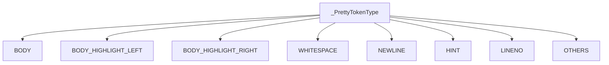
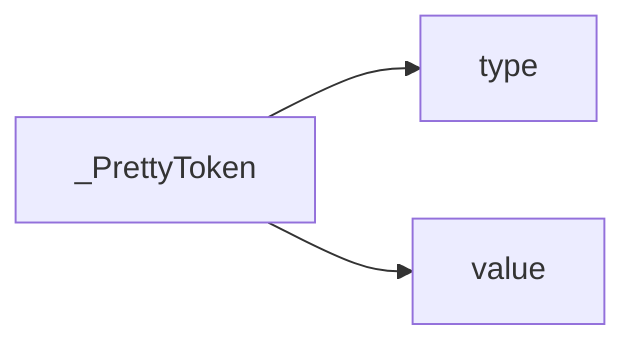
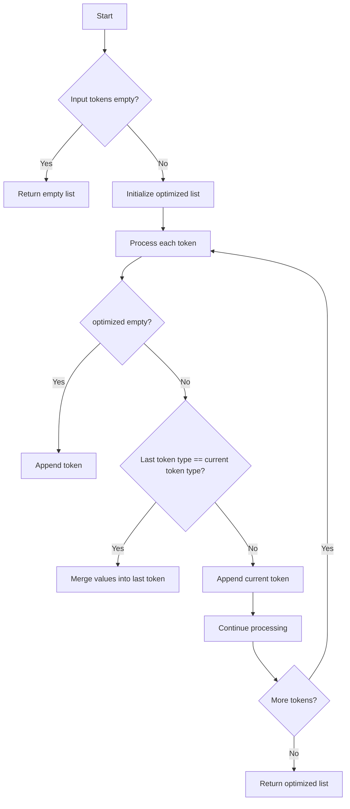
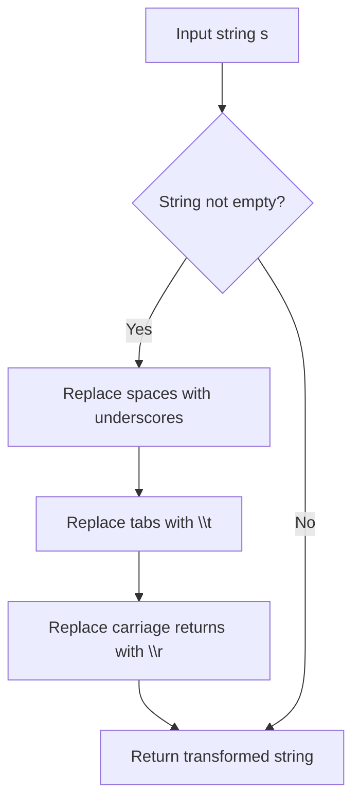
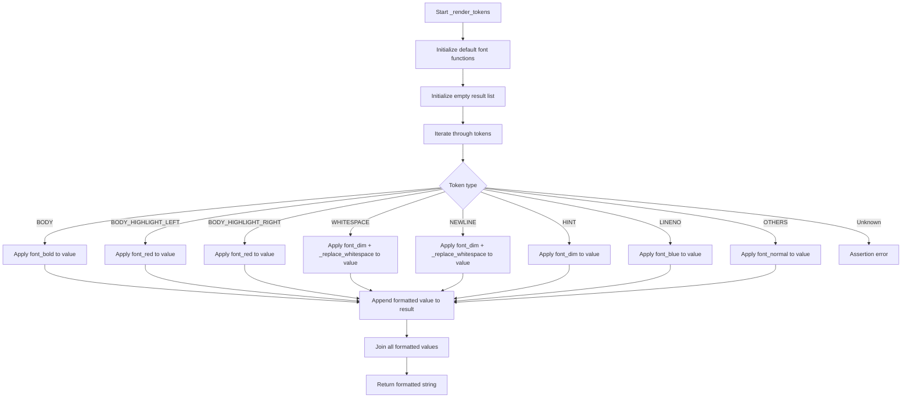
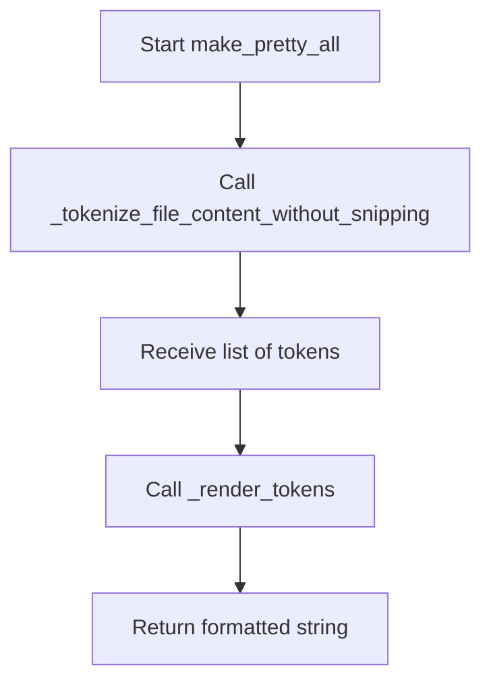
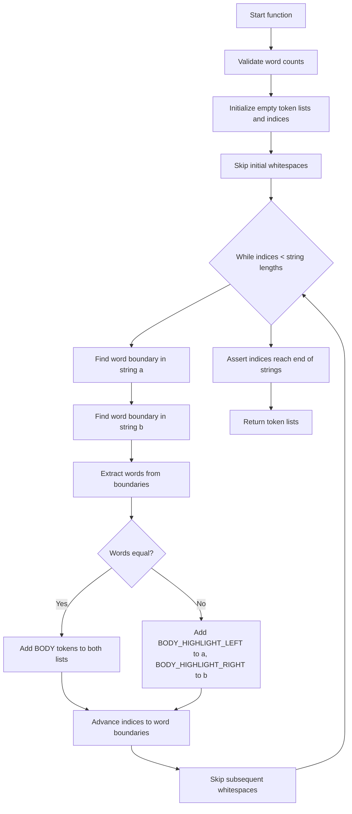
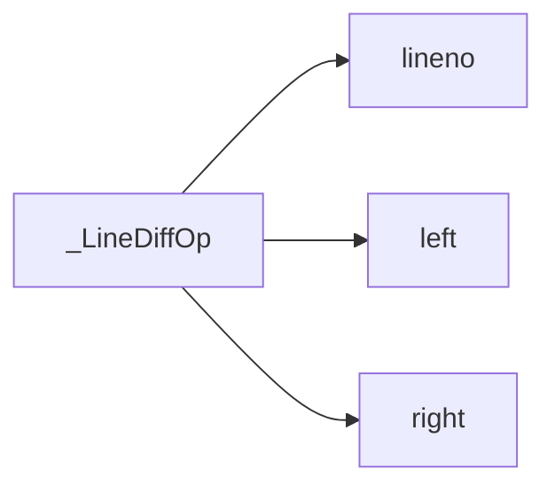

# `pretty_printers.py`

## `onlinejudge_command.pretty_printers._PrettyTokenType` · *class*

## Summary:
Enumeration defining token types used for pretty printing output in the online judge command system.

## Description:
This enum class defines various token types that are used to categorize different parts of output during pretty printing operations. These token types help control formatting and highlighting when displaying differences between expected and actual outputs. The enum values represent different visual elements that can appear in formatted output, such as body text, highlighted sections, whitespace, newlines, hints, line numbers, and other miscellaneous content.

## State:
- Each enum member represents a specific token type with a string value:
  - BODY: Regular body text content
  - BODY_HIGHLIGHT_LEFT: Left-highlighted body text (typically for differences)
  - BODY_HIGHLIGHT_RIGHT: Right-highlighted body text (typically for differences)
  - WHITESPACE: Whitespace characters
  - NEWLINE: Newline characters
  - HINT: Hint or annotation text
  - LINENO: Line number indicators
  - OTHERS: Other unspecified token types

## Lifecycle:
- Creation: Instantiated automatically when the enum class is defined
- Usage: Used as values in other components that handle pretty printing and output formatting
- Destruction: Managed automatically by Python's garbage collection

## Method Map:


## Raises:
- No exceptions are raised during initialization as this is a simple enum definition

## Example:
```python
# Creating and using PrettyTokenType values
token_type = _PrettyTokenType.BODY
print(token_type.value)  # Output: 'BODY'

# Enum comparison
if token_type == _PrettyTokenType.WHITESPACE:
    print("This is whitespace")
```

## `onlinejudge_command.pretty_printers._PrettyToken` · *class*

## Summary:
Represents a token used in pretty printing operations, consisting of a type and its string value.

## Description:
A named tuple that encapsulates a token for pretty printing output in the online judge command system. Each token has a type defined by the _PrettyTokenType enumeration and a string value representing the actual content. This class serves as a fundamental building block for organizing and formatting output during difference comparisons and display operations, particularly when comparing expected vs actual outputs in competitive programming problem testing.

## State:
- type: _PrettyTokenType - The category/type of the token (e.g., BODY, WHITESPACE, HINT)
- value: str - The actual string content of the token

## Lifecycle:
- Creation: Instantiated by passing a _PrettyTokenType and a string value to the constructor
- Usage: Tokens are typically created and consumed by pretty printing functions and output comparison utilities
- Destruction: Managed automatically by Python's garbage collection

## Method Map:


## Raises:
- No exceptions are raised during instantiation as this is a simple named tuple

## Example:
```python
from onlinejudge_command.pretty_printers import _PrettyToken, _PrettyTokenType

# Create a token for regular body text
body_token = _PrettyToken(_PrettyTokenType.BODY, "Hello World")

# Access token properties
print(body_token.type)   # _PrettyTokenType.BODY
print(body_token.value)  # "Hello World"

# Create a token for whitespace
whitespace_token = _PrettyToken(_PrettyTokenType.WHITESPACE, " ")
```

## `onlinejudge_command.pretty_printers._optimize_tokens` · *function*

## Summary:
Merges consecutive tokens of the same type by concatenating their string values to reduce token count and improve formatting efficiency.

## Description:
This utility function processes a list of pretty-printing tokens and optimizes them by combining adjacent tokens that share the same type. It reduces the number of tokens by concatenating the string values of consecutive tokens of identical type, which helps streamline output formatting and comparison operations. This optimization is particularly useful in diff display systems where minimizing token fragmentation improves readability.

The function is designed to be called internally by pretty printing utilities and is not intended for direct public consumption. It maintains the order of tokens while reducing redundancy in token sequences.

## Args:
    tokens (List[_PrettyToken]): A list of pretty-printing tokens to optimize. Each token consists of a type and a string value.

## Returns:
    List[_PrettyToken]: A new list containing the optimized tokens, where consecutive tokens of the same type have been merged into single tokens with concatenated values.

## Raises:
    None: This function does not raise any exceptions under normal operation.

## Constraints:
    Preconditions:
    - Input tokens list can be empty
    - Each token in the input list must be a valid _PrettyToken instance
    
    Postconditions:
    - The returned list contains the same total content as the input but with fewer tokens
    - Token order is preserved
    - Consecutive tokens of the same type are merged into single tokens
    - Empty tokens are handled appropriately

## Side Effects:
    None: This function has no side effects and is purely functional.

## Control Flow:


## Examples:
```python
# Example 1: Basic optimization
tokens = [
    _PrettyToken(_PrettyTokenType.BODY, "Hello"),
    _PrettyToken(_PrettyTokenType.BODY, " "),
    _PrettyToken(_PrettyTokenType.BODY, "World")
]
result = _optimize_tokens(tokens)
# Result: [ _PrettyToken(_PrettyTokenType.BODY, "Hello World") ]

# Example 2: Mixed token types
tokens = [
    _PrettyToken(_PrettyTokenType.BODY, "Line1"),
    _PrettyToken(_PrettyTokenType.WHITESPACE, "\n"),
    _PrettyToken(_PrettyTokenType.BODY, "Line2")
]
result = _optimize_tokens(tokens)
# Result: [ _PrettyToken(_PrettyTokenType.BODY, "Line1"), 
#           _PrettyToken(_PrettyTokenType.WHITESPACE, "\n"), 
#           _PrettyToken(_PrettyTokenType.BODY, "Line2") ]
```

## `onlinejudge_command.pretty_printers._tokenize_str` · *function*

## Summary:
Segments a string into tokens based on contiguous whitespace and non-whitespace character sequences.

## Description:
Divides the input string into a list of tokens where each token consists of either consecutive whitespace characters (spaces and tabs) or consecutive non-whitespace characters. This function is used internally by pretty printing utilities to prepare output for formatted comparison and display operations.

The function processes the string sequentially, identifying runs of identical character types (whitespace vs non-whitespace) and creating appropriate tokens for each run. This tokenization is essential for proper formatting and highlighting when comparing expected vs actual outputs in competitive programming problem testing.

## Args:
    s (str): The input string to tokenize into discrete character sequences.

## Returns:
    List[_PrettyToken]: A list of tokens where each token contains a _PrettyTokenType (either BODY or WHITESPACE) and the corresponding substring.

## Raises:
    None: This function does not raise any exceptions under normal operation.

## Constraints:
    Preconditions:
        - Input string `s` must be a valid string object
    Postconditions:
        - The returned list will contain at least one token
        - All characters from the input string will be included in the output tokens
        - Each token's value will be a contiguous substring of the original string
        - Token types will correctly distinguish between whitespace and non-whitespace sequences

## Side Effects:
    None: This function has no side effects and is purely functional.

## Control Flow:
```mermaid
flowchart TD
    A[Start] --> B{Input string empty?}
    B -- Yes --> C[Return empty list]
    B -- No --> D[Initialize tokens list]
    D --> E[Set l = 0]
    E --> F{l < len(s)?}
    F -- No --> G[Return tokens]
    F -- Yes --> H[r = l + 1]
    H --> I{r < len(s) AND (s[l] in ' \\t') == (s[r] in ' \\t')?}
    I -- No --> J[Create token with type BODY/WHITESPACE]
    I -- Yes --> K[r = r + 1]
    K --> I
    J --> L[Add token to list]
    L --> M[l = r]
    M --> F
```

## Examples:
```python
# Basic tokenization
tokens = _tokenize_str("hello world")
# Returns: [_PrettyToken(type=_PrettyTokenType.BODY, value="hello"), _PrettyToken(type=_PrettyTokenType.WHITESPACE, value=" "), _PrettyToken(type=_PrettyTokenType.BODY, value="world")]

# Tokenization with multiple spaces
tokens = _tokenize_str("a   b")
# Returns: [_PrettyToken(type=_PrettyTokenType.BODY, value="a"), _PrettyToken(type=_PrettyTokenType.WHITESPACE, value="   "), _PrettyToken(type=_PrettyTokenType.BODY, value="b")]

# Tokenization with tabs
tokens = _tokenize_str("a\t\tb")
# Returns: [_PrettyToken(type=_PrettyTokenType.BODY, value="a"), _PrettyToken(type=_PrettyTokenType.WHITESPACE, value="\t\t"), _PrettyToken(type=_PrettyTokenType.BODY, value="b")]
```

## `onlinejudge_command.pretty_printers._tokenize_line` · *function*

## Summary:
Parses a line of text into structured tokens, separating body content from trailing whitespace and newlines for pretty printing operations.

## Description:
Processes a line of text by splitting it into tokens that represent different structural components: the main body content, trailing whitespace, and newline characters. This function is designed to support formatted output comparison and display operations in competitive programming problem testing environments. It handles both standard line endings (\n, \r\n) and unusual trailing whitespace patterns by creating appropriate token types.

The function extracts the body portion (everything except trailing newlines) and then separately processes any trailing whitespace/newlines, creating tokens according to the pretty printing token types. This allows downstream pretty printing functions to properly format and highlight differences between expected and actual outputs.

## Args:
    line (str): The input line to tokenize, potentially containing trailing newlines and whitespace.

## Returns:
    List[_PrettyToken]: A list of tokens representing the parsed components of the line. Each token has a type from _PrettyTokenType and a string value. Possible token types include BODY, WHITESPACE, NEWLINE, and HINT for trailing whitespace.

## Raises:
    None: This function does not explicitly raise exceptions under normal operation.

## Constraints:
    Preconditions:
        - Input parameter `line` must be a valid string object
    Postconditions:
        - The returned list will contain zero or more tokens
        - All characters from the input line will be represented in the output tokens
        - Tokens will be ordered according to their position in the original line

## Side Effects:
    None: This function has no side effects and is purely functional.

## Control Flow:
```mermaid
flowchart TD
    A[Start _tokenize_line] --> B{Line has body content?}
    B -- No --> C{Line has newline content?}
    C -- No --> D[Return empty tokens list]
    C -- Yes --> E{Newline is standard \\n or \\r\\n?}
    E -- Yes --> F[Add NEWLINE token]
    E -- No --> G[Extract whitespace part]
    G --> H{Whitespace exists?}
    H -- Yes --> I[Add WHITESPACE token]
    H -- No --> J[Skip whitespace]
    J --> K[Add HINT token "(trailing whitespace)"]
    K --> L{Remaining newline exists?}
    L -- Yes --> M[Add NEWLINE token]
    L -- No --> N[End]
    B -- Yes --> O[Tokenize body with _tokenize_str]
    O --> P[Append body tokens to result]
    P --> Q{Line has newline content?}
    Q -- No --> R[Return tokens]
    Q -- Yes --> S{Newline is standard \\n or \\r\\n?}
    S -- Yes --> T[Add NEWLINE token]
    S -- No --> U[Extract whitespace part]
    U --> V{Whitespace exists?}
    V -- Yes --> W[Add WHITESPACE token]
    V -- No --> X[Skip whitespace]
    X --> Y[Add HINT token "(trailing whitespace)"]
    Y --> Z{Remaining newline exists?}
    Z -- Yes --> AA[Add NEWLINE token]
    Z -- No --> AB[End]
```

## Examples:
```python
# Basic line with content and newline
tokens = _tokenize_line("hello world\n")
# Returns: [_PrettyToken(type=_PrettyTokenType.BODY, value="hello world"), _PrettyToken(type=_PrettyTokenType.NEWLINE, value="\n")]

# Line with trailing whitespace
tokens = _tokenize_line("test   ")
# Returns: [_PrettyToken(type=_PrettyTokenType.BODY, value="test"), _PrettyToken(type=_PrettyTokenType.WHITESPACE, value="   "), _PrettyToken(type=_PrettyTokenType.HINT, value="(trailing whitespace)")]

# Empty line
tokens = _tokenize_line("\n")
# Returns: [_PrettyToken(type=_PrettyTokenType.NEWLINE, value="\n")]

# Line with Windows-style newline
tokens = _tokenize_line("line\r\n")
# Returns: [_PrettyToken(type=_PrettyTokenType.BODY, value="line"), _PrettyToken(type=_PrettyTokenType.NEWLINE, value="\r\n")]
```

## `onlinejudge_command.pretty_printers._decode_with_recovery` · *function*

## Summary:
Decodes bytes content into text while providing recovery mechanisms for encoding errors.

## Description:
Attempts to decode binary content into text using UTF-8 encoding. When a UnicodeDecodeError occurs, it creates a recovery mechanism that captures the error information and continues processing with error replacement. This function ensures that even malformed byte sequences can be processed and displayed, making it suitable for handling diverse output formats in competitive programming environments where output may contain various encodings or corrupted data.

## Args:
    content (bytes): Binary data to be decoded into text format

## Returns:
    Tuple[List[_PrettyToken], str]: A tuple containing:
        - List of _PrettyToken objects (potentially empty or containing error tokens)
        - Decoded text string (complete text with error replacements if decode failed)

## Raises:
    None: This function handles all UnicodeDecodeError exceptions internally

## Constraints:
    Preconditions:
        - Input content must be of type bytes
        - Function assumes UTF-8 encoding as primary decoding method
    
    Postconditions:
        - Always returns a valid string (even if partially recovered)
        - Returns a tuple with a list of tokens and decoded text

## Side Effects:
    None: This function performs no I/O operations or external state mutations

## Control Flow:
```mermaid
flowchart TD
    A[Start _decode_with_recovery] --> B{Try decode content}
    B -- Success --> C[Return (tokens=[], text)]
    B -- UnicodeDecodeError --> D[Create HINT token]
    D --> E[Decode with errors='replace']
    E --> F[Return (tokens=[HINT], text)]
```

## Examples:
```python
# Normal case - successful decoding
content = b"Hello World"
tokens, text = _decode_with_recovery(content)
# tokens = [] (empty list)
# text = "Hello World"

# Error case - with invalid UTF-8 bytes
content = b"\xff\xfe\xfd"
tokens, text = _decode_with_recovery(content)
# tokens = [some _PrettyToken object] (contains error information)
# text = "���" (replacement characters)
```

## `onlinejudge_command.pretty_printers._warn_if_empty` · *function*

## Summary:
Adds hint tokens to indicate special empty or formatting conditions in pretty-printed output tokens.

## Description:
This function analyzes a list of pretty-printing tokens and appends appropriate hint tokens to indicate when the output is empty, lacks a trailing newline, or consists only of newlines. It serves as a utility for providing informative feedback about output formatting during comparison operations in the online judge command system.

The function is designed to be called in the pretty printing pipeline to enhance user experience by providing contextual information about the nature of the output being displayed. Rather than inlining this logic, it's extracted into a separate function to maintain clean separation of concerns and make the pretty printing logic more modular.

## Args:
    tokens (List[_PrettyToken]): A list of pretty-printing tokens to analyze and potentially modify. Each token is expected to be a tuple-like structure where the first element is a _PrettyTokenType value and the second element is a string value.

## Returns:
    List[_PrettyToken]: The modified list of tokens, potentially with additional hint tokens appended to indicate special formatting conditions.

## Raises:
    No exceptions are explicitly raised by this function.

## Constraints:
    Preconditions:
    - The input tokens list should contain valid token structures with proper _PrettyTokenType values as the first element
    - All tokens in the list must have a valid type attribute accessible via index 0 or .type property
    
    Postconditions:
    - The returned list will contain all original tokens plus zero or more hint tokens
    - The original tokens list is not mutated; a new list is returned
    - The function handles all edge cases internally

## Side Effects:
    None - This function performs no I/O operations or external state mutations.

## Control Flow:
```mermaid
flowchart TD
    A[Start with tokens list] --> B{Is tokens list empty?}
    B -- Yes --> C[Return [(empty) hint token]]
    B -- No --> D[Check last token type]
    D --> E{Last token type is BODY?}
    E -- Yes --> F[Append (no trailing newline) hint]
    E -- No --> G[Skip trailing newline check]
    G --> H{All tokens are NEWLINE?}
    H -- Yes --> I[Append (only newline) hint]
    H -- No --> J[Return original tokens]
    F --> J
```

## Examples:
```python
# Example 1: Empty tokens list
tokens = []
result = _warn_if_empty(tokens)
# result = [(_PrettyTokenType.HINT, '(empty)')]

# Example 2: Tokens ending with BODY (no trailing newline)
tokens = [(_PrettyTokenType.BODY, 'hello'), (_PrettyTokenType.NEWLINE, '\n')]
result = _warn_if_empty(tokens)
# result = [(_PrettyTokenType.BODY, 'hello'), (_PrettyTokenType.NEWLINE, '\n'), (_PrettyTokenType.HINT, '(no trailing newline)')]

# Example 3: Tokens containing only newlines
tokens = [(_PrettyTokenType.NEWLINE, '\n'), (_PrettyTokenType.NEWLINE, '\n')]
result = _warn_if_empty(tokens)
# result = [(_PrettyTokenType.NEWLINE, '\n'), (_PrettyTokenType.NEWLINE, '\n'), (_PrettyTokenType.HINT, '(only newline)')]
```

## `onlinejudge_command.pretty_printers._tokenize_large_file_content` · *function*

## Summary:
Processes large binary file content by converting it to tokens and applying intelligent truncation strategies to prevent overwhelming output display.

## Description:
Converts binary file content into structured tokens while intelligently truncating large files to maintain readability. This function implements three different truncation strategies (do-nothing, line-based, and character-based) and selects the most compact representation to minimize output size while preserving important information. It is primarily used in pretty printing contexts where large output files need to be displayed in a human-readable format without overwhelming the terminal or UI.

The function is extracted from inline logic to provide a reusable component for handling large file content in output comparison and display operations. Its design allows for flexible truncation parameters while ensuring consistent tokenization behavior.

## Args:
    content (bytes): Binary content to process and tokenize
    limit (int): Maximum number of lines/characters to allow before applying truncation
    head (int): Number of lines/characters to show from the beginning of content
    tail (int): Number of lines/characters to show from the end of content  
    char_in_line (int): Average number of characters per line used for character-based truncation calculation

## Returns:
    List[_PrettyToken]: A list of tokenized content where each _PrettyToken represents a token used in pretty printing operations, consisting of a type and its string value. The tokens represent either the full content (when small enough) or a truncated version with ellipsis markers indicating omitted content.

## Raises:
    AssertionError: When head + tail >= limit, indicating invalid truncation parameters

## Constraints:
    Preconditions:
        - head + tail must be strictly less than limit to ensure meaningful truncation
        - content must be valid bytes data
        - limit, head, and tail must be non-negative integers
        - char_in_line must be positive for character-based truncation to work properly
        
    Postconditions:
        - Always returns a list of _PrettyToken objects
        - The returned tokens are properly formatted for pretty printing
        - Truncation strategies are applied consistently based on content size

## Side Effects:
    None: This function performs no I/O operations or external state mutations.

## Control Flow:
```mermaid
flowchart TD
    A[Start _tokenize_large_file_content] --> B{Assert head + tail < limit}
    B --> C[_decode_with_recovery(content)]
    C --> D{Text successfully decoded?}
    D -- Yes --> E[Create 3 candidate strategies]
    E --> F[Calculate size for each candidate]
    F --> G[Select minimum size candidate]
    G --> H[_warn_if_empty(tokens)]
    H --> I[Return tokens]
    D -- No --> J[_warn_if_empty(tokens)]
    J --> I
```

## Examples:
```python
# Basic usage with small content (no truncation)
content = b"line1\nline2\nline3\n"
tokens = _tokenize_large_file_content(
    content=content,
    limit=10,
    head=3,
    tail=3,
    char_in_line=80
)
# Returns all tokens without truncation

# Usage with large content (applies truncation)
large_content = b"line1\n" * 1000
tokens = _tokenize_large_file_content(
    content=large_content,
    limit=10,
    head=3,
    tail=3,
    char_in_line=80
)
# Returns truncated tokens with ellipsis indicating omitted lines
```

## `onlinejudge_command.pretty_printers._replace_whitespace` · *function*

## Summary:
Replaces common whitespace characters with visible escape sequences for clearer display in output.

## Description:
This utility function transforms whitespace characters into visible representations to aid in debugging and pretty printing. It converts spaces to underscores, tabs to backslash-t sequences, and carriage returns to backslash-r sequences. This is particularly useful when displaying or comparing text where whitespace differences are significant but not easily distinguishable in standard output.

## Args:
    s (str): Input string containing whitespace characters to be replaced

## Returns:
    str: A copy of the input string with whitespace characters replaced by visible representations:
         - Space (' ') becomes underscore ('_')
         - Tab ('\t') becomes '\\t'
         - Carriage return ('\r') becomes '\\r'

## Raises:
    None: This function does not raise any exceptions

## Constraints:
    Preconditions:
    - Input must be a string type
    - Function handles all Unicode strings correctly
    
    Postconditions:
    - Output string contains no space, tab, or carriage return characters
    - All other characters remain unchanged
    - Return value is always a string of equal or greater length

## Side Effects:
    None: This function is pure and has no side effects

## Control Flow:


## Examples:
    >>> _replace_whitespace("hello world")
    'hello_world'
    
    >>> _replace_whitespace("line1\ttabbed")
    'line1\\ttabbed'
    
    >>> _replace_whitespace("carriage\rreturn")
    'carriage\\rreturn'
    
    >>> _replace_whitespace("mixed \t \r spaces")
    'mixed \\t \\r spaces'
```

## `onlinejudge_command.pretty_printers._render_tokens` · *function*

## Summary:
Formats a list of pretty-printing tokens with appropriate styling based on their type.

## Description:
Processes a list of tokens with associated types and applies specific formatting styles to each token based on its type. This function is responsible for converting raw tokenized output into styled text suitable for display in terminal environments, particularly for showing differences between expected and actual outputs in competitive programming problem testing.

The function extracts formatting logic into its own component to separate concerns between token processing and presentation formatting, making the code more modular and testable.

## Args:
    tokens (List[_PrettyToken]): A list of token objects containing type and value pairs to be formatted
    font_bold (Optional[Callable[[str], str]]): Function to apply bold formatting, defaults to colorama-based implementation
    font_dim (Optional[Callable[[str], str]]): Function to apply dim/dimmed formatting, defaults to colorama-based implementation  
    font_red (Optional[Callable[[str], str]]): Function to apply red color formatting, defaults to colorama-based implementation
    font_blue (Optional[Callable[[str], str]]): Function to apply blue/cyan color formatting, defaults to colorama-based implementation
    font_normal (Optional[Callable[[str], str]]): Function to apply normal/unformatted styling, defaults to identity function

## Returns:
    str: A formatted string with all tokens properly styled according to their types

## Raises:
    AssertionError: When an unexpected token type is encountered (should not happen with valid inputs)

## Constraints:
    Preconditions:
    - All tokens in the input list must be tuples where the first element is a valid _PrettyTokenType and second element is a string
    - Token types must be members of _PrettyTokenType enumeration
    - Input tokens should not contain invalid or unexpected token types
    
    Postconditions:
    - Returns a properly formatted string with all tokens styled appropriately
    - The returned string contains no unformatted tokens
    - All styling functions are applied consistently

## Side Effects:
    None: This function is pure and has no side effects

## Control Flow:


## `onlinejudge_command.pretty_printers._get_terminal_size` · *function*

## Summary:
Returns the terminal width for formatting output, with a minimum width of 40 characters.

## Description:
This function retrieves the current terminal width using the standard library `shutil.get_terminal_size()` and ensures a minimum width of 40 characters. This prevents formatting issues when terminals are very narrow.

The function was extracted to centralize terminal size logic and ensure consistent formatting behavior across the application. Rather than hardcoding terminal width requirements throughout the codebase, this function provides a single source of truth for terminal dimensions.

## Args:
    None

## Returns:
    int: The terminal width in characters, guaranteed to be at least 40.

## Raises:
    OSError: When the terminal size cannot be determined, typically in non-terminal environments or when running in restricted execution contexts.

## Constraints:
    Preconditions:
        - The function should be called in a terminal environment
        - The process must have access to terminal information
    
    Postconditions:
        - Always returns an integer >= 40
        - The returned value represents the current terminal width

## Side Effects:
    None

## Control Flow:
```mermaid
flowchart TD
    A[Call _get_terminal_size()] --> B[shutil.get_terminal_size()]
    B --> C{Get width}
    C --> D[Return max(width, 40)]
```

## Examples:
```python
# Typical usage in formatting
terminal_width = _get_terminal_size()
print(f"Terminal is {terminal_width} characters wide")
```

## `onlinejudge_command.pretty_printers.make_pretty_large_file_content` · *function*

## Summary:
Formats large binary file content into a readable string representation with intelligent truncation and terminal-aware layout.

## Description:
Processes binary file content by converting it into styled tokens and applying intelligent truncation strategies to prevent overwhelming output display. This function serves as the main entry point for pretty-printing large files in terminal environments, automatically determining optimal display parameters based on terminal width and applying appropriate truncation when content exceeds configured limits.

The function was extracted to centralize the logic for handling large file content in pretty printing operations, separating the concerns of terminal sizing, content tokenization, and rendering into distinct, testable components. This design enables consistent formatting behavior across different parts of the application while maintaining flexibility in truncation parameters.

## Args:
    content (bytes): Binary content of the file to be formatted and displayed
    limit (int): Maximum number of lines/characters to allow before applying truncation strategies
    head (int): Number of lines/characters to preserve from the beginning of content
    tail (int): Number of lines/characters to preserve from the end of content

## Returns:
    str: A formatted string representation of the file content with appropriate styling and truncation

## Raises:
    AssertionError: When head + tail >= limit, indicating invalid truncation parameters (passed through from _tokenize_large_file_content)

## Constraints:
    Preconditions:
        - head + tail must be strictly less than limit to ensure meaningful truncation
        - content must be valid bytes data
        - limit, head, and tail must be non-negative integers
        - Terminal size must be determinable (though this is handled internally)
        
    Postconditions:
        - Always returns a properly formatted string with appropriate styling
        - The returned string represents either the full content (when small enough) or a truncated version with ellipsis markers

## Side Effects:
    None: This function is pure and has no side effects

## Control Flow:
```mermaid
flowchart TD
    A[Call make_pretty_large_file_content] --> B[Get terminal width with _get_terminal_size()]
    B --> C[Tokenize content with _tokenize_large_file_content]
    C --> D[Render tokens with _render_tokens]
    D --> E[Return formatted string]
```

## `onlinejudge_command.pretty_printers._tokenize_file_content_without_snipping` · *function*

## Summary:
Converts binary file content into a list of structured tokens for pretty printing, handling encoding recovery and line-by-line tokenization.

## Description:
Processes binary content by first decoding it into text with recovery mechanisms for encoding errors, then tokenizing each line into structured components for formatted output display. This function serves as a key component in the pretty printing pipeline for competitive programming problem outputs, ensuring that both valid and malformed content can be properly analyzed and displayed.

The function is extracted from inline logic to provide a clean separation between content decoding, line-by-line tokenization, and post-processing for formatting hints. This modular approach enables better testability and maintainability of the pretty printing system.

## Args:
    content (bytes): Binary data representing file content to be tokenized for pretty printing

## Returns:
    List[_PrettyToken]: A list of structured tokens representing the decoded content, where each token contains a type from _PrettyTokenType and associated text content. The tokens include body content, whitespace, newlines, and error/hint information.

## Raises:
    None: This function delegates all encoding error handling to _decode_with_recovery

## Constraints:
    Preconditions:
        - Input content must be of type bytes
        - The content should represent valid file data that can be decoded to text
        
    Postconditions:
        - Returns a list of _PrettyToken objects with proper token types and values
        - All characters from the input content are represented in the output tokens
        - The returned tokens are ready for pretty printing operations

## Side Effects:
    None: This function performs no I/O operations or external state mutations

## Control Flow:
```mermaid
flowchart TD
    A[Start _tokenize_file_content_without_snipping] --> B[Call _decode_with_recovery(content)]
    B --> C{Decode successful?}
    C -- Yes --> D[Get tokens and text from decode result]
    C -- No --> D[Get tokens and text from decode result]
    D --> E[Split text into lines with keepends=True]
    E --> F[For each line in text.splitlines()]
    F --> G[Call _tokenize_line(line)]
    G --> H[Append line tokens to existing tokens]
    H --> I[Call _warn_if_empty(tokens)]
    I --> J[Return final tokens list]
```

## Examples:
```python
# Basic usage with valid UTF-8 content
content = b"Hello\nWorld\n"
tokens = _tokenize_file_content_without_snipping(content)
# Returns list of tokens representing "Hello", newline, "World", newline

# Usage with encoding errors (recovery mode)
content = b"Hello\xff\xfe\xfd\nWorld\n"
tokens = _tokenize_file_content_without_snipping(content)
# Returns tokens including error recovery hints and properly decoded content
```

## `onlinejudge_command.pretty_printers.make_pretty_all` · *function*

## Summary:
Transforms binary file content into a beautifully formatted string with color-coded highlighting for competitive programming output comparison.

## Description:
Processes binary content through a two-stage pipeline to produce human-readable, colorized output suitable for displaying differences between expected and actual program outputs. This function serves as the main entry point for pretty-printing file contents in the online judge command system.

The function extracts the tokenization and rendering logic into a clean interface to separate the concerns of content processing from presentation formatting, enabling better modularity and testability of the pretty printing system.

## Args:
    content (bytes): Binary representation of file content to be pretty-printed

## Returns:
    str: A formatted string with color-coded tokens representing the original content, including body text, whitespace, newlines, and formatting hints for visual distinction

## Raises:
    None: This function delegates all error handling to the underlying helper functions

## Constraints:
    Preconditions:
    - Input content must be of type bytes
    - Content should represent valid file data that can be decoded to text
    
    Postconditions:
    - Returns a properly formatted string with all content styled appropriately
    - The returned string contains no unformatted content
    - All tokens from the input are represented in the output

## Side Effects:
    None: This function is pure and has no side effects

## Control Flow:


## `onlinejudge_command.pretty_printers._skip_whitespaces` · *function*

## Summary:
Skips whitespace characters in a string and creates corresponding tokens for pretty printing.

## Description:
Processes consecutive whitespace characters (spaces, tabs, carriage returns, and newlines) starting from a given index in a string. Identifies each character as either whitespace or newline and creates appropriate tokens for pretty printing operations. The function advances the index past all processed whitespace characters and returns the optimized token list.

This function is extracted to separate the logic of whitespace detection and token creation from the main parsing logic, enabling cleaner code organization and reuse in different contexts where whitespace skipping is needed.

## Args:
    i (int): Starting index in the string to process whitespace characters from
    s (str): The input string being processed

## Returns:
    Tuple[int, List[_PrettyToken]]: A tuple containing:
        - The new index position after skipping all whitespace characters
        - A list of optimized _PrettyToken objects representing the skipped whitespace characters

## Raises:
    None: This function does not explicitly raise exceptions

## Constraints:
    Preconditions:
    - Index `i` must be a valid index within the bounds of string `s` (0 <= i <= len(s))
    - String `s` must be a valid string object
    
    Postconditions:
    - The returned index will be equal to or greater than the input index `i`
    - The returned index will point to the first non-whitespace character after the processed whitespace
    - The returned tokens list will contain only WHITESPACE or NEWLINE tokens

## Side Effects:
    None: This function has no side effects and is purely functional

## Control Flow:
```mermaid
flowchart TD
    A[Start _skip_whitespaces] --> B{Index i < len(s) AND s[i] in ' \\t\\r\\n'?}
    B -- No --> C[Return (i, _optimize_tokens([]))]
    B -- Yes --> D[Create empty tokens list]
    D --> E[Process character s[i]]
    E --> F{Character in ' \\t'?}
    F -- Yes --> G[Set token type to WHITESPACE]
    F -- No --> H[Set token type to NEWLINE]
    G --> I[Add token to list]
    H --> I
    I --> J[Increment i]
    J --> K{Index i < len(s) AND s[i] in ' \\t\\r\\n'?}
    K -- Yes --> E
    K -- No --> L[Call _optimize_tokens(tokens)]
    L --> M[Return (i, _optimize_tokens(tokens))]
```

## Examples:
```python
# Example 1: Skip leading whitespace
i, tokens = _skip_whitespaces(0, "   Hello")
# Returns: (3, [_PrettyToken(_PrettyTokenType.WHITESPACE, "   ")])
# Index advances from 0 to 3, consuming 3 spaces

# Example 2: Skip mixed whitespace
i, tokens = _skip_whitespaces(0, " \t\n  World")
# Returns: (5, [_PrettyToken(_PrettyTokenType.WHITESPACE, " \t"), 
#               _PrettyToken(_PrettyTokenType.NEWLINE, "\n"), 
#               _PrettyToken(_PrettyTokenType.WHITESPACE, "  ")])
# Index advances from 0 to 5, consuming 2 spaces, 1 tab, 1 newline, 2 spaces

# Example 3: No whitespace to skip
i, tokens = _skip_whitespaces(0, "NoWhitespace")
# Returns: (0, [])
# Index remains at 0, no tokens created
```

## `onlinejudge_command.pretty_printers._make_diff_between_line_and_line_by_comparing_word_by_word` · *function*

## Summary:
Compares two strings word-by-word and generates tokenized representations that highlight differences between corresponding words.

## Description:
Processes two input strings character-by-character to identify word boundaries and compare words at corresponding positions. When words differ between the two strings, they are marked with special highlighting tokens to indicate differences. This function is designed to support detailed output comparison in competitive programming environments where precise word-level differences need to be displayed.

The function assumes both strings contain the same number of words (as enforced by an assertion), making it suitable for comparing lines of output where word count consistency is guaranteed. It handles whitespace processing through a helper function and produces tokenized output that can be rendered with appropriate visual highlighting.

## Args:
    a (str): First string to compare, typically representing expected output
    b (str): Second string to compare, typically representing actual output

## Returns:
    Tuple[List[_PrettyToken], List[_PrettyToken]]: A pair of lists containing tokenized representations of the two input strings. Each list contains _PrettyToken objects that categorize different parts of the strings (body text, whitespace, highlights) for proper rendering. The first list corresponds to string `a` and the second to string `b`.

## Raises:
    AssertionError: When the two input strings do not contain the same number of words after stripping whitespace

## Constraints:
    Preconditions:
    - Both input strings `a` and `b` must be valid string objects
    - Both strings must contain the same number of words when whitespace is stripped
    - Input indices must remain within valid bounds during processing
    
    Postconditions:
    - The returned token lists will contain exactly one token for each character in the input strings
    - All tokens in the returned lists will be properly categorized by their type
    - The function will process the entire length of both input strings

## Side Effects:
    None: This function has no side effects and is purely functional

## Control Flow:


## Examples:
```python
# Basic word comparison
tokens_a, tokens_b = _make_diff_between_line_and_line_by_comparing_word_by_word("hello world", "hello there")
# Returns tokens highlighting "world" vs "there" as differences

# Comparison with whitespace
tokens_a, tokens_b = _make_diff_between_line_and_line_by_comparing_word_by_word("  hello  ", "  world  ")
# Returns tokens highlighting "hello" vs "world" with whitespace tokens included

# Identical strings
tokens_a, tokens_b = _make_diff_between_line_and_line_by_comparing_word_by_word("test case", "test case")
# Returns tokens with all BODY types, no highlighting
```

## `onlinejudge_command.pretty_printers._tokenize_str_with_highlight` · *function*

## Summary:
Transforms a string into a list of tokens with conditional highlighting applied to body content.

## Description:
Processes a string by tokenizing it into basic components and applying special highlighting to body tokens based on the specified side (left or right). This function is used internally by pretty printing utilities to prepare output for formatted comparison and display operations, particularly when showing differences between expected and actual outputs in competitive programming problem testing.

The function works by taking an input string and converting it into a list of tokens, where body tokens are replaced with appropriately highlighted variants based on the `is_right` parameter. This enables visual distinction of differences in output comparison scenarios.

## Args:
    s (str): The input string to tokenize and highlight.
    is_right (bool): Flag indicating whether to apply right-side highlighting. When True, BODY tokens become BODY_HIGHLIGHT_RIGHT; when False, they become BODY_HIGHLIGHT_LEFT.

## Returns:
    List[_PrettyToken]: A list of tokens where body tokens are replaced with appropriately highlighted versions based on the is_right flag, while other token types remain unchanged.

## Raises:
    None: This function does not explicitly raise exceptions under normal operation.

## Constraints:
    Preconditions:
        - Input string `s` must be a valid string object
        - The `_tokenize_str` function must work correctly for the input string
        - The `_PrettyTokenType` enum must contain the required token type constants
    Postconditions:
        - The returned list will contain at least one token
        - All characters from the input string will be included in the output tokens
        - Each token's value will be a contiguous substring of the original string
        - Token types will correctly distinguish between whitespace and non-whitespace sequences
        - Body tokens will be converted to highlighted variants based on the is_right flag

## Side Effects:
    None: This function has no side effects and is purely functional.

## Control Flow:
```mermaid
flowchart TD
    A[Start] --> B[Tokenize input string with _tokenize_str(s)]
    B --> C{Loop through tokens}
    C --> D[Get token type]
    D --> E{Is token type BODY?}
    E -- No --> F[Keep original token]
    E -- Yes --> G{is_right flag}
    G -- True --> H[Convert to BODY_HIGHLIGHT_RIGHT]
    G -- False --> I[Convert to BODY_HIGHLIGHT_LEFT]
    F --> J[Add token to result]
    H --> J
    I --> J
    J --> K[Return tokens list]
```

## Examples:
```python
from onlinejudge_command.pretty_printers import _tokenize_str_with_highlight, _PrettyTokenType

# Basic usage with left highlighting
tokens = _tokenize_str_with_highlight("hello world", is_right=False)
# Returns: [token with type BODY_HIGHLIGHT_LEFT, token with type WHITESPACE, token with type BODY_HIGHLIGHT_LEFT]

# Basic usage with right highlighting  
tokens = _tokenize_str_with_highlight("hello world", is_right=True)
# Returns: [token with type BODY_HIGHLIGHT_RIGHT, token with type WHITESPACE, token with type BODY_HIGHLIGHT_RIGHT]

# Usage with mixed content
tokens = _tokenize_str_with_highlight("a\tb\n", is_right=False)
# Returns: [token with type BODY_HIGHLIGHT_LEFT, token with type WHITESPACE, token with type BODY_HIGHLIGHT_LEFT, token with type NEWLINE]
```

## `onlinejudge_command.pretty_printers._make_diff_between_line_and_line_by_difflib` · *function*

## Summary:
Creates tokenized representations of two strings with highlighted differences using difflib sequence matching.

## Description:
Processes two input strings and generates tokenized representations that highlight differences between them. Uses Python's difflib.SequenceMatcher to identify matching and differing subsequences, then converts these into formatted tokens with appropriate highlighting for display purposes. This function is primarily used for pretty-printing output differences in competitive programming problem testing environments.

The function handles four difflib operation types ('replace', 'delete', 'insert', 'equal') and applies different tokenization strategies accordingly. It also properly handles newline characters that may be present at the end of strings. The resulting tokens can be used for visual comparison of expected vs actual outputs.

## Args:
    a (str): First string to compare, typically representing expected output
    b (str): Second string to compare, typically representing actual output

## Returns:
    Tuple[List[_PrettyToken], List[_PrettyToken]]: A pair of lists containing tokenized representations of the two input strings. The first list corresponds to string 'a' with appropriate highlighting for differences (BODY_HIGHLIGHT_LEFT for changed/deleted content), and the second list corresponds to string 'b' with appropriate highlighting for differences (BODY_HIGHLIGHT_RIGHT for changed/inserted content). Equal content is represented with standard BODY tokens.

## Raises:
    AssertionError: When difflib produces unexpected operation codes or when insert/delete operations have inconsistent bounds

## Constraints:
    Preconditions:
        - Both input strings must be valid string objects
        - The internal helper functions (_tokenize_str_with_highlight, _tokenize_str, _optimize_tokens) must work correctly
        
    Postconditions:
        - The returned token lists will contain the same total content as the input strings
        - Token types will correctly represent the nature of each character sequence
        - Differences between strings will be visually highlighted in the output tokens
        - Newline characters at the end of strings are properly handled
        - The tokenization preserves the original character sequences

## Side Effects:
    None: This function has no side effects and is purely functional.

## Control Flow:
```mermaid
flowchart TD
    A[Start] --> B[Initialize empty token lists]
    B --> C[Create difflib.SequenceMatcher]
    C --> D[Set sequences to stripped strings (remove trailing newlines)]
    D --> E[Process opcodes from matcher]
    E --> F{Tag is 'replace'?}
    F -- Yes --> G[Tokenize both substrings with highlighting]
    F -- No --> H{Tag is 'delete'?}
    H -- Yes --> I[Tokenize left substring with left highlighting]
    H -- No --> J{Tag is 'insert'?}
    J -- Yes --> K[Tokenize right substring with right highlighting]
    J -- No --> L{Tag is 'equal'?}
    L -- Yes --> M[Tokenize both substrings normally]
    L -- No --> N[Assert False - Invalid tag]
    G --> O[Extend token lists]
    I --> O
    K --> O
    M --> O
    O --> P[Handle trailing newlines]
    P --> Q[Optimize tokens for both lists]
    Q --> R[Return token pairs]
```

## `onlinejudge_command.pretty_printers._make_diff_between_line_and_line` · *function*

## Summary:
Chooses between word-by-word or difflib-based diff algorithms based on word count equality to generate tokenized representations of string differences.

## Description:
Dispatches to either word-by-word comparison or difflib-based comparison depending on whether the input strings contain the same number of words after stripping whitespace. This function serves as a strategy selector that applies the most appropriate diff algorithm for comparing two strings in competitive programming output validation contexts.

The function is called by higher-level pretty printing utilities when comparing expected vs actual output lines. It provides a performance optimization by selecting the simpler word-by-word approach when word counts match, falling back to the more robust difflib approach otherwise.

## Args:
    a (str): First string to compare, typically representing expected output
    b (str): Second string to compare, typically representing actual output

## Returns:
    Tuple[List[_PrettyToken], List[_PrettyToken]]: A pair of lists containing tokenized representations of the two input strings. The first list corresponds to string `a` and the second to string `b`, with appropriate highlighting tokens indicating differences between the strings.

## Raises:
    No explicit exceptions are raised by this function, though underlying helper functions may raise exceptions.

## Constraints:
    Preconditions:
    - Both input strings `a` and `b` must be valid string objects
    - The function assumes that the helper functions handle their own validation requirements
    
    Postconditions:
    - The returned token lists will contain properly categorized _PrettyToken objects
    - The tokenization will accurately represent differences between the input strings

## Side Effects:
    None: This function has no side effects and is purely functional.

## Control Flow:
```mermaid
flowchart TD
    A[Start _make_diff_between_line_and_line] --> B{len(a.strip().split()) == len(b.strip().split())?}
    B -- Yes --> C[Call _make_diff_between_line_and_line_by_comparing_word_by_word]
    B -- No --> D[Call _make_diff_between_line_and_line_by_difflib]
    C --> E[Return word-by-word diff tokens]
    D --> E
```

## `onlinejudge_command.pretty_printers._LineDiffOp` · *class*

## Summary:
Represents a line-level operation in a diff comparison between expected and actual output, containing line number and tokenized content from both sides.

## Description:
The `_LineDiffOp` class is a named tuple that encapsulates a single line operation during a diff comparison between expected and actual output in competitive programming problem testing. It provides a standardized representation of differences at the line level, making it easier to format and display discrepancies between outputs. This class is primarily used internally by pretty printing utilities to organize and present diff results in a structured manner.

This class serves as a distinct abstraction because it separates the concerns of:
1. Line identification (using 0-based line numbers)
2. Content representation (tokenized for proper formatting)
3. Comparison operations (handling cases where lines exist on one side or both sides)

## State:
- lineno: int - 0-based line number that can represent an index from either the left (expected) side, right (actual) side, or both sides when lines match
- left: Optional[List[_PrettyToken]] - Tokenized content from the left (expected) side of the comparison, or None if the line only exists on the right side
- right: Optional[List[_PrettyToken]] - Tokenized content from the right (actual) side of the comparison, or None if the line only exists on the left side

## Lifecycle:
- Creation: Instantiated by passing a line number and optional tokenized content for both sides
- Usage: Typically created by diff algorithms and consumed by pretty printing functions to format output differences
- Destruction: Managed automatically by Python's garbage collection

## Method Map:


## Raises:
- No exceptions are raised during instantiation as this is a simple named tuple

## Example:
```python
from onlinejudge_command.pretty_printers import _LineDiffOp, _PrettyToken, _PrettyTokenType

# Create a diff operation for a line that exists on both sides
line_op = _LineDiffOp(
    lineno=0,
    left=[_PrettyToken(_PrettyTokenType.BODY, "Hello World")],
    right=[_PrettyToken(_PrettyTokenType.BODY, "Hello World")]
)

# Create a diff operation for a line that only exists on the right side
line_op_missing = _LineDiffOp(
    lineno=1,
    left=None,
    right=[_PrettyToken(_PrettyTokenType.BODY, "Extra line")]
)

# Access the properties
print(line_op.lineno)  # 0
print(line_op.left)    # [_PrettyToken(_PrettyTokenType.BODY, "Hello World")]
print(line_op.right)   # [_PrettyToken(_PrettyTokenType.BODY, "Hello World")]
```

## `onlinejudge_command.pretty_printers._make_diff_between_file_and_file_by_comparing_line_by_line` · *function*

## Summary:
Compares two file contents line-by-line and generates structured difference operations for pretty printing.

## Description:
Analyzes two string representations of files and identifies line-level differences between them. This function is used in competitive programming testing environments to generate detailed diff information between expected and actual output files. It processes files line-by-line, comparing each line using the specified comparison mode, and creates structured operations that can be used for formatted display of differences.

The function is designed to be called by higher-level pretty printing utilities that need to display output differences in a human-readable format. It handles both matching and mismatching lines, and when using exact matching modes, also accounts for lines that exist only in one file.

## Args:
    a (str): First file content to compare (typically expected output)
    b (str): Second file content to compare (typically actual output)
    compare_mode (CompareMode): The comparison strategy to use for line-by-line matching. Must not be CompareMode.IGNORE_SPACES_AND_NEWLINES.

## Returns:
    List[_LineDiffOp]: A list of line-level difference operations, where each operation represents a line that differs between the two files. Each _LineDiffOp encapsulates a single line operation during a diff comparison.

## Raises:
    AssertionError: When compare_mode is CompareMode.IGNORE_SPACES_AND_NEWLINES, or when the two files don't have the same number of lines.

## Constraints:
    Preconditions:
    - Both input strings must be valid UTF-8 strings
    - The two input strings must have the same number of lines (after removing trailing newlines)
    - compare_mode must not be CompareMode.IGNORE_SPACES_AND_NEWLINES
    
    Postconditions:
    - The returned list will contain one _LineDiffOp for each line that differs between the files
    - For exact matching modes, any extra lines in either file will also be included in the result
    - All line numbers in the returned operations will be 0-based indices

## Side Effects:
    None: This function has no side effects and is purely functional.

## Control Flow:
```mermaid
flowchart TD
    A[Start _make_diff_between_file_and_file_by_comparing_line_by_line] --> B[Validate compare_mode != IGNORE_SPACES_AND_NEWLINES]
    B --> C[Validate same number of lines in both files]
    C --> D[Split files into lines keeping ends]
    D --> E[Initialize empty operations list]
    E --> F[Iterate through lines up to minimum length]
    F --> G{Lines match according to compare_mode?}
    G -- No --> H[Get line diff tokens using _make_diff_between_line_and_line]
    H --> I[Create _LineDiffOp and append to list]
    G -- Yes --> J[Continue to next line]
    J --> K{More lines to process?}
    K -- Yes --> L[Process remaining lines in file a]
    L --> M[Create _LineDiffOp with only left content]
    M --> N[Process remaining lines in file b]
    N --> O[Create _LineDiffOp with only right content]
    K -- No --> P[Return operations list]
```

## `onlinejudge_command.pretty_printers._tokenize_line_with_highlight` · *function*

## Summary:
Processes a line of text into tokens and applies highlighting to body content based on the comparison side.

## Description:
Transforms a line into structured tokens and adds visual highlighting to body content for display purposes in output comparison operations. This function is used internally by pretty printing utilities to differentiate between left-side (expected) and right-side (actual) output during difference visualization.

The function leverages `_tokenize_line` to parse the input line into basic tokens, then enhances body tokens with appropriate highlight types based on the `is_right` parameter. When `is_right=True`, body tokens receive `BODY_HIGHLIGHT_RIGHT` type; otherwise, they receive `BODY_HIGHLIGHT_LEFT`.

## Args:
    line (str): The input line to tokenize and highlight
    is_right (bool): Flag indicating whether this is for the right-side (actual) comparison. When True, body tokens are highlighted as right-side differences; when False, they are highlighted as left-side differences.

## Returns:
    List[_PrettyToken]: A list of tokens representing the parsed and highlighted line. Body tokens are enhanced with highlighting types while other token types remain unchanged.

## Raises:
    None: This function does not explicitly raise exceptions.

## Constraints:
    Preconditions:
        - Input `line` must be a valid string object
        - Input `is_right` must be a boolean value
    Postconditions:
        - The returned list contains tokens representing all characters from the input line
        - Token order is preserved from the original line
        - Body tokens are converted to highlighted variants when appropriate

## Side Effects:
    None: This function has no side effects and is purely functional.

## Control Flow:
```mermaid
flowchart TD
    A[Start _tokenize_line_with_highlight] --> B[Call _tokenize_line(line)]
    B --> C{Iterate through tokens}
    C --> D{Token type is BODY?}
    D -- Yes --> E{is_right flag}
    E -- True --> F[Create BODY_HIGHLIGHT_RIGHT token]
    E -- False --> G[Create BODY_HIGHLIGHT_LEFT token]
    F --> H[Add highlighted token to result]
    G --> H
    D -- No --> I[Add original token to result]
    H --> J{More tokens?}
    J -- Yes --> C
    J -- No --> K[Return tokens list]
```

## `onlinejudge_command.pretty_printers._make_diff_between_file_and_file_by_difflib` · *function*

## Summary:
Generates a detailed line-by-line diff operation list between two text files using Python's difflib module.

## Description:
Processes two text strings and produces a sequence of diff operations that describe the differences between their lines. This function uses Python's `difflib.SequenceMatcher` to compute the optimal diff and then translates the opcodes into structured `_LineDiffOp` objects that capture line-level changes including additions, deletions, replacements, and matches.

The function is designed to handle all standard diff operations (replace, delete, insert, equal) and properly tokenizes each line with appropriate highlighting for display purposes. It's typically used as part of the output comparison system in competitive programming tools to provide detailed feedback about mismatches between expected and actual outputs.

## Args:
    a (str): First text content to compare (typically expected output)
    b (str): Second text content to compare (typically actual output)

## Returns:
    List[_LineDiffOp]: A list of diff operations describing line-by-line differences between the two inputs. Each operation contains:
        - lineno: 0-based line number
        - left: Tokenized content from first string or None if line only exists in second
        - right: Tokenized content from second string or None if line only exists in first

## Raises:
    AssertionError: When encountering unexpected diff opcodes or inconsistent state during processing

## Constraints:
    Preconditions:
        - Both input strings must be valid Python strings
        - Input strings should contain valid text content
    Postconditions:
        - All returned operations will have valid line numbers within the bounds of the respective input texts
        - Operations will accurately represent the differences between the two inputs

## Side Effects:
    None: This function is pure and has no side effects.

## Control Flow:
```mermaid
flowchart TD
    A[Start _make_diff_between_file_and_file_by_difflib] --> B[Split both strings into lines]
    B --> C[Initialize difflib.SequenceMatcher]
    C --> D[Get opcodes from matcher]
    D --> E{Process each opcode}
    E --> F{tag == 'replace'}
    F --> G[Handle replace operations]
    G --> H{tag == 'delete'}
    H --> I[Handle delete operations]
    I --> J{tag == 'insert'}
    J --> K[Handle insert operations]
    K --> L{tag == 'equal'}
    L --> M[Skip equal lines]
    M --> N{tag is unknown}
    N --> O[Assert False]
    O --> P[Return operations list]
```

## `onlinejudge_command.pretty_printers._make_diff_between_file_and_file` · *function*

## Summary:
Compares two file contents and generates structured difference operations for pretty printing, selecting the appropriate algorithm based on line count equality and comparison mode.

## Description:
This function serves as a dispatcher that determines the best approach for generating a diff between two file contents. When both files have the same number of lines, it uses line-by-line comparison for more precise matching. When line counts differ, it falls back to a general diff algorithm while handling special cases for carriage return characters and specific comparison modes.

The function is part of the pretty printing utilities in competitive programming tools and is responsible for preparing structured diff operations that can be formatted for user display. It ensures compatibility with various comparison modes and handles edge cases like Windows-style line endings.

## Args:
    a (str): First file content to compare (typically expected output)
    b (str): Second file content to compare (typically actual output)
    compare_mode (CompareMode): The comparison strategy to use for line-by-line matching. Must not be CompareMode.IGNORE_SPACES_AND_NEWLINES.

## Returns:
    List[_LineDiffOp]: A list of line-level difference operations representing the differences between the two files. Each operation contains line number information and tokenized content from both sides of the comparison.

## Raises:
    AssertionError: When compare_mode is CompareMode.IGNORE_SPACES_AND_NEWLINES, which is not supported by this function.

## Constraints:
    Preconditions:
    - Both input strings must be valid UTF-8 strings
    - compare_mode must not be CompareMode.IGNORE_SPACES_AND_NEWLINES
    
    Postconditions:
    - The returned list will contain structured diff operations that can be used for formatted display
    - Carriage returns ('\r') are handled appropriately for CRLF_INSENSITIVE_EXACT_MATCH mode
    - When line counts differ, the function will fall back to difflib-based comparison

## Side Effects:
    - May emit warning messages to the logger when changing comparison modes or removing carriage returns
    - Uses the global logger instance for warning messages

## Control Flow:
```mermaid
flowchart TD
    A[Start _make_diff_between_file_and_file] --> B[Assert compare_mode != IGNORE_SPACES_AND_NEWLINES]
    B --> C{Same number of lines?}
    C -- Yes --> D[Call _make_diff_between_file_and_file_by_comparing_line_by_line]
    C -- No --> E[Check if compare_mode needs adjustment]
    E --> F{compare_mode in IGNORE_SPACES, IGNORE_SPACES_AND_NEWLINES?}
    F -- Yes --> G[Log warning and set compare_mode to CRLF_INSENSITIVE_EXACT_MATCH]
    F -- No --> H[Proceed with current compare_mode]
    H --> I{compare_mode == CRLF_INSENSITIVE_EXACT_MATCH?}
    I -- Yes --> J{Contains \\r?}
    J -- Yes --> K[Remove \\r\\n and log warning]
    J -- No --> L[Skip carriage return handling]
    L --> M[Call _make_diff_between_file_and_file_by_difflib]
    D --> N[Return line-by-line diff]
    M --> N
```

## `onlinejudge_command.pretty_printers._MergedDiffOp` · *class*

## Summary:
Represents a merged diff operation between two versions of formatted output, containing line numbers, tokens, and diff status information.

## Description:
A named tuple that encapsulates the result of a diff operation between two versions of pretty-printed content. This class is used to represent a single operation in a merged diff view, storing information about corresponding lines from both the left (expected) and right (actual) versions, along with metadata about whether differences exist.

This class serves as a fundamental building block for displaying formatted output differences in competitive programming problem testing environments, particularly when comparing expected vs actual outputs with rich formatting information.

## State:
- left_lineno: Optional[int] - 0-based line number from the left (expected) version, or None if not applicable
- left: List[_PrettyToken] - List of formatted tokens representing the left version of the line
- right_lineno: Optional[int] - 0-based line number from the right (actual) version, or None if not applicable  
- right: List[_PrettyToken] - List of formatted tokens representing the right version of the line
- has_diff: bool - Boolean flag indicating whether there are differences between the left and right versions

## Lifecycle:
- Creation: Instantiated by passing 5 arguments in order: left_lineno, left, right_lineno, right, has_diff
- Usage: Typically created by diff processing functions and consumed by pretty printing utilities to render formatted differences
- Destruction: Managed automatically by Python's garbage collection

## Method Map:
```mermaid
graph LR
    A[_MergedDiffOp] --> B[left_lineno]
    A --> C[left]
    A --> D[right_lineno]
    A --> E[right]
    A --> F[has_diff]
```

## Raises:
- No exceptions are raised during instantiation as this is a simple named tuple

## Example:
```python
from onlinejudge_command.pretty_printers import _MergedDiffOp, _PrettyToken, _PrettyTokenType

# Create a diff operation for a matching line
matching_line = _MergedDiffOp(
    left_lineno=0,
    left=[_PrettyToken(_PrettyTokenType.BODY, "Expected output")],
    right_lineno=0,
    right=[_PrettyToken(_PrettyTokenType.BODY, "Expected output")],
    has_diff=False
)

# Create a diff operation for a differing line
diff_line = _MergedDiffOp(
    left_lineno=1,
    left=[_PrettyToken(_PrettyTokenType.BODY, "Expected")],
    right_lineno=1,
    right=[_PrettyToken(_PrettyTokenType.BODY, "Actual")],
    has_diff=True
)
```

## `onlinejudge_command.pretty_printers._reconstruct_entire_diff` · *function*

## Summary:
Reconstructs a complete diff by merging line operations with tokenized content from two text versions.

## Description:
Processes a sequence of line diff operations to create a comprehensive merged diff representation pairing corresponding lines from two text versions (expected vs actual output). This function transforms low-level line diff operations into a higher-level merged diff format suitable for pretty printing and display.

The function operates in two phases:
1. Primary phase: Processes lines while both texts have remaining content, using the diff operations to determine how to merge lines
2. Cleanup phase: Handles any remaining diff operations that weren't processed in the primary phase

This logic is extracted into its own function to separate the concerns of diff reconstruction from the higher-level pretty printing logic, enabling cleaner modularization and easier testing of the diff processing pipeline.

## Args:
    a (str): First text version (typically expected output) to compare against
    b (str): Second text version (typically actual output) to compare against  
    ops (List[_LineDiffOp]): Sequence of line diff operations describing differences between the texts

## Returns:
    List[_MergedDiffOp]: A list of merged diff operations representing the complete diff between the two text versions, with proper line numbering and tokenized content for pretty printing

## Raises:
    AssertionError: When the diff reconstruction encounters inconsistent state during processing, specifically when remaining operations don't match expected line positions

## Constraints:
    Preconditions:
        - Both input strings `a` and `b` must be valid strings
        - The `ops` list must contain valid `_LineDiffOp` objects with proper line numbers
        - All line numbers in `ops` must be within the bounds of the respective text versions
    Postconditions:
        - The returned list will contain exactly one `_MergedDiffOp` for each line in both input texts
        - All line numbers in the result will be properly mapped from the original texts
        - The result preserves the original ordering of lines from both texts
        - The function will process all operations in the input list

## Side Effects:
    None: This function has no side effects and is purely functional

## Control Flow:
```mermaid
flowchart TD
    A[Start _reconstruct_entire_diff] --> B[Split texts into lines]
    B --> C[Initialize counters (i_a=0, i_b=0) and reversed stack]
    C --> D[While both texts have unprocessed lines]
    D --> E{Current line matches operation line number?}
    E -- Yes --> F{Operation has content on both sides?}
    F -- Yes --> G[Create merged diff with both sides content]
    F -- No --> H{Operation has content only on left side?}
    H -- Yes --> I[Create merged diff with left side only]
    H -- No --> J[Create merged diff with right side only]
    J --> K[Pop operation from stack]
    K --> L[Increment appropriate counter(s)]
    L --> M[Continue loop]
    E -- No --> N[Tokenize current lines]
    N --> O[Create merged diff with tokenized content]
    O --> P[Increment both counters]
    P --> Q[Continue loop]
    Q --> R{Any remaining operations?}
    R -- Yes --> S[Process remaining operations]
    S --> T{Operation matches current line?}
    T -- Yes --> U[Create merged diff for remaining operation]
    U --> V[Pop operation from stack]
    V --> W[Increment appropriate counter]
    W --> X[Continue processing]
    T -- No --> Y[Assertion error]
    R -- No --> Z[Assert final counters match lengths]
    Z --> AA[Return result]
```

## Examples:
```python
# Basic usage with matching lines
from onlinejudge_command.pretty_printers import _LineDiffOp, _MergedDiffOp, _PrettyToken, _PrettyTokenType

# Create sample diff operations
ops = [
    _LineDiffOp(lineno=0, left=[_PrettyToken(_PrettyTokenType.BODY, "line1")], right=[_PrettyToken(_PrettyTokenType.BODY, "line1")]),
    _LineDiffOp(lineno=1, left=[_PrettyToken(_PrettyTokenType.BODY, "line2")], right=[_PrettyToken(_PrettyTokenType.BODY, "line3")])
]

# Reconstruct diff between two texts
result = _reconstruct_entire_diff("line1\nline2\n", "line1\nline3\n", ops=ops)
# Returns list of _MergedDiffOp objects representing the diff
```

## `onlinejudge_command.pretty_printers._add_lines_around_diff_lines` · *function*

## Summary:
Enhances diff output by adding contextual lines around diff operations to improve readability.

## Description:
Processes a sequence of merged diff operations to insert additional lines before and after diff operations, creating a more readable presentation that shows surrounding context. This function takes the output from `_reconstruct_entire_diff` and modifies it to include a configurable number of lines before and after each difference.

The function works by:
1. Iterating through each merged diff operation from `_reconstruct_entire_diff`
2. When encountering a diff operation (`has_diff` is True), it:
   - Adds previously accumulated non-diff lines (up to `size`) before the diff
   - Clears the unused buffer
   - Adds the diff operation itself
   - Sets a counter to indicate how many lines to include after this diff
3. For non-diff operations:
   - If the counter is set (indicating we're in a "post-diff" window), it includes the line and decrements the counter
   - Otherwise, it accumulates the line in a temporary buffer for potential inclusion later

This logic is extracted into its own function to separate the concern of context enhancement from the core diff reconstruction and formatting logic, enabling cleaner modularization and easier testing of the diff presentation pipeline.

## Args:
    a (str): First text version (typically expected output) to compare against
    b (str): Second text version (typically actual output) to compare against  
    ops (List[_LineDiffOp]): Sequence of line diff operations describing differences between the texts
    size (int): Number of contextual lines to include before and after diff operations

## Returns:
    List[_MergedDiffOp]: A list of merged diff operations with added contextual lines around diff operations

## Raises:
    None: This function does not explicitly raise exceptions

## Constraints:
    Preconditions:
        - Both input strings `a` and `b` must be valid strings
        - The `ops` list must contain valid `_LineDiffOp` objects with proper line numbers
        - All line numbers in `ops` must be within the bounds of the respective text versions
        - The `size` parameter must be a non-negative integer
    Postconditions:
        - The returned list will contain all diff operations from the input
        - The result preserves the original ordering of lines from both texts
        - The function will include at most `size` lines before each diff operation
        - The function will include at most `size` lines after each diff operation

## Side Effects:
    None: This function has no side effects and is purely functional

## Control Flow:
```mermaid
flowchart TD
    A[Start _add_lines_around_diff_lines] --> B[Initialize result=[], unused=[], use=0]
    B --> C[Iterate through _reconstruct_entire_diff(a, b, ops=ops)]
    C --> D{op.has_diff is True?}
    D -- Yes --> E[result += unused[-size:]]
    E --> F[unused = []]
    F --> G[result.append(op)]
    G --> H[use = size]
    H --> I[Continue to next op]
    D -- No --> J{use > 0?}
    J -- Yes --> K[result.append(op)]
    K --> L[use -= 1]
    L --> M[Continue to next op]
    J -- No --> N[unused.append(op)]
    N --> M
    M --> O[Return result]
```

## Examples:
```python
# Basic usage with a simple diff
from onlinejudge_command.pretty_printers import _LineDiffOp, _MergedDiffOp, _PrettyToken, _PrettyTokenType, _add_lines_around_diff_lines

# Create sample diff operations
ops = [
    _LineDiffOp(lineno=0, left=[_PrettyToken(_PrettyTokenType.BODY, "line1")], right=[_PrettyToken(_PrettyTokenType.BODY, "line1")]),
    _LineDiffOp(lineno=1, left=[_PrettyToken(_PrettyTokenType.BODY, "line2")], right=[_PrettyToken(_PrettyTokenType.BODY, "line3")]),
    _LineDiffOp(lineno=2, left=[_PrettyToken(_PrettyTokenType.BODY, "line3")], right=[_PrettyToken(_PrettyTokenType.BODY, "line3")])
]

# Add 2 lines of context around diffs
result = _add_lines_around_diff_lines("line1\nline2\nline3\n", "line1\nline3\nline3\n", ops=ops, size=2)
# Returns list of _MergedDiffOp objects with context lines added around the diff
```

## `onlinejudge_command.pretty_printers._add_dots_between_gaps` · *function*

## Summary:
Adds ellipsis markers between disconnected line segments in diff operations to indicate skipped content.

## Description:
This function processes a list of diff operations between two string inputs and inserts ellipsis markers (_MergedDiffOpDots) to visually separate disconnected regions of differences. This helps improve readability by indicating when content has been skipped in the diff display.

The function is designed to be called during pretty-printing of diff outputs, particularly when comparing two versions of text content. It ensures that when there are large gaps between differing lines, visual separators are added to make the diff easier to interpret.

## Args:
    a (str): First string being compared (typically the expected output)
    b (str): Second string being compared (typically the actual output)  
    ops (List[_MergedDiffOp]): List of diff operations representing changes between the two strings

## Returns:
    List[_MergedDiffOp]: Modified list of diff operations with ellipsis markers inserted where appropriate

## Raises:
    None explicitly raised - however, the function may raise exceptions from underlying operations like splitlines() if inputs are malformed

## Constraints:
    Preconditions:
    - Both input strings a and b should be valid text strings
    - ops should be a list of diff operation objects with left_lineno and right_lineno attributes
    - Each operation in ops should have either both left_lineno and right_lineno as None, or both as integers
    
    Postconditions:
    - The returned list contains all original operations plus potentially added _MergedDiffOpDots entries
    - The order of operations is preserved with dots inserted appropriately

## Side Effects:
    None - This function is pure and doesn't modify any external state

## Control Flow:
```mermaid
flowchart TD
    A[Start] --> B{result empty?}
    B -- Yes --> C[Append op]
    B -- No --> D{prev op has line nums?}
    D -- No --> C
    D -- Yes --> E{current op has line nums?}
    E -- No --> C
    E -- Yes --> F{gap >= 2 lines?}
    F -- Yes --> G[Add _MergedDiffOpDots]
    F -- No --> C
    C --> H[Append op]
    H --> I[Process line stats]
    I --> J{min left lineno != 0?}
    J -- Yes --> K[Prepend _MergedDiffOpDots]
    J -- No --> L{max left lineno != len(a)?}
    L --> M{max right lineno != len(b)?}
    M -- Yes --> N[Append _MergedDiffOpDots]
    N --> O[Return result]
```

## Examples:
    # Basic usage with simple diff operations
    # Assuming ops contains diff operations with line numbers
    result = _add_dots_between_gaps("line1\nline2\nline3", "line1\nline4\nline3", ops=[op1, op2])
    # Would insert dots to indicate skipped lines between operations

## `onlinejudge_command.pretty_printers._len_of_tokens` · *function*

## Summary:
Calculates the display length of a list of pretty-printing tokens, accounting for special handling of whitespace and newline characters.

## Description:
Computes the total character length of tokens when displayed, with special treatment for whitespace and newline tokens. Whitespace tokens are processed through `_replace_whitespace` to convert invisible characters into visible representations before calculating length, while other tokens contribute their raw string length. This function is used internally by pretty printing utilities to determine display widths and layout requirements.

## Args:
    tokens (List[_PrettyToken]): A list of token objects containing type and value information for pretty printing

## Returns:
    int: The total display length of all tokens, calculated by summing the lengths of individual token values according to their types

## Raises:
    None: This function does not explicitly raise exceptions

## Constraints:
    Preconditions:
    - Input tokens list must be iterable
    - Each token in the list must have a `type` attribute of type `_PrettyTokenType` and a `value` attribute of type `str`
    
    Postconditions:
    - Returns a non-negative integer representing the total display length
    - Does not modify the input tokens

## Side Effects:
    None: This function is pure and has no side effects

## Control Flow:
```mermaid
flowchart TD
    A[Start _len_of_tokens] --> B[Initialize result = 0]
    B --> C[For each token in tokens]
    C --> D{token.type in (WHITESPACE, NEWLINE)?}
    D -- Yes --> E[Apply _replace_whitespace to token.value]
    E --> F[Replace newlines with spaces]
    F --> G[Add length to result]
    D -- No --> H[Add raw token.value length to result]
    G --> I[Next token]
    H --> I
    I --> J{End of tokens?}
    J -- No --> C
    J -- Yes --> K[Return result]
```

## Examples:
    >>> # Function takes a list of _PrettyToken objects
    >>> # Each token has .type (of type _PrettyTokenType) and .value (str)
    >>> # Returns integer representing total display length
    >>> _len_of_tokens([])
    0

## `onlinejudge_command.pretty_printers._tokens_from_line_diff_ops` · *function*

## Summary:
Converts a list of merged diff operations into a list of pretty-printable tokens for formatted output comparison.

## Description:
Processes a sequence of merged diff operations between expected and actual output lines, transforming them into a structured list of tokens suitable for formatted display. This function handles the layout and formatting of diff output, including line numbering, alignment, and special cases like ellipsis markers. It's designed to create human-readable diff views that show both expected and actual outputs side-by-side with appropriate formatting.

The function extracts this logic into a separate utility to maintain clean separation between diff processing and presentation concerns, allowing for consistent formatting regardless of the underlying diff operation structure.

## Args:
    ops (List[_MergedDiffOp]): A list of merged diff operations representing differences between expected and actual output lines. Each operation contains line numbers and tokenized content for both versions.
    char_in_line (int): Total width available for the formatted output, used to calculate column widths for alignment.

## Returns:
    List[_PrettyToken]: A list of formatted tokens ready for display, including line numbers, content, separators, and formatting cues. Returns a single hint token with '(no diff)' when no operations are provided.

## Raises:
    AssertionError: When calculated line number widths exceed available space in the designated columns.

## Constraints:
    Preconditions:
    - The `ops` list must contain valid `_MergedDiffOp` instances
    - The `char_in_line` parameter must be a positive integer
    
    Postconditions:
    - The returned list of tokens will always contain at least one token
    - All tokens in the returned list will be properly formatted for display
    - Line number widths will be calculated to fit within the specified character limits

## Side Effects:
    None: This function is pure and has no side effects.

## Control Flow:
```mermaid
flowchart TD
    A[Start _tokens_from_line_diff_ops] --> B{Empty ops?}
    B -- Yes --> C[Return hint token]
    B -- No --> D[Calculate left_width]
    D --> E[Find max line numbers]
    E --> F[Calculate line number widths]
    F --> G[Validate width constraints]
    G --> H[Initialize tokens list]
    H --> I[Add header row]
    I --> J[Process each op in ops]
    J --> K{op == _MergedDiffOpDots?}
    K -- Yes --> L[Add ellipsis tokens]
    L --> M[Continue to next op]
    K -- No --> N{Has left_lineno?}
    N -- Yes --> O[Add left line number]
    O --> P[Add left separator]
    P --> Q[Add left tokens]
    Q --> R[Calculate padding]
    R --> S{Padding >= 0?}
    S -- Yes --> T[Add padding spaces]
    S -- No --> U[Add newline]
    T --> V[Set left_exists = True]
    U --> V
    N -- No --> W[Skip left side]
    W --> X{Has right_lineno?}
    X -- Yes --> Y[Add right line number]
    Y --> Z[Add right separator]
    Z --> AA[Add right tokens]
    X -- No --> AB{left_exists?}
    AB -- Yes --> AC[Add newline]
    AB -- No --> AD[Continue]
    AD --> AE{End of ops?}
    AE -- No --> J
    AE -- Yes --> AF[Return tokens]
```

## Examples:
```python
# Basic usage with diff operations
from onlinejudge_command.pretty_printers import _tokens_from_line_diff_ops, _MergedDiffOp, _PrettyToken, _PrettyTokenType

# Create sample diff operations
ops = [
    _MergedDiffOp(
        left_lineno=0,
        left=[_PrettyToken(_PrettyTokenType.BODY, "Line 1 expected")],
        right_lineno=0,
        right=[_PrettyToken(_PrettyTokenType.BODY, "Line 1 actual")],
        has_diff=True
    )
]

# Generate tokens for display
tokens = _tokens_from_line_diff_ops(ops, char_in_line=80)
# Returns list of formatted tokens for display
```

## `onlinejudge_command.pretty_printers._summary_token_of_diff_ops` · *function*

## Summary:
Generates a summary token indicating the count of deleted and added lines from diff operations.

## Description:
Processes a list of merged diff operations to count the number of lines that were removed and added, returning a formatted hint token that summarizes these changes. This function is used to provide a concise overview of diff statistics when there are differences between expected and actual outputs in competitive programming problem testing.

The function specifically examines diff operations where `has_diff` is True, counting lines that have `left_lineno` (indicating removal) and `right_lineno` (indicating addition). It returns a hint token with a formatted message showing the total counts, or an empty list if no changes were detected.

This logic is extracted into its own function to separate the counting and formatting concerns from the main diff processing logic, making the code more modular and testable.

## Args:
    ops (List[_MergedDiffOp]): A list of diff operations representing differences between expected and actual outputs.

## Returns:
    List[_PrettyToken]: A list containing a single hint token with formatted statistics about deleted and added lines, or an empty list if no changes were detected.

## Raises:
    No exceptions are explicitly raised by this function.

## Constraints:
    Preconditions:
    - The input list `ops` should contain valid `_MergedDiffOp` objects
    - Each `_MergedDiffOp` object should have proper fields (`has_diff`, `left_lineno`, `right_lineno`)

    Postconditions:
    - If no lines were removed or added, an empty list is returned
    - If changes were detected, a single hint token is returned with appropriate statistics

## Side Effects:
    No I/O operations or external state mutations occur.

## Control Flow:
```mermaid
flowchart TD
    A[Start with ops list] --> B{Any ops?}
    B -- No --> C[Return empty list]
    B -- Yes --> D[Initialize removed=0, added=0]
    D --> E[For each op in ops]
    E --> F{op.has_diff?}
    F -- No --> G[Continue to next op]
    F -- Yes --> H{op.left_lineno is not None?}
    H -- Yes --> I[removed += 1]
    H -- No --> J[Skip]
    J --> K{op.right_lineno is not None?}
    K -- Yes --> L[added += 1]
    K -- No --> M[Skip]
    M --> N[Next op or End loop]
    G --> N
    I --> N
    L --> N
    N --> O{removed == 0 AND added == 0?}
    O -- Yes --> P[Return empty list]
    O -- No --> Q[Create hint token with counts]
    Q --> R[Return list with hint token]
```

## Examples:
```python
# Example 1: No changes detected
ops = [
    _MergedDiffOp(left_lineno=0, left=[token], right_lineno=0, right=[token], has_diff=False),
    _MergedDiffOp(left_lineno=1, left=[token], right_lineno=1, right=[token], has_diff=False)
]
result = _summary_token_of_diff_ops(ops)
# Returns: []

# Example 2: Changes detected
ops = [
    _MergedDiffOp(left_lineno=0, left=[token], right_lineno=None, right=[], has_diff=True),  # Removed
    _MergedDiffOp(left_lineno=None, left=[], right_lineno=0, right=[token], has_diff=True)   # Added
]
result = _summary_token_of_diff_ops(ops)
# Returns: [_PrettyToken(_PrettyTokenType.HINT, "(also 1 lines are deleted and 1 lines are added...)")]
```

## `onlinejudge_command.pretty_printers._tokenize_pretty_diff` · *function*

## Summary:
Processes and formats diff output between actual and expected program outputs for pretty printing with contextual information and line limits.

## Description:
Transforms raw output strings into a structured list of tokens suitable for formatted display of differences between actual and expected program outputs. This function orchestrates the complete diff processing pipeline, including handling special comparison modes, adding contextual lines around differences, inserting ellipsis markers for gaps, and applying line limits to prevent overly verbose output.

The function is designed to be called during competitive programming problem testing when comparing program output against expected results. It provides a clean interface for generating human-readable diff displays that highlight differences while maintaining readability through contextual information and appropriate formatting.

## Args:
    output (str): The actual output produced by the program under test
    expected (str): The expected output that the program should produce
    compare_mode (CompareMode): Enumerated comparison mode defining how to handle whitespace and formatting differences during output validation
    char_in_line (int): Maximum width available for formatted output, used for column width calculations
    limit (int): Maximum number of diff lines to include in output (-1 means no limit)

## Returns:
    List[_PrettyToken]: A list of formatted tokens representing the diff output, suitable for pretty printing. Includes line numbers, content, separators, and formatting cues.

## Raises:
    None explicitly raised - however, underlying functions may raise exceptions if inputs are malformed

## Constraints:
    Preconditions:
    - All input strings must be valid UTF-8 strings
    - compare_mode must not be CompareMode.IGNORE_SPACES_AND_NEWLINES (this is handled internally)
    - char_in_line must be a positive integer
    - limit must be a non-negative integer or -1

    Postconditions:
    - The returned list will contain formatted tokens ready for display
    - When limit is exceeded, a summary token will be appended indicating the number of skipped lines
    - Special handling ensures consistent behavior for different comparison modes

## Side Effects:
    - May emit warning messages to the logger when changing comparison modes
    - Uses global logger instance for warning messages

## Control Flow:
```mermaid
flowchart TD
    A[Start _tokenize_pretty_diff] --> B{compare_mode == IGNORE_SPACES_AND_NEWLINES?}
    B -- Yes --> C[Log warning and change to IGNORE_SPACES]
    B -- No --> D[Proceed with original compare_mode]
    C --> D
    D --> E[Call _make_diff_between_file_and_file]
    E --> F[Call _add_lines_around_diff_lines]
    F --> G[Call _add_dots_between_gaps]
    G --> H[Call _tokens_from_line_diff_ops]
    H --> I{limit != -1?}
    I -- Yes --> J[Append summary tokens for excess lines]
    I -- No --> K[Return tokens directly]
    J --> K
    K --> L[Return final tokens]
```

## Examples:
    # Basic usage with limited diff output
    tokens = _tokenize_pretty_diff(
        output="line1\nline2\nline3",
        expected="line1\nline4\nline3", 
        compare_mode=CompareMode.IGNORE_SPACES,
        char_in_line=80,
        limit=5
    )
    # Returns formatted tokens showing the difference between line2 and line4
    
    # Usage with unlimited diff output
    tokens = _tokenize_pretty_diff(
        output="line1\nline2\nline3",
        expected="line1\nline4\nline3",
        compare_mode=CompareMode.EXACT_MATCH,
        char_in_line=80,
        limit=-1
    )
    # Returns all diff lines without truncation

## `onlinejudge_command.pretty_printers.make_pretty_diff` · *function*

## Summary:
Creates a colorized, formatted diff display between program output and expected output for competitive programming problem validation.

## Description:
Generates a human-readable, colorized diff representation showing differences between actual program output and expected output. This function serves as the main entry point for pretty-printing output validation results in competitive programming environments, providing clear visual indication of mismatches while handling encoding issues gracefully.

The function orchestrates the complete pretty diff pipeline by decoding raw bytes, determining terminal formatting constraints, processing the diff with contextual information, and rendering the final formatted output with appropriate styling.

## Args:
    output_bytes (bytes): Raw binary output from a program execution that needs to be compared against expected output
    expected (str): The expected output string that the program should produce
    compare_mode (CompareMode): Enum specifying how to handle whitespace and formatting differences during comparison
    limit (int): Maximum number of diff lines to display (-1 for unlimited, 0 for no diff display)

## Returns:
    str: A formatted, colorized string displaying the differences between actual and expected output, suitable for terminal display

## Raises:
    None: This function handles all internal exceptions and encoding issues gracefully

## Constraints:
    Preconditions:
        - output_bytes must be valid binary data
        - expected must be a valid string
        - compare_mode must be a valid CompareMode enum value
        - limit must be a non-negative integer or -1
    
    Postconditions:
        - Always returns a valid formatted string
        - The returned string is suitable for terminal display with proper coloring
        - Encoding errors in output_bytes are handled gracefully through recovery mechanisms

## Side Effects:
    None: This function is pure and has no side effects beyond returning a formatted string

## Control Flow:
```mermaid
flowchart TD
    A[Start make_pretty_diff] --> B[Decode output_bytes with _decode_with_recovery]
    B --> C[Get terminal width with _get_terminal_size]
    C --> D[Process diff with _tokenize_pretty_diff]
    D --> E[Render tokens with _render_tokens]
    E --> F[Return formatted diff string]
```

## Examples:
```python
# Basic usage with exact matching
diff_output = make_pretty_diff(
    output_bytes=b"Hello\nWorld",
    expected="Hello\nWorld",
    compare_mode=CompareMode.EXACT_MATCH,
    limit=10
)
# Returns formatted string showing no differences

# Usage with space-insensitive comparison
diff_output = make_pretty_diff(
    output_bytes=b"Hello   \nWorld",
    expected="Hello\nWorld",
    compare_mode=CompareMode.IGNORE_SPACES,
    limit=5
)
# Returns formatted string showing the space difference
```

