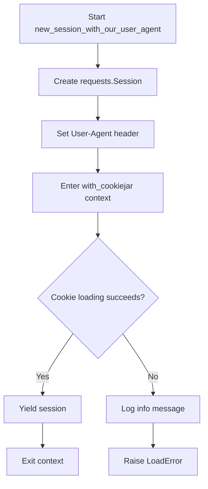
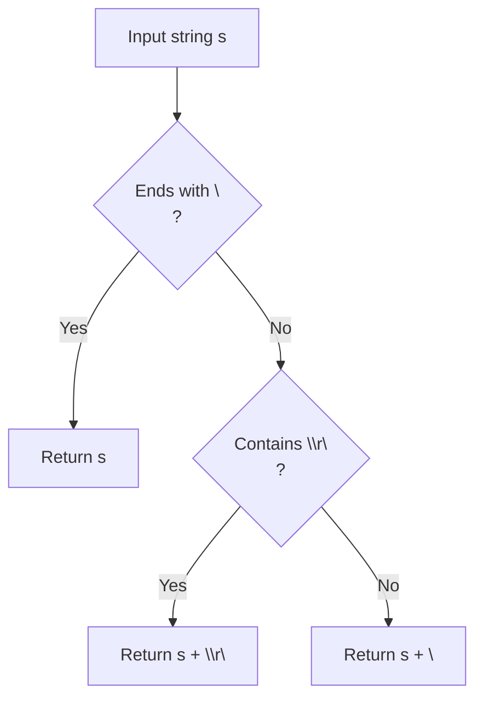
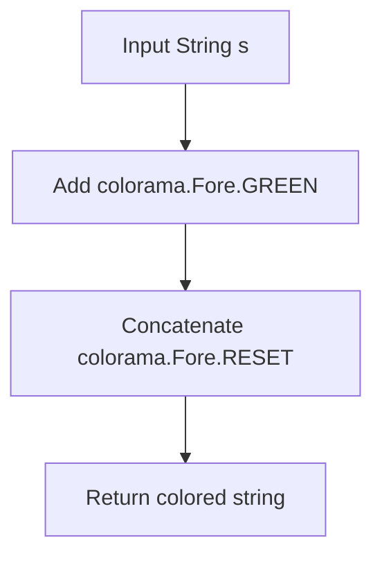
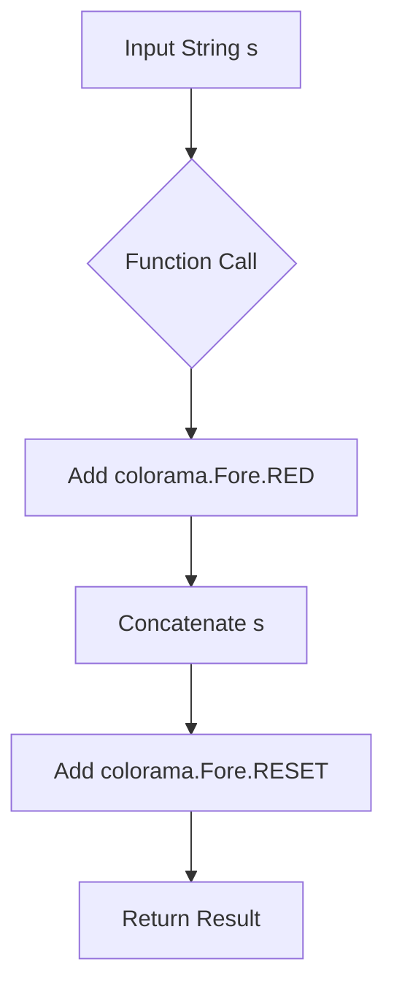
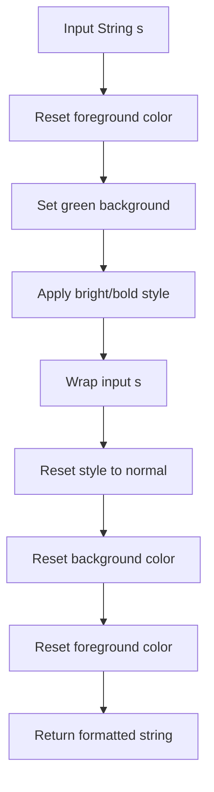
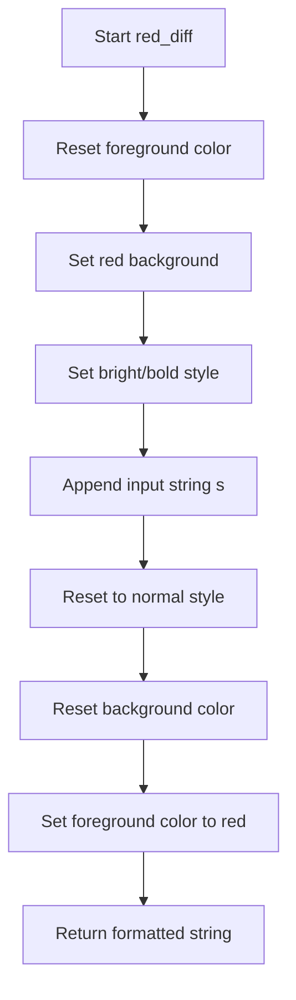
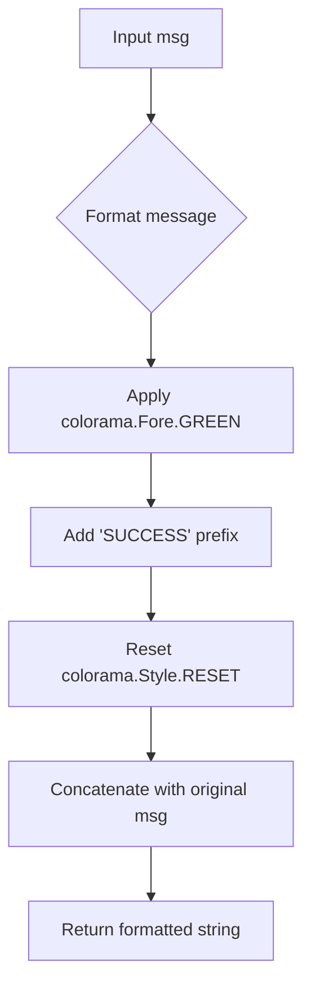
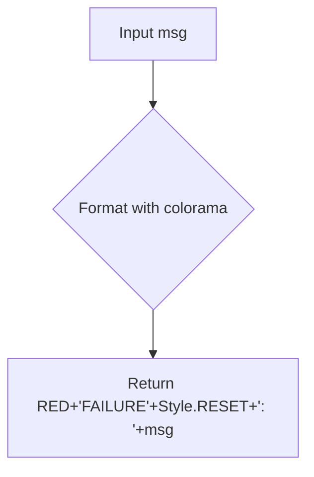

# `utils.py`

## `onlinejudge_command.utils.new_session_with_our_user_agent` · *function*

## Summary:
Creates a requests session with a custom user agent and cookie management for web interactions.

## Description:
This function initializes a requests.Session object with a standardized User-Agent header that identifies the online judge command tool. It wraps the session with cookie management capabilities using a context manager, ensuring proper cookie persistence and cleanup. The function is designed to be used as a context manager to handle HTTP sessions with automatic cookie jar management.

## Args:
    path (pathlib.Path): Path to the cookie jar file for persistent cookie storage

## Returns:
    Iterator[requests.Session]: A context manager yielding a requests.Session configured with custom User-Agent and cookie handling

## Raises:
    http.cookiejar.LoadError: When the cookie jar file cannot be loaded due to corruption or permission issues

## Constraints:
    Preconditions:
        - The path parameter must point to a valid filesystem location where cookies can be read/written
        - The path should be writable to allow cookie persistence
    
    Postconditions:
        - The returned session will have a properly formatted User-Agent header
        - Cookie management is handled automatically through the context manager

## Side Effects:
    - Creates or modifies cookie jar file at the specified path
    - Logs the User-Agent header at debug level
    - May display informational log messages about broken cookie files

## Control Flow:


## Examples:
```python
# Basic usage as context manager
with new_session_with_our_user_agent(path=cookie_path) as session:
    response = session.get('https://example.com')
    # Session automatically handles cookies
```

## `onlinejudge_command.utils.textfile` · *function*

## Summary:
Normalizes text by ensuring it ends with a proper newline character.

## Description:
This utility function standardizes text line endings by ensuring the input string has a trailing newline. It handles different line ending conventions (Unix '\n', Windows '\r\n') appropriately to maintain consistent text formatting for file operations.

## Args:
    s (str): Input text string that may or may not have a trailing newline

## Returns:
    str: Text string guaranteed to end with a newline character ('\n' or '\r\n')

## Raises:
    None

## Constraints:
    Precondition: Input must be a string
    Postcondition: Output string will always end with a newline character

## Side Effects:
    None

## Control Flow:


## Examples:
    >>> textfile("hello")
    'hello\\n'
    
    >>> textfile("hello\\n")
    'hello\\n'
    
    >>> textfile("hello\\r\\nworld")
    'hello\\r\\nworld\\r\\n'
```

## `onlinejudge_command.utils.exec_command` · *function*

## Summary:
Executes a shell command with optional input, timeout, and memory profiling capabilities, returning execution statistics and process handle.

## Description:
This function provides a standardized way to execute shell commands while capturing execution time, memory usage (via GNU time), and command output. It handles cross-platform differences, proper process cleanup with timeouts, and manages input/output redirection. The function is designed to be a reliable wrapper around subprocess.Popen for executing external commands in the online judge system.

## Args:
    command_str (str): The shell command to execute as a string
    stdin (Optional[BinaryIO]): Input stream to connect to the process stdin (default: None)
    input (Optional[bytes]): Input data to send to the process (default: None)
    timeout (Optional[float]): Maximum time in seconds to wait for command completion (default: None)
    gnu_time (Optional[str]): Path to GNU time utility for memory profiling (default: None)

## Returns:
    Tuple[Dict[str, Any], subprocess.Popen]: A tuple containing:
        - Dictionary with keys:
          * 'answer' (bytes or None): Output from stdout of the executed command
          * 'elapsed' (float): Execution time in seconds
          * 'memory' (float or None): Peak memory usage in megabytes (only when gnu_time is provided)
        - The subprocess.Popen object representing the running process

## Raises:
    FileNotFoundError: When the command executable doesn't exist
    PermissionError: When the command executable lacks execution permissions

## Constraints:
    Preconditions:
        - command_str must be a valid shell command string
        - If input is provided, stdin must be None (they are mutually exclusive)
        - gnu_time path must be valid if specified
    Postconditions:
        - Process is properly terminated even on timeout
        - Memory measurement is only available when gnu_time is provided
        - Execution time is always measured regardless of gnu_time
        - The returned process object is in a terminated state

## Side Effects:
    - May write temporary files when gnu_time is used
    - May spawn external processes
    - Writes error messages to stderr when command fails to execute
    - May send SIGTERM signals to child processes on timeout
    - Modifies process group membership when using GNU time on POSIX systems

## Control Flow:
```mermaid
flowchart TD
    A[Start exec_command] --> B{input provided?}
    B -- Yes --> C[Assert stdin is None, set stdin to subprocess.PIPE]
    B -- No --> C
    C --> D{gnu_time provided?}
    D -- Yes --> E[Create temp file context]
    D -- No --> F[Use contextlib.ExitStack]
    E --> G[Wrap with context manager]
    F --> G
    G --> H[Split command string with shlex.split]
    H --> I{gnu_time provided?}
    I -- Yes --> J[Prepend GNU time arguments: -f %M -o temp_file --]
    I -- No --> K[Continue with original command]
    J --> K
    K --> L{Windows OS?}
    L -- Yes --> M[Encode/decode command string for Windows compatibility]
    L -- No --> N[Continue]
    M --> N
    N --> O[Record start time with perf_counter]
    O --> P{GNU time and POSIX?}
    P -- Yes --> Q[Set preexec_fn=os.setsid for process group management]
    P -- No --> R[Set preexec_fn=None]
    Q --> R
    R --> S[Create subprocess.Popen with stdin, stdout=subprocess.PIPE, stderr=sys.stderr]
    S --> T{Process creation failed?}
    T -- Yes --> U[Log error and exit with sys.exit(1)]
    T -- No --> V[Call proc.communicate with input and timeout]
    V --> W{Timeout occurred?}
    W -- Yes --> X[Handle timeout cleanup]
    W -- No --> X
    X --> Y[Cleanup process with signal handling]
    Y --> Z[Record end time with perf_counter]
    Z --> AA{gnu_time used?}
    AA -- Yes --> AB[Read memory from temp file]
    AB --> AC[Parse memory value from last line if it's numeric]
    AC --> AD[Update info dict with memory value in MB]
    AA -- No --> AD
    AD --> AE[Return info dictionary and process]
```

## Examples:
```python
# Basic command execution
info, proc = exec_command("echo hello")
print(f"Output: {info['answer']}")
print(f"Time: {info['elapsed']}s")

# Command with input data (cannot provide stdin when using input)
info, proc = exec_command("cat", input=b"hello world")

# Command with timeout
info, proc = exec_command("sleep 10", timeout=5.0)

# Command with memory profiling using GNU time
info, proc = exec_command("python script.py", gnu_time="/usr/bin/time")
print(f"Memory: {info['memory']}MB")

# Command with stdin stream (cannot provide input when using stdin)
import io
stdin_stream = io.BytesIO(b"test input")
info, proc = exec_command("wc -l", stdin=stdin_stream)
```

## `onlinejudge_command.utils.green` · *function*

## Summary:
Wraps a string with ANSI color codes to display it in green.

## Description:
This utility function applies green color formatting to text using colorama library. It is commonly used to highlight success messages, important information, or positive feedback in command-line interfaces.

## Args:
    s (str): The input string to be colored green.

## Returns:
    str: The input string wrapped with ANSI green color codes followed by reset codes.

## Raises:
    None: This function does not raise any exceptions.

## Constraints:
    Preconditions:
        - Input must be a string
    Postconditions:
        - Output string contains ANSI escape sequences for green coloring
        - The original string content is preserved, only coloring is added

## Side Effects:
    None: This function has no side effects beyond returning a modified string.

## Control Flow:


## Examples:
```python
# Basic usage
result = green("Success!")
# Returns: '\x1b[32mSuccess!\x1b[0m'

# In a CLI context
print(green("Operation completed successfully"))
# Displays "Operation completed successfully" in green
```

## `onlinejudge_command.utils.red` · *function*

## Summary:
Returns a string with ANSI red color codes applied for terminal text formatting.

## Description:
Wraps the input string with colorama red foreground color codes to display text in red in terminal environments. This utility function provides consistent colored output formatting throughout the application.

## Args:
    s (str): The input string to be formatted with red color codes.

## Returns:
    str: The input string wrapped with ANSI red color codes followed by reset codes.

## Raises:
    None: This function does not raise any exceptions.

## Constraints:
    Preconditions: The input must be a string.
    Postconditions: The returned string contains ANSI color escape sequences for red text.

## Side Effects:
    None: This function has no side effects beyond returning a modified string.

## Control Flow:


## Examples:
    >>> red("Error message")
    '\x1b[31mError message\x1b[0m'
    
    >>> print(red("Important notice"))
    # Prints "Important notice" in red in terminal

## `onlinejudge_command.utils.green_diff` · *function*

## Summary:
Returns a string formatted with ANSI escape codes to display text with a bright green background in terminal environments.

## Description:
This function applies terminal color formatting using colorama escape sequences to highlight text with a green background. It's designed for terminal-based user interfaces where visual distinction is needed for important information such as successful operations, differences in output, or positive status indicators.

The function serves as a utility for creating visually distinct terminal output in command-line applications. Rather than hardcoding color codes throughout the application, this centralized function ensures consistent color formatting.

## Args:
    s (str): The input string to be formatted with green background coloring

## Returns:
    str: The input string wrapped with ANSI escape codes that produce green background coloring in terminals:
         - Resets foreground color (colorama.Fore.RESET)
         - Sets green background (colorama.Back.GREEN) 
         - Applies bright/bold style (colorama.Style.BRIGHT)
         - Resets style to normal (colorama.Style.NORMAL)
         - Resets background color (colorama.Back.RESET)
         - Resets foreground color (colorama.Fore.GREEN)

## Raises:
    None: This function does not raise any exceptions

## Constraints:
    Preconditions:
    - Input must be a string
    - Colorama must be properly initialized in the environment for colors to appear
    
    Postconditions:
    - Output string contains ANSI escape sequences for terminal coloring
    - Original string content is preserved within the formatting

## Side Effects:
    None: This function is pure and has no side effects beyond returning a formatted string

## Control Flow:


## Examples:
    # Basic usage
    result = green_diff("Test output")
    # Returns: "\x1b[0m\x1b[42m\x1b[1mTest output\x1b[22m\x1b[49m\x1b[32m"
    
    # In context of terminal output
    print(green_diff("SUCCESS"))
    # Displays "SUCCESS" with green background in terminal
    
    # Usage in a command-line tool context
    status = green_diff("✓ PASSED")
    print(status)  # Shows "✓ PASSED" with green background

## `onlinejudge_command.utils.red_diff` · *function*

## Summary:
Formats a string with red background and bright text styling for terminal output highlighting.

## Description:
Applies ANSI color codes to format text with a red background and bright/bold styling. This utility function is used to create visually distinct terminal output for emphasizing differences, errors, or important elements in command-line interfaces.

## Args:
    s (str): The input string to be formatted with red background and bright text styling.

## Returns:
    str: A string containing ANSI escape sequences that will render the input text with red background and bright formatting when displayed in a terminal.

## Raises:
    None: This function does not raise any exceptions.

## Constraints:
    Preconditions: The input must be a string.
    Postconditions: The returned string contains properly ordered ANSI escape codes for terminal formatting.

## Side Effects:
    None: This function has no side effects beyond returning a formatted string.

## Control Flow:


## Examples:
    >>> red_diff("error message")
    '\x1b[0m\x1b[41m\x1b[1merror message\x1b[22m\x1b[49m\x1b[31m'
    
    >>> red_diff("test")
    '\x1b[0m\x1b[41m\x1b[1mtest\x1b[22m\x1b[49m\x1b[31m'

## `onlinejudge_command.utils.success` · *function*

## Summary:
Formats a success message with green color coding for terminal output.

## Description:
Returns a formatted string that displays a success message in green text using colorama terminal formatting. This utility function standardizes success message presentation throughout the application.

## Args:
    msg (str): The success message to be formatted and displayed.

## Returns:
    str: A formatted success message string with green color coding followed by the original message.

## Raises:
    None: This function does not raise any exceptions.

## Constraints:
    Preconditions: The input message must be a string.
    Postconditions: The returned string will contain ANSI color codes for green text.

## Side Effects:
    None: This function has no side effects beyond returning a formatted string.

## Control Flow:


## Examples:
    >>> success("File downloaded successfully")
    '\x1b[32mSUCCESS\x1b[0m: File downloaded successfully'
    
    >>> success("Operation completed")
    '\x1b[32mSUCCESS\x1b[0m: Operation completed'

## `onlinejudge_command.utils.failure` · *function*

## Summary:
Formats an error message with red color coding for terminal display.

## Description:
This utility function wraps error messages in red color codes using colorama to visually distinguish failure messages in terminal output. It's designed to provide consistent error messaging formatting throughout the application.

## Args:
    msg (str): The error message to be formatted with red coloring.

## Returns:
    str: A formatted string with red color codes indicating a failure, following the pattern "FAILURE: [message]".

## Raises:
    None: This function does not raise any exceptions.

## Constraints:
    Preconditions: The input message must be a string.
    Postconditions: The returned string will always contain the word "FAILURE" in red followed by a colon and space, then the original message.

## Side Effects:
    None: This function has no side effects beyond returning a formatted string.

## Control Flow:


## Examples:
    >>> failure("Connection failed")
    '\x1b[31mFAILURE\x1b[0m: Connection failed'
    
    >>> failure("Invalid input")
    '\x1b[31mFAILURE\x1b[0m: Invalid input'

## `onlinejudge_command.utils.remove_suffix` · *function*

## Summary:
Removes a specified suffix from the end of a string.

## Description:
This function takes a string and removes the specified suffix from its end. It is designed to be a safe utility that ensures the string actually ends with the given suffix before performing the removal operation.

## Args:
    s (str): The input string from which to remove the suffix. Must end with the suffix parameter.
    suffix (str): The suffix to remove from the end of the input string. Must be a non-empty string.

## Returns:
    str: A new string with the suffix removed from the end of the input string.

## Raises:
    AssertionError: When the input string `s` does not end with the specified `suffix`.

## Constraints:
    Preconditions:
        - The input string `s` must end with the specified `suffix`
        - Both `s` and `suffix` must be non-empty strings
    Postconditions:
        - The returned string will be exactly `len(s) - len(suffix)` characters long
        - The returned string will be identical to `s` except for the removed suffix

## Side Effects:
    None

## Control Flow:
```mermaid
flowchart TD
    A[Start remove_suffix] --> B{Does s end with suffix?}
    B -- No --> C[AssertionError]
    B -- Yes --> D[Return s[:-len(suffix)]]
    C --> E[Exit with error]
    D --> F[End remove_suffix]
```

## Examples:
    >>> remove_suffix("hello.txt", ".txt")
    "hello"
    
    >>> remove_suffix("test_case_1", "_1")
    "test_case"
    
    >>> remove_suffix("example", "ample")
    "ex"
    
    >>> remove_suffix("no_suffix", "wrong")
    AssertionError: assertion failed
```

## `onlinejudge_command.utils.is_windows_subsystem_for_linux` · *function*

## Summary:
Determines whether the current execution environment is running under Windows Subsystem for Linux.

## Description:
This function identifies Windows Subsystem for Linux (WSL) environments by examining system identification information returned by the platform module. It serves as a platform detection utility to enable conditional behavior specific to WSL environments.

The function is extracted into its own utility to provide a clean abstraction for platform-specific logic, separating WSL detection concerns from application logic that might need to adapt to WSL's unique characteristics such as file system behavior or process management.

## Returns:
    bool: True if the current system is Linux and the release string contains 'microsoft', indicating WSL; False otherwise.

## Constraints:
    Preconditions: The platform module must be available and functional.
    Postconditions: The function always returns a boolean value based on the system identification.

## Side Effects:
    None: This function performs no I/O operations or state modifications.

## Control Flow:
```mermaid
flowchart TD
    A[Start] --> B{platform.uname().system == 'Linux'}
    B -- Yes --> C{'microsoft' in platform.uname().release.lower()}
    B -- No --> D[Return False]
    C -- Yes --> E[Return True]
    C -- No --> F[Return False]
    D --> G[End]
    E --> G
    F --> G
```

## `onlinejudge_command.utils.webbrowser_register_explorer_exe` · *function*

## Summary:
Registers the Windows Explorer browser for use in Windows Subsystem for Linux environments.

## Description:
This function configures the Python webbrowser module to use explorer.exe as the default browser when running in Windows Subsystem for Linux (WSL). It's specifically designed to handle the unique browser registration requirements in WSL environments where the standard browser detection may not work properly.

The function is extracted into its own utility to encapsulate platform-specific browser configuration logic, separating WSL-specific behavior from general application logic. This allows the application to gracefully handle browser opening in different execution environments without requiring inline platform detection logic.

## Args:
    None

## Returns:
    None

## Raises:
    None

## Constraints:
    Preconditions: 
    - The system must be running under Windows Subsystem for Linux (WSL)
    - The webbrowser module must be available
    - The explorer.exe executable must be accessible in the system PATH
    
    Postconditions:
    - The 'explorer' browser is registered with the webbrowser module
    - The registration is marked as preferred for Python 3.7+

## Side Effects:
    - Modifies the global webbrowser module's browser registry
    - No I/O operations or file system changes

## Control Flow:
```mermaid
flowchart TD
    A[Start] --> B{is_windows_subsystem_for_linux() == False}
    B -- Yes --> C[Return Early]
    B -- No --> D[Create GenericBrowser instance]
    D --> E{Python version < 3.7}
    E -- Yes --> F[Register with webbrowser.register]
    E -- No --> G[Register with preferred=True]
    F --> H[End]
    G --> H
```

## Examples:
```python
# Typical usage - called during application initialization
webbrowser_register_explorer_exe()

# After calling, explorer.exe can be used as a browser
import webbrowser
webbrowser.get('explorer').open('https://example.com')
```

## `onlinejudge_command.utils.get_default_command` · *function*

## Summary:
Returns the default executable filename based on the operating system platform.

## Description:
Provides platform-appropriate default filenames for compiled executables. This function abstracts platform-specific differences in executable naming conventions to ensure consistent behavior across operating systems.

## Args:
    None

## Returns:
    str: Platform-specific default executable name:
        - On Windows: '.\\a.exe' (Windows executable format)
        - On other platforms: './a.out' (Unix-like executable format)

## Raises:
    None

## Constraints:
    Preconditions:
        - The platform detection via `platform.system()` must work correctly
        - No input validation is performed as there are no parameters
    
    Postconditions:
        - Always returns a string representing a valid executable path pattern
        - The returned string follows standard conventions for the respective platform

## Side Effects:
    None

## Control Flow:
```mermaid
flowchart TD
    A[Start] --> B{platform.system() == 'Windows'?}
    B -- Yes --> C[Return '.\\a.exe']
    B -- No --> D[Return './a.out']
    C --> E[End]
    D --> E
```

## Examples:
```python
# On Windows
command = get_default_command()  # Returns '.\\a.exe'

# On Linux/MacOS
command = get_default_command()  # Returns './a.out'
```

