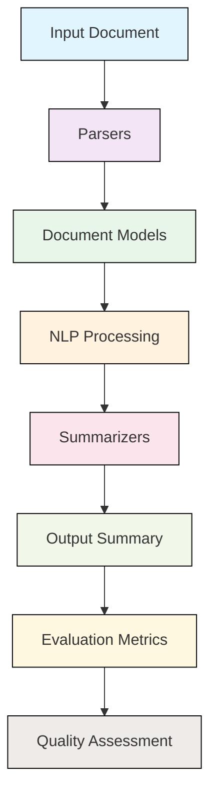

# `sumy`

## Repository Overview

### Tree Structure
```
sumy/
├── sumy/
│   ├── evaluation/          # Evaluation metrics and quality assessment
│   ├── models/              # Core data structures for document representation
│   ├── nlp/                 # Natural language processing utilities
│   ├── parsers/             # Document parsing for different input formats
│   ├── summarizers/         # Implementation of various summarization algorithms
│   ├── __main__.py          # Command-line interface entry point
│   ├── _compat.py           # Python 2/3 compatibility utilities
│   └── utils.py             # General utility functions
└── tasks.py                 # Development automation tasks (invoke-based)
```

### Purpose
The sumy repository provides a comprehensive framework for automatic text summarization with support for multiple algorithms, evaluation metrics, and processing pipelines. It addresses the need for flexible, extensible text summarization solutions that can handle various document formats and summarization approaches.

Target users include:
- Developers building text processing applications
- Researchers experimenting with different summarization algorithms  
- Data scientists working with large document collections
- NLP practitioners requiring robust summarization capabilities

The system positions itself as a library that can be integrated into larger applications or used via command-line interface for quick summarization tasks.

### Architecture


Key architectural patterns:
- Pipeline architecture for text processing workflow
- Modular design with clearly separated concerns
- Plugin-like structure for different summarization algorithms
- Unified interface for evaluation and comparison

### Entry Points
1. **CLI Interface**: `python -m sumy` or `sumy` command (via `__main__.py`)
2. **Importable API**: Direct module imports like `from sumy.summarizers import TextRankSummarizer`
3. **Task Runner**: `invoke` commands defined in `tasks.py` for development operations

### Core Features
1. **Multiple Summarization Algorithms**: Including TextRank, LexRank, Lsa, and others implemented in `summarizers/`
2. **Format Support**: Parsing of HTML, plain text, and other document formats via `parsers/`
3. **Evaluation Metrics**: Quality assessment using ROUGE, BLEU, and other metrics in `evaluation/`
4. **Language Processing**: Tokenization, stemming, and linguistic preprocessing in `nlp/`
5. **Extensible Design**: Easy addition of new algorithms and evaluation methods

### Dependencies
- **Internal**: Python packages within the sumy ecosystem
- **External**: 
  - `requests` for HTTP operations in parsers
  - `docopt` for command-line argument parsing
  - `breadability` for HTML content extraction
  - `nltk` for standard NLP operations
  - Various language-specific libraries for specialized processing

### Configuration
Configuration primarily happens through:
- Command-line arguments for CLI usage
- Runtime parameters passed to summarization functions
- Environment variables for external service access
- Module-level settings for different processing behaviors

### Extension Points
1. **New Summarization Algorithms**: Implement new classes inheriting from base summarizer interface
2. **Custom Parsers**: Add new document format handlers in the parsers module
3. **Evaluation Metrics**: Extend evaluation module with custom metrics
4. **NLP Processing**: Customize tokenization or linguistic processing steps
5. **Plugins**: Use the modular design to swap out components easily

---

## Modules

- [`sumy`](sumy.md)
- [`sumy/evaluation`](sumy/evaluation.md)
- [`sumy/models`](sumy/models.md)
- [`sumy/models/dom`](sumy/models/dom.md)
- [`sumy/nlp`](sumy/nlp.md)
- [`sumy/nlp/stemmers`](sumy/nlp/stemmers.md)
- [`sumy/parsers`](sumy/parsers.md)

