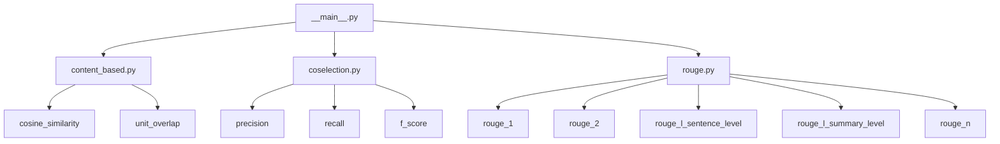

# `sumy.evaluation`

## Tree:
evaluation/
├── __main__.py
├── content_based.py
├── coselection.py
└── rouge.py

## Role:
The evaluation module provides utilities and metrics for assessing the quality of text summarization systems. It offers various evaluation approaches including content-based similarity measures, coselection metrics, and ROUGE metrics for comparing generated summaries against reference summaries.

## Description:
This module serves as the core evaluation framework for text summarization systems within the sumy library. It provides standardized metrics and utilities for comparing automatically generated summaries with reference summaries to quantify summarization quality.

The module is used primarily by:
- The command-line interface (`sumy.evaluation`) for automated evaluation workflows
- Internal testing frameworks for validating summarization algorithms
- Research and development environments for comparing different summarization approaches

The components are grouped together because they all address the fundamental problem of evaluating text summarization quality using different computational approaches and metrics. This cohesion allows users to easily switch between evaluation methodologies without changing their overall evaluation pipeline structure.

## Components:
- **__main__.py**: Contains command-line interface functions and factory methods for creating summarizers, as well as evaluation functions for cosine similarity and unit overlap.
- **content_based.py**: Provides content-based similarity metrics such as cosine similarity and unit overlap between document models.
- **coselection.py**: Implements evaluation metrics for comparing sentence selections using precision, recall, and F-score approaches.
- **rouge.py**: Offers ROUGE (Recall-Oriented Understudy for Gisting Evaluation) metrics including ROUGE-1, ROUGE-2, and ROUGE-L for comprehensive text summarization evaluation.

## Public API:
- **build_edmundson(parser, language)**: Creates an Edmundson summarizer with language-specific configurations
- **build_kl(parser, language)**: Creates a Kullback-Leibler summarizer with language-specific configurations  
- **build_lex_rank(parser, language)**: Creates a LexRank summarizer with language-specific configurations
- **build_lsa(parser, language)**: Creates an LSA summarizer with language-specific configurations
- **build_luhn(parser, language)**: Creates a Luhn summarizer with language-specific configurations
- **build_random(parser, language)**: Creates a Random summarizer (ignores parameters)
- **build_sum_basic(parser, language)**: Creates a SumBasic summarizer with language-specific configurations
- **build_text_rank(parser, language)**: Creates a TextRank summarizer with language-specific configurations
- **evaluate_cosine_similarity(evaluated_sentences, reference_sentences)**: Computes cosine similarity between sentence collections
- **evaluate_unit_overlap(evaluated_sentences, reference_sentences)**: Computes unit overlap similarity between sentence collections
- **handle_arguments(args)**: Processes command-line arguments for evaluation workflow
- **main(args)**: Entry point for the evaluation command-line tool
- **cosine_similarity(evaluated_model, reference_model)**: Computes cosine similarity between document models
- **unit_overlap(evaluated_model, reference_model)**: Computes unit overlap similarity between document models
- **precision(evaluated_sentences, reference_sentences)**: Calculates precision metric for sentence selection
- **recall(evaluated_sentences, reference_sentences)**: Calculates recall metric for sentence selection
- **f_score(evaluated_sentences, reference_sentences, weight)**: Calculates F-score combining precision and recall
- **rouge_1(evaluated_sentences, reference_sentences)**: Computes ROUGE-1 metric (unigram overlap)
- **rouge_2(evaluated_sentences, reference_sentences)**: Computes ROUGE-2 metric (bigram overlap)
- **rouge_l_sentence_level(evaluated_sentences, reference_sentences)**: Computes ROUGE-L sentence-level metric
- **rouge_l_summary_level(evaluated_sentences, reference_sentences)**: Computes ROUGE-L summary-level metric
- **rouge_n(evaluated_sentences, reference_sentences, n)**: Computes ROUGE-N metric for n-gram overlap

## Dependencies:
- **Internal imports**:
  - `sumy.models.TfDocumentModel`: Used for document model representations in content-based evaluation
  - `sumy.parsers`: Used for document parsing in summarizer builders
  - `sumy.summarizers`: Used for accessing different summarizer implementations
  - `sumy.nlp.tokenizers`: Used for text tokenization in summarizer builders
  - `sumy.utils`: Used for utility functions like ItemsCount
- **External imports**:
  - `docopt`: Used for command-line argument parsing in the main module
  - `numpy`: Used in LSA summarizer for mathematical operations
  - Standard library modules: `sys`, `urllib`, `os`, `io` for file operations and system interactions

## Constraints:
- All evaluation functions expect sentence collections to be properly formatted with valid Sentence objects
- Language parameters must be supported by the underlying stemmer and stop-word implementations
- Some functions require specific data structures (like TfDocumentModel) for proper operation
- Command-line interface functions require proper argument formatting and validation
- Thread-safety: Most functions are stateless and thus thread-safe, though some may depend on global configuration
- Initialization prerequisites: Language-specific resources must be available for language-dependent functions

---

## Files

- [`__main__.py`](evaluation/__main__.md)
- [`content_based.py`](evaluation/content_based.md)
- [`coselection.py`](evaluation/coselection.md)
- [`rouge.py`](evaluation/rouge.md)

