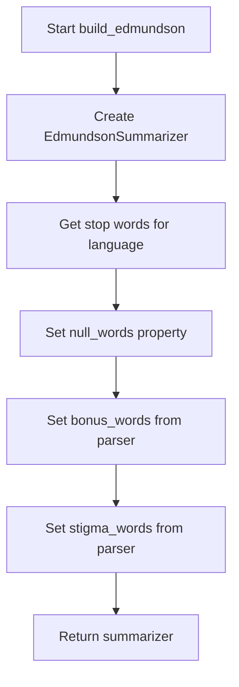
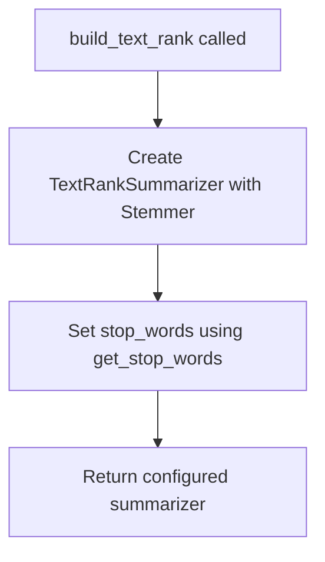
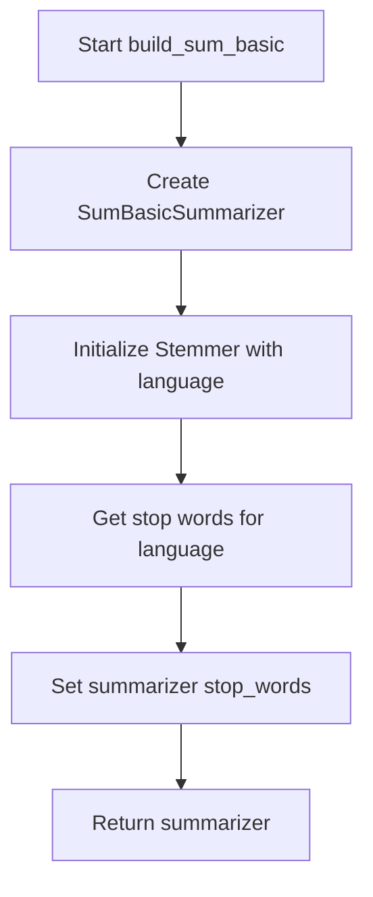
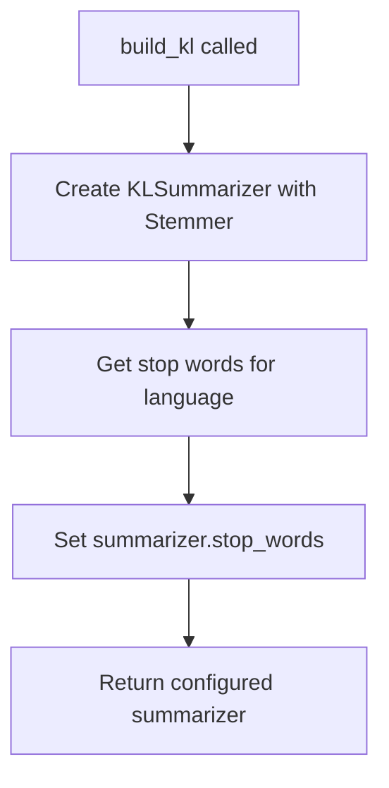
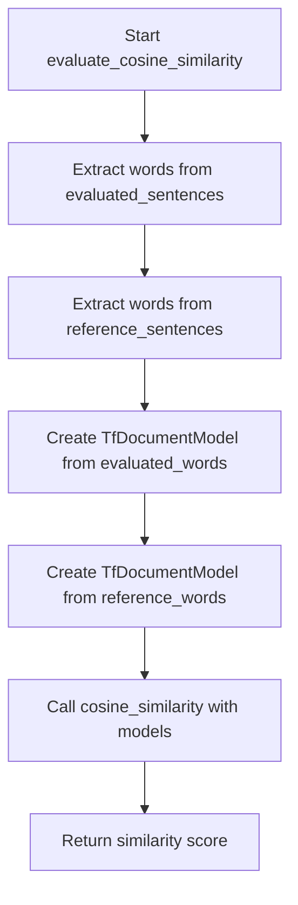
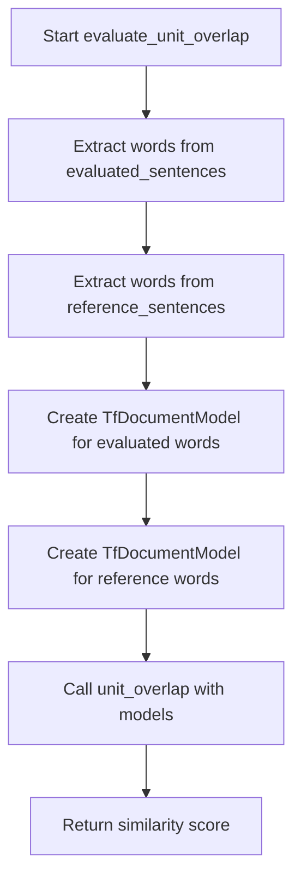
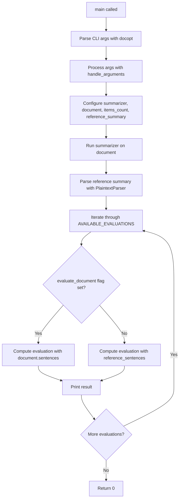

# `__main__.py`

## `sumy.evaluation.__main__.build_random` · *function*

## Summary:
Creates and returns a new RandomSummarizer instance without requiring language or parser configuration.

## Description:
This factory function instantiates a RandomSummarizer object for use in document summarization. Unlike other build functions in the module that configure summarizers with language-specific settings and parser-derived data, this function simply returns a new RandomSummarizer instance without utilizing the provided parameters. It serves as a minimal configuration entry point for the random summarization algorithm.

The function is part of a consistent factory pattern used throughout the evaluation module where different summarizer types are created through dedicated build functions. This particular function exists to maintain uniformity in the interface while providing a simple instantiation mechanism for the RandomSummarizer. The parameters are accepted for consistency with other build functions but are intentionally ignored since the RandomSummarizer does not require language-specific configuration or parser-dependent data.

## Args:
    parser: Document parser instance (ignored in current implementation)
    language (str): Language code string (ignored in current implementation)

## Returns:
    RandomSummarizer: A newly created RandomSummarizer instance ready for text summarization

## Raises:
    None

## Constraints:
    Preconditions:
        - Parameters are accepted for interface consistency with other build functions
        - No validation is performed on the parameters since they are unused
        
    Postconditions:
        - Returns a properly initialized RandomSummarizer instance
        - The returned instance is not configured with language-specific settings

## Side Effects:
    None

## Control Flow:
```mermaid
flowchart TD
    A[build_random called] --> B[Create RandomSummarizer()]
    B --> C[Return summarizer instance]
```

## Examples:
```python
# Basic usage in command-line interface context
from parsers.plaintext import PlaintextParser
from nlp.tokenizers import Tokenizer

parser = PlaintextParser.from_string("Sample text for summarization.", Tokenizer("english"))
summarizer = build_random(parser, "english")
# Note: parser and language parameters are ignored in this implementation
```

## `sumy.evaluation.__main__.build_luhn` · *function*

## Summary:
Creates and configures a Luhn summarizer with language-specific stemming and stop words.

## Description:
Constructs a LuhnSummarizer instance initialized with a stemmer appropriate for the specified language and configures it with language-specific stop words. This function encapsulates the setup logic for creating a Luhn summarizer, separating the configuration concerns from the main summarization pipeline.

The Luhn algorithm is a text summarization technique that ranks sentences based on the frequency of significant words. This function ensures proper initialization of the summarizer with linguistic preprocessing tools.

## Args:
    parser: Document parser instance (unused in current implementation but passed for consistency)
    language (str): Language code string (e.g., 'english', 'french') used to select appropriate stemmer and stop words

## Returns:
    LuhnSummarizer: A configured summarizer instance ready for text summarization tasks

## Raises:
    LookupError: When stop-words are not available for the specified language
    ValueError: When the stemmer is not callable (though this is handled by parent class)

## Constraints:
    Preconditions:
        - Language parameter must be a valid language identifier recognized by the system
        - Parser parameter is accepted but not used in the current implementation
    
    Postconditions:
        - Returned summarizer instance is properly initialized with stemmer and stop words
        - Stop words are normalized and stored as frozenset for efficient lookup

## Side Effects:
    None

## Control Flow:
```mermaid
flowchart TD
    A[build_luhn called] --> B[Create LuhnSummarizer]
    B --> C[Initialize with Stemmer(language)]
    C --> D[Get stop words for language]
    D --> E[Set summarizer.stop_words]
    E --> F[Return summarizer]
```

## Examples:
```python
# Basic usage
parser = PlaintextParser.from_string("Sample text for summarization.", Tokenizer("english"))
summarizer = build_luhn(parser, "english")
```

## `sumy.evaluation.__main__.build_edmundson` · *function*

## Summary:
Configures and returns an Edmundson summarizer with language-specific stop words and parser-derived significant/stigma words.

## Description:
Creates and initializes an EdmundsonSummarizer instance with appropriate stemming, stop words, and parser-derived word collections for bonus and stigma words. This function encapsulates the configuration logic for the Edmundson summarization algorithm, separating the setup concerns from the execution logic. The function is typically used in command-line interfaces to prepare summarizers for text processing.

## Args:
    parser: A document parser instance (either HtmlParser or PlaintextParser) that provides significant_words and stigma_words properties
    language (str): Language code string used to initialize the stemmer and fetch stop words

## Returns:
    EdmundsonSummarizer: A configured summarizer instance ready for text summarization

## Raises:
    LookupError: When stop-words are not available for the specified language
    ValueError: When negative weights are provided to the summarizer (inherited from AbstractSummarizer)

## Constraints:
    Preconditions:
        - Parser must have significant_words and stigma_words properties that return iterable collections of words
        - Language must be supported by the stemmer implementation
        - Parser must be properly initialized with document content
    Postconditions:
        - Returned summarizer is fully configured with stemmer, stop words, bonus words, and stigma words
        - All word collections are converted to frozensets and stemmed appropriately through the summarizer's setter methods

## Side Effects:
    None

## Control Flow:


## Examples:
```python
# Basic usage with HTML parser
parser = HtmlParser.from_string(html_content, "http://example.com", Tokenizer("english"))
summarizer = build_edmundson(parser, "english")

# Basic usage with plaintext parser  
parser = PlaintextParser.from_string(text_content, Tokenizer("english"))
summarizer = build_edmundson(parser, "english")
```

## `sumy.evaluation.__main__.build_lsa` · *function*

## Summary
Creates and configures an LSA (Latent Semantic Analysis) summarizer with language-specific stemming and stop words.

## Description
This function constructs an LSA summarizer instance initialized with a stemmer appropriate for the specified language and configures it with the standard stop words for that language. The LSA summarizer uses mathematical techniques to identify the most important sentences in a document by analyzing word co-occurrence patterns in a term-document matrix.

## Args
    parser: The parser object (not directly used in the function, but likely passed for consistency with other builder functions)
    language (str): Language code (e.g., 'english', 'french') specifying the language for stemming and stop words

## Returns
    LsaSummarizer: A configured LSA summarizer instance ready for document summarization

## Raises
    LookupError: When stop-words are not available for the specified language
    ValueError: When NumPy dependency is missing (raised by LsaSummarizer internally)

## Constraints
    Preconditions:
        - Language parameter must be a valid language identifier recognized by the system
        - Stop-word data files must exist for the specified language
    Postconditions:
        - Returns a fully configured LsaSummarizer instance
        - The returned summarizer has stop_words property properly set

## Side Effects
    None

## Control Flow
```mermaid
flowchart TD
    A[build_lsa called] --> B[LsaSummarizer created with Stemmer(language)]
    B --> C[stop_words set using get_stop_words(language)]
    C --> D[Return configured summarizer]
```

## Examples
```python
# Basic usage
parser = PlaintextParser.from_string("Sample text for summarization.", Tokenizer("english"))
summarizer = build_lsa(parser, "english")
```

## `sumy.evaluation.__main__.build_text_rank` · *function*

## Summary:
Creates and configures a TextRank summarizer with language-specific stemming and stop words.

## Description:
This function constructs a TextRankSummarizer instance with appropriate language processing capabilities. It initializes the summarizer with a stemmer for the specified language and configures it with stop words for that language. The function serves as a factory method for creating properly initialized TextRank summarizers.

## Args:
    parser: Parser object (not used in current implementation)
    language (str): Language code string specifying the language for processing (e.g., 'english', 'french')

## Returns:
    TextRankSummarizer: A configured TextRankSummarizer instance ready for text summarization

## Raises:
    LookupError: When stop-words are not available for the specified language
    LookupError: When a stemmer is not available for the specified language

## Constraints:
    Preconditions:
    - The language parameter must be a valid language identifier recognized by the system
    
    Postconditions:
    - Returns a fully configured TextRankSummarizer instance
    - The returned summarizer has stop_words properly set for the specified language

## Side Effects:
    None

## Control Flow:


## Examples:
```python
# Basic usage in a summarization pipeline
parser = PlaintextParser.from_string("Sample text for summarization.", Tokenizer("english"))
summarizer = build_text_rank(parser, "english")
```

## `sumy.evaluation.__main__.build_lex_rank` · *function*

## Summary:
Creates and configures a LexRank summarizer with language-specific stemming and stop words.

## Description:
This function serves as a factory method for creating LexRankSummarizer instances. It initializes the summarizer with a stemmer appropriate for the specified language and configures it with the standard stop words for that language. The function follows a consistent builder pattern used throughout the evaluation module for creating various summarizer types, where different builder functions accept similar parameters but use them appropriately.

## Args:
    parser: Parser object (accepted for interface consistency but not utilized in this implementation)
    language (str): Language code string (e.g., 'english', 'german') for which to configure the summarizer

## Returns:
    LexRankSummarizer: A configured LexRankSummarizer instance ready for text summarization

## Raises:
    LookupError: When stop-words are not available for the specified language
    LookupError: When a stemmer is not available for the specified language

## Constraints:
    Preconditions:
        - Language parameter must be a valid language identifier recognized by the system
        - Stop-word files must exist for the specified language
        - Stemmer implementations must exist for the specified language
    
    Postconditions:
        - Returned summarizer is properly initialized with language-specific stemmer
        - Returned summarizer has stop_words property set to language-appropriate stop words

## Side Effects:
    - None

## Control Flow:
```mermaid
flowchart TD
    A[build_lex_rank called] --> B{Language valid?}
    B -- Yes --> C[Create LexRankSummarizer with Stemmer(language)]
    B -- No --> D[Raise LookupError]
    C --> E[Set stop_words from get_stop_words(language)]
    E --> F[Return summarizer]
```

## Examples:
```python
# Basic usage
from parsers.plaintext import PlaintextParser
from nlp.tokenizers import Tokenizer

parser = PlaintextParser.from_string("Sample text for summarization.", Tokenizer("english"))
summarizer = build_lex_rank(parser, "english")
```

## `sumy.evaluation.__main__.build_sum_basic` · *function*

## Summary:
Creates and configures a SumBasicSummarizer instance with language-specific stemming and stop words.

## Description:
This function constructs a SumBasicSummarizer object initialized with a stemmer appropriate for the specified language and configures it with the standard stop words for that language. The function serves as a factory method for creating properly initialized SumBasic summarizers.

The SumBasic algorithm is a statistical approach to text summarization that repeatedly selects sentences based on word frequency, reducing the frequency of selected words to avoid redundancy. This function ensures the summarizer is properly configured with linguistic resources needed for effective summarization.

## Args:
    parser: Parser object (unused in current implementation, likely part of a common interface)
    language (str): Language code string (e.g., 'english', 'german') specifying the language for processing

## Returns:
    SumBasicSummarizer: A configured summarizer instance ready for text summarization tasks

## Raises:
    LookupError: When the specified language is not supported or stop-words data is unavailable for the language

## Constraints:
    Preconditions:
        - The language parameter must be a valid language identifier recognized by the system
        - Stop-word data files must exist for the specified language
    Postconditions:
        - Returns a SumBasicSummarizer instance with properly initialized stemmer and stop words
        - The returned summarizer is ready to be used with the summarize method

## Side Effects:
    - Reads stop-word data from filesystem resources
    - May raise LookupError if language is unsupported

## Control Flow:


## Examples:
```python
# Basic usage
parser = PlaintextParser.from_string("Sample text for summarization.", Tokenizer("english"))
summarizer = build_sum_basic(parser, "english")
```

## `sumy.evaluation.__main__.build_kl` · *function*

## Summary:
Creates and configures a Kullback-Leibler divergence-based summarizer with language-specific stemming and stop words.

## Description:
This factory function initializes a KLSummarizer instance with appropriate language processing capabilities. It sets up the summarizer with a stemmer for the specified language and loads the corresponding stop words, making it ready for document summarization using the KL divergence algorithm.

## Args:
    parser (object): Document parser object that provides access to document structure
    language (str): Language code string (e.g., 'english', 'french') for language-specific processing

## Returns:
    KLSummarizer: Configured summarizer instance ready for document summarization

## Raises:
    LookupError: When the specified language is not supported for stemming or stop words

## Constraints:
    Preconditions:
        - language parameter must be a valid language identifier recognized by the system
        - parser must be a valid document parser object with proper document structure access
    
    Postconditions:
        - Returned summarizer instance has stop_words attribute properly initialized
        - Returned summarizer instance has a stemmer configured for the specified language

## Side Effects:
    None

## Control Flow:


## Examples:
```python
# Basic usage
parser = PlaintextParser.from_file("document.txt", Tokenizer("english"))
summarizer = build_kl(parser, "english")

# Using with HTML parser
parser = HtmlParser.from_url("https://example.com/article", Tokenizer("english"))
summarizer = build_kl(parser, "english")
```

## `sumy.evaluation.__main__.evaluate_cosine_similarity` · *function*

## Summary:
Computes the cosine similarity between two sets of sentences represented as TF document models.

## Description:
This function evaluates the semantic similarity between two collections of sentences by converting them into TF (Term Frequency) document models and calculating their cosine similarity. It's commonly used in evaluating the quality of text summarization by comparing the summarized content against reference content.

The function extracts words from each sentence in both evaluated and reference sets, constructs TF document models from these word sequences, and then computes the cosine similarity between these models using the standard vector space model approach.

## Args:
    evaluated_sentences (Iterable[Sentence]): Collection of sentences to be evaluated for similarity. Each sentence must have a `words` attribute containing a sequence of words.
    reference_sentences (Iterable[Sentence]): Collection of reference sentences to compare against. Each sentence must have a `words` attribute containing a sequence of words.

## Returns:
    float: Cosine similarity score between 0 and 1, where 1 indicates identical documents and 0 indicates no similarity.

## Raises:
    ValueError: If either of the document models is empty (magnitude equals zero) or if the arguments are not instances of TfDocumentModel.

## Constraints:
    Preconditions:
        - Both `evaluated_sentences` and `reference_sentences` must be iterable collections of Sentence objects
        - Each Sentence object must have a `words` attribute containing a sequence of words
        - The `words` attribute of each sentence must be a sequence that can be processed by the TfDocumentModel constructor
    
    Postconditions:
        - Returns a float value in the range [0, 1]
        - The returned value represents the cosine similarity between the two document models

## Side Effects:
    None

## Control Flow:


## Examples:
    # Basic usage
    similarity = evaluate_cosine_similarity(evaluated_sentences, reference_sentences)
    
    # Typical usage in summarization evaluation
    from sumy.evaluation.__main__ import evaluate_cosine_similarity
    from sumy.parsers.plaintext import PlaintextParser
    from sumy.summarizers.lsa import LsaSummarizer
    
    parser = PlaintextParser.from_file("document.txt")
    summarizer = LsaSummarizer()
    summary = summarizer(parser.document, 3)
    
    reference_parser = PlaintextParser.from_file("reference.txt")
    similarity = evaluate_cosine_similarity(summary, reference_parser.document.sentences)

## `sumy.evaluation.__main__.evaluate_unit_overlap` · *function*

## Summary:
Computes the unit overlap similarity between two sets of sentences by converting them to TF document models and calculating their term overlap ratio.

## Description:
This function evaluates the similarity between two sets of sentences using the unit overlap metric. It extracts all words from each sentence in both evaluated and reference sets, converts them into TF (Term Frequency) document models, and then calculates the similarity based on the overlap of terms between these models. This approach is commonly used in text summarization evaluation to measure how much the terms in the generated summary overlap with the reference summary.

The function serves as a bridge between sentence collections and the unit overlap calculation, abstracting away the complexity of model creation and term extraction.

## Args:
    evaluated_sentences (Iterable[Sentence]): An iterable of sentence objects containing word information to be evaluated.
    reference_sentences (Iterable[Sentence]): An iterable of sentence objects containing word information to serve as reference.

## Returns:
    float: The unit overlap similarity score between 0 and 1, where 1 indicates identical term sets and 0 indicates no overlapping terms. Returns 0 when there are no common terms between the sets.

## Raises:
    ValueError: If either evaluated_sentences or reference_sentences contains empty documents, or if the arguments are not properly formatted.

## Constraints:
    Preconditions:
    - Both evaluated_sentences and reference_sentences must be iterable collections of sentence objects
    - Each sentence object must have a 'words' attribute containing a sequence of words
    - Neither evaluated_sentences nor reference_sentences can be empty collections
    
    Postconditions:
    - Returns a float value between 0 and 1 inclusive
    - The returned value represents the normalized overlap between term sets according to the unit overlap formula

## Side Effects:
    None

## Control Flow:


## Examples:
    # Basic usage with sentence objects
    similarity = evaluate_unit_overlap([sent1, sent2], [ref_sent1, ref_sent2])
    
    # Usage in evaluation pipeline
    score = evaluate_unit_overlap(generated_summary_sentences, reference_summary_sentences)
``

## `sumy.evaluation.__main__.main` · *function*

## Summary:
Entry point for the sumy text summarization evaluation command-line tool that computes various evaluation metrics comparing generated summaries against reference summaries.

## Description:
This function serves as the primary execution point for the sumy evaluation module, processing command-line arguments to configure document parsing, select summarization methods, and run comparative evaluation against reference summaries. It orchestrates the complete evaluation pipeline from argument parsing through summarization to metric computation and output.

## Args:
    args (list[str], optional): Command-line arguments to parse. If None, sys.argv is used. Expected arguments include:
        - --url: URL of document to summarize
        - --file: Path to local document file  
        - --text: Direct text input for summarization
        - --format: Document format (html, plaintext)
        - --language: Language for tokenization and processing
        - --length: Number of items (sentences/words) for summary length
        - --<method>: Boolean flags for different summarization methods (e.g., --luhn, --text-rank)
        - <reference_summary>: Path to reference summary file

## Returns:
    int: Exit status code (0 for success)

## Raises:
    None explicitly raised - relies on underlying components for error handling

## Constraints:
    Preconditions:
    - At least one input source (--url, --file, or stdin) must be provided
    - Valid language specification must be provided
    - Reference summary file must exist and be readable
    - At least one summarization method flag must be specified
    - Available evaluation metrics must be defined in AVAILABLE_EVALUATIONS

    Postconditions:
    - All evaluation metrics are computed and printed to stdout
    - Function returns successfully with exit code 0

## Side Effects:
    - Reads from filesystem when --file argument is provided
    - Makes HTTP request when --url argument is provided
    - Reads from stdin when no explicit input source is specified
    - Prints evaluation results to standard output
    - Opens and reads reference summary file

## Control Flow:


## Examples:
    # Evaluate a document from URL using Luhn algorithm against reference summary
    python -m sumy.evaluation --url https://example.com/article --length 5 --luhn --language english /path/to/reference.txt
    
    # Evaluate a local file using TextRank algorithm with percentage-based length
    python -m sumy.evaluation --file /path/to/document.txt --length 20% --text-rank --language english /path/to/reference.txt

## `sumy.evaluation.__main__.handle_arguments` · *function*

## Summary:
Processes command-line arguments to configure document parsing, summarization method selection, and loads reference summary for evaluation.

## Description:
This function serves as the argument handler for the sumy evaluation module's command-line interface. It determines the appropriate document parser based on input source (URL, file, or stdin), selects a summarization method from available options, and prepares the reference summary for comparison. The function orchestrates the setup of all necessary components for running automated text summarization evaluation.

## Args:
    args (dict): Dictionary containing parsed command-line arguments with keys:
        - "--format": Document format identifier (e.g., "html", "plaintext")
        - "--url": URL of document to summarize
        - "--file": Path to local document file
        - "--language": Language for tokenization and processing
        - "--length": Number of items (sentences/words) for summary length
        - "<reference_summary>": Path to reference summary file
        - Boolean flags for different summarization methods (e.g., "--luhn", "--text-rank", "--lex-rank")

## Returns:
    tuple: Four-element tuple containing:
        - summarizer_builder: Callable that creates a summarizer instance with the selected method
        - document: Parsed document object ready for summarization
        - items_count: ItemsCount object specifying desired summary length
        - reference_summmary: String content of the reference summary file

## Raises:
    ValueError: When an unsupported document format is specified via --format flag

## Constraints:
    Preconditions:
        - At least one of --url, --file, or stdin input must be provided
        - Valid language specification must be provided
        - Reference summary file must exist and be readable
        - At least one summarization method flag must be specified
    
    Postconditions:
        - All returned objects are properly initialized and configured
        - Parser is correctly instantiated with document content and tokenizer
        - Reference summary is decoded as UTF-8 string

## Side Effects:
    - Reads from filesystem when --file is specified
    - Makes HTTP request when --url is specified
    - Reads from stdin when neither --url nor --file is specified
    - Opens and reads reference summary file

## Control Flow:
```mermaid
flowchart TD
    A[Start handle_arguments] --> B{--format provided?}
    B -- Yes --> C{--format in PARSERS?}
    C -- No --> D[raise ValueError]
    C -- Yes --> E{--url provided?}
    E -- Yes --> F[parser = PARSERS["html"]]
    E -- No --> G{--file provided?}
    G -- Yes --> H[parser = PARSERS.get(--format, PlaintextParser)]
    G -- No --> I[parser = PARSERS["plaintext"]]
    F --> J[document_content = fetch_url(--url)]
    H --> K[document_content = file.read()]
    I --> L[document_content = sys.stdin.read()]
    J --> M
    K --> M
    L --> M
    M --> N[summarizer_builder = AVAILABLE_METHODS["luhn"]]
    N --> O{Check each method flag in AVAILABLE_METHODS}
    O --> P{args[method] == True?}
    P -- Yes --> Q[summarizer_builder = builder]
    P -- No --> R[continue checking]
    Q --> S
    R --> T
    S --> U
    T --> U
    U --> V[items_count = ItemsCount(--length)]
    V --> W[parser = parser(document_content, Tokenizer(--language))]
    W --> X[reference_summmary = file.read().decode("utf-8")]
    X --> Y[Return (summarizer_builder, parser.document, items_count, reference_summmary)]
```

## Examples:
    # Typical usage with file input and luhn method
    args = {
        "--format": "plaintext",
        "--file": "/path/to/document.txt",
        "--language": "english",
        "--length": 5,
        "--luhn": True,
        "<reference_summary>": "/path/to/reference.txt"
    }
    summarizer, document, count, ref_summary = handle_arguments(args)
    
    # Usage with URL input and text rank method
    args = {
        "--url": "https://example.com/article",
        "--language": "english",
        "--length": 10,
        "--text-rank": True,
        "<reference_summary>": "/path/to/reference.txt"
    }
    summarizer, document, count, ref_summary = handle_arguments(args)

