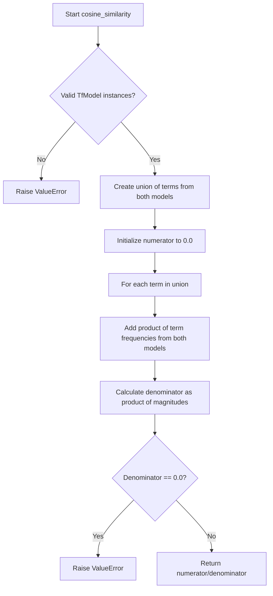

# `content_based.py`

## `sumy.evaluation.content_based.cosine_similarity` · *function*

## Summary:
Computes the cosine similarity between two document models based on their term frequencies.

## Description:
This function calculates the cosine similarity between two document representations using their term frequency vectors. It implements the standard cosine similarity formula: (A · B) / (||A|| × ||B||) where A and B are the term frequency vectors of the documents.

The function serves as a utility for evaluating document similarity in text processing applications, particularly in summarization evaluation where comparing generated summaries against reference summaries is common.

## Args:
    evaluated_model (object): The first document model to compare, expected to be an instance of TfModel (as checked by isinstance).
    reference_model (object): The second document model to compare, expected to be an instance of TfModel (as checked by isinstance).

## Returns:
    float: The cosine similarity value between the two document models, ranging from -1 to 1. A value of 1 indicates identical documents, 0 indicates orthogonal (no similarity), and -1 indicates completely opposite documents.

## Raises:
    ValueError: If either argument is not an instance of 'sumy.models.TfModel' (as checked by isinstance), or if both document models have zero magnitude (empty documents).

## Constraints:
    Preconditions:
    - Both arguments must pass isinstance check against TfModel (note: this may refer to TfDocumentModel based on import statement)
    - Neither document model should be empty (magnitude must be greater than 0)
    
    Postconditions:
    - Returns a float value between -1 and 1 inclusive
    - The computation handles missing terms gracefully by treating them as having zero frequency

## Side Effects:
    None

## Control Flow:


## Examples:
    # Basic usage with two document models
    similarity = cosine_similarity(doc_model1, doc_model2)
    
    # Error handling for invalid inputs
    try:
        similarity = cosine_similarity(invalid_model, doc_model)
    except ValueError as e:
        print(f"Invalid model provided: {e}")
        
    # Error handling for empty documents
    try:
        similarity = cosine_similarity(empty_model, doc_model)
    except ValueError as e:
        print(f"Empty document detected: {e}")
```

## `sumy.evaluation.content_based.unit_overlap` · *function*

## Summary:
Computes the unit overlap similarity between two document models using set-based intersection over union calculation.

## Description:
This function calculates a similarity score between two document models by determining the ratio of common terms to the total unique terms, excluding the common terms from the denominator. It's commonly used in content-based evaluation metrics for comparing document representations.

The function serves as a utility for measuring semantic similarity between documents in a TF-IDF or term-frequency based representation system. Note: The function references 'TfModel' in type checking, while the import statement shows 'TfDocumentModel'. This discrepancy should be resolved in the actual implementation.

## Args:
    evaluated_model (TfDocumentModel): The document model to be evaluated, containing terms as a sequence of tokens
    reference_model (TfDocumentModel): The reference document model to compare against, containing terms as a sequence of tokens

## Returns:
    float: A similarity score between 0 and 1, where:
    - 1.0 indicates identical documents (same terms)
    - 0.0 indicates completely different documents (no common terms)
    - Values between 0 and 1 represent varying degrees of similarity
    The score represents the proportion of common terms relative to the total unique terms in both documents (Jaccard-like similarity).

## Raises:
    ValueError: If either argument is not an instance of 'sumy.models.TfDocumentModel', or if both documents are empty (contain no terms)

## Constraints:
    Preconditions:
    - Both arguments must be instances of TfDocumentModel class
    - Neither document should be empty (must contain at least one term)
    
    Postconditions:
    - Returns a float value in the range [0, 1]
    - The result is mathematically valid for similarity measurement

## Side Effects:
    None

## Control Flow:
```mermaid
flowchart TD
    A[Start unit_overlap] --> B{Validate argument types}
    B -- Invalid type --> C[raise ValueError]
    B -- Valid types --> D{Check if both documents empty}
    D -- Both empty --> E[raise ValueError]
    D -- Valid --> F[Convert terms to frozensets]
    F --> G[Calculate common terms count]
    G --> H[Calculate similarity = common_terms / (len(terms1) + len(terms2) - common_terms)]
    H --> I[Return similarity score]
```

## Examples:
    # Basic usage with valid document models
    similarity = unit_overlap(doc_model_1, doc_model_2)
    
    # Error case - invalid argument type
    try:
        unit_overlap(invalid_object, doc_model)
    except ValueError as e:
        print(f"Error: {e}")
        
    # Error case - empty documents
    try:
        unit_overlap(empty_doc_model, another_empty_model)
    except ValueError as e:
        print(f"Error: {e}")
```

