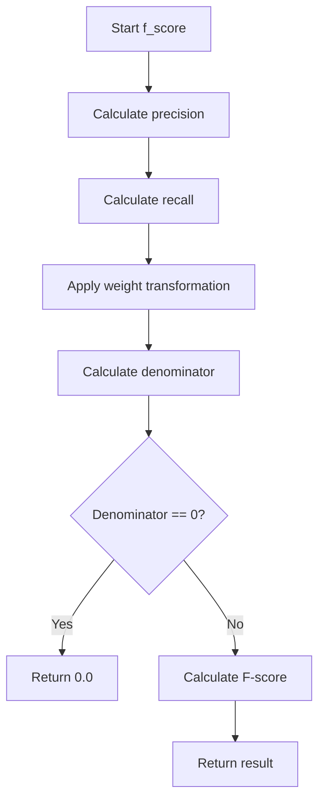
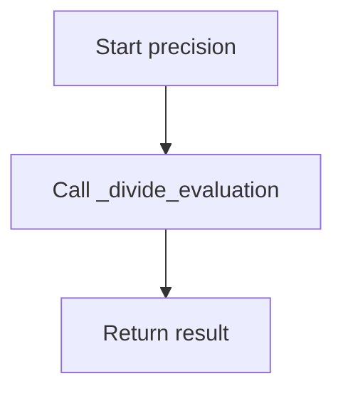
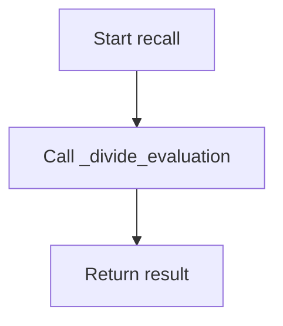

# `coselection.py`

## `sumy.evaluation.coselection.f_score` · *function*

## Summary:
Computes a weighted F-score combining precision and recall metrics.

## Description:
Calculates an F-score value by taking precision and recall values computed from the provided sentence sets and applying a weighting factor. This function serves as a convenience wrapper that combines the results of precision() and recall() functions using the F-beta scoring formula.

## Args:
    evaluated_sentences (Iterable[str]): Collection of sentences identified by the evaluation system.
    reference_sentences (Iterable[str]): Collection of reference sentences to be matched against.
    weight (float): Beta parameter for the F-score calculation. Default is 1.0.

## Returns:
    float: The computed F-score value. Returns 0.0 when the denominator in the F-score calculation would be zero.

## Raises:
    None

## Constraints:
    Preconditions:
        - Both evaluated_sentences and reference_sentences must contain at least one sentence
        - Sentences should be comparable (same format/encoding)
    Postconditions:
        - Returns a float value in the range [0.0, 1.0]

## Side Effects:
    None

## Control Flow:


## Examples:
    >>> f_score(['a', 'b'], ['a', 'b', 'c'])
    1.0
    >>> f_score(['a', 'b'], ['c', 'd'])
    0.0
    >>> f_score(['a', 'b'], ['a', 'b', 'c'], weight=2.0)
    0.8
```

## `sumy.evaluation.coselection.precision` · *function*

## Summary:
Computes the precision metric for evaluating sentence selection by measuring the ratio of reference sentences that are correctly identified in the evaluated set.

## Description:
This function calculates precision in the context of text summarization evaluation, specifically measuring how many of the reference sentences were successfully selected by the evaluation system. It leverages the `_divide_evaluation` helper function to compute the overlap ratio between reference and evaluated sentence sets.

The function is designed to be part of a broader evaluation framework for assessing the quality of sentence selection algorithms in text summarization tasks. It follows standard information retrieval conventions where precision measures the relevance of selected items among all selected items.

## Args:
    evaluated_sentences (Iterable[str]): Collection of sentences that were selected by the evaluation system (denominator in the calculation).
    reference_sentences (Iterable[str]): Collection of sentences that constitute the ground truth or reference set (numerator in the calculation).

## Returns:
    float: The precision value representing the ratio of correctly identified reference sentences to the total number of evaluated sentences. Returns 1.0 if all evaluated sentences are in the reference set, and 0.0 if none match.

## Raises:
    ValueError: When either evaluated_sentences or reference_sentences contains zero elements.

## Constraints:
    Preconditions:
        - Both evaluated_sentences and reference_sentences must contain at least one sentence
        - Sentences should be comparable (same format/encoding)
    Postconditions:
        - Returns a float value in the range [0.0, 1.0]
        - The result represents the proportion of matching sentences in the evaluated set

## Side Effects:
    None

## Control Flow:


## Examples:
    >>> precision(['a', 'b'], ['a', 'b', 'c'])
    1.0
    >>> precision(['c', 'd'], ['a', 'b'])
    0.0
    >>> precision(['a', 'd'], ['a', 'b', 'c'])
    0.5
```

## `sumy.evaluation.coselection.recall` · *function*

## Summary:
Computes the recall metric by measuring the proportion of reference sentences that are correctly identified by the evaluated sentence set.

## Description:
This function calculates recall for text summarization evaluation by determining what fraction of reference sentences are present in the evaluated sentence set. It serves as a wrapper around the internal `_divide_evaluation` function, where evaluated sentences act as the reference set and reference sentences act as the test set.

## Args:
    evaluated_sentences (Iterable[str]): Collection of sentences identified by the evaluation system (numerator in the calculation).
    reference_sentences (Iterable[str]): Collection of reference sentences to be matched against (denominator in the calculation).

## Returns:
    float: The recall value representing the ratio of correctly identified reference sentences to total reference sentences. Returns 1.0 if all reference sentences are found in evaluated sentences, and 0.0 if none match.

## Raises:
    ValueError: When either evaluated_sentences or reference_sentences contains zero elements.

## Constraints:
    Preconditions:
        - Both evaluated_sentences and reference_sentences must contain at least one sentence
        - Sentences should be comparable (same format/encoding)
    Postconditions:
        - Returns a float value in the range [0.0, 1.0]
        - The result represents the proportion of matching reference sentences in the reference set

## Side Effects:
    None

## Control Flow:


## Examples:
    >>> recall(['a', 'b', 'c'], ['a', 'b'])
    1.0
    >>> recall(['a', 'b'], ['c', 'd'])
    0.0
    >>> recall(['a', 'b', 'c'], ['a', 'd'])
    0.5

## `sumy.evaluation.coselection._divide_evaluation` · *function*

## Summary:
Calculates the ratio of common sentences between two collections of sentences.

## Description:
This function computes the overlap ratio between two sets of sentences by determining what fraction of sentences in the denominator collection also appear in the numerator collection. It's commonly used in evaluation metrics for text summarization systems to measure how many selected sentences match reference sentences.

## Args:
    numerator_sentences (Iterable[str]): Collection of sentences to serve as the reference set for comparison.
    denominator_sentences (Iterable[str]): Collection of sentences to serve as the test set for comparison.

## Returns:
    float: The ratio of common sentences to total sentences in the denominator collection. Returns 1.0 if all sentences in denominator are found in numerator, and 0.0 if none match.

## Raises:
    ValueError: When either numerator_sentences or denominator_sentences contains zero elements.

## Constraints:
    Preconditions:
        - Both numerator_sentences and denominator_sentences must contain at least one sentence
        - Sentences should be comparable (same format/encoding)
    Postconditions:
        - Returns a float value in the range [0.0, 1.0]
        - The result represents the proportion of matching sentences in the denominator set

## Side Effects:
    None

## Control Flow:
```mermaid
flowchart TD
    A[Start _divide_evaluation] --> B{len(numerator) == 0 OR len(denominator) == 0?}
    B -- Yes --> C[raise ValueError]
    B -- No --> D[Convert to frozenset]
    D --> E[Calculate common_count]
    E --> F[Calculate choosen_count]
    F --> G[assert choosen_count != 0]
    G --> H[Return common_count / choosen_count]
```

## Examples:
    >>> _divide_evaluation(['a', 'b', 'c'], ['a', 'b'])
    1.0
    >>> _divide_evaluation(['a', 'b'], ['c', 'd'])
    0.0
    >>> _divide_evaluation(['a', 'b', 'c'], ['a', 'd'])
    0.5

