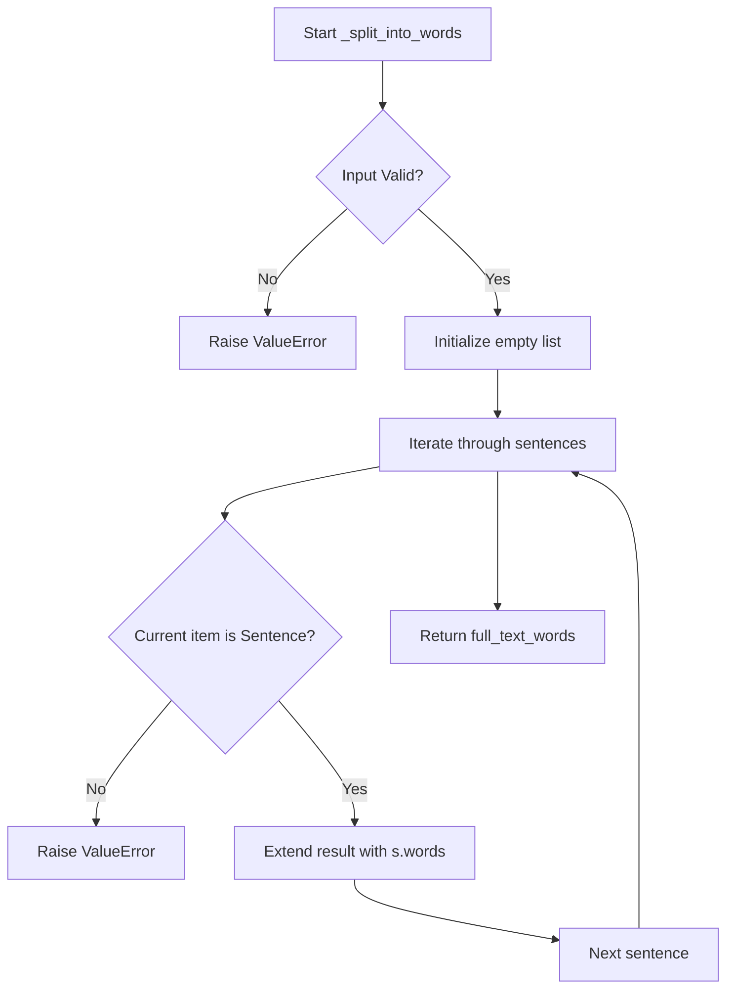
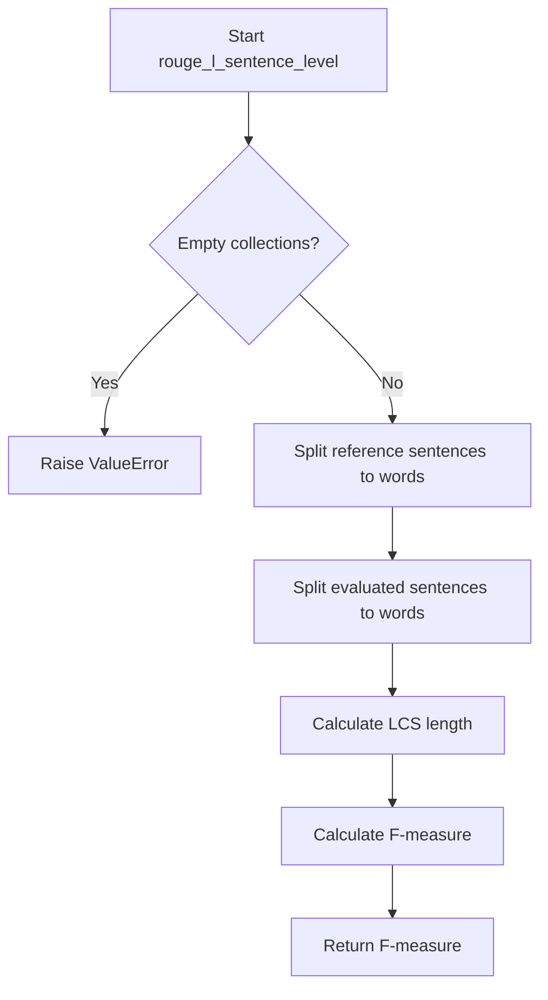

# `rouge.py`

## `sumy.evaluation.rouge._get_ngrams` · *function*

## Summary:
Generates a set of n-grams from a given text sequence.

## Description:
Extracts all contiguous subsequences of length n from the input text and returns them as a set of tuples. This function is commonly used in text evaluation metrics like ROUGE to compare overlapping word sequences between reference and candidate texts.

## Args:
    n (int): The size of n-grams to generate. Must be a positive integer.
    text (iterable): The input sequence from which to extract n-grams. Typically a list of tokens or a Sentence object.

## Returns:
    set[tuple]: A set containing all unique n-grams found in the text, represented as tuples of elements.

## Raises:
    None explicitly raised in the function body.

## Constraints:
    Preconditions:
    - n must be a positive integer (n > 0)
    - text must be iterable and have at least n elements to produce meaningful n-grams
    
    Postconditions:
    - The returned set contains only unique n-grams
    - Each n-gram is represented as a tuple of the same type as elements in the input text
    - If text has fewer than n elements, an empty set is returned

## Side Effects:
    None.

## Control Flow:
```mermaid
flowchart TD
    A[Start _get_ngrams(n, text)] --> B{len(text) >= n?}
    B -- No --> C[Return empty set]
    B -- Yes --> D[Initialize ngram_set = set()]
    D --> E[Set max_index_ngram_start = len(text) - n]
    E --> F[For i in range(0, max_index_ngram_start + 1)]
    F --> G[text[i:i+n] -> tuple -> add to ngram_set]
    G --> H[Return ngram_set]
```

## Examples:
    >>> _get_ngrams(2, ['a', 'b', 'c', 'd'])
    {('a', 'b'), ('b', 'c'), ('c', 'd')}
    
    >>> _get_ngrams(3, ['the', 'quick', 'brown', 'fox'])
    {('the', 'quick', 'brown'), ('quick', 'brown', 'fox')}
    
    >>> _get_ngrams(2, ['a'])
    set()
```

## `sumy.evaluation.rouge._split_into_words` · *function*

## Summary:
Extracts and flattens word lists from a collection of Sentence objects into a single list.

## Description:
This utility function processes a collection of Sentence objects and aggregates all words from each sentence into a single flat list. It serves as a helper for text processing operations that require unified word collections from multiple sentences.

The function validates that all items in the input collection are of type Sentence, ensuring type safety before processing. This validation prevents runtime errors when attempting to access the `.words` attribute on incompatible objects.

## Args:
    sentences (Iterable[Sentence]): A collection of Sentence objects from which to extract words. Each item must be an instance of the Sentence class.

## Returns:
    list[str]: A flat list containing all words from all Sentence objects in the input collection, in order of appearance.

## Raises:
    ValueError: When any object in the sentences collection is not an instance of Sentence class.

## Constraints:
    Preconditions:
        - Input must be iterable
        - All elements in the iterable must be instances of Sentence class
    Postconditions:
        - Returns a list of strings representing words
        - Order of words preserves the order of sentences and words within sentences

## Side Effects:
    None

## Control Flow:


## Examples:
```python
# Basic usage with valid Sentence objects
from sumy.models.dom import Sentence
from sumy.evaluation.rouge import _split_into_words

sentence1 = Sentence("Hello world", tokenizer)
sentence2 = Sentence("Goodbye universe", tokenizer)
result = _split_into_words([sentence1, sentence2])
# Returns: ['Hello', 'world', 'Goodbye', 'universe']

# Error case - invalid input type
try:
    _split_into_words(["not_a_sentence"])
except ValueError as e:
    print(e)  # Prints: "Object in collection must be of type Sentence"
```

## `sumy.evaluation.rouge._get_word_ngrams` · *function*

## Summary:
Generates a set of unique n-grams from a collection of sentences by splitting them into words and extracting contiguous subsequences of specified length.

## Description:
This function serves as a core utility in ROUGE evaluation metrics by converting a collection of Sentence objects into a set of n-grams. It processes each sentence by first splitting it into individual words, then extracts all contiguous subsequences of length n from those words, and finally returns a set of unique n-grams across all sentences.

The function is designed to be used internally by ROUGE evaluation functions to compute overlap between reference and candidate texts at the n-gram level. Its extraction into a separate function enables reuse across different ROUGE variants while maintaining clean separation of concerns.

## Args:
    n (int): The size of n-grams to generate. Must be a positive integer (> 0).
    sentences (list[Sentence]): A list of Sentence objects from which to extract n-grams. Must contain at least one sentence.

## Returns:
    set[tuple]: A set containing all unique n-grams found across all sentences, where each n-gram is represented as a tuple of words.

## Raises:
    AssertionError: When sentences list is empty or n is not greater than zero.

## Constraints:
    Preconditions:
    - n must be a positive integer (n > 0)
    - sentences must be a non-empty list of Sentence objects
    - Each Sentence object in sentences must have a valid .words attribute
    
    Postconditions:
    - The returned set contains only unique n-grams
    - Each n-gram is represented as a tuple of strings
    - Empty sentences are handled gracefully by producing empty n-grams

## Side Effects:
    None.

## Control Flow:
```mermaid
flowchart TD
    A[Start _get_word_ngrams(n, sentences)] --> B{len(sentences) > 0?}
    B -- No --> C[AssertionError]
    B -- Yes --> D{n > 0?}
    D -- No --> E[AssertionError]
    D -- Yes --> F[Initialize empty set words]
    F --> G[For each sentence in sentences]
    G --> H[_split_into_words([sentence]) -> list of words]
    H --> I[_get_ngrams(n, words) -> set of n-grams]
    I --> J[words.update(n-grams)]
    J --> K[Next sentence]
    K --> G
    G --> L[Return words set]
```

## `sumy.evaluation.rouge._get_index_of_lcs` · *function*

## Summary:
Returns the lengths of two sequences, likely serving as a placeholder or simplified component in a Longest Common Subsequence (LCS) calculation for ROUGE evaluation.

## Description:
This function is part of the ROUGE (Recall-Oriented Understudy for Gisting Evaluation) evaluation framework, designed to compute indices related to the Longest Common Subsequence between two text sequences. The function name `_get_index_of_lcs` indicates it should return indices identifying positions in the LCS, but the current implementation simply returns the lengths of the input sequences as a tuple.

This implementation appears to be either:
1. An incomplete placeholder that should be replaced with a proper LCS index calculation
2. A simplified version used in a specific context where only sequence lengths are needed
3. Part of a larger algorithm where the lengths are used as intermediate values

In a complete ROUGE implementation, this function would typically be part of a dynamic programming solution that identifies matching subsequences between reference and candidate texts.

## Args:
    x (sequence): First sequence, typically representing tokens or words from a reference text or candidate summary.
    y (sequence): Second sequence, typically representing tokens or words from a candidate summary or reference text.

## Returns:
    tuple[int, int]: A tuple containing the length of the first sequence (x) and the length of the second sequence (y).

## Raises:
    None explicitly raised in current implementation.

## Constraints:
    Preconditions:
    - Both x and y should be sequences (strings, lists, etc.) that support the len() function.
    - The function assumes both parameters are valid sequences that can be measured with len().

    Postconditions:
    - The function will always return a tuple of two integers representing the lengths of the input sequences.

## Side Effects:
    None.

## Control Flow:
```mermaid
flowchart TD
    A[Start _get_index_of_lcs(x, y)] --> B{Parameters Valid?}
    B -->|Yes| C[Return (len(x), len(y))]
    C --> D[End]
```

## Examples:
    # Basic usage with strings
    result = _get_index_of_lcs("hello world", "world hello")
    # Returns: (11, 11) - lengths of both strings
    
    # Usage with lists
    result = _get_index_of_lcs([1, 2, 3], [3, 4, 5])
    # Returns: (3, 3) - lengths of both lists

## `sumy.evaluation.rouge._len_lcs` · *function*

## Summary:
Calculates the length of the longest common subsequence between two sequences using dynamic programming.

## Description:
Implements the core logic for determining the length of the longest common subsequence (LCS) between two input sequences. This function serves as a building block in ROUGE (Recall-Oriented Understudy for Gisting Evaluation) metrics for evaluating text summarization quality. It combines the LCS table computation with index retrieval to efficiently extract the final LCS length.

The function is typically called as part of higher-level ROUGE evaluation routines where LCS-based precision, recall, and F-measure calculations are needed. It's extracted into its own function to separate the LCS length calculation from the broader evaluation logic.

## Args:
    x (sequence): First sequence to compare, typically representing tokens or words from a reference text or candidate summary.
    y (sequence): Second sequence to compare, typically representing tokens or words from a candidate summary or reference text.

## Returns:
    int: The length of the longest common subsequence between sequences x and y. Returns 0 if either sequence is empty.

## Raises:
    None explicitly raised in current implementation.

## Constraints:
    Preconditions:
    - Both x and y must be sequences that support indexing and have a meaningful len() function.
    - Elements in x and y must support equality comparison (== operator).
    
    Postconditions:
    - The function will always return a non-negative integer representing the LCS length.

## Side Effects:
    None.

## Control Flow:
```mermaid
flowchart TD
    A[Start _len_lcs(x, y)] --> B[table = _lcs(x, y)]
    B --> C[n, m = _get_index_of_lcs(x, y)]
    C --> D[Return table[n, m]]
```

## Examples:
    # Basic usage with strings
    length = _len_lcs("ABCDGH", "AEDFHR")
    # Returns: 2 (common subsequence: "AD" or "AH")
    
    # Usage with lists
    length = _len_lcs([1, 2, 3, 4], [2, 4, 6, 8])
    # Returns: 2 (common subsequence: [2, 4])
    
    # Empty sequence case
    length = _len_lcs("", "hello")
    # Returns: 0
```

## `sumy.evaluation.rouge._lcs` · *function*

## Summary:
Computes the Longest Common Subsequence (LCS) table for two input sequences using dynamic programming.

## Description:
Implements the classic dynamic programming algorithm to compute the Longest Common Subsequence (LCS) table for two sequences. This function serves as a core building block in ROUGE (Recall-Oriented Understudy for Gisting Evaluation) metrics for evaluating text summarization quality. The returned table contains the length of the longest common subsequence for all prefixes of the input sequences.

The function is typically called as part of a larger ROUGE evaluation pipeline where it computes intermediate values needed for precision, recall, and F-measure calculations. It's extracted into its own function to separate the core LCS computation logic from higher-level ROUGE metric calculations.

## Args:
    x (sequence): First sequence (e.g., list, string, or Sentence objects) to compare.
    y (sequence): Second sequence (e.g., list, string, or Sentence objects) to compare.

## Returns:
    dict[tuple[int, int], int]: A dictionary-based dynamic programming table where keys are coordinate tuples (i, j) and values represent the length of the LCS for prefixes x[:i] and y[:j]. The table has dimensions (len(x)+1) × (len(y)+1).

## Raises:
    None explicitly raised in current implementation.

## Constraints:
    Preconditions:
    - Both x and y must be sequences that support indexing and have a meaningful len() function.
    - Elements in x and y must support equality comparison (== operator).
    
    Postconditions:
    - The returned dictionary will contain entries for all coordinate pairs (i, j) where 0 ≤ i ≤ len(x) and 0 ≤ j ≤ len(y).
    - All values in the returned table will be non-negative integers.

## Side Effects:
    None.

## Control Flow:
```mermaid
flowchart TD
    A[Start _lcs(x, y)] --> B[n, m = _get_index_of_lcs(x, y)]
    B --> C[Initialize empty table dict]
    C --> D[For i in range(n+1)]
    D --> E[For j in range(m+1)]
    E --> F{i == 0 or j == 0?}
    F -->|Yes| G[table[i,j] = 0]
    G --> H[Next j]
    F -->|No| I[x[i-1] == y[j-1]?]
    I -->|Yes| J[table[i,j] = table[i-1,j-1] + 1]
    J --> H
    I -->|No| K[table[i,j] = max(table[i-1,j], table[i,j-1])]
    K --> H
    H --> L[Next i or End]
    L --> M[Return table]
```

## Examples:
    # Basic usage with strings
    table = _lcs("ABCDGH", "AEDFHR")
    # Returns a dictionary with LCS lengths for all prefix combinations
    
    # Usage with lists of Sentence objects
    sent1 = Sentence("Hello world", tokenizer)
    sent2 = Sentence("Hello there", tokenizer)
    table = _lcs([sent1, sent2], [sent1, sent2])
    # Computes LCS table for sequences of Sentence objects

## `sumy.evaluation.rouge._recon_lcs` · *function*

## Summary:
Reconstructs a longest common subsequence by backtracking through an LCS table.

## Description:
This function performs backtracking through a precomputed longest common subsequence (LCS) table to reconstruct the actual subsequence elements. It's part of the ROUGE (Recall-Oriented Understudy for Gisting Evaluation) framework used for automatic text summarization evaluation.

The function works by:
1. Computing an LCS table using the `_lcs` helper function
2. Using a recursive backtracking approach to trace through the table
3. Extracting the actual elements that form the common subsequence

This function is designed to be a component in a larger ROUGE evaluation pipeline, separating the reconstruction logic from the table computation logic.

## Args:
    x (sequence): First sequence (e.g., list, string, or Sentence objects) to compare.
    y (sequence): Second sequence (e.g., list, string, or Sentence objects) to compare.

## Returns:
    tuple: A tuple containing elements from the input sequences that form a longest common subsequence. The elements are ordered according to their appearance in the first sequence.

## Raises:
    None explicitly raised in current implementation.

## Constraints:
    Preconditions:
    - Both x and y must be sequences that support indexing and have a meaningful len() function.
    - Elements in x and y must support equality comparison (== operator).
    - The `_lcs` function must successfully compute a valid LCS table for the input sequences.
    
    Postconditions:
    - The returned tuple will contain elements that appear in both input sequences in the same relative order.
    - The length of the returned tuple will equal the length of the longest common subsequence.

## Side Effects:
    None.

## Control Flow:
```mermaid
flowchart TD
    A[Start _recon_lcs(x, y)] --> B[Compute LCS table with _lcs(x, y)]
    B --> C[Define recursive _recon helper function]
    C --> D[Get indices from _get_index_of_lcs(x, y)]
    D --> E[Call _recon(i, j) where i,j are lengths]
    E --> F[Base case: i=0 or j=0?]
    F -->|Yes| G[Return empty list]
    F -->|No| H[Elements equal?]
    H -->|Yes| I[Recursively call _recon(i-1, j-1) + [(x[i-1], i)]]
    H -->|No| J[Compare table[i-1,j] vs table[i,j-1]]
    J -->|table[i-1,j] > table[i,j-1]| K[Recursively call _recon(i-1, j)]
    J -->|Otherwise| L[Recursively call _recon(i, j-1)]
    L --> M[Map results to extract elements with lambda r: r[0]]
    M --> N[Convert to tuple and return]
```

## `sumy.evaluation.rouge.rouge_n` · *function*

## Summary:
Computes the ROUGE-N metric by calculating the overlap ratio of n-grams between evaluated and reference sentence collections.

## Description:
This function implements the ROUGE-N evaluation metric, which measures the similarity between a candidate text (evaluated_sentences) and a reference text (reference_sentences) by comparing their n-grams. ROUGE-N stands for "Recall-Oriented Understudy for Gisting Evaluation" with N indicating the n-gram size used for comparison.

The function extracts n-grams of specified size from both collections of sentences and calculates the ratio of overlapping n-grams to total reference n-grams. This provides a normalized measure of similarity between the two text collections, commonly used in automatic summarization evaluation to assess how well a generated summary matches reference summaries.

## Args:
    evaluated_sentences (list[Sentence]): A list of Sentence objects representing the candidate text to evaluate. Must contain at least one sentence.
    reference_sentences (list[Sentence]): A list of Sentence objects representing the reference text for comparison. Must contain at least one sentence.
    n (int): The size of n-grams to compare. Defaults to 2 (bigrams). Must be a positive integer.

## Returns:
    float: The ROUGE-N score, representing the ratio of overlapping n-grams to total reference n-grams. Returns 0.0 when there are no reference n-grams.

## Raises:
    ValueError: When either evaluated_sentences or reference_sentences is empty (contains no sentences).

## Constraints:
    Preconditions:
    - Both evaluated_sentences and reference_sentences must contain at least one Sentence object
    - n must be a positive integer (> 0)
    - Each Sentence object must have a valid .words attribute
    
    Postconditions:
    - The returned value is always between 0.0 and 1.0 inclusive
    - Returns 0.0 when reference_sentences contains no n-grams

## Side Effects:
    None.

## Control Flow:
```mermaid
flowchart TD
    A[Start rouge_n(evaluated_sentences, reference_sentences, n)] --> B{len(evaluated_sentences) <= 0 OR len(reference_sentences) <= 0?}
    B -- Yes --> C[ValueError("Collections must contain at least 1 sentence.")]
    B -- No --> D[_get_word_ngrams(n, evaluated_sentences)]
    D --> E[_get_word_ngrams(n, reference_sentences)]
    E --> F[reference_count = len(reference_ngrams)]
    F --> G[overlapping_ngrams = evaluated_ngrams ∩ reference_ngrams]
    G --> H[overlapping_count = len(overlapping_ngrams)]
    H --> I[return overlapping_count / reference_count]
```

## Examples:
    # Basic usage with bigrams (default n=2)
    rouge_score = rouge_n(candidate_sentences, reference_sentences)
    
    # Usage with trigrams
    rouge_score = rouge_n(candidate_sentences, reference_sentences, n=3)
    
    # Error handling
    try:
        rouge_score = rouge_n([], reference_sentences)
    except ValueError as e:
        print(f"Error: {e}")

## `sumy.evaluation.rouge.rouge_1` · *function*

## Summary:
Computes the ROUGE-1 metric by calculating the overlap ratio of unigram (1-gram) sequences between evaluated and reference sentence collections.

## Description:
This function implements the ROUGE-1 evaluation metric, which measures the similarity between a candidate text and a reference text by comparing their unigrams (single words). It serves as a specialized wrapper around the general ROUGE-N implementation with n=1, making it easier to compute unigram-based similarity scores specifically.

The function extracts unigrams from both collections of sentences and calculates the ratio of overlapping unigrams to total reference unigrams. This provides a normalized measure of similarity between the two text collections, commonly used in automatic summarization evaluation to assess how well a generated summary matches reference summaries.

## Args:
    evaluated_sentences (list[Sentence]): A list of Sentence objects representing the candidate text to evaluate. Must contain at least one sentence.
    reference_sentences (list[Sentence]): A list of Sentence objects representing the reference text for comparison. Must contain at least one sentence.

## Returns:
    float: The ROUGE-1 score, representing the ratio of overlapping unigrams to total reference unigrams. Returns 0.0 when there are no reference unigrams.

## Raises:
    ValueError: When either evaluated_sentences or reference_sentences is empty (contains no sentences).

## Constraints:
    Preconditions:
    - Both evaluated_sentences and reference_sentences must contain at least one Sentence object
    - Each Sentence object must have a valid .words attribute
    
    Postconditions:
    - The returned value is always between 0.0 and 1.0 inclusive
    - Returns 0.0 when reference_sentences contains no unigrams

## Side Effects:
    None.

## Control Flow:
```mermaid
flowchart TD
    A[Start rouge_1(evaluated_sentences, reference_sentences)] --> B[Call rouge_n(evaluated_sentences, reference_sentences, 1)]
    B --> C[Return result from rouge_n]
```

## Examples:
    # Basic usage for evaluating summary quality
    candidate_sentences = [Sentence("The cat sat on the mat.", tokenizer)]
    reference_sentences = [Sentence("A cat was sitting on a mat.", tokenizer)]
    rouge_score = rouge_1(candidate_sentences, reference_sentences)
    print(f"ROUGE-1 Score: {rouge_score}")
    
    # Error handling
    try:
        rouge_score = rouge_1([], reference_sentences)
    except ValueError as e:
        print(f"Error: {e}")
```

## `sumy.evaluation.rouge.rouge_2` · *function*

## Summary:
Computes the ROUGE-2 metric by measuring the overlap of bigrams between evaluated and reference sentence collections.

## Description:
This function implements the ROUGE-2 evaluation metric, which is a specific instance of the ROUGE-N family with n=2. It calculates the similarity between a candidate text (evaluated_sentences) and a reference text (reference_sentences) by comparing their bigrams (2-word sequences). This metric is commonly used in automatic summarization evaluation to assess how well a generated summary matches reference summaries.

The function delegates to the more general `rouge_n` implementation with a fixed n=2 parameter, making it a convenient shortcut for bigram-based evaluation.

## Args:
    evaluated_sentences (list[Sentence]): A list of Sentence objects representing the candidate text to evaluate. Must contain at least one sentence.
    reference_sentences (list[Sentence]): A list of Sentence objects representing the reference text for comparison. Must contain at least one sentence.

## Returns:
    float: The ROUGE-2 score, representing the ratio of overlapping bigrams to total reference bigrams. Returns 0.0 when there are no reference bigrams.

## Raises:
    ValueError: When either evaluated_sentences or reference_sentences is empty (contains no sentences).

## Constraints:
    Preconditions:
    - Both evaluated_sentences and reference_sentences must contain at least one Sentence object
    - Each Sentence object must have a valid .words attribute
    
    Postconditions:
    - The returned value is always between 0.0 and 1.0 inclusive
    - Returns 0.0 when reference_sentences contains no bigrams

## Side Effects:
    None.

## Control Flow:
```mermaid
flowchart TD
    A[Start rouge_2(evaluated_sentences, reference_sentences)] --> B[Call rouge_n(evaluated_sentences, reference_sentences, 2)]
    B --> C[Return result from rouge_n]
```

## Examples:
    # Basic usage for evaluating a candidate summary against reference summaries
    candidate_sentences = [Sentence("The cat sat on the mat.", tokenizer)]
    reference_sentences = [Sentence("The cat was sitting on the mat.", tokenizer)]
    rouge2_score = rouge_2(candidate_sentences, reference_sentences)
    print(f"ROUGE-2 Score: {rouge2_score}")
    
    # Error handling
    try:
        rouge2_score = rouge_2([], reference_sentences)
    except ValueError as e:
        print(f"Error: {e}")

## `sumy.evaluation.rouge._f_lcs` · *function*

## Summary:
Calculates the F-measure (F-beta score) for ROUGE evaluation using longest common subsequence statistics.

## Description:
Implements the F-measure calculation for ROUGE evaluation metrics, specifically computing the F-beta score based on recall and precision derived from longest common subsequence lengths. This function serves as a core component in evaluating summarization quality by combining precision and recall into a single harmonic mean score.

## Args:
    llcs (float): Length of the longest common subsequence between reference and candidate texts
    m (float): Length of the reference text (typically number of tokens/words)
    n (float): Length of the candidate text (typically number of tokens/words)

## Returns:
    float: The F-measure (F-beta score) value between 0 and 1, representing the harmonic mean of precision and recall

## Raises:
    ZeroDivisionError: When either m or n is zero, causing division by zero in recall or precision calculations

## Constraints:
    Preconditions:
        - llcs must be non-negative (≥ 0)
        - m must be positive (> 0) 
        - n must be positive (> 0)
    Postconditions:
        - Returns a value between 0 and 1 inclusive
        - If llcs is 0, returns 0 regardless of m and n values

## Side Effects:
    None - This is a pure mathematical function with no side effects

## Control Flow:
```mermaid
flowchart TD
    A[Start _f_lcs(llcs,m,n)] --> B{llcs > 0?}
    B -- No --> C[Return 0]
    B -- Yes --> D[r_lcs = llcs/m]
    D --> E[p_lcs = llcs/n]
    E --> F[beta = p_lcs/r_lcs]
    F --> G[num = (1 + beta²) × r_lcs × p_lcs]
    G --> H[denom = r_lcs + (beta² × p_lcs)]
    H --> I[Return num/denom]
```

## Examples:
    # Basic usage with equal-length texts
    result = _f_lcs(5, 10, 8)  # Returns F-measure for 5 common elements out of 10 reference and 8 candidate
    
    # Edge case with no common elements
    result = _f_lcs(0, 5, 5)   # Returns 0.0
    
    # Edge case with perfect match
    result = _f_lcs(10, 10, 10)  # Returns 1.0 for perfect recall and precision
``

## `sumy.evaluation.rouge.rouge_l_sentence_level` · *function*

## Summary:
Computes the ROUGE-L sentence-level evaluation metric by calculating the F-measure based on longest common subsequence length between reference and evaluated sentences.

## Description:
This function implements the ROUGE-L (Recall-Oriented Understudy for Gisting Evaluation - Longest Common Subsequence) metric for sentence-level text evaluation. It measures the similarity between a set of reference sentences and evaluated sentences by computing the longest common subsequence and deriving precision, recall, and F-measure scores.

The function is designed to be used in automatic text summarization evaluation systems where comparing generated summaries against reference summaries is required. It extracts words from Sentence objects, computes the longest common subsequence, and returns an F-measure score between 0 and 1.

This logic is extracted into its own function rather than being inlined because it encapsulates the complete ROUGE-L computation pipeline, separating concerns between text preprocessing (word extraction), LCS computation, and final metric calculation.

## Args:
    evaluated_sentences (Iterable[Sentence]): Collection of Sentence objects representing the evaluated text to be compared against references. Must contain at least one sentence.
    reference_sentences (Iterable[Sentence]): Collection of Sentence objects representing the reference text for comparison. Must contain at least one sentence.

## Returns:
    float: The ROUGE-L F-measure score between 0 and 1, where 1 indicates perfect overlap and 0 indicates no common subsequences.

## Raises:
    ValueError: When either evaluated_sentences or reference_sentences contains zero sentences.

## Constraints:
    Preconditions:
        - Both evaluated_sentences and reference_sentences must be non-empty collections
        - All items in both collections must be instances of Sentence class
        - Collections must be iterable
    Postconditions:
        - Returns a floating-point value between 0 and 1 inclusive
        - Function execution does not modify input collections

## Side Effects:
    None

## Control Flow:


## Examples:
    # Basic usage with valid Sentence objects
    from sumy.models.dom import Sentence
    from sumy.evaluation.rouge import rouge_l_sentence_level
    
    # Create sample sentences
    ref_sentence1 = Sentence("The cat sat on the mat", tokenizer)
    ref_sentence2 = Sentence("Dogs are loyal animals", tokenizer)
    eval_sentence1 = Sentence("The cat was sitting on the mat", tokenizer)
    
    # Calculate ROUGE-L score
    score = rouge_l_sentence_level([eval_sentence1], [ref_sentence1, ref_sentence2])
    # Returns a float between 0 and 1 representing similarity score
    
    # Error case - empty collections
    try:
        rouge_l_sentence_level([], [ref_sentence1])
    except ValueError as e:
        print(e)  # Prints: "Collections must contain at least 1 sentence."
```

## `sumy.evaluation.rouge._union_lcs` · *function*

## Summary:
Computes the union-based longest common subsequence (LCS) ratio between multiple evaluated sentences and a reference sentence.

## Description:
This function implements a union-based LCS metric used in ROUGE (Recall-Oriented Understudy for Gisting Evaluation) text summarization evaluation. It calculates the ratio of unique common words across all evaluated sentences relative to the total count of common words found in each individual comparison.

The function processes each evaluated sentence against the reference sentence to compute their LCS, unions all the resulting LCS sets, and then normalizes by the total combined LCS length to produce a normalized similarity score between 0 and 1.

This logic is extracted into its own function to separate the union computation and normalization logic from the core LCS computation and word splitting operations, making the ROUGE evaluation pipeline modular and reusable.

## Args:
    evaluated_sentences (Iterable[Sentence]): Collection of Sentence objects to evaluate against the reference. Must contain at least one sentence.
    reference_sentence (Sentence): The reference Sentence object against which evaluated sentences are compared.

## Returns:
    float: The union-based LCS ratio, representing the normalized overlap between evaluated sentences and the reference. Value ranges from 0.0 to 1.0, where 1.0 indicates perfect overlap.

## Raises:
    ValueError: When evaluated_sentences collection contains zero elements.

## Constraints:
    Preconditions:
        - evaluated_sentences must be non-empty
        - Both evaluated_sentences and reference_sentence must contain valid Sentence objects
        - Each Sentence object must have a valid .words attribute
    Postconditions:
        - Returns a float value between 0.0 and 1.0 inclusive
        - The function is deterministic for identical inputs

## Side Effects:
    None

## Control Flow:
```mermaid
flowchart TD
    A[Start _union_lcs] --> B{evaluated_sentences empty?}
    B -->|Yes| C[Raise ValueError]
    B -->|No| D[Initialize lcs_union = set()]
    D --> E[Split reference sentence into words]
    E --> F[Initialize combined_lcs_length = 0]
    F --> G[For each evaluated sentence]
    G --> H[Split evaluated sentence into words]
    H --> I[Compute LCS between reference and evaluated words]
    I --> J[Convert LCS to set]
    J --> K[Add LCS length to combined_lcs_length]
    K --> L[Union LCS with lcs_union]
    L --> M[Next evaluated sentence?]
    M -->|Yes| G
    M -->|No| N[Calculate union_lcs_count = len(lcs_union)]
    N --> O[Calculate union_lcs_value = union_lcs_count / combined_lcs_length]
    O --> P[Return union_lcs_value]
```

## `sumy.evaluation.rouge.rouge_l_summary_level` · *function*

## Summary:
Computes the ROUGE-L summary-level metric by calculating the union-based longest common subsequence ratio between evaluated sentences and reference sentences.

## Description:
This function implements the ROUGE-L (Recall-Oriented Understudy for Gisting Evaluation) summary-level metric for evaluating text summarization quality. It measures the similarity between a candidate summary and reference summaries by computing the union of longest common subsequences across all reference sentences.

The function operates by:
1. Validating that both evaluated and reference sentence collections contain at least one sentence
2. Computing word counts for both collections
3. For each reference sentence, calculating the union-based LCS ratio between evaluated sentences and that reference
4. Aggregating these ratios and computing the final F-measure score

This logic is extracted into its own function to encapsulate the complete ROUGE-L computation pipeline while separating concerns from the underlying helper functions that handle word splitting, LCS computation, and F-measure calculation.

## Args:
    evaluated_sentences (Iterable[Sentence]): Collection of Sentence objects representing the candidate summary to evaluate. Must contain at least one sentence.
    reference_sentences (Iterable[Sentence]): Collection of Sentence objects representing reference summaries. Must contain at least one sentence.

## Returns:
    float: The ROUGE-L F-measure score between 0.0 and 1.0, where 1.0 indicates perfect overlap between evaluated and reference sentences.

## Raises:
    ValueError: When either evaluated_sentences or reference_sentences collection contains zero elements.

## Constraints:
    Preconditions:
        - Both evaluated_sentences and reference_sentences must be non-empty collections
        - All items in both collections must be instances of Sentence class
        - Each Sentence object must have a valid .words attribute
    Postconditions:
        - Returns a float value between 0.0 and 1.0 inclusive
        - Function is deterministic for identical inputs

## Side Effects:
    None

## Control Flow:
```mermaid
flowchart TD
    A[Start rouge_l_summary_level] --> B{evaluated_sentences empty?}
    B -->|Yes| C[Raise ValueError]
    B -->|No| D{reference_sentences empty?}
    D -->|Yes| E[Raise ValueError]
    D -->|No| F[Compute m = len(_split_into_words(reference_sentences))]
    F --> G[Compute n = len(_split_into_words(evaluated_sentences))]
    G --> H[Initialize union_lcs_sum_across_all_references = 0]
    H --> I[For each ref_s in reference_sentences]
    I --> J[union_lcs_sum_across_all_references += _union_lcs(evaluated_sentences, ref_s)]
    J --> K[Return _f_lcs(union_lcs_sum_across_all_references, m, n)]
```

