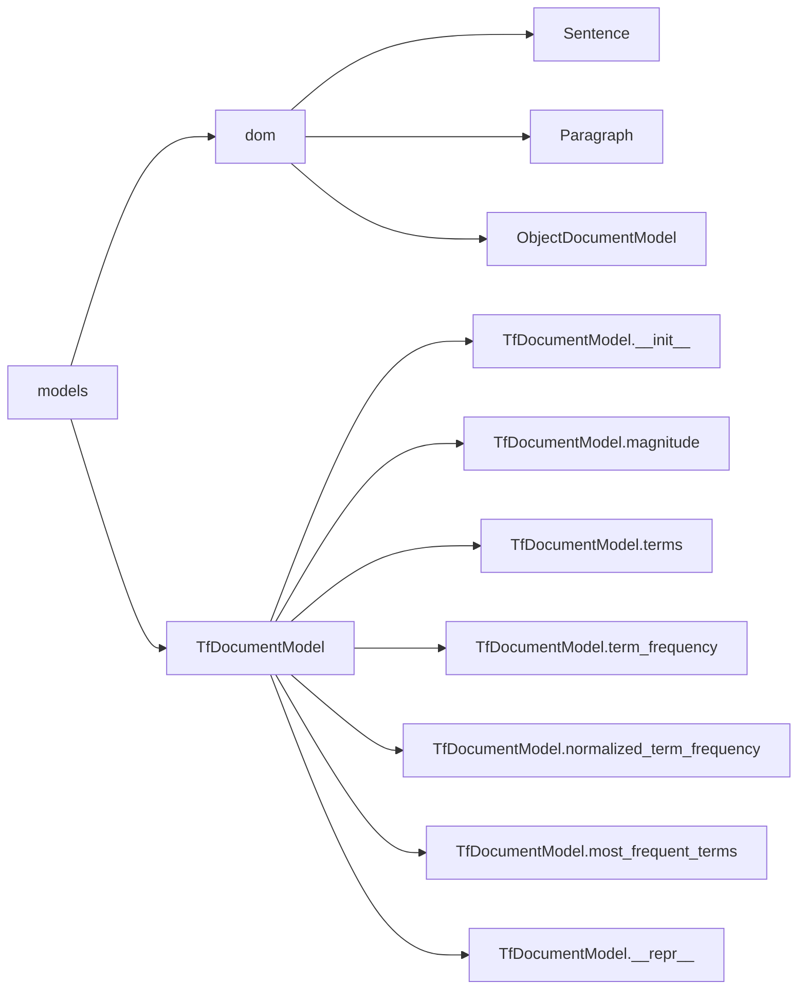

# `sumy.models`

## Tree:
models/
├── dom/
└── tf.py

## Role:
Provides core data structures and representations for text processing and summarization systems, including hierarchical document models and term frequency analysis tools.

## Description:
The models module serves as the foundational data layer for text summarization and processing applications. It contains two primary subsystems: the dom package for hierarchical document structure representation and the tf module for term frequency analysis. These components work together to provide robust, reusable abstractions for handling textual content at different levels of granularity.

This module is consumed throughout the sumy library by text processors, summarization algorithms, and analysis tools that require structured document representations or term frequency computations. The separation between hierarchical document modeling and term frequency analysis reflects a clean architectural boundary between structural and statistical text processing concerns.

## Components:
- **dom**: Package containing hierarchical document structure classes (Sentence, Paragraph, ObjectDocumentModel)
- **TfDocumentModel**: Class for term frequency analysis and vector representation of documents

## Public API:
- **dom.Sentence(text, tokenizer, is_heading=False)**: Creates a sentence object with tokenized words
  - `text` (Any): Text content to store
  - `tokenizer` (Any): Tokenizer for word extraction with `to_words()` method
  - `is_heading` (bool, optional): Boolean flag for heading identification, defaults to False
- **dom.Paragraph(sentences)**: Creates a paragraph containing multiple sentences
  - `sentences` (iterable[Sentence]): Iterable of Sentence objects to include in the paragraph
- **dom.ObjectDocumentModel(paragraphs)**: Creates a document model from multiple paragraphs
  - `paragraphs` (iterable[Paragraph]): Iterable of Paragraph objects to include in the document
- **TfDocumentModel(words, tokenizer=None)**: Creates a term frequency document model
  - `words` (str or Sequence): Input text as string or sequence of words to process
  - `tokenizer` (object, optional): Tokenizer instance for converting strings to word sequences; required when words is string
- **TfDocumentModel.magnitude**: Property returning the Euclidean norm of term frequency vector
- **TfDocumentModel.terms**: Property returning an iterable of all unique terms in the document
- **TfDocumentModel.term_frequency(term)**: Returns frequency count of a specified term
- **TfDocumentModel.normalized_term_frequency(term, smooth=0.0)**: Computes normalized term frequency with smoothing
- **TfDocumentModel.most_frequent_terms(count)**: Returns terms sorted by frequency in descending order
- **TfDocumentModel.__repr__()**: Returns string representation of the document model

## Dependencies:
- Internal: 
  - sumy.models.dom: Provides hierarchical document structure classes
  - sumy.models.tf: Provides term frequency analysis capabilities
- External: 
  - itertools: Used in dom module for chain operations in cached properties

## Constraints:
- All Sentence objects must be properly initialized with valid tokenizer instances
- Paragraph objects require valid Sentence instances during construction
- DocumentModel requires valid Paragraph instances during construction
- TfDocumentModel requires either a sequence of words or a string with tokenizer
- All classes implement lazy evaluation for performance optimization through cached properties
- Objects are immutable after creation to maintain structural integrity

---

## Files

- [`tf.py`](models/tf.md)

