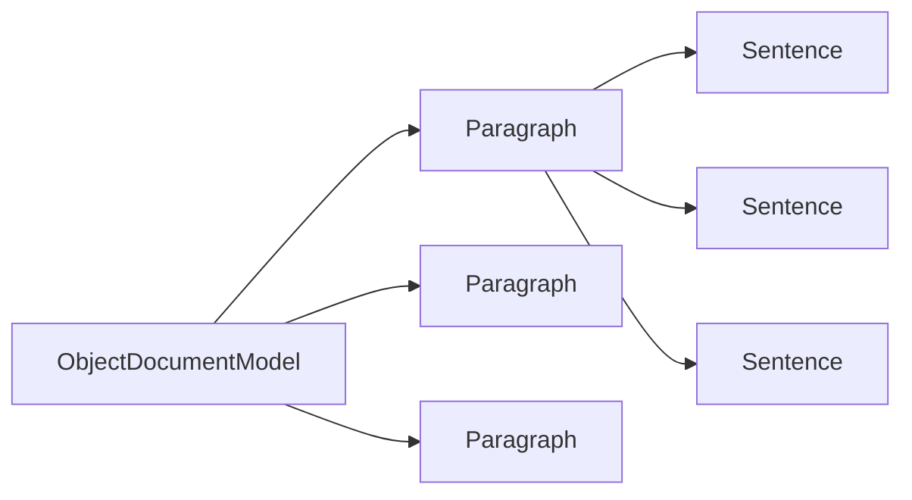

# `sumy.models.dom`

## Tree:
dom/
├── _document.py
├── _paragraph.py
└── _sentence.py

## Role:
Manages hierarchical document structure representation for text summarization systems, providing abstractions for sentences, paragraphs, and complete documents.

## Description:
The dom module implements a hierarchical document model specifically designed for text summarization applications. It provides three core classes that represent increasingly granular levels of document structure: Sentence (smallest unit), Paragraph (collection of sentences), and DocumentModel (collection of paragraphs). This structure enables efficient processing and analysis of textual content while maintaining semantic relationships between different document elements.

This module is primarily consumed by text processing and summarization components that need to work with structured document representations rather than raw text. The hierarchical organization allows for filtering operations at each level, such as accessing only headings within a paragraph or collecting all words across a paragraph.

## Components:
- **Sentence**: Represents a single sentence or heading with tokenized word access
- **Paragraph**: Aggregates multiple Sentence objects and provides filtered access to sentences and headings  
- **ObjectDocumentModel**: Manages a collection of Paragraph objects and provides unified access to document elements

## Public API:
- **Sentence(text, tokenizer, is_heading=False)**: Creates a sentence object with tokenized words
  - `text` (Any): Text content to store
  - `tokenizer` (Any): Tokenizer for word extraction with `to_words()` method
  - `is_heading` (bool, optional): Boolean flag for heading identification, defaults to False
- **Paragraph(sentences)**: Creates a paragraph containing multiple sentences
  - `sentences` (iterable[Sentence]): Iterable of Sentence objects to include in the paragraph
- **ObjectDocumentModel(paragraphs)**: Creates a document model from multiple paragraphs
  - `paragraphs` (iterable[Paragraph]): Iterable of Paragraph objects to include in the document

## Dependencies:
- Internal: None (purely structural components)
- External: itertools (used for chain operations in cached properties)

## Constraints:
- All Sentence objects must be properly initialized with valid tokenizer instances
- Paragraph objects require valid Sentence instances during construction
- DocumentModel requires valid Paragraph instances during construction
- All classes implement lazy evaluation for performance optimization through cached properties
- Objects are immutable after creation to maintain structural integrity

---

## Files

- [`_document.py`](dom/_document.md)
- [`_paragraph.py`](dom/_paragraph.md)
- [`_sentence.py`](dom/_sentence.md)

