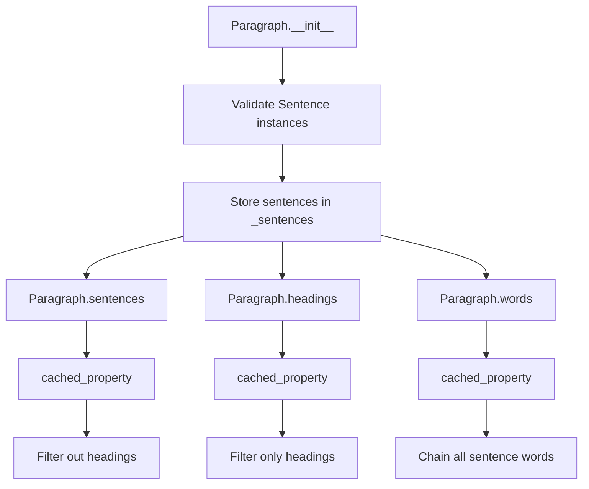

# `_paragraph.py`

## `sumy.models.dom._paragraph.Paragraph` · *class*

## Summary:
Represents a paragraph containing multiple sentences in a document structure, providing filtered access to sentences and headings.

## Description:
The Paragraph class serves as a container for organizing sentences within a document hierarchy. It separates regular sentences from heading sentences and provides cached access to filtered collections. This abstraction enables efficient document processing by maintaining clear distinctions between different types of textual elements while optimizing performance through cached property access.

## State:
- `_sentences`: tuple of Sentence objects, contains all sentences in the paragraph
- `_cached_property_sentences`: cached result of filtered sentences (non-heading)
- `_cached_property_headings`: cached result of filtered headings
- `_cached_property_words`: cached result of all words from all sentences

The constructor accepts an iterable of Sentence objects and validates that all items are indeed Sentence instances.

## Lifecycle:
Creation: Instantiate with an iterable of Sentence objects via `Paragraph(sentences)`. All items must be instances of Sentence class.
Usage: Access cached properties `sentences`, `headings`, and `words` for filtered views of the paragraph content.
Destruction: No explicit cleanup required; relies on Python's garbage collection.

## Method Map:


## Raises:
- TypeError: Raised during initialization when any item in the sentences iterable is not an instance of Sentence class.

## Example:
```python
# Create sentences
sentence1 = Sentence("This is a regular sentence.", tokenizer)
heading1 = Sentence("Introduction", tokenizer, is_heading=True)

# Create paragraph
paragraph = Paragraph([sentence1, heading1])

# Access filtered content
regular_sentences = paragraph.sentences  # Excludes headings
heading_sentences = paragraph.headings    # Only headings
all_words = paragraph.words               # All words from all sentences
```

### `sumy.models.dom._paragraph.Paragraph.__init__` · *method*

## Summary:
Initializes a paragraph with a collection of sentence objects, validating that all items are proper Sentence instances.

## Description:
Constructs a Paragraph object by accepting an iterable of Sentence objects, converting it to a tuple, and performing validation to ensure all items are instances of the Sentence class. This method establishes the foundational sentence collection for the paragraph's content management.

The validation ensures type safety by rejecting any non-Sentence objects, preventing runtime errors when accessing paragraph properties that depend on Sentence-specific attributes. This validation logic is encapsulated in its own method rather than being inlined to maintain clean separation of concerns and enable reuse of the validation logic.

## Args:
    sentences (iterable[Sentence]): An iterable containing Sentence objects to be stored in the paragraph. Each item must be an instance of the Sentence class.

## Returns:
    None: This method does not return a value; it initializes the object's internal state.

## Raises:
    TypeError: Raised when any item in the sentences iterable is not an instance of the Sentence class.

## State Changes:
    Attributes READ: None
    Attributes WRITTEN: self._sentences

## Constraints:
    Preconditions: 
    - The sentences argument must be iterable
    - All items in the sentences iterable must be instances of Sentence class
    
    Postconditions:
    - self._sentences is set to a tuple containing all the input Sentence objects
    - The order of sentences is preserved from the input iterable

## Side Effects:
    None: This method performs no I/O operations or external service calls. It only manipulates internal object state.

### `sumy.models.dom._paragraph.Paragraph.headings` · *method*

## Summary:
Returns a tuple of all sentences in the paragraph that are classified as headings.

## Description:
This method filters the paragraph's sentences and returns only those that have been marked as headings. It provides access to the heading sentences within the paragraph structure, which are typically used for organizing content hierarchically in document summarization tasks.

## Args:
    None

## Returns:
    tuple[Sentence]: A tuple containing all Sentence objects in the paragraph where the `is_heading` property is True.

## Raises:
    None

## State Changes:
    Attributes READ: self._sentences
    Attributes WRITTEN: None

## Constraints:
    Preconditions: The paragraph must have been initialized with valid Sentence objects.
    Postconditions: The returned tuple contains only Sentence objects that are headings.

## Side Effects:
    None

### `sumy.models.dom._paragraph.Paragraph.words` · *method*

## Summary:
Returns a flattened tuple of all words from all sentences in the paragraph.

## Description:
This method aggregates words from all constituent sentences in the paragraph into a single tuple. It is designed to provide easy access to all textual tokens in the paragraph without requiring iteration over individual sentences.

## Args:
    None

## Returns:
    tuple[str]: A tuple containing all words from all sentences in the paragraph, in order. Each word is a string token extracted from the original text.

## Raises:
    None explicitly raised

## State Changes:
    Attributes READ: self._sentences
    Attributes WRITTEN: None

## Constraints:
    Preconditions: 
    - self._sentences must be iterable containing Sentence objects
    - Each Sentence in self._sentences must have a valid words property that returns a sequence of strings
    
    Postconditions:
    - Returns a tuple of strings representing all words in the paragraph
    - Order of words preserves the sequential order of sentences and words within sentences

## Side Effects:
    None

### `sumy.models.dom._paragraph.Paragraph.__unicode__` · *method*

## Summary:
Returns a string representation of the paragraph showing heading and sentence counts.

## Description:
Provides a human-readable summary of the paragraph's structure, displaying the number of headings and regular sentences it contains. This method is called when the paragraph object needs to be converted to a string representation, such as during printing or logging operations.

## Args:
    None

## Returns:
    str: A formatted string in the pattern "<Paragraph with {headings_count} headings & {sentences_count} sentences>"

## Raises:
    None

## State Changes:
    Attributes READ: self.headings, self.sentences
    Attributes WRITTEN: None

## Constraints:
    Preconditions: The Paragraph object must have been initialized with valid Sentence objects
    Postconditions: The returned string accurately reflects the current counts of headings and sentences in the paragraph

## Side Effects:
    None

### `sumy.models.dom._paragraph.Paragraph.__repr__` · *method*

## Summary:
Returns the string representation of a Paragraph object by delegating to its __str__ method.

## Description:
This method provides a string representation of the Paragraph instance for debugging and development purposes. It delegates to the object's __str__ method, which in Python 3 environments will fall back to the default object representation (memory address) since no explicit __str__ method is defined in the class. The class does define a __unicode__ method that returns a formatted string showing the number of headings and sentences, indicating that a __str__ method might be expected for consistency.

## Args:
    None

## Returns:
    str: The string representation of the Paragraph object. In Python 3, this will be the default object representation (memory address) because __str__ is not explicitly defined in the class.

## Raises:
    None

## State Changes:
    Attributes READ: None
    Attributes WRITTEN: None

## Constraints:
    Preconditions: The Paragraph object must be properly initialized with valid Sentence objects.
    Postconditions: The method returns a string representation of the object without modifying the object's state.

## Side Effects:
    None

