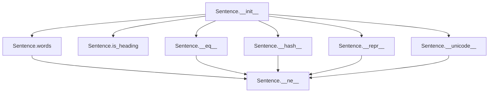

# `_sentence.py`

## `sumy.models.dom._sentence.Sentence` · *class*

## Summary:
Represents a textual sentence or heading within a document structure, providing access to tokenized words and metadata about its nature.

## Description:
The Sentence class serves as a fundamental data structure for representing text elements in document processing. It can represent either a regular sentence or a heading, storing the raw text, a tokenizer for word extraction, and metadata indicating whether it's a heading. This abstraction enables consistent handling of different text elements while providing efficient access to tokenized content through caching.

The class is typically instantiated by document processing components that parse text into discrete elements. It's designed to be lightweight and immutable in terms of its core properties once created.

## State:
- `_text` (str): The Unicode-encoded text content of the sentence/heading, stripped of leading/trailing whitespace
- `_cached_property_words` (list[str]): Cached result of word tokenization from the tokenizer, automatically computed and stored on first access
- `_tokenizer` (Tokenizer): A tokenizer object capable of converting text to word lists via `to_words()` method
- `_is_heading` (bool): Boolean flag indicating whether this element represents a heading (True) or regular sentence (False)

The constructor parameters have the following characteristics:
- `text`: Any object convertible to Unicode string via `to_unicode()`
- `tokenizer`: Must be an object with a `to_words()` method that accepts text strings
- `is_heading`: Optional boolean parameter, defaults to False

Class invariants:
- The `_text` field is always a Unicode string with leading/trailing whitespace stripped
- The `_is_heading` field is always a boolean value
- The `words` property always returns a list of strings when accessed
- Equality comparison depends only on text content and heading status

## Lifecycle:
Creation: Instantiate using `Sentence(text, tokenizer, is_heading=False)` where:
- `text` is the textual content to store
- `tokenizer` is a tokenizer object with `to_words()` method
- `is_heading` is an optional boolean flag (defaults to False)

Usage: Access properties like `words`, `is_heading`, or compare instances using equality operators. The `words` property is lazily computed and cached on first access.

Destruction: No explicit cleanup required; Python's garbage collector handles memory management.

## Method Map:


## Raises:
- `UnicodeDecodeError`: May be raised by `to_unicode()` during text conversion if input bytes are not valid UTF-8
- `AttributeError`: May occur if the provided `tokenizer` lacks a `to_words()` method

## Example:
```python
# Create a sentence
sentence = Sentence("Hello world!", my_tokenizer)

# Access properties
print(sentence.is_heading)  # False
print(sentence.words)       # ['Hello', 'world', '!'] (cached on first access)

# Create a heading
heading = Sentence("Introduction", my_tokenizer, is_heading=True)

# Compare sentences
print(sentence == heading)  # False (different text/content)
```

### `sumy.models.dom._sentence.Sentence.__init__` · *method*

## Summary:
Initializes a Sentence object with text content, tokenization strategy, and heading status.

## Description:
Constructs a Sentence instance by normalizing the input text to Unicode format, storing the provided tokenizer for word extraction, and recording whether this sentence represents a heading. This method serves as the primary constructor for Sentence objects within the DOM model hierarchy.

The initialization process ensures text consistency through Unicode conversion and stripping of leading/trailing whitespace, while preserving the tokenizer reference for subsequent word processing operations. The heading status is normalized to a boolean value for consistent comparison operations.

This logic is encapsulated in its own method rather than being inlined because it establishes the fundamental state of Sentence objects and provides a standardized interface for creating sentence instances throughout the summarization pipeline.

## Args:
    text (Any): Text content to be represented by this sentence. Will be converted to Unicode and stripped of whitespace.
    tokenizer (Any): Tokenizer object used for extracting words from the sentence text.
    is_heading (bool, optional): Flag indicating whether this sentence represents a heading. Defaults to False.

## Returns:
    None: This method initializes instance attributes and does not return a value.

## Raises:
    UnicodeDecodeError: When the text parameter contains bytes that are not valid UTF-8 encoded data during the to_unicode conversion process.

## State Changes:
    Attributes READ: None
    Attributes WRITTEN: 
    - self._text: Stores the Unicode-normalized and stripped text content
    - self._tokenizer: Stores the provided tokenizer object
    - self._is_heading: Stores the boolean heading status

## Constraints:
    Preconditions:
    - The text parameter must be convertible to a Unicode string
    - The tokenizer parameter must be a valid object with a to_words method
    - The is_heading parameter must be convertible to a boolean value
    
    Postconditions:
    - self._text is a Unicode string with leading/trailing whitespace removed
    - self._tokenizer is the exact object passed as the tokenizer argument
    - self._is_heading is a boolean value representing the heading status

## Side Effects:
    None

### `sumy.models.dom._sentence.Sentence.words` · *method*

## Summary:
Returns a tokenized representation of the sentence's text as a list of words.

## Description:
This method provides access to the word tokens extracted from the sentence's text using the assigned tokenizer. As a cached property, the tokenization result is computed once and stored for subsequent accesses, improving performance for repeated calls.

## Args:
    None

## Returns:
    list[str]: A list of word tokens extracted from the sentence's text. The exact format depends on the implementation of the assigned tokenizer's `to_words` method.

## Raises:
    None explicitly raised

## State Changes:
    Attributes READ: 
    - self._text: The raw text content of the sentence
    - self._tokenizer: The tokenizer instance used to process the text
    
    Attributes WRITTEN: 
    - None

## Constraints:
    Preconditions:
    - The sentence must have been initialized with a valid tokenizer
    - The sentence's `_text` attribute must be properly set
    
    Postconditions:
    - The returned list contains word tokens derived from the sentence's text
    - The result is cached after first access for performance optimization

## Side Effects:
    None

### `sumy.models.dom._sentence.Sentence.is_heading` · *method*

## Summary:
Returns the heading status flag indicating whether this sentence represents a heading in the document structure.

## Description:
Provides access to the internal `_is_heading` attribute that determines whether this sentence object represents a heading element within the document hierarchy. This property is used throughout the document model to distinguish between regular text sentences and heading elements, which may have different processing or display characteristics in summarization algorithms.

Known callers and context:
- Called in `Sentence.__eq__` method during equality comparisons to ensure heading status matches between sentences
- Referenced in `Sentence.__hash__` method to include heading status in hash calculations for proper object identity
- Used in `Sentence.__repr__` method to format string representations with appropriate type indicators ("Heading" or "Sentence")

This logic is encapsulated in its own property rather than being inlined because it provides a clean abstraction layer for accessing the heading status, enables consistent access patterns across the document model, and allows for potential future enhancements to heading detection logic without changing client code interfaces.

## Args:
    None

## Returns:
    bool: True if this sentence represents a heading element; False if it represents a regular text sentence.

## Raises:
    None

## State Changes:
    Attributes READ: self._is_heading
    Attributes WRITTEN: None

## Constraints:
    Preconditions:
    - The Sentence object must be properly initialized with a valid `_is_heading` attribute
    - The `_is_heading` attribute must be a boolean value
    
    Postconditions:
    - The returned value is always a boolean representing the heading status
    - The method does not modify any object state

## Side Effects:
    None: This method performs only attribute access and returns a cached value without any I/O operations or external service calls.

### `sumy.models.dom._sentence.Sentence.__eq__` · *method*

## Summary:
Compares two Sentence objects for equality based on their heading status and text content.

## Description:
This method implements the equality operator (`==`) for Sentence objects, determining whether two sentences are considered equal based on both their heading status and textual content. It is called during equality comparisons between Sentence instances, such as when using `sentence1 == sentence2`.

## Args:
    sentence (Sentence): Another Sentence object to compare against this instance

## Returns:
    bool: True if both `_is_heading` and `_text` attributes are identical between the two Sentence objects; False otherwise

## Raises:
    AssertionError: When the provided argument is not an instance of Sentence class

## State Changes:
    Attributes READ: 
    - self._is_heading
    - self._text
    - sentence._is_heading
    - sentence._text

## Constraints:
    Preconditions:
    - The argument must be an instance of Sentence class (enforced by assertion)
    - Both objects must have the same internal structure for comparison to be meaningful

    Postconditions:
    - Returns a boolean value indicating equality of the two Sentence objects
    - The comparison is symmetric: if a == b, then b == a

## Side Effects:
    None: This method performs only attribute comparisons and does not modify any state or perform I/O operations

### `sumy.models.dom._sentence.Sentence.__ne__` · *method*

## Summary:
Defines the "not equal" comparison operation between two Sentence objects.

## Description:
Implements the inequality operator (`!=`) for Sentence objects by returning the logical negation of the equality comparison. This method is automatically called when using the `!=` operator between two Sentence instances, such as when evaluating `sentence1 != sentence2`. It leverages the existing `__eq__` method to determine equality and returns the opposite result.

## Args:
    sentence (Sentence): Another Sentence object to compare against this instance

## Returns:
    bool: True if the two Sentence objects are not equal (different heading status or text content); False if they are equal

## Raises:
    AssertionError: When the provided argument is not an instance of Sentence class (inherited from __eq__)

## State Changes:
    Attributes READ: 
    - self._is_heading
    - self._text
    - sentence._is_heading
    - sentence._text

## Constraints:
    Preconditions:
    - The argument must be an instance of Sentence class (enforced by __eq__ assertion)
    - Both objects must have the same internal structure for meaningful comparison

    Postconditions:
    - Returns a boolean value indicating inequality of the two Sentence objects
    - The comparison is symmetric: if a != b, then b != a

## Side Effects:
    None: This method performs only attribute comparisons and does not modify any state or perform I/O operations

### `sumy.models.dom._sentence.Sentence.__hash__` · *method*

## Summary:
Computes and returns a hash value based on the sentence's heading status and text content.

## Description:
This method implements the standard `__hash__` protocol for the Sentence class, enabling instances to be used as dictionary keys or set elements. It creates a hash from a tuple containing the sentence's heading status (`_is_heading`) and its text content (`_text`). This implementation maintains consistency with the `__eq__` method, ensuring that equal sentences have identical hash values.

## Args:
    None

## Returns:
    int: A hash value computed from the tuple (self._is_heading, self._text)

## Raises:
    None

## State Changes:
    Attributes READ: 
    - self._is_heading: Boolean indicating if the sentence is a heading
    - self._text: String containing the sentence text content

## Constraints:
    Preconditions:
    - The sentence instance must be properly initialized with valid `_is_heading` and `_text` attributes
    - Both `_is_heading` and `_text` should be hashable types
    
    Postconditions:
    - The returned hash value remains consistent for the lifetime of the object
    - Equal sentences (as determined by `__eq__`) will produce identical hash values

## Side Effects:
    None

### `sumy.models.dom._sentence.Sentence.__unicode__` · *method*

## Summary:
Returns the Unicode string representation of the sentence object.

## Description:
This method provides the Unicode representation of a Sentence object by returning its underlying text content. It implements Python's unicode protocol for proper string conversion and is used primarily for debugging and logging purposes.

## Args:
    None

## Returns:
    str: The Unicode string content stored in the sentence's `_text` attribute.

## Raises:
    None

## State Changes:
    Attributes READ: self._text
    Attributes WRITTEN: None

## Constraints:
    Preconditions: The Sentence object must have been initialized with valid text content.
    Postconditions: The returned value is identical to the original text content stored in `self._text`.

## Side Effects:
    None

### `sumy.models.dom._sentence.Sentence.__repr__` · *method*

## Summary:
Returns a string representation indicating whether this object is a heading or sentence, followed by its textual content.

## Description:
Provides a developer-friendly string representation of the Sentence object that clearly identifies its type (heading or sentence) and displays its content. This method is automatically invoked when the object is printed or converted to string in debugging contexts.

The method determines the object type by checking the `_is_heading` attribute and formats the output as "<Type: Content>" where Type is either "Heading" or "Sentence".

## Args:
    None

## Returns:
    str: A formatted string representation in the form "<Heading: text_content>" or "<Sentence: text_content>" depending on the object's type.

## Raises:
    None

## State Changes:
    Attributes READ: 
    - self._is_heading: Used to determine if the object represents a heading
    - self._text: Accessed indirectly through self.__str__() to get the content

## Constraints:
    Preconditions:
    - The object must be initialized with valid attributes
    - The `_is_heading` attribute must be a boolean value
    - The `_text` attribute must be a valid string-like object
    
    Postconditions:
    - Returns a properly formatted string representation
    - Does not modify any object state

## Side Effects:
    None

