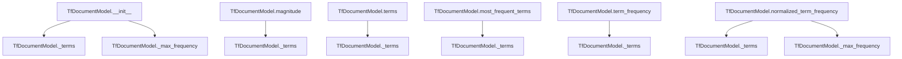

# `tf.py`

## `sumy.models.tf.TfDocumentModel` · *class*

## Summary:
Represents a document model for term frequency analysis, storing word frequencies and providing methods for frequency-based calculations.

## Description:
The TfDocumentModel class encapsulates document representation for text processing tasks, particularly those involving term frequency calculations. It accepts either a sequence of words or a string with a tokenizer to process text into words. This class serves as a foundational abstraction for text analysis operations that require term frequency information.

This class is typically instantiated by text processing pipelines or summarization algorithms that need to analyze document word frequencies. It provides standardized access to term frequency data while handling normalization and statistical computations.

## State:
- `_terms`: Counter object containing lowercase word frequencies; type Counter[unicode]; valid range depends on input text; invariant: all keys are lowercase
- `_max_frequency`: int representing maximum term frequency in document; type int; valid range [1, ∞); invariant: always equals max value in _terms or 1 if empty

## Lifecycle:
- Creation: Instantiate with words parameter (sequence or string) and optional tokenizer; raises ValueError if string provided without tokenizer
- Usage: Access properties like magnitude and terms; call methods like term_frequency() and normalized_term_frequency(); most_frequent_terms() for ordered terms
- Destruction: No explicit cleanup required; relies on Python's garbage collection

## Method Map:


## Raises:
- ValueError: Raised during initialization when words is a string but tokenizer is None, or when words is neither a string nor a sequence

## Example:
```python
# Create from sequence of words
model = TfDocumentModel(['hello', 'world', 'hello'])

# Create from string with tokenizer
from sumy.tokenizers import Tokenizer
tokenizer = Tokenizer('english')
model = TfDocumentModel("Hello world hello", tokenizer)

# Access term frequencies
freq = model.term_frequency('hello')  # Returns 2
norm_freq = model.normalized_term_frequency('hello')  # Returns normalized frequency
most_common = model.most_frequent_terms(2)  # Returns most frequent 2 terms
magnitude = model.magnitude  # Returns vector magnitude
```

### `sumy.models.tf.TfDocumentModel.__init__` · *method*

## Summary:
Initializes a term frequency document model by processing input words into a normalized counter structure and calculating maximum term frequency.

## Description:
Constructs a TfDocumentModel instance by validating input parameters, converting string inputs to word sequences using a tokenizer, and building internal term frequency data structures. This method serves as the primary constructor for document representation in term frequency analysis systems.

The initialization process handles two main input patterns: direct sequences of words or string inputs that require tokenization. This validation ensures proper document construction before any frequency calculations or analysis operations.

## Args:
    words (str or Sequence): Input text as string or sequence of words to process
    tokenizer (object, optional): Tokenizer instance for converting strings to word sequences; required when words is string

## Returns:
    None: This method initializes object state rather than returning a value

## Raises:
    ValueError: When words is a string but tokenizer is None, or when words is neither a string nor a sequence

## State Changes:
    Attributes READ: None
    Attributes WRITTEN: 
        - self._terms: Counter mapping lowercase words to their frequencies
        - self._max_frequency: Maximum frequency count among all terms in document

## Constraints:
    Preconditions:
        - If words is a string, tokenizer must be provided
        - If words is not a string, it must be a sequence-like object
    Postconditions:
        - self._terms contains lowercase word frequencies
        - self._max_frequency is set to maximum value in _terms or 1 if empty

## Side Effects:
    None: This method performs no I/O operations or external service calls

### `sumy.models.tf.TfDocumentModel.magnitude` · *method*

## Summary:
Calculates the Euclidean norm (magnitude) of term frequency vector for text normalization and similarity computations.

## Description:
Returns the magnitude of the term frequency vector represented by the document's term frequencies. This property is used in text processing pipelines for normalizing document vectors and computing cosine similarities between documents. The calculation follows the standard Euclidean norm formula: √(Σ(tᵢ²)) where tᵢ represents each term frequency.

## Args:
    None

## Returns:
    float: The Euclidean norm of the term frequency vector, representing the magnitude of the document's term frequency space.

## Raises:
    None

## State Changes:
    Attributes READ: self._terms
    Attributes WRITTEN: None

## Constraints:
    Preconditions: The object must have been initialized with valid term frequencies in self._terms
    Postconditions: Returns a non-negative floating-point number representing the vector magnitude

## Side Effects:
    None

### `sumy.models.tf.TfDocumentModel.terms` · *method*

## Summary:
Returns an iterable of all unique terms (words) present in the document model.

## Description:
Provides access to the vocabulary of terms contained within the document model. This property exposes the set of unique words that were processed during document initialization, making them available for further analysis or processing in text mining and natural language processing workflows.

## Args:
    None

## Returns:
    dict_keys: An iterable view of the keys (unique terms) from the internal term frequency counter. Each key represents a unique word in lowercase form from the document's vocabulary.

## Raises:
    None

## State Changes:
    Attributes READ: self._terms
    Attributes WRITTEN: None

## Constraints:
    Preconditions:
    - The TfDocumentModel instance must have been properly initialized with words
    - self._terms must be a Counter-like object with terms as keys
    
    Postconditions:
    - Returns an iterable containing all unique terms in the document
    - Terms are represented as lowercase strings
    - The returned iterable reflects the current state of the internal term counter

## Side Effects:
    None

### `sumy.models.tf.TfDocumentModel.most_frequent_terms` · *method*

## Summary:
Returns the most frequent terms from the document model, sorted by frequency in descending order.

## Description:
Retrieves terms from the document model's term frequency collection, sorted by frequency in descending order. This method provides access to the most significant terms in a document based on their occurrence frequency, commonly used for feature extraction or term ranking in text processing pipelines.

## Args:
    count (int): Number of most frequent terms to return. If 0 (default), returns all terms. If positive, returns only the first `count` terms. If negative, raises ValueError.

## Returns:
    tuple[str]: A tuple of term strings sorted by frequency in descending order. Returns all terms if count=0, or only the first count terms if count>0. Each term is a lowercase string from the document's vocabulary.

## Raises:
    ValueError: When count is negative, as only non-negative values are allowed.

## State Changes:
    Attributes READ: self._terms
    Attributes WRITTEN: None

## Constraints:
    Preconditions: 
    - self._terms must be a Counter-like object with terms as keys and frequencies as values
    - count must be a non-negative integer
    
    Postconditions:
    - Returns a tuple of strings representing terms
    - Terms are sorted by frequency in descending order (most frequent first)
    - If count > 0, result contains at most count terms
    - If count = 0, result contains all terms

## Side Effects:
    None

### `sumy.models.tf.TfDocumentModel.term_frequency` · *method*

## Summary:
Returns the frequency count of a specified term within the document model.

## Description:
Retrieves the term frequency for a given term from the internal term frequency counter. This method provides access to the raw frequency count of individual terms in the document, which serves as the foundation for various text analysis operations such as normalized term frequency calculation and document similarity computations.

## Args:
    term (str): The term whose frequency is to be retrieved.

## Returns:
    int: The frequency count of the specified term. Returns 0 if the term is not found in the document.

## Raises:
    None explicitly raised.

## State Changes:
    Attributes READ: self._terms
    Attributes WRITTEN: None

## Constraints:
    Preconditions:
    - The document model must have been properly initialized with terms
    - The term parameter must be a string
    
    Postconditions:
    - Always returns a non-negative integer
    - Returns 0 for terms not present in the document

## Side Effects:
    None.

### `sumy.models.tf.TfDocumentModel.normalized_term_frequency` · *method*

## Summary:
Computes the normalized term frequency of a given term in the document with optional smoothing.

## Description:
Normalizes the term frequency by dividing by the maximum term frequency in the document, then applies additive smoothing to prevent zero probabilities. This method is commonly used in information retrieval and text processing to create normalized representations of term frequencies that are suitable for comparison across documents.

## Args:
    term (str): The term for which to compute the normalized frequency.
    smooth (float): Smoothing parameter (0.0 to 1.0) to avoid zero frequencies. Defaults to 0.0.

## Returns:
    float: Normalized term frequency value in the range [smooth, 1.0]. Returns smooth when term is not found.

## Raises:
    None explicitly raised.

## State Changes:
    Attributes READ: self._max_frequency, self._terms
    Attributes WRITTEN: None

## Constraints:
    Preconditions: 
    - The document model must have been initialized with terms
    - Term should be a string
    - Smooth parameter must be between 0.0 and 1.0
    
    Postconditions:
    - Returns a value between smooth and 1.0
    - If term is not found, returns the smooth parameter value

## Side Effects:
    None.

### `sumy.models.tf.TfDocumentModel.__repr__` · *method*

## Summary:
Returns a string representation of the TfDocumentModel object showing its type and internal term structure.

## Description:
This method provides a human-readable string representation of the TfDocumentModel instance, primarily used for debugging and development purposes. It displays the object type followed by a formatted view of the internal `_terms` Counter object. The method is automatically called by Python's built-in functions like `repr()` and `print()` when dealing with TfDocumentModel instances.

## Args:
    None

## Returns:
    str: A formatted string in the pattern "<TfDocumentModel {formatted_terms}>", where formatted_terms is the pretty-printed representation of the internal Counter object containing term frequencies.

## Raises:
    None

## State Changes:
    Attributes READ: self._terms
    Attributes WRITTEN: None

## Constraints:
    Preconditions: The object must have been properly initialized with a `_terms` attribute (which is always the case after __init__).
    Postconditions: The returned string accurately represents the internal state of the object's terms.

## Side Effects:
    None

