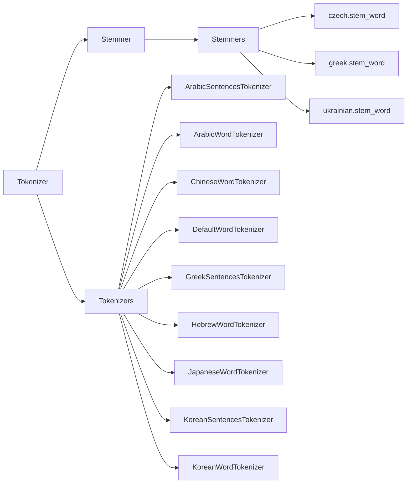

# `sumy.nlp`

## Tree:
```
nlp/
├── stemmers/
│   ├── __init__.py
│   ├── czech.py
│   ├── greek.py
│   └── ukrainian.py
└── tokenizers.py
```

## Role:
Provides text processing utilities for natural language processing tasks, including tokenization and stemming capabilities.

## Description:
The nlp module contains core utilities for processing text in natural language processing applications. It provides both tokenization and stemming functionality that can be used across different languages and text processing pipelines.

## Components:
*   **Tokenizer** (class): A class that provides sentence and word tokenization services for various languages
*   **Tokenizers** (module): Collection of language-specific tokenizers for various languages including Arabic, Chinese, Japanese, Korean, Hebrew, Greek, and others
*   **Stemmer** (class): A class that provides unified access to language-specific text stemming operations
*   **Stemmers** (module): Collection of specialized stemmers for Czech, Greek, Ukrainian, and other languages



## Public API:
*   **Tokenizer(language)**: Constructor that creates a language-aware tokenizer instance
*   **Tokenizer.to_sentences(paragraph)**: Splits text into individual sentences
*   **Tokenizer.to_words(sentence)**: Extracts valid words from a sentence
*   **Stemmer(language)**: Constructor that creates a language-specific stemmer instance
*   **Stemmer.__call__(word)**: Applies stemming to a word

## Dependencies:
*   **Internal**: 
    *   `sumy.utils.normalize_language` - for language name normalization
    *   `sumy.utils.to_unicode` - for Unicode string conversion
*   **External**:
    *   `nltk` - provides standard tokenization and stemming algorithms
    *   `pyarabic` - required for Arabic text processing
    *   `jieba` - required for Chinese word segmentation
    *   `tinysegmenter` - required for Japanese text processing
    *   `konlpy` - required for Korean text processing
    *   `hebrew_tokenizer` - required for Hebrew text processing
    *   `greek-stemmer` - required for Greek stemming
    *   `re` - regular expression support for various stemmers

## Constraints:
*   **Initialization**: Both Tokenizer and Stemmer require valid language identifiers during instantiation
*   **Language Support**: Specialized tokenizers and stemmers are available for specific languages; others fall back to standard implementations
*   **External Dependencies**: Various language-specific features require additional Python packages to be installed

---

## Files

- [`tokenizers.py`](nlp/tokenizers.md)

