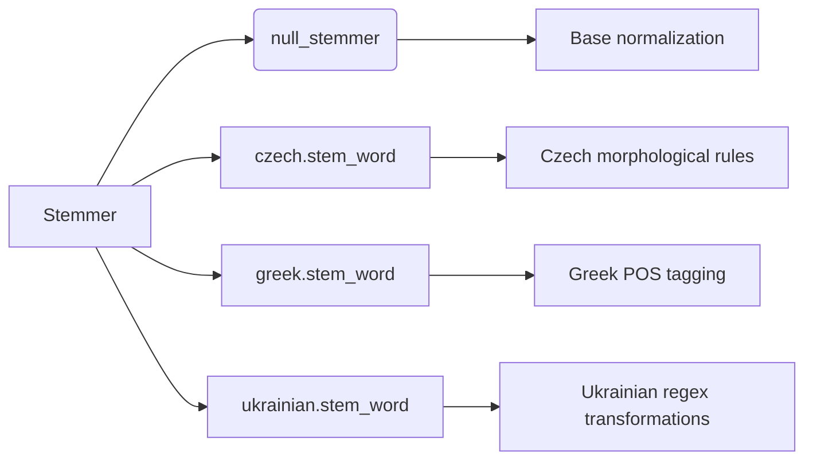

# `sumy.nlp.stemmers`

## Tree:
```
stemmers/
├── __init__.py
├── czech.py
├── greek.py
└── ukrainian.py
```

## Role:
Provides language-specific text stemming capabilities for natural language processing tasks, with unified interface for accessing various linguistic stemmer implementations.

## Description:
The stemmers module offers a cohesive collection of language-specific stemming algorithms designed for natural language processing applications. It provides both general-purpose stemmers for standard languages (using NLTK's Snowball stemmers) and specialized implementations for languages with complex morphological structures such as Czech, Greek, and Ukrainian.

This module serves as a centralized interface for text normalization in multilingual NLP pipelines, allowing developers to seamlessly apply appropriate stemming algorithms based on language requirements without managing the underlying complexity of different linguistic rules.

## Components:
*   **Stemmer** (class): Main interface class that provides unified access to language-specific stemmers
*   **null_stemmer** (function): Fallback stemmer that normalizes text to lowercase Unicode strings
*   **czech.stem_word** (function): Czech-specific word stemming implementation with advanced morphological processing
*   **greek.stem_word** (function): Greek word stemming using the greek-stemmer library
*   **ukrainian.stem_word** (function): Ukrainian word stemming with regex-based morphological transformations



## Public API:
*   **Stemmer(language)**: Constructor that creates a language-specific stemmer instance
    *   Creates a stemmer for the specified language
    *   Uses special-case stemmers for Czech, Ukrainian, and Greek
    *   Falls back to NLTK Snowball stemmers for standard languages
*   **Stemmer.__call__(word)**: Applies stemming to a word
    *   Takes a word string as input
    *   Returns the stemmed version of the word
*   **null_stemmer(object)**: Basic text normalization
    *   Converts any input to lowercase Unicode string
    *   Used as fallback when no specific stemmer is available
*   **czech.stem_word(word, aggressive=False)**: Czech word stemming
    *   Performs case removal and possessive ending stripping by default
    *   Applies additional morphological transformations when aggressive=True
*   **greek.stem_word(word)**: Greek word stemming
    *   Uses greek-stemmer library with multiple POS tags
    *   Filters results based on consonant endings
*   **ukrainian.stem_word(word)**: Ukrainian word stemming
    *   Applies regex-based transformations to remove inflectional endings
    *   Follows Ukrainian morphological rules for RV region identification

## Dependencies:
*   **Internal**: 
    *   `sumy.utils.normalize_language` - for language name normalization
    *   `sumy.utils.to_unicode` - for Unicode string conversion
*   **External**:
    *   `nltk.stem.snowball` - provides standard Snowball stemmer implementations for languages not specially handled
    *   `greek-stemmer` - required for Greek stemming functionality
    *   `re` - regular expression support for Ukrainian stemming

## Constraints:
*   **Thread Safety**: The Stemmer class is thread-safe as long as the underlying NLTK stemmers and language-specific implementations are thread-safe
*   **Initialization**: The Stemmer class requires a valid language identifier during instantiation
*   **Language Support**: Specialized stemmers are available for Czech, Ukrainian, and Greek; other languages fall back to NLTK Snowball stemmers
*   **External Dependencies**: The Greek stemmer requires the `greek-stemmer` Python package to be installed

---

## Files

- [`__init__.py`](stemmers/__init__.md)
- [`czech.py`](stemmers/czech.md)
- [`greek.py`](stemmers/greek.md)
- [`ukrainian.py`](stemmers/ukrainian.md)

