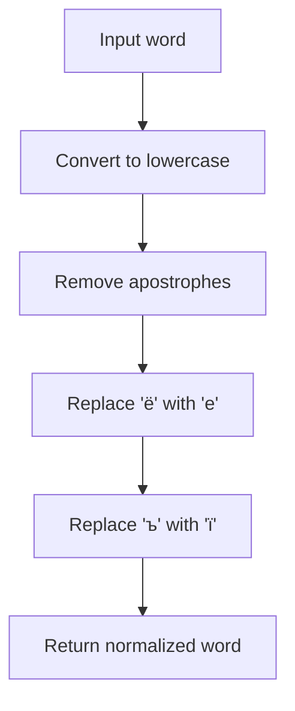

# `ukrainian.py`

## `sumy.nlp.stemmers.ukrainian.stem_word` · *function*

## Summary:
Applies Ukrainian word stemming by removing inflectional suffixes and applying morphological transformations to reduce words to their base form.

## Description:
This function performs Ukrainian word stemming by applying a series of regex-based transformations to remove inflectional endings and derivational suffixes. It follows a specific algorithm that identifies the RV region in Ukrainian words and applies successive transformations based on word categories. The function is designed to normalize Ukrainian text for information retrieval and natural language processing applications.

## Args:
    word (str): The Ukrainian word to be stemmed. Must be a string containing Cyrillic characters.

## Returns:
    str: The stemmed version of the input word with inflectional endings removed. Returns the original word unchanged if it contains no Ukrainian vowels or if no transformations apply.

## Raises:
    None: This function does not explicitly raise exceptions, though underlying regex operations may raise exceptions in edge cases.

## Constraints:
    Preconditions:
        - Input must be a string type
        - Input should contain valid Ukrainian Cyrillic characters
        
    Postconditions:
        - Output is a normalized Ukrainian word in lowercase
        - All inflectional suffixes have been removed according to Ukrainian morphology rules
        - Word maintains semantic meaning while being reduced to its root form

## Side Effects:
    None: This function has no side effects and is pure.

## Control Flow:
```mermaid
flowchart TD
    A[Input word] --> B[_preprocess(word)]
    B --> C[Check for Ukrainian vowels]
    C -->|No vowels| D[Return word unchanged]
    C -->|Has vowels| E[Find RV region]
    E --> F[Split word into start and suffix]
    F --> G[Apply PERFECTIVE_GROUND transformation]
    G -->|Not updated| H[Apply REFLEXIVE transformation]
    H --> I[Apply ADJECTIVE transformation]
    I -->|Updated| J[Apply PARTICIPLE transformation]
    J -->|Not updated| K[Apply VERB transformation]
    K -->|Not updated| L[Apply NOUN transformation]
    L --> M[Apply 'и$' transformation]
    M --> N[Check DERIVATIONAL pattern]
    N --> O[Apply 'ость$' transformation if matched]
    O --> P[Apply 'ь$' transformation]
    P -->|Updated| Q[Apply 'ейше?$' transformation]
    Q --> R[Apply 'нн$' transformation]
    R --> S[Return start + suffix]
```

## Examples:
    >>> stem_word("програмування")
    'програмуван'
    
    >>> stem_word("роботи")
    'робот'
    
    >>> stem_word("містом")
    'міст'
    
    >>> stem_word("hello")
    'hello'
```

## `sumy.nlp.stemmers.ukrainian._preprocess` · *function*

## Summary:
Normalizes Ukrainian text by converting to lowercase and replacing specific Cyrillic characters with their equivalents.

## Description:
This private function processes Ukrainian words by performing character normalization to ensure consistent text representation for stemming operations. It converts all characters to lowercase, removes apostrophes, and replaces specific Cyrillic characters ('ё' and 'ъ') with their standard Ukrainian equivalents ('е' and 'ї').

## Args:
    word (str): The Ukrainian word to preprocess. Must be a string containing Cyrillic characters.

## Returns:
    str: The normalized word with lowercase conversion and character replacements applied. Returns an empty string if input is empty.

## Raises:
    None: This function does not raise any exceptions.

## Constraints:
    Preconditions:
        - Input must be a string type
        - Function handles Unicode strings properly
    
    Postconditions:
        - Output string contains only lowercase characters
        - Apostrophes are completely removed from the input
        - Characters 'ё' and 'ъ' are replaced with 'е' and 'ї' respectively

## Side Effects:
    None: This function has no side effects and is pure.

## Control Flow:


## Examples:
    >>> _preprocess("Привіт'")
    'привіт'
    
    >>> _preprocess("МістоЁ")
    'містоє'
    
    >>> _preprocess("ТестЪ")
    'тестї'
    
    >>> _preprocess("HELLO")
    'hello'
    
    >>> _preprocess("")
    ''

## `sumy.nlp.stemmers.ukrainian._update_suffix` · *function*

*No documentation generated.*

