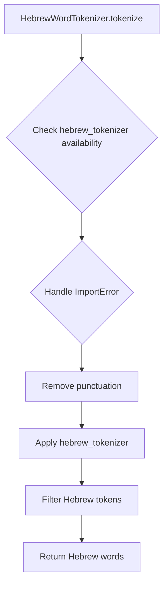
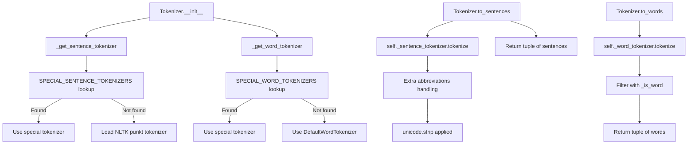

# `tokenizers.py`

## `sumy.nlp.tokenizers.DefaultWordTokenizer` · *class*

## Summary:
DefaultWordTokenizer provides a standard English word tokenization service using NLTK's word_tokenize function.

## Description:
This class serves as the default implementation for word tokenization in the sumy NLP toolkit. It wraps NLTK's word_tokenize function to provide a consistent interface for splitting text into individual words. This tokenizer is primarily intended for English text processing and acts as a fallback when language-specific tokenizers are not available or applicable.

The class follows a simple interface pattern where tokenization is performed by calling the tokenize method with a text string, returning a list of tokens.

## State:
- No instance attributes maintained
- The class does not store any state between method calls
- All processing is stateless and depends solely on the input text parameter

## Lifecycle:
- Creation: Instantiated without arguments (no constructor parameters required)
- Usage: Call the tokenize() method with a text string argument
- Destruction: No special cleanup required; relies on Python's garbage collection

## Method Map:
```mermaid
graph TD
    A[DefaultWordTokenizer] --> B[tokenize(text)]
    B --> C[nltk.word_tokenize(text)]
```

## Raises:
- No explicit exceptions defined in the implementation
- May raise exceptions from nltk.word_tokenize if input validation fails (though this is typically handled by NLTK internally)

## Example:
```python
from sumy.nlp.tokenizers import DefaultWordTokenizer

tokenizer = DefaultWordTokenizer()
tokens = tokenizer.tokenize("Hello world! How are you?")
# Returns: ['Hello', 'world', '!', 'How', 'are', 'you', '?']
```

### `sumy.nlp.tokenizers.DefaultWordTokenizer.tokenize` · *method*

## Summary:
Tokenizes input text into individual words and punctuation marks using NLTK's word tokenizer.

## Description:
This method provides a standardized interface to NLTK's word tokenization functionality, converting a text string into a list of word tokens while properly separating punctuation and special characters. It is part of the DefaultWordTokenizer class that implements a consistent word-level tokenization approach for the sumy library's text processing pipeline.

The method delegates to `nltk.word_tokenize()` which performs sophisticated tokenization that handles English contractions, punctuation, and various linguistic edge cases appropriately. It treats punctuation as separate tokens and maintains the original spacing and formatting relationships.

## Args:
    text (str): The input text string to be tokenized into individual words and punctuation tokens.

## Returns:
    list[str]: A list of tokenized elements (words and punctuation) extracted from the input text.

## Raises:
    AttributeError: If NLTK is not properly installed or the word_tokenize function is not accessible.
    TypeError: If the input text is not a string type.

## State Changes:
    Attributes READ: None
    Attributes WRITTEN: None

## Constraints:
    Preconditions: The input text must be a valid string. NLTK must be properly installed and available in the Python environment.
    Postconditions: The returned list contains individual word tokens and punctuation marks as separate elements, preserving the original text structure.

## Side Effects:
    None

## `sumy.nlp.tokenizers.HebrewWordTokenizer` · *class*

## Summary:
A class method for tokenizing Hebrew text by removing punctuation and extracting Hebrew words using the hebrew_tokenizer library.

## Description:
The HebrewWordTokenizer.tokenize classmethod provides functionality to process Hebrew text by removing punctuation and extracting only Hebrew characters and words. This method requires the external hebrew_tokenizer library to be installed. It serves as a specialized text processing utility for Hebrew language processing tasks in natural language processing pipelines.

## State:
- `_TRANSLATOR`: A class attribute that maps punctuation characters to None, effectively removing them from text during tokenization. This is created using `str.maketrans("", "", string.punctuation)`.

## Lifecycle:
- Creation: The classmethod can be invoked directly without instantiation using `HebrewWordTokenizer.tokenize(text)`.
- Usage: Call the `tokenize` classmethod with a Hebrew text string as the argument. The method will remove punctuation and apply the hebrew_tokenizer library to extract Hebrew words.
- Destruction: No special cleanup required as it's a stateless utility method.

## Method Map:


## Raises:
- `ValueError`: Raised when the `hebrew_tokenizer` library is not installed, with a message instructing the user to install it via `pip install hebrew_tokenizer`.

## Example:
```python
from sumy.nlp.tokenizers import HebrewWordTokenizer

# Tokenize Hebrew text (requires hebrew_tokenizer library)
text = "שלום עולם! איך אתה?"
try:
    tokens = HebrewWordTokenizer.tokenize(text)
    print(tokens)  # Output would be a list of Hebrew words
except ValueError as e:
    print(f"Error: {e}")
```

### `sumy.nlp.tokenizers.HebrewWordTokenizer.tokenize` · *method*

## Summary:
Extracts Hebrew words from text by applying Hebrew tokenization and filtering for Hebrew character groups.

## Description:
This class method processes Hebrew text by first removing punctuation using the class's punctuation translator, then applying the external `hebrew_tokenizer` library to break the text into tokens. It filters the resulting tokens to include only those belonging to Hebrew character groups (HEBREW, HEBREW_1, HEBREW_2) and returns the corresponding word strings.

## Args:
    cls: The class object (required for classmethod)
    text (str): The Hebrew text string to tokenize and extract words from.

## Returns:
    list[str]: A list of Hebrew words extracted from the input text, with punctuation removed.

## Raises:
    ValueError: When the required `hebrew_tokenizer` package is not installed.

## State Changes:
    Attributes READ: cls._TRANSLATOR
    Attributes WRITTEN: None

## Constraints:
    Preconditions: 
    - The input text must be a string
    - The `hebrew_tokenizer` package must be installed
    - The class must have `_TRANSLATOR` attribute properly initialized
    
    Postconditions:
    - Returns a list of strings containing only Hebrew words
    - All punctuation has been stripped from the input text before processing
    - Only tokens classified as Hebrew character groups are included in the result

## Side Effects:
    None

## `sumy.nlp.tokenizers.JapaneseWordTokenizer` · *class*

## Summary:
JapaneseWordTokenizer is a text processing class that performs word segmentation on Japanese text using the TinySegmenter library.

## Description:
This class provides Japanese-specific word tokenization functionality by wrapping the TinySegmenter library. It is designed to split Japanese sentences into meaningful word units (tokens) that can be used for further natural language processing tasks such as text summarization, analysis, or machine learning applications.

The tokenizer is specifically intended for Japanese text where word boundaries are not explicitly marked like in English, making proper segmentation crucial for accurate processing.

## State:
- No instance attributes maintained
- The class relies on the tinysegmenter library for actual tokenization
- Requires tinysegmenter library to be installed in the environment

## Lifecycle:
- Creation: Instantiated without arguments (no constructor parameters required)
- Usage: Call the tokenize() method with a Japanese text string as input
- Destruction: No special cleanup required; relies on Python's garbage collection

## Method Map:
```mermaid
graph TD
    A[JapaneseWordTokenizer] --> B[tokenize(text)]
    B --> C{tinysegmenter imported?}
    C -->|No| D[ValueError: tinysegmenter required]
    C -->|Yes| E[segmenter.tokenize(text)]
    E --> F[Return tokenized words]
```

## Raises:
- ValueError: Raised when the tinysegmenter library is not installed, with a helpful installation instruction message

## Example:
```python
# Create tokenizer instance
tokenizer = JapaneseWordTokenizer()

# Tokenize Japanese text
text = "私はPythonを好きです"
tokens = tokenizer.tokenize(text)
# Returns: ['私', 'は', 'Python', 'を', '好', 'き', 'です']
```

### `sumy.nlp.tokenizers.JapaneseWordTokenizer.tokenize` · *method*

## Summary:
Tokenizes Japanese text into individual word segments using the tinysegmenter library.

## Description:
This method performs Japanese word segmentation by utilizing the tinysegmenter library, which is specifically designed for Japanese text processing. It serves as a language-specific implementation for handling Japanese text tokenization within the sumy library's text processing pipeline.

The method attempts to import tinysegmenter and raises a descriptive error if it's not available, ensuring users know exactly how to install the required dependency. It creates a TinySegmenter instance and applies it to the input text to produce a list of word segments.

## Args:
    text (str): The Japanese text string to be tokenized into individual word segments.

## Returns:
    list[str]: A list of tokenized Japanese word segments extracted from the input text.

## Raises:
    ValueError: When the tinysegmenter library is not installed, with a descriptive message instructing users to install it via 'pip install tinysegmenter'.

## State Changes:
    Attributes READ: None
    Attributes WRITTEN: None

## Constraints:
    Preconditions: The input text must be a valid string containing Japanese characters.
    Postconditions: The returned list contains individual Japanese word segments properly segmented by the tinysegmenter algorithm.

## Side Effects:
    None

## `sumy.nlp.tokenizers.ChineseWordTokenizer` · *class*

## Summary:
A Chinese word tokenizer that segments Chinese text into individual words using the jieba library.

## Description:
This class provides Chinese text tokenization functionality by leveraging the jieba library, which is specifically designed for Chinese word segmentation. It serves as a wrapper around jieba's cutting functionality to provide a consistent interface for Chinese text processing within the sumy library ecosystem.

The tokenizer is intended to be used when processing Chinese language documents for natural language processing tasks such as text summarization, where proper word segmentation is crucial for accurate analysis.

## State:
- No instance attributes maintained
- The class relies on the jieba library being available at runtime
- No initialization parameters required

## Lifecycle:
- Creation: Instantiation is straightforward with no constructor arguments required
- Usage: Call the `tokenize()` method with a Unicode string containing Chinese text
- Destruction: No special cleanup required as it's a simple stateless wrapper

## Method Map:
```mermaid
graph TD
    A[ChineseWordTokenizer] --> B[tokenize(text)]
    B --> C[jieba.cut(text)]
```

## Raises:
- ValueError: Raised when the jieba library is not installed, with a descriptive message instructing users to install it via pip

## Example:
```python
tokenizer = ChineseWordTokenizer()
chinese_text = "这是一个测试句子"
tokens = tokenizer.tokenize(chinese_text)
for token in tokens:
    print(token)
```

### `sumy.nlp.tokenizers.ChineseWordTokenizer.tokenize` · *method*

## Summary:
Segments Chinese text into individual words using the jieba library.

## Description:
This method performs Chinese word segmentation on the provided text using the jieba library. It is designed specifically for processing Chinese text where individual characters do not represent meaningful units, and instead, words need to be identified and segmented properly.

## Args:
    text (str): The Chinese text to be tokenized into individual words.

## Returns:
    generator[str]: A generator yielding individual Chinese words (tokens) from the input text.

## Raises:
    ValueError: When the jieba library is not installed, providing installation instructions.

## State Changes:
    Attributes READ: None
    Attributes WRITTEN: None

## Constraints:
    Preconditions: The input text must be a valid string.
    Postconditions: The returned generator will yield individual Chinese words that form the segmented text.

## Side Effects:
    None

## `sumy.nlp.tokenizers.KoreanSentencesTokenizer` · *class*

## Summary:
A sentence tokenizer for Korean text that splits input text into individual sentences using the Kkma tokenizer from konlpy.

## Description:
This class provides sentence segmentation functionality specifically for Korean language text. It serves as a wrapper around the Kkma tokenizer from the konlpy library, enabling proper sentence boundary detection for Korean texts. The tokenizer is designed to be used in natural language processing pipelines where Korean text needs to be broken down into discrete sentences for further analysis.

## State:
- No instance attributes maintained
- The class relies on the konlpy library's Kkma tokenizer internally
- Requires konlpy to be installed for proper operation

## Lifecycle:
- Creation: Instantiate the class without arguments (no constructor parameters required)
- Usage: Call the `tokenize()` method with a Korean text string as input
- Destruction: No special cleanup required; relies on Python's garbage collection

## Method Map:
```mermaid
graph TD
    A[KoreanSentencesTokenizer] --> B[tokenize(text)]
    B --> C{konlpy import}
    C -->|Success| D[Kkma().sentences(text)]
    C -->|Failure| E[ValueError]
```

## Raises:
- ValueError: Raised when the konlpy library is not installed, with a helpful installation instruction message

## Example:
```python
tokenizer = KoreanSentencesTokenizer()
text = "안녕하세요. 저는 프로그래머입니다. 잘 부탁드립니다."
sentences = tokenizer.tokenize(text)
# Returns: ['안녕하세요.', '저는 프로그래머입니다.', '잘 부탁드립니다.']
```

### `sumy.nlp.tokenizers.KoreanSentencesTokenizer.tokenize` · *method*

## Summary:
Splits Korean text into individual sentences using the Kkma tokenizer from konlpy.

## Description:
This method implements sentence tokenization specifically for Korean language text. It leverages the Kkma (Korean Morphological Analyzer) from the konlpy library to accurately segment Korean text into meaningful sentences. The method is designed to be part of a larger tokenization pipeline for multilingual text processing.

## Args:
    text (str): The Korean text to be segmented into sentences.

## Returns:
    list[str]: A list of sentence strings extracted from the input text.

## Raises:
    ValueError: When the konlpy library is not installed, providing installation instructions.

## State Changes:
    Attributes READ: None
    Attributes WRITTEN: None

## Constraints:
    Preconditions: The input text must be a valid string containing Korean characters.
    Postconditions: The returned list contains all sentences from the input text, properly segmented according to Korean sentence boundaries.

## Side Effects:
    I/O: May trigger package installation prompts if konlpy is not available.
    External service calls: Depends on the konlpy library's Kkma tokenizer service.

## `sumy.nlp.tokenizers.KoreanWordTokenizer` · *class*

## Summary:
A Korean text tokenizer that extracts noun tokens using the Kkma morphological analyzer from konlpy.

## Description:
This class provides Korean-specific text tokenization functionality by leveraging the Kkma (Korean Morphological Analyzer) from the konlpy library. It is designed to extract noun tokens from Korean text, making it suitable for Korean natural language processing tasks such as text summarization, topic modeling, and keyword extraction.

The tokenizer is intended to be used as part of a larger text processing pipeline where Korean text needs to be broken down into meaningful noun components for further analysis. It dynamically imports the required konlpy library at runtime to avoid requiring it as a hard dependency.

## State:
- No instance attributes maintained
- The class does not store any state between method calls
- All processing is performed inline during the tokenize method execution

## Lifecycle:
- Creation: Instantiation requires no arguments
- Usage: Call the tokenize() method with a Korean text string as input
- Destruction: No special cleanup required; standard Python garbage collection applies

## Method Map:
```mermaid
graph TD
    A[KoreanWordTokenizer] --> B[tokenize(text)]
    B --> C{konlpy available?}
    C -->|No| D[ValueError]
    C -->|Yes| E[Kkma().nouns(text)]
    E --> F[Return noun tokens]
```

## Raises:
- ValueError: Raised when the konlpy library is not installed, with a message directing users to install it via 'pip install konlpy'

## Example:
```python
tokenizer = KoreanWordTokenizer()
korean_text = "한국어 텍스트를 처리합니다."
tokens = tokenizer.tokenize(korean_text)
# Returns list of Korean noun tokens from the input text
```

### `sumy.nlp.tokenizers.KoreanWordTokenizer.tokenize` · *method*

## Summary:
Extracts noun tokens from Korean text using the Kkma tokenizer.

## Description:
This method performs Korean text tokenization by identifying and returning all noun terms from the input text. It utilizes the Kkma (Korean Natural Language Processing Toolkit) from the konlpy library to perform morphological analysis and extract noun components. This method is part of the KoreanWordTokenizer class and serves as the primary tokenization interface for Korean text processing.

## Args:
    text (str): The Korean text to be tokenized into noun components.

## Returns:
    list[str]: A list of noun tokens extracted from the input text. Each token is a string representing a Korean noun found in the text.

## Raises:
    ValueError: When the konlpy library is not installed, indicating that the Korean tokenizer requires konlpy to be installed via 'pip install konlpy'.

## State Changes:
    Attributes READ: None
    Attributes WRITTEN: None

## Constraints:
    Preconditions: 
    - The input text must be a valid string containing Korean characters
    - The konlpy library must be installed in the environment
    Postconditions:
    - Returns a list of strings representing Korean noun tokens
    - Empty list is returned if no nouns are found in the text

## Side Effects:
    None

## `sumy.nlp.tokenizers.GreekSentencesTokenizer` · *class*

## Summary:
A class for tokenizing Greek text into sentences using NLTK's Greek language support and handling semicolon-based sentence splits.

## Description:
The GreekSentencesTokenizer provides a specialized method for breaking Greek text into individual sentences. It leverages NLTK's sentence tokenization capabilities with Greek language support, followed by additional processing to handle semicolon-separated clauses within sentences. This tokenizer is particularly useful for Greek text analysis where semicolons may indicate sentence boundaries that NLTK's basic tokenizer might not properly recognize.

## State:
- No instance attributes or state maintained
- The class operates purely on input text and uses classmethod for processing

## Lifecycle:
- Creation: Instantiation not required as it's a classmethod-based utility
- Usage: Call `GreekSentencesTokenizer.tokenize(text)` with Greek text as argument
- Destruction: No cleanup required as it's a stateless utility class

## Method Map:
```mermaid
graph TD
    A[Input Greek Text] --> B[nltk.sent_tokenize(language='greek')]
    B --> C[re.split(r'(?<=[;;])\\s+', sentence)]
    C --> D[filter(None, ...)]
    D --> E[sentence.strip()]
    E --> F[Return list of sentences]
```

## Raises:
- None explicitly raised by the tokenize method
- May raise exceptions from NLTK's sent_tokenize if invalid language parameter or text processing issues occur

## Example:
```python
from sumy.nlp.tokenizers import GreekSentencesTokenizer

text = "Αυτό είναι ένα παράδειγμα. Αυτό είναι ένα άλλο παράδειγμα;"
sentences = GreekSentencesTokenizer.tokenize(text)
# Returns: ['Αυτό είναι ένα παράδειγμα.', 'Αυτό είναι ένα άλλο παράδειγμα']
```

### `sumy.nlp.tokenizers.GreekSentencesTokenizer.tokenize` · *method*

## Summary:
Splits Greek text into individual sentences using NLTK sentence tokenizer with Greek language support, then splits semicolon-separated sentences into separate entries.

## Description:
This method performs sentence tokenization specifically for Greek text by leveraging NLTK's sentence tokenizer configured for Greek language. It then processes each sentence to split on semicolon+whitespace patterns, effectively separating sentences that were joined by semicolons. Empty results from splitting are filtered out, and all resulting sentences have leading/trailing whitespace removed.

## Args:
    text (str): The Greek text to be tokenized into sentences.

## Returns:
    list[str]: A list of individual Greek sentences, where semicolon-separated sentences have been split into separate entries and all sentences have whitespace stripped.

## Raises:
    None explicitly raised, but may raise exceptions from nltk.sent_tokenize if text processing fails or if NLTK Greek language data is not available.

## State Changes:
    None - This is a pure function that doesn't modify object state.

## Constraints:
    Preconditions:
        - Input text must be a valid string
        - NLTK Greek language data must be installed
    
    Postconditions:
        - Returns a list of non-empty strings representing individual sentences
        - All returned sentences have leading/trailing whitespace removed
        - Sentence splitting preserves the semantic integrity of Greek text

## Side Effects:
    - Calls NLTK's sentence tokenizer which may require downloading language data
    - May trigger network activity if NLTK language data needs to be downloaded

## `sumy.nlp.tokenizers.ArabicWordTokenizer` · *class*

## Summary:
Provides Arabic word tokenization functionality by wrapping the pyarabic library.

## Description:
The ArabicWordTokenizer class serves as a specialized tokenizer for Arabic text, utilizing the pyarabic library's tokenize function. It acts as a wrapper that handles the dependency on pyarabic and provides appropriate error messages when the library is not installed. This class is designed to be used in natural language processing pipelines where Arabic text needs to be broken down into individual words or tokens.

## State:
- No instance attributes maintained
- The class relies entirely on the pyarabic library for tokenization functionality
- No constructor parameters required as it's a simple functional wrapper

## Lifecycle:
- Creation: Instantiation is straightforward with no required arguments
- Usage: Call the tokenize() method with Arabic text as a string argument
- Destruction: No special cleanup required as it's a simple stateless wrapper

## Method Map:
```mermaid
graph TD
    A[ArabicWordTokenizer] --> B[tokenize(text)]
    B --> C{pyarabic available?}
    C -->|Yes| D[pyarabic.araby.tokenize(text)]
    C -->|No| E[ValueError]
```

## Raises:
- ValueError: Raised when the pyarabic library is not installed, with a descriptive message instructing the user to install it via 'pip install pyarabic'

## Example:
```python
# Create tokenizer instance
tokenizer = ArabicWordTokenizer()

# Tokenize Arabic text
arabic_text = "هذا نص عربي للاختبار"
tokens = tokenizer.tokenize(arabic_text)
print(tokens)  # Output will be the tokenized Arabic text
```

### `sumy.nlp.tokenizers.ArabicWordTokenizer.tokenize` · *method*

## Summary:
Tokenizes Arabic text into individual words using the pyarabic library.

## Description:
This method performs word tokenization on Arabic text by leveraging the pyarabic library's tokenize function. It serves as a wrapper around the external Arabic tokenizer to provide consistent interface for Arabic text processing within the sumy library ecosystem.

## Args:
    text (str): The Arabic text string to be tokenized into individual words.

## Returns:
    list[str]: A list of tokenized Arabic words extracted from the input text.

## Raises:
    ValueError: When the pyarabic library is not installed, providing installation instructions.

## State Changes:
    Attributes READ: None
    Attributes WRITTEN: None

## Constraints:
    Preconditions: The input text must be a valid string containing Arabic characters.
    Postconditions: The returned list contains individual Arabic words with proper tokenization.

## Side Effects:
    None

## `sumy.nlp.tokenizers.ArabicSentencesTokenizer` · *class*

## Summary:
Splits Arabic text into individual sentences using the pyarabic library.

## Description:
The ArabicSentencesTokenizer class provides functionality to split Arabic text into individual sentences. It serves as a specialized tokenizer for Arabic language processing tasks within the sumy library ecosystem. This class is designed to work with Arabic text specifically and relies on the pyarabic library for the actual tokenization process.

## State:
This class maintains no instance state beyond what's required for its operation. The tokenize method operates purely on its input parameter and does not store any data between invocations.

## Lifecycle:
Creation: The class can be instantiated without any constructor arguments. It is a simple utility class with no required initialization parameters.
Usage: The tokenize() method accepts Arabic text as a string argument and returns a list of sentences.
Destruction: No special cleanup is required as the class doesn't manage any resources that need explicit disposal.

## Method Map:
```mermaid
graph TD
    A[ArabicSentencesTokenizer] --> B[tokenize(text)]
    B --> C{Import pyarabic}
    C -->|Success| D[sentence_tokenize(text)]
    C -->|Failure| E[ValueError]
```

## Raises:
- ValueError: Raised when the pyarabic library is not installed, with a descriptive message instructing the user to install it via 'pip install pyarabic'.

## Example:
```python
from sumy.nlp.tokenizers import ArabicSentencesTokenizer

# Create tokenizer instance
tokenizer = ArabicSentencesTokenizer()

# Tokenize Arabic text
arabic_text = "مرحبا بالعالم. كيف حالك؟"
sentences = tokenizer.tokenize(arabic_text)

# Result would be a list of sentences
# ['مرحبا بالعالم.', 'كيف حالك؟']
```

### `sumy.nlp.tokenizers.ArabicSentencesTokenizer.tokenize` · *method*

## Summary:
Splits Arabic text into individual sentences using the pyarabic library.

## Description:
This method tokenizes Arabic text by dividing it into logical sentence boundaries. It serves as a language-specific implementation for processing Arabic text in natural language processing pipelines. The method is part of the ArabicSentencesTokenizer class and is typically used during the preprocessing phase of text analysis workflows.

## Args:
    text (str): The Arabic text to be tokenized into sentences.

## Returns:
    list[str]: A list of strings, where each string represents a sentence from the input text.

## Raises:
    ValueError: If the pyarabic library is not installed, with a message instructing the user to install it via 'pip install pyarabic'.

## State Changes:
    Attributes READ: None
    Attributes WRITTEN: None

## Constraints:
    Preconditions: The input text must be a valid string containing Arabic characters.
    Postconditions: The returned list contains all sentences from the input text, properly separated.

## Side Effects:
    None

## `sumy.nlp.tokenizers.Tokenizer` · *class*

## Summary:
Tokenizer is a multilingual text processing class that provides sentence and word tokenization services for various languages.

## Description:
The Tokenizer class enables text processing by segmenting text into sentences and words according to language-specific rules. It is initialized with a language specification and provides methods for converting text into linguistic units.

## State:
- `_language` (str): The configured language for this tokenizer instance, stored as a normalized language code
- `_sentence_tokenizer`: An instance of a sentence tokenizer appropriate for the configured language
- `_word_tokenizer`: An instance of a word tokenizer appropriate for the configured language
- `LANGUAGE_ALIASES` (dict): Maps language aliases to canonical language names (e.g., "slovak" → "czech")
- `LANGUAGE_EXTRA_ABREVS` (dict): Contains additional abbreviations for specific languages to improve sentence tokenization accuracy
- `SPECIAL_SENTENCE_TOKENIZERS` (dict): Language-specific sentence tokenizers for languages requiring custom handling
- `SPECIAL_WORD_TOKENIZERS` (dict): Language-specific word tokenizers for languages requiring custom handling

## Lifecycle:
- Creation: Instantiate with a language parameter (e.g., `Tokenizer('english')`). The constructor normalizes the language name and initializes appropriate tokenizers.
- Usage: Call `to_sentences()` to split paragraphs into sentences, and `to_words()` to break sentences into valid words. These methods can be called repeatedly on the same instance.
- Destruction: No special cleanup required; relies on Python's garbage collection.

## Method Map:


## Raises:
- `LookupError`: Raised during initialization when NLTK tokenizers are missing or when a language is not supported. This occurs when trying to load NLTK punkt tokenizers that aren't installed or when the language isn't supported by NLTK.

## Example:
```python
from sumy.nlp.tokenizers import Tokenizer

# Create tokenizer for English
tokenizer = Tokenizer('english')

# Split paragraph into sentences
paragraph = "Hello world! How are you today? I'm fine."
sentences = tokenizer.to_sentences(paragraph)
# Returns: ('Hello world!', 'How are you today?', "I'm fine.")

# Split sentence into words
sentence = "Hello world!"
words = tokenizer.to_words(sentence)
# Returns: ('Hello', 'world')
```

### `sumy.nlp.tokenizers.Tokenizer.__init__` · *method*

*No documentation generated.*

### `sumy.nlp.tokenizers.Tokenizer.language` · *method*

## Summary:
Returns the language setting of the tokenizer instance.

## Description:
This method provides access to the language configuration that determines how text will be tokenized. It serves as a getter for the internal `_language` attribute that is initialized during object construction.

The language property is used throughout the tokenizer's lifecycle to select appropriate tokenization strategies for sentence and word segmentation based on the specified language. This method is called by various tokenization methods like `to_sentences()` and `to_words()` to determine which tokenizers to use.

## Args:
    None

## Returns:
    str: The language identifier string that was set during initialization.

## Raises:
    None

## State Changes:
    Attributes READ: self._language
    Attributes WRITTEN: None

## Constraints:
    Preconditions: The Tokenizer object must be properly initialized with a valid language parameter.
    Postconditions: The returned value is identical to the language parameter passed to the constructor.

## Side Effects:
    None

### `sumy.nlp.tokenizers.Tokenizer._get_sentence_tokenizer` · *method*

## Summary:
Retrieves an appropriate sentence tokenizer for the specified language, either from special implementations or NLTK punkt tokenizers.

## Description:
This method serves as a factory for sentence tokenizers, providing language-specific implementations for various languages. It is called during Tokenizer initialization to set up the sentence tokenizer for the specified language. The method prioritizes special-case tokenizers for languages that require custom handling, falling back to standard NLTK punkt tokenizers for other languages.

## Args:
    language (str): Language code for which to retrieve a sentence tokenizer

## Returns:
    nltk.TokenizerI or custom tokenizer: A sentence tokenizer instance appropriate for the specified language

## Raises:
    LookupError: When NLTK tokenizers are missing or the specified language is not supported

## State Changes:
    Attributes READ: self.SPECIAL_SENTENCE_TOKENIZERS
    Attributes WRITTEN: None

## Constraints:
    Preconditions: The language parameter must be a valid language identifier recognized by the system
    Postconditions: Returns a valid sentence tokenizer instance for the specified language

## Side Effects:
    I/O operations: Loads tokenizer data from NLTK data files when using standard punkt tokenizers
    External service calls: Depends on NLTK data availability and proper installation

### `sumy.nlp.tokenizers.Tokenizer._get_word_tokenizer` · *method*

## Summary:
Selects and returns an appropriate word tokenizer for the specified language, falling back to a default tokenizer if none is available.

## Description:
This method serves as a factory for word tokenizers, choosing between language-specific implementations and a default tokenizer based on the provided language parameter. It is called during the initialization of the Tokenizer class to set up the appropriate word tokenization strategy for the specified language.

The method checks if a special word tokenizer exists for the given language in the SPECIAL_WORD_TOKENIZERS dictionary. If found, it returns that specific tokenizer; otherwise, it returns a DefaultWordTokenizer instance as a fallback mechanism.

## Args:
    language (str): The language code for which to retrieve a word tokenizer (e.g., 'english', 'chinese', 'japanese')

## Returns:
    BaseWordTokenizer: Either a language-specific word tokenizer from SPECIAL_WORD_TOKENIZERS or a DefaultWordTokenizer instance

## Raises:
    None explicitly raised - however, the method relies on the existence of proper tokenizer classes in SPECIAL_WORD_TOKENIZERS and DefaultWordTokenizer

## State Changes:
    Attributes READ: self.SPECIAL_WORD_TOKENIZERS
    Attributes WRITTEN: None

## Constraints:
    Preconditions: 
    - The language parameter must be a valid string that can be processed by the tokenizer system
    - SPECIAL_WORD_TOKENIZERS must be properly initialized in the Tokenizer class
    
    Postconditions:
    - Returns a valid word tokenizer instance that implements the tokenize method
    - The returned tokenizer is suitable for the specified language

## Side Effects:
    None - This method performs no I/O operations or external service calls

### `sumy.nlp.tokenizers.Tokenizer.to_sentences` · *method*

## Summary:
Converts a paragraph of text into a tuple of individual sentences by applying language-specific sentence tokenization.

## Description:
This method processes a given paragraph of text and splits it into individual sentences using the appropriate sentence tokenizer for the configured language. It handles language-specific abbreviations and ensures proper text normalization before returning the sentence tokens.

## Args:
    paragraph (str): The input text paragraph to be split into sentences.

## Returns:
    tuple[str]: A tuple containing individual sentences extracted from the input paragraph, with leading/trailing whitespace removed from each sentence.

## Raises:
    None explicitly raised, but underlying tokenizer may raise exceptions for malformed input.

## State Changes:
    Attributes READ: 
        - self._sentence_tokenizer: The sentence tokenizer instance used for tokenization
        - self._language: Language identifier used to determine language-specific settings
        - self.LANGUAGE_EXTRA_ABREVS: Class attribute mapping languages to extra abbreviation lists
    
    Attributes WRITTEN: 
        - None: This method does not modify any instance attributes directly

## Constraints:
    Preconditions:
        - self._sentence_tokenizer must be initialized and callable
        - self._language must be set to a valid language identifier
        - paragraph must be convertible to unicode string
        
    Postconditions:
        - Returns a tuple of strings, each representing a sentence
        - All returned sentences have leading and trailing whitespace stripped
        - The number of sentences in the returned tuple corresponds to the number of sentences identified by the tokenizer

## Side Effects:
    None: This method performs no I/O operations or external service calls. It only processes the input text and returns results.

### `sumy.nlp.tokenizers.Tokenizer.to_words` · *method*

## Summary:
Converts a sentence into a tuple of valid words by applying language-specific tokenization followed by filtering of non-word tokens.

## Description:
Transforms a textual sentence into a sequence of valid words by first performing language-aware word tokenization and then filtering out tokens that don't meet the criteria for being a "word" according to the internal word pattern validation.

This method is typically called during the text preprocessing phase of natural language processing pipelines, specifically when converting raw text into discrete word units for further analysis such as summarization or topic modeling.

The method leverages language-specific tokenizers when available, falling back to a default English tokenizer for unsupported languages. The resulting tokens are filtered to exclude punctuation, numbers, and other non-word elements.

## Args:
    sentence (str): The input sentence to be converted into words. Must be a valid string.

## Returns:
    tuple[str]: A tuple containing only valid word tokens extracted from the input sentence. Valid words are those matching the internal word pattern that excludes punctuation, numbers, and special characters.

## Raises:
    None explicitly raised by this method. However, underlying tokenization operations may raise exceptions from NLTK or other tokenizer libraries if the input is malformed.

## State Changes:
    Attributes READ: 
    - self._word_tokenizer: Used to perform the initial tokenization
    - self._is_word: Used as a filter function to validate word tokens
    
    Attributes WRITTEN: None

## Constraints:
    Preconditions:
    - Input sentence must be a valid string
    - The tokenizer instance must be properly initialized with a valid language
    
    Postconditions:
    - Return value is always a tuple of strings
    - All returned strings pass the internal word validation pattern
    - Empty input returns empty tuple

## Side Effects:
    None directly observable. However, the method may indirectly cause I/O operations when accessing NLTK data files during initialization of language-specific tokenizers.

### `sumy.nlp.tokenizers.Tokenizer._is_word` · *method*

## Summary:
Determines whether a given string represents a valid word according to the tokenizer's word pattern.

## Description:
Checks if a token matches the established word pattern used by the tokenizer to distinguish valid words from punctuation, numbers, or other non-word elements. This method is used during the word tokenization process to filter out invalid tokens.

The method is called by `to_words()` during sentence processing to ensure only legitimate words are returned in the final tokenized result.

## Args:
    word (str): The token to validate as a potential word

## Returns:
    bool: True if the word matches the word pattern, False otherwise

## Raises:
    None explicitly raised

## State Changes:
    Attributes READ: None
    Attributes WRITTEN: None

## Constraints:
    Preconditions: The input word must be a string
    Postconditions: Returns a boolean value indicating word validity

## Side Effects:
    None

