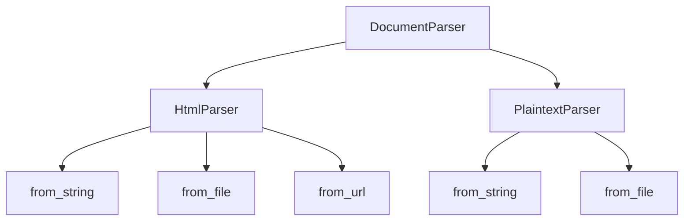

# `sumy.parsers`

## Tree:
```
parsers/
├── html.py
├── parser.py
└── plaintext.py
```

## Role:
Handles document parsing for different input formats (HTML and plain text) to prepare content for text summarization and analysis.

## Description:
The parsers module provides specialized document parsers for different content types, enabling the system to process HTML web pages and plain text documents uniformly for text summarization tasks. This module abstracts the complexities of content extraction and structure recognition, offering a consistent interface for downstream text analysis components.

The module is organized around two primary parser implementations:
1. HtmlParser - for processing HTML content from web pages, files, or URLs
2. PlaintextParser - for processing plain text documents with heading detection

Both parsers inherit from DocumentParser, which provides common tokenization functionality for sentence and word processing.

## Components:
*   `HtmlParser` - Parses HTML content into structured document models with semantic word extraction
*   `PlaintextParser` - Parses plain text content into structured document models with heading recognition
*   `DocumentParser` - Base class providing common tokenization utilities for sentence and word processing



## Public API:
*   `HtmlParser.from_string(string, url, tokenizer)` - Creates HTML parser from string content
*   `HtmlParser.from_file(file_path, url, tokenizer)` - Creates HTML parser from file content  
*   `HtmlParser.from_url(url, tokenizer)` - Creates HTML parser from web URL
*   `PlaintextParser.from_string(string, tokenizer)` - Creates plaintext parser from string content
*   `PlaintextParser.from_file(file_path, tokenizer)` - Creates plaintext parser from file content
*   `DocumentParser(tokenizer)` - Base class constructor for tokenization services

## Dependencies:
*   Internal: breadability library for HTML content extraction in HtmlParser
*   Internal: sumy.utils for document model structures (ObjectDocumentModel, Paragraph, Sentence)
*   External: requests library for HTTP operations in HtmlParser.from_url
*   External: standard library modules (os, io, urllib) for file and URL handling

## Constraints:
*   All parsers require a valid tokenizer instance for sentence and word processing
*   HtmlParser.from_url requires network connectivity for external requests
*   File-based parsers require proper file permissions and existence validation
*   All parsers must be initialized with compatible tokenizer interfaces
*   Thread safety: Parsers are stateless and can be safely used in multi-threaded environments

---

## Files

- [`html.py`](parsers/html.md)
- [`parser.py`](parsers/parser.md)
- [`plaintext.py`](parsers/plaintext.md)

