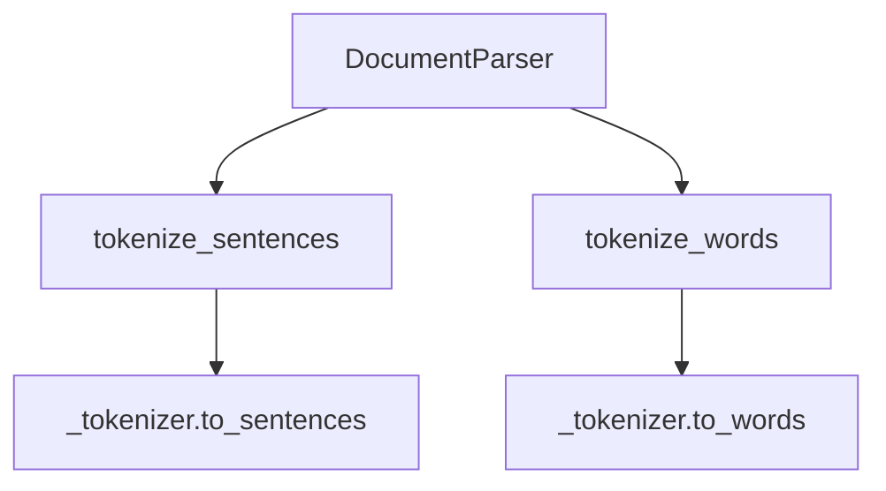

# `parser.py`

## `sumy.parsers.parser.DocumentParser` · *class*

## Summary:
A document parser that tokenizes text into sentences and words using a provided tokenizer.

## Description:
The DocumentParser class serves as a wrapper around a tokenizer object to provide standardized methods for breaking text into sentences and words. It's designed to be used in text processing pipelines where consistent tokenization is required. The class maintains two predefined sets of Czech words - SIGNIFICANT_WORDS and STIGMA_WORDS - which may be used for semantic analysis or keyword identification in the text processing pipeline.

## State:
- _tokenizer: Tokenizer object used for sentence and word tokenization
- SIGNIFICANT_WORDS: Tuple of Czech words considered significant (významný, vynikající, podstatný, význačný, důležitý, slavný, zajímavý, eminentní, vlivný, supr, super, nejlepší, dobrý, kvalitní, optimální, relevantní)
- STIGMA_WORDS: Tuple of Czech words considered negative/stigmatizing (nejhorší, zlý, šeredný)

## Lifecycle:
- Creation: Instantiate with a tokenizer object via __init__
- Usage: Call tokenize_sentences() to split paragraphs into sentences, or tokenize_words() to split sentences into words
- Destruction: No special cleanup required; relies on Python's garbage collection

## Method Map:


## Raises:
- None explicitly raised by __init__
- Exceptions may be raised by the underlying tokenizer methods if they fail

## Example:
```python
# Assuming a tokenizer is available
parser = DocumentParser(tokenizer)
sentences = parser.tokenize_sentences("This is a paragraph. This is another sentence.")
words = parser.tokenize_words("This is a sentence.")
```

### `sumy.parsers.parser.DocumentParser.__init__` · *method*

## Summary:
Initializes a DocumentParser instance with a tokenizer for text processing.

## Description:
Configures the DocumentParser object with a tokenizer that will be used for splitting text into sentences and words. This constructor establishes the fundamental dependency required for all subsequent text processing operations within the parser.

## Args:
    tokenizer: A tokenizer object that provides methods for sentence and word tokenization. Expected to have `to_sentences` and `to_words` methods.

## Returns:
    None

## Raises:
    None

## State Changes:
    Attributes READ: None
    Attributes WRITTEN: self._tokenizer

## Constraints:
    Preconditions:
    - The tokenizer parameter must be a valid object with appropriate tokenization methods
    - The tokenizer should be compatible with the expected interface (to_sentences, to_words)

    Postconditions:
    - The DocumentParser instance is properly initialized with the provided tokenizer
    - self._tokenizer is set to the provided tokenizer object

## Side Effects:
    None

### `sumy.parsers.parser.DocumentParser.tokenize_sentences` · *method*

## Summary:
Splits a paragraph into individual sentences using the parser's tokenizer and filters out empty sentences.

## Description:
This method takes a text paragraph and breaks it down into individual sentences using the underlying tokenizer. It performs sentence-level tokenization and removes any empty or whitespace-only sentences from the result. This method serves as a dedicated interface for sentence tokenization within the document parsing pipeline.

## Args:
    paragraph (str): The input text paragraph to be tokenized into sentences.

## Returns:
    list[str]: A list of non-empty sentences extracted from the input paragraph, with leading/trailing whitespace removed.

## Raises:
    AttributeError: If self._tokenizer does not have a to_sentences method.

## State Changes:
    Attributes READ: self._tokenizer
    Attributes WRITTEN: None

## Constraints:
    Preconditions: 
    - self._tokenizer must be initialized and have a to_sentences method
    - paragraph must be a string type
    
    Postconditions:
    - Returns a list of strings where each string represents a sentence
    - Empty or whitespace-only sentences are excluded from the result

## Side Effects:
    None

### `sumy.parsers.parser.DocumentParser.tokenize_words` · *method*

## Summary:
Converts a sentence into a sequence of word tokens using the parser's tokenizer.

## Description:
This method serves as a delegate to the underlying tokenizer's word tokenization functionality. It transforms a textual sentence into a structured sequence of individual word tokens that can be processed further by the summarization pipeline.

## Args:
    sentence (str): The input sentence to be tokenized into individual words.

## Returns:
    tuple[str]: A tuple containing the word tokens extracted from the input sentence.

## Raises:
    AttributeError: If the internal tokenizer does not implement the to_words method.

## State Changes:
    Attributes READ: self._tokenizer
    Attributes WRITTEN: None

## Constraints:
    Preconditions: 
    - The internal _tokenizer attribute must be initialized and have a to_words method
    - The sentence parameter must be a string or convertible to string
    
    Postconditions:
    - Returns a tuple of word tokens (strings)
    - The returned tuple maintains the order of words as they appear in the input sentence

## Side Effects:
    None

