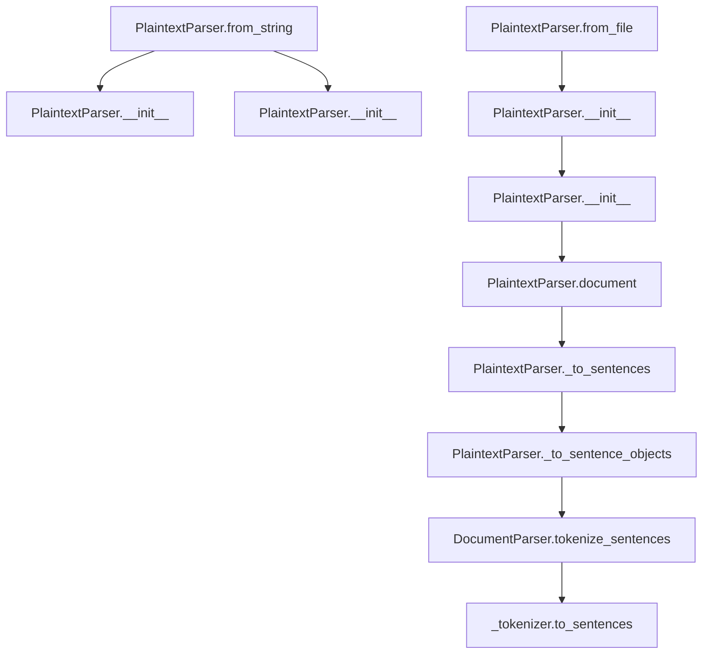

# `plaintext.py`

## `sumy.parsers.plaintext.PlaintextParser` · *class*

## Summary:
A plaintext document parser that converts plain text into a structured document model with support for headings and sentence segmentation.

## Description:
The PlaintextParser class is responsible for transforming raw plaintext content into a structured document model suitable for text summarization and analysis. It recognizes uppercase lines as headings and organizes text into paragraphs and sentences. The parser provides factory methods for creating instances from strings or files, making it easy to integrate into text processing pipelines.

This class inherits from DocumentParser and utilizes tokenizer integration for sentence and word tokenization. It provides cached access to document structure and predefined word lists for semantic analysis.

## State:
- `_text`: str, the raw text content after Unicode conversion and stripping
- `_tokenizer`: Tokenizer object inherited from DocumentParser, used for sentence and word tokenization
- `SIGNIFICANT_WORDS`: tuple of Czech words considered significant (inherited from DocumentParser)
- `STIGMA_WORDS`: tuple of Czech words considered negative/stigmatizing (inherited from DocumentParser)

## Lifecycle:
- Creation: Instantiate using `PlaintextParser(text, tokenizer)` or factory methods `from_string()` or `from_file()`
- Usage: Access cached properties such as `document`, `significant_words`, and `stigma_words` for document analysis
- Destruction: No special cleanup required; relies on Python's garbage collection

## Method Map:


## Raises:
- `TypeError`: When initializing with invalid text type that cannot be converted to Unicode
- `UnicodeDecodeError`: When text contains invalid UTF-8 sequences during conversion
- `AttributeError`: When the underlying tokenizer lacks required methods

## Example:
```python
# Create a tokenizer (assumed to exist)
# tokenizer = SomeTokenizer()

# Parse from string
parser = PlaintextParser.from_string("Hello world.\n\nTHIS IS A HEADING\n\nRegular sentence.", tokenizer)

# Access parsed document structure
document = parser.document
print(len(document.paragraphs))  # Number of paragraphs

# Access significant words
significant = parser.significant_words

# Parse from file
parser2 = PlaintextParser.from_file("document.txt", tokenizer)
```

### `sumy.parsers.plaintext.PlaintextParser.from_string` · *method*

## Summary:
Creates a new PlaintextParser instance from a text string and tokenizer.

## Description:
A factory class method that constructs a PlaintextParser object using the provided text content and tokenizer. This method serves as a convenient alternative to directly calling the constructor, providing a more intuitive interface for creating parser instances from string content.

This method is typically called during text processing pipelines when a parser needs to be initialized with raw text content. It's commonly used in applications that process plain text documents for summarization or analysis tasks.

## Args:
    string (str): The text content to be parsed, which can be a Unicode string or bytes object that will be converted to Unicode.
    tokenizer (Tokenizer): An object implementing the required tokenization interface for splitting text into sentences and words.

## Returns:
    PlaintextParser: A newly created instance of the PlaintextParser class initialized with the provided text and tokenizer.

## Raises:
    UnicodeDecodeError: When the input string contains invalid UTF-8 byte sequences that cannot be decoded.
    AttributeError: If the tokenizer does not implement required methods for sentence and word tokenization.

## State Changes:
    Attributes READ: None
    Attributes WRITTEN: None (the instance creation modifies internal state of the new object)

## Constraints:
    Preconditions:
    - The string parameter must be convertible to a Unicode string
    - The tokenizer must have methods compatible with DocumentParser's expected interface
    - The tokenizer must support sentence and word tokenization operations
    
    Postconditions:
    - Returns a valid PlaintextParser instance ready for document processing
    - The returned instance has its internal state properly initialized with the provided text

## Side Effects:
    None

### `sumy.parsers.plaintext.PlaintextParser.from_file` · *method*

## Summary:
Creates a new PlaintextParser instance by reading text content from a file and initializing it with a tokenizer.

## Description:
This class method serves as a factory for creating PlaintextParser instances from file content. It reads the entire contents of a UTF-8 encoded file and uses the content along with the provided tokenizer to instantiate a new PlaintextParser object. This method enables parsing of text documents stored in files rather than in-memory strings.

The method is particularly useful in text processing pipelines where documents are stored as separate files and need to be parsed for further analysis such as summarization, keyword extraction, or semantic analysis.

## Args:
    file_path (str): Absolute or relative path to the text file to be parsed
    tokenizer: Tokenizer object used for sentence and word tokenization

## Returns:
    PlaintextParser: A new instance of PlaintextParser initialized with the file content and tokenizer

## Raises:
    FileNotFoundError: If the specified file_path does not exist or cannot be accessed
    UnicodeDecodeError: If the file cannot be decoded as UTF-8 text

## State Changes:
    Attributes READ: None
    Attributes WRITTEN: None (creates new instance, doesn't modify existing object state)

## Constraints:
    Preconditions:
        - file_path must point to an existing, readable file
        - file must be valid UTF-8 encoded text
        - tokenizer must be a valid tokenizer object compatible with DocumentParser
    
    Postconditions:
        - Returns a properly initialized PlaintextParser instance
        - The returned instance contains the file's text content in its internal representation

## Side Effects:
    - Performs file I/O operation to read the specified file
    - May raise file system related exceptions if file access fails

### `sumy.parsers.plaintext.PlaintextParser.__init__` · *method*

## Summary:
Initializes a PlaintextParser instance with text content and tokenizer for document processing.

## Description:
Configures a PlaintextParser object by normalizing the input text to Unicode format and storing it for subsequent document parsing operations. This constructor establishes the fundamental text content and tokenizer dependencies required for extracting structured document elements like paragraphs and sentences.

The method ensures text compatibility across Python versions by converting input to Unicode and removes leading/trailing whitespace. It delegates tokenizer initialization to the parent DocumentParser class, which sets up the necessary tokenization infrastructure for sentence and word processing.

Known callers:
- PlaintextParser.from_string(): Initializes parser when creating from text content
- PlaintextParser.from_file(): Initializes parser when creating from file content

This logic is encapsulated in its own method rather than being inlined because it performs essential text normalization that must happen consistently across all instantiation paths, and it properly initializes the inheritance chain with the parent DocumentParser class.

## Args:
    text (Any): Raw text content that will be converted to Unicode and stripped of whitespace. Can be string, bytes, or other object types that support Unicode conversion.
    tokenizer: Tokenizer object providing sentence and word tokenization capabilities. Must have methods compatible with DocumentParser expectations.

## Returns:
    None

## Raises:
    TypeError: When the text parameter cannot be converted to Unicode due to incompatible type.
    UnicodeDecodeError: When text contains invalid UTF-8 sequences during Unicode conversion.
    AttributeError: When the tokenizer lacks required methods expected by DocumentParser.

## State Changes:
    Attributes READ: None
    Attributes WRITTEN: 
    - self._text: Stores the Unicode-normalized and stripped text content
    - self._tokenizer: Inherited from DocumentParser parent class

## Constraints:
    Preconditions:
    - The text parameter must be convertible to Unicode string
    - The tokenizer parameter must be a valid object with required tokenization methods
    - The tokenizer must be compatible with DocumentParser interface requirements
    
    Postconditions:
    - self._text contains normalized Unicode string with leading/trailing whitespace removed
    - self._tokenizer is properly initialized from the parent class
    - The parser is ready for document structure extraction operations

## Side Effects:
    None

### `sumy.parsers.plaintext.PlaintextParser.significant_words` · *method*

## Summary:
Returns a tuple of significant words extracted from document headings, or fallback significant words if none are found.

## Description:
Extracts words from all heading elements in the parsed document's paragraphs. This method is designed to identify key terminology from document structure, particularly from section headings that often contain important keywords. When no significant words are found in the document's headings, it returns a predefined set of significant Czech words from the parent class.

## Args:
    None

## Returns:
    tuple[str]: A tuple containing words extracted from document headings, or the fallback SIGNIFICANT_WORDS tuple from the parent class if no headings were found.

## Raises:
    None

## State Changes:
    Attributes READ: 
    - self.document.paragraphs
    - self.SIGNIFICANT_WORDS
    
    Attributes WRITTEN: None

## Constraints:
    Preconditions:
    - self.document must be properly initialized and contain paragraphs with headings
    - The document parsing process must have completed successfully
    
    Postconditions:
    - Returns a tuple of strings representing significant words
    - Always returns a tuple (empty or populated) regardless of content

## Side Effects:
    None

### `sumy.parsers.plaintext.PlaintextParser.stigma_words` · *method*

## Summary:
Returns the collection of stigmatizing Czech words used for identifying negative terminology in text processing.

## Description:
Provides access to a predefined set of Czech words that are considered negative or stigmatizing. This method serves as a getter for the STIGMA_WORDS class attribute, which contains words like "nejhorší" (worst), "zlý" (evil), and "šeredný" (mean/sordid) that may be filtered out or flagged during text analysis processes.

## Args:
    None

## Returns:
    tuple[str]: A tuple containing Czech words considered negative or stigmatizing

## Raises:
    None

## State Changes:
    Attributes READ: self.STIGMA_WORDS
    Attributes WRITTEN: None

## Constraints:
    Preconditions: The class must be properly initialized with the STIGMA_WORDS attribute
    Postconditions: Returns a tuple of strings representing stigmatizing words

## Side Effects:
    None

### `sumy.parsers.plaintext.PlaintextParser.document` · *method*

## Summary:
Converts raw plaintext text into a structured document model with paragraphs, sentences, and headings.

## Description:
Processes the raw text stored in `self._text` by splitting it into lines and organizing them into paragraphs. Lines that are entirely uppercase are treated as headings, empty lines denote paragraph breaks, and regular text lines are grouped into paragraphs. The method leverages internal helper methods to properly tokenize and structure the content into a hierarchical document model suitable for text analysis and summarization.

This method is implemented as a cached property, meaning it computes the document structure only once and caches the result for subsequent accesses. It's called during document processing pipelines when the structured representation of the text is needed for further analysis.

## Args:
    None

## Returns:
    ObjectDocumentModel: A structured document model containing paragraphs of sentences, where uppercase lines are identified as headings and empty lines separate paragraphs.

## Raises:
    AttributeError: If the underlying tokenizer does not support required methods for sentence tokenization.

## State Changes:
    Attributes READ: self._text, self._tokenizer
    Attributes WRITTEN: None

## Constraints:
    Preconditions:
    - `self._text` must be initialized and contain valid text content
    - `self._tokenizer` must be properly initialized and support sentence tokenization
    - The parser must be properly configured with a valid tokenizer
    
    Postconditions:
    - Returns a properly structured ObjectDocumentModel with paragraphs and sentences
    - All text lines are appropriately categorized as headings, regular sentences, or paragraph separators
    - The document structure preserves the original text organization while converting it to a structured format

## Side Effects:
    None

### `sumy.parsers.plaintext.PlaintextParser._to_sentences` · *method*

## Summary:
Converts a list of text lines and Sentence objects into a list of Sentence objects by processing text segments and preserving existing Sentence objects.

## Description:
Processes a sequence of lines that may contain either plain text strings or pre-existing Sentence objects, converting text segments into Sentence objects while preserving existing Sentence instances. This method is used internally during document construction to properly format text content into structured sentence objects that can be incorporated into the document model.

The method handles mixed content by accumulating text lines until a Sentence object is encountered, at which point it processes the accumulated text through the `_to_sentence_objects` helper method before adding the existing Sentence object to the results.

## Args:
    lines (list[str|Sentence]): A list of text lines or Sentence objects to be processed.

## Returns:
    list[Sentence]: A list of Sentence objects constructed from the input lines, with text segments properly tokenized and existing Sentence objects preserved.

## Raises:
    AttributeError: If the underlying tokenizer does not support the required methods for sentence tokenization.

## State Changes:
    Attributes READ: self._tokenizer, self.tokenize_sentences
    Attributes WRITTEN: None

## Constraints:
    Preconditions:
    - Input lines must be iterable
    - Each item in lines must either be a string or a Sentence object
    - The parser must have a valid tokenizer initialized
    
    Postconditions:
    - Returns a list of Sentence objects
    - All text lines are properly converted to Sentence objects using the parser's tokenizer
    - Existing Sentence objects in the input are preserved in their original form

## Side Effects:
    None

### `sumy.parsers.plaintext.PlaintextParser._to_sentence_objects` · *method*

## Summary:
Converts raw text into a generator of Sentence objects using the parser's tokenizer.

## Description:
Transforms a text string into individual Sentence objects by first tokenizing the text into sentences and then wrapping each sentence with a Sentence instance. This method serves as a utility for creating properly formatted sentence objects that maintain the parser's tokenizer context.

The method is primarily used internally by the `_to_sentences` method to process text segments and convert them into structured sentence objects that can be used throughout the document processing pipeline.

## Args:
    text (str): The input text to be converted into sentence objects.

## Returns:
    generator[Sentence]: A generator yielding Sentence objects created from the input text, each initialized with the parser's tokenizer.

## Raises:
    AttributeError: If the underlying tokenizer does not support the required methods for sentence tokenization.

## State Changes:
    Attributes READ: self._tokenizer, self.tokenize_sentences
    Attributes WRITTEN: None

## Constraints:
    Preconditions:
    - The input text must be a string
    - The parser must have a valid tokenizer initialized
    - The tokenizer must support sentence tokenization operations
    
    Postconditions:
    - Returns a generator of Sentence objects
    - Each returned Sentence object contains the original sentence text and is associated with the parser's tokenizer

## Side Effects:
    None

