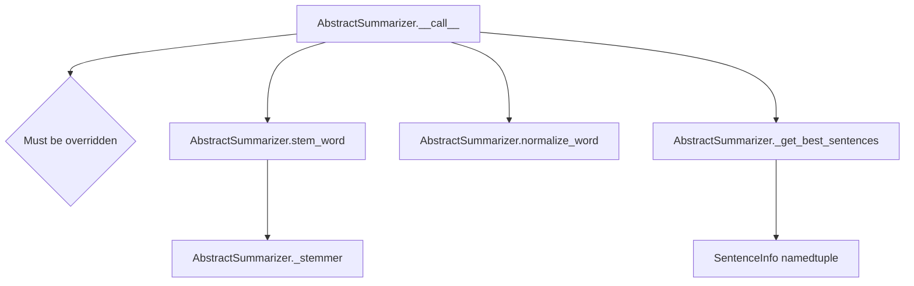

# `_summarizer.py`

## `sumy.summarizers._summarizer.AbstractSummarizer` · *class*

## Summary:
Abstract base class for implementing various text summarization algorithms.

## Description:
The AbstractSummarizer provides a common interface and utility methods for text summarization implementations. It defines the contract that all concrete summarizer implementations must follow while providing shared functionality like word stemming and sentence selection based on ratings.

This class serves as the foundation for different summarization approaches (such as frequency-based, centroid-based, etc.) and ensures consistency in how summarizers operate on documents.

## State:
- _stemmer: callable object used for stemming words, initialized with a default null_stemmer
- The stemmer must be callable, otherwise a ValueError is raised during initialization

## Lifecycle:
- Creation: Instantiate with an optional stemmer parameter (defaults to null_stemmer)
- Usage: Call the instance with a document and desired number of sentences to extract
- Destruction: No explicit cleanup required; uses standard Python garbage collection

## Method Map:


## Raises:
- ValueError: When the stemmer parameter is not callable during initialization

## Example:
```python
# Basic usage of abstract summarizer
from nlp.stemmers import null_stemmer

# Create a summarizer instance
summarizer = AbstractSummarizer(stemmer=null_stemmer)

# The __call__ method must be implemented by subclasses
# This would typically be done by inheriting from AbstractSummarizer
class MySummarizer(AbstractSummarizer):
    def __call__(self, document, sentences_count):
        # Implementation here
        pass
```

### `sumy.summarizers._summarizer.AbstractSummarizer.__init__` · *method*

## Summary:
Initializes an AbstractSummarizer instance with a specified stemmer function.

## Description:
Configures the summarizer with a callable stemmer object for text normalization. This method validates that the provided stemmer is callable and stores it for use in subsequent text processing operations. The default stemmer (null_stemmer) performs basic Unicode normalization and case conversion.

## Args:
    stemmer (callable): A callable object that processes text for stemming. Defaults to null_stemmer. Must be callable, otherwise a ValueError is raised.

## Returns:
    None: This method initializes the object's state and does not return a value.

## Raises:
    ValueError: When the stemmer parameter is not callable, indicating invalid stemmer object was provided.

## State Changes:
    Attributes READ: None
    Attributes WRITTEN: self._stemmer

## Constraints:
    Preconditions:
    - The stemmer parameter must be callable (implement __call__ method)
    - If provided, the stemmer must handle text processing appropriately for summarization tasks
    
    Postconditions:
    - self._stemmer is set to the provided stemmer or default null_stemmer
    - The stemmer is stored as a callable object ready for use in text processing

## Side Effects:
    None

### `sumy.summarizers._summarizer.AbstractSummarizer.__call__` · *method*

## Summary:
Invokes the summarizer on a document to extract a specified number of sentences.

## Description:
This method serves as the main interface for executing document summarization. As an abstract method, it must be implemented by concrete subclasses to provide actual summarization logic. The method takes a document and specifies how many sentences should be included in the resulting summary. Concrete implementations should return a tuple of Sentence objects ordered by importance.

## Args:
    document (Document): The input document to summarize, typically containing sentences and other textual elements.
    sentences_count (int or ItemsCount): The desired number of sentences in the summary. Can be an integer or an ItemsCount object for more complex counting logic.

## Returns:
    tuple[Sentence]: A tuple of Sentence objects representing the most important sentences selected for the summary, ordered by importance.

## Raises:
    NotImplementedError: Always raised by this base implementation, indicating that subclasses must override this method.

## State Changes:
    Attributes READ: None
    Attributes WRITTEN: None

## Constraints:
    Preconditions: 
    - The document parameter must be a valid Document object
    - The sentences_count parameter must be a positive integer or valid ItemsCount object
    - This method should only be called on concrete implementations of AbstractSummarizer
    
    Postconditions:
    - The returned tuple contains Sentence objects in order of importance
    - The number of sentences matches the requested count (subject to document length)

## Side Effects:
    None

### `sumy.summarizers._summarizer.AbstractSummarizer.stem_word` · *method*

## Summary:
Normalizes and applies stemming to a word for consistent text representation in summarization algorithms.

## Description:
Processes an input word by first normalizing it (converting to Unicode and lowercasing) and then applying the summarizer's stemmer to reduce it to its root form. This method serves as a standardized preprocessing step for word analysis in summarization algorithms, ensuring consistent text representation regardless of input format or case variations.

The method is called by various text processing components within the summarization pipeline to prepare words for comparison and analysis. It encapsulates the common pattern of normalization followed by stemming, making it reusable across different summarization approaches.

## Args:
    word (Any): Any Python object that can be converted to a Unicode string. This typically includes strings, bytes, or other objects that can be normalized to text.

## Returns:
    str: The stemmed version of the input word as processed by the summarizer's stemmer function.

## Raises:
    UnicodeDecodeError: When attempting to decode bytes that are not valid UTF-8 encoded data during the Unicode conversion process in the normalize_word method.

## State Changes:
    Attributes READ: 
    - self._stemmer: The stemmer function used to reduce words to their root forms
    - self.normalize_word: The static method used for Unicode normalization and lowercasing
    
    Attributes WRITTEN: None

## Constraints:
    Preconditions:
    - The summarizer instance must have been properly initialized with a callable stemmer
    - Input word must be convertible to a Unicode string representation
    - The global `to_unicode` function must be available for Unicode conversion
    
    Postconditions:
    - Returns a string representing the stemmed version of the input word
    - Input word is not modified
    - Normalization follows Python 2/3 compatibility patterns

## Side Effects:
    None

### `sumy.summarizers._summarizer.AbstractSummarizer.normalize_word` · *method*

## Summary:
Normalizes a word by converting it to Unicode and lowercasing it for consistent text processing.

## Description:
Converts the input word to a Unicode string representation and transforms it to lowercase. This utility method ensures consistent text normalization across different input types and Python version compatibility. It's primarily used as part of the text preprocessing pipeline in summarization algorithms to standardize word representations before further processing.

The method is called by `stem_word` to prepare words for stemming operations and is part of the abstract base class that defines the interface for summarizer implementations.

## Args:
    word (Any): Any Python object that can be converted to a Unicode string. This typically includes strings, bytes, or other objects that can be normalized to text.

## Returns:
    str: Unicode string representation of the input word in lowercase format.

## Raises:
    UnicodeDecodeError: When attempting to decode bytes that are not valid UTF-8 encoded data during the Unicode conversion process.

## State Changes:
    None

## Constraints:
    Preconditions:
    - Input word must be convertible to a Unicode string representation
    - The global `to_unicode` function must be available for Unicode conversion
    - The Python environment must support UTF-8 decoding for bytes objects
    
    Postconditions:
    - Always returns a lowercase Unicode string
    - Input word is not modified
    - Conversion follows Python 2/3 compatibility patterns

## Side Effects:
    None

### `sumy.summarizers._summarizer.AbstractSummarizer._get_best_sentences` · *method*

## Summary:
Selects the best-rated sentences from a collection based on a rating function or dictionary, returning them in original order.

## Description:
This method processes a collection of sentences by assigning each a rating using either a callable rating function or a dictionary mapping sentences to ratings. It then sorts the sentences by their ratings in descending order, selects the specified number of top-rated sentences, and returns them in their original order.

The method is designed to be a reusable utility for selecting the most important sentences in a summarization process. It handles both callable rating functions and dictionary-based ratings, making it flexible for different scoring approaches.

## Args:
    sentences (iterable): Collection of sentences to be rated and selected from
    count (int, str, or callable): Number of sentences to select, can be an integer, percentage string (e.g., "50%"), or a callable that filters the ranked sentences
    rating (callable or dict): Either a callable that rates sentences or a dictionary mapping sentences to their ratings
    *args: Additional positional arguments passed to the rating function
    **kwargs: Additional keyword arguments passed to the rating function

## Returns:
    tuple: A tuple of sentences sorted in their original order, containing the top-rated sentences according to the selection criteria

## Raises:
    AssertionError: When rating is a dictionary and additional args/kwargs are provided
    ValueError: When ItemsCount encounters an unsupported value type for count

## State Changes:
    None: This method is stateless and doesn't modify any object attributes

## Constraints:
    Preconditions:
        - sentences must be iterable
        - count must be a valid value for ItemsCount (int, float, or string representation)
        - rating must be either a callable or a dictionary
        - If rating is a dictionary, args and kwargs must be empty
    
    Postconditions:
        - Returns a tuple of sentences in original order
        - Number of returned sentences matches selection criteria
        - All returned sentences are from the input collection

## Side Effects:
    None: This method performs no I/O operations or external service calls

