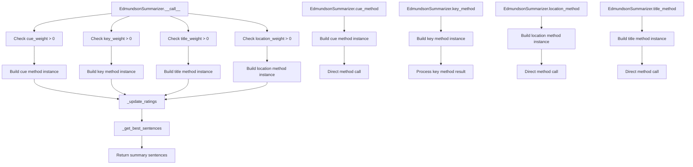

# `edmundson.py`

## `sumy.summarizers.edmundson.EdmundsonSummarizer` · *class*

## Summary:
Implements the Edmundson text summarization algorithm that combines multiple scoring methods (cue, key, title, location) to rank and select sentences for a summary.

## Description:
The EdmundsonSummarizer is a concrete implementation of the AbstractSummarizer that applies multiple text analysis techniques to score sentences for summarization. It integrates four distinct methods - cue words, key words, title-related content, and sentence location - each weighted according to configurable parameters. This approach allows for flexible summarization strategies by combining different linguistic features that indicate sentence importance.

The summarizer works by:
1. Setting up word collections (bonus, stigma, null words) for each method
2. Applying weighted scoring from each method to all sentences
3. Combining scores from all enabled methods
4. Selecting the highest-rated sentences in their original order

This class is particularly useful when you want to leverage multiple heuristics for identifying important sentences rather than relying on a single approach.

## State:
- _bonus_words: frozenset of stemmed words used for bonus scoring in cue method
- _stigma_words: frozenset of stemmed words used for stigma scoring in cue method  
- _null_words: frozenset of stemmed words used for title and location methods
- _cue_weight: float value (default 1.0) controlling influence of cue method
- _key_weight: float value (default 0.0) controlling influence of key method
- _title_weight: float value (default 1.0) controlling influence of title method
- _location_weight: float value (default 1.0) controlling influence of location method

## Lifecycle:
- Creation: Initialize with optional stemmer and weight parameters (all weights default to positive values)
- Usage: Set word collections via properties, then call the instance with document and sentence count
- Destruction: Standard Python garbage collection

## Method Map:


## Raises:
- ValueError: When negative weights are provided during initialization
- ValueError: When bonus_words, stigma_words, or null_words are empty when building method instances (this occurs when calling methods that require these word sets)
- ValueError: When bonus_words are empty when calling key_method

## Example:
```python
from sumy.summarizers.edmundson import EdmundsonSummarizer
from sumy.nlp.stemmers import null_stemmer

# Create summarizer with custom weights
summarizer = EdmundsonSummarizer(
    stemmer=null_stemmer,
    cue_weight=1.0,
    key_weight=0.5,
    title_weight=1.0,
    location_weight=0.8
)

# Set word collections for different methods
summarizer.bonus_words = ['important', 'significant', 'crucial']
summarizer.stigma_words = ['however', 'but', 'although']
summarizer.null_words = ['the', 'and', 'or']

# Apply summarization
summary = summarizer(document, 3)
```

### `sumy.summarizers.edmundson.EdmundsonSummarizer.__init__` · *method*

## Summary:
Initializes an EdmundsonSummarizer instance with configurable weights for different text analysis methods and a stemmer for text processing.

## Description:
Configures the Edmundson summarizer with a stemmer and four weighting factors that control the contribution of each text analysis method (cue words, key terms, title relevance, and sentence location) to the final sentence scoring. This constructor validates that all weights are non-negative and sets up the internal state for subsequent summarization operations.

The method calls the parent class constructor to initialize the stemmer, validates the weight parameters, and stores them as instance attributes for use during sentence scoring.

## Args:
    stemmer (callable, optional): A callable object for text stemming. Defaults to null_stemmer. Must be callable.
    cue_weight (float, optional): Weight for cue word analysis method. Defaults to 1.0. Must be non-negative.
    key_weight (float, optional): Weight for key term analysis method. Defaults to 0.0. Must be non-negative.
    title_weight (float, optional): Weight for title-related content analysis method. Defaults to 1.0. Must be non-negative.
    location_weight (float, optional): Weight for sentence position analysis method. Defaults to 1.0. Must be non-negative.

## Returns:
    None: This method initializes the object's state and does not return a value.

## Raises:
    ValueError: When any of the weight parameters are negative, indicating invalid weight configuration.

## State Changes:
    Attributes READ: None
    Attributes WRITTEN: 
    - self._stemmer: set to the provided stemmer or default null_stemmer
    - self._cue_weight: set to the float value of cue_weight
    - self._key_weight: set to the float value of key_weight
    - self._title_weight: set to the float value of title_weight
    - self._location_weight: set to the float value of location_weight

## Constraints:
    Preconditions:
    - All weight parameters must be numeric values
    - All weight parameters must be non-negative (>= 0.0)
    - The stemmer parameter must be callable
    
    Postconditions:
    - All weight parameters are stored as float values
    - The stemmer is properly configured for text processing
    - All weights are validated to be non-negative

## Side Effects:
    None: This method performs no I/O operations or external service calls.

### `sumy.summarizers.edmundson.EdmundsonSummarizer._ensure_correct_weights` · *method*

## Summary:
Validates that all provided weight values are non-negative, raising an error for any negative weights.

## Description:
This private validation method ensures that all weight parameters used in the Edmundson summarizer are non-negative. The Edmundson summarizer combines multiple scoring methods (cue words, key terms, location, and title) with configurable weights, and negative weights would produce mathematically invalid results in the aggregation process. This method is typically called during the configuration phase of the summarizer to prevent runtime errors.

## Args:
    *weights (float): Variable-length argument list of weight values to validate

## Returns:
    None: This method does not return any value

## Raises:
    ValueError: Raised when any weight value is less than 0.0

## State Changes:
    Attributes READ: None
    Attributes WRITTEN: None

## Constraints:
    Preconditions: All arguments must be numeric values
    Postconditions: No state changes occur; method only performs validation

## Side Effects:
    None: This method performs no I/O operations or external service calls

### `sumy.summarizers.edmundson.EdmundsonSummarizer.bonus_words` · *method*

## Summary:
Setter method for configuring bonus words that influence sentence scoring in Edmundson summarization.

## Description:
Configures the bonus words collection that will be used by the Edmundson summarization algorithm to identify important sentences. Bonus words are terms that should increase a sentence's score during summarization. This setter method applies stemming to all words in the input collection and stores them as an immutable frozenset for efficient lookup.

This method is part of the EdmundsonSummarizer's property interface for managing bonus words, working in conjunction with the `bonus_words` property getter. The method internally calls `self.stem_word()` on each word in the collection to normalize them according to the summarizer's stemmer configuration.

## Args:
    collection (iterable): An iterable of words (strings) to be used as bonus words.

## Returns:
    None: This method does not return a value.

## Raises:
    None explicitly raised by this method.

## State Changes:
    Attributes READ: None
    Attributes WRITTEN: self._bonus_words

## Constraints:
    Preconditions: The collection parameter must be iterable and contain strings that can be processed by the stemmer.
    Postconditions: self._bonus_words will be set to a frozenset containing the stemmed versions of all words in the input collection.

## Side Effects:
    None: This method performs no I/O operations or external service calls. It only modifies the object's internal state.

### `sumy.summarizers.edmundson.EdmundsonSummarizer.stigma_words` · *method*

## Summary:
Sets the stigma words for the Edmundson summarizer by applying stemming to each word in the input collection and storing them as an immutable frozenset.

## Description:
This method configures the stigma words that will be used by the Edmundson summarization approach to penalize sentences containing these words. Stigma words are terms that should decrease sentence scores during summarization because they often indicate less important or redundant content. The method processes the input collection by applying the summarizer's stem_word method to each element, then stores the resulting stemmed words as a frozenset for efficient lookup and immutability.

This method is called as a setter property when users assign a collection to the `stigma_words` attribute of an EdmundsonSummarizer instance. It's part of the Edmundson summarization framework that uses multiple word categories (bonus, stigma, null) to weight sentences differently based on their content.

## Args:
    collection (iterable): An iterable collection of words or terms to be used as stigma words. These can be strings or other objects that can be converted to strings.

## Returns:
    None: This method does not return a value.

## Raises:
    None: This method does not explicitly raise exceptions, though the underlying `map()` and `frozenset()` operations may raise exceptions if the collection contains invalid elements.

## State Changes:
    Attributes READ: 
    - self.stem_word: The method used to normalize and stem words
    - self._stigma_words: The internal attribute that stores the stigma words
    
    Attributes WRITTEN:
    - self._stigma_words: Updated to store the frozenset of stemmed stigma words

## Constraints:
    Preconditions:
    - The EdmundsonSummarizer instance must be properly initialized with a valid stemmer
    - The input collection should contain elements that can be processed by the stem_word method
    
    Postconditions:
    - The `_stigma_words` attribute is updated to contain a frozenset of stemmed versions of the input words
    - The resulting frozenset is immutable and suitable for fast membership testing
    - All words in the collection are normalized and stemmed consistently

## Side Effects:
    None: This method does not perform I/O operations or mutate external state beyond updating the internal `_stigma_words` attribute.

### `sumy.summarizers.edmundson.EdmundsonSummarizer.null_words` · *method*

## Summary:
Sets the collection of null words used by location and title-based summarization methods to identify significant words in document headings.

## Description:
Configures the set of null words that are considered significant for identifying important content in document headings. These words are used by the EdmundsonLocationMethod and EdmundsonTitleMethod classes to compute sentence ratings based on heading content. This method is part of the Edmundson summarization framework which combines multiple scoring methods (cue, key, location, and title) to produce a comprehensive summary.

The method processes the input collection by applying word stemming to each element and storing the result as an immutable frozenset in the internal `_null_words` attribute. This ensures consistent word matching across different parts of the summarization pipeline.

## Args:
    collection (Iterable[str]): An iterable collection of words (typically strings) that should be treated as null words for location and title-based scoring.

## Returns:
    None: This method does not return a value.

## Raises:
    None: This method does not explicitly raise exceptions, though underlying operations may raise exceptions from the stem_word method or frozenset construction.

## State Changes:
    Attributes READ: 
    - self.stem_word: The method used to normalize and stem input words
    - self._null_words: The internal attribute that stores the processed null words (though it's written to, not read from in this method)

    Attributes WRITTEN: 
    - self._null_words: Stores the frozenset of stemmed null words for use in location and title-based summarization

## Constraints:
    Preconditions:
    - The EdmundsonSummarizer instance must be properly initialized with a valid stemmer
    - The collection parameter should contain elements that can be converted to strings and processed by the stemmer
    - The collection should not be None

    Postconditions:
    - The internal `_null_words` attribute contains a frozenset of stemmed versions of the input words
    - All words in the collection are normalized and stemmed consistently
    - The resulting frozenset is immutable and suitable for fast membership testing

## Side Effects:
    None: This method performs no I/O operations or external service calls. It only processes the input collection and updates internal state.

### `sumy.summarizers.edmundson.EdmundsonSummarizer.__call__` · *method*

## Summary:
Processes a document using multiple Edmundson-based scoring methods to generate sentence ratings and returns the highest-rated sentences.

## Description:
This method implements the core summarization logic of the EdmundsonSummarizer by applying weighted scoring from four different Edmundson techniques: cue words, key words, title words, and sentence location. It dynamically activates each scoring method based on its configured weight and aggregates the resulting sentence ratings. The aggregated ratings are then used to select the most important sentences from the document.

The method follows a conditional execution pattern where each scoring method is only applied if its corresponding weight is greater than zero. This allows for flexible configuration of which scoring techniques to use and their relative importance in the final ranking.

## Args:
    document: The document object containing sentences to be summarized
    sentences_count: The number of sentences to select from the document, can be an integer, percentage string (e.g., "50%"), or a callable that filters the ranked sentences

## Returns:
    tuple: A tuple of sentences sorted in their original order, containing the top-rated sentences according to the combined scoring approach

## Raises:
    ValueError: When any of the Edmundson methods require bonus/null words but they haven't been set (via bonus_words, stigma_words, or null_words properties)

## State Changes:
    Attributes READ: 
    - self._cue_weight
    - self._key_weight  
    - self._title_weight
    - self._location_weight

## Constraints:
    Preconditions:
        - Document must have a sentences attribute containing iterable sentences
        - Sentences_count must be a valid value for ItemsCount (int, float, or string representation)
        - Bonus words must be set for cue method if _cue_weight > 0.0
        - Stigma words must be set for cue method if _cue_weight > 0.0
        - Null words must be set for key, title, and location methods if their respective weights > 0.0

    Postconditions:
        - Returns a tuple of sentences in original order
        - Number of returned sentences matches selection criteria
        - All returned sentences are from the input document

## Side Effects:
    None: This method performs no I/O operations or external service calls

### `sumy.summarizers.edmundson.EdmundsonSummarizer._update_ratings` · *method*

## Summary:
Updates sentence ratings by accumulating new ratings with existing ones.

## Description:
Accumulates ratings from different Edmundson weighting methods (cue, key, title, location) for each sentence in a document. This method is called during the summarization process to combine scores from multiple criteria into a single rating per sentence.

## Args:
    ratings (defaultdict(int)): Existing sentence ratings to be updated, mapping sentences to their accumulated scores.
    new_ratings (dict): New ratings to add, mapping sentences to their scores from a specific weighting method.

## Returns:
    defaultdict(int): Updated ratings dictionary with new ratings added to existing ones.

## Raises:
    AssertionError: When the length of ratings and new_ratings differ and neither is empty.

## State Changes:
    Attributes READ: None
    Attributes WRITTEN: None

## Constraints:
    Preconditions: 
    - ratings should be a defaultdict(int) or regular dict with sentence keys
    - new_ratings should be a dict mapping sentences to numeric ratings
    - Either ratings is empty OR ratings and new_ratings have the same number of sentences
    
    Postconditions:
    - All sentences in new_ratings will have their ratings added to ratings
    - The returned dictionary contains all sentences from both inputs with updated ratings

## Side Effects:
    None

### `sumy.summarizers.edmundson.EdmundsonSummarizer.cue_method` · *method*

## Summary:
Computes a summary using the cue-based weighting method by creating and invoking an EdmundsonCueMethod instance.

## Description:
This method implements the cue-based summarization approach, which rates sentences based on the presence of bonus words (positive indicators) and stigma words (negative indicators). It creates a new EdmundsonCueMethod instance with the current summarizer configuration and applies it to generate a summary of the specified length.

The method is typically called when the Edmundson summarizer is configured to use cue-based weighting (when `_cue_weight > 0.0`) or when explicitly requested via the dedicated cue method interface. It delegates the actual computation to the EdmundsonCueMethod class, ensuring proper initialization and parameter passing.

Known callers:
- `EdmundsonSummarizer.__call__()`: Invoked when cue weighting is active to compute the cue-based summary
- Direct user invocation: Called when users specifically request cue-based summarization

This logic is separated into its own method rather than being inlined because it provides a clean interface for cue-based summarization while maintaining consistency with the overall summarizer architecture and ensuring proper instantiation of the cue method with current configuration.

## Args:
    document: The input document to summarize, containing sentences to rate and select from
    sentences_count: The number of top-rated sentences to include in the final summary
    bonus_word_value: Weight multiplier for bonus words (positive indicators) in sentence scoring. Defaults to 1
    stigma_word_value: Weight multiplier for stigma words (negative indicators) in sentence scoring. Defaults to 1

## Returns:
    list[Sentence]: A list of Sentence objects representing the most important sentences selected for the summary

## Raises:
    ValueError: When bonus_words or stigma_words are empty (not set), indicating that required word lists must be configured before using cue-based summarization

## State Changes:
    Attributes READ: 
    - self._build_cue_method_instance(): Called to create the cue method instance
    - self._bonus_words: Accessed indirectly through _build_cue_method_instance()
    - self._stigma_words: Accessed indirectly through _build_cue_method_instance()
    - self._stemmer: Accessed indirectly through _build_cue_method_instance()
    
    Attributes WRITTEN: None

## Constraints:
    Preconditions:
    - Bonus words must be configured (self._bonus_words not empty)
    - Stigma words must be configured (self._stigma_words not empty)
    - Document must contain sentences to rate
    - Sentences_count must be a positive integer
    
    Postconditions:
    - Returns a list of sentences with length equal to sentences_count (or fewer if document has insufficient sentences)
    - All returned sentences are from the input document

## Side Effects:
    None: This method performs no I/O operations or external service calls. It only creates objects and processes text internally.

### `sumy.summarizers.edmundson.EdmundsonSummarizer._build_cue_method_instance` · *method*

## Summary:
Creates and returns a new EdmundsonCueMethod instance configured with the current stemmer and word lists.

## Description:
This factory method constructs an EdmundsonCueMethod instance using the summarizer's current stemmer and word configurations. It first validates that bonus and stigma word lists are properly set, then creates and returns a cue method instance for use in sentence scoring.

The method is called during the summarization process when the cue-based weighting is enabled (when `_cue_weight > 0.0`). It ensures that required word lists are populated before creating the cue method instance, raising appropriate errors if they are empty.

Known callers:
- `EdmundsonSummarizer.__call__()`: Called when cue weighting is active to build the cue method for sentence rating
- `EdmundsonSummarizer.cue_method()`: Called when using the dedicated cue method interface

This logic is separated into its own method rather than being inlined because it encapsulates the creation logic for the cue method, including validation of required word lists, making the calling code cleaner and ensuring consistent initialization of cue method instances.

## Returns:
    EdmundsonCueMethod: A newly created instance of the cue method class configured with current stemmer and word lists.

## Raises:
    ValueError: When bonus_words or stigma_words are empty (not set), indicating that required word lists must be configured before creating the cue method.

## State Changes:
    Attributes READ: 
    - self._stemmer: The stemmer used for text normalization
    - self._bonus_words: Collection of bonus words for positive scoring
    - self._stigma_words: Collection of stigma words for negative scoring
    
    Attributes WRITTEN: None

## Constraints:
    Preconditions:
    - self._bonus_words must not be empty (bonus words must be set)
    - self._stigma_words must not be empty (stigma words must be set)
    - self._stemmer must be a valid callable stemmer
    
    Postconditions:
    - Returns a valid EdmundsonCueMethod instance with configured parameters
    - The returned instance is ready for use in sentence rating operations

## Side Effects:
    None: This method performs no I/O operations or external service calls. It only creates and returns an object instance.

### `sumy.summarizers.edmundson.EdmundsonSummarizer.key_method` · *method*

## Summary:
Ranks sentences using key word frequency and bonus word weighting, then returns the specified number of top-ranked sentences.

## Description:
This method applies the Edmundson key method algorithm to rank sentences based on the frequency of bonus words and their significance within the document. It creates an EdmundsonKeyMethod instance with the current summarizer's configuration and uses it to compute sentence rankings. The method supports flexible sentence count specification through integer counts, percentage strings (e.g., "50%"), or callable filters.

The key method works by identifying significant words in the document based on bonus word frequency and a weight threshold, then rates each sentence based on how many of these significant words it contains. This approach emphasizes sentences that contain important key terms identified by the user-defined bonus words.

## Args:
    document: The document object containing sentences to be ranked and selected from
    sentences_count: The number of sentences to select from the document. Can be an integer, percentage string (e.g., "50%"), or a callable that filters the ranked sentences
    weight (float): Weight threshold for determining significant words (default: 0.5). Words with frequency above (max_frequency * weight) are considered significant

## Returns:
    tuple: A tuple of Sentence objects sorted in their original order, containing the top-ranked sentences according to the key method scoring

## Raises:
    ValueError: When bonus_words have not been set before calling this method, with the message "Bonus words must be set before calling the key method."

## State Changes:
    Attributes READ: self._bonus_words, self._stemmer
    Attributes WRITTEN: None

## Constraints:
    Preconditions:
        - The bonus_words property must be set to a non-empty collection before calling this method
        - Document must have a sentences attribute containing iterable sentences
        - Sentences_count must be a valid value for ItemsCount (int, float, or string representation)
    
    Postconditions:
        - Returns a tuple of sentences in original order
        - Number of returned sentences matches selection criteria
        - All returned sentences are from the input document

## Side Effects:
    None: This method performs no I/O operations or external service calls

### `sumy.summarizers.edmundson.EdmundsonSummarizer._build_key_method_instance` · *method*

## Summary:
Creates and returns an EdmundsonKeyMethod instance configured with the summarizer's stemmer and bonus words.

## Description:
This method constructs an EdmundsonKeyMethod instance that can be used to rate sentences based on key word frequency and bonus word weighting. It ensures that bonus words have been properly configured before creating the method instance, raising a ValueError if not set. This method is called internally by the summarization pipeline when the key weight is greater than zero.

## Args:
    None

## Returns:
    EdmundsonKeyMethod: An instance of the EdmundsonKeyMethod class configured with the current stemmer and bonus words.

## Raises:
    ValueError: When the bonus_words attribute has not been set, with the message "Set of bonus words is empty. Please set attribute 'bonus_words' with collection of words."

## State Changes:
    Attributes READ: self._stemmer, self._bonus_words
    Attributes WRITTEN: None

## Constraints:
    Preconditions: The `_bonus_words` attribute must be set to a non-empty collection before calling this method
    Postconditions: Returns a valid EdmundsonKeyMethod instance with proper configuration

## Side Effects:
    None

### `sumy.summarizers.edmundson.EdmundsonSummarizer._build_title_method_instance` · *method*

## Summary:
Creates and returns a new instance of the Edmundson title method for sentence scoring based on null word analysis.

## Description:
This private method constructs an `EdmundsonTitleMethod` instance using the summarizer's configured stemmer and null words collection. It serves as a factory method for creating title-based sentence rating components within the Edmundson summarization framework. The method ensures proper initialization by validating that null words have been set before creating the instance.

This method is called during the summarization process when the title weight is greater than zero, specifically in the `__call__` method of the `EdmundsonSummarizer` class. It follows the same pattern as other build methods (`_build_cue_method_instance`, `_build_key_method_instance`, `_build_location_method_instance`) for consistency in the summarizer's architecture.

## Args:
    None

## Returns:
    EdmundsonTitleMethod: A configured instance of the title method that can rate sentences based on their relationship to null words found in document headings.

## Raises:
    ValueError: When `self._null_words` is empty (falsy), indicating that the `null_words` property has not been set with a collection of words. This validation is performed by calling `self.__check_null_words()`.

## State Changes:
    Attributes READ: self._stemmer, self._null_words
    Attributes WRITTEN: None

## Constraints:
    Preconditions: The `null_words` property must be set with a collection of words before calling this method, otherwise a ValueError will be raised by `__check_null_words()`.
    Postconditions: If successful, returns a properly initialized `EdmundsonTitleMethod` instance ready for sentence rating operations.

## Side Effects:
    None

### `sumy.summarizers.edmundson.EdmundsonSummarizer.location_method` · *method*

## Summary:
Computes sentence ratings based on positional and structural features within document hierarchy and returns the highest-rated sentences.

## Description:
This method implements the location-based summarization approach from the Edmundson framework. It evaluates sentences based on their position within document structure including heading importance, paragraph position (first/last), and sentence order (first/last in paragraph). The method uses the summarizer's configured stemmer and null words to identify significant words from document headings and rate sentences accordingly.

The method is typically called as part of the Edmundson summarization pipeline when location weighting is enabled, or can be invoked directly for standalone location-based summarization.

## Args:
    document (Document): The input document containing sentences, paragraphs, and headings to summarize.
    sentences_count (int or callable): Number of top-rated sentences to return, or a predicate function to filter sentences.
    w_h (float): Weight multiplier for heading significance (default: 1.0).
    w_p1 (float): Bonus weight for first paragraph sentences (default: 1.0).
    w_p2 (float): Bonus weight for last paragraph sentences (default: 1.0).
    w_s1 (float): Bonus weight for first sentence in paragraph (default: 1.0).
    w_s2 (float): Bonus weight for last sentence in paragraph (default: 1.0).

## Returns:
    tuple[Sentence]: A tuple of sentences sorted by their computed location-based scores, with length determined by sentences_count.

## Raises:
    ValueError: When null_words have not been set on the summarizer instance, as required by the underlying EdmundsonLocationMethod.

## State Changes:
    Attributes READ: self._stemmer, self._null_words
    Attributes WRITTEN: None

## Constraints:
    Preconditions: The `null_words` property must be set with a collection of words before calling this method, otherwise a ValueError will be raised by `__check_null_words()`.
    Postconditions: The returned sentences are ordered from highest to lowest location-based score.

## Side Effects:
    None

### `sumy.summarizers.edmundson.EdmundsonSummarizer._build_location_method_instance` · *method*

## Summary:
Creates and returns a new instance of the Edmundson location method for sentence scoring based on positional and structural features.

## Description:
This private method constructs an `EdmundsonLocationMethod` instance using the summarizer's stemmer and null words configuration. It serves as a factory method for creating location-based sentence rating components that evaluate sentences based on their position within document structure (headings, paragraphs, and sentence order) and their relationship to significant words.

The method is invoked during the summarization process when location weighting is enabled (`self._location_weight > 0.0`) and ensures proper validation of required null word data before instantiation.

## Args:
    None

## Returns:
    EdmundsonLocationMethod: A configured instance of the location-based sentence rating method that can be used to score sentences based on their structural positioning.

## Raises:
    ValueError: When `self._null_words` is empty (falsy), indicating that the `null_words` property has not been set with a collection of words. This validation is performed by the `__check_null_words()` method.

## State Changes:
    Attributes READ: self._stemmer, self._null_words
    Attributes WRITTEN: None

## Constraints:
    Preconditions: The `null_words` property must be set with a collection of words before calling this method, otherwise a ValueError will be raised by `__check_null_words()`.
    Postconditions: The returned `EdmundsonLocationMethod` instance is properly initialized with the summarizer's stemmer and null words configuration.

## Side Effects:
    None

### `sumy.summarizers.edmundson.EdmundsonSummarizer.__check_bonus_words` · *method*

## Summary:
Validates that bonus words have been set before building cue or key method instances.

## Description:
This private method performs a validation check to ensure that the `_bonus_words` attribute has been properly initialized with a collection of words. It is called by the `_build_cue_method_instance()` and `_build_key_method_instance()` methods to prevent instantiation of cue and key methods without required bonus word data. The method raises a descriptive error when bonus words are not set, helping users understand what needs to be configured before using these summarization methods.

## Args:
    None

## Returns:
    None

## Raises:
    ValueError: When the `_bonus_words` attribute is empty or None, with the message "Set of bonus words is empty. Please set attribute 'bonus_words' with collection of words."

## State Changes:
    Attributes READ: self._bonus_words
    Attributes WRITTEN: None

## Constraints:
    Preconditions: The `_bonus_words` attribute must be set to a non-empty collection before calling this method
    Postconditions: If the method completes successfully, the `_bonus_words` attribute contains a valid frozenset of stemmed words

## Side Effects:
    None

### `sumy.summarizers.edmundson.EdmundsonSummarizer.__check_stigma_words` · *method*

## Summary:
Validates that stigma words have been set before building the cue method instance.

## Description:
This private method ensures that the `_stigma_words` attribute contains a non-empty collection of words. It is called during the construction of cue-based summarization methods to prevent runtime errors when stigma words are not configured. This validation follows the same pattern as other word set validations in the class.

## Args:
    None

## Returns:
    None

## Raises:
    ValueError: When the `_stigma_words` attribute is empty or None, indicating that stigma words have not been set via the `stigma_words` property setter.

## State Changes:
    Attributes READ: self._stigma_words
    Attributes WRITTEN: None

## Constraints:
    Preconditions: The `stigma_words` property must be set with a non-empty collection before calling this method, or the method will raise a ValueError.
    Postconditions: If the method completes successfully, it guarantees that `self._stigma_words` contains at least one word.

## Side Effects:
    None

### `sumy.summarizers.edmundson.EdmundsonSummarizer.__check_null_words` · *method*

## Summary:
Validates that the null words collection has been properly initialized before building title or location method instances.

## Description:
This private validation method checks whether the `_null_words` attribute has been set to a non-empty collection. It is called by the `_build_title_method_instance` and `_build_location_method_instance` methods to ensure that null words are available before constructing the respective Edmundson methods. This prevents runtime errors when attempting to use empty null word collections in text processing operations.

## Args:
    None

## Returns:
    None

## Raises:
    ValueError: When `self._null_words` is empty (falsy), indicating that the `null_words` property has not been set with a collection of words.

## State Changes:
    Attributes READ: self._null_words
    Attributes WRITTEN: None

## Constraints:
    Preconditions: The `null_words` property must be set with a collection of words before calling this method, otherwise a ValueError will be raised.
    Postconditions: If the method completes successfully, `self._null_words` contains a valid frozenset of stemmed words.

## Side Effects:
    None

