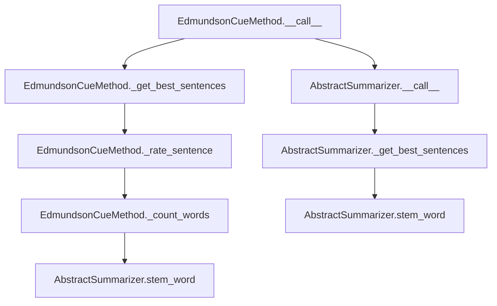

# `edmundson_cue.py`

## `sumy.summarizers.edmundson_cue.EdmundsonCueMethod` · *class*

## Summary:
Implements Edmundson's cue-based text summarization method that rates sentences based on the presence of bonus and stigma words.

## Description:
The EdmundsonCueMethod class implements a cue-based approach to text summarization where sentences are rated based on the occurrence of predefined bonus words (positive indicators) and stigma words (negative indicators). This method assigns positive weights to bonus words and negative weights to stigma words, calculating a net score for each sentence to determine its importance for inclusion in the summary.

This class is typically instantiated by summarization pipeline components that require cue-based sentence scoring. It serves as a concrete implementation of the AbstractSummarizer interface, providing the specific logic for Edmundson's cue-based approach to text summarization.

## State:
- _bonus_words: set or list of words considered positive indicators for sentence importance
- _stigma_words: set or list of words considered negative indicators for sentence importance
- _stemmer: inherited from AbstractSummarizer, used for normalizing words before comparison

## Lifecycle:
- Creation: Instantiate with a stemmer, bonus_words, and stigma_words parameters
- Usage: Call the instance with a document and desired sentence count to get a summary
- Destruction: Standard Python garbage collection handles cleanup

## Method Map:


## Raises:
- ValueError: Raised by parent AbstractSummarizer during initialization if stemmer is not callable

## Example:
```python
from sumy.summarizers.edmundson_cue import EdmundsonCueMethod
from sumy.nlp.stemmers import null_stemmer

# Define bonus and stigma words for a specific domain
bonus_words = {'important', 'significant', 'key', 'crucial'}
stigma_words = {'unimportant', 'minor', 'irrelevant', 'insignificant'}

# Create the summarizer
summarizer = EdmundsonCueMethod(
    stemmer=null_stemmer,
    bonus_words=bonus_words,
    stigma_words=stigma_words
)

# Apply to a document (assuming document object exists)
summary = summarizer(document, sentences_count=3, bonus_word_weight=2, stigma_word_weight=1)
```

### `sumy.summarizers.edmundson_cue.EdmundsonCueMethod.__init__` · *method*

## Summary:
Initializes an Edmundson cue-based text summarizer with specified bonus and stigma word sets.

## Description:
Configures the EdmundsonCueMethod instance with a stemmer for word normalization and predefined sets of bonus and stigma words used for sentence scoring. This constructor establishes the core parameters needed for cue-based sentence rating, where bonus words indicate important content and stigma words suggest less important content.

The method delegates stemmer validation to the parent AbstractSummarizer class while storing the cue word sets for subsequent use in the sentence rating algorithm. This initialization occurs during the summarization pipeline setup phase before any document processing begins.

## Args:
    stemmer (callable): Function used to normalize and stem words for comparison, must be callable
    bonus_words (set or list): Collection of words considered positive indicators for sentence importance
    stigma_words (set or list): Collection of words considered negative indicators for sentence importance

## Returns:
    None: This method initializes instance attributes and does not return a value

## Raises:
    ValueError: Raised by parent AbstractSummarizer.__init__ when stemmer parameter is not callable

## State Changes:
    Attributes READ: None
    Attributes WRITTEN: 
    - self._bonus_words: Stores the bonus words collection for sentence scoring
    - self._stigma_words: Stores the stigma words collection for sentence scoring

## Constraints:
    Preconditions:
    - stemmer must be callable (validated by parent class)
    - bonus_words and stigma_words should be iterable collections of words
    - Both bonus_words and stigma_words should contain words suitable for text matching
    
    Postconditions:
    - Instance is properly configured with stemmer and cue word sets
    - self._bonus_words contains the provided bonus words collection
    - self._stigma_words contains the provided stigma words collection

## Side Effects:
    None: This method performs no I/O operations or external service calls

### `sumy.summarizers.edmundson_cue.EdmundsonCueMethod.__call__` · *method*

## Summary:
Selects the most informative sentences from a document using Edmundson's cue word method, prioritizing sentences containing bonus words over those containing stigma words.

## Description:
Implements the Edmundson cue word summarization technique by evaluating sentences based on the presence of predefined bonus and stigma words. This method serves as the primary interface for performing summarization using this specific approach, delegating the actual sentence selection to the parent class's `_get_best_sentences` method.

The method is typically called during the summarization pipeline when a document needs to be condensed into a specified number of sentences using cue word weighting.

## Args:
    document (Document): The input document containing sentences to summarize
    sentences_count (int): The desired number of sentences in the resulting summary
    bonus_word_weight (float): Weight multiplier for bonus words found in sentences
    stigma_word_weight (float): Weight multiplier for stigma words found in sentences

## Returns:
    tuple: A tuple of sentences sorted in their original order, representing the most informative sentences according to the cue word scoring method

## Raises:
    AssertionError: When the underlying `_get_best_sentences` method encounters invalid parameters
    ValueError: When the underlying `_get_best_sentences` method receives unsupported count values

## State Changes:
    Attributes READ: 
        - self._bonus_words: Set of words considered as bonus words for scoring
        - self._stigma_words: Set of words considered as stigma words for scoring
        - self._stemmer: Stemming function used to normalize words for comparison
    
    Attributes WRITTEN: None

## Constraints:
    Preconditions:
        - document must contain a valid sentences attribute
        - sentences_count must be a positive integer
        - bonus_word_weight and stigma_word_weight must be numeric values
        - self._bonus_words and self._stigma_words must be initialized with appropriate word sets
    
    Postconditions:
        - Returns exactly sentences_count sentences (or fewer if document has insufficient sentences)
        - All returned sentences are from the original document
        - Sentences are ordered according to their original positions in the document

## Side Effects:
    None: This method performs no I/O operations or external service calls

### `sumy.summarizers.edmundson_cue.EdmundsonCueMethod._rate_sentence` · *method*

## Summary:
Calculates a numerical rating for a sentence based on the weighted count of bonus and stigma cue words.

## Description:
Rates a sentence by counting occurrences of predefined bonus and stigma words, then applying weighted scoring to produce a numeric value that represents the sentence's importance according to the Edmundson cue word method. This method is called during the sentence ranking phase of the summarization process to determine which sentences should be included in the final summary.

The method is specifically designed to work within the Edmundson cue word summarization framework, where certain words are classified as either bonus words (indicating important content) or stigma words (indicating less important content). The weighting factors allow customization of how much influence each type of word has on the final rating.

## Args:
    sentence (Sentence): The sentence object to rate, containing a collection of words to analyze
    bonus_word_weight (float): Weight multiplier applied to bonus word counts (default: 1.0). Must be non-negative.
    stigma_word_weight (float): Weight multiplier applied to stigma word counts (default: 1.0). Must be non-negative.

## Returns:
    float: The calculated sentence rating, where higher values indicate more important sentences. 
           The rating is computed as (bonus_words_count * bonus_word_weight) - (stigma_words_count * stigma_word_weight).
           Positive values indicate more bonus words than stigma words, negative values indicate more stigma words than bonus words.

## Raises:
    None: This method does not explicitly raise exceptions, though underlying operations may raise exceptions from:
          - self.stem_word() if word processing fails
          - self._count_words() if word iteration fails

## State Changes:
    Attributes READ: 
    - self._bonus_words: Set of words considered as bonus words for scoring
    - self._stigma_words: Set of words considered as stigma words for scoring
    - self.stem_word: Method used to normalize and stem words for comparison
    - self._count_words: Method used to count word occurrences in bonus/stigma sets

    Attributes WRITTEN: None

## Constraints:
    Preconditions:
    - The sentence parameter must be a valid Sentence object with a words property
    - The sentence.words collection must be iterable
    - bonus_word_weight and stigma_word_weight must be numeric values (float or int)
    - bonus_word_weight and stigma_word_weight must be non-negative
    - self._bonus_words and self._stigma_words must be initialized as collections containing words to match against

    Postconditions:
    - Returns a numeric rating value (float) representing sentence importance
    - The rating reflects the balance between bonus and stigma word influences
    - Input sentence object is not modified

## Side Effects:
    None: This method performs no I/O operations or external service calls. It operates purely on the input sentence and internal word sets.

### `sumy.summarizers.edmundson_cue.EdmundsonCueMethod._count_words` · *method*

## Summary:
Counts occurrences of words in bonus and stigma word sets from a collection of words.

## Description:
Processes a collection of words to determine how many belong to the predefined bonus word set and how many belong to the stigma word set. This method is used internally by the Edmundson cue word summarization algorithm to calculate sentence ratings based on the presence of cue words.

The method is called during sentence rating calculations in the `_rate_sentence` method, where it helps determine the weighted contribution of bonus and stigma words to a sentence's overall score.

## Args:
    words (iterable): Collection of words to be checked against bonus and stigma word sets

## Returns:
    tuple[int, int]: A tuple containing (bonus_words_count, stigma_words_count) representing the number of words found in each respective set

## Raises:
    None: This method does not raise any exceptions

## State Changes:
    Attributes READ: 
        - self._bonus_words: Set of words considered as bonus words for scoring
        - self._stigma_words: Set of words considered as stigma words for scoring
    
    Attributes WRITTEN: None

## Constraints:
    Preconditions:
        - The `words` parameter must be iterable
        - `self._bonus_words` and `self._stigma_words` must be initialized as collections (ideally sets) containing words to match against
    
    Postconditions:
        - Returns a tuple of two non-negative integers
        - The counts are accurate representations of word matches in the respective sets

## Side Effects:
    None: This method performs no I/O operations or external service calls

### `sumy.summarizers.edmundson_cue.EdmundsonCueMethod.rate_sentences` · *method*

## Summary:
Rates all sentences in a document using weighted bonus and stigma word counting to determine sentence importance for summarization.

## Description:
Processes each sentence in the provided document and calculates a numerical importance rating for each one. This method implements the core sentence scoring mechanism for Edmundson cue word-based summarization by applying weighted counting of bonus and stigma cue words. The resulting ratings help determine which sentences should be included in the final summary based on their relative importance.

This method is typically called during the sentence ranking phase of the summarization pipeline, where individual sentences are evaluated for inclusion in the output summary. It serves as a bridge between the raw document processing and the final sentence selection step.

## Args:
    document (Document): The document object containing sentences to be rated
    bonus_word_weight (float): Weight multiplier applied to bonus word counts (default: 1.0). Must be non-negative.
    stigma_word_weight (float): Weight multiplier applied to stigma word counts (default: 1.0). Must be non-negative.

## Returns:
    dict[Sentence, float]: A dictionary mapping each sentence in the document to its calculated importance rating. Higher ratings indicate more important sentences for inclusion in the summary.

## Raises:
    None: This method does not explicitly raise exceptions, though underlying operations may raise exceptions from:
          - self._rate_sentence() if sentence processing fails
          - self.stem_word() if word processing fails
          - Dictionary construction if sentence iteration fails

## State Changes:
    Attributes READ: 
    - self._bonus_words: Set of words considered as bonus words for scoring
    - self._stigma_words: Set of words considered as stigma words for scoring
    - self.stem_word: Method used to normalize and stem words for comparison
    - self._count_words: Method used to count word occurrences in bonus/stigma sets

    Attributes WRITTEN: None

## Constraints:
    Preconditions:
    - The document parameter must be a valid Document object with a sentences property
    - The document.sentences collection must be iterable
    - bonus_word_weight and stigma_word_weight must be numeric values (float or int)
    - bonus_word_weight and stigma_word_weight must be non-negative
    - self._bonus_words and self._stigma_words must be initialized as collections containing words to match against

    Postconditions:
    - Returns a dictionary mapping each sentence to a numeric rating value
    - The rating reflects the balance between bonus and stigma word influences
    - Input document object is not modified

## Side Effects:
    None: This method performs no I/O operations or external service calls. It operates purely on the input document and internal word sets.

