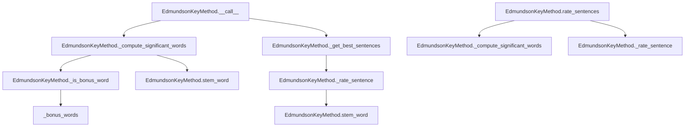

# `edmundson_key.py`

## `sumy.summarizers.edmundson_key.EdmundsonKeyMethod` · *class*

## Summary:
Implements the Edmundson key method for text summarization, which identifies significant words based on bonus words and rates sentences accordingly.

## Description:
The EdmundsonKeyMethod class is a concrete implementation of text summarization that focuses on identifying key words from a predefined set of bonus words. It uses frequency-based scoring to determine which words are significant in a document and then rates sentences based on how many of these significant words they contain.

This summarizer is particularly useful when you have domain-specific terminology or keywords that are especially important for the document's content. The algorithm works by:
1. Filtering words from the document that appear in a predefined bonus word list
2. Computing word frequencies among these bonus words
3. Identifying significant words based on a frequency threshold (controlled by the weight parameter)
4. Rating sentences based on the presence of these significant words

The class inherits from AbstractSummarizer, providing the basic infrastructure for stemming and sentence selection while implementing the specific Edmundson key method logic.

## State:
- _bonus_words: set-like object containing words that are considered bonus words for significance calculation
  - Type: set-like container of strings
  - Valid values: Words that can be matched against document words using 'in' operator
  - Invariant: Must be initialized during construction and remain constant throughout the object's lifetime

## Lifecycle:
- Creation: Instantiate with a stemmer callable and a collection of bonus words (which will be converted to a set internally)
- Usage: Call the instance with a document, desired sentence count, and weighting factor to get a summary, or use the rate_sentences method to get sentence ratings
- Destruction: Standard Python garbage collection handles cleanup

## Method Map:


## Raises:
- ValueError: Raised by parent AbstractSummarizer during initialization if the stemmer parameter is not callable

## Example:
```python
from sumy.summarizers.edmundson_key import EdmundsonKeyMethod
from sumy.nlp.stemmers import null_stemmer

# Define bonus words that are important for the domain
bonus_words = {'important', 'key', 'critical', 'essential', 'significant'}

# Create the summarizer
summarizer = EdmundsonKeyMethod(stemmer=null_stemmer, bonus_words=bonus_words)

# Get a summary of a document
# summary = summarizer(document, sentences_count=3, weight=0.5)

# Or get sentence ratings for analysis
# sentence_ratings = summarizer.rate_sentences(document, weight=0.5)
```

### `sumy.summarizers.edmundson_key.EdmundsonKeyMethod.__init__` · *method*

## Summary:
Initializes an EdmundsonKeyMethod instance with a stemmer and bonus words for key term identification.

## Description:
Constructs an EdmundsonKeyMethod object that implements the Edmundson key method for text summarization. This method identifies significant words based on a predefined set of bonus words and rates sentences according to their content's relevance to these key terms.

The constructor accepts a stemmer for normalizing words and a collection of bonus words that define which terms are considered significant for the summarization process. The bonus words are stored internally as a set-like structure for efficient lookup during sentence rating calculations.

## Args:
    stemmer (callable): A callable object used for stemming words during the summarization process. Must be callable, otherwise raises ValueError from parent class.
    bonus_words (set-like): A collection of words that are considered bonus words for significance calculation. These words are used to identify key terms in the document during summarization.

## Returns:
    None: This method initializes the object's state but does not return a value.

## Raises:
    ValueError: Raised by parent AbstractSummarizer class when the stemmer parameter is not callable.

## State Changes:
    Attributes READ: None
    Attributes WRITTEN: 
    - self._bonus_words: Stores the bonus_words parameter as the internal set of significant terms
    - self._stemmer: Inherited from AbstractSummarizer, set via parent constructor call

## Constraints:
    Preconditions:
    - The stemmer parameter must be callable
    - bonus_words should be iterable and convertible to a set for internal storage
    
    Postconditions:
    - self._bonus_words will be set to a set-like representation of the bonus_words parameter
    - self._stemmer will be properly initialized from the stemmer parameter

## Side Effects:
    None: This method performs no I/O operations or external service calls. It only initializes internal object state.

### `sumy.summarizers.edmundson_key.EdmundsonKeyMethod.__call__` · *method*

## Summary:
Computes significant words from a document using frequency-based filtering and selects the most important sentences based on their relevance to these significant words.

## Description:
This method implements the core logic of the Edmundson key word summarization technique. It first identifies significant words in the document by filtering bonus words and applying frequency thresholding, then rates sentences based on their overlap with these significant words, and finally selects the highest-rated sentences to form the summary.

The method is called as part of the summarization pipeline where it processes a document and returns a summary consisting of the specified number of most relevant sentences. This approach emphasizes words that appear frequently in the document among the predefined bonus word set.

## Args:
    document (Document): The document object containing sentences and words to summarize
    sentences_count (int): The number of sentences to include in the final summary
    weight (float): Frequency threshold weight (between 0.0 and 1.0) used to determine which bonus words are significant

## Returns:
    tuple: A tuple of sentences sorted in their original order, containing the most relevant sentences according to the Edmundson key method

## Raises:
    None: This method does not explicitly raise exceptions, though underlying operations may raise exceptions from:
          - self._compute_significant_words() if word processing fails
          - self._get_best_sentences() if sentence selection fails

## State Changes:
    Attributes READ: 
    - self._bonus_words: Set of words considered as bonus words for significance calculation
    - self.stem_word: Method used to normalize and stem words for comparison
    
    Attributes WRITTEN: None

## Constraints:
    Preconditions:
    - document must be a valid Document object with sentences and words properties
    - sentences_count must be a positive integer
    - weight must be a float between 0.0 and 1.0
    - self._bonus_words must be initialized as a collection containing words to match against
    
    Postconditions:
    - Returns a tuple of sentences in original order
    - Number of returned sentences equals sentences_count (or fewer if document has insufficient sentences)
    - All returned sentences are from the input document

## Side Effects:
    None: This method performs no I/O operations or external service calls. It operates purely on the input document and internal word sets.

### `sumy.summarizers.edmundson_key.EdmundsonKeyMethod._compute_significant_words` · *method*

## Summary:
Computes a tuple of significant words from a document based on frequency thresholds relative to the maximum word frequency.

## Description:
Processes document words by applying stemming, filtering for bonus words, counting frequencies, and returning words that exceed a specified frequency threshold. This method is used internally by the Edmundson key phrase summarization algorithm to identify important words that contribute to sentence scoring.

The method is called during the summarization pipeline when determining which words should be considered significant for sentence rating purposes. It's separated from the main summarization logic to provide clean abstraction and reusability.

## Args:
    document (Document): The document object containing words to process
    weight (float): Frequency threshold ratio (0.0 to 1.0) for determining significant words

## Returns:
    tuple[str]: Tuple of significant words whose frequencies exceed the threshold (weight * max_frequency)

## Raises:
    None explicitly raised

## State Changes:
    Attributes READ:
    - self._bonus_words: Set of words considered as bonus words for significance
    - self.stem_word: Stemming method inherited from AbstractSummarizer
    - self._is_bonus_word: Private method for checking bonus word membership
    
    Attributes WRITTEN: None

## Constraints:
    Preconditions:
    - Document must have a 'words' attribute containing iterable of words
    - Weight must be a numeric value between 0.0 and 1.0
    - Self must have been properly initialized with bonus_words
    
    Postconditions:
    - Returns a tuple of strings representing significant words
    - Empty tuple returned when no words meet frequency criteria
    - All returned words have been stemmed and filtered for bonus word status

## Side Effects:
    None

### `sumy.summarizers.edmundson_key.EdmundsonKeyMethod._is_bonus_word` · *method*

## Summary:
Checks if a given word is contained within the set of predefined bonus words for significance determination.

## Description:
Determines whether a word qualifies as a bonus word by testing its presence in the internal collection of bonus words. This method is used during the text summarization process to filter and identify words that should be considered significant for sentence scoring calculations.

The method is called during the `_compute_significant_words` phase of the Edmundson key phrase summarization algorithm, specifically to filter stemmed words that are part of the predefined bonus word set before frequency analysis.

## Args:
    word (str): The word to test for bonus word status

## Returns:
    bool: True if the word exists in self._bonus_words, False otherwise

## State Changes:
    Attributes READ:
    - self._bonus_words: Collection of words considered as bonus words for significance determination

## Constraints:
    Preconditions:
    - The method must be called on an instance of EdmundsonKeyMethod that has been properly initialized
    - self._bonus_words must be initialized as a collection supporting the 'in' operator (e.g., set, frozenset, list)
    - The word parameter must be a string type

    Postconditions:
    - Returns a boolean value indicating membership in the bonus word collection
    - Does not modify any object state

## Side Effects:
    None

### `sumy.summarizers.edmundson_key.EdmundsonKeyMethod._rate_sentence` · *method*

## Summary:
Rates a sentence by counting how many of its stemmed words appear in the set of significant words.

## Description:
This method implements the core scoring mechanism for the Edmundson key method of text summarization. It takes a sentence and computes a score based on how many of its stemmed words are present in the predefined set of significant words. This scoring is used to rank sentences for inclusion in the final summary.

The method is called during the summarization process when determining which sentences are most important based on keyword frequency and significance.

## Args:
    sentence: A sentence object containing words to be processed
    significant_words: A collection (likely tuple or set) of stemmed words considered significant for summarization

## Returns:
    int: The count of stemmed words from the sentence that appear in significant_words

## State Changes:
    Attributes READ: None
    Attributes WRITTEN: None

## Constraints:
    Preconditions: 
    - sentence.words must be iterable and contain words that can be processed by self.stem_word
    - significant_words must support the 'in' operator for membership testing
    
    Postconditions:
    - Returns a non-negative integer representing the number of significant words found in the sentence
    - The returned value is bounded by the number of words in the sentence

## Side Effects:
    None

### `sumy.summarizers.edmundson_key.EdmundsonKeyMethod.rate_sentences` · *method*

## Summary:
Rates all sentences in a document based on their overlap with significant words identified from the document's bonus words and frequency thresholds.

## Description:
Computes significance scores for all sentences in a document by first identifying significant words using frequency-based filtering on bonus words, then calculating how many significant words appear in each sentence. This method is primarily used for debugging and detailed analysis of sentence ratings, as the main summarization workflow uses a more optimized approach via the `__call__` method.

The method is called during the Edmundson key word summarization process when detailed sentence scoring information is needed for analysis or when implementing alternative selection strategies. It provides a complete mapping of sentences to their computed scores, which can be useful for understanding the scoring distribution or implementing custom selection logic.

## Args:
    document: The document object containing sentences to be rated
    weight (float): Frequency threshold weight (0.0 to 1.0) used to determine which bonus words are significant. Defaults to 0.5.

## Returns:
    dict: Dictionary mapping each sentence in the document to its computed significance score (integer count of significant words found)

## Raises:
    None explicitly raised

## State Changes:
    Attributes READ:
    - self._bonus_words: Set of words considered as bonus words for significance calculation
    - self.stem_word: Method used to normalize and stem words for comparison
    - self._is_bonus_word: Private method for checking bonus word membership
    - self._rate_sentence: Private method used for individual sentence scoring
    - self._compute_significant_words: Private method for computing significant words
    
    Attributes WRITTEN: None

## Constraints:
    Preconditions:
    - document must be a valid Document object with sentences and words properties
    - weight must be a float between 0.0 and 1.0
    - self._bonus_words must be initialized as a collection containing words to match against
    
    Postconditions:
    - Returns a dictionary with all sentences from the document as keys
    - Each value is a non-negative integer representing the count of significant words in that sentence
    - The returned dictionary contains one entry for each sentence in document.sentences

## Side Effects:
    None: This method performs no I/O operations or external service calls. It operates purely on the input document and internal word sets.

