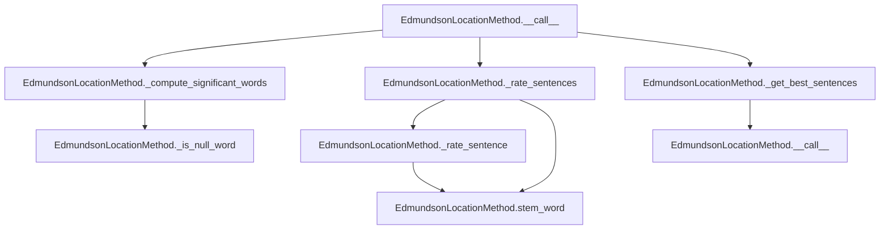

# `edmundson_location.py`

## `sumy.summarizers.edmundson_location.EdmundsonLocationMethod` · *class*

## Summary:
Implements Edmundson's location-based text summarization method that rates sentences based on their position in the document and content significance.

## Description:
The EdmundsonLocationMethod class implements a text summarization technique that combines location-based weighting with content-based significance scoring. It assigns higher weights to sentences in specific positions (headings, first/last paragraphs, first/last sentences) while also considering the presence of significant words from document headings.

This class is typically instantiated by summarization pipeline components that require location-aware summarization. It extends AbstractSummarizer to provide a concrete implementation of the Edmundson method for document summarization.

## State:
- _null_words: set-like object containing words that should be filtered out during significant word computation
- Inherits _stemmer from AbstractSummarizer for word stemming operations

## Lifecycle:
- Creation: Instantiate with a stemmer and a collection of null words to be excluded from significant word analysis
- Usage: Call the instance with a document, desired sentence count, and weighting parameters, or use the rate_sentences method directly
- Destruction: Uses standard Python garbage collection

## Method Map:


## Raises:
- ValueError: Raised by parent AbstractSummarizer during initialization if stemmer is not callable

## Example:
```python
from sumy.summarizers.edmundson_location import EdmundsonLocationMethod
from sumy.nlp.stemmers import null_stemmer

# Create summarizer with null stemmer and stop words
null_words = {"the", "and", "or", "but"}
summarizer = EdmundsonLocationMethod(null_stemmer, null_words)

# Rate sentences with custom weights
document = ... # Some document object
ratings = summarizer.rate_sentences(
    document, 
    w_h=2.0,   # Heading weight
    w_p1=1.5,  # First paragraph weight
    w_p2=1.0,  # Last paragraph weight
    w_s1=1.2,  # First sentence weight
    w_s2=0.8   # Last sentence weight
)

# Get best sentences
best_sentences = summarizer(document, 3, 3, 2.0, 1.5, 1.0, 1.2, 0.8)
```

### `sumy.summarizers.edmundson_location.EdmundsonLocationMethod.__init__` · *method*

## Summary:
Initializes an EdmundsonLocationMethod instance with a stemmer and null words for filtering insignificant terms.

## Description:
Configures the Edmundson location-based summarization method by setting up the stemmer for word normalization and storing the collection of null words that should be excluded from significant word analysis. This method establishes the foundational configuration required for location-weighted sentence rating and document summarization.

The initialization process calls the parent AbstractSummarizer's constructor to set up the stemmer, then stores the null_words collection which is used during significant word computation to filter out common but uninformative terms.

## Args:
    stemmer (callable): A callable object used for stemming words during text processing. Must be callable, otherwise raises ValueError.
    null_words (set-like): Collection of words to be filtered out during significant word analysis. These are typically stop words or common terms that don't contribute to document significance.

## Returns:
    None: This method initializes the object's state and returns nothing.

## Raises:
    ValueError: Raised by parent AbstractSummarizer if the stemmer parameter is not callable.

## State Changes:
    Attributes READ: None
    Attributes WRITTEN: 
    - self._null_words: Stores the provided null_words collection for later use in significant word filtering
    - Inherits and initializes self._stemmer from AbstractSummarizer parent class

## Constraints:
    Preconditions:
    - The stemmer argument must be callable
    - null_words should be a set-like object that supports membership testing
    
    Postconditions:
    - self._stemmer is properly initialized from the parent class
    - self._null_words contains the provided null_words collection
    - The object is ready for use in sentence rating and summarization operations

## Side Effects:
    None: This method performs no I/O operations or external service calls. It only initializes internal object state.

### `sumy.summarizers.edmundson_location.EdmundsonLocationMethod.__call__` · *method*

## Summary:
Performs location-based text summarization by computing sentence ratings based on positional and structural factors and selecting the highest-rated sentences.

## Description:
Executes the Edmundson location-based summarization algorithm by first identifying significant words from document headings, then calculating weighted ratings for each sentence based on position within paragraphs and documents, and finally selecting the top-rated sentences. This method implements the core summarization logic that combines positional weighting with content-based scoring.

The method is called during the summarization pipeline when a user requests a summary with specific parameters. It orchestrates the three main phases of the Edmundson location algorithm: significant word computation, sentence rating, and best sentence selection. Unlike other Edmundson variants that focus on key phrases or title words, this implementation emphasizes sentence positioning within the document structure.

## Args:
    document (Document): The document object containing sentences, paragraphs, and headings to summarize
    sentences_count (int): The number of top-rated sentences to select for the summary
    w_h (float): Weight factor for heading significance in sentence scoring (typically 0.0 to 1.0)
    w_p1 (float): Weight factor for first paragraph sentences in sentence scoring (typically 0.0 to 1.0)  
    w_p2 (float): Weight factor for last paragraph sentences in sentence scoring (typically 0.0 to 1.0)
    w_s1 (float): Weight factor for first sentence in paragraph scoring (typically 0.0 to 1.0)
    w_s2 (float): Weight factor for last sentence in paragraph scoring (typically 0.0 to 1.0)

## Returns:
    tuple[Sentence]: A tuple of Sentence objects sorted in their original order, containing the top-rated sentences according to the location-based scoring algorithm

## Raises:
    None explicitly raised

## State Changes:
    Attributes READ:
    - self._null_words: Set of words to filter out during significant word computation
    - self.stem_word: Inherited stemming method from AbstractSummarizer
    - self._is_null_word: Private method for checking null word membership
    
    Attributes WRITTEN: None

## Constraints:
    Preconditions:
    - Document must have valid 'sentences', 'paragraphs', and 'headings' attributes
    - All weight parameters (w_h, w_p1, w_p2, w_s1, w_s2) should be numeric values
    - Sentences_count must be a valid count for selecting sentences
    
    Postconditions:
    - Returns exactly sentences_count sentences (or fewer if document has insufficient sentences)
    - All returned sentences are from the original document
    - Sentences are returned in their original order

## Side Effects:
    None: This method performs no I/O operations or external service calls

### `sumy.summarizers.edmundson_location.EdmundsonLocationMethod._compute_significant_words` · *method*

## Summary:
Extracts and processes significant words from document headings for location-based text summarization.

## Description:
Processes document headings to identify significant words by extracting words from each heading, applying word stemming via self.stem_word, filtering out null words using self._is_null_word, and returning a frozen set of unique significant words. This private method serves as a core component in Edmundson's location-based summarization approach, focusing on identifying important terms from document structural elements like headings.

## Args:
    document: Document object containing headings with words attribute

## Returns:
    frozenset: Immutable set of significant words extracted from document headings after stemming and filtering

## Raises:
    AttributeError: If document does not have a headings attribute or if headings lack words attribute
    TypeError: If document is None or invalid type

## State Changes:
    Attributes READ: self.stem_word, self._is_null_word
    Attributes WRITTEN: None

## Constraints:
    Preconditions: Document must have a headings attribute containing heading objects with words attribute
    Postconditions: Returns immutable frozenset of processed significant words

## Side Effects:
    None

### `sumy.summarizers.edmundson_location.EdmundsonLocationMethod._is_null_word` · *method*

## Summary:
Checks whether a given word is considered a null word in the Edmundson location-based summarization algorithm.

## Description:
This method determines if a word should be excluded from consideration during the summarization process by checking if it exists in the predefined set of null words. It's used primarily during the computation of significant words to filter out common stop words or irrelevant terms.

The method is part of the EdmundsonLocationMethod class which implements location-based text summarization techniques that consider word position and document structure.

## Args:
    word (str): The word to check for null-word status

## Returns:
    bool: True if the word is in the null words collection, False otherwise

## State Changes:
    Attributes READ: self._null_words

## Constraints:
    Preconditions: The method assumes that self._null_words is properly initialized as a collection (list, set, etc.) containing null words
    Postconditions: The method returns a boolean value indicating membership in self._null_words

## Side Effects:
    None: This method performs only a lookup operation and has no side effects

### `sumy.summarizers.edmundson_location.EdmundsonLocationMethod._rate_sentences` · *method*

## Summary:
Rates all sentences in a document by combining content-based significance scores with positional weighting based on sentence and paragraph positions.

## Description:
This method computes relevance scores for all sentences in a document by first calculating base significance scores using the `_rate_sentence` method, then applying positional weights based on sentence location within paragraphs and paragraph position within the document. It's called during the Edmundson location-based text summarization process to rank sentences for inclusion in the final summary.

The method is invoked as part of the summarization pipeline when determining sentence importance based on both content relevance (significant words) and structural positioning (beginning/end of paragraphs/sentences).

## Args:
    document: Document object containing paragraphs and sentences to be rated
    significant_words: frozenset of stemmed words considered significant for the document
    w_h (float): Weight factor for the base significance score from `_rate_sentence`
    w_p1 (float): Weight added to sentences in the first paragraph
    w_p2 (float): Weight added to sentences in the last paragraph  
    w_s1 (float): Weight added to the first sentence in each paragraph
    w_s2 (float): Weight added to the last sentence in each paragraph

## Returns:
    dict: Mapping from sentence objects to their computed relevance scores (float values)

## Raises:
    None explicitly raised

## State Changes:
    Attributes READ: 
    - self._rate_sentence: Method used to compute base sentence significance scores
    
    Attributes WRITTEN: None

## Constraints:
    Preconditions:
    - document must have a paragraphs attribute containing iterable paragraphs
    - each paragraph must have a sentences attribute containing iterable sentences
    - significant_words must be a frozenset or similar set-like object supporting 'in' operations
    - all weight parameters must be numeric values
    
    Postconditions:
    - Returns a dictionary mapping each sentence to a numeric score
    - All sentence objects remain unmodified
    - The returned dictionary contains one entry per sentence in the document

## Side Effects:
    None: This method performs no I/O operations or external service calls. It operates purely on the input document and weight parameters.

### `sumy.summarizers.edmundson_location.EdmundsonLocationMethod._rate_sentence` · *method*

## Summary:
Computes a relevance score for a sentence based on the number of significant words it contains after stemming.

## Description:
Rates a sentence by counting how many of its stemmed words appear in a predefined set of significant words. This method is used as part of the Edmundson location-based summarization approach, where sentences are scored based on their content's significance relative to document headings.

The method is called during the sentence rating phase of the summarization process, specifically within the `_rate_sentences` method which applies location-based weights to the base significance score.

## Args:
    sentence (Sentence): The sentence object to rate, containing a `words` attribute with the sentence's constituent words
    significant_words (frozenset): A frozen set of stemmed words considered significant for the document, typically derived from document headings

## Returns:
    int: The count of significant words found in the sentence after stemming, representing the sentence's content-based relevance score

## Raises:
    None explicitly raised

## State Changes:
    Attributes READ: 
    - self.stem_word: The stemming function used to normalize words for comparison
    
    Attributes WRITTEN: None

## Constraints:
    Preconditions:
    - The sentence parameter must have a `words` attribute that is iterable
    - The significant_words parameter must be a frozenset or similar set-like object
    - The summarizer instance must have a valid stem_word method
    
    Postconditions:
    - Returns a non-negative integer representing the count of matching significant words
    - The original sentence object is not modified
    - The significant_words set is not modified

## Side Effects:
    None: This method performs no I/O operations or external service calls

### `sumy.summarizers.edmundson_location.EdmundsonLocationMethod.rate_sentences` · *method*

## Summary:
Rates sentences in a document based on content significance and positional weighting using heading-derived keywords.

## Description:
Computes relevance scores for all sentences in a document by first extracting significant words from document headings, then applying positional weights based on sentence location within paragraphs and paragraph position within the document. This method is typically called during the Edmundson location-based text summarization pipeline to rank sentences for inclusion in the final summary.

The method separates the computation of significant words from sentence rating to enable reuse and testing of each component independently. It's designed to work with the Edmundson location-based summarization approach that emphasizes both content relevance (based on heading keywords) and structural positioning (beginning/end of paragraphs/sentences).

## Args:
    document (Document): Document object containing paragraphs and sentences to be rated
    w_h (float): Weight factor for the base significance score from `_rate_sentence`. Defaults to 1.0
    w_p1 (float): Weight added to sentences in the first paragraph. Defaults to 1.0
    w_p2 (float): Weight added to sentences in the last paragraph. Defaults to 1.0
    w_s1 (float): Weight added to the first sentence in each paragraph. Defaults to 1.0
    w_s2 (float): Weight added to the last sentence in each paragraph. Defaults to 1.0

## Returns:
    dict[Sentence, float]: Mapping from sentence objects to their computed relevance scores (float values)

## Raises:
    AttributeError: If document does not have required attributes (paragraphs, sentences, headings)
    TypeError: If document is None or invalid type

## State Changes:
    Attributes READ: 
    - self._compute_significant_words: Method used to extract significant words from document headings
    - self._rate_sentences: Method used to compute final sentence ratings
    
    Attributes WRITTEN: None

## Constraints:
    Preconditions:
    - Document must have a paragraphs attribute containing iterable paragraphs
    - Each paragraph must have a sentences attribute containing iterable sentences
    - Document must have headings attribute containing heading objects with words attribute
    - All weight parameters must be numeric values
    
    Postconditions:
    - Returns a dictionary mapping each sentence to a numeric score
    - All sentence objects remain unmodified
    - The returned dictionary contains one entry per sentence in the document

## Side Effects:
    None: This method performs no I/O operations or external service calls. It operates purely on the input document and weight parameters.

