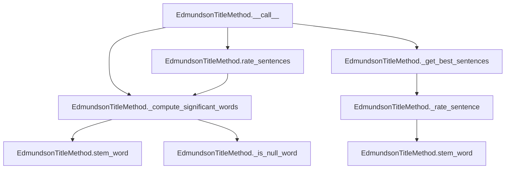

# `edmundson_title.py`

## `sumy.summarizers.edmundson_title.EdmundsonTitleMethod` · *class*

## Summary:
Implements the Edmundson title-based text summarization method that rates sentences based on significant words found in document headings.

## Description:
The EdmundsonTitleMethod class implements a text summarization technique that leverages the importance of words appearing in document headings. It identifies significant words from headings and uses them to rate sentences in the document, selecting the highest-rated sentences for the summary.

This class extends AbstractSummarizer and provides a concrete implementation of the Edmundson approach specifically focused on title/heading significance rather than other factors like keyphrase frequency or centroid similarity. It's designed to work with document objects that have headings and sentences attributes.

## State:
- _null_words: set-like object containing words that should be filtered out during significant word computation
- _stemmer: inherited from AbstractSummarizer, used for normalizing words during processing (callable object)

## Lifecycle:
- Creation: Instantiate with a stemmer (callable) and a collection of null words to filter out
- Usage: Call the instance with a document and desired sentence count to get a summary
- Destruction: Standard Python garbage collection handles cleanup

## Method Map:


## Raises:
- ValueError: Raised by parent AbstractSummarizer during initialization if stemmer is not callable

## Example:
```python
from sumy.summarizers.edmundson_title import EdmundsonTitleMethod
from sumy.nlp.stemmers import null_stemmer

# Create summarizer with null stemmer and common stop words
null_words = {"the", "and", "or", "but", "in", "on", "at", "to", "for", "of"}
summarizer = EdmundsonTitleMethod(null_stemmer, null_words)

# Apply to a document with 3 sentences in summary
# result = summarizer(document, 3)
```

### `sumy.summarizers.edmundson_title.EdmundsonTitleMethod.__init__` · *method*

## Summary:
Initializes an EdmundsonTitleMethod instance with a stemmer and null words filter.

## Description:
Configures the Edmundson title-based summarization method by setting up the stemmer for word normalization and storing the collection of words to exclude from significant word computation. This method is called during object instantiation and prepares the summarizer for text processing operations.

## Args:
    stemmer (callable): A callable object used for stemming words during text processing. Must be callable, otherwise raises ValueError.
    null_words (collection): A set-like collection of words that should be filtered out when identifying significant words from document headings.

## Returns:
    None: This method initializes the object's state and returns nothing.

## Raises:
    ValueError: Raised by parent AbstractSummarizer.__init__ if stemmer is not callable.

## State Changes:
    Attributes READ: None
    Attributes WRITTEN: 
    - self._null_words: Stores the provided null_words collection for filtering during significant word identification
    - self._stemmer: Inherited from AbstractSummarizer, set to the provided stemmer for word normalization

## Constraints:
    Preconditions:
    - stemmer must be callable (otherwise ValueError from parent class)
    - null_words should be a collection-like object (set, list, tuple, etc.)

    Postconditions:
    - self._null_words is assigned the provided null_words parameter
    - self._stemmer is properly initialized from the parent class

## Side Effects:
    None: This method performs no I/O operations or external service calls. It only initializes object attributes.

### `sumy.summarizers.edmundson_title.EdmundsonTitleMethod.__call__` · *method*

## Summary:
Processes a document and returns the most significant sentences based on heading-derived keywords using the Edmundson title method.

## Description:
Executes the Edmundson title-based text summarization algorithm by identifying significant words from document headings, rating sentences based on keyword overlap, and selecting the highest-ranked sentences while preserving their original order. This method serves as the primary entry point for the Edmundson title summarization technique, which leverages document structural elements (headings) to determine content importance.

The method follows a three-stage process: (1) extracts significant words from document headings by stemming and filtering out null words, (2) rates all sentences based on how many significant words they contain, and (3) selects the top-rated sentences according to the specified count. This approach is particularly effective for documents where headings contain important content that should be preserved in summaries.

## Args:
    document (Document): The document object containing sentences and headings to summarize
    sentences_count (int): The number of top-ranked sentences to return in the summary

## Returns:
    tuple[Sentence]: A tuple of sentences sorted in their original order, containing the most significant sentences according to the Edmundson title method

## Raises:
    None explicitly raised

## State Changes:
    Attributes READ:
    - self._null_words: Set of words to exclude from significant word computation
    - self._stemmer: Stemming function used for normalizing words
    - self._compute_significant_words: Method for extracting significant words from headings
    - self._get_best_sentences: Method for selecting top-rated sentences
    - self._rate_sentence: Method for scoring sentences based on significant word overlap
    
    Attributes WRITTEN: None

## Constraints:
    Preconditions:
    - Document must have 'sentences' and 'headings' attributes
    - Headings must have 'words' attribute containing iterable of words
    - Sentences_count must be a positive integer or valid count specification
    - Self must be properly initialized with a stemmer and null_words
    
    Postconditions:
    - Returns a tuple of sentences in original order
    - Number of returned sentences equals sentences_count (or fewer if document has insufficient sentences)
    - All returned sentences are from the input document

## Side Effects:
    None: This method performs no I/O operations or external service calls. It operates purely on the input document and internal state.

### `sumy.summarizers.edmundson_title.EdmundsonTitleMethod._compute_significant_words` · *method*

## Summary:
Extracts and processes significant words from document headings for use in title-based text summarization.

## Description:
Processes document headings to identify significant words by extracting words from each heading, applying stemming to normalize them, filtering out null words (common stop words), and returning a frozenset of the resulting significant words. This method is central to the Edmundson title-based summarization approach, which prioritizes content from document headings when selecting important sentences for the final summary.

The method is called by both the main summarization process (`__call__`) and the sentence rating mechanism (`rate_sentences`) to obtain the set of significant words that will be used to score sentences based on their content similarity to document headings.

## Args:
    document: A document object containing headings with words to process

## Returns:
    frozenset: An immutable set of stemmed, non-null words extracted from document headings

## Raises:
    None explicitly raised

## State Changes:
    Attributes READ: 
    - self.stem_word: Method used for word stemming
    - self._is_null_word: Method used to identify null words to exclude
    - self._null_words: Collection of words considered null/irrelevant

    Attributes WRITTEN: None

## Constraints:
    Preconditions:
    - The document parameter must have a headings attribute that is iterable
    - Each heading in document.headings must have a words attribute that is iterable
    - The summarizer instance must have valid stem_word and _is_null_word methods
    - self._null_words must be properly initialized as a collection of null words

    Postconditions:
    - Returns a frozenset containing only stemmed, non-null words from document headings
    - The original document object is not modified
    - The returned frozenset is immutable and hashable for use as dictionary keys or set elements

## Side Effects:
    None: This method performs no I/O operations or external service calls. It operates purely on the input document and internal word collections.

### `sumy.summarizers.edmundson_title.EdmundsonTitleMethod._is_null_word` · *method*

## Summary:
Checks if a given word is contained in the collection of null words used for filtering.

## Description:
This method determines whether a word should be excluded from consideration during text processing by checking if it exists in the predefined set of null words. It is used primarily in the text summarization process to filter out common stop words or insignificant terms that don't contribute meaningfully to sentence scoring.

The method is called during the computation of significant words from document headings, where it helps identify and exclude null words from the final set of significant terms.

## Args:
    word (str): The word to check against the null words collection

## Returns:
    bool: True if the word is found in self._null_words, False otherwise

## State Changes:
    Attributes READ: self._null_words
    Attributes WRITTEN: None

## Constraints:
    Preconditions: 
    - self._null_words must be initialized and contain hashable elements
    - The word parameter must be of a type compatible with membership testing against self._null_words
    
    Postconditions:
    - The method returns a boolean value indicating membership status
    - No modifications are made to the object's state

## Side Effects:
    None

### `sumy.summarizers.edmundson_title.EdmundsonTitleMethod._rate_sentence` · *method*

## Summary:
Rates a sentence by counting the number of its stemmed words that appear in a set of significant words.

## Description:
Computes a relevance score for a given sentence by comparing its stemmed words against a predefined set of significant words derived from document headings. This method implements the core scoring mechanism of the Edmundson title-based summarization approach, where sentences are ranked based on their overlap with important keywords extracted from document structure.

The method processes each word in the sentence through the summarizer's stemmer to ensure consistent matching regardless of word variations, then counts how many of these stemmed words are present in the significant words collection. This scoring approach emphasizes sentences that contain key terms from document headings, which are considered indicative of important content.

This method is intentionally separated from inline logic to enable reuse in different contexts within the Edmundson summarization framework, such as in batch sentence rating operations and the main summarization pipeline.

## Args:
    sentence (Sentence): The sentence object to be rated, containing a `words` attribute with tokenized text
    significant_words (frozenset): A collection of stemmed words considered significant for scoring, typically derived from document headings

## Returns:
    int: The count of stemmed words from the sentence that are present in the significant_words set, representing the sentence's relevance score

## Raises:
    None explicitly raised

## State Changes:
    Attributes READ:
    - self.stem_word: The stemming function used to normalize words for comparison
    
    Attributes WRITTEN: None

## Constraints:
    Preconditions:
    - The sentence object must have a `words` attribute that is iterable
    - The significant_words parameter must be a frozenset or similar set-like collection
    - The self.stem_word method must be properly initialized
    
    Postconditions:
    - Returns a non-negative integer representing word overlap count
    - Input sentence and significant_words are not modified
    - The returned count represents exact matches between stemmed words and significant words

## Side Effects:
    None: This method performs no I/O operations, external service calls, or mutations to objects outside its immediate scope.

### `sumy.summarizers.edmundson_title.EdmundsonTitleMethod.rate_sentences` · *method*

## Summary:
Rates all sentences in a document based on their overlap with significant words extracted from document headings.

## Description:
Computes relevance scores for all sentences in a document by comparing each sentence's stemmed words against a set of significant words derived from document headings. This method is used in the Edmundson title-based summarization approach to rank sentences according to their content's relevance to important structural elements of the document.

The method is called during the sentence rating phase of the summarization process, typically by the main `__call__` method or when performing batch sentence scoring operations. It separates the sentence rating logic into its own method to enable reuse and maintain clean code organization.

## Args:
    document: A document object containing sentences and headings to process

## Returns:
    dict: Dictionary mapping each sentence in the document to its relevance score (integer count of significant words found)

## Raises:
    None explicitly raised

## State Changes:
    Attributes READ:
    - self._compute_significant_words: Method used to extract significant words from document headings
    - self._rate_sentence: Method used to compute individual sentence scores
    - self.stem_word: Inherited stemming method for normalizing words

    Attributes WRITTEN: None

## Constraints:
    Preconditions:
    - The document parameter must have a sentences attribute that is iterable
    - The document parameter must have a headings attribute that is iterable
    - Each heading in document.headings must have a words attribute that is iterable
    - The summarizer instance must have valid stem_word and _is_null_word methods
    - self._null_words must be properly initialized as a collection of null words

    Postconditions:
    - Returns a dictionary with all sentences from the document as keys
    - Each value is a non-negative integer representing the sentence's relevance score
    - The original document object is not modified
    - The returned dictionary maintains the same order as sentences in the document

## Side Effects:
    None: This method performs no I/O operations, external service calls, or mutations to objects outside its immediate scope.

