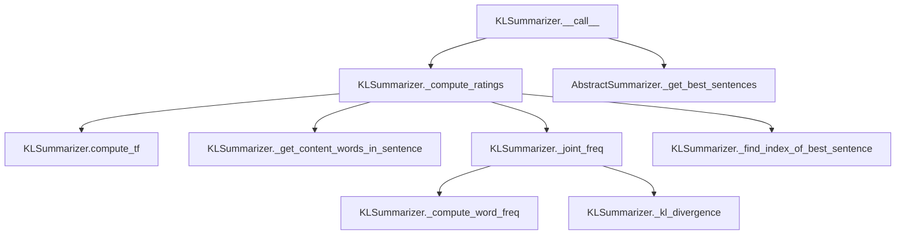

# `kl.py`

## `sumy.summarizers.kl.KLSummarizer` · *class*

## Summary:
Kullback-Leibler (KL) divergence-based text summarizer that ranks sentences based on their information content relative to the document.

## Description:
The KLSummarizer implements a summarization algorithm that uses Kullback-Leibler divergence to measure the information content of sentences. It builds a summary incrementally by selecting sentences that maximize the diversity of information content while minimizing redundancy. This approach focuses on choosing sentences that contribute unique information to the summary rather than simply selecting those with high-frequency terms.

The summarizer inherits from AbstractSummarizer and implements the required __call__ method to provide a standardized interface for text summarization. It operates by computing term frequencies for the entire document and then iteratively selecting sentences that minimize KL divergence with the current summary, effectively choosing sentences that add the most new information.

## State:
- stop_words: frozenset - Set of stop words to filter out from consideration during summarization. Defaults to an empty frozenset.
- Inherited from AbstractSummarizer:
  - _stemmer: callable - Stemmer function used for normalizing words (defaults to null_stemmer)

## Lifecycle:
- Creation: Instantiate with optional stemmer parameter (inherits from AbstractSummarizer)
- Usage: Call the instance with a document object and desired number of sentences to extract
- Destruction: Standard Python garbage collection

## Method Map:


## Raises:
- ValueError: From parent AbstractSummarizer when stemmer parameter is not callable during initialization

## Example:
```python
from sumy.summarizers.kl import KLSummarizer
from sumy.parsers.plaintext import PlaintextParser
from sumy.nlp.tokenizers import Tokenizer

# Create parser and tokenizer
parser = PlaintextParser.from_file("document.txt", Tokenizer("english"))
summarizer = KLSummarizer()  # Uses default null_stemmer

# Generate summary with 3 sentences
summary = summarizer(parser.document, 3)
for sentence in summary:
    print(sentence)
```

### `sumy.summarizers.kl.KLSummarizer.__call__` · *method*

## Summary:
Executes the KL divergence-based text summarization algorithm on a document and returns the most informative sentences.

## Description:
This method implements the core functionality of the KLSummarizer by processing a document through the KL divergence scoring approach. It extracts sentences from the document, computes relevance scores using KL divergence between sentence content and overall document frequency, and selects the highest-ranked sentences to form a summary.

The method serves as the main entry point for the summarization process, orchestrating the computation of sentence ratings and selection of the most representative sentences based on the KL divergence algorithm. It follows a greedy approach where sentences are selected one by one based on their KL divergence scores.

## Args:
    document (Document): The input document object containing sentences to summarize
    sentences_count (int): The number of sentences to include in the final summary

## Returns:
    tuple: A tuple of sentences sorted in their original order, representing the summarized content

## Raises:
    None explicitly raised by this method, though underlying helper methods may raise exceptions

## State Changes:
    Attributes READ: 
    - None: This method does not read any instance attributes directly
    
    Attributes WRITTEN:
    - None: This method does not modify any instance attributes

## Constraints:
    Preconditions:
    - document must be a valid Document object with a sentences property
    - sentences_count must be a non-negative integer
    
    Postconditions:
    - Returns exactly sentences_count sentences (or fewer if document has insufficient sentences)
    - Returned sentences are in their original order from the document
    - All returned sentences are from the input document

## Side Effects:
    None: This method performs no I/O operations or external service calls

### `sumy.summarizers.kl.KLSummarizer._get_all_words_in_doc` · *method*

## Summary:
Extracts and flattens all words from a collection of sentences into a single list.

## Description:
Flattens a nested structure of sentences containing words into a single-dimensional list of all words. This utility function is commonly used in text summarization algorithms to process document content by collecting all unique words for analysis.

## Args:
    sentences (list): A collection of sentence objects, each having a 'words' attribute containing a list of words.

## Returns:
    list: A flattened list containing all words from all sentences in the input collection.

## Raises:
    AttributeError: If any sentence object in the input collection does not have a 'words' attribute.

## State Changes:
    None

## Constraints:
    Preconditions:
        - Input 'sentences' must be iterable
        - Each item in 'sentences' must have a 'words' attribute that is iterable
    Postconditions:
        - Returns a list with length equal to the sum of words in all sentences
        - Order of words is preserved according to sentence and word order

## Side Effects:
    None

### `sumy.summarizers.kl.KLSummarizer._get_content_words_in_sentence` · *method*

## Summary:
Extracts and normalizes content words from a single sentence, removing stop words to isolate meaningful terms for KL-divergence calculations.

## Description:
Processes a sentence by normalizing all words and filtering out stop words to produce a list of content words suitable for KL-divergence based summarization. This method is a key component in the sentence scoring pipeline where each sentence's unique content terms are identified for comparison with the document's overall term distribution.

Known callers:
- `_compute_ratings`: Called during the iterative sentence selection process to extract content words from each remaining sentence for KL-divergence computation

This method is separated from inline processing to ensure consistent word normalization and stop word filtering across different parts of the summarization algorithm, promoting code reuse and maintainability.

## Args:
    sentence (Sentence): A sentence object containing a `words` attribute with tokenized words

## Returns:
    list[str]: A list of normalized content words (excluding stop words) from the input sentence

## Raises:
    None

## State Changes:
    Attributes READ: self.stop_words, self._normalize_words, self._filter_out_stop_words
    Attributes WRITTEN: None

## Constraints:
    Preconditions:
    - The `sentence` parameter must have a `words` attribute containing a list of strings
    - The `self.stop_words` attribute must be a set-like object supporting the `in` operator
    - The `self._normalize_words` method must be callable and accept a list of words
    
    Postconditions:
    - Returns a new list with normalized words filtered of stop words
    - Original sentence object is not modified
    - All returned words are guaranteed to not be in `self.stop_words`

## Side Effects:
    None

### `sumy.summarizers.kl.KLSummarizer._normalize_words` · *method*

## Summary:
Normalizes a list of words by applying Unicode conversion and lowercasing to each word for consistent text processing.

## Description:
Processes a collection of words by applying the inherited `normalize_word` method to each element, ensuring uniform text representation for subsequent summarization operations. This method is part of the text preprocessing pipeline that standardizes word formats before frequency analysis and KL divergence calculations.

The method is called by internal helper methods `_get_content_words_in_sentence` and `_get_all_content_words_in_doc` during the summarization process to prepare words for statistical computations.

## Args:
    words (list): A list of word objects that can be converted to Unicode strings. These are typically extracted from sentences during text processing.

## Returns:
    list[str]: A list of normalized words as lowercase Unicode strings, maintaining the original order of input words.

## Raises:
    UnicodeDecodeError: When any individual word in the input list cannot be decoded as valid UTF-8 during the Unicode conversion process.

## State Changes:
    Attributes READ: self.normalize_word (inherited from AbstractSummarizer)
    Attributes WRITTEN: None

## Constraints:
    Preconditions:
    - Input `words` must be iterable containing objects convertible to Unicode strings
    - Each word in the input list must be compatible with the inherited `normalize_word` method
    
    Postconditions:
    - Returns a list of the same length as input `words`
    - All returned strings are lowercase Unicode representations
    - Original input list is not modified

## Side Effects:
    None

### `sumy.summarizers.kl.KLSummarizer._filter_out_stop_words` · *method*

## Summary:
Filters out stop words from a list of words by excluding any word that appears in the instance's stop words set.

## Description:
Removes stop words (common words like "the", "and", "is", etc.) from the provided list of words. This method is used as part of the text preprocessing pipeline to isolate content words that are more meaningful for summarization algorithms. The filtering is performed by checking membership in the instance's `stop_words` attribute.

Known callers:
- `_get_content_words_in_sentence`: Called during sentence-level content word extraction
- `_get_all_content_words_in_doc`: Called during document-level content word extraction

This method is separated from inline filtering logic to promote code reuse and maintainability, ensuring consistent stop word removal across different parts of the summarization process.

## Args:
    words (list[str]): A list of words to filter, typically obtained from sentence or document word extraction

## Returns:
    list[str]: A new list containing only the words that are not present in the instance's stop words set

## Raises:
    None

## State Changes:
    Attributes READ: self.stop_words
    Attributes WRITTEN: None

## Constraints:
    Preconditions:
    - The `words` parameter must be iterable and contain string elements
    - The `self.stop_words` attribute must be a set-like object supporting the `in` operator
    
    Postconditions:
    - Returns a new list with the same order as input but with stop words removed
    - Original `words` list is not modified
    - All returned words are guaranteed to not be in `self.stop_words`

## Side Effects:
    None

### `sumy.summarizers.kl.KLSummarizer._compute_word_freq` · *method*

## Summary:
Computes the frequency count of each word in a list of words.

## Description:
This static method takes a list of words and returns a dictionary where keys are unique words and values are their respective occurrence counts. It's used internally by the KL divergence-based summarizer to calculate word frequencies for various computations including term frequency calculations and joint probability distributions.

The method is called during the text processing pipeline when analyzing document content for summarization purposes. It's separated into its own method to promote code reuse and maintainability, as word frequency computation is a fundamental operation used in multiple places within the summarizer.

## Args:
    list_of_words (list[str]): A list of words for which to compute frequencies.

## Returns:
    dict[str, int]: A dictionary mapping each unique word to its frequency count in the input list.

## Raises:
    None: This method does not raise any exceptions.

## State Changes:
    Attributes READ: None
    Attributes WRITTEN: None

## Constraints:
    Preconditions: 
    - Input must be a list-like object containing hashable elements (words)
    - Words in the list should be comparable for equality
    
    Postconditions:
    - Returns a dictionary with exactly one entry per unique word in the input list
    - All values in the returned dictionary are non-negative integers
    - The method preserves the original case of words

## Side Effects:
    None: This method performs no I/O operations or external service calls. It only processes the input list and returns a computed dictionary.

### `sumy.summarizers.kl.KLSummarizer._get_all_content_words_in_doc` · *method*

## Summary:
Extracts and preprocesses all content words from a collection of sentences by removing stop words and normalizing the remaining words.

## Description:
Processes a list of sentences to extract all words, filters out stop words using the instance's stop words set, and normalizes the remaining words using the inherited normalize_word method. This method is part of the text preprocessing pipeline for KL-divergence based text summarization.

Known callers:
- `compute_tf`: Called during term frequency computation for the entire document
- `_compute_ratings`: Called during sentence rating computation to build summary word frequencies

This method encapsulates the complete content word extraction and preprocessing workflow, making it reusable across different parts of the KL summarization algorithm while maintaining consistent processing steps.

## Args:
    sentences (list): A list of sentence objects, each expected to have a `words` attribute containing tokenized words

## Returns:
    list[str]: A list of normalized content words (words that are not stop words) from all sentences in the input collection

## Raises:
    None

## State Changes:
    Attributes READ: self.stop_words
    Attributes WRITTEN: None

## Constraints:
    Preconditions:
    - The `sentences` parameter must be iterable and contain objects with a `words` attribute
    - Each item in `sentences`'s `words` attribute must be a string
    - The `self.stop_words` attribute must be a set-like object supporting the `in` operator
    
    Postconditions:
    - Returns a new list containing only non-stop words from all sentences
    - All returned words are normalized using the instance's normalize_word method
    - Original input sentences are not modified

## Side Effects:
    None

### `sumy.summarizers.kl.KLSummarizer.compute_tf` · *method*

*No documentation generated.*

### `sumy.summarizers.kl.KLSummarizer._joint_freq` · *method*

## Summary:
Computes the joint probability distribution of words from two word lists by combining their individual frequency distributions.

## Description:
This method calculates the joint frequency distribution of words from two input word lists. It combines the frequency counts from both lists and normalizes them by the total length of both lists to produce probability distributions. This joint distribution is used in KL divergence calculations to measure the similarity between a summary and the original document.

The method is called during the sentence ranking phase of the KL summarization algorithm, specifically within the `_compute_ratings` method when evaluating potential sentences for inclusion in the summary. It's separated into its own method to encapsulate the joint frequency computation logic and make the main algorithm cleaner and more readable.

## Args:
    word_list_1 (list[str]): First list of words to include in the joint distribution.
    word_list_2 (list[str]): Second list of words to include in the joint distribution.

## Returns:
    dict[str, float]: A dictionary mapping each unique word from both input lists to its joint probability (frequency divided by total word count). Values are floating-point numbers between 0 and 1 representing probabilities.

## Raises:
    None: This method does not explicitly raise exceptions, though underlying operations may raise exceptions if inputs are invalid.

## State Changes:
    Attributes READ: None
    Attributes WRITTEN: None

## Constraints:
    Preconditions:
    - Both arguments must be iterable objects containing hashable elements (words)
    - Words in the lists should be comparable for equality
    - The method assumes that word frequency computation via `_compute_word_freq` will succeed
    
    Postconditions:
    - Returns a dictionary with entries for all unique words from both input lists
    - All returned values are non-negative floating-point numbers
    - The sum of all probability values in the returned dictionary equals 1.0 (approximately due to floating-point arithmetic)

## Side Effects:
    None: This method performs no I/O operations or external service calls. It only processes the input lists and returns computed dictionaries.

### `sumy.summarizers.kl.KLSummarizer._kl_divergence` · *method*

## Summary:
Computes the Kullback-Leibler divergence between two probability distributions representing document and summary word frequencies.

## Description:
Calculates the KL divergence using the formula sum(frequency_in_doc * log(frequency_in_doc / frequency_in_summary)) for all words present in the summary. This method is used in the KL-based text summarization algorithm to measure how much information is lost when approximating the document distribution with the summary distribution.

## Args:
    summary_freq (dict): Dictionary mapping words to their frequency in the summary being constructed
    doc_freq (dict): Dictionary mapping words to their frequency in the entire document

## Returns:
    float: The computed KL divergence value, or 0.0 if no common words exist between summary and document

## Raises:
    None explicitly raised

## State Changes:
    None

## Constraints:
    Preconditions:
    - Both summary_freq and doc_freq should be dictionaries mapping words to numeric frequencies
    - All values in doc_freq should be positive numbers (frequencies)
    - summary_freq should contain words that may appear in doc_freq
    
    Postconditions:
    - Returns a non-negative float value representing divergence
    - If no words are common between summary and document, returns 0.0

## Side Effects:
    None

### `sumy.summarizers.kl.KLSummarizer._find_index_of_best_sentence` · *method*

## Summary:
Finds the index of the sentence with the minimum KL divergence value from a list of divergence scores.

## Description:
This utility method identifies the position of the sentence that minimizes KL divergence when added to a summary. It's used internally by the KL divergence-based summarization algorithm during the greedy selection process.

In the context of KL summarization, this method helps determine which remaining sentence contributes least to information loss when added to the current summary, thereby maintaining optimal information preservation.

## Args:
    kls (list[float]): A list of KL divergence values representing information loss for each candidate sentence when added to the current summary

## Returns:
    int: The index of the sentence with the minimum KL divergence value in the input list

## Raises:
    ValueError: When the input list is empty, as min() and index() would fail on empty sequences

## State Changes:
    Attributes READ: None
    Attributes WRITTEN: None

## Constraints:
    Preconditions:
        - kls must be a non-empty list of numeric values (floats or ints)
        - All elements in kls must be comparable (no NaN or incompatible types)
    
    Postconditions:
        - Returns an integer index within the valid range [0, len(kls)-1]
        - The returned index corresponds to the minimum value in the kls list

## Side Effects:
    None: This method performs no I/O operations or external service calls

### `sumy.summarizers.kl.KLSummarizer._compute_ratings` · *method*

## Summary:
Computes sentence ratings using KL divergence to rank sentences by information content for summarization.

## Description:
This method implements a greedy algorithm that iteratively selects sentences based on their KL divergence from the document's word frequency distribution. It starts with all sentences, computes their divergence from the overall document statistics, and selects the sentence with minimum divergence (maximum information gain) at each step. The method is called during the summarization process to assign importance scores to sentences.

The method is separated from the main summarization logic to encapsulate the core ranking algorithm, making it reusable and testable independently.

## Args:
    sentences (iterable): Collection of sentence objects to rate

## Returns:
    dict: Mapping from sentence objects to negative integer ratings, where higher absolute values indicate later selection in the summary

## Raises:
    None explicitly raised

## State Changes:
    Attributes READ: None
    Attributes WRITTEN: None

## Constraints:
    Preconditions:
    - Sentences must be iterable and contain valid sentence objects with words attribute
    - The underlying methods (compute_tf, _get_content_words_in_sentence, etc.) must be properly implemented
    
    Postconditions:
    - All input sentences will be present in the returned dictionary
    - Ratings will be unique negative integers starting from -1
    - The order of sentences in the returned dictionary reflects their selection order

## Side Effects:
    None

