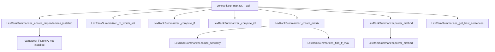

# `lex_rank.py`

## `sumy.summarizers.lex_rank.LexRankSummarizer` · *class*

## Summary:
Implements the LexRank text summarization algorithm that ranks sentences based on their similarity to other sentences in the document using a graph-based approach.

## Description:
The LexRankSummarizer is a concrete implementation of the AbstractSummarizer that applies the LexRank algorithm to generate text summaries. It computes sentence similarities using TF-IDF weighted cosine similarity and builds a transition matrix to rank sentences using a power iteration method. This approach captures semantic relationships between sentences to identify the most representative ones for summarization.

The summarizer is particularly effective for extracting key information from documents while preserving the overall structure and meaning of the original text.

## State:
- threshold (float): Minimum similarity threshold for considering sentence connections. Default is 0.1.
- epsilon (float): Convergence threshold for the power method iteration. Default is 0.1.
- _stop_words (frozenset): Set of normalized words to exclude from sentence processing. Initially empty.

## Lifecycle:
- Creation: Instantiate with optional stemmer parameter (inherited from AbstractSummarizer). The stop_words property can be set after instantiation.
- Usage: Call the instance with a document object and desired number of sentences to extract. The document must have a sentences attribute containing sentence objects with words attribute.
- Destruction: No explicit cleanup required; uses standard Python garbage collection.

## Method Map:


## Raises:
- ValueError: When NumPy is not installed, indicating that the dependency needs to be installed via 'pip install numpy'.
- ValueError: When the stemmer parameter is not callable during initialization (inherited from AbstractSummarizer).

## Example:
```python
from sumy.summarizers.lex_rank import LexRankSummarizer
from sumy.nlp.stemmers import null_stemmer

# Create summarizer instance
summarizer = LexRankSummarizer(stemmer=null_stemmer)

# Set stop words if needed
summarizer.stop_words = ["the", "and", "or"]

# Apply summarization to a document
# Assuming 'document' is a valid document object with sentences
summary = summarizer(document, 3)  # Get top 3 sentences
```

### `sumy.summarizers.lex_rank.LexRankSummarizer.stop_words` · *method*

## Summary:
Sets the stop words for the LexRank summarizer by normalizing and storing them as an immutable frozenset.

## Description:
Configures the stop words collection that will be used to filter out common words during sentence processing. This property setter normalizes each input word using the inherited `normalize_word` method and stores the result as an immutable frozenset in the `_stop_words` attribute. The normalized stop words are subsequently used in the `_to_words_set` method to exclude these words from sentence analysis.

This method is typically called during summarizer initialization or configuration to specify which words should be treated as stop words and excluded from the summarization process. The use of frozenset ensures the stop words collection is immutable and hashable, which is important for performance in the text processing pipeline.

## Args:
    words (iterable): An iterable of words (strings or other objects) to be normalized and stored as stop words. Each item will be processed by `self.normalize_word()`.

## Returns:
    None: This method does not return a value; it modifies the object's internal state.

## Raises:
    None explicitly raised by this method.

## State Changes:
    Attributes READ: None
    Attributes WRITTEN: self._stop_words - replaced with a frozenset of normalized words

## Constraints:
    Preconditions:
    - The `words` parameter must be iterable
    - Each item in `words` must be compatible with `self.normalize_word()` method
    
    Postconditions:
    - `self._stop_words` is set to a frozenset containing normalized versions of all input words
    - The frozenset is immutable and suitable for fast membership testing

## Side Effects:
    None: This method performs no I/O operations or external service calls. It only modifies internal object state.

### `sumy.summarizers.lex_rank.LexRankSummarizer.__call__` · *method*

## Summary:
Computes sentence importance scores using the LexRank algorithm and returns the highest-ranked sentences from a document.

## Description:
This method implements the LexRank text summarization algorithm by computing similarity matrices between sentences and applying a power method to determine sentence importance scores. It serves as the main entry point for performing text summarization with the LexRank approach.

The method follows these key steps:
1. Ensures NumPy dependency is installed
2. Converts sentences to word sets for processing
3. Computes term frequency metrics for each sentence
4. Calculates inverse document frequency metrics across all sentences
5. Constructs a similarity matrix based on cosine similarity
6. Applies the power method to compute stationary probabilities (sentence scores)
7. Ranks sentences by their computed scores and returns the top N sentences

This method is called during the summarization pipeline when a LexRankSummarizer instance needs to process a document and extract a summary of specified length.

## Args:
    document (Document): The input document containing sentences to summarize
    sentences_count (int): The number of top-ranked sentences to return in the summary

## Returns:
    tuple: A tuple of sentences sorted in their original order, representing the summarized content

## Raises:
    ValueError: When NumPy dependency is not installed (triggered by _ensure_dependencies_installed)

## State Changes:
    Attributes READ: 
    - self.threshold: Used in matrix creation for similarity thresholding
    - self.epsilon: Used in power method convergence criteria
    - self._stop_words: Used in word set conversion

## Constraints:
    Preconditions:
    - Document must contain at least one sentence
    - Sentences_count must be a valid integer value
    - NumPy must be installed in the environment
    
    Postconditions:
    - Returns a tuple of sentences in original order
    - Number of returned sentences equals sentences_count (or fewer if document has insufficient sentences)
    - All returned sentences are from the input document

## Side Effects:
    None: This method performs no I/O operations or external service calls

### `sumy.summarizers.lex_rank.LexRankSummarizer._ensure_dependencies_installed` · *method*

## Summary:
Validates that the NumPy dependency is available for LexRank summarization operations.

## Description:
This static method checks whether the NumPy library is properly installed and importable. It is called during the summarization process to ensure that all required dependencies are available before proceeding with computations that rely on NumPy arrays and linear algebra operations.

## Args:
    None

## Returns:
    None

## Raises:
    ValueError: When the NumPy library cannot be imported or is None, indicating a missing dependency.

## State Changes:
    None

## Constraints:
    Preconditions: The method assumes that the LexRankSummarizer class has been properly imported and that NumPy is either available or not available.
    Postconditions: If successful, the method completes without raising an exception, allowing subsequent operations to proceed assuming NumPy availability.

## Side Effects:
    None

### `sumy.summarizers.lex_rank.LexRankSummarizer._to_words_set` · *method*

## Summary:
Converts a sentence into a list of stemmed words while filtering out stop words for use in LexRank summarization.

## Description:
Processes a sentence by normalizing each word, applying stemming, and filtering out stop words to create a clean word set for similarity calculations in the LexRank algorithm. This method is a core component of the text preprocessing pipeline that prepares sentences for vector representation in the summarization process.

The method is called during the initialization phase of LexRank summarization to transform raw sentence data into normalized, stemmed tokens that can be used for computing term frequencies and similarity matrices.

## Args:
    sentence (Sentence): A sentence object containing a `words` attribute with tokenized text elements.

## Returns:
    list[str]: A list of stemmed words (as strings) from the input sentence, excluding any words found in the summarizer's stop words set.

## Raises:
    None explicitly raised, but may propagate exceptions from:
    - `self.normalize_word()` if the sentence contains unprocessable word objects
    - `self.stem_word()` if stemming fails on normalized words

## State Changes:
    Attributes READ:
    - self._stop_words: Frozen set of stop words used for filtering
    - self.normalize_word: Method for normalizing words to Unicode lowercase
    - self.stem_word: Method for reducing words to their root forms
    
    Attributes WRITTEN: None

## Constraints:
    Preconditions:
    - The sentence object must have a `words` attribute that is iterable
    - The summarizer instance must have valid `normalize_word` and `stem_word` methods
    - The summarizer instance must have a valid `_stop_words` attribute (frozenset)
    
    Postconditions:
    - Returns a list of strings representing stemmed versions of non-stop words
    - Original sentence object is not modified
    - All returned words are normalized and stemmed consistently

## Side Effects:
    None: This method has no side effects beyond reading from the summarizer instance's attributes and returning a computed list.

### `sumy.summarizers.lex_rank.LexRankSummarizer._compute_tf` · *method*

## Summary:
Computes normalized term frequency metrics for a collection of sentences by dividing each term's frequency by the maximum term frequency in that sentence.

## Description:
This private method transforms raw term counts from sentences into normalized frequency values, which are essential for the LexRank algorithm's similarity calculations. It processes each sentence's term frequencies using the maximum frequency in that sentence as a normalization factor. This method is called during the LexRank summarization process as part of the preprocessing pipeline before matrix creation.

## Args:
    self: The LexRankSummarizer instance
    sentences (list[list[str]]): A list of sentences, where each sentence is represented as a list of terms (strings).

## Returns:
    list[dict[str, float]]: A list of dictionaries, where each dictionary maps terms to their normalized frequency values (between 0 and 1) for the corresponding sentence.

## Raises:
    None explicitly raised, but may encounter issues if sentences contain unexpected data types.

## State Changes:
    Attributes READ: None
    Attributes WRITTEN: None

## Constraints:
    Preconditions: 
    - Input sentences should be lists of terms (strings)
    - Each sentence should contain at least one term (though empty sentences are handled gracefully)
    
    Postconditions:
    - Each returned dictionary contains normalized frequency values between 0 and 1
    - Empty sentences result in dictionaries with no entries (empty dicts)

## Side Effects:
    None

### `sumy.summarizers.lex_rank.LexRankSummarizer._find_tf_max` · *method*

## Summary:
Finds the maximum term frequency value from a collection of terms, returning 1 for empty collections to prevent division by zero.

## Description:
This static utility method computes the maximum term frequency from a dictionary or counter-like object containing term frequencies. It is used primarily in the term frequency normalization process within the LexRank summarization algorithm to avoid division by zero errors when normalizing term frequencies.

The method is called by `_compute_tf` during the preprocessing phase of document analysis, where term frequencies are normalized relative to the highest frequency term in each sentence.

## Args:
    terms (dict-like): A mapping of terms to their frequency counts, typically a Counter object or dictionary with numeric values.

## Returns:
    float: The maximum frequency value found in the terms collection, or 1 if the collection is empty.

## Raises:
    None explicitly raised.

## State Changes:
    None.

## Constraints:
    Preconditions:
        - The `terms` parameter should be a dictionary-like object with numeric values
        - Values in the terms collection should be non-negative numbers
    
    Postconditions:
        - Returns a positive number (1 or greater) to ensure valid normalization

## Side Effects:
    None.

### `sumy.summarizers.lex_rank.LexRankSummarizer._compute_idf` · *method*

## Summary:
Computes inverse document frequency (IDF) metrics for terms across a collection of sentences.

## Description:
Calculates IDF values for each unique term found in the provided sentences. This method is a core component of the LexRank text summarization algorithm, providing term weighting that helps identify important words in the document. The IDF metric measures how rare or common a term is across the entire corpus of sentences.

This method is called during the LexRank summarization process by the `__call__` method to prepare term frequency-inverse document frequency weights for sentence similarity calculations.

## Args:
    sentences (list[list[str]]): A list of sentences, where each sentence is represented as a list of terms (strings).

## Returns:
    dict[str, float]: A dictionary mapping each unique term to its computed IDF value as a floating-point number.

## Raises:
    None: This method does not explicitly raise exceptions under normal operation.

## State Changes:
    Attributes READ: None
    Attributes WRITTEN: None

## Constraints:
    Preconditions:
    - Input sentences must be a non-empty list
    - Each sentence must be a list of strings (terms)
    - Terms within sentences should be hashable for dictionary storage
    
    Postconditions:
    - Returns a dictionary with all unique terms from input sentences as keys
    - All IDF values are positive floating-point numbers
    - The method is deterministic and produces identical results for identical inputs

## Side Effects:
    None: This method performs no I/O operations or external service calls. It operates purely on the input data and returns a computed result.

### `sumy.summarizers.lex_rank.LexRankSummarizer._create_matrix` · *method*

## Summary:
Creates a normalized similarity matrix for sentences using cosine similarity and thresholding.

## Description:
This method constructs a transition probability matrix for the LexRank algorithm by computing pairwise cosine similarities between sentences. It applies thresholding to convert similarities to binary connections and normalizes rows to create a stochastic matrix suitable for the power method calculation.

The method is called during the LexRank summarization process as part of the sentence ranking pipeline, specifically in the `__call__` method where it prepares the matrix needed for computing sentence importance scores.

## Args:
    sentences (list[list[str]]): List of sentences represented as lists of words.
    threshold (float): Threshold value for converting similarities to binary connections. Similarities above this threshold become 1.0, others become 0.
    tf_metrics (list[dict]): Term frequency metrics for each sentence, mapping terms to their normalized frequencies.
    idf_metrics (dict): Inverse document frequency metrics for all terms in the document.

## Returns:
    numpy.ndarray: A square matrix of shape (n_sentences, n_sentences) where each row represents the probability distribution of transitions from one sentence to all other sentences.

## Raises:
    None explicitly raised.

## State Changes:
    Attributes READ: None
    Attributes WRITTEN: None

## Constraints:
    Preconditions:
        - Sentences must be non-empty
        - tf_metrics must have the same length as sentences
        - idf_metrics must contain entries for all terms in sentences
        - threshold must be a non-negative number
    Postconditions:
        - Returned matrix is square with dimensions matching the number of sentences
        - Each row sums to 1.0 (stochastic matrix property)
        - Matrix values are either 0 or 1.0 due to thresholding

## Side Effects:
    None

### `sumy.summarizers.lex_rank.LexRankSummarizer.cosine_similarity` · *method*

## Summary:
Computes a weighted cosine similarity between two sentences using TF-IDF term weights and IDF metrics.

## Description:
This function calculates a modified cosine similarity measure between two sentences by weighting term frequencies with IDF values squared. It's used in the LexRank summarization algorithm to determine sentence similarity for clustering and ranking purposes.

## Args:
    sentence1 (iterable): First sentence represented as a collection of terms/words
    sentence2 (iterable): Second sentence represented as a collection of terms/words
    tf1 (dict): Term frequency mapping for first sentence (term -> frequency)
    tf2 (dict): Term frequency mapping for second sentence (term -> frequency)
    idf_metrics (dict): Inverse Document Frequency metrics for terms (term -> IDF value)

## Returns:
    float: Cosine similarity score between 0.0 and 1.0, where 0.0 indicates no similarity and 1.0 indicates identical sentences. Returns 0.0 when either sentence has zero magnitude.

## Raises:
    None explicitly raised

## State Changes:
    None

## Constraints:
    Preconditions:
        - Both sentence1 and sentence2 should be iterable collections of terms
        - tf1, tf2, and idf_metrics should be dictionaries mapping terms to numerical values
        - All terms in sentences should exist as keys in tf1, tf2, and idf_metrics dictionaries
    
    Postconditions:
        - Returns a float value in the range [0.0, 1.0]
        - If both sentences have zero magnitude (no common terms with positive IDF), returns 0.0

## Side Effects:
    None

### `sumy.summarizers.lex_rank.LexRankSummarizer.power_method` · *method*

## Summary:
Computes the principal eigenvector of a transition matrix using the power iteration method for sentence ranking.

## Description:
Implements the power method algorithm to find the stationary distribution of a Markov chain represented by a transition matrix. This method is used in LexRank summarization to compute sentence importance scores by iteratively applying the transition matrix until convergence. The function is called by the LexRankSummarizer.__call__ method during the summarization process.

## Args:
    matrix (numpy.ndarray): Square transition matrix representing sentence similarities, where each row sums to 1.
    epsilon (float): Convergence threshold for the iterative process. Algorithm stops when the difference between successive iterations is less than epsilon.

## Returns:
    numpy.ndarray: Probability vector containing normalized sentence scores that sum to 1.0, where each element represents the importance score of a sentence.

## Raises:
    None explicitly raised, but may raise numpy-related exceptions if matrix operations fail.

## State Changes:
    None - This is a pure function that does not modify any object state.

## Constraints:
    Preconditions:
        - Matrix must be a square numpy array
        - Epsilon must be a positive float
        - Matrix rows must represent valid transition probabilities (each row should sum to 1)
    
    Postconditions:
        - Returned vector elements are non-negative
        - Elements in returned vector sum to 1.0
        - Vector length equals number of rows in input matrix

## Side Effects:
    None - This function performs only mathematical computations and does not cause any I/O operations or external service calls.

