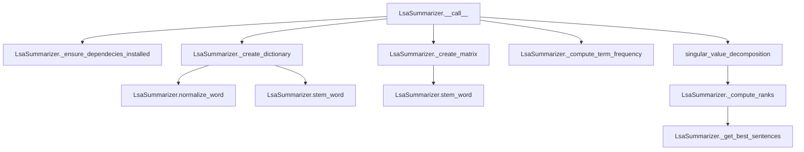

# `lsa.py`

## `sumy.summarizers.lsa.LsaSummarizer` · *class*

## Summary:
LSA (Latent Semantic Analysis) summarizer that reduces text to its semantic structure using singular value decomposition.

## Description:
The LsaSummarizer implements a text summarization technique based on Latent Semantic Analysis. It constructs a term-document matrix, applies TF-IDF weighting, performs singular value decomposition, and ranks sentences based on their contribution to the dominant semantic components.

This summarizer is particularly effective for extracting meaningful summaries from documents with complex semantic relationships, as it captures latent topics rather than just surface-level keyword matching.

## State:
- _stop_words: frozenset of normalized and stemmed words to exclude from analysis
- MIN_DIMENSIONS: int constant (default 3) defining minimum number of dimensions for SVD
- REDUCTION_RATIO: float constant (default 1.0) controlling dimensionality reduction
- _stemmer: inherited from AbstractSummarizer, used for word stemming operations

## Lifecycle:
- Creation: Instantiate with optional stemmer parameter (inherits from AbstractSummarizer)
- Usage: Call instance with document and desired sentence count to summarize
- Destruction: Uses standard Python garbage collection

## Method Map:


## Raises:
- ValueError: When NumPy dependency is not installed
- AssertionError: In _compute_term_frequency when smooth parameter is out of bounds [0.0, 1.0)
- AssertionError: In _compute_ranks when sigma and v_matrix dimensions don't match

## Example:
```python
from sumy.summarizers.lsa import LsaSummarizer
from sumy.parsers.plaintext import PlaintextParser
from sumy.nlp.tokenizers import Tokenizer

# Create parser and summarizer
parser = PlaintextParser.from_file("document.txt", Tokenizer("english"))
summarizer = LsaSummarizer()

# Set stop words if needed
summarizer.stop_words = ["the", "and", "or"]

# Generate summary
summary = summarizer(parser.document, sentences_count=3)
for sentence in summary:
    print(sentence)
```

### `sumy.summarizers.lsa.LsaSummarizer.stop_words` · *method*

## Summary:
Sets the stop words for the LSA summarizer by normalizing and storing them as an immutable frozenset.

## Description:
Configures the set of stop words that will be excluded from text processing during summarization. This method normalizes each input word using the inherited `normalize_word` method before storing them as a frozenset in the `_stop_words` attribute. Stop words are used during dictionary creation to filter out common words that don't contribute meaningful information to the summarization process.

The method is designed as a property setter for the `stop_words` property, allowing users to configure which words should be ignored during text analysis. This configuration affects subsequent summarization operations by preventing these words from being included in the term-document matrix.

## Args:
    words (Iterable[str]): An iterable of words to be treated as stop words. These can be strings or other objects convertible to Unicode strings.

## Returns:
    None: This method does not return a value.

## Raises:
    None: This method does not explicitly raise exceptions, though underlying calls to `normalize_word` may raise exceptions if words cannot be converted to Unicode strings.

## State Changes:
    Attributes READ: None
    Attributes WRITTEN: `self._stop_words` is updated to store the frozenset of normalized stop words

## Constraints:
    Preconditions:
    - Input `words` should be iterable containing objects that can be processed by `normalize_word`
    - The `normalize_word` method must be available (inherited from `AbstractSummarizer`)
    
    Postconditions:
    - `self._stop_words` is updated to a frozenset containing normalized versions of all input words
    - All words in the input are converted to lowercase Unicode strings via `normalize_word`
    - The resulting frozenset is immutable and suitable for fast membership testing

## Side Effects:
    None: This method performs no I/O operations or external service calls. It only modifies the internal state of the object.

### `sumy.summarizers.lsa.LsaSummarizer.__call__` · *method*

## Summary:
Performs Latent Semantic Analysis (LSA) based text summarization by computing sentence rankings using SVD decomposition and returning the highest-ranked sentences.

## Description:
This method implements the core LSA summarization algorithm by constructing a term-document matrix, applying term frequency normalization, performing singular value decomposition, computing sentence ranks based on the decomposed matrices, and finally selecting the top-ranked sentences. It serves as the main entry point for the LSA summarization process and is called during the summarization pipeline when a document needs to be summarized to a specific number of sentences.

The method orchestrates the complete LSA workflow: dictionary creation, matrix construction, term frequency computation, SVD decomposition, rank calculation, and sentence selection. It's designed as a callable interface that follows the AbstractSummarizer contract, making it part of the standard summarization pipeline where documents are processed through various algorithms.

This method is typically invoked by the summarization framework when a user requests a summary of a document with a specific sentence count. It's particularly useful for extracting key information from long documents by identifying semantically similar sentences and ranking them based on their importance in the overall document space.

## Args:
    document (Document): The input document object containing sentences to summarize
    sentences_count (int): The desired number of sentences to include in the summary, must be non-negative

## Returns:
    tuple: A tuple of sentences sorted in their original order, representing the most important sentences from the document according to LSA ranking. Returns an empty tuple when the document contains no words or when dictionary creation fails.

## Raises:
    ValueError: If required NumPy dependency is not installed
    AssertionError: If matrix dimensions don't match during rank computation

## State Changes:
    Attributes READ: None
    Attributes WRITTEN: None

## Constraints:
    Preconditions:
        - Document must contain at least one sentence
        - Sentences_count must be a non-negative integer
        - NumPy must be available for SVD computation
        - Dictionary creation must succeed (non-empty result)
        
    Postconditions:
        - Returns a tuple of sentences in original order
        - Number of returned sentences equals sentences_count (or fewer if document has insufficient sentences)
        - All returned sentences are from the input document
        - Empty tuple is returned when no meaningful dictionary can be created

## Side Effects:
    None: This method performs no I/O operations or external service calls

### `sumy.summarizers.lsa.LsaSummarizer._ensure_dependecies_installed` · *method*

## Summary:
Validates that the NumPy dependency is available for Latent Semantic Analysis (LSA) summarization.

## Description:
This method performs a runtime check to ensure that the NumPy library is properly installed and available. It's called at the beginning of the LSA summarization process to prevent runtime errors when the algorithm attempts to use NumPy functions for matrix operations and singular value decomposition.

The method is invoked as part of the LSA summarization pipeline within the `__call__` method, ensuring that all required dependencies are present before proceeding with computationally intensive operations like matrix creation and SVD decomposition.

## Args:
    None

## Returns:
    None

## Raises:
    ValueError: When NumPy is not available (numpy is None), indicating that the LSA summarizer cannot function without this dependency.

## State Changes:
    Attributes READ: None
    Attributes WRITTEN: None

## Constraints:
    Preconditions:
        - This method should be called before any NumPy-dependent operations in the LSA algorithm
        - The method assumes that if NumPy is available, it will be properly imported and functional
        
    Postconditions:
        - Execution continues only if NumPy is available
        - No state changes occur on the LsaSummarizer instance

## Side Effects:
    None: This method performs no I/O operations or external service calls. It only performs a conditional check and raises an exception if the dependency is missing.

### `sumy.summarizers.lsa.LsaSummarizer._create_dictionary` · *method*

## Summary:
Creates a mapping from stemmed words to sequential integer indices for use in LSA matrix construction.

## Description:
Builds a vocabulary dictionary by processing all words in a document, normalizing and stemming them, then filtering out stop words and duplicates. This dictionary serves as the basis for creating the term-document matrix in Latent Semantic Analysis (LSA) summarization.

The method is called during the summarization pipeline as part of the preprocessing phase before matrix creation. It ensures that each unique stemmed word gets a consistent numerical index for mathematical operations in the LSA algorithm.

## Args:
    document (Document): A document object containing a .words attribute with all words to process

## Returns:
    dict[str, int]: Dictionary mapping stemmed words to sequential integer indices starting from 0

## Raises:
    None explicitly raised

## State Changes:
    Attributes READ: 
    - self._stop_words: Set of stop words to filter out
    - self.normalize_word: Method for normalizing words to Unicode lowercase
    - self.stem_word: Method for reducing words to their root forms
    
    Attributes WRITTEN: None

## Constraints:
    Preconditions:
    - Document must have a .words attribute containing iterable words
    - Words must be convertible to Unicode strings
    - self._stop_words must be a set-like object containing normalized stop words
    
    Postconditions:
    - Returns a dictionary with unique stemmed words as keys and sequential integers as values
    - Stop words are excluded from the dictionary
    - Duplicate stemmed words are excluded from the dictionary
    - Dictionary indices start from 0 and increment sequentially

## Side Effects:
    None

### `sumy.summarizers.lsa.LsaSummarizer._create_matrix` · *method*

## Summary:
Creates a term-sentence matrix representation of document sentences for Latent Semantic Analysis (LSA) processing.

## Description:
Constructs a numerical matrix where rows correspond to unique words in the dictionary and columns correspond to sentences in the document. Each cell contains the frequency count of a word in a specific sentence. This matrix serves as the input for Singular Value Decomposition (SVD) in the LSA summarization algorithm.

The method performs word stemming using the inherited `stem_word` method to normalize words before counting their occurrences. It also issues a warning when the number of words in the dictionary is less than the number of sentences, which may affect LSA performance.

This method is separated from the main summarization pipeline to encapsulate the matrix creation logic, making the LSA algorithm implementation cleaner and more modular.

## Args:
    document (Document): The document object containing sentences to process
    dictionary (dict): Mapping of stemmed words to row indices in the resulting matrix

## Returns:
    numpy.ndarray: A 2D matrix of shape (word_count, sentence_count) where each element represents the frequency of a word in a sentence

## Raises:
    None explicitly raised, but issues a warning via Python's warnings module when words_count < sentences_count

## State Changes:
    Attributes READ: 
    - self.stem_word (method used for word normalization)
    Attributes WRITTEN: None

## Constraints:
    Preconditions:
    - The dictionary must contain mappings for all words that appear in the document sentences
    - The document must have at least one sentence
    - The dictionary must not be empty
    
    Postconditions:
    - The returned matrix has dimensions (len(dictionary), len(document.sentences))
    - All word counts in the matrix are non-negative integers

## Side Effects:
    Issues a warning via Python's warnings.warn() when the number of words in the dictionary is less than the number of sentences in the document

### `sumy.summarizers.lsa.LsaSummarizer._compute_term_frequency` · *method*

## Summary:
Normalizes term frequencies in a matrix using max frequency scaling with smoothing to prepare document-term data for LSA decomposition.

## Description:
This method applies term frequency normalization to a document-term matrix by scaling each term frequency by the maximum frequency observed for that term across all documents. The normalization uses a smoothing factor to avoid zero values and ensure numerical stability in subsequent SVD operations. This is a crucial preprocessing step in the LSA (Latent Semantic Analysis) summarization algorithm.

The method is called during the LSA summarization pipeline as part of the preprocessing phase, immediately after creating the document-term matrix and before performing singular value decomposition.

## Args:
    matrix (numpy.ndarray): A 2D array representing the document-term matrix where rows correspond to terms and columns to documents.
    smooth (float): Smoothing factor for frequency normalization, must be between 0.0 and 1.0 (exclusive of 1.0). Defaults to 0.4.

## Returns:
    numpy.ndarray: The normalized matrix with term frequencies scaled using max frequency normalization and smoothing.

## Raises:
    AssertionError: When the smooth parameter is outside the valid range [0.0, 1.0).

## State Changes:
    Attributes READ: None
    Attributes WRITTEN: None

## Constraints:
    Preconditions:
        - The matrix parameter must be a valid 2D numpy array
        - The smooth parameter must satisfy 0.0 <= smooth < 1.0
    Postconditions:
        - All values in the returned matrix are scaled between smooth and 1.0
        - The matrix shape remains unchanged
        - Zero frequency entries remain zero (no smoothing applied)

## Side Effects:
    None

### `sumy.summarizers.lsa.LsaSummarizer._compute_ranks` · *method*

## Summary:
Computes sentence ranks from singular value decomposition results for LSA-based text summarization.

## Description:
Performs dimensionality reduction on singular values and calculates rank scores for each sentence based on their representation in the reduced latent semantic space. This method is a core component of the Latent Semantic Analysis (LSA) summarization algorithm, transforming the SVD output into meaningful sentence importance scores.

The method applies truncation to the singular values based on MIN_DIMENSIONS and REDUCTION_RATIO constants, then computes Euclidean norms for each column vector in the right singular vectors matrix to determine sentence relevance scores.

This logic is separated into its own method because it encapsulates the mathematical transformation from SVD results to sentence rankings, making the main summarization pipeline cleaner and more modular.

## Args:
    sigma (tuple[float]): Singular values from SVD decomposition, ordered from largest to smallest
    v_matrix (numpy.ndarray): Right singular vectors matrix from SVD decomposition, shape (n, m) where n is the number of features and m is the number of sentences

## Returns:
    list[float]: Rank scores for each sentence, representing their importance in the document according to LSA semantics

## Raises:
    AssertionError: When the length of sigma does not match the number of rows in v_matrix, indicating incompatible matrix dimensions

## State Changes:
    Attributes READ: None
    Attributes WRITTEN: None

## Constraints:
    Preconditions:
        - sigma must be a tuple of positive floating-point numbers
        - v_matrix must be a numpy array with compatible dimensions to sigma
        - The number of elements in sigma must equal the number of rows in v_matrix
    Postconditions:
        - Returns a list of rank scores with the same length as the number of columns in v_matrix
        - All returned rank scores are non-negative real numbers

## Side Effects:
    None

