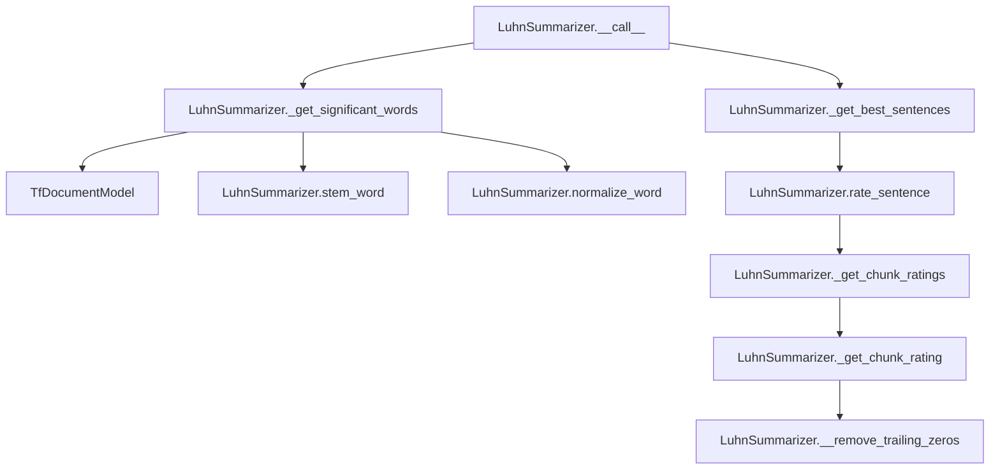

# `luhn.py`

## `sumy.summarizers.luhn.LuhnSummarizer` · *class*

## Summary:
Implements the Luhn summarization algorithm, a frequency-based approach that identifies important sentences by analyzing word frequencies and their distribution within sentences.

## Description:
The LuhnSummarizer is a concrete implementation of the AbstractSummarizer that applies the Luhn algorithm for text summarization. It identifies significant words based on term frequency and then rates sentences based on how many significant words they contain, with emphasis on the concentration of these words within contiguous chunks.

This summarizer is particularly effective for extracting key information from documents by focusing on the most frequently occurring meaningful words and their contextual distribution within sentences. It's commonly used in information retrieval and text summarization applications where frequency-based importance is a strong indicator of relevance.

## State:
- max_gap_size: int, default value 4; controls the maximum number of consecutive non-significant words that can appear before ending a chunk
- significant_percentage: int, default value 1; determines what percentage of words should be considered significant (1 = 100%)
- _stop_words: frozenset, default empty; contains normalized and stemmed stop words to exclude from significance calculation
- _stemmer: inherited from AbstractSummarizer; callable object for reducing words to their root forms
- _normalize_word: inherited from AbstractSummarizer; function for normalizing words to lowercase Unicode

## Lifecycle:
- Creation: Instantiate with optional stemmer parameter (inherits from AbstractSummarizer)
- Usage: Call the instance with a document object and desired number of sentences to extract
- Destruction: No explicit cleanup required; uses standard Python garbage collection

## Method Map:


## Raises:
- ValueError: When the stemmer parameter is not callable during initialization (inherited from AbstractSummarizer)
- AssertionError: In _get_chunk_rating when chunk length is zero (ensures robustness)

## Example:
```python
from sumy.summarizers.luhn import LuhnSummarizer
from sumy.parsers.plaintext import PlaintextParser
from sumy.nlp.tokenizers import Tokenizer

# Create summarizer with default stemmer
summarizer = LuhnSummarizer()

# Set custom stop words if needed
summarizer.stop_words = ['the', 'and', 'or']

# Parse document
parser = PlaintextParser.from_file("document.txt", Tokenizer("english"))
document = parser.document

# Generate summary with 3 sentences
summary = summarizer(document, 3)
for sentence in summary:
    print(sentence)
```

### `sumy.summarizers.luhn.LuhnSummarizer.stop_words` · *method*

## Summary:
Sets the stop words collection for the summarizer by normalizing and storing the provided words in an immutable frozenset.

## Description:
Configures the stop words that will be excluded from text analysis during the summarization process. This setter method normalizes each input word using the inherited `normalize_word` method before storing them in an immutable frozenset for efficient lookup.

The stop words are used in the `_get_significant_words` method to filter out common words that don't contribute significantly to the document's meaning, improving the quality of extracted sentences.

## Args:
    words (iterable): An iterable of words (strings or objects convertible to strings) to be treated as stop words.

## Returns:
    None: This method does not return a value.

## Raises:
    None: This method does not explicitly raise exceptions, though underlying operations may raise exceptions from `normalize_word`.

## State Changes:
    Attributes READ: None
    Attributes WRITTEN: `self._stop_words` is updated to store the normalized stop words as a frozenset

## Constraints:
    Preconditions:
    - The `words` parameter must be iterable
    - Each item in `words` must be convertible to a Unicode string by `normalize_word`
    
    Postconditions:
    - `self._stop_words` contains a frozenset of normalized versions of the input words
    - All words are converted to lowercase Unicode strings via `normalize_word`
    - The resulting frozenset is immutable and suitable for fast membership testing

## Side Effects:
    None: This method performs no I/O operations or external service calls. It only modifies the internal state of the object.

### `sumy.summarizers.luhn.LuhnSummarizer.__call__` · *method*

## Summary:
Processes a document to extract the most important sentences based on Luhn's frequency-based summarization algorithm, returning a summary of the specified length.

## Description:
This method implements Luhn's classic text summarization approach by first identifying significant words based on term frequency and then ranking sentences based on their overlap with these significant words. It serves as the primary interface for applying the Luhn summarization algorithm to a document.

The method follows the standard Luhn algorithm workflow: it identifies important terms using frequency analysis, rates sentences based on significant word overlap, and selects the top-ranked sentences while preserving their original order.

## Args:
    document (Document): The input document containing sentences to summarize
    sentences_count (int): The number of sentences to include in the final summary

## Returns:
    tuple: A tuple of sentences from the original document, ordered as they appeared, containing the most important sentences according to Luhn's algorithm

## Raises:
    None: This method does not explicitly raise exceptions, though underlying methods may raise exceptions

## State Changes:
    Attributes READ:
    - self._stop_words: Used to filter out stop words when identifying significant words
    - self.significant_percentage: Used to determine how many words to consider as significant
    - self.max_gap_size: Used in chunk rating calculations
    - self._stemmer: Used for stemming words during processing
    - self._get_significant_words: Method used to identify important terms
    - self._get_best_sentences: Method used to select top sentences
    - self.rate_sentence: Method used to rate sentences
    - self.normalize_word: Method used to normalize words
    - self.stem_word: Method used to stem words

## Constraints:
    Preconditions:
    - document must be a valid Document object with sentences and words attributes
    - sentences_count must be a positive integer representing the desired number of sentences
    - The document should contain at least one sentence for meaningful summarization

    Postconditions:
    - Returns exactly sentences_count sentences (or fewer if document has insufficient sentences)
    - Sentences are returned in their original order from the document
    - All returned sentences are from the input document

## Side Effects:
    None: This method performs no I/O operations or external service calls. It operates purely on the input document and internal state.

### `sumy.summarizers.luhn.LuhnSummarizer._get_significant_words` · *method*

## Summary:
Extracts significant words from a collection by normalizing, stemming, filtering stop words, and selecting high-frequency terms that appear more than once.

## Description:
Processes a collection of words through multiple text preprocessing stages to identify the most significant terms for summarization purposes. This method serves as a core component in the Luhn summarization algorithm by filtering out noise words and selecting terms that are both frequent and meaningful within the document context.

The method is called during the summarization pipeline when preparing words for sentence rating calculations. It's separated from the main summarization logic to provide clean, reusable text processing functionality that can be tested independently.

## Args:
    words (iterable): Collection of words to process, typically from document.text.split() or similar tokenization.

## Returns:
    tuple[str]: A tuple of significant words that meet the criteria of being frequent (based on significant_percentage) and appearing more than once in the document.

## Raises:
    None explicitly raised.

## State Changes:
    Attributes READ: 
    - self.normalize_word: Used for word normalization
    - self.stem_word: Used for word stemming
    - self._stop_words: Used for stop word filtering
    - self.significant_percentage: Used to calculate number of significant terms to select
    
    Attributes WRITTEN: None

## Constraints:
    Preconditions:
    - The LuhnSummarizer instance must be properly initialized with required attributes
    - Words parameter must be iterable and contain valid word representations
    - self.significant_percentage must be a numeric value between 0 and 1
    
    Postconditions:
    - Returns a tuple of strings representing significant words
    - All returned words are normalized, stemmed, and filtered from stop words
    - Returned words have frequency > 1 in the document
    - Returned words are among the most frequent terms in the document

## Side Effects:
    None

### `sumy.summarizers.luhn.LuhnSummarizer.rate_sentence` · *method*

## Summary:
Computes the significance rating of a sentence by evaluating its most important word chunks for Luhn summarization.

## Description:
Rates a sentence based on the Luhn summarization algorithm by analyzing word chunks and returning the highest significance score among them. This method is a core component of the Luhn summarization approach, where sentence quality is determined by the most significant contiguous sequences of important words.

The method is called internally by the summarization pipeline during sentence scoring, specifically by `_get_best_sentences` when selecting the most important sentences. It processes the sentence to identify significant word chunks and computes their relative importance scores.

## Args:
    sentence (Sentence): A sentence object containing words to be analyzed for significance
    significant_stems (set): A set of word stems considered significant for summarization purposes

## Returns:
    float: The maximum significance rating among all word chunks in the sentence, or 0 if no chunks are identified. Ratings are non-negative floating-point values representing chunk importance.

## Raises:
    None explicitly raised by this method

## State Changes:
    Attributes READ: 
    - self._get_chunk_ratings: Method used to compute chunk significance ratings
    - self.max_gap_size: Controls chunk detection by defining maximum gap size between significant words
    
    Attributes WRITTEN: None

## Constraints:
    Preconditions:
    - The sentence parameter must be a valid Sentence object with a words attribute
    - The significant_stems parameter must be a set-like object containing word stems
    - Words in the sentence should be processable by the stemmer
    
    Postconditions:
    - Returns a non-negative float value representing the sentence's significance
    - Empty sentences or sentences with no significant chunks return 0
    - The returned value represents the maximum chunk significance in the sentence

## Side Effects:
    None: This method performs no I/O operations or external service calls. It only processes internal data structures.

### `sumy.summarizers.luhn.LuhnSummarizer._get_chunk_ratings` · *method*

## Summary:
Identifies and rates significant word chunks within a sentence for Luhn summarization.

## Description:
Processes a sentence to detect contiguous sequences of significant words (chunks) separated by gaps of insignificant words. The method groups consecutive significant words into chunks and assigns each chunk a normalized significance rating based on the proportion of significant words within that chunk. This method is a core component of the Luhn summarization algorithm, where sentence quality is determined by evaluating the most significant chunks within each sentence.

This method is called by `rate_sentence` during the sentence scoring phase of the summarization process. It's designed as a separate method to encapsulate the chunk detection and rating logic, making the sentence rating process cleaner and more modular.

## Args:
    sentence (Sentence): A sentence object containing words to be analyzed for significant chunks
    significant_stems (set): A set of word stems considered significant for summarization purposes

## Returns:
    tuple[float]: A tuple of floating-point ratings, one for each detected chunk in the sentence. Each rating represents the normalized significance of that chunk, with higher values indicating more important chunks.

## Raises:
    None explicitly raised by this method

## State Changes:
    Attributes READ: 
    - self.max_gap_size: Controls the maximum number of consecutive insignificant words that can break a chunk
    - self.stem_word: Method used to normalize words to their stem forms for comparison with significant_stems
    
    Attributes WRITTEN: None

## Constraints:
    Preconditions:
    - The sentence parameter must be a valid Sentence object with a words attribute
    - The significant_stems parameter must be a set-like object containing word stems
    - Words in the sentence should be processable by self.stem_word method
    
    Postconditions:
    - Returns a tuple of chunk ratings, each being a non-negative float
    - Empty sentences return an empty tuple
    - Each chunk rating is computed using the _get_chunk_rating method

## Side Effects:
    None: This method performs no I/O operations or external service calls. It only processes internal data structures.

### `sumy.summarizers.luhn.LuhnSummarizer._get_chunk_rating` · *method*

## Summary:
Calculates a normalized significance rating for a text chunk based on the proportion of significant words.

## Description:
This private method computes a numerical rating for a text chunk in the Luhn summarization algorithm. It processes a chunk of word significance indicators (0s and 1s) by removing trailing insignificant words, then applies a mathematical formula to determine the chunk's relative importance. The method is specifically designed for use within the sentence rating process of the Luhn summarization technique.

The method is called by `_get_chunk_ratings` during the sentence scoring phase, where text chunks are evaluated for their significance in contributing to the overall document summary.

## Args:
    chunk (list[int]): A list of integers (0 or 1) representing word significance within a text chunk, where 1 indicates a significant word and 0 indicates an insignificant word.

## Returns:
    float: The calculated chunk rating, which represents the normalized significance of the chunk. Returns 0 when there is exactly one significant word, otherwise returns the square of significant words divided by total words.

## Raises:
    AssertionError: When the processed chunk has zero length after removing trailing zeros, indicating an invalid input chunk.

## State Changes:
    Attributes READ: None
    Attributes WRITTEN: None

## Constraints:
    Preconditions:
    - Input chunk must contain at least one significant word after processing (after removing trailing zeros)
    - Chunk elements must be integers (0 or 1)
    
    Postconditions:
    - Returned value is always non-negative
    - If chunk contains only one significant word, returns 0
    - Otherwise, returns a positive value calculated as (significant_words² / total_words)

## Side Effects:
    None

### `sumy.summarizers.luhn.LuhnSummarizer.__remove_trailing_zeros` · *method*

## Summary:
Removes trailing zero elements from a collection to prepare chunk data for rating calculations.

## Description:
This private method removes trailing zeros from a collection, typically used to clean up word significance chunks before computing sentence ratings in the Luhn summarization algorithm. It ensures that trailing insignificant words (represented as zeros) don't affect the calculation of chunk ratings.

The method is called internally by `_get_chunk_rating` during the sentence scoring process in the Luhn summarization algorithm.

## Args:
    collection (list or iterable): A sequence containing numeric values, typically 0s and 1s representing word significance (0 = insignificant, 1 = significant).

## Returns:
    list: A new list with trailing zeros removed. If the input contains only zeros, returns an empty list.

## Raises:
    None explicitly raised.

## State Changes:
    Attributes READ: None
    Attributes WRITTEN: None

## Constraints:
    Preconditions: 
    - Input collection should be iterable
    - The method assumes numeric values (0s and 1s) in the collection
    
    Postconditions:
    - Returned collection will not have trailing zeros
    - Returned collection will be shorter than or equal to the input collection
    - If input is all zeros, returned collection will be empty

## Side Effects:
    None

