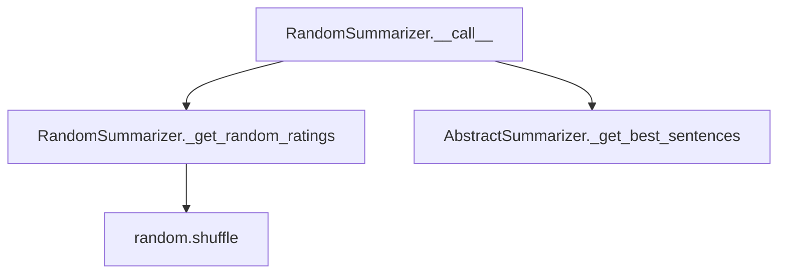

# `random.py`

## `sumy.summarizers.random.RandomSummarizer` · *class*

## Summary:
RandomSummarizer is a text summarization algorithm that randomly ranks sentences and selects the top-ranked ones to form a summary.

## Description:
The RandomSummarizer implements a stochastic text summarization approach where sentences are assigned random scores and then selected based on these scores. This creates a randomized summary that varies each time the algorithm is run with the same input document. The class inherits from AbstractSummarizer and implements the required __call__ method to provide a consistent interface for text summarization.

This summarizer is useful when a completely random but representative summary is desired, or when comparing different summarization approaches. It demonstrates how simple randomization can be applied to the general summarization framework.

## State:
- Inherits all state from AbstractSummarizer including _stemmer attribute
- No additional instance attributes beyond what's inherited

## Lifecycle:
- Creation: Instantiate with optional stemmer parameter (defaults to null_stemmer from parent class)
- Usage: Call the instance with a document and desired number of sentences to extract
- Destruction: Standard Python garbage collection

## Method Map:


## Raises:
- Inherited from AbstractSummarizer: ValueError when stemmer parameter is not callable during initialization

## Example:
```python
from sumy.summarizers.random import RandomSummarizer
from sumy.nlp.stemmers import null_stemmer

# Create summarizer instance
summarizer = RandomSummarizer(stemmer=null_stemmer)

# Apply to a document (assuming document is properly constructed)
# summary = summarizer(document, 3)  # Get 3-sentence summary
```

### `sumy.summarizers.random.RandomSummarizer.__call__` · *method*

## Summary:
Selects a random subset of sentences from a document based on randomized ratings.

## Description:
This method implements the core summarization logic for the RandomSummarizer. It extracts all sentences from the input document, assigns each a random rating, and then selects the specified number of highest-rated sentences in their original order. This approach creates a randomized summary that varies each time it's run.

The method serves as the primary interface for the random summarization algorithm and follows the standard AbstractSummarizer protocol by accepting a document and desired sentence count.

## Args:
    document (Document): The input document containing sentences to summarize
    sentences_count (int): The number of sentences to include in the final summary

## Returns:
    tuple: A tuple of sentences sorted in their original order, representing the randomly selected summary

## Raises:
    None: This method does not explicitly raise exceptions, though underlying methods may raise exceptions

## State Changes:
    Attributes READ: None - this method only reads from the document parameter
    Attributes WRITTEN: None - this method does not modify any instance attributes

## Constraints:
    Preconditions:
        - document must be a valid Document object with a sentences attribute
        - sentences_count must be a non-negative integer
        - document.sentences must be iterable
    
    Postconditions:
        - Returns exactly sentences_count sentences (or fewer if document has fewer sentences)
        - Sentences are returned in their original order from the document
        - All returned sentences are from the input document

## Side Effects:
    None: This method performs no I/O operations or external service calls

### `sumy.summarizers.random.RandomSummarizer._get_random_ratings` · *method*

## Summary:
Generates a random rating for each sentence by shuffling integer indices and mapping them to sentences.

## Description:
Creates a randomized ranking of sentences by generating sequential integer indices, shuffling them randomly, and pairing each sentence with a random integer index. This provides a uniform random distribution of ratings for sentence selection in the random summarization algorithm.

The method is called during the summarization process to assign random weights to sentences before selecting the best ones based on these ratings. This approach ensures that sentences are selected in a random order rather than based on any linguistic features, making it a truly random summarization technique.

## Args:
    sentences (list): A list of sentence objects to be rated

## Returns:
    dict: A dictionary mapping each sentence object to a random integer rating (0 to len(sentences)-1)

## Raises:
    None explicitly raised

## State Changes:
    Attributes READ: None
    Attributes WRITTEN: None

## Constraints:
    Preconditions:
        - Input sentences list must be iterable
        - Each item in sentences should be hashable (sentence objects)
        - Input sentences list should not be empty for meaningful results
    Postconditions:
        - Return dictionary contains exactly one entry per sentence
        - Ratings are integers in range [0, len(sentences)-1]
        - All ratings are unique and uniformly distributed
        - The mapping preserves the original sentence objects as keys

## Side Effects:
    None

