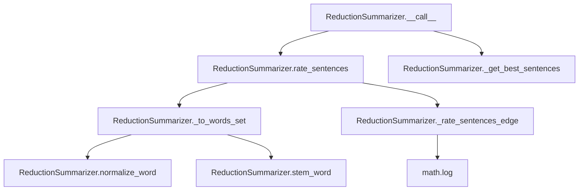

# `reduction.py`

## `sumy.summarizers.reduction.ReductionSummarizer` · *class*

## Summary:
ReductionSummarizer implements a text summarization algorithm that rates sentences based on their similarity to other sentences in the document using a reduction-based approach.

## Description:
The ReductionSummarizer is a concrete implementation of the AbstractSummarizer that performs text summarization by calculating similarity scores between sentences. It works by comparing each pair of sentences and computing a similarity score based on shared words, then aggregates these scores to determine the importance of each sentence. This approach emphasizes redundancy reduction and content overlap between sentences.

This summarizer is particularly useful when the goal is to create concise summaries that capture the main ideas expressed across different sentences in a document, focusing on sentences that contribute unique information or represent key concepts.

## State:
- _stop_words: frozenset of normalized and stemmed words that should be excluded from sentence analysis
  - Type: frozenset of strings
  - Valid values: Set of normalized words (after stemming and normalization)
  - Invariant: Once set, the stop words remain constant throughout the object's lifetime
- _stemmer: callable object used for stemming words (inherited from AbstractSummarizer)
  - Type: callable
  - Valid values: Any callable that accepts a string and returns a string
  - Invariant: Set during initialization and remains unchanged

## Lifecycle:
- Creation: Instantiate with optional stemmer parameter (inherits from AbstractSummarizer)
- Usage: Call the instance with a document object and desired number of sentences to extract
- Destruction: Standard Python garbage collection

## Method Map:


## Raises:
- ValueError: When the stemmer parameter is not callable during initialization (inherited from AbstractSummarizer)
- AssertionError: When _rate_sentences_edge is called with empty word lists (internal assertion)

## Example:
```python
from sumy.summarizers.reduction import ReductionSummarizer
from sumy.nlp.stemmers import null_stemmer

# Create summarizer instance
summarizer = ReductionSummarizer(stemmer=null_stemmer)

# Set custom stop words if needed
summarizer.stop_words = ['the', 'and', 'or']

# Apply summarization to a document
# Assuming 'document' is a valid document object with sentences
summary = summarizer(document, 3)  # Get top 3 sentences
```

### `sumy.summarizers.reduction.ReductionSummarizer.stop_words` · *method*

## Summary:
Sets the stop words collection for the summarizer by normalizing and storing the provided words as an immutable frozen set.

## Description:
Configures the stop words that will be excluded from text processing during summarization. This setter method normalizes each input word using the inherited `normalize_word` method to ensure consistent text processing, then stores them as an immutable frozenset in the instance variable `_stop_words`. The method is typically called during summarizer initialization or configuration to define which words should be ignored during sentence scoring and word frequency calculations.

This logic is encapsulated in its own method rather than being inlined because:
- It provides a clean interface for setting stop words
- It ensures consistent normalization of words before storage
- It maintains immutability of the stop words collection via frozenset
- It allows for easy replacement or extension of stop word handling logic

## Args:
    words (iterable): An iterable of words (strings or objects convertible to strings) that should be treated as stop words and excluded from summarization processing.

## Returns:
    None

## Raises:
    None

## State Changes:
    Attributes READ: None
    Attributes WRITTEN: self._stop_words

## Constraints:
    Preconditions:
    - Input `words` must be iterable
    - Each item in `words` must be convertible to a Unicode string by `normalize_word`
    
    Postconditions:
    - `self._stop_words` is updated to a frozenset containing normalized versions of all input words
    - The frozenset ensures the stop words collection is immutable after assignment

## Side Effects:
    None

### `sumy.summarizers.reduction.ReductionSummarizer.__call__` · *method*

## Summary:
Executes the reduction-based text summarization algorithm by rating sentences and selecting the most relevant ones.

## Description:
This method implements the core summarization workflow for the ReductionSummarizer class. It computes relevance scores for all sentences in the document using a reduction-based sentence rating algorithm that measures similarity between sentences, then selects the top-rated sentences based on the requested count and returns them in their original order.

The method serves as the main entry point for the summarization process, orchestrating the sentence rating and selection phases. It's designed to be called on summarizer instances with a document and desired sentence count, making it the primary interface for generating text summaries using the reduction algorithm.

This method overrides the abstract __call__ method from AbstractSummarizer and provides the concrete implementation for reduction-based text summarization. It leverages the parent class's _get_best_sentences utility to handle the selection logic, ensuring consistent behavior across different summarization approaches.

## Args:
    document: The document object containing sentences to summarize
    sentences_count: The number of sentences to include in the final summary (can be integer, percentage string, or callable)

## Returns:
    tuple: A tuple of sentences sorted in their original order, containing the top-rated sentences according to the reduction-based scoring algorithm

## Raises:
    None explicitly raised by this method

## State Changes:
    Attributes READ:
    - self._stop_words: Used in _to_words_set to filter out stop words during sentence processing
    - self._stemmer: Used in _to_words_set to stem words during sentence processing
    - self._normalize_word: Used in _to_words_set to normalize words during sentence processing
    
    Attributes WRITTEN: None

## Constraints:
    Preconditions:
    - document must be a valid Document object with sentences property
    - sentences_count must be a valid value for ItemsCount (int, float, or string representation)
    - The summarizer instance must have a properly initialized stemmer and stop_words
    
    Postconditions:
    - Returns a tuple of sentences in their original order
    - Number of returned sentences matches the selection criteria
    - All returned sentences are from the input document

## Side Effects:
    None: This method performs no I/O operations or external service calls. It operates purely on the input document and internal state.

### `sumy.summarizers.reduction.ReductionSummarizer.rate_sentences` · *method*

## Summary:
Rates sentences in a document based on their pairwise similarity to other sentences in the document.

## Description:
Computes similarity scores for each sentence by comparing it with all other sentences in the document. This method implements a reduction-based approach where each sentence's rating is accumulated from its similarity scores with all other sentences. The resulting ratings can be used to identify the most representative sentences for summarization.

This method is called during the sentence scoring phase of the reduction-based summarization algorithm, specifically by the `__call__` method which uses these ratings to select the best sentences.

## Args:
    document (Document): A document object containing a `sentences` attribute that provides access to the individual sentences in the document.

## Returns:
    defaultdict[float]: A mapping from each sentence in the document to its accumulated similarity score. Scores are floating-point values representing how similar each sentence is to other sentences in the document.

## Raises:
    None explicitly raised by this method.

## State Changes:
    Attributes READ:
    - self._to_words_set: Called to convert sentences to word sets for comparison
    - self._rate_sentences_edge: Called to compute similarity between sentence pairs
    
    Attributes WRITTEN:
    - None: This method does not modify any instance attributes

## Constraints:
    Preconditions:
    - The document parameter must be a valid Document object with a `sentences` attribute
    - The document.sentences must be iterable and contain valid Sentence objects
    - Each sentence in the document must be processable by the `_to_words_set` method
    
    Postconditions:
    - Returns a defaultdict with all sentences from the document as keys
    - Each key-value pair represents a sentence and its accumulated similarity score
    - Scores are non-negative floating-point values

## Side Effects:
    None: This method performs no I/O operations or external service calls. It only processes data internally and returns computed ratings.

### `sumy.summarizers.reduction.ReductionSummarizer._to_words_set` · *method*

## Summary:
Converts a sentence's words into a normalized and stemmed set for use in sentence similarity calculations.

## Description:
Processes a sentence by normalizing each word to Unicode and lowercasing it, then stems each normalized word, and finally filters out stop words. This method is used exclusively within the reduction-based summarization algorithm to prepare sentence content for similarity comparisons between pairs of sentences.

The method is called during the sentence rating phase of the summarization process, where it transforms raw sentence content into a standardized representation that enables meaningful comparison of sentence content for determining which sentences are most representative of the document.

## Args:
    sentence (Sentence): A sentence object containing words to be processed. The sentence must have a `words` attribute that provides access to the individual words in the sentence.

## Returns:
    list[str]: A list of stemmed words from the sentence that are not in the stop words collection. Each word has been normalized to Unicode and lowercased before stemming.

## Raises:
    None explicitly raised by this method.

## State Changes:
    Attributes READ: 
    - self._stop_words: Used to filter out stop words from the processed word list
    
    Attributes WRITTEN: 
    - None: This method does not modify any instance attributes

## Constraints:
    Preconditions:
    - The sentence parameter must be a valid Sentence object with a `words` attribute
    - The sentence.words must be iterable and contain objects that can be processed by normalize_word
    
    Postconditions:
    - Returns a list of stemmed words that are not in the stop words collection
    - The returned words are normalized to Unicode and lowercased
    - The original sentence object is not modified

## Side Effects:
    None: This method performs no I/O operations or external service calls. It only processes data internally.

### `sumy.summarizers.reduction.ReductionSummarizer._rate_sentences_edge` · *method*

## Summary:
Computes a similarity score between two sets of words using intersection counting and logarithmic normalization.

## Description:
Calculates a normalized similarity rating between two word sets by counting common elements and applying logarithmic normalization. This method is used in the reduction-based summarization algorithm to measure the relationship between sentence pairs during the sentence rating process.

The method is called by `rate_sentences` during the sentence similarity computation phase of the summarization pipeline. It implements a custom similarity metric that emphasizes shared vocabulary while normalizing for sentence length differences.

## Args:
    words1 (list[str]): First set of words (typically from a sentence) to compare
    words2 (list[str]): Second set of words (typically from another sentence) to compare

## Returns:
    float: Similarity score between 0.0 and 1.0, where:
        - 0.0 indicates no common words between the sets
        - Values closer to 1.0 indicate higher similarity based on shared vocabulary
        - The score is normalized using logarithmic scaling of the set sizes

## Raises:
    AssertionError: When either words1 or words2 is empty (though this should not occur in normal operation due to prior validation in calling code)

## State Changes:
    Attributes READ: None
    Attributes WRITTEN: None

## Constraints:
    Preconditions:
    - Both words1 and words2 must be non-empty lists
    - Elements within each list should be comparable strings
    - The calling code should ensure that both lists contain meaningful word representations
    
    Postconditions:
    - Always returns a float value between 0.0 and 1.0 inclusive
    - Returns 0.0 when there are no common words between the sets
    - The normalization factor is always positive when both lists are non-empty

## Side Effects:
    None: This method has no side effects and is purely functional

