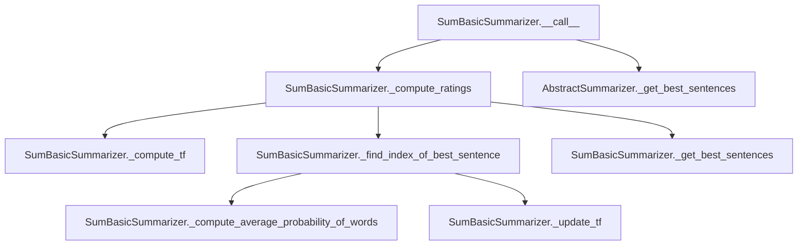

# `sum_basic.py`

## `sumy.summarizers.sum_basic.SumBasicSummarizer` · *class*

## Summary:
Implements the SumBasic summarization algorithm, a frequency-based approach that repeatedly selects sentences with the lowest word frequencies to build a summary.

## Description:
The SumBasicSummarizer implements a frequency-based text summarization technique where sentences are selected based on the inverse frequency of content words. The algorithm starts by computing term frequencies for all content words in the document, then iteratively selects sentences with the lowest average word frequency, updating the word frequencies after each selection to ensure diversity in the final summary.

This summarizer is particularly effective for creating concise summaries that capture the most frequent concepts in a document while avoiding redundancy.

## State:
- _stop_words: frozenset of normalized stop words used to filter out non-content words during summarization
- The stop_words property allows dynamic modification of the stop word set
- Inherited from AbstractSummarizer:
  - _stemmer: callable object used for stemming words during processing

## Lifecycle:
- Creation: Instantiate with optional stemmer parameter (defaults to null_stemmer from parent class)
- Usage: Call the instance with a document object and desired number of sentences to extract
- Destruction: Uses standard Python garbage collection

## Method Map:


## Raises:
- ValueError: When the stemmer parameter is not callable during parent class initialization (inherited from AbstractSummarizer)

## Example:
```python
from sumy.summarizers.sum_basic import SumBasicSummarizer
from sumy.parsers.plaintext import PlaintextParser
from sumy.nlp.tokenizers import Tokenizer

# Create summarizer instance
summarizer = SumBasicSummarizer()

# Parse document
parser = PlaintextParser.from_file("document.txt", Tokenizer("english"))
document = parser.document

# Generate summary with 3 sentences
summary = summarizer(document, 3)
for sentence in summary:
    print(sentence)
```

### `sumy.summarizers.sum_basic.SumBasicSummarizer.stop_words` · *method*

## Summary:
Sets the stop words for the summarizer by normalizing and storing them as an immutable frozenset.

## Description:
Configures the set of stop words that will be excluded from text analysis during the summarization process. This method normalizes each input word using the inherited normalize_word method before storing them as a frozenset for efficient lookup. The stop words are used by the _filter_out_stop_words method to exclude common words that don't contribute significantly to the meaning of sentences.

This method is implemented as a property setter and is typically called during object initialization or configuration to define which words should be ignored during text processing.

## Args:
    words (Iterable[str]): An iterable of words to be treated as stop words. These can be strings or other objects convertible to Unicode strings.

## Returns:
    None: This method does not return a value.

## Raises:
    None: This method does not explicitly raise exceptions, though underlying operations may raise exceptions from normalize_word or frozenset construction.

## State Changes:
    Attributes READ: None
    Attributes WRITTEN: self._stop_words

## Constraints:
    Preconditions:
    - The input `words` parameter must be iterable
    - Each item in `words` must be convertible to a Unicode string by the normalize_word method
    - The normalize_word method must be available (inherited from AbstractSummarizer)
    
    Postconditions:
    - self._stop_words is updated to a frozenset containing normalized versions of all input words
    - All existing stop words are replaced with the new set
    - The frozenset provides O(1) lookup performance for stop word filtering

## Side Effects:
    None: This method only modifies the internal state of the object and has no external side effects.

### `sumy.summarizers.sum_basic.SumBasicSummarizer.__call__` · *method*

## Summary:
Computes sentence ratings using the SumBasic algorithm and returns the highest-rated sentences from a document.

## Description:
This method implements the core summarization logic for the SumBasic algorithm by first computing term frequency-based ratings for all sentences in the document, then selecting the top-rated sentences based on the specified count. It serves as the main entry point for the summarizer's operation, orchestrating the rating computation and sentence selection processes.

The method is designed to be called on SumBasicSummarizer instances with a document and desired sentence count, following the standard summarizer interface pattern established by the AbstractSummarizer base class.

## Args:
    document (Document): The input document object containing sentences to summarize
    sentences_count (int): The number of top-rated sentences to return from the document

## Returns:
    tuple: A tuple of sentences sorted in their original order, containing the top-rated sentences according to the SumBasic algorithm

## Raises:
    None: This method does not explicitly raise exceptions, though underlying methods may raise exceptions

## State Changes:
    Attributes READ: 
    - None: This method does not read any instance attributes directly
    
    Attributes WRITTEN:
    - None: This method does not modify any instance attributes

## Constraints:
    Preconditions:
    - document must be a valid Document object with a sentences property
    - sentences_count must be a non-negative integer
    
    Postconditions:
    - Returns a tuple of sentences in their original order
    - Number of returned sentences equals sentences_count (or fewer if document has insufficient sentences)
    - All returned sentences are from the input document

## Side Effects:
    None: This method performs no I/O operations or external service calls

### `sumy.summarizers.sum_basic.SumBasicSummarizer._get_all_words_in_doc` · *method*

## Summary:
Extracts and stems all words from a collection of sentences into a flattened list.

## Description:
This method flattens a collection of sentence objects into a single list of all words contained within those sentences, then applies stemming to normalize the words. It serves as a utility for gathering all words in a document for frequency analysis and other processing tasks in the SumBasic summarization algorithm.

The method is called during the computation of term frequencies and word distributions in the summarization process, specifically when determining the importance of words in a document. It's part of the core preprocessing pipeline that prepares document words for statistical analysis.

## Args:
    sentences (iterable): An iterable of sentence objects, each expected to have a `words` attribute containing a sequence of words (typically strings).

## Returns:
    list: A list of stemmed words extracted from all sentences, with each word processed through the summarizer's stemmer. The order preserves the sequential order of sentences and words within each sentence.

## Raises:
    None explicitly raised by this method.

## State Changes:
    Attributes READ: 
    - self.stem_word: Used internally via the _stem_words method
    - self._stemmer: Accessed indirectly through stem_word method
    
    Attributes WRITTEN: None

## Constraints:
    Preconditions:
    - Each item in sentences must have a `words` attribute that is iterable
    - The `words` attribute of each sentence must contain elements compatible with the summarizer's stemmer
    - All sentences must be valid objects with proper word attributes
    
    Postconditions:
    - Returns a list of stemmed words with no duplicates or filtering applied
    - The returned list maintains the sequential order of words as they appear in the input sentences

## Side Effects:
    None

### `sumy.summarizers.sum_basic.SumBasicSummarizer._get_content_words_in_sentence` · *method*

## Summary:
Extracts and processes content words from a sentence by normalizing, filtering stop words, and stemming them for use in summarization algorithms.

## Description:
Processes a sentence's words through a three-stage pipeline to extract meaningful content words: normalization (Unicode conversion and lowercasing), stop word filtering, and stemming. This method is a core component of the SumBasic summarization algorithm that prepares sentence words for frequency analysis and scoring.

Known callers:
- `_compute_ratings`: Called during the iterative sentence selection process to compute word frequencies and sentence ratings
- `_get_all_content_words_in_doc`: Called during document-level content word extraction to ensure consistent preprocessing

This method is separated from inline processing to promote code reuse and maintainability, ensuring consistent word preprocessing across different stages of the summarization process.

## Args:
    sentence: A sentence object containing a `words` attribute that is iterable and contains word objects

## Returns:
    list[str]: A list of stemmed, normalized content words from the input sentence, excluding stop words

## Raises:
    None explicitly raised.

## State Changes:
    Attributes READ: 
    - self._normalize_words (inherited from AbstractSummarizer)
    - self._filter_out_stop_words (inherited from AbstractSummarizer)
    - self._stem_words (inherited from AbstractSummarizer)
    - self.stop_words (property that accesses self._stop_words)

## Constraints:
    Preconditions:
    - The sentence parameter must have a `words` attribute that is iterable
    - Each word in sentence.words must be compatible with the inherited normalize_word method
    - The instance must have a valid stop_words set (frozenset) available via the stop_words property
    
    Postconditions:
    - Returns a list of processed words with the same order as content words in the input sentence
    - All returned words are guaranteed to not be in the instance's stop_words set
    - All returned words are normalized and stemmed

## Side Effects:
    None.

### `sumy.summarizers.sum_basic.SumBasicSummarizer._stem_words` · *method*

## Summary:
Applies stemming to a list of words using the summarizer's stemmer function.

## Description:
Transforms a collection of words into their stemmed forms by applying the summarizer's stem_word method to each word in the input list. This method serves as a utility for consistent word normalization in text processing pipelines, ensuring that words with similar meanings are represented uniformly regardless of their inflected forms.

The method is called during various stages of the summarization process, particularly when preparing words for frequency analysis and content word filtering. It's part of the preprocessing pipeline that standardizes text representation before further analysis.

## Args:
    words (list): A list of words (strings or other objects convertible to strings) that need to be stemmed.

## Returns:
    list[str]: A list of stemmed words, where each word has been processed through the summarizer's stemmer function.

## Raises:
    None explicitly raised by this method.

## State Changes:
    Attributes READ: 
    - self.stem_word: The stem_word method inherited from AbstractSummarizer that performs the actual stemming operation
    
    Attributes WRITTEN: None

## Constraints:
    Preconditions:
    - The summarizer instance must be properly initialized with a valid stemmer
    - Input words must be iterable and convertible to strings
    - Each word in the input list should be compatible with the stem_word method
    
    Postconditions:
    - Returns a list of strings representing the stemmed versions of input words
    - Original input list remains unmodified
    - All words in the returned list are stemmed using the same stemmer instance

## Side Effects:
    None

### `sumy.summarizers.sum_basic.SumBasicSummarizer._normalize_words` · *method*

## Summary:
Normalizes a list of words by applying Unicode conversion and lowercasing to each word.

## Description:
Processes a collection of words by applying the inherited normalize_word() method to each element. This utility method standardizes text representation across all words in the input list, ensuring consistent formatting for subsequent text processing steps in the summarization algorithm.

The method is typically called during text preprocessing phases where uniform word representation is required for accurate frequency calculations and word analysis.

## Args:
    words (list): A list of words (or objects convertible to strings) that need normalization.

## Returns:
    list[str]: A new list containing the normalized versions of all input words, each converted to lowercase Unicode strings.

## Raises:
    UnicodeDecodeError: When any individual word in the input list cannot be decoded as valid UTF-8 during Unicode conversion.

## State Changes:
    Attributes READ: None
    Attributes WRITTEN: None

## Constraints:
    Preconditions:
    - Input must be a list-like object containing elements that can be processed by normalize_word()
    - Each element in the list should be convertible to a Unicode string representation
    
    Postconditions:
    - Returns a new list with identical length to input
    - All returned strings are lowercase Unicode representations
    - Original input list is not modified

## Side Effects:
    None

### `sumy.summarizers.sum_basic.SumBasicSummarizer._filter_out_stop_words` · *method*

## Summary:
Filters out stop words from a list of words, returning only those that are not in the configured stop words set.

## Description:
Removes common stop words (such as articles, prepositions, and conjunctions) from a collection of words to isolate meaningful content words for text summarization. This method is used internally by the SumBasic algorithm to process sentences and documents before computing word frequencies and sentence ratings.

The method is called during the preprocessing phase of text summarization, specifically when extracting content words from sentences and documents. It's separated into its own method to promote code reuse and maintainability, as the same filtering logic is needed in multiple places within the summarizer.

## Args:
    words (list[str]): A list of words to filter, typically normalized and stemmed words from text processing.

## Returns:
    list[str]: A filtered list containing only words that are not present in the summarizer's stop words set.

## Raises:
    None explicitly raised.

## State Changes:
    Attributes READ: self.stop_words
    Attributes WRITTEN: None

## Constraints:
    Preconditions: 
    - The `words` parameter must be iterable and contain string elements
    - The `self.stop_words` attribute must be a set-like object supporting the `in` operator
    
    Postconditions:
    - The returned list contains only words that were in the input `words` list but not in `self.stop_words`
    - The order of words in the result preserves their original order from the input

## Side Effects:
    None.

### `sumy.summarizers.sum_basic.SumBasicSummarizer._compute_word_freq` · *method*

## Summary:
Computes the frequency count of each word in a list of words.

## Description:
Takes a list of words and returns a dictionary mapping each unique word to its occurrence count. This utility method is used to calculate word frequencies for various text processing operations within the SumBasic summarization algorithm.

Known callers:
- `_compute_tf`: Called during term frequency calculation to compute raw word frequencies before normalization

This method serves as a fundamental building block for frequency calculations and is separated from the main computation logic to promote code reuse and maintainability.

## Args:
    list_of_words (list): A list of words (strings) for which to compute frequencies

## Returns:
    dict[str, int]: A dictionary mapping each unique word to its frequency count in the input list

## Raises:
    None

## State Changes:
    Attributes READ: None
    Attributes WRITTEN: None

## Constraints:
    Preconditions:
    - The `list_of_words` parameter must be iterable
    - Each item in `list_of_words` should be hashable (typically strings)
    
    Postconditions:
    - Returns a dictionary with exactly one entry per unique word in the input list
    - All values in the returned dictionary are positive integers representing counts
    - The returned dictionary is empty if the input list is empty

## Side Effects:
    None

### `sumy.summarizers.sum_basic.SumBasicSummarizer._get_all_content_words_in_doc` · *method*

## Summary:
Extracts and normalizes all content words from a collection of sentences, filtering out stop words and applying text normalization.

## Description:
Processes a collection of sentences to extract all words, removes stop words, and applies text normalization to produce a list of content words suitable for frequency analysis in summarization algorithms. This method is a key component in the SumBasic summarization approach, preparing document-level content for term frequency computation.

The method is called during the term frequency calculation phase of the summarization process, specifically in the `_compute_tf` method. It chains together three fundamental text processing operations: word extraction, stop word filtering, and normalization.

Known callers:
- `_compute_tf`: Called during the term frequency computation phase of SumBasic summarization to prepare content words for frequency analysis

This method is separated from inline processing to promote code reuse and maintainability, ensuring consistent content word extraction across different parts of the summarization pipeline.

## Args:
    sentences (list): A collection of sentence objects, each having a 'words' attribute containing a list of words.

## Returns:
    list[str]: A list of normalized content words (strings) extracted from all sentences, with stop words removed and text normalized.

## Raises:
    None explicitly raised.

## State Changes:
    Attributes READ: self.stop_words (via _filter_out_stop_words), self.normalize_word (via _normalize_words)
    Attributes WRITTEN: None

## Constraints:
    Preconditions:
    - Input 'sentences' must be iterable
    - Each item in 'sentences' must have a 'words' attribute that is iterable
    - The 'words' attribute of each sentence must contain string elements
    
    Postconditions:
    - Returns a list of normalized words with stop words removed
    - All returned words are guaranteed to not be in the instance's stop words set
    - The returned list maintains the order of words as they appear in the input sentences

## Side Effects:
    None.

### `sumy.summarizers.sum_basic.SumBasicSummarizer._compute_tf` · *method*

## Summary:
Computes term frequency for content words in a collection of sentences.

## Description:
Calculates the term frequency (TF) of each content word in the provided sentences by counting occurrences and normalizing by the total number of content words. This method extracts all content words from the document, computes their frequency distribution, and converts these counts into probabilities (term frequencies).

Known callers:
- `_compute_ratings`: Called during the sentence rating computation process in the SumBasic summarization algorithm to establish baseline word frequencies

This method encapsulates the complete term frequency computation workflow for content words, making it reusable across different stages of the summarization process while ensuring consistent processing of content words.

## Args:
    sentences (list): A list of sentence objects containing words to process

## Returns:
    dict[str, float]: A dictionary mapping each unique content word to its term frequency (probability) in the document

## Raises:
    None

## State Changes:
    Attributes READ: None
    Attributes WRITTEN: None

## Constraints:
    Preconditions:
    - The `sentences` parameter must be iterable and contain objects with a `words` attribute
    - Each item in `sentences`'s `words` attribute must be a string
    
    Postconditions:
    - Returns a dictionary with exactly one entry per unique content word in the input sentences
    - All values in the returned dictionary are floating-point numbers between 0 and 1
    - The sum of all term frequencies equals 1.0

## Side Effects:
    None

### `sumy.summarizers.sum_basic.SumBasicSummarizer._compute_average_probability_of_words` · *method*

## Summary:
Computes the average frequency of content words in a sentence based on document-level word frequencies.

## Description:
This static helper method calculates the mean frequency of content words within a sentence by averaging their document-level frequencies. It serves as a core component in the SumBasic summarization algorithm for evaluating sentence importance based on word frequency characteristics.

Known callers:
- `_find_index_of_best_sentence`: Called during the iterative sentence selection process to score sentences based on their average word frequencies
- This method is part of the sentence scoring mechanism in the SumBasic algorithm where sentences are ranked by their content word frequency averages

This logic is separated into its own method to promote code reuse and maintainability, as the average frequency calculation is a fundamental operation used in the sentence ranking process. The method handles edge cases like empty sentences gracefully by returning zero.

## Args:
    word_freq_in_doc (dict[str, float]): Dictionary mapping words to their document-level frequency values
    content_words_in_sentence (list[str]): List of content words extracted from a sentence

## Returns:
    float: Average frequency of content words in the sentence, or 0 if no content words exist

## Raises:
    KeyError: If any word in content_words_in_sentence is not present in word_freq_in_doc
    TypeError: If word_freq_in_doc is not a dictionary or content_words_in_sentence is not a list

## State Changes:
    Attributes READ: None
    Attributes WRITTEN: None

## Constraints:
    Preconditions:
    - word_freq_in_doc must be a dictionary with string keys and numeric values
    - content_words_in_sentence must be a list of strings that are keys in word_freq_in_doc
    - All words in content_words_in_sentence must be present in word_freq_in_doc
    
    Postconditions:
    - Returns a non-negative floating-point number
    - If content_words_in_sentence is empty, returns 0
    - If content_words_in_sentence contains words not in word_freq_in_doc, raises KeyError

## Side Effects:
    None: This method performs no I/O operations or external service calls

### `sumy.summarizers.sum_basic.SumBasicSummarizer._update_tf` · *method*

## Summary:
Updates term frequencies by squaring the frequency values of specified words, reducing their influence in subsequent sentence selection rounds.

## Description:
This private helper method implements a key component of the SumBasic summarization algorithm by modifying word frequency distributions. After each sentence is selected for inclusion in the summary, the frequencies of its content words are squared to reduce their impact on future selection decisions. This creates a diminishing returns effect where frequently occurring words become less dominant over time.

Known callers:
- `_compute_ratings`: Called during the iterative sentence selection process to update word frequencies after each sentence selection, ensuring previously selected sentences don't dominate subsequent choices

This method is separated from inline logic to encapsulate the frequency update behavior, making the summarization algorithm's core mechanics explicit and testable. The squaring operation is a fundamental aspect of the SumBasic approach to prevent over-selection of highly frequent words.

## Args:
    word_freq (dict[str, float]): Dictionary mapping words to their current frequency values in the document
    words_to_update (list[str]): List of words whose frequency values should be updated by squaring

## Returns:
    dict[str, float]: The updated word_freq dictionary with specified words having their frequency values squared

## Raises:
    KeyError: If any word in words_to_update is not present as a key in word_freq dictionary

## State Changes:
    Attributes READ: None
    Attributes WRITTEN: None

## Constraints:
    Preconditions:
    - word_freq must be a dictionary with string keys and numeric values representing word frequencies
    - words_to_update must be a list of strings that are keys in word_freq
    - All words in words_to_update must exist as keys in word_freq
    
    Postconditions:
    - All specified words in words_to_update have their frequency values squared in word_freq
    - The returned dictionary is identical to the input word_freq dictionary (in-place modification)
    - Frequency values remain non-negative after squaring

## Side Effects:
    None: This method performs no I/O operations or external service calls

### `sumy.summarizers.sum_basic.SumBasicSummarizer._find_index_of_best_sentence` · *method*

## Summary:
Finds the index of the sentence with the highest average word frequency probability among a collection of sentences.

## Description:
This private method implements the core sentence selection logic for the SumBasic summarization algorithm. It iterates through a list of sentences represented as word lists and identifies the sentence with the maximum average word frequency probability. The method is called during the iterative sentence selection process in `_compute_ratings` to determine which sentence should be selected next based on word frequency characteristics.

The method is separated from inline logic to promote code modularity and reusability within the summarization process. It leverages the `_compute_average_probability_of_words` helper method to calculate the average frequency for each sentence.

## Args:
    word_freq (dict[str, float]): Dictionary mapping words to their document-level frequency values
    sentences_as_words (list[list[str]]): List of sentences, where each sentence is represented as a list of words

## Returns:
    int: Index of the sentence with the highest average word frequency probability in the sentences_as_words list. Returns 0 if sentences_as_words is empty.

## Raises:
    KeyError: If any word in sentences_as_words is not present in word_freq dictionary
    TypeError: If word_freq is not a dictionary or sentences_as_words is not a list of lists

## State Changes:
    Attributes READ: None
    Attributes WRITTEN: None

## Constraints:
    Preconditions:
    - word_freq must be a dictionary with string keys and numeric values representing word frequencies
    - sentences_as_words must be a list of lists, where inner lists contain strings (words)
    - Each word in sentences_as_words must exist as a key in word_freq
    - word_freq should contain all words that appear in sentences_as_words
    
    Postconditions:
    - Returns an integer index within the valid range [0, len(sentences_as_words)) when sentences_as_words is not empty
    - Returns 0 when sentences_as_words is empty
    - The returned index corresponds to the sentence with maximum average word frequency probability

## Side Effects:
    None: This method performs no I/O operations or external service calls

### `sumy.summarizers.sum_basic.SumBasicSummarizer._compute_ratings` · *method*

## Summary:
Computes sentence ratings using a greedy selection algorithm based on word frequency distribution in SumBasic summarization.

## Description:
Implements the core sentence ranking mechanism for SumBasic summarization by iteratively selecting sentences with the lowest word frequency. The algorithm maintains a running frequency distribution of content words and repeatedly chooses the sentence whose content words have the lowest average frequency, updating the frequency distribution after each selection.

This method is called during the summarization process to rank sentences according to their importance for inclusion in the final summary. The ratings assigned are negative integers that represent the selection order (most important first, with -1 being the first selected sentence).

Known callers:
- `__call__`: Invoked during the main summarization workflow to compute sentence rankings before selecting the top sentences

This method is separated from the main `__call__` method to encapsulate the core ranking logic, making the summarization process modular and easier to test independently.

## Args:
    sentences (Iterable[Sentence]): Collection of sentence objects to rate

## Returns:
    dict[Sentence, int]: Mapping from sentence objects to their computed ratings (negative integers indicating selection order, where -1 is the first selected sentence)

## Raises:
    None explicitly raised

## State Changes:
    Attributes READ: None
    Attributes WRITTEN: None

## Constraints:
    Preconditions:
    - Input sentences must be iterable and contain valid sentence objects
    - Each sentence should have a valid `words` attribute for content word extraction
    
    Postconditions:
    - Returns a dictionary mapping each input sentence to exactly one rating
    - Ratings are negative integers starting from -1, decreasing for subsequent selections
    - All sentences in the input collection are processed and included in the output

## Side Effects:
    None: This method performs no I/O operations or external service calls

