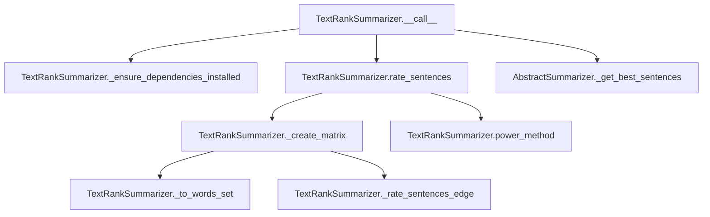

# `text_rank.py`

## `sumy.summarizers.text_rank.TextRankSummarizer` · *class*

## Summary:
Implements the TextRank algorithm for automatic text summarization by ranking sentences based on their importance within a document.

## Description:
The TextRankSummarizer applies the TextRank algorithm to identify and extract the most important sentences from a document. It constructs a similarity matrix between sentences based on shared words, then uses a power iteration method to compute sentence rankings. This approach treats sentences as nodes in a graph where edges represent similarity, and sentence importance is determined by their connectivity within this graph.

This summarizer is particularly effective for extracting key information from documents while preserving the original sentence structure and meaning. It's commonly used in applications requiring concise document summaries that maintain readability and coherence.

## State:
- epsilon (float): Convergence threshold for the power method iteration, defaults to 1e-4
- damping (float): Damping factor for the random walk in TextRank algorithm, defaults to 0.85
- _ZERO_DIVISION_PREVENTION (float): Small value added to prevent division by zero, defaults to 1e-7
- _stop_words (frozenset): Set of normalized words to exclude from sentence similarity calculations, initially empty

## Lifecycle:
- Creation: Instantiate with optional stemmer parameter (inherited from AbstractSummarizer)
- Usage: Call the instance with a document object and desired number of sentences to extract
- Destruction: Uses standard Python garbage collection

## Method Map:


## Raises:
- ValueError: When NumPy dependency is not installed, with message indicating installation command
- ValueError: When stemmer parameter is not callable during parent class initialization

## Example:
```python
from sumy.summarizers.text_rank import TextRankSummarizer
from sumy.parsers.plaintext import PlaintextParser
from sumy.nlp.tokenizers import Tokenizer

# Create parser and tokenizer
parser = PlaintextParser.from_file("document.txt", Tokenizer("english"))
summarizer = TextRankSummarizer()

# Set custom stop words if needed
summarizer.stop_words = ["the", "and", "or"]

# Generate summary with 3 sentences
summary = summarizer(parser.document, 3)

# Print results
for sentence in summary:
    print(sentence)
```

### `sumy.summarizers.text_rank.TextRankSummarizer.stop_words` · *method*

## Summary:
Sets the collection of stop words used to filter out common words during text processing in the TextRank summarization algorithm.

## Description:
Configures the stop words collection that will be used to filter out common, non-informative words during sentence processing. This method is part of the TextRankSummarizer's property-based interface for managing stop word configuration. The stop words are normalized using the inherited `normalize_word` method to ensure consistent text processing regardless of input case or encoding.

The setter is called during initialization or configuration phases when setting custom stop word lists. It's used by the `_to_words_set` method to remove stop words from sentences before calculating similarity scores in the TextRank algorithm.

## Args:
    words (Iterable[str]): An iterable of words to be used as stop words. These will be normalized to lowercase Unicode strings.

## Returns:
    None: This method does not return a value.

## Raises:
    None explicitly raised, though underlying `normalize_word` method may raise exceptions during word conversion.

## State Changes:
    Attributes READ: 
    - self.normalize_word: Method used to normalize each stop word
    
    Attributes WRITTEN:
    - self._stop_words: Replaced with a frozenset of normalized stop words

## Constraints:
    Preconditions:
    - Input `words` must be iterable and contain elements that can be processed by `normalize_word`
    - `self.normalize_word` method must be callable
    
    Postconditions:
    - `self._stop_words` is replaced with a frozenset of normalized words
    - All stop words are converted to lowercase Unicode strings
    - The resulting frozenset is immutable and hashable for efficient lookup

## Side Effects:
    None: This method only modifies the internal state of the object and has no external side effects.

### `sumy.summarizers.text_rank.TextRankSummarizer.__call__` · *method*

## Summary:
Executes the TextRank algorithm to summarize a document by ranking sentences and returning the highest-ranked ones.

## Description:
This method implements the core TextRank summarization algorithm. It first ensures all required dependencies are installed, then checks if the document contains sentences. If the document is empty, it returns an empty tuple. Otherwise, it computes sentence rankings using the TextRank algorithm and returns the specified number of top-ranked sentences in their original order.

The method serves as the main entry point for the summarization process, orchestrating the dependency checking, sentence rating computation, and result selection phases.

## Args:
    document (Document): The input document containing sentences to be summarized
    sentences_count (int): The number of top-ranked sentences to return from the document

## Returns:
    tuple: A tuple of sentences sorted in their original order, containing the top-ranked sentences according to the TextRank algorithm

## Raises:
    ValueError: When required NumPy dependency is not installed (triggered by _ensure_dependencies_installed)

## State Changes:
    Attributes READ: None
    Attributes WRITTEN: None

## Constraints:
    Preconditions:
        - The document parameter must be a valid Document object with a sentences attribute
        - The sentences_count parameter must be a non-negative integer
        - NumPy must be installed for the algorithm to function
        
    Postconditions:
        - Returns a tuple of sentences in their original order
        - Number of returned sentences equals sentences_count (or fewer if document has fewer sentences)
        - All returned sentences are from the input document

## Side Effects:
    I/O: May raise ValueError if NumPy is not installed
    External service calls: None
    Mutations to objects outside self: None

### `sumy.summarizers.text_rank.TextRankSummarizer._ensure_dependencies_installed` · *method*

## Summary:
Ensures NumPy dependency is available for TextRank summarization operations.

## Description:
Validates that the NumPy library is properly installed and importable. This method is called during the summarization process to prevent runtime errors when numerical computations are required. It's designed as a static method to avoid requiring an instance of the class while ensuring proper dependency availability.

## Args:
    None

## Returns:
    None

## Raises:
    ValueError: When NumPy is not available or importable, with a descriptive message instructing users to install NumPy via 'pip install numpy'.

## State Changes:
    Attributes READ: None
    Attributes WRITTEN: None

## Constraints:
    Preconditions: The method assumes that the module-level numpy import is available.
    Postconditions: If execution continues past this method, NumPy is confirmed to be available.

## Side Effects:
    None

### `sumy.summarizers.text_rank.TextRankSummarizer.rate_sentences` · *method*

## Summary:
Computes normalized sentence importance scores using the TextRank algorithm's power iteration method.

## Description:
Calculates relative importance scores for each sentence in a document by constructing a similarity matrix and applying the power method to find the principal eigenvector. This method is called internally by the TextRank summarization pipeline during the sentence ranking phase.

The method serves as a key component in the TextRank algorithm implementation, separating the matrix construction and ranking computation logic for better modularity and testability. It is invoked by the `__call__` method during the summarization process.

## Args:
    document (Document): The input document containing sentences to be ranked

## Returns:
    dict: A dictionary mapping each sentence object to its computed normalized importance score (float between 0 and 1)

## Raises:
    None explicitly raised, but may propagate exceptions from internal method calls

## State Changes:
    Attributes READ:
    - self.epsilon: Convergence threshold for the power method iteration (typically 1e-4)
    - self.damping: Damping factor for the TextRank algorithm (typically 0.85)
    - self._ZERO_DIVISION_PREVENTION: Small value to prevent division by zero (typically 1e-7)
    
    Attributes WRITTEN: None

## Constraints:
    Preconditions:
        - Document must contain at least one sentence
        - Document.sentences must be iterable
        - Internal helper methods (_create_matrix, power_method) must be properly implemented
    
    Postconditions:
        - Returned dictionary has one entry for each sentence in the document
        - All rank values are non-negative floating-point numbers between 0 and 1
        - Dictionary keys are the original sentence objects from the document

## Side Effects:
    None

### `sumy.summarizers.text_rank.TextRankSummarizer._create_matrix` · *method*

## Summary:
Creates a normalized weight matrix for sentence ranking using the TextRank algorithm.

## Description:
Constructs a square matrix where each cell represents the similarity rating between two sentences. This matrix is used as input for the power method to compute sentence importance scores. The method implements the core TextRank weighting mechanism by calculating sentence similarities and normalizing them according to the PageRank formula.

This method is separated from `rate_sentences` to encapsulate the matrix creation logic, making the code more modular and testable. The matrix construction follows the standard TextRank approach where sentence similarities are computed and then normalized to form a stochastic transition matrix.

## Args:
    document (Document): The document object containing sentences to process.

## Returns:
    numpy.ndarray: A square matrix of shape (n_sentences, n_sentences) where each element represents the weighted connection between two sentences.

## Raises:
    None explicitly raised, but may propagate exceptions from internal method calls.

## State Changes:
    Attributes READ: 
    - self.damping
    - self._ZERO_DIVISION_PREVENTION
    
    Attributes WRITTEN: None

## Constraints:
    Preconditions:
    - Document must have at least one sentence
    - Document.sentences must be iterable
    - Internal helper methods (_to_words_set, _rate_sentences_edge) must be properly implemented
    
    Postconditions:
    - Returned matrix is normalized (rows sum to 1)
    - Matrix dimensions equal number of sentences in document
    - All values are non-negative

## Side Effects:
    None

### `sumy.summarizers.text_rank.TextRankSummarizer._to_words_set` · *method*

## Summary:
Converts a sentence's words into a filtered list of stemmed, normalized words by removing stop words.

## Description:
Processes a sentence by normalizing each word, applying stemming, and filtering out stop words to create a standardized representation for text analysis. This method serves as a core text preprocessing step in the TextRank summarization algorithm, transforming raw sentence content into a format suitable for similarity calculations and ranking.

The method is called during the matrix creation phase (`_create_matrix`) when preparing sentences for comparison operations. It's separated from inline processing to ensure consistent text normalization and filtering across all sentence processing operations in the summarizer.

## Args:
    sentence (Sentence): A sentence object containing a `words` attribute that provides access to individual words in the sentence.

## Returns:
    list[str]: A list of stemmed, normalized words that are not in the stop words collection, representing the core lexical content of the input sentence.

## Raises:
    None explicitly raised, though underlying methods may raise exceptions during word normalization or stemming.

## State Changes:
    Attributes READ: 
    - self._stop_words: Frozen set of stop words used for filtering
    - self.normalize_word: Method for normalizing words to Unicode lowercase
    - self.stem_word: Method for applying stemming to normalized words
    
    Attributes WRITTEN: None

## Constraints:
    Preconditions:
    - Sentence object must have a `words` attribute that is iterable
    - `self._stop_words` must be a frozenset or similar hashable collection
    - `self.normalize_word` and `self.stem_word` methods must be callable
    
    Postconditions:
    - Returns a list of strings (stemmed words)
    - All returned words are normalized and not in stop words collection
    - Original sentence object is not modified

## Side Effects:
    None: This method has no side effects beyond reading from the object's attributes and returning a computed value.

### `sumy.summarizers.text_rank.TextRankSummarizer._rate_sentences_edge` · *method*

## Summary:
Calculates a normalized similarity score between two sets of words based on their overlapping content.

## Description:
This static method computes a similarity rating between two sequences of words using a combination of word overlap counting and logarithmic normalization. It's designed specifically for TextRank-based sentence similarity calculations in document summarization.

The method is called during matrix creation in the TextRank summarization process to determine pairwise sentence similarities. It's separated into its own method to encapsulate the similarity calculation logic and make the matrix creation code cleaner and more readable.

## Args:
    words1 (list[str]): First sequence of words to compare
    words2 (list[str]): Second sequence of words to compare

## Returns:
    float: Normalized similarity score between 0.0 and 1.0, where 0.0 indicates no overlap and higher values indicate greater similarity

## Raises:
    AssertionError: When either words1 or words2 has zero length (though this shouldn't occur in normal operation)

## State Changes:
    None

## Constraints:
    Preconditions:
        - Both words1 and words2 must be non-empty sequences
        - The method assumes both parameters contain valid word tokens
    
    Postconditions:
        - Returns a float value in the range [0.0, 1.0]
        - If words1 and words2 have no common words, returns 0.0
        - If words1 and words2 are identical, returns 1.0 (or very close to 1.0)

## Side Effects:
    None

### `sumy.summarizers.text_rank.TextRankSummarizer.power_method` · *method*

## Summary:
Computes the principal eigenvector of a transition matrix using the power iteration method for sentence ranking.

## Description:
Implements the power iteration algorithm to find the dominant eigenvector of a transition matrix, which represents the relative importance or ranking of sentences in a document. This method is used internally by TextRankSummarizer to compute sentence scores based on their connectivity in the sentence similarity graph.

The algorithm starts with an initial uniform probability distribution and iteratively applies the transition matrix until convergence is achieved within the specified epsilon threshold.

## Args:
    matrix (numpy.ndarray): Square transition matrix where each row represents the probability of transitioning from one sentence to all others. Must be a square matrix with dimensions n×n.
    epsilon (float): Convergence threshold for the iterative process. Algorithm stops when the difference between successive iterations is less than this value. Typically set to a small positive value like 1e-4.

## Returns:
    numpy.ndarray: Probability vector of length n containing normalized sentence rankings, where each element represents the relative importance of the corresponding sentence in the document.

## Raises:
    None explicitly raised, but may raise numpy-related exceptions if matrix operations fail.

## State Changes:
    None - This is a pure function that does not modify any object state.

## Constraints:
    Preconditions:
        - Matrix must be a square numpy array
        - Epsilon must be a positive float value
        - Matrix rows should represent valid probability distributions (though not strictly enforced)
    
    Postconditions:
        - Returned vector elements sum to approximately 1.0 (normalized probabilities)
        - Vector length equals the number of rows/columns in the input matrix

## Side Effects:
    None - This function is pure and has no side effects beyond standard numpy operations.

